# FishMMO Connection Pipeline

> **Complete end-to-end connection flow** — from client launch through authentication, world entry, and gameplay.
> Built on QUIC/WebTransport (UDP) via MsQuic, NGINX L4 stream proxy, and FishNetworking.

---

## Table of Contents

- [Architecture Overview](#architecture-overview)
- [Infrastructure Topology](#infrastructure-topology)
- [Connection Flow Diagram](#connection-flow-diagram)
  - [Phase 1: Launcher Startup & Version Check](#phase-1-launcher-startup--version-check)
  - [Phase 2: Login Server Discovery (IPFetch)](#phase-2-login-server-discovery-ipfetch)
  - [Phase 3: QUIC/WebTransport Connection](#phase-3-quicwebtransport-connection)
  - [Phase 4: Cryptographic Handshake (X25519 ECDH)](#phase-4-cryptographic-handshake-x25519-ecdh)
  - [Phase 5: SRP-6a Authentication](#phase-5-srp-6a-authentication)
  - [Phase 6: TOTP Two-Factor Authentication](#phase-6-totp-two-factor-authentication)
  - [Phase 7: Token Issuance & Character Select](#phase-7-token-issuance--character-select)
  - [Phase 8: World Server Connection](#phase-8-world-server-connection)
  - [Phase 9: Scene Server Connection](#phase-9-scene-server-connection)
  - [Phase 10: Token Renewal & Revocation](#phase-10-token-renewal--revocation)
  - [Phase 11: Scene Transfer & Character Session Ownership](#phase-11-scene-transfer--character-session-ownership)
- [Protocol Layers](#protocol-layers)
- [Security Properties](#security-properties)
- [Rate Limiting & DDoS Protection](#rate-limiting--ddos-protection)
- [Reconnection Flow](#reconnection-flow)
- [Platform Support Matrix](#platform-support-matrix)
- [Port Reference](#port-reference)

---

## Architecture Overview

```
┌──────────────────────────────────────────────────────────────────────┐
│                        FISHMMO CONNECTION STACK                       │
│                                                                      │
│  ┌─────────┐    ┌─────────┐    ┌──────────┐    ┌──────────────────┐ │
│  │ Client  │◄──►│  NGINX  │◄──►│  Game    │◄──►│   PostgreSQL     │ │
│  │ (Unity) │    │ (L4/L7) │    │ Servers  │    │   + pgBouncer    │ │
│  └─────────┘    └─────────┘    └──────────┘    └──────────────────┘ │
│       │              │               │                    │          │
│       │   Gameplay: WebTransport (QUIC/HTTP3) — every platform       │
│       │   UDP via NGINX L4 stream proxy → loopback                   │
│       │                              │        EF Core + Npgsql       │
│       │   Web APIs: HTTPS/TCP via NGINX L7 reverse proxy             │
│       └──────────────────────────────┘                               │
└──────────────────────────────────────────────────────────────────────┘
```

> **There is exactly one gameplay transport: WebTransport over QUIC/HTTP3.**
> There is no WebSocket or WSS path, no TCP fallback, and no per-platform
> transport shim. WebGL is not an exception — browsers reach the same QUIC
> servers on the same ports through the W3C `WebTransport` API. No WebSocket
> transport is present in the project at all.

**Key design decisions:**

| Decision | Rationale |
|----------|-----------|
| **WebTransport (QUIC) for all platforms** | One transport everywhere — no TCP fallback, no WebSocket shim, one code path to secure and debug |
| **Game servers bind loopback by default** | `Address=127.0.0.1` in every `.cfg`; the only public listener is NGINX. A game server is unreachable from the internet even if a firewall rule is wrong |
| **NGINX L4 UDP stream proxy** | Raw datagram forwarding; no TLS termination, no protocol inspection, no path routing at the game layer |
| **Each game server terminates its own TLS** | QUIC carries TLS 1.3 end-to-end (ALPN `h3`); NGINX never sees plaintext game data |
| **One-time connection token for IP recovery** | The proxy rewrites the source address, so the server sees `127.0.0.1`; the token bridges the real client IP from the HTTP layer into the QUIC layer |
| **SRP-6a + X25519 ECDH** | Zero-knowledge password proof; forward secrecy for session keys |
| **HMAC-signed auth tokens** | Stateless World/Scene server auth; no LoginServer dependency after login |

### Static Deployment Architecture

```
                            ┌──────────────────────────────────────────────────────────┐
                            │                       INTERNET                           │
                            │  (Public-facing: ports 80/TCP, 443/TCP, 7770-7999/UDP)   │
                            └──────────┬───────────────┬───────────────────┬───────────┘
                                       │               │                   │
                          ┌────────────┴────┐   ┌──────┴───────┐   ┌──────┴───────┐
                          │   HTTPS API     │   │ WebGL client │   │ WebTransport │
                          │   TCP :443      │   │  static TCP  │   │  QUIC/HTTP3  │
                          │  api.fishmmo.com│   │  :443        │   │  UDP         │
                          │                 │   │ play.fishmmo │   │  :7770-7999  │
                          │                 │   │              │   │ game.fishmmo │
                          └────────┬────────┘   └──────┬───────┘   └──────┬───────┘
                                   │                    │                  │
                                   │      (browser gameplay traffic also   │
                                   │       uses WebTransport, not WSS) ────┤
                                   │                    │                  │
                          ┌────────┴────────────────────┴──────────────────┴────────┐
                          │                   NGINX REVERSE PROXY                   │
                          │  L4 UDP stream proxy for game ports (:7770-7999)        │
                          │      → raw datagrams to 127.0.0.1, no TLS termination   │
                          │  L7 HTTPS reverse proxy for web servers (:80/443)       │
                          │      → TLS terminated here, for web services ONLY       │
                          │  Rate limiting                                          │
                          └──────┬────────────┬────────────────┬───────────────────┘
                                 │            │                │
                    ┌────────────┴──┐  ┌──────┴─────────┐  ┌───┴──────────┐
                    │  Web Servers   │  │  Game Servers  │  │  WebGL       │
                    │  127.0.0.1     │  │  127.0.0.1     │  │  Static      │
                    │                │  │  (own QUIC/TLS)│  │  127.0.0.1   │
                    │  IPFetch :8080 │  │                │  │  :8000       │
                    │  Patcher :8090 │  │  Login  :7770  │  └─────────────┘
                    └────────┬───────┘  │  World  :7780  │
                             │          │  Scene  :7790+ │
                             │          └────────┬───────┘
                             │                    │
                    ┌────────┴────────────────────┴──────────────────────────┐
                    │                   POSTGRESQL / pgBouncer               │
                    │  pgBouncer :6432 (connection pooling)                  │
                    │  PostgreSQL :5432 (database, localhost only)           │
                    │                                                       │
                    │  Web servers (IPFetch, Patcher) → DB for config/auth  │
                    │  LoginServer → DB for accounts, characters, tokens    │
                    │  WorldServer → DB for signing keys, world state       │
                    │  SceneServer → DB for scene state, character data     │
                    └───────────────────────────────────────────────────────┘
```

**Data flow summary:**
- **Client → NGINX (HTTPS :443) → IPFetch :8080 / Patcher :8090**: Login server discovery, version check, patching
- **Client → NGINX (QUIC/UDP :7770-7999) → Login/World/Scene servers**: Gameplay traffic (end-to-end encrypted, NGINX forwards raw UDP)
- **Browser client → NGINX (HTTPS :443) → WebGL :8000**: Static assets only. Once loaded, the browser's gameplay traffic takes the same QUIC/UDP path as a native client
- **All game servers → PostgreSQL**: Persistence (accounts, characters, world state)
- **IPFetch / Patcher → PostgreSQL**: Auth tokens, version data

**Security domains:**
- **Public**: Ports 80 (redirect), 443 (HTTPS), 7770-7999 (QUIC/UDP game ports via NGINX)
- **Private (localhost only)**: PostgreSQL :5432, pgBouncer :6432
- **Private (localhost only, reached through NGINX)**: IPFetch :8080, Patcher :8090, WebGL :8000, and every game server

> **Everything except NGINX binds loopback.** Each game server's `.cfg` sets
> `Address=127.0.0.1`, so it accepts datagrams only from the proxy on the same
> host. The single documented exception is running NGINX on a *different*
> machine, which requires setting `Address=0.0.0.0` (see
> [Configuration Reference](#configuration-reference)) — at which point the
> game port must be firewalled to the proxy host, because binding all
> interfaces exposes the server directly.

> For a full port listing see the [Port Reference](#port-reference) table below.

---

## Infrastructure Topology

```
                          INTERNET
                             │
              ══════════════════════════════   ← the ONLY public boundary
                             │
                    ┌────────┴─────────┐
                    │  NGINX            │
                    │  :80/:443 TCP     │
                    │  :7770-7999 UDP   │
                    └───┬────┬────┬────┘
                        │    │    │
          ┌─────────────┘    │    └─────────────┐
          │                  │                  │
     UDP :7770-7999    TCP :443/*         TCP :443/*
     L4 stream, raw    api.fishmmo.com    play.fishmmo.com
     datagrams         TLS terminated     TLS terminated
          │                  │                  │
 ─ ─ ─ ─ ─│─ ─ ─ ─ ─ ─ ─ ─ ─ │─ ─ ─ ─ ─ ─ ─ ─ ─ │─ ─  127.0.0.1 only
          │                  │                  │      below this line
    ┌─────┴──────┐    ┌──────┴──────┐    ┌──────┴──────┐
    │Game Servers│    │  IPFetch    │    │  WebGL      │
    │Login :7770 │    │  :8080      │    │  Server     │
    │World :7780 │    │  Patcher    │    │  :8000      │
    │Scene :7790+│    │  :8090      │    │             │
    │            │    └──────┬──────┘    └─────────────┘
    │ own QUIC/  │           │
    │ TLS 1.3    │           │
    └─────┬──────┘           │
          │                  │
    ┌─────┴─────┐    ┌──────┴──────┐
    │ pgBouncer │    │ PostgreSQL  │
    │ :6432     │◄──►│ :5432       │
    └───────────┘    └─────────────┘
```

---

## Connection Flow Diagram

### Phase 1: Launcher Startup & Version Check

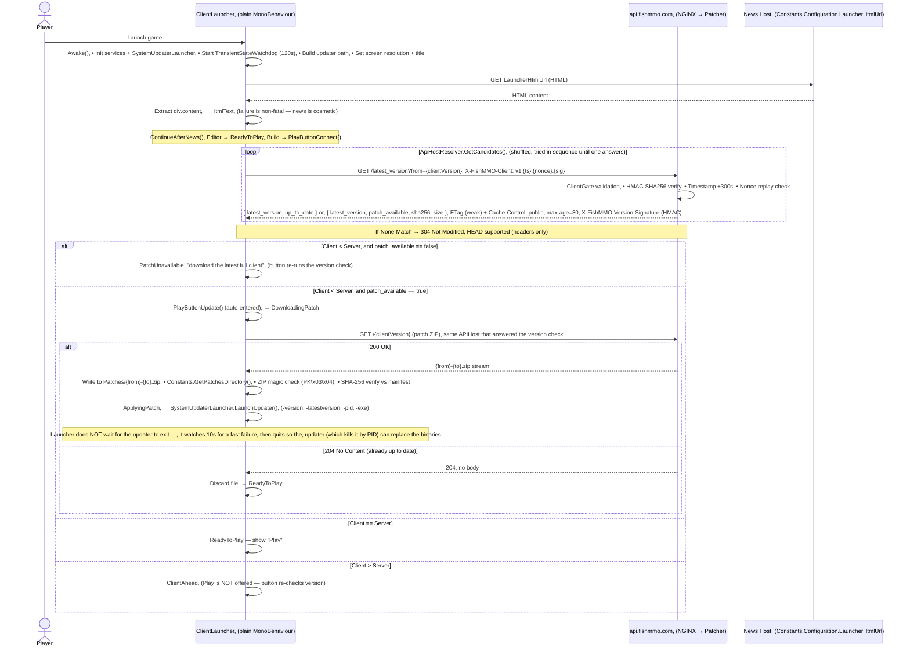

**Launcher states** (`LauncherState.cs`): `LoadingNews`, `Connecting`, `CheckingVersion`, `DownloadingPatch`,
`ApplyingPatch`, `ReadyToPlay`, `ClientAhead`, `ConnectionFailed`, `VersionCheckFailed`, `PatchDownloadFailed`,
`UpdaterFailed`, `LaunchFailed`, `PatchUnavailable`, `VersionError`, `ServerRejectedVersion`.

> `ServerRejectedVersion` is wired into the UI state machine but not yet driven by the version-check endpoint —
> version rejection is currently reported during the handshake as `ClientAuthenticationResult.VersionMismatch`
> (see [Phase 4](#phase-4-cryptographic-handshake-x25519-ecdh)).

> **Transient-state watchdog:** every state that offers the player no button
> (`LoadingNews`, `Connecting`, `CheckingVersion`, `DownloadingPatch`, `ApplyingPatch`) is guarded by a
> `transientStateTimeoutSeconds` (default 120s) watchdog. If a coroutine dies, the launcher is forced back to
> `PatchDownloadFailed` / `ConnectionFailed` instead of leaving a dead button. Download progress callbacks reset
> the timer, so a slow patch is never interrupted.

**On "Play"** (`PlayButtonLaunch`): the launcher enqueues the `ClientPostboot` scene, starts the load with
`AddressableLoadProcessor.BeginProcessQueue()` and subscribes to the returned `AddressableLoadBatch.Completed`
for failure reporting. When the scene loads it unloads the `ClientLauncher` scene and calls `StartBootstrap()`
on the `ClientPostbootSystem` found in it. A separate `launchWatchdogTimeoutSeconds` (default 30s) watchdog
re-enables the button if neither signal arrives.

### Phase 2: Login Server Discovery (IPFetch)

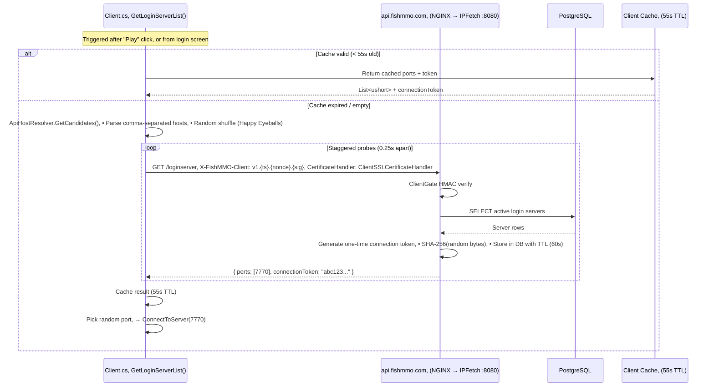

### Phase 3: QUIC/WebTransport Connection

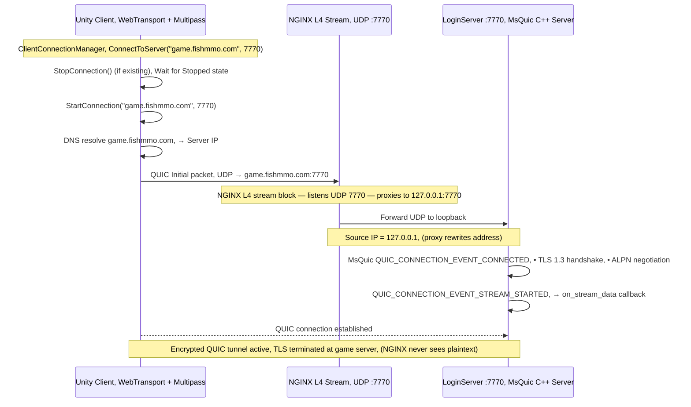

### Phase 4: Cryptographic Handshake (X25519 ECDH)

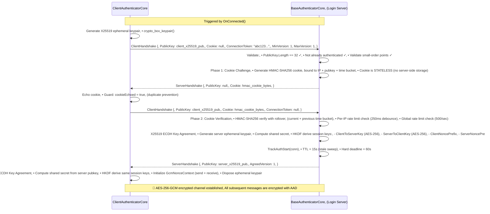

### Phase 5: SRP-6a Authentication

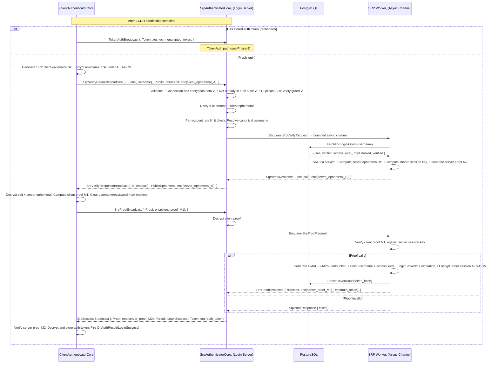

### Phase 6: TOTP Two-Factor Authentication

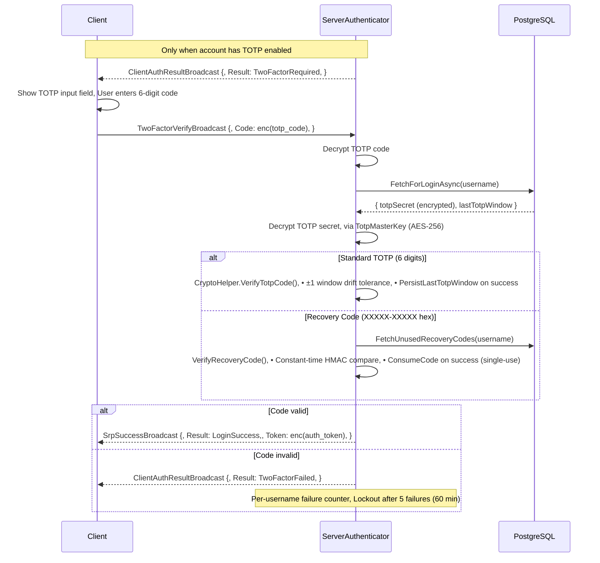

### Phase 7: Token Issuance & Character Select

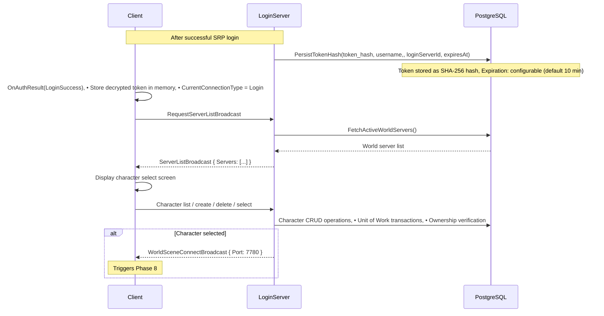

### Phase 8: World Server Connection

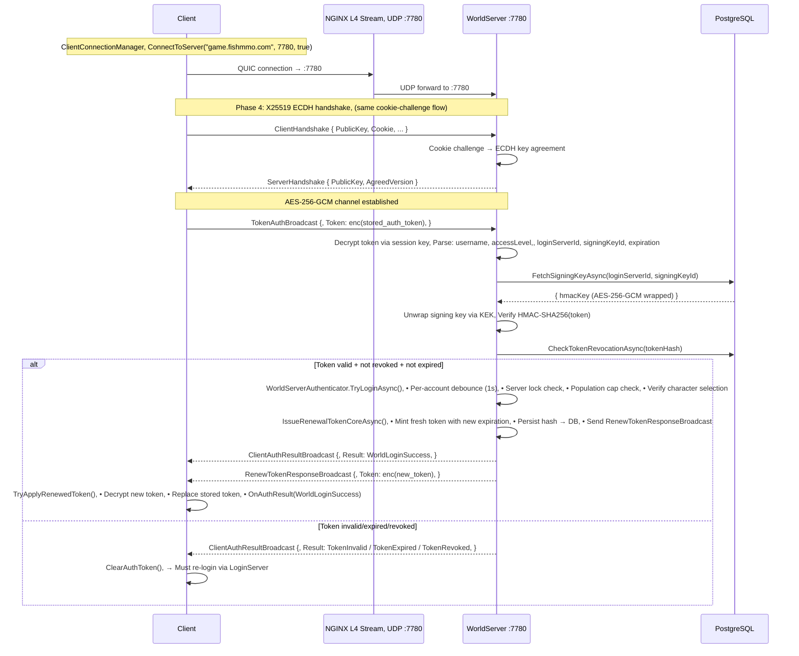

### Phase 9: Scene Server Connection

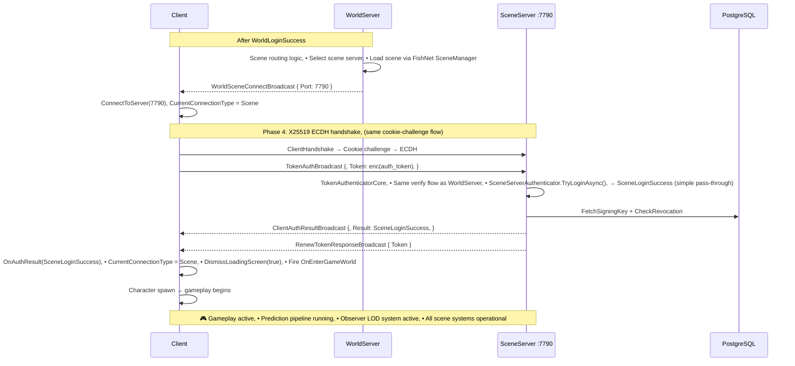

### Phase 10: Token Renewal & Revocation

Renewal runs on a timer, not just once at authentication. A scene transfer is a
re-authentication — the scene server releases the character and disconnects the client,
which reconnects to the World server and presents its stored token — so a session that
stayed in one scene longer than the token lifetime would otherwise arrive with an expired
token and be dropped to the login screen. The sweep re-mints halfway through the lifetime
(default every 5 minutes for a 10-minute token), so the token a client holds is never more
than halfway through its life regardless of how long it has been standing still.

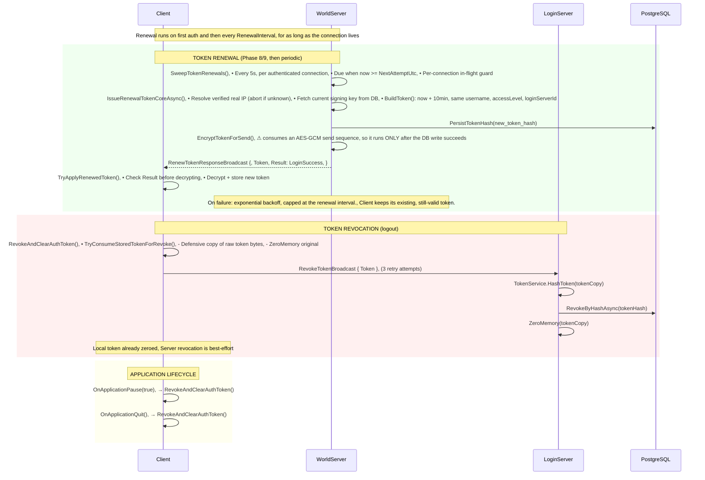

#### Renewal invariants

Repeated renewal over one connection is only safe because of three rules. Breaking any of
them silently disables renewal for the rest of that session, which surfaces much later as a
player dropped to the login screen on their next scene transfer.

1. **Encrypt last.** `EncryptTokenForSend` takes a sequence number from the connection's
   server→client nonce context, and the client derives its decryption nonce from its own
   receive counter — the two advance in lock step and nothing on the wire re-synchronises
   them. A token that is encrypted but never delivered desynchronises them permanently. So
   every step that can fail (real-IP resolution, signing-key fetch, token build, DB write)
   must complete *before* encryption. If the broadcast itself throws, the connection is
   dropped so the client re-authenticates on a fresh channel.
2. **One renewal at a time per connection.** Two overlapping renewals take sequence numbers
   `N` and `N+1` and may reach the main thread in either order. The client rejects anything
   that is not exactly the next sequence, so an inverted pair breaks both messages and every
   one after them. An in-flight guard per connection serialises them.
3. **Never mint a token without a verified real IP.** Scene `TokenAuth` requires `RealIp`
   (v4+), so a token minted without one is guaranteed to be rejected at the next hop.
   Aborting the renewal leaves the client holding its current, still-valid token — strictly
   better than replacing it with one that cannot work.

`RenewTokenResponseBroadcast.Seq` is informational only; the client must not decrypt against
it. A desynchronised counter has to surface as a decryption failure rather than as a
successful decrypt at a peer-chosen sequence.

### Phase 11: Scene Transfer & Character Session Ownership

Walking into a `SceneTeleporter`, or respawning at a bind point in a different scene, moves
a player between scene servers. There is no server-to-server handover: the source server
saves and releases the character, the client goes back through the World server, and the
destination server claims the character fresh. The client therefore re-authenticates
mid-transfer, which is why Phase 10's periodic renewal is a prerequisite for transfers to
work at all.

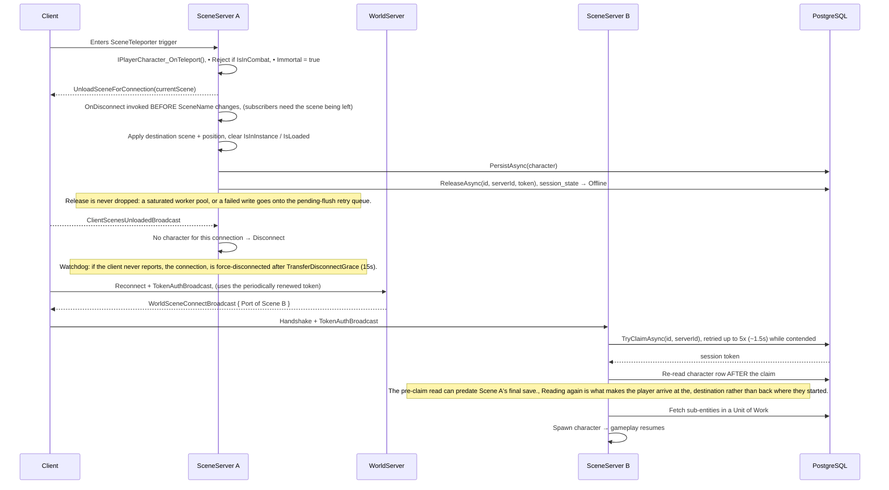

#### Session ownership rules

The `characters` row carries `session_state`, `session_owner_server_id`, `session_owner_token`
and `session_lease_expires_utc`. Exactly one scene server owns a character at a time.

| Operation | Guard |
|-----------|-------|
| `TryClaimAsync` | Succeeds only when `session_state = Offline` **or** the lease has expired. Retried briefly on contention. |
| `ReleaseAsync` | Requires a matching owner server **and** token, so a stale release cannot free someone else's claim. |
| `RefreshSessionLeasesAsync` | Batched, ownership-checked, on its own timer. |
| `PersistAsync` | Persists character state only. It does **not** touch the lease. |

Two constraints are easy to reintroduce and worth stating plainly:

- **Saving must not manage the lease.** `PersistAsync` used to extend the lease for any row
  whose session was Online without checking which server was writing, so a stale save from a
  server that had already released the character extended the *new* owner's lease.
- **Lease liveness must not depend on save throughput.** Refreshing one character per round
  trip inside the sequential save loop meant that on a busy shard with a slow database the
  characters at the tail of the walk could exceed the 2-minute lease between refreshes and
  become claimable while still online. The batched refresh costs one statement regardless of
  population.

A claim that is dropped rather than released is not a local problem: the character stays
Online in the database, so the destination server cannot claim it and kicks the player,
repeatedly, until the lease expires. Every abandoned-load path therefore routes through
`ReleaseSessionSafely`, and anything that fails lands on a retry queue that is also drained
on shutdown.

---

## Protocol Layers

```
┌─────────────────────────────────────────────┐
│         APPLICATION LAYER                    │
│  FishMMO Broadcasts (SRP, Token, Chat, etc.) │
│  Serialized via FishNet BinarySerializer      │
├─────────────────────────────────────────────┤
│         ENCRYPTION LAYER                     │
│  AES-256-GCM (per-message)                   │
│  Authenticated Additional Data:              │
│    • Protocol version                        │
│    • Message type                            │
│    • Sequence number                         │
│  Nonce: 12 bytes (prefix || counter)         │
├─────────────────────────────────────────────┤
│         SESSION LAYER                        │
│  QUIC Streams + Datagrams                    │
│  Stream Manager (4096 concurrent streams)    │
│  Reliable: Bidi stream + FIN                 │
│  Unreliable: Datagram                        │
├─────────────────────────────────────────────┤
│         TRANSPORT LAYER                      │
│  QUIC (RFC 9000) over UDP, ALPN "h3"         │
│  TLS 1.3 (mandatory for QUIC)                │
│  Native:  MsQuic C++ (P/Invoke from C#)      │
│  WebGL:   browser W3C WebTransport API       │
│           (HTTP/3 CONNECT, via .jslib)       │
├─────────────────────────────────────────────┤
│         NETWORK LAYER                        │
│  UDP datagrams                               │
│  NGINX L4 stream proxy → 127.0.0.1           │
└─────────────────────────────────────────────┘
```

Only the bottom two layers differ by platform, and only in *implementation*:
a native client drives MsQuic through P/Invoke while a browser drives the same
QUIC/HTTP3 protocol through the W3C `WebTransport` API. Both terminate TLS 1.3
at the game server, speak the same broadcast wire format, and arrive on the
same UDP port. Everything above the transport layer is identical.

> The NGINX hop is only skippable in a local development setup where a client
> talks straight to a server bound on `0.0.0.0`. In the standard deployment it
> is not optional — servers bind `127.0.0.1`, so the proxy is the only way in.

---

## Security Properties

| Property | Mechanism | Details |
|----------|-----------|---------|
| **Password never sent to server** | SRP-6a | Client proves knowledge of password without transmitting it |
| **Forward secrecy** | X25519 ECDH | Ephemeral keypairs regenerated each connection |
| **Session encryption** | AES-256-GCM | All messages encrypted with per-session derived keys |
| **Message authentication** | GCM authentication tag | Every message authenticated with AAD binding |
| **Replay protection** | Sequence numbers + GCM nonces | Monotonic counters prevent message replay |
| **Cookie challenge** | HMAC-SHA256 stateless cookie | Proof of IP reachability before expensive ECDH |
| **Small-order point rejection** | RFC 7748 §6.1 blacklist | Prevents ECDH downgrade attacks |
| **Token signing** | HMAC-SHA256 | Tokens cryptographically signed by LoginServer |
| **Token encryption** | AES-256-GCM (KEK-wrapped) | Signing keys stored encrypted in database |
| **Constant-time comparison** | Bitwise XOR loop | Prevents timing side-channel on MAC/cert checks |
| **Memory zeroization** | CryptographicOperations.ZeroMemory | Sensitive keys/credentials zeroed after use |
| **TLS certificate pinning** | SHA-256(SPKI) via BouncyCastle | Prevents MITM on launcher API calls |
| **API request signing** | HMAC-SHA256 + timestamp + nonce | Prevents replay of launcher API requests |
| **TOTP secret encryption** | AES-256 master key | TOTP secrets encrypted at rest in DB |

### Security Incident Response

Quick-reference playbooks for common security incidents. Each scenario assumes the on-call operator has access to the deployment's server configuration files, database credentials, and the `LoginServerSystem` management interface.

#### Token Signing Key Compromise

Suspicion: a signing key used by LoginServer to HMAC-auth tokens has been exposed (e.g., leaked config file, compromised host).

1. **Rotate the signing key** via `LoginServerSystem.RotateSigningKey()` which generates a new HMAC key, wraps it with the KEK, and persists the new row in the `signing_keys` table.
2. **Revoke all outstanding tokens** by incrementing the deployment's key generation counter, or by calling `TokenService.RevokeAllForLoginServer(loginServerId)`. World/Scene servers will reject existing tokens at the next `CheckTokenRevocationAsync` lookup.
3. **Force all connected clients to re-authenticate** by restarting World and Scene servers after the rotation so in-memory caches of the old signing key are flushed.

#### DDoS Attack

Suspicion: a flood of connection requests, handshake attempts, or API calls from distributed sources.

1. **Verify NGINX rate limits are active** — check `limit_req_zone` and `limit_conn_zone` counters via `nginx -s reopen` logs or live metrics. Confirm the zones are not exhausted by legitimate traffic.
2. **Enable stricter limits** — reduce `limit_req` to 5r/s (API) and 1r/s (patch), tighten `limit_conn` to 5 conn/IP. Apply at NGINX edge; no game-server restart required.
3. **Check nonce cache pressure** — if the `ClientGate` nonce LRU exceeds 20,000 entries, the `Array.Sort` on eviction causes CPU spikes. Consider restarting the IPFetch/Patcher processes to flush the cache.
4. **If the attack targets QUIC game ports**, the game server's per-IP handshake debounce (250ms) and global cap (500/sec) provide the last line of defense. Monitor `MaxPendingAuthConnections` (10,000) — if hit, legitimate clients are locked out.

#### Account Takeover

Suspicion: a user reports unauthorized access, or an anomaly detection alert fires on an account.

1. **Revoke the account's tokens** via `TokenService.RevokeByUsername(username)` — this forces all active sessions to re-authenticate.
2. **Force a password reset** by setting `password_change_required` on the account row, which the client will enforce on next login.
3. **Check TOTP status** — if TOTP was not enabled, or was recently disabled, re-enable it and generate new recovery codes via `CryptoHelper.TwoFactor.GenerateRecoveryCodes()`. Review `lastTotpWindow` for signs of code replay.
4. **Audit the account's recent auth attempts** via IPFetch or LoginServer logs to identify the source IP of the intrusion.

#### Certificate Compromise

Suspicion: the TLS private key for `game.fishmmo.com` (or `api.fishmmo.com`) has been exposed.

1. **Renew certificates immediately** — run `certbot renew --force-renewal` on the server hosting the affected domain. The certbot deploy hook (`certbot-fishmmo.sh`) copies new certs to `/etc/fishmmo/certs/`.
2. **Restart all game servers** that terminate QUIC/TLS (LoginServer, WorldServer, SceneServer) — each reads certificate paths from `.cfg` files (`CertificatePath` / `PrivateKeyPath`) at startup.
3. **Reload NGINX** with `nginx -t && nginx -s reload` to pick up updated web server certificates.
4. **Verify the new certificate** — check `openssl x509 -in /etc/fishmmo/certs/fullchain.pem -noout -dates` and confirm the private key matches with `openssl pkey -in /etc/fishmmo/certs/privkey.pem -pubout`.

---

## Rate Limiting & DDoS Protection

```
┌──────────────────────────────────────────────────────────────┐
│                    DEFENSE IN DEPTH                          │
│                                                              │
│  LAYER 1: NGINX (Edge)                                       │
│  ├─ limit_req_zone: 10r/s (API), 2r/s (patch), 30r/s (WebGL)│
│  ├─ limit_conn_zone: 20 conn/IP (WebGL), 10 conn/IP (API)   │
│  ├─ client_max_body_size: 1k (prevents oversized requests)  │
│  └─ TLS 1.2+ only, strict ciphers                           │
│                                                              │
│  LAYER 2: ClientGate (API servers)                           │
│  ├─ HMAC-SHA256 request signing                             │
│  ├─ Timestamp ±300s window                                  │
│  └─ Nonce LRU replay protection                             │
│                                                              │
│  LAYER 3: Game Server                                       │
│  ├─ Global handshake cap: 500/sec                           │
│  ├─ Per-IP handshake debounce: 250ms                        │
│  ├─ Pending auth cap: 10,000                                │
│  ├─ Auth TTL sweep: 15s stale, 60s hard deadline            │
│  ├─ Per-account rate limit: 1s (SRP verify)                 │
│  ├─ Per-IP account creation limit: configurable             │
│  ├─ Global hourly account creation cap                      │
│  ├─ TOTP failure lockout: 5 failures → 60 min               │
│  ├─ Account verification brute-force protection              │
│  ├─ IngressGuard: per-connection, per-operation debounce    │
│  └─ Async worker backpressure + bounded channels            │
└──────────────────────────────────────────────────────────────┘
```

---

## Reconnection Flow

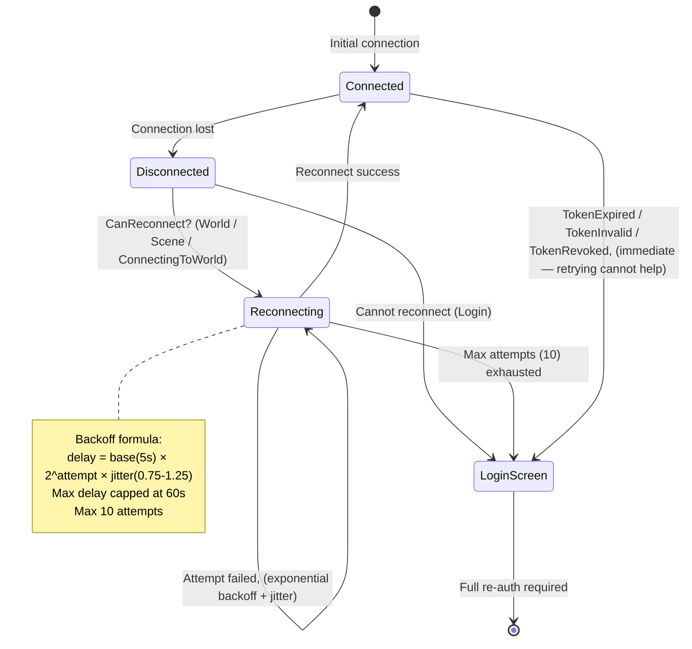

**The `Reconnecting → Reconnecting` self-loop depends on `ConnectingToWorld` being
reconnectable.** The retry sequence changes connection type as it runs: the drop clears
`CurrentConnectionType` to `None`, then `TryReconnect()` calls
`ConnectToServer(..., isWorldServer: true)`, which sets `ConnectingToWorld` for the in-flight
attempt. By the time an attempt *fails*, `ConnectingToWorld` is the only type left describing
it — so a `CanReconnect` covering only `World` and `Scene` collapsed the loop after a single
attempt: no retry re-armed, `OnReconnectFailed` never fired, and the client reached neither
`Connected` nor `LoginScreen`. `OnConnectionAttemptFailed` fired in its place, discarding the
cached login server list over a world server outage.

The same gate governs the initial Login→World hop, which carries the same type. A world
server that is down at server-select now enters this loop rather than failing on the first
attempt, and exits it through the same `Max attempts exhausted → LoginScreen` edge —
cancellable at any point from `UIReconnectDisplay`.

**Token rejection short-circuits the retry loop.** A server that answers `TokenExpired`,
`TokenInvalid` or `TokenRevoked` has refused the exact credential the client would present
again on every retry. Feeding those into the backoff loop cost ten attempts spread over
roughly four minutes of "reconnecting" before landing on the login screen anyway, so
`Client.OnAuthResult` now clears the stored token and goes there immediately.

Periodic token renewal (Phase 10) is what keeps this path rare: before it existed, any
session that stayed in one scene past the token lifetime hit `TokenExpired` on its next
scene transfer or bind-point respawn.

---

## Platform Support Matrix

| Feature | Windows x64 | Linux x64 | macOS x64 | WebGL (Browser) |
|---------|-------------|-----------|-----------|-----------------|
| **Native client** | ✅ | ✅ | ✅ | N/A |
| **Server** | ✅ | ✅ | ✅ | N/A |
| **WebTransport (QUIC)** | ✅ (via C++ lib) | ✅ (via C++ lib) | ❌ (binary missing) | ✅ (via browser WebTransport API + server HTTP/3) |
| **TLS certificate pinning** | ✅ | ✅ | ✅ | N/A (browser handles) |
| **API request signing** | ✅ | ✅ | ✅ | ✅ |
| **IL2CPP scripting** | ✅ | ✅ | ✅ | ✅ (WASM) |

> **WebGL note:** The C++ msquic server includes a full HTTP/3 WebTransport handshake implementation
> in `src/http3.cpp`. The server auto-detects browser clients by inspecting the first byte of the
> initial peer stream: `0x00` = HTTP/3 control stream (browser), any other byte = raw QUIC (native).
> Browser WebTransport clients connect via `new WebTransport("https://game.fishmmo.com:{port}")`
> and the server handles SETTINGS exchange, CONNECT validation with Origin CORS checking, and
> WebTransport session establishment transparently. The CSP headers on `play.fishmmo.com` are
> configured with `connect-src ... https://game.fishmmo.com:*` for cross-origin WebTransport.

---

## Port Reference

| Port | Service | Protocol | Binds | Exposure |
|------|---------|----------|-------|----------|
| 80 | NGINX HTTP → HTTPS redirect | TCP | all interfaces | Public |
| 443 | NGINX HTTPS (API + WebGL static) | TCP | all interfaces | Public |
| 7770-7999 | NGINX L4 UDP stream listeners | UDP | all interfaces (IPv4 only) | Public |
| 5432 | PostgreSQL | TCP | `127.0.0.1` | Private |
| 6432 | pgBouncer | TCP | `127.0.0.1` | Private |
| 7770-7779 | LoginServer(s) | UDP (QUIC/h3) | `127.0.0.1` | Reached only via NGINX L4 |
| 7780-7789 | WorldServer(s) | UDP (QUIC/h3) | `127.0.0.1` | Reached only via NGINX L4 |
| 7790-7999 | SceneServer(s) | UDP (QUIC/h3) | `127.0.0.1` | Reached only via NGINX L4 |
| 8000 | WebGL Static Server | TCP (HTTP) | `127.0.0.1` | Reached only via NGINX L7 |
| 8080 | IPFetch Server | TCP (HTTP) | `127.0.0.1` | Reached only via NGINX L7 |
| 8090 | Patcher Server | TCP (HTTP) | `127.0.0.1` | Reached only via NGINX L7 |

The game-server rows list the same port range twice on purpose: NGINX listens
publicly on port *N* and forwards to a game server listening on `127.0.0.1:N`.
Port numbers are not translated.

**No WSS/TCP game port exists.** All gameplay is UDP on 7770-7999. If you are
looking for a WebSocket listener to open in a firewall, there isn't one.

---

## Server Initialization Order

> **Complete 5-phase server startup** — from Unity scene load through bootstrap, launcher, server scene initialization, and runtime operation.
> Full detail available in [`SERVER_INITIALIZATION_ORDER.md`](SERVER_INITIALIZATION_ORDER.md).

The FishMMO server follows a hierarchical 5-phase initialization sequence:

### Phase 1: MainBootstrap Scene Load

| Step | Action |
|------|--------|
| 1.1 | Unity loads `MainBootstrap.unity` (first scene, `DontDestroyOnLoad`) |
| 1.2 | `MainBootstrapSystem.Awake()` calls `StartBootstrap()` |
| 1.3 | `OnPreload()` loads version.txt, sets `GameVersion`, registers quit/play-mode handlers, initializes the **Logging System** (console logger factory, logging.json config), then enqueues the next scene (`ServerLauncher` for server builds, `ClientPreboot` otherwise) |
| 1.4 | `AddressableLoadProcessor.BeginProcessQueue()` loads the ServerLauncher scene additively |
| 1.5 | On load completion, `OnCompleteProcessing()` finds `BootstrapSystem` components in loaded scenes and calls `StartBootstrap()` on each |

### Phase 2: ServerLauncher Scene Load

| Step | Action |
|------|--------|
| 2.1 | `ServerLauncher.unity` loaded additively by MainBootstrapSystem |
| 2.2 | `ServerLauncher.StartBootstrap()` called by the bootstrap pipeline |
| 2.3 | `OnPreload()` subscribes to addressable events, loads `TemplateTypeCache`, then determines which server scenes to load: **Editor** loads all from `BootList` (LoginServer, WorldServer, SceneServer); **Standalone** parses `args[1]` ("LOGIN" / "WORLD" / "SCENE") |
| 2.4 | Server scenes are enqueued and loaded additively via `AddressableLoadProcessor` |

### Phase 3: Server Scene(s) Load

Each server scene (`LoginServer.unity`, `WorldServer.unity`, `SceneServer.unity`) contains a `NetworkManager`, a `Server` MonoBehaviour, and `ServerBehaviour` ScriptableObject assets.

| Step | Action |
|------|--------|
| 3.1 | Scene loaded additively by ServerLauncher |
| 3.2 | `Server.Start()` finds `NetworkManager`, creates `FileServerConfiguration` + `ServerEvents` + `CoreServer` + `FishNetNetworkWrapper` |
| 3.3 | `StartCoroutine(NetHelper.FetchExternalIPAddress(...))` — async web request to discover the server's public IP |

### Phase 4: Server Finalize Setup (`OnFinalizeSetup`)

This is the critical initialization phase, running after the external IP is fetched:

1. **Core Initialization** — `CoreServer.Initialize(remoteAddress, sceneName)`, creates `ServerAddressProvider`
2. **Network Configuration** — `NetworkWrapper.ApplyTransportConfiguration()` sets FishNet transport addresses/ports; attaches authenticator and connection state handler
3. **Account Management** — `AccountManager = new AccountManager()`
4. **RuntimeDataContainer Discovery & Creation** — `DataContainerRegistry` scans `ServerBehaviours` for `[RequiresDataContainer]` attributes, deduplicates by type, groups by `InitializationPriority`, and creates container instances
5. **DataContainer Initialization** — `DataContainerRegistry.InitializeAll(this)` — sets Server/ServerManager references, calls `container.InitializeOnce()`
6. **ServerBehaviour Registration & Initialization** — `BehaviourRegistry.RegisterAllBehaviours()` — registers by concrete type and implemented interfaces, then calls `behaviour.InitializeOnce()` (behaviours can now access initialized containers, subscribe to broadcasts, register periodic callbacks)
7. **Physics and Network Start** — `KinematicCharacterSystem.EnsureCreation()`, `NetworkWrapper.StartServer()` (FishNet `ServerManager.StartConnection()`), logs "Initialization Complete"

### Phase 5: Runtime Operation

- **`Server.LateUpdate()` every frame**: calculates deltaTime, updates all initialized `ServerBehaviours` via `OnLateUpdate(deltaTime)`, processes periodic callbacks (decrement timer, invoke action when elapsed)
- **Client connections**: authenticator validates, character spawning/loading begins, behaviours handle broadcasts, containers store mutable state

### Key Guarantees

| Guarantee | Detail |
|-----------|--------|
| Containers before behaviours | `RuntimeDataContainers` are always initialized before `ServerBehaviours` — no race conditions |
| Attribute-based discovery | Declare dependencies with `[RequiresDataContainer(typeof(...))]` — zero manual config, automatic deduplication |
| Hierarchical bootstrap | MainBootstrap triggers ServerLauncher triggers Server Scene(s) — graceful additive scene loading |
| Build-specific behavior | Editor loads all servers simultaneously; standalone uses command-line args; separate asset lists for WebGL |

### Shutdown Sequence

```
Application wants to quit
  → MainBootstrapSystem defers quit
  → Graphics cleanup (release addressables)
  → Log.Shutdown() (flush logs)
  → Server.OnDestroy()
  → DeinitializeAllBehaviours() (reverse order)
  → DeinitializeAllDataContainers() (reverse order)
  → Application.Quit()
```

---

## Key Constants

| Constant | Value | Location |
|----------|-------|----------|
| `APIHost` | `https://api.fishmmo.com/` | `Constants.cs` |
| `GameHost` | `game.fishmmo.com` | `Constants.cs` |
| `AuthStaleTtlSeconds` | 15s | `BaseAuthenticatorCore.cs` |
| `AuthHardDeadlineSeconds` | 60s | `BaseAuthenticatorCore.cs` |
| `MaxPendingAuthConnections` | 10,000 | `BaseAuthenticatorCore.cs` |
| `HandshakeIpDebounceSeconds` | 0.25s | `BaseAuthenticatorCore.cs` |
| `MaxGlobalHandshakesPerSecond` | 500 | `BaseAuthenticatorCore.cs` |
| `TokenExpirationMinutes` | 10 (configurable) | `ServerAuthenticator.cs` |
| `renewalTokenExpirationMinutes` | 10 (configurable) | `TokenServerAuthenticator.cs` |
| `renewalRefreshFraction` | 0.5 of lifetime (configurable) | `TokenServerAuthenticator.cs` |
| `RenewalSweepIntervalSeconds` | 5s | `TokenServerAuthenticator.cs` |
| `DefaultSessionLeaseDuration` | 2 min | `CharacterService.cs` |
| `sessionLeaseRefreshRate` | 20s (configurable) | `CharacterSystem.cs` |
| `saveRate` | 30s (configurable) | `CharacterSystem.cs` |
| `TransferDisconnectGrace` | 15s | `CharacterSystem.Connection.cs` |
| `LoginServerCacheTtlSeconds` | 55s | `Client.cs` |
| `MaxReconnectAttempts` | 10 | `ClientConnectionManager.cs` |
| `MaxReconnectDelay` | 60s | `ClientConnectionManager.cs` |
| `WT_MAX_STREAMS` | 4096 | `webtransport_internal.h` |
| `WT_MAX_CLIENTS` | 4000 (configurable) | `.cfg` files |

---

## Operations

Common operational procedures for FishMMO game servers. These procedures assume ssh access to the deployment host and familiarity with the project's configuration and binary layout.

### Deploy a New Game Server

- **Build the server binary** via the FishMMO Dashboard (Build → Server) targeting the desired platform and server type (Login/World/Scene).
- **Copy the binary and its `.cfg` file** to the deployment host. Use the appropriate template from `FishMMO-Setup/Production/` (e.g., `SceneServer.cfg` for a new scene server).
- **Register the server** in the database: insert a row into the `world_scenes` or `login_servers` table with the server's address, port, and metadata. The IPFetch/LoginServer discovery queries read these tables.
- **Add a new NGINX stream block** via `gen-fishmmo-stream-config.sh` if the server uses a port that hasn't been opened yet, then reload NGINX with `nginx -t && nginx -s reload`.
- **Verify** by checking server logs for "Initialization Complete" and confirming client connections succeed.

### Rotate Certificates

- **Run certbot renewal** with `certbot renew` on the host that manages TLS certificates. The deploy hook at `FishMMO-Setup/deploy-hooks/certbot-fishmmo.sh` copies renewed certs to `/etc/fishmmo/certs/`.
- **Reload NGINX** with `nginx -t && nginx -s reload` to pick up new web server certificates.
- **Restart game servers** (LoginServer, WorldServer, SceneServer) one at a time to minimize downtime. Each reads `CertificatePath` and `PrivateKeyPath` from its `.cfg` file at startup.
- **Verify** certs with `openssl x509 -in /etc/fishmmo/certs/fullchain.pem -noout -dates` and check the private key matches via modulus comparison.

### Handle a DDoS Attack

- **Enable NGINX edge rate limits** immediately: drop `limit_req` to 5r/s (API), 1r/s (patch), and `limit_conn` to 5 conn/IP. No server restart required; NGINX reloads limits on config change.
- **Verify game-server defenses** are active: the handshake global cap (500/sec), per-IP debounce (250ms), and pending auth cap (10,000) are compiled-in constants that cannot be changed at runtime — if overwhelmed, consider adding additional NGINX stream proxy nodes.
- **Check nonce cache pressure** in `ClientGate`: if the LRU exceeds 20,000 entries, the eviction sort causes CPU spikes. Restart IPFetch/Patcher processes to flush the cache.
- **Scale horizontally** by adding NGINX proxy instances behind a load balancer, then distributing game server ports across them.

### Add a New Scene Server

- **Create a new SceneServer.cfg** based on the Production template, assigning a unique port in the 7790-7999 range.
- **Deploy the SceneServer binary** with the new config to the target host or container.
- **Register the scene** in the database via `world_scenes` table: set the scene's `WorldServerID`, `Handle`, `Name`, `Address`, and `Port`. The WorldServer discovers scene servers through this table.
- **Add an NGINX stream block** for the new UDP port if not already open, then reload NGINX.
- **Restart the WorldServer** so it picks up the new scene registration (or wait for the next heartbeat cycle if runtime discovery is implemented).

### Common Troubleshooting

- **Server fails to start ("Initialization Complete" not logged):** Check the `.cfg` file path and format. Verify `CertificatePath` and `PrivateKeyPath` exist and are readable. Ensure `Address`/`Port` are not already in use.
- **Client gets "Token Invalid" on World/Scene connect:** The auth token has expired (default 10 min lifetime) or the signing key was rotated. The client must re-authenticate through the LoginServer. Verify that a `signing_key_kek` row exists in the `deployment_secrets` database table -- all servers load the KEK from the database at startup via `IDeploymentSecretService`.
- **WebGL client cannot connect:** Verify the browser supports WebTransport (Chromium 97+). Check that CSP headers on `play.fishmmo.com` include `connect-src https://game.fishmmo.com:*`. The server must be compiled with HTTP/3 support enabled.
- **WebGL session opens but the handshake never lands (`WIRE SEND FAIL` in the browser console, `prefill=0` on the server):** The bridge refused the first reliable send. This is what happens when a send path is gated on `wt.readyState === 'connected'` instead of the `_isLive()` helper in `WebTransport.jslib` — some Chromium builds omit that property or still report `'connecting'` after `ready()` resolves. The bridge treats a session as live once `ready()` resolves and opens the outgoing bidirectional stream before signalling Started; see the "WebGL bridge" section of the [WebTransport plugin README](FishMMO-Unity/Assets/Plugins/FishNet/Plugins/WebTransport/README.md).
- **WebGL build fails to link with `undefined symbol: _free`:** Managed code is importing Emscripten's allocator under the wrong name. IL2CPP resolves a `DllImport` entry point against the linked libc symbol, which modern Emscripten (Unity 6) emits as `free`. Free heap pointers through the `WTFree` jslib export (wrapped by `WebTransportJSLib.WASMFree`) rather than `EntryPoint = "_free"`.
- **TLS handshake fails between client and game server:** Ensure the server's certificate is valid for the `game.fishmmo.com` hostname. If using a self-signed cert for development, the client must skip certificate validation (not supported in production builds due to TLS certificate pinning).
- **Database connection errors:** Verify PostgreSQL is running on `localhost:5432` and pgBouncer on `localhost:6432`. Check the `FISHMMO_DB_HOST`/`FISHMMO_DB_PASSWORD` environment variables or `/etc/fishmmo/db-secrets.env` file, and verify the database connection string in the server configuration.

---

## Configuration Reference

All FishMMO servers read configuration from `.cfg` files in the working directory (e.g., `LoginServer.cfg`, `WorldServer.cfg`, `SceneServer.cfg`). The file format is `Key=Value` with `#`/`;` comments. Keys are case-insensitive. Environment variable overrides follow the pattern `FISHMMO_CONFIG_{KEY}` (where dots, colons, and dashes are replaced with underscores and the name is upper-cased).

### Common Keys (all server types)

| Key | Type | Default | Servers | Description |
|-----|------|---------|---------|-------------|
| `ServerName` | string | `"TestName"` | All | Human-readable server instance name shown in logs and window title. |
| `MaximumClients` | int | `4000` | All | Maximum concurrent client connections. Overrides the FishNet transport default of 100. |
| `Address` | string | `"127.0.0.1"` | All | Bind address. `127.0.0.1` = loopback, the default and the expected deployment — the server accepts datagrams only from an NGINX on the same host. Set `0.0.0.0` **only** when NGINX runs on a different machine, and firewall the port to that proxy host; binding all interfaces otherwise puts the game server directly on the internet. |
| `Port` | ushort | `7777` | All | Network port. Defaults: Login=7770, World=7780, Scene=7781 (code default) / 7790 (file default). |
| `StaleSceneTimeout` | int | `5` | All | Minutes before an unresponsive scene is considered stale and eligible for cleanup. |
| `CertificatePath` | string | platform-specific | All | PEM certificate path for QUIC/TLS termination. Platform defaults: Linux=`/etc/fishmmo/certs/fullchain.pem`, Windows=`C:\ProgramData\FishMMO\certs\fullchain.pem`, macOS=`/usr/local/share/fishmmo/certs/fullchain.pem`. |
| `PrivateKeyPath` | string | platform-specific | All | PEM private key path for QUIC/TLS termination. Same platform-specific pattern as `CertificatePath` with `privkey.pem`. |

### LoginServer-Only Keys

| Key | Type | Default | Servers | Description |
|-----|------|---------|---------|-------------|
| `AutoVerifyAccounts` | bool (string) | `true` (dev), `false` (prod) | Login | When `true`, new accounts are persisted with `verified = true` (no email confirmation, no TOTP enrollment) **and** the login verification gate is bypassed, so accounts created before the flag was enabled can still log in. Must be `false` in production. Only effective in `UNITY_EDITOR` or `DEVELOPMENT_BUILD` builds — a server built with the Production working environment ignores the key entirely. |
| `Smtp:Host` | string | `"localhost"` | Login | SMTP server hostname for sending verification emails. Overridable via `FISHMMO_SMTP_HOST` env var. |
| `Smtp:Port` | int | `587` | Login | SMTP server port. Production typically uses 465 (implicit TLS). Overridable via `FISHMMO_SMTP_PORT` env var. |
| `Smtp:Username` | string | `""` | Login | SMTP authentication username. Overridable via `FISHMMO_SMTP_USERNAME` env var. |
| `Smtp:Password` | string | `""` | Login | SMTP authentication password. Overridable via `FISHMMO_SMTP_PASSWORD` env var. |
| `Smtp:FromAddress` | string | `"noreply@fishmmo.com"` | Login | Email From address for outgoing verification emails. Overridable via `FISHMMO_SMTP_FROM_ADDRESS` env var. |
| `Smtp:FromName` | string | `"FishMMO"` | Login | Display name for the From address. Overridable via `FISHMMO_SMTP_FROM_NAME` env var. |
| `Smtp:UseSsl` | bool (string) | `true` | Login | Enable SSL/TLS for SMTP. Production must be `true`. Overridable via `FISHMMO_SMTP_USE_SSL` env var. |

### Secret Keys (not stored in .cfg files)

These keys are stored in the database and loaded by each server at startup. They must never be committed to version control or stored in `.cfg` files.

| Key | DB Table / Key | Type | Servers | Description |
|-----|---------------|------|---------|-------------|
| `GateSecret` | `deployment_secrets` / `client_gate_secret` | string (base64) | IPFetch, Patcher | HMAC-SHA256 shared secret for `X-FishMMO-Client` API request signing. Must decode to at least 32 bytes. Loaded at startup via `IDeploymentSecretService`. |
| `SigningKeyKekBase64` | `deployment_secrets` / `signing_key_kek` | string (base64) | Login, World, Scene | 32-byte AES-256 key encryption key (KEK) used to wrap per-LoginServer HMAC signing keys at rest. Must decode to exactly 32 bytes. All servers load it from the database at startup. |
| `ConnectionTokenHmacKey` | `connection_token_keys` / key_id=`shared` | string (base64) | IPFetch, Login | Shared HMAC key for one-time connection tokens that bridge the real client IP from the HTTP layer into the QUIC/WebTransport layer. Loaded via `IConnectionTokenKeyService`. |

### Configuration Precedence

Values are resolved in the following priority order (highest wins):

1. **Specific environment variable** (e.g., `FISHMMO_SMTP_HOST` for SMTP settings, `FISHMMO_DB_PASSWORD` for database credentials)
2. **Generic environment variable** (`FISHMMO_CONFIG_{KEY}` where key separators become underscores, e.g., `FISHMMO_CONFIG_SMTP_HOST`)
3. **`.cfg` file value** from the server's config file in the working directory
4. **Code-level default** (hardcoded in `CoreServer.cs`, `FishNetNetworkWrapper.cs`, `SmtpService.cs`, etc.)

> **Application secrets (gate secret, KEK, connection token HMAC key) are NOT resolved through this precedence chain.** They are loaded exclusively from the database via `IDeploymentSecretService` / `IConnectionTokenKeyService` at startup. See [FishMMO README -- FishMMO-Auth -- Signing Keys & KEK](README.md#fishmmo-auth--signing-keys--kek) and [FishMMO README -- ClientGate Middleware](README.md#clientgate-middleware).

---

*End of FishMMO Connection Pipeline documentation.*