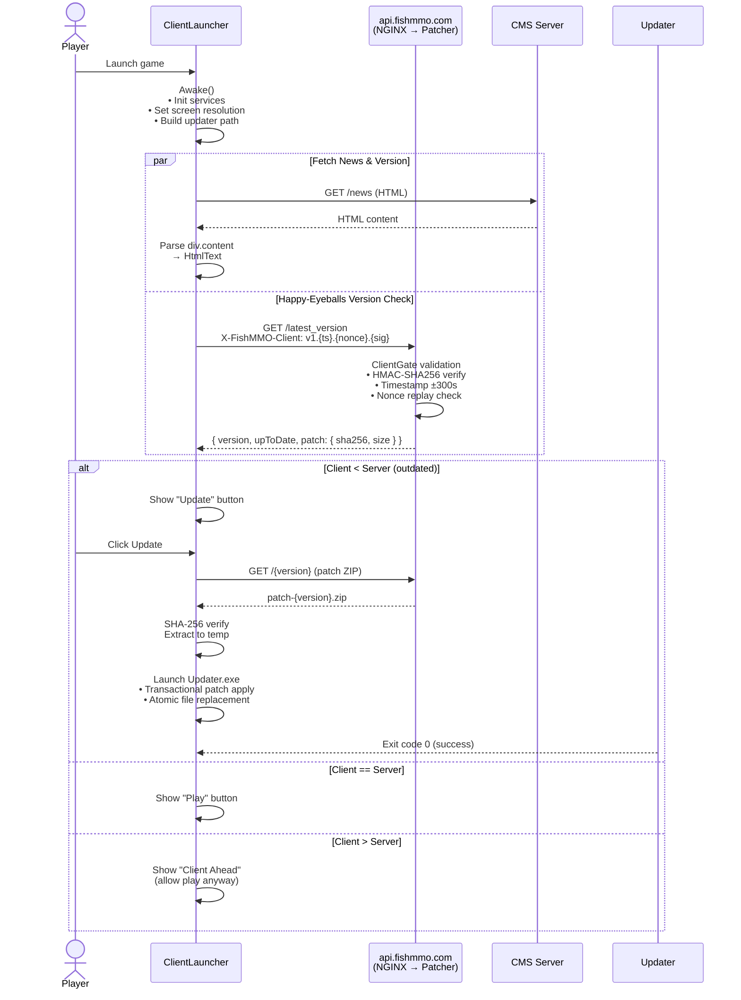
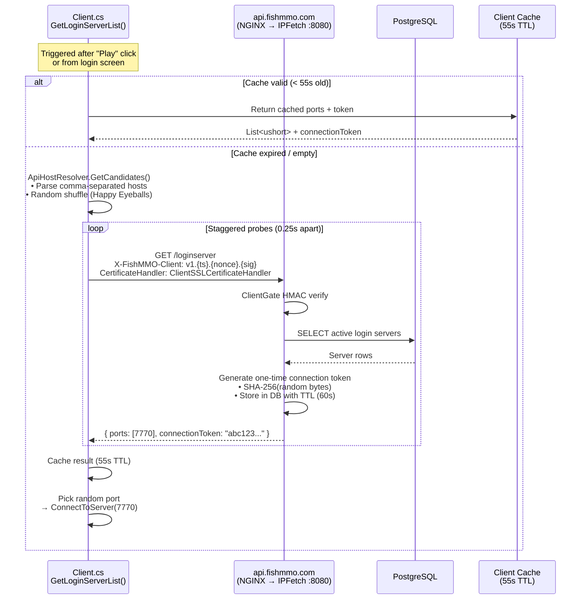
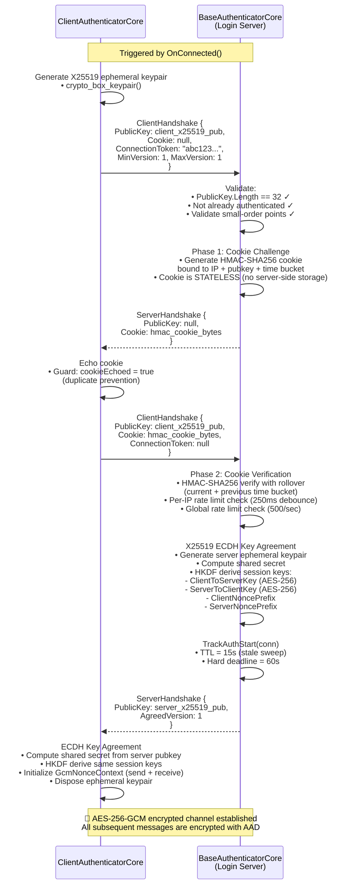
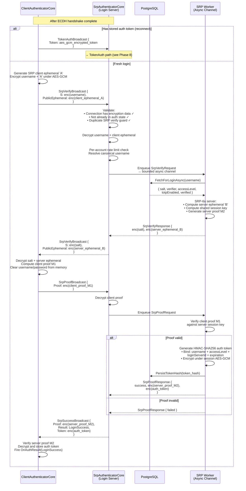
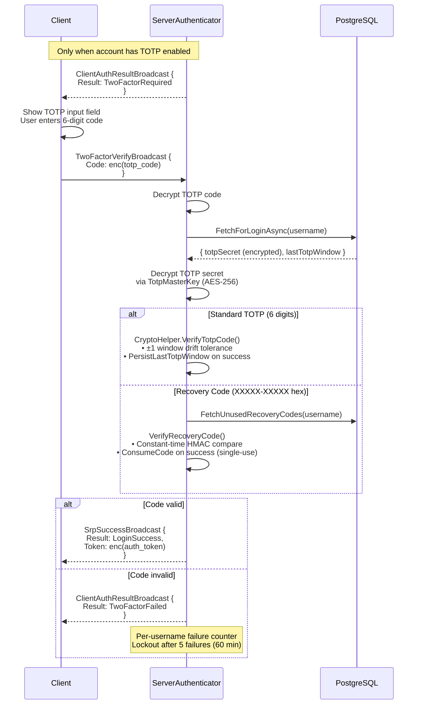
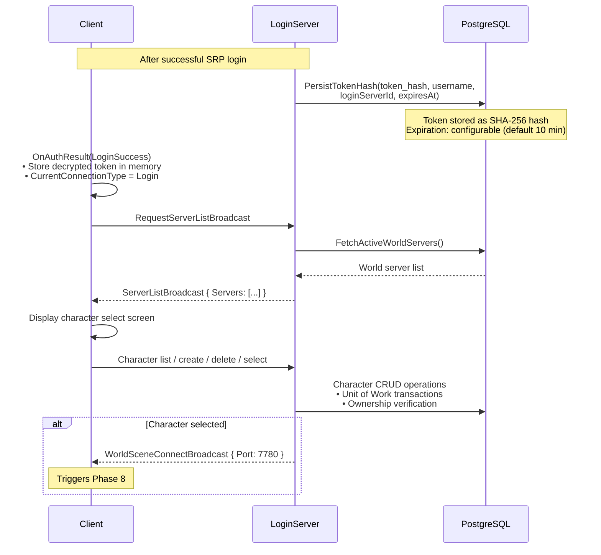
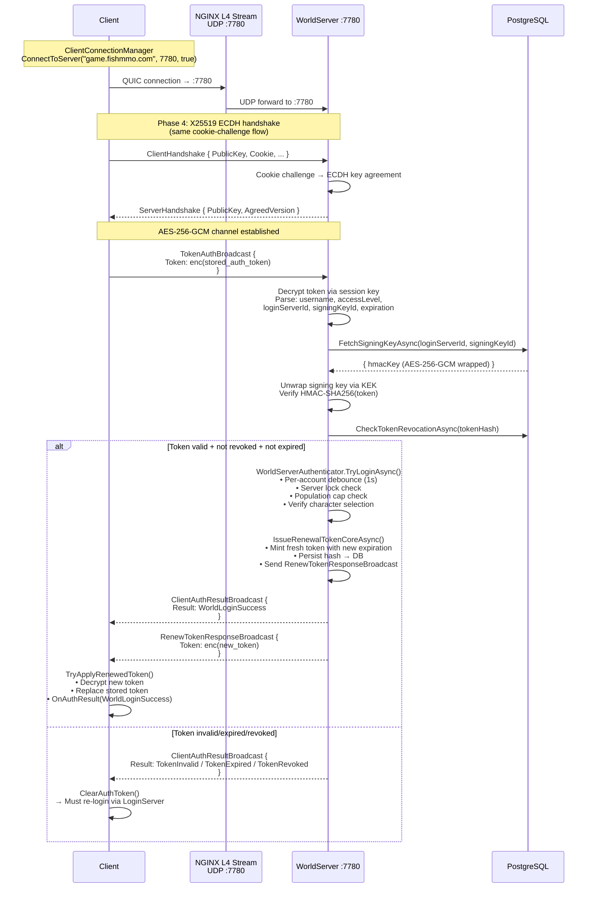
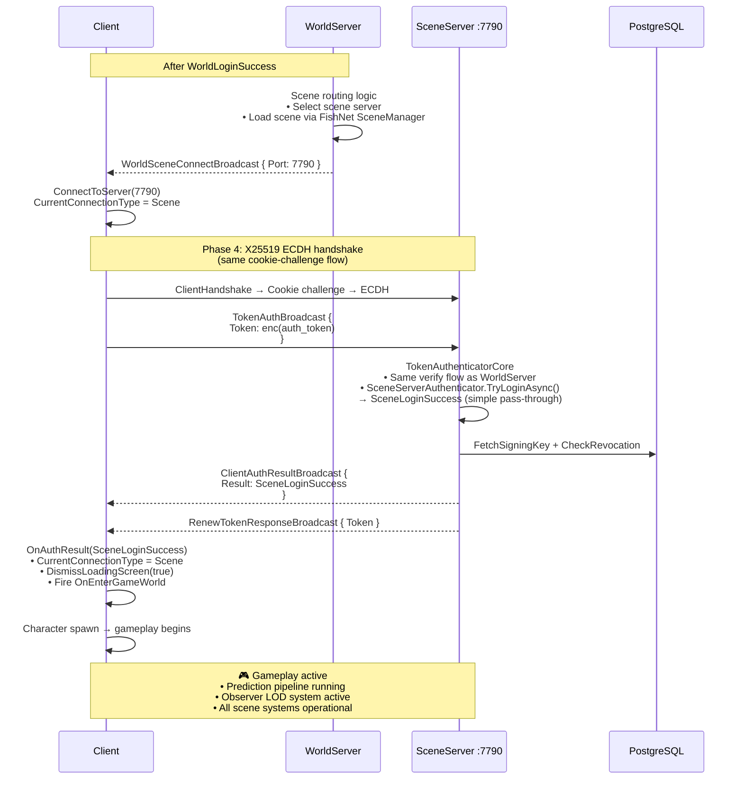
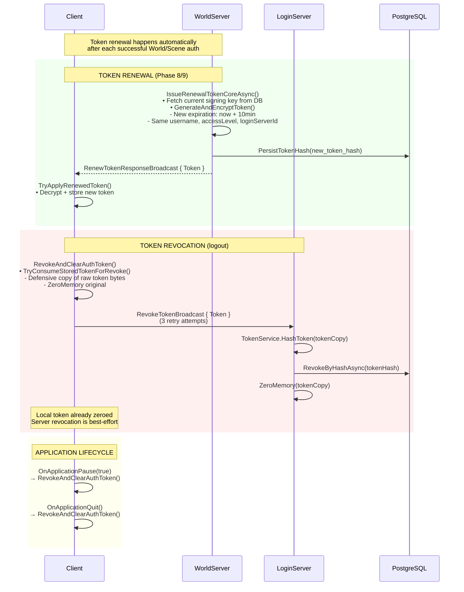
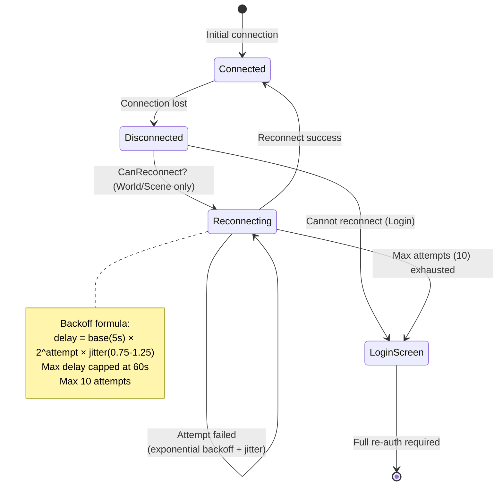

# FishMMO Connection Pipeline

> **Complete end-to-end connection flow** — from client launch through authentication, world entry, and gameplay.
> Built on QUIC/WebTransport (UDP) via MsQuic, NGINX L4 stream proxy, and FishNet networking.

---

## Table of Contents

- [Architecture Overview](#architecture-overview)
- [Infrastructure Topology](#infrastructure-topology)
- [Connection Flow Diagram](#connection-flow-diagram)
  - [Phase 1: Launcher Startup & Version Check](#phase-1-launcher-startup--version-check)
  - [Phase 2: Login Server Discovery (IPFetch)](#phase-2-login-server-discovery-ipfetch)
  - [Phase 3: QUIC/WebTransport Connection](#phase-3-quicwebtransport-connection)
  - [Phase 4: Cryptographic Handshake (X25519 ECDH)](#phase-4-cryptographic-handshake-x25519-ecdh)
  - [Phase 5: SRP-6a Authentication](#phase-5-srp-6a-authentication)
  - [Phase 6: TOTP Two-Factor Authentication](#phase-6-totp-two-factor-authentication)
  - [Phase 7: Token Issuance & Character Select](#phase-7-token-issuance--character-select)
  - [Phase 8: World Server Connection](#phase-8-world-server-connection)
  - [Phase 9: Scene Server Connection](#phase-9-scene-server-connection)
  - [Phase 10: Token Renewal & Revocation](#phase-10-token-renewal--revocation)
- [Protocol Layers](#protocol-layers)
- [Security Properties](#security-properties)
- [Rate Limiting & DDoS Protection](#rate-limiting--ddos-protection)
- [Reconnection Flow](#reconnection-flow)
- [Platform Support Matrix](#platform-support-matrix)
- [Port Reference](#port-reference)

---

## Architecture Overview

```
┌──────────────────────────────────────────────────────────────────────┐
│                        FISHMMO CONNECTION STACK                       │
│                                                                      │
│  ┌─────────┐    ┌─────────┐    ┌──────────┐    ┌──────────────────┐ │
│  │ Client  │◄──►│  NGINX  │◄──►│  Game    │◄──►│   PostgreSQL     │ │
│  │ (Unity) │    │ (L4/L7) │    │ Servers  │    │   + pgBouncer    │ │
│  └─────────┘    └─────────┘    └──────────┘    └──────────────────┘ │
│       │              │               │                    │          │
│       │   WebTransport (QUIC/HTTP3)  │                    │          │
│       │   UDP via NGINX stream proxy │        EF Core + Npgsql      │
│       │                              │                               │
│       │   HTTPS/WSS for WebGL        │                               │
│       └──────────────────────────────┘                               │
└──────────────────────────────────────────────────────────────────────┘
```

**Key design decisions:**

| Decision | Rationale |
|----------|-----------|
| **WebTransport (QUIC) for all platforms** | Unified transport — no TCP fallback, no WebSocket shim |
| **NGINX L4 UDP stream proxy** | Zero-copy packet forwarding; no TLS termination at proxy |
| **Each game server terminates its own TLS** | End-to-end encrypted; NGINX never sees plaintext game data |
| **One-time connection token for IP recovery** | Bridges real client IP from HTTP layer into QUIC layer |
| **SRP-6a + X25519 ECDH** | Zero-knowledge password proof; forward secrecy for session keys |
| **HMAC-signed auth tokens** | Stateless World/Scene server auth; no LoginServer dependency after login |

---

## Infrastructure Topology

```
                          INTERNET
                             │
                    ┌────────┴────────┐
                    │   NGINX :80/443  │
                    │  (Reverse Proxy) │
                    └───┬────┬────┬───┘
                        │    │    │
          ┌─────────────┘    │    └─────────────┐
          │                  │                  │
     UDP :7770-7999    TCP :443/*         TCP :443/*
     (stream block)    api.fishmmo.com    play.fishmmo.com
          │                  │                  │
    ┌─────┴─────┐    ┌──────┴──────┐    ┌──────┴──────┐
    │Game Servers│    │  IPFetch    │    │  WebGL      │
    │Login :7770 │    │  :8080      │    │  Server     │
    │World :7780 │    │  Patcher    │    │  :8000      │
    │Scene :7790+│    │  :8090      │    │             │
    └─────┬─────┘    └──────┬──────┘    └─────────────┘
          │                 │
    ┌─────┴─────┐    ┌──────┴──────┐
    │ pgBouncer │    │ PostgreSQL  │
    │ :6432     │◄──►│ :5432       │
    └───────────┘    └─────────────┘
```

---

## Connection Flow Diagram

### Phase 1: Launcher Startup & Version Check



### Phase 2: Login Server Discovery (IPFetch)



### Phase 3: QUIC/WebTransport Connection

```mermaid
sequenceDiagram
    participant Client as Unity Client<br/>WebTransport + Multipass
    participant NGINX as NGINX L4 Stream<br/>UDP :7770
    participant Server as LoginServer :7770<br/>MsQuic C++ Server

    Note over Client: ClientConnectionManager<br/>ConnectToServer("game.fishmmo.com", 7770)

    Client->>Client: StopConnection() (if existing)<br/>Wait for Stopped state

    Client->>Client: StartConnection("game.fishmmo.com", 7770)
    Client->>Client: DNS resolve game.fishmmo.com<br/>→ Server IP

    Client->>NGINX: QUIC Initial packet<br/>UDP → game.fishmmo.com:7770
    Note over NGINX: stream {} block<br/>listen 7770 udp;<br/>proxy_pass 127.0.0.1:7770;

    NGINX->>Server: Forward UDP to loopback
    Note over NGINX,Server: Source IP = 127.0.0.1<br/>(proxy rewrites address)

    Server->>Server: MsQuic QUIC_CONNECTION_EVENT_CONNECTED<br/>• TLS 1.3 handshake<br/>• ALPN negotiation
    Server->>Server: QUIC_CONNECTION_EVENT_STREAM_STARTED<br/>→ on_stream_data callback

    Client-->>Server: QUIC connection established
    Note over Client,Server: Encrypted QUIC tunnel active<br/>TLS terminated at game server<br/>(NGINX never sees plaintext)
```

### Phase 4: Cryptographic Handshake (X25519 ECDH)



### Phase 5: SRP-6a Authentication



### Phase 6: TOTP Two-Factor Authentication



### Phase 7: Token Issuance & Character Select



### Phase 8: World Server Connection



### Phase 9: Scene Server Connection



### Phase 10: Token Renewal & Revocation



---

## Protocol Layers

```
┌─────────────────────────────────────────────┐
│         APPLICATION LAYER                    │
│  FishMMO Broadcasts (SRP, Token, Chat, etc.) │
│  Serialized via FishNet BinarySerializer      │
├─────────────────────────────────────────────┤
│         ENCRYPTION LAYER                     │
│  AES-256-GCM (per-message)                   │
│  Authenticated Additional Data:              │
│    • Protocol version                        │
│    • Message type                            │
│    • Sequence number                         │
│  Nonce: 12 bytes (prefix || counter)         │
├─────────────────────────────────────────────┤
│         SESSION LAYER                        │
│  QUIC Streams + Datagrams                    │
│  Stream Manager (1024 concurrent streams)    │
│  Reliable: Bidi stream + FIN                 │
│  Unreliable: Datagram                        │
├─────────────────────────────────────────────┤
│         TRANSPORT LAYER                      │
│  QUIC (RFC 9000) over UDP                    │
│  TLS 1.3 (mandatory for QUIC)                │
│  MsQuic C++ library (P/Invoke from C#)       │
├─────────────────────────────────────────────┤
│         NETWORK LAYER                        │
│  UDP datagrams                               │
│  NGINX L4 stream proxy (optional)            │
└─────────────────────────────────────────────┘
```

---

## Security Properties

| Property | Mechanism | Details |
|----------|-----------|---------|
| **Password never sent to server** | SRP-6a | Client proves knowledge of password without transmitting it |
| **Forward secrecy** | X25519 ECDH | Ephemeral keypairs regenerated each connection |
| **Session encryption** | AES-256-GCM | All messages encrypted with per-session derived keys |
| **Message authentication** | GCM authentication tag | Every message authenticated with AAD binding |
| **Replay protection** | Sequence numbers + GCM nonces | Monotonic counters prevent message replay |
| **Cookie challenge** | HMAC-SHA256 stateless cookie | Proof of IP reachability before expensive ECDH |
| **Small-order point rejection** | RFC 7748 §6.1 blacklist | Prevents ECDH downgrade attacks |
| **Token signing** | HMAC-SHA256 | Tokens cryptographically signed by LoginServer |
| **Token encryption** | AES-256-GCM (KEK-wrapped) | Signing keys stored encrypted in database |
| **Constant-time comparison** | Bitwise XOR loop | Prevents timing side-channel on MAC/cert checks |
| **Memory zeroization** | CryptographicOperations.ZeroMemory | Sensitive keys/credentials zeroed after use |
| **TLS certificate pinning** | SHA-256(SPKI) via BouncyCastle | Prevents MITM on launcher API calls |
| **API request signing** | HMAC-SHA256 + timestamp + nonce | Prevents replay of launcher API requests |
| **TOTP secret encryption** | AES-256 master key | TOTP secrets encrypted at rest in DB |

---

## Rate Limiting & DDoS Protection

```
┌──────────────────────────────────────────────────────────────┐
│                    DEFENSE IN DEPTH                          │
│                                                              │
│  LAYER 1: NGINX (Edge)                                       │
│  ├─ limit_req_zone: 10r/s (API), 2r/s (patch), 30r/s (WebGL)│
│  ├─ limit_conn_zone: 20 conn/IP (WebGL), 10 conn/IP (API)   │
│  ├─ client_max_body_size: 1k (prevents oversized requests)  │
│  └─ TLS 1.2+ only, strict ciphers                           │
│                                                              │
│  LAYER 2: ClientGate (API servers)                           │
│  ├─ HMAC-SHA256 request signing                             │
│  ├─ Timestamp ±300s window                                  │
│  └─ Nonce LRU replay protection                             │
│                                                              │
│  LAYER 3: Game Server                                       │
│  ├─ Global handshake cap: 500/sec                           │
│  ├─ Per-IP handshake debounce: 250ms                        │
│  ├─ Pending auth cap: 10,000                                │
│  ├─ Auth TTL sweep: 15s stale, 60s hard deadline            │
│  ├─ Per-account rate limit: 1s (SRP verify)                 │
│  ├─ Per-IP account creation limit: configurable             │
│  ├─ Global hourly account creation cap                      │
│  ├─ TOTP failure lockout: 5 failures → 60 min               │
│  ├─ Account verification brute-force protection              │
│  ├─ IngressGuard: per-connection, per-operation debounce    │
│  └─ Async worker backpressure + bounded channels            │
└──────────────────────────────────────────────────────────────┘
```

---

## Reconnection Flow



---

## Platform Support Matrix

| Feature | Windows x64 | Linux x64 | macOS x64 | WebGL (Browser) |
|---------|-------------|-----------|-----------|-----------------|
| **Native client** | ✅ | ✅ | ✅ | N/A |
| **Server** | ✅ | ✅ | ✅ | N/A |
| **WebTransport (QUIC)** | ✅ (via C++ lib) | ✅ (via C++ lib) | ❌ (binary missing) | ⚠️ (see note) |
| **TLS certificate pinning** | ✅ | ✅ | ✅ | N/A (browser handles) |
| **API request signing** | ✅ | ✅ | ✅ | ✅ |
| **IL2CPP scripting** | ✅ | ✅ | ✅ | ✅ (WASM) |

> **WebGL note:** The C++ MsQuic server speaks raw QUIC streams, not W3C WebTransport (HTTP/3 Extended CONNECT). Browser WebTransport clients cannot connect directly. The CSP headers on `play.fishmmo.com` are configured for WebTransport (`connect-src ... https://game.fishmmo.com:*`), but the server-side protocol must be upgraded to support HTTP/3 WebTransport framing for full WebGL compatibility.

---

## Port Reference

| Port | Service | Protocol | Exposure |
|------|---------|----------|----------|
| 80 | NGINX HTTP → HTTPS redirect | TCP | Public |
| 443 | NGINX HTTPS + WSS | TCP | Public |
| 5432 | PostgreSQL | TCP | Private (localhost) |
| 6432 | pgBouncer | TCP | Private (localhost) |
| 7770-7779 | LoginServer(s) | UDP (QUIC) | Public via NGINX L4 |
| 7780-7789 | WorldServer(s) | UDP (QUIC) | Public via NGINX L4 |
| 7790-7999 | SceneServer(s) | UDP (QUIC) | Public via NGINX L4 |
| 8000 | WebGL Static Server | TCP (HTTP) | Private (behind NGINX) |
| 8080 | IPFetch Server | TCP (HTTP) | Private (behind NGINX) |
| 8090 | Patcher Server | TCP (HTTP) | Private (behind NGINX) |

---

## Key Constants

| Constant | Value | Location |
|----------|-------|----------|
| `APIHost` | `https://api.fishmmo.com/` | `Constants.cs` |
| `GameHost` | `game.fishmmo.com` | `Constants.cs` |
| `AuthStaleTtlSeconds` | 15s | `BaseAuthenticatorCore.cs` |
| `AuthHardDeadlineSeconds` | 60s | `BaseAuthenticatorCore.cs` |
| `MaxPendingAuthConnections` | 10,000 | `BaseAuthenticatorCore.cs` |
| `HandshakeIpDebounceSeconds` | 0.25s | `BaseAuthenticatorCore.cs` |
| `MaxGlobalHandshakesPerSecond` | 500 | `BaseAuthenticatorCore.cs` |
| `TokenExpirationMinutes` | 10 (configurable) | `ServerAuthenticator.cs` |
| `LoginServerCacheTtlSeconds` | 55s | `Client.cs` |
| `MaxReconnectAttempts` | 10 | `ClientConnectionManager.cs` |
| `MaxReconnectDelay` | 60s | `ClientConnectionManager.cs` |
| `WT_MAX_STREAMS` | 1024 | `webtransport_internal.h` |
| `WT_MAX_CLIENTS` | 4000 (configurable) | `.cfg` files |

---

*End of FishMMO Connection Pipeline documentation.*