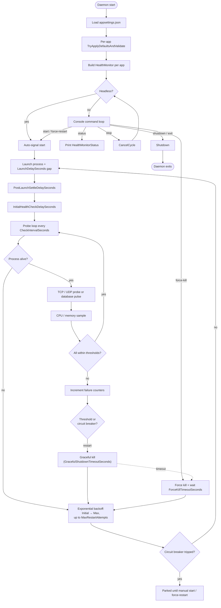

# FishMMO-AppHealthMonitor

A small, focused **process supervisor** that launches, monitors, and restarts
one or more FishMMO server executables. It is intended to be the "service
manager" for headless Unity server builds (LoginServer, WorldServer,
SceneServer) and any auxiliary processes (IPFetch, Patcher API, etc.) when a
full systemd/Docker setup isn't desired.

The supervisor performs **process liveness, TCP/UDP port probes, a database
pulse check for the game servers, CPU and memory thresholds, exponential-backoff
restarts, and a circuit breaker** to stop hammering a permanently broken
process. With database credentials it also joins the **control plane**: it
reports what it supervises and carries out Start/Stop/Restart commands an
operator queued for its host.

---

## Table of Contents

- [Description](#description)
- [Supported Platforms](#supported-platforms)
- [Architecture](#architecture)
- [Key Components](#key-components)
- [Configuration](#configuration)
  - [`appsettings.json` shape](#appsettingsjson-shape)
  - [Per-application options](#per-application-options)
- [Console Commands](#console-commands)
- [Build & Run](#build--run)
- [Headless Mode](#headless-mode)
- [Database Pulse Check](#database-pulse-check)
- [Control Plane](#control-plane)
- [Known Limitations](#known-limitations)
- [Flow Diagram](#flow-diagram)

---

## Description

The daemon reads `appsettings.json`, validates every per-application config
(applying sensible defaults), and starts one `HealthMonitor` task per
application. Each `HealthMonitor` launches its process, waits for the configured
initial-health-check delay, then enters a polling loop that:

1. Verifies the process is still alive.
2. Runs the configured checks (selected by `PortType`): `TcpHealthChecker`,
   `UdpHealthChecker`, or `PulseHealthChecker`, which reads the game server's
   heartbeat from the database (see [Database Pulse Check](#database-pulse-check)).
3. Optionally samples CPU and memory usage and compares to configured
   thresholds (with a tolerance counter to ignore transient spikes).
4. On consecutive failures, kills the process gracefully (with a force-kill
   fallback) and restarts it with exponential backoff capped at
   `MaxRestartDelaySeconds` and limited to `MaxRestartAttempts`.
5. After `CircuitBreakerFailureThreshold` consecutive failures across launches,
   the circuit breaker trips and that application is parked until a manual
   `start` / `force-restart` command.

A `CommandHandler` exposes interactive console commands so an operator can
inspect status and intervene without restarting the supervisor itself.

---

## Supported Platforms

| Target | Status | Notes |
|---|---|---|
| .NET 8.0 — Linux  | Yes | Recommended (uses `/proc` for CPU sampling) |
| .NET 8.0 — Windows | Yes | Uses Win32 performance counters |
| .NET 8.0 — macOS  | Best-effort | Process monitoring works; CPU sampling may be coarser |

| Requirement | Version |
|---|---|
| .NET SDK | 8.0+ |
| File-system access to monitored executables | Required |
| Permission to bind probe sockets to `HealthCheckHost` | Required |

---

## Architecture

```
FishMMO-AppHealthMonitor/AppHealthMonitor/
├── Program.cs                # Entry point; builds DaemonOrchestrator + CommandHandler
├── DaemonOrchestrator.cs     # Manages monitor lifecycle, start/stop signalling, shutdown
├── DaemonControlPlane.cs     # Database control plane: host/app status rows, command queue
├── ISupervisionHost.cs       # Seam a monitor uses to rejoin the running cycle on revival
├── CommandHandler.cs         # Interactive console command loop
├── ConsoleCommand.cs         # record: Name, Description, Func<Task> Action
├── HealthMonitor.cs          # One per app — launch / probe / restart loop
├── HealthMonitorStatus.cs    # Snapshot DTO used by 'status' command
├── HealthCheckerFactory.cs   # Selects the check per PortType
├── IHealthChecker.cs         # Check contract: Task<bool> IsResponsiveAsync(...)
├── TcpHealthChecker.cs       # TCP connect probe
├── UdpHealthChecker.cs       # UDP send probe
├── PulseHealthChecker.cs     # Game-server heartbeat age, read from the database
├── PortType.cs               # enum: TCP, UDP, DatabasePulse
├── AppConfig.cs              # Per-application config + validation
└── appsettings.json          # Headless flag + Applications[] array
```

---

## Key Components

| Component | Responsibility |
|---|---|
| `DaemonOrchestrator` | Top-level lifecycle. Builds the per-app `HealthMonitor` set, exposes `TrySignalStart()`, `CancelCurrentMonitoring()`, `GetActiveMonitorStatuses()`, and `Shutdown()`. |
| `DaemonControlPlane` | Optional. Heartbeats this host's row, reports a status row per supervised app, and claims and executes the commands queued for this host (see [Control Plane](#control-plane)). `TryCreate` returns null, and the daemon supervises as before, when no database credentials are configured or `ControlPlane:Enabled` is false. |
| `HealthMonitor` | Owns one child process. Implements launch, settle-delay, probe loop, threshold breach detection, graceful + forced kill, and exponential-backoff restart with a circuit breaker. |
| `HealthMonitorStatus` | Read-only snapshot for the `status` console command (name, PID, state, restart counters, failure counters). |
| `HealthCheckerFactory` | Returns the right `IHealthChecker` for each `PortType` declared in the app config. |
| `IHealthChecker` / `Tcp`/`Udp` checkers | Stateless probes invoked per cycle. |
| `PulseHealthChecker` | Reads a game server's pulse age from the database by tier and registered name. Fails open. |
| `AppConfig` | Strongly-typed app entry. `TryApplyDefaultsAndValidate(out error)` enforces sane minimums (e.g., `CheckIntervalSeconds >= 5`), resolves the exe path, and normalizes `HealthCheckHost`. |
| `CommandHandler` | Cancellable `ReadLineAsync` loop; dispatches `start`, `stop`, `status`, `force-kill`, `force-restart`, `shutdown`, `exit`, `help`. |
| `ConsoleCommand` | `record` of `(Name, Description, Func<Task> Action)` registered at construction. |

---

## Configuration

The canonical `appsettings.json` lives in [`FishMMO-Setup/Development/appsettings.AppHealthMonitor.json`](../FishMMO-Setup/Development/appsettings.AppHealthMonitor.json). At build time, it is copied to the output directory as `appsettings.json`. At runtime, the daemon checks the **working directory first** (operator override), then falls back to the bundled copy in the application directory.

The file has two top-level fields:

| Field | Description |
|---|---|
| `Headless` | `false` (default) keeps the interactive console open. `true` disables stdin reads — appropriate for systemd / Docker. |
| `Applications` | Array of per-application configs (see below). |

### `appsettings.json` shape

```json
{
  "Headless": false,
  "Applications": [
    {
      "Name": "LoginServer",
      "ApplicationExePath": "/path/to/GameServer",
      "LaunchArguments": "LOGIN",
      "MonitoredPort": 0,
      "PortTypes": [ "DatabasePulse" ],
      "PulseTier": "login",
      "PulseServerName": "LoginServer",
      "PulseStaleSeconds": 90,

      "CheckIntervalSeconds": 30,
      "LaunchDelaySeconds": 2,
      "InitialHealthCheckDelaySeconds": 30,
      "PostLaunchSettleDelaySeconds": 5,

      "CpuThresholdPercent": 0,
      "MemoryThresholdMB": 0,
      "ResourceCheckFailureThreshold": 2,

      "GracefulShutdownTimeoutSeconds": 10,
      "ForceKillTimeoutSeconds": 5,

      "InitialRestartDelaySeconds": 5,
      "MaxRestartDelaySeconds": 60,
      "MaxRestartAttempts": 5,
      "CircuitBreakerFailureThreshold": 3,

      "PortCheckTimeoutMs": 2000,
      "HealthCheckHost": "127.0.0.1"
    }
  ]
}
```

### Per-application options

| Field | Default / Min | Description |
|---|---|---|
| `Name` | required | Friendly name used in logs and `status`. |
| `ApplicationExePath` | required | Absolute or relative path to the executable; resolved via `Path.GetFullPath` and verified to exist. |
| `LaunchArguments` | `""` | Optional command-line arguments. |
| `MonitoredPort` | `0` | `0` means **process-only** monitoring (no port probe). |
| `PortTypes` | `[]` | Subset of `TCP`, `UDP`, `DatabasePulse`. Empty = process-only. Every configured check must pass. The game servers use `DatabasePulse`: WebTransport is QUIC over UDP, so a TCP probe fails against a healthy server and a UDP send succeeds against a dead one. |
| `PulseTier` | required with `DatabasePulse` | `login`, `world` or `scene`: which server table to read. |
| `PulseServerName` | `Name` | The name the server registers under (its own `ServerName` setting). Matched by name, not address or port. |
| `PulseStaleSeconds` | `90` | Pulse age, as the database measures it, above which the server counts as down (three missed 30 s beats). |
| `CheckIntervalSeconds` | min `5` | Probe interval. |
| `LaunchDelaySeconds` | `0` | Wait this long **after** launching *this* app before launching the *next* one in the list (lets the previous app initialize). Not applied to the last app. |
| `InitialHealthCheckDelaySeconds` | min `1` | Delay before the first probe after launch — lets the process fully boot. |
| `PostLaunchSettleDelaySeconds` | min `1` | Pause after launch / restart before resuming probes. |
| `CpuThresholdPercent` | `0` | `0` disables CPU monitoring. CPU% is computed against `Environment.ProcessorCount` (logical cores). |
| `MemoryThresholdMB` | `0` | `0` disables memory monitoring. |
| `ResourceCheckFailureThreshold` | min `1` | Consecutive CPU/mem breaches required before triggering a restart. Filters out transient `/proc` errors. |
| `GracefulShutdownTimeoutSeconds` | min `1` | Time allowed for graceful close before force-kill. |
| `ForceKillTimeoutSeconds` | min `1` | How long to wait for a force-killed process to fully exit. |
| `InitialRestartDelaySeconds` | min `1` | Base delay for exponential backoff. |
| `MaxRestartDelaySeconds` | min `1` | Cap for exponential backoff. |
| `MaxRestartAttempts` | min `1` | After this many restarts, the circuit breaker may trip. |
| `CircuitBreakerFailureThreshold` | min `1` | Consecutive failures across launches that trip the breaker. |
| `PortCheckTimeoutMs` | min `1` | TCP / UDP probe timeout. A pulse read gets the larger of this and 5 s, since it is a database round trip, not a socket connect. |
| `HealthCheckHost` | `"127.0.0.1"` | Probe target host; must match the interface the app actually binds to. |

`AppConfig.TryApplyDefaultsAndValidate(out string error)` runs at startup and
rejects the configuration with a precise error message if any constraint is
violated.

---

## Console Commands

When `Headless = false`, the supervisor reads commands from stdin. All commands
are case-sensitive.

| Command | Description |
|---|---|
| `help` | Lists all available commands. |
| `start` | Starts monitoring all configured applications. No-op if already active. |
| `stop` | Gracefully terminates monitored applications and returns to the waiting state. |
| `force-kill` | Immediately terminates all monitored applications, bypassing graceful shutdown. |
| `force-restart` | Immediately terminates and then restarts all applications. |
| `status` | Prints per-application: PID, state, restart count / max, consecutive port and resource failures. |
| `shutdown` | Gracefully stops the daemon and every monitored application. |
| `exit` | Alias for `shutdown`. |

---

## Build & Run

```bash
dotnet build FishMMO-AppHealthMonitor.sln -c Release
dotnet run   --project AppHealthMonitor/AppHealthMonitor.csproj
```

At build time, `appsettings.json` and `logging.json` are copied from
[`FishMMO-Setup/`](../FishMMO-Setup/) into the build output. Place a modified
copy in the working directory to override the bundled defaults at runtime.

---

## Headless Mode

Set `"Headless": true` to disable the stdin command reader. In this mode:

- The supervisor starts monitoring immediately on launch.
- It can only be stopped by sending the process a termination signal
  (`SIGTERM` on Linux / `Ctrl+C`) — which triggers the same graceful shutdown
  path as the `shutdown` command.

This mode is appropriate for `systemd`, Windows Services, and Docker.

### Running as a systemd service (Linux)

The [FishMMO-Installer](../FishMMO-Installer/README.MD) can install the daemon as a systemd service:

```bash
# Publish the project first:
dotnet publish AppHealthMonitor/AppHealthMonitor.csproj -c Release -o publish
# Install the service:
FishMMO-Installer --component apphealthmonitor-service
```

This creates `fishmmo-apphealthmonitor.service` with:
- `Restart=always`, `RestartSec=10`
- `Environment=FISHMMO_ENVIRONMENT=Production` (configurable via `FISHMMO_SERVICE_ENVIRONMENT`)
- Optional `EnvironmentFile=` for secrets

Manual installation without the Installer:

```bash
sudo cat > /etc/systemd/system/fishmmo-apphealthmonitor.service << 'EOF'
[Unit]
Description=FishMMO Application Health Monitor Daemon
After=network.target postgresql.service

[Service]
WorkingDirectory=/opt/fishmmo/FishMMO-AppHealthMonitor/AppHealthMonitor/bin/Release/net8.0/publish
ExecStart=/usr/bin/dotnet "AppHealthMonitor.dll"
Restart=always
RestartSec=10
Environment=ASPNETCORE_ENVIRONMENT=Production
Environment=DOTNET_ENVIRONMENT=Production
Environment=FISHMMO_ENVIRONMENT=Production

[Install]
WantedBy=multi-user.target
EOF

sudo systemctl daemon-reload
sudo systemctl enable --now fishmmo-apphealthmonitor
```

---

## Database Pulse Check

`PulseHealthChecker` asks the database how long ago the server last pulsed
(`IServerBoardService.FetchPulseAgeAsync`). The age is measured by the database,
which stamped the pulse, so this host's clock plays no part: subtracting a local
`DateTime.UtcNow` from the stamp made a daemon host running fast restart every
healthy server on every check, and one running slow keep a dead server
"healthy" for the size of the lag.

**It fails open.** A database that cannot be read, a read that times out, or a
name with no registered row reports healthy, with a log line. During a database
outage every pulse looks stale at once, and failing closed would have every
daemon restart every server together; a server still starting has not
registered yet, and killing it mid-start would make that permanent. The cost is
that a genuinely dead server is not caught while the database is unreadable.

Without database credentials the pulse check cannot run: `HealthCheckerFactory`
logs a warning for each application configured with it and skips the check, and
the application is still supervised by its process and any other checks.

---

## Control Plane

With database credentials, and unless `ControlPlane:Enabled` is `false`, the
daemon polls every `ControlPlane:PollSeconds` (default 10, kept within 5–300):
it heartbeats its host row, reports one status row per supervised application,
and claims up to 10 commands queued for **its own host**. A command is a verb
from a closed set (Start / Stop / Restart) and the **name** of an application
this daemon already supervises. The name is resolved against the daemon's own
`appsettings.json`; anything else is refused. No path, argument or shell ever
comes from the database, so write access to the database can restart a FishMMO
process but cannot make a host run something new.

**Expiry is judged without this host's wall clock.** Commands live five
minutes. The claim returns the seconds each command has left as the database
measured them in the claiming statement (`ExpiresInSeconds`), and the daemon
counts them down on a monotonic clock anchored just before it sent the claim
(`DaemonCommandExpiry`, FishMMO-DB), so any error is toward refusing. Comparing
the command's `ExpiresUtc` with the local clock refused every command on a host
running five minutes fast and ran stale ones on a host running slow. A command
that expired before it could run is recorded as refused and nothing is done.

---

## Known Limitations

- **Single config file.** Hot-reload of `appsettings.json` is not supported —
  restart the supervisor after edits.
- **No structured metrics export.** Restart counters and probe results are
  logged via `FishMMO-Logger` but not exposed as Prometheus metrics.
- **CPU sampling assumes logical cores.** On systems where you want to gate
  against physical cores only, treat `CpuThresholdPercent` as a relative
  threshold and tune it accordingly.
- **Process discovery is by spawned-PID only.** The supervisor does not adopt
  a pre-existing process; if you kill the supervisor, you must also stop the
  child processes manually before restarting it (or it will spawn duplicates
  on next launch).

---

## Flow Diagram


