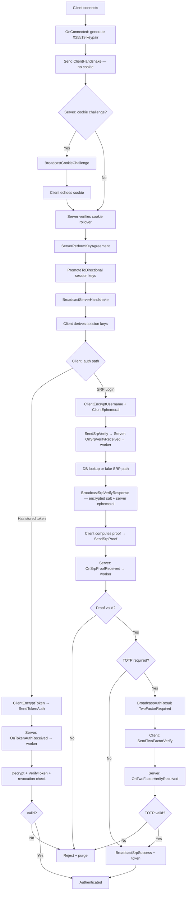

# FishMMO-Auth

## Short description:
A transport-agnostic .NET authentication library for FishMMO that provides secure handshake, SRP-6a login, token issuance/validation, TOTP two-factor authentication, and ready-to-subclass engine-independent authenticator cores for both server and client.

## Table of Contents
- [Overview](#overview)
- [Supported Platforms](#supported-platforms)
- [Features / Capabilities / Security Features](#features--capabilities--security-features)
- [Prerequisites](#prerequisites)
- [Installation / Build](#installation--build)
- [Quick Start Guides](#quick-start-guides)
- [Configuration](#configuration)
- [Usage Examples](#usage-examples)
- [Operational Checks](#operational-checks)
- [Flow Diagram](#flow-diagram)
- [Project Structure](#project-structure)
- [License](#license)

## Overview

FishMMO-Auth is organized into three `netstandard2.1` projects (all with `<Nullable>enable</Nullable>`), each building to a separate DLL:

### FishMMO-AuthShared
The shared core — protocol contracts, cryptographic services, and handshake support used by both client and server.

- **DTOs, Enums, and Interfaces** — `AuthenticationDTOs`, `AccessLevel`/`AuthState`/`ClientAuthenticationResult`, and the core interfaces used by the authenticator cores.
- **ConnectionEncryptionData** — Per-connection session keys, nonce contexts, and auth-state tracking.
- **CryptoHelper** — Cryptographic backbone: HKDF, AES-GCM, HMAC-SHA256/SHA512, nonce contexts, X25519 ephemeral keypairs, and 2FA utilities.
- **HandshakeService** — X25519 ECDH key agreement, stateless HMAC cookie challenge/verification, protocol version negotiation, IP normalization, and key confirmation MACs.
- **SrpService** — encrypted SRP field handling, registration encryption, TOTP payload encryption/decryption, fake-salt derivation, and account verification payload encryption.
- **TokenService** — token build/hash/encrypt/decrypt/verify pipeline.
- **ClientSrpData** — Client-side SRP-6a session state with sensitive-field cleanup.

### FishMMO-ClientAuth
The client-side authenticator, with a single public class:
- **ClientAuthenticatorCore** — Full client-side auth state machine. Implements the complete SRP-6a + X25519 ECDH client flow including cookie challenge echo, key agreement, token auth (World/Scene), SRP verify/proof, TOTP, and key material cleanup. Subclass to supply transport broadcasts and application-layer callbacks.

### FishMMO-ServerAuth
The server-side authenticator infrastructure — engine-independent cores, collections, account managers, and request types.

- **Bounded Concurrent Collections** — `ArrivalOrderTracker<TKey>` (insertion-ordered TTL tracker), `ExpiringKeyTracker<TKey>` (debounce/rate-limit tracker), and `LastSeenCacheTracker<TKey, TValue>` (LRU-style last-seen cache).
- **Account Manager Interfaces** — `IAccountManager<TConnection>` for auth-state transitions, `ISrpAccountManager<TConnection>` for SRP session storage, and `ITokenAccountManager<TConnection>` for token-authenticated connection registration.
- **BaseAuthenticatorCore\<TConnection\>** — Abstract engine-independent base for all server authenticators. Handles the X25519 ECDH cookie-challenge/handshake pipeline, stale-auth TTL sweeps, per-IP and global handshake rate limiting, and connection auth-state tracking. Subclass by implementing the abstract transport callbacks.
- **SrpAuthenticatorCore\<TConnection\>** — LoginServer authenticator. Extends `BaseAuthenticatorCore` with bounded-channel SRP verify/proof workers, TOTP two-factor authentication, kick-request debouncing, per-IP/per-account rate limiting, and auth token issuance. Subclass to supply database operations and transport broadcasts.
- **TokenAuthenticatorCore\<TConnection\>** — World/Scene server authenticator. Extends `BaseAuthenticatorCore` with a bounded-channel token auth worker that decrypts, verifies, and revocation-checks client-supplied tokens. Subclass to supply the signing-key lookup and revocation check.
- **Account Managers** — Concrete `AccountManager`, `SrpAccountManager`, and `TokenAccountManager` for per-connection encryption data and SRP/token session storage.
- **AccountData** — Post-authentication account binding (username, access level).
- **ServerSrpData** — Server-side SRP-6a session state with sensitive-field cleanup.
- **SrpVerifyRequest\<TConnection\>** and **SrpProofRequest\<TConnection\>** — Lightweight immutable tickets enqueued to async workers.

## Supported Platforms
- .NET Standard `2.1` consumers.
- Linux, Windows, and macOS runtimes capable of running .NET Standard 2.1 libraries.
- Unity integration is supported through the post-build copy targets that place `FishMMO-AuthShared.dll`, `FishMMO-ClientAuth.dll`, and `FishMMO-ServerAuth.dll` into `FishMMO-Unity/Assets/Dependencies`.

## Features / Capabilities / Security Features
### Engine-independent authenticator cores:
- `BaseAuthenticatorCore<TConnection>` — stateless HMAC cookie challenge, X25519 ECDH key agreement, stale-auth TTL sweeps (bounded scan/remove), per-IP debounce, and global handshake-per-second cap.
- `SrpAuthenticatorCore<TConnection>` — bounded-channel SRP verify/proof workers, per-IP SRP rate limiting, account-verify debouncing, TOTP two-factor gate (semaphore-limited concurrency, per-username failure lockout), kick-request tracking, and auth token issuance with hash persistence.
- `TokenAuthenticatorCore<TConnection>` — bounded-channel token auth worker with timing-equalization dummy-key path and revocation check.
- `ClientAuthenticatorCore` — full client-side auth state machine with cookie echo, ECDH, SRP verify/proof, TOTP, token path, and zeroing key material cleanup.

### Handshake and session establishment:
- Stateless HMAC-SHA256 cookie challenge with rollover validation (`ComputeHandshakeCookie`, `VerifyHandshakeCookieWithRollover`).
- IP normalization for consistent identity/rate-limit binding (`NormalizeIp`).
- X25519 ECDH ephemeral key agreement for forward secrecy.
- Protocol version negotiation and transcript binding with crypto-suite binding.
- Bidirectional key confirmation MAC verification.

### SRP authentication:
- SRP-6a client/server support (`ClientSrpData`, `ServerSrpData`).
- Encrypted SRP verify/proof payload support with strict sequence ordering.
- Fake SRP data path to reduce account-enumeration timing signal.
- Deterministic per-username fake salt derivation (HMAC-SHA512) so fake and real responses are ciphertext-size indistinguishable.

### Token auth:
- Signed auth token generation and verification (HMAC-SHA256 envelope).
- Token hash generation for revocation indexing.
- Decrypt + partial parse + full verify pipeline with timing-equalization path for missing signing keys.
- Access level and expiration checks built into verify flow.

### TOTP two-factor authentication:
- Per-username failure counting and lockout (`MaxTotpFailuresPerUsername`, `TotpUsernameLockoutDuration`).
- Semaphore-limited concurrent verifications (`MaxConcurrentTotpVerifications`).
- Per-attempt attempt cap before force-disconnect (`MaxTotpAttempts`).
- TOTP secret generation, AES-GCM encryption/decryption, otpauth URI generation, and code validation helpers in `CryptoHelper`.

### 2FA and account verification:
- Recovery code generation, hashing, and verification helpers.
- Encrypted 2FA setup payload handling (otpauth URI + recovery codes).
- Encrypted account verification payload handling.

### Defensive cryptography and state handling:
- AES-GCM with AAD bound to message type/version/sequence.
- Strict UTF-8 decoding for decrypted payload validation.
- Constant-time comparisons for MAC/token checks.
- Sequence and nonce contexts to detect out-of-order/duplicate messages.
- Sensitive `byte[]` cleanup with `CryptographicOperations.ZeroMemory` wherever possible.
- Nullable reference types enabled (`<Nullable>enable</Nullable>`) — all public/internal APIs are null-annotated.
- Full XML documentation on all public and protected members.

### Bounded concurrent collections (Core/Collections):
- `ArrivalOrderTracker<TKey>` — insertion-order-preserving tracker backed by a `LinkedList`+`Dictionary`; O(1) peek/pop oldest.
- `ExpiringKeyTracker<TKey>` — TTL-based debounce/rate-limit tracker; `TryBegin` rejects duplicate attempts within the debounce window.
- `LastSeenCacheTracker<TKey, TValue>` — last-seen LRU-style cache with per-sweep TTL expiry; used to cache resolved connection IPs.

## Prerequisites
- .NET SDK that supports `netstandard2.1` builds (recommended: .NET 8 SDK installed locally).
- NuGet package restore access.
- Referenced sibling projects available at:
  - `../FishMMO-SharedUtility/FishMMO-SharedUtility/FishMMO-SharedUtility.csproj`
  - `../FishMMO-Logger/FishMMO-Logger/FishMMO-Logger.csproj`

External packages used:
- `BouncyCastle.Cryptography` (`2.5.1`)
- `srp` (`1.0.7`)
- `Otp.NET` (`1.4.0`)

## Installation / Build
From repository root:

```bash
dotnet restore FishMMO-Auth/FishMMO-Auth.slnx
dotnet build FishMMO-Auth/FishMMO-Auth.slnx -c Debug
```

Build the individual library projects:

```bash
dotnet build FishMMO-Auth/FishMMO-AuthShared/FishMMO-AuthShared.csproj -c Release
dotnet build FishMMO-Auth/FishMMO-ClientAuth/FishMMO-ClientAuth.csproj -c Release
dotnet build FishMMO-Auth/FishMMO-ServerAuth/FishMMO-ServerAuth.csproj -c Release
```

Notes:
- Each project has a post-build target (`CopyToUnityDependencies`) that copies its DLL (`FishMMO-AuthShared.dll`, `FishMMO-ClientAuth.dll`, or `FishMMO-ServerAuth.dll`) into `../FishMMO-Unity/Assets/Dependencies`.
- If the Unity path does not exist in your local layout, adjust or disable the target in the corresponding `.csproj`.

## Quick Start Guides
### 1) Server-Side SRP Login (subclassing SrpAuthenticatorCore)
Subclass `SrpAuthenticatorCore<TConnection>` and implement the abstract members:

```csharp
public class MyLoginAuthenticator : SrpAuthenticatorCore<NetworkConnection>
{
    public MyLoginAuthenticator(ISrpAccountManager<NetworkConnection> accountManager)
        : base(accountManager) { }

    // Transport callbacks
    protected override bool IsConnectionAuthenticated(NetworkConnection conn) => conn.IsAuthenticated;
    protected override bool IsConnectionActive(NetworkConnection conn) => conn.IsActive;
    protected override string GetConnectionAddress(NetworkConnection conn) => conn.RemoteAddress;
    protected override int GetConnectionClientId(NetworkConnection conn) => conn.ClientId;
    protected override void DisconnectConnection(NetworkConnection conn, bool graceful) => conn.Disconnect(graceful);
    protected override void BroadcastCookieChallenge(NetworkConnection conn, byte[] cookie) { /* send broadcast */ }
    protected override void BroadcastServerHandshake(NetworkConnection conn, byte[] serverPublicKey, ushort agreedVersion) { /* send broadcast */ }
    protected override void BroadcastAuthResult(NetworkConnection conn, ClientAuthenticationResult result, bool reliable) { /* send broadcast */ }
    protected override void BroadcastSrpVerifyResponse(NetworkConnection conn, byte[] encSalt, byte[] encServerEphemeral) { /* send broadcast */ }
    protected override void BroadcastSrpSuccess(NetworkConnection conn, byte[] encServerProof, ClientAuthenticationResult result, byte[]? encToken) { /* send broadcast */ }
    protected override void OnAuthenticationResult(NetworkConnection conn, bool authenticated) { /* pass/fail auth */ }
    protected override void EnqueueMainThread(NetworkConnection conn, Action action) => mainThreadDispatcher.Enqueue(action);
    protected override bool IsAllowedUsername(string username) => Authentication.IsAllowedUsername(username);
    protected override bool IsAllowedEmailUsername(string email) => Authentication.IsAllowedEmailUsername(email);

    // Database operations
    protected override Task<SrpAccountLookupResult> FetchAccountForLoginAsync(string identifier, bool isEmail) { /* DB lookup */ }
    protected override Task<bool> CheckIsOnlineAsync(string username) { /* DB check */ }
    protected override Task<bool> CheckHasPendingKickAsync(string username) { /* DB check */ }
    protected override Task PersistKickRequestAsync(string username) { /* DB write */ }
    protected override Task PersistTokenHashAsync(string username, string tokenHash, int expirationMinutes) { /* DB write */ }
    protected override Task<bool> VerifyTotpCodeAsync(string username, string totpCode, byte[] totpMasterKey) { /* DB + TOTP verify */ }
}

// On startup:
var auth = new MyLoginAuthenticator(srpAccountManager);
auth.TokenSigningKey = signingKeyBytes;  // 32-byte HMAC key
auth.TotpMasterKey   = totpMasterKeyBytes; // 32-byte AES key, nullable
auth.LoginServerId   = myServerId;
auth.InitializeWorkers(cancellationToken);

// Each tick:
auth.Tick();           // stale-auth sweep + handshake rate-limit sweep
auth.TickRateLimits(); // kick-request debounce + IP/account rate-limit sweep

// On disconnect:
auth.HandleConnectionStopped(conn);
```

### 2) Server-Side Token Auth (subclassing TokenAuthenticatorCore)
Subclass `TokenAuthenticatorCore<TConnection>` for World/Scene servers:

```csharp
public class MyWorldAuthenticator : TokenAuthenticatorCore<NetworkConnection>
{
    public MyWorldAuthenticator(ITokenAccountManager<NetworkConnection> accountManager)
        : base(accountManager) { }

    protected override bool IsConnectionAuthenticated(NetworkConnection conn) => conn.IsAuthenticated;
    protected override bool IsConnectionActive(NetworkConnection conn) => conn.IsActive;
    protected override string GetConnectionAddress(NetworkConnection conn) => conn.RemoteAddress;
    protected override int GetConnectionClientId(NetworkConnection conn) => conn.ClientId;
    protected override void DisconnectConnection(NetworkConnection conn, bool graceful) => conn.Disconnect(graceful);
    protected override void BroadcastCookieChallenge(NetworkConnection conn, byte[] cookie) { /* send broadcast */ }
    protected override void BroadcastServerHandshake(NetworkConnection conn, byte[] serverPublicKey, ushort agreedVersion) { /* send broadcast */ }
    protected override void BroadcastAuthResult(NetworkConnection conn, ClientAuthenticationResult result, bool reliable) { /* send broadcast */ }
    protected override void OnAuthenticationResult(NetworkConnection conn, bool authenticated) { /* pass/fail auth */ }
    protected override void EnqueueMainThread(NetworkConnection conn, Action action) => mainThreadDispatcher.Enqueue(action);

    protected override Task<byte[]> FetchSigningKeyAsync(long loginServerId) { /* DB lookup */ }
    protected override Task<bool> CheckTokenRevocationAsync(string tokenHash) { /* DB check */ }
}
```

### 3) Client-Side Auth (subclassing ClientAuthenticatorCore)
Subclass `ClientAuthenticatorCore` in your client project:

```csharp
public class MyClientAuth : ClientAuthenticatorCore
{
    // On connect, set credentials first:
    // auth.SetLoginCredentials(username, password);
    // Then call auth.OnConnected() from your transport OnConnected callback.

    protected override void SendClientHandshake(byte[] publicKey, byte[]? cookie, ushort minVersion, ushort maxVersion) { /* send broadcast */ }
    protected override void SendTokenAuth(byte[] encryptedToken, uint seq) { /* send broadcast */ }
    protected override void SendSrpVerify(byte[] encUser, byte[] encEphemeral, uint seq) { /* send broadcast */ }
    protected override void SendSrpProof(byte[] encProof, uint seq) { /* send broadcast */ }
    protected override void SendCreateAccount(byte[] encUser, byte[] encEmail, byte[] encAge, byte[] encSalt, byte[] encVerifier, uint seq) { /* send broadcast */ }
    protected override void SendAccountVerify(byte[] encUser, byte[] encCode, uint seq) { /* send broadcast */ }
    protected override void SendTwoFactorVerify(byte[] encCode, uint seq) { /* send broadcast */ }
    protected override void Disconnect() { /* disconnect transport */ }
    protected override void OnAuthResultCallback(ClientAuthenticationResult result) { /* notify UI */ }
    protected override void OnTwoFactorSetupCallback(string otpauthUri, string[] recoveryCodes) { /* show QR */ }
    protected override bool IsAllowedUsername(string username) => Authentication.IsAllowedUsername(username);
    protected override bool IsAllowedPassword(string password) => Authentication.IsAllowedPassword(password);
    protected override bool IsAllowedEmailUsername(string email) => Authentication.IsAllowedEmailUsername(email);
}
```

### 4) Low-Level: Handshake + Key Setup
Use `HandshakeService` directly when not using the authenticator cores:

```csharp
var result = HandshakeService.ServerPerformKeyAgreement(clientPub, clientMinVersion, clientMaxVersion);
if (!result.Success) return;

var enc = new ConnectionEncryptionData(clientPub) { AgreedVersion = result.AgreedVersion };
enc.PromoteToDirectional(result.SessionKeys);
```

### 5) Low-Level: Verify Token
Use `TokenService` directly for custom token validation:

```csharp
if (!TokenService.TryDecryptAndPartialParse(encryptedToken, encryptionData, seq, out var rawToken, out var loginServerId))
    return;

var verify = TokenService.VerifyToken(rawToken, signingKey, signingKeyFound: true, preParseLoginServerId: loginServerId);
if (!verify.IsValid) return;

// verify.AccountName, verify.AccessLevel, verify.TokenHash are now available.
CryptographicOperations.ZeroMemory(rawToken);
```

## Configuration
Core protocol/security knobs exposed in code:
- `CryptoHelper.MinSupportedProtocolVersion` / `MaxSupportedProtocolVersion`
- `HandshakeService.CookieTimeBucketSeconds`
- `HandshakeService.CryptoSuiteId`
- `CryptoHelper.MaxTokenLifetimeMinutes`
- `CryptoHelper.MaxSrpPayloadBytes`
- `CryptoHelper.MaxAesCiphertextSize`

`SrpAuthenticatorCore` runtime configuration (set before `InitializeWorkers`):
- `TokenSigningKey` — 32-byte HMAC-SHA256 key for token issuance. Required; if null, token issuance is disabled.
- `TotpMasterKey` — 32-byte AES key for decrypting TOTP secrets stored in the database. Optional; if null, TOTP is disabled.
- `LoginServerId` — database ID embedded in issued tokens.
- `TokenExpirationMinutes` — token validity window (default `10f`).

Operational configuration expectations:
- Provide strong key material for HMAC/token signing/fake-salt derivation.
- Keep server clocks synchronized for token expiry and TOTP window correctness.
- Maintain token-revocation storage keyed by `TokenHash`.
- Call `auth.Tick()` and `auth.TickRateLimits()` each server tick.
- Call `auth.HandleConnectionStopped(conn)` on every disconnect.

## Operational Checks
Use this checklist when validating a deployment or integration:

### Handshake checks:
- Verify cookie challenge is enabled and validated with rollover support.
- Confirm per-IP debounce and global handshake-per-second cap are active (built into `BaseAuthenticatorCore`).
- Confirm negotiated protocol version falls within `[MinSupportedProtocolVersion, MaxSupportedProtocolVersion]`.
- Verify key confirmation MACs are validated before accepting encrypted auth traffic.

### Authenticator core checks:
- Confirm `InitializeWorkers(cancellationToken)` is called before accepting connections.
- Confirm `ShutdownWorkers()` is called on server shutdown to gracefully drain channels and zero key material.
- Confirm `Tick()` is called every server tick to run stale-auth sweeps.
- Confirm `TickRateLimits()` is called every server tick (SRP servers only).
- Confirm `HandleConnectionStopped(conn)` is called on every disconnect.

### Sequence/nonce checks:
- Reject duplicated or out-of-order sequences (`TryConsumeReceiveSequence`).
- Tear down connections on SRP sequence atomicity failures during multi-field decrypt.

### Token checks:
- Use `TryDecryptAndPartialParse` before DB key lookup.
- Always run `VerifyToken`, including the dummy-key timing path when the key is missing.
- Enforce expiration and revocation checks before marking authenticated.

### Secret hygiene checks:
- Zero raw tokens and temporary sensitive byte buffers after use.
- Clear per-connection SRP state after successful SRP auth (`ClearSrpState`).
- Call `ClearKeyMaterial()` on the client after key material is no longer needed.
- Rotate signing keys and cookie HMAC keys according to your security policy.

### 2FA checks:
- Track and enforce anti-replay window (`lastWindow`) for TOTP validation.
- Store only AES-GCM encrypted TOTP secrets and hashed recovery codes.
- Confirm `TotpMasterKey` is set before TOTP features are used.

## Flow Diagram


## Project Structure
```text
FishMMO-Auth/
  FishMMO-Auth.slnx                              — Solution file (3 projects)
  FishMMO-AuthShared/                            — Shared core (netstandard2.1)
    FishMMO-AuthShared.csproj                    — Depends on SharedUtility + Logger
    Core/
      DTOs/AuthenticationDTOs.cs                 — Engine-independent broadcast payload structs
      Enums/
        AccessLevel.cs
        AuthState.cs
        ClientAuthenticationResult.cs
    Implementation/
      Connection/ConnectionEncryptionData.cs     — Per-connection session keys, nonces, auth state
      Crypto/
        CryptoHelper.cs                          — HKDF, AES-GCM, HMAC, X25519, nonces, 2FA
        KeyEnvelope.cs                           — AEAD-wrapped key envelope
      Services/
        HandshakeService.cs                      — X25519 key agreement, cookie challenge, IP norm
        IKmsProvider.cs                          — Key management service interface
        SrpService.cs                            — SRP payload encryption, fake-salt derivation
        TokenService.cs                          — Token build/hash/encrypt/decrypt/verify
      SRP/
        ClientSrpData.cs                         — Client SRP-6a session state with cleanup

  FishMMO-ClientAuth/                            — Client auth (netstandard2.1)
    FishMMO-ClientAuth.csproj                    — Depends on AuthShared
    Implementation/
      Auth/
        ClientAuthenticatorCore.cs               — Full client-side auth state machine

  FishMMO-ServerAuth/                            — Server auth (netstandard2.1)
    FishMMO-ServerAuth.csproj                    — Depends on AuthShared + srp + Channels
    Core/
      Collections/
        ArrivalOrderTracker.cs                   — Insertion-order TTL tracker (LinkedList + Dict)
        ExpiringKeyTracker.cs                    — TTL debounce / rate-limit tracker
        LastSeenCacheTracker.cs                  — Last-seen LRU cache with TTL sweep
      Interfaces/
        IAccountManager.cs                       — Auth-state transitions + encryption data
        ISrpAccountManager.cs                    — SRP session storage and sweep
        ITokenAccountManager.cs                  — Token-authenticated connection registration
    Implementation/
      Account/
        AccountManager.cs                        — Per-connection encryption data store
        SrpAccountManager.cs                     — SRP session store
        TokenAccountManager.cs                   — Token-authenticated connection store
      Auth/
        BaseAuthenticatorCore.cs                 — Abstract server base: handshake, cookie, sweeps
        SrpAuthenticatorCore.cs                  — LoginServer SRP + TOTP + token issuance core
        TokenAuthenticatorCore.cs                — World/Scene token auth core
      Connection/
        AccountData.cs                           — Post-auth account binding (username, access)
      Requests/
        SrpProofRequest.cs                       — Immutable SRP proof worker ticket
        SrpVerifyRequest.cs                      — Immutable SRP verify worker ticket
      SRP/
        ServerSrpData.cs                         — Server SRP-6a session state with cleanup
```

## License
See the main FishMMO repository for license information.