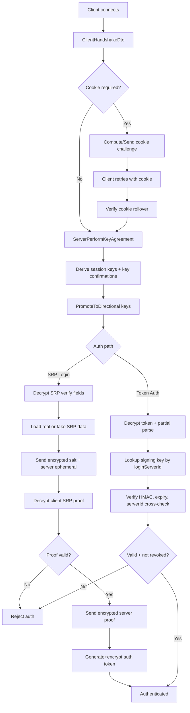

# FishMMO-Auth

## Short description:
A transport-agnostic .NET authentication library for FishMMO that provides secure handshake, SRP login, token issuance/validation, and 2FA helper cryptography.

## Table of Contents
- [Overview](#overview)
- [Supported Platforms](#supported-platforms)
- [Features / Capabilities / Security Features](#features--capabilities--security-features)
- [Prerequisites](#prerequisites)
- [Installation / Build](#installation--build)
- [Quick Start Guides](#quick-start-guides)
- [Configuration](#configuration)
- [Usage Examples](#usage-examples)
- [Operational Checks](#operational-checks)
- [Flow Diagram](#flow-diagram)
- [Project Structure](#project-structure)
- [License](#license)

## Overview
`FishMMO-Auth` targets `netstandard2.1` and is organized into two major areas:
- `Core`: protocol DTOs, auth/result enums, and account-management interfaces.
- `Implementation`: concrete cryptographic and protocol helpers for handshake, SRP, token auth, and 2FA-related encrypted payload handling.
- DTOs in `Core/DTOs/AuthenticationDTOs.cs` mirror network broadcast payloads while remaining engine-independent.
- Interfaces in `Core/Interfaces` define account state transitions (`AuthState`) and separate SRP-specific vs token-specific account manager behaviors.
- `Implementation/Services/HandshakeService.cs` handles X25519 ECDH key agreement, cookie challenge/verification, protocol negotiation, and key confirmation MACs.
- `Implementation/Services/SrpService.cs` handles encrypted SRP fields, registration encryption, TOTP payload encryption/decryption, and account verification encryption.
- `Implementation/Services/TokenService.cs` handles token build/hash/encrypt/decrypt/verify workflows.
- `Implementation/Crypto/CryptoHelper.cs` is the cryptographic backbone (HKDF, AES-GCM, HMAC, token format parsing/signing, nonce contexts, 2FA utilities).
- Connection/account containers (`Implementation/Connection`) and SRP session classes (`Implementation/SRP`) encapsulate per-connection state and sensitive cleanup.

## Supported Platforms
- .NET Standard `2.1` consumers.
- Linux, Windows, and macOS runtimes capable of running .NET Standard 2.1 libraries.
- Unity integration is supported through the post-build copy target that places `FishMMO-Auth.dll` into `FishMMO-Unity/Assets/Dependencies`.

## Features / Capabilities / Security Features
# Handshake and session establishment:
- Stateless HMAC cookie challenge with rollover validation (`ComputeHandshakeCookie`, `VerifyHandshakeCookieWithRollover`).
- IP normalization for consistent identity/rate-limit binding (`NormalizeIp`).
- X25519 ECDH ephemeral key agreement for forward secrecy.
- Protocol version negotiation and transcript binding with crypto-suite binding.
- Bidirectional key confirmation MAC verification.

# SRP authentication:
- SRP-6a client/server support (`ClientSrpData`, `ServerSrpData`).
- Encrypted SRP verify/proof payload support with strict sequence ordering.
- Fake SRP data support to reduce account-enumeration signal.
- Deterministic per-username fake salt derivation (HMAC-SHA512).

# Token auth:
- Signed auth token generation and verification (HMAC-SHA256 envelope).
- Token hash generation for revocation indexing.
- Decrypt + partial parse + full verify pipeline with timing-equalization path for missing signing keys.
- Access level and expiration checks built into verify flow.

# 2FA and account verification:
- TOTP secret generation, encryption/decryption, URI generation, and code validation helpers.
- Recovery code generation, hashing, and verification helpers.
- Encrypted 2FA setup payload handling.
- Encrypted account verification payload handling.

# Defensive cryptography and state handling:
- AES-GCM with AAD bound to message type/version/sequence.
- Strict UTF-8 decoding for decrypted payload validation.
- Constant-time comparisons for MAC/token checks.
- Sequence and nonce contexts to detect out-of-order/duplicate messages.
- Sensitive `byte[]` cleanup with `CryptographicOperations.ZeroMemory` where possible.

## Prerequisites
- .NET SDK that supports `netstandard2.1` builds (recommended: .NET 8 SDK installed locally).
- NuGet package restore access.
- Referenced sibling project available at:
- `../FishMMO-SharedUtility/FishMMO-SharedUtility/FishMMO-SharedUtility.csproj`

External packages used:
- `BouncyCastle.Cryptography` (`2.5.1`)
- `srp` (`1.0.7`)
- `Otp.NET` (`1.4.0`)

## Installation / Build
From repository root:

```bash
dotnet restore
dotnet build FishMMO-Auth.slnx -c Debug
```

Build the library project directly:

```bash
dotnet build FishMMO-Auth/FishMMO-Auth.csproj -c Release
```

Notes:
- The project has a post-build target (`CopyToUnityDependencies`) that copies `FishMMO-Auth.dll` into `../FishMMO-Unity/Assets/Dependencies`.
- If the Unity path does not exist in your local layout, adjust or disable that target in `FishMMO-Auth/FishMMO-Auth.csproj`.

## Quick Start Guides
### 1) Handshake + Key Setup
1. Receive client handshake DTO (`ClientHandshakeDto`) with client ephemeral public key and supported version range.
2. Optionally enforce cookie challenge flow using `HandshakeService.ComputeHandshakeCookie` / verify on retry.
3. Run `HandshakeService.ServerPerformKeyAgreement(...)`.
4. Store keys in `ConnectionEncryptionData` and call `PromoteToDirectional(sessionKeys)`.
5. Send `ServerHandshakeDto` and verify key confirmation tags.

### 2) SRP Login (Login Server)
1. Transition connection auth state from `Handshake` to `VerifyPending`.
2. Decrypt SRP verify fields with `SrpService.TryDecryptVerifyFields(...)`.
3. Load account SRP data from persistence or fake SRP path for unknown accounts.
4. Create/store `ServerSrpData` and respond via `SrpService.EncryptVerifyResponse(...)`.
5. Decrypt and verify proof (`SrpService.DecryptProof`, `ServerSrpData.GetProof`).
6. Return encrypted server proof and optional encrypted token.
7. Clear SRP state (`ClearSrpState`) after successful auth.

### 3) Token Auth (World/Scene)
1. Decrypt client token payload via `TokenService.TryDecryptAndPartialParse(...)`.
2. Resolve signing key by `LoginServerId` and call `TokenService.VerifyToken(...)`.
3. Validate `IsValid`, expiration, and revocation status (using `TokenHash`).
4. Set account auth state to `Authenticated` and map account/connection.

## Configuration
Core protocol/security knobs exposed in code:
- `CryptoHelper.MinSupportedProtocolVersion` / `MaxSupportedProtocolVersion`
- `HandshakeService.CookieTimeBucketSeconds`
- `HandshakeService.CryptoSuiteId`
- `CryptoHelper.MaxTokenLifetimeMinutes`
- `CryptoHelper.MaxSrpPayloadBytes`
- `CryptoHelper.MaxAesCiphertextSize`

Operational configuration expectations:
- Provide strong key material for HMAC/token signing/fake-salt derivation.
- Enforce transport-layer per-IP and global handshake rate limits (explicitly required by handshake remarks).
- Maintain token-revocation storage keyed by token hash.
- Keep server clocks synchronized for token expiry and TOTP window correctness.

## Usage Examples
### Server: Perform Key Agreement
```csharp
var result = HandshakeService.ServerPerformKeyAgreement(clientPub, clientMinVersion, clientMaxVersion);
if (!result.Success)
    return; // reject handshake

var enc = new ConnectionEncryptionData(clientPub)
{
    AgreedVersion = result.AgreedVersion,
};
enc.PromoteToDirectional(result.SessionKeys);

bool keyConfirmOk = HandshakeService.VerifyKeyConfirmation(clientFinishedMac, result.ExpectedClientKeyConfirmation);
```

### Server: Verify Token
```csharp
if (!TokenService.TryDecryptAndPartialParse(encryptedToken, encryptionData, seq, out var rawToken, out var loginServerId))
    return;

var verify = TokenService.VerifyToken(rawToken, signingKey, signingKeyFound: true, preParseLoginServerId: loginServerId);
if (!verify.IsValid)
    return;

// verify.AccountName, verify.AccessLevel, verify.TokenHash are now available.
CryptographicOperations.ZeroMemory(rawToken);
```

### Client: Encrypt SRP Username and Ephemeral
```csharp
SrpService.ClientEncryptUsername(
    username,
    clientToServerKey,
    sendNonceCtx,
    agreedVersion,
    isRegistration: false,
    out var encUser,
    out var userSeq);

SrpService.ClientEncryptEphemeral(
    publicEphemeral,
    clientToServerKey,
    sendNonceCtx,
    agreedVersion,
    out var encEphemeral,
    out var ephSeq);
```

## Operational Checks
Use this checklist when validating a deployment or integration:
- Handshake checks:
- Verify cookie challenge enabled and validated with rollover support.
- Ensure per-IP and global handshake throttling exists in transport layer.
- Confirm negotiated protocol version falls within supported range.
- Verify key confirmation MACs are validated before accepting encrypted auth traffic.

- Sequence/nonce checks:
- Reject duplicated or out-of-order sequences (`TryConsumeReceiveSequence`).
- Tear down connections on SRP sequence atomicity failures during multi-field decrypt.

- Token checks:
- Use `TryDecryptAndPartialParse` before DB key lookup.
- Always run `VerifyToken`, including dummy-key timing path when key missing.
- Enforce expiration and revocation checks before marking authenticated.

- Secret hygiene checks:
- Zero raw tokens and temporary sensitive byte buffers after use.
- Clear per-connection SRP state after successful SRP auth.
- Rotate signing and cookie keys according to your security policy.

- 2FA checks:
- Track and enforce anti-replay window (`lastWindow`) for TOTP validation.
- Store only encrypted TOTP secrets and hashed recovery codes.

## Flow Diagram


## Project Structure
```text
FishMMO-Auth/
  FishMMO-Auth.csproj
  Core/
    DTOs/
      AuthenticationDTOs.cs
    Enums/
      AccessLevel.cs
      AuthState.cs
      ClientAuthenticationResult.cs
    Interfaces/
      IAccountManager.cs
      ISrpAccountManager.cs
      ITokenAccountManager.cs
  Implementation/
    Connection/
      AccountData.cs
      ConnectionEncryptionData.cs
    Crypto/
      CryptoHelper.cs
    Requests/
      SrpProofRequest.cs
      SrpVerifyRequest.cs
    Services/
      HandshakeService.cs
      SrpService.cs
      TokenService.cs
    SRP/
      ClientSrpData.cs
      ServerSrpData.cs
```

## License
See the main FishMMO repository for license information.