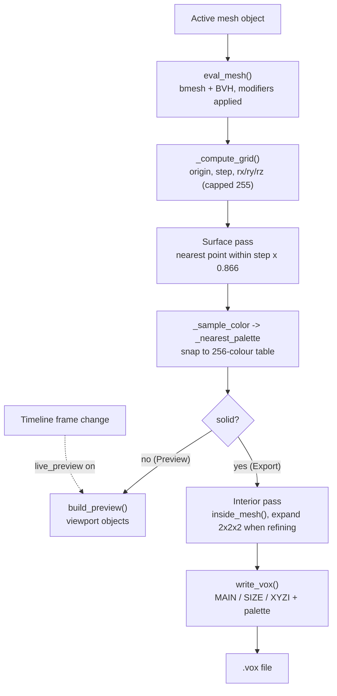

# FishMMO Blender Tools

Blender addons used in the FishMMO art pipeline. Currently one addon:
**FishMMO Voxel Pro**, a mesh → MagicaVoxel (`.vox`) exporter with a live
viewport preview.

## Table of Contents

- [Overview](#overview)
- [Requirements](#requirements)
- [Installation](#installation)
- [Usage](#usage)
- [Settings](#settings)
- [How Voxelization Works](#how-voxelization-works)
- [Output Format](#output-format)
- [Project Structure](#project-structure)
- [Limitations](#limitations)
- [Flow Diagram](#flow-diagram)
- [License](#license)

## Overview

Voxel Pro converts a selected mesh into a coloured voxel grid and writes it as a
MagicaVoxel 150 `.vox` file. Colour is sampled from the mesh's own material or
vertex colours and snapped to MagicaVoxel's default 256-entry palette, so the
export opens in MagicaVoxel looking like the source.

It also builds an in-viewport preview at a lower resolution, optionally
refreshing on every timeline frame change, so an artist can judge a voxel
resolution without a round trip through an export and an external viewer.

## Requirements

| Requirement | Version |
|---|---|
| Blender | 5.0+ (`bl_info["blender"] = (5, 0, 0)`) |
| Addon version | 3.0.2 |

No external Python packages — it uses only `bpy`, `bmesh`, `mathutils`, and
`struct` from Blender's bundled runtime.

## Installation

1. In Blender: **Edit → Preferences → Add-ons → Install…**
2. Select `fishmmo_voxel_exporter/fishmmo_voxel_exporter.py`.
3. Enable **Import-Export: FishMMO Voxel Pro**.
4. The panel appears in the 3D viewport sidebar (<kbd>N</kbd>) under the
   **FishMMO Voxel** tab.

## Usage

1. Select a mesh object and make it active. (Non-mesh or no selection reports
   `Select mesh` and cancels.)
2. Set **Preview Res**, click **Preview**, and iterate until the shape reads
   correctly.
3. Set **Export Res** and click **Export .vox**, then choose a destination.
4. **Clear Preview** removes the generated preview objects.

## Settings

Exposed on the scene as `voxelpro_settings`:

| Setting | Property | Range | Default | Purpose |
|---|---|---|---|---|
| Export Res | `resolution` | 8–512 | 64 | Voxel count along the longest axis for the `.vox` export |
| Preview Res | `preview_resolution` | 8–128 | 32 | Voxel count for the viewport preview; lower is faster |
| Live | `live_preview` | bool | off | Rebuild the preview whenever the timeline frame changes |
| 2× Refine | `refine` | bool | off | Double the *surface* sampling resolution to catch thin features such as fins and antennae |

### Operators

| Operator | `bl_idname` | Action |
|---|---|---|
| Export .vox | `voxelpro.export` | Voxelize solid and write the file |
| Preview | `voxelpro.preview` | Build the viewport preview |
| Clear Preview | `voxelpro.clear_preview` | Delete preview objects and unregister the live handler |

## How Voxelization Works

`voxelize(obj, resolution, solid, refine)` runs two passes over a BVH tree built
from the evaluated mesh (so modifiers are included):

1. **Surface pass** — walks the grid at `resolution × 2` when **2× Refine** is
   on, otherwise at `resolution`. A cell is filled when the nearest point on the
   mesh lies within half a voxel diagonal (`step × 0.866`) of the cell centre.
   Colour is sampled at that surface point and snapped to the nearest palette
   entry.
2. **Interior pass** *(export only, `solid=True`)* — walks the grid at the base
   resolution, skips cells already classified as surface, and fills those whose
   centre is inside the mesh. When refining, each interior sample expands to fill
   its 2×2×2 block of fine cells so the two passes share one grid.

Per-voxel bone weights are computed alongside (`_bone_weights_at_point`) and
returned by `voxelize`, but they are **not** written to the `.vox` file — the
format has nowhere to put them. They exist for downstream tooling.

The viewport preview calls the same function with `solid=False`, which is why it
is fast: it only ever evaluates the surface pass.

## Output Format

MagicaVoxel version 150 chunked format: a `MAIN` chunk containing `SIZE`, `XYZI`
(one `(x, y, z, colorIndex)` per voxel), and the palette. Colours come from
`DEFAULT_PALETTE`, MagicaVoxel's stock 256-colour table, with index 0 reserved
as unused.

**Each axis is capped at 255 voxels** regardless of the Export Res setting,
because the format stores coordinates as single bytes. Requesting 512 on a
roughly cubic mesh therefore yields 255 — raise resolution to capture detail,
but do not expect more than 255 cells on any axis.

## Project Structure

```
FishMMO-Blender/
└── fishmmo_voxel_exporter/
    └── fishmmo_voxel_exporter.py   # The entire addon (single file, ~890 lines)
```

Notable internals:

| Function | Responsibility |
|---|---|
| `eval_mesh` | Evaluated-mesh `bmesh` + BVH tree. Imports `BVHTree` lazily — a module-level import can fail depending on addon-load order |
| `inside_mesh` | Ray-parity interior test |
| `_sample_color` | Material / vertex-colour sampling at a surface point |
| `_nearest_palette` | Snap an RGBA value to the closest MagicaVoxel palette index |
| `_compute_grid` | Grid origin, step, and per-axis cell counts |
| `_bone_weights_at_point` | Barycentric blend of vertex-group weights |
| `write_vox` / `chunk` | MagicaVoxel 150 chunk writer |
| `build_preview` / `clear_preview` / `_live_handler` | Viewport preview lifecycle |

## Limitations

- Axis counts are clamped to 255 (format limit), so very high Export Res values
  saturate.
- Bone weights are computed but discarded on export.
- Voxelization is a pure-Python triple loop; high resolutions on dense meshes are
  slow. Preview at a low resolution first.
- One object at a time — the active mesh only, with no multi-object or
  collection export.

## Flow Diagram



## License

This project is part of the FishMMO project and is distributed under the FishMMO
project license.
