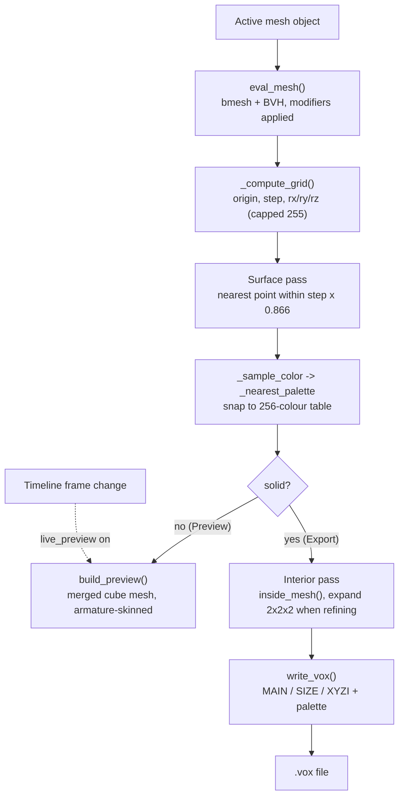

# FishMMO Blender Tools

Blender addons used in the FishMMO art pipeline. Currently one addon:
**FishMMO Voxel Pro**, a mesh → MagicaVoxel (`.vox`) exporter with a live
viewport preview.

## Table of Contents

- [Overview](#overview)
- [Requirements](#requirements)
- [Installation](#installation)
- [Usage](#usage)
- [Settings](#settings)
- [How Voxelization Works](#how-voxelization-works)
- [Output Format](#output-format)
- [Project Structure](#project-structure)
- [Limitations](#limitations)
- [Flow Diagram](#flow-diagram)
- [License](#license)

## Overview

Voxel Pro converts a selected mesh into a coloured voxel grid and writes it as a
MagicaVoxel 150 `.vox` file. Colour is sampled from the mesh's active vertex
colour layer, falling back to the face's material, and snapped to MagicaVoxel's
default 256-entry palette, so the export opens in MagicaVoxel looking like the
source. Image textures are never sampled — see [Limitations](#limitations).

It also builds an in-viewport preview at a lower resolution, optionally
refreshing on every timeline frame change, so an artist can judge a voxel
resolution without a round trip through an export and an external viewer.

## Requirements

| Requirement | Version |
|---|---|
| Blender | 5.0+ (`bl_info["blender"] = (5, 0, 0)`) |
| Addon version | 3.0.2 |

No external Python packages — it uses only `bpy`, `bmesh`, `mathutils`, and
`struct` from Blender's bundled runtime.

## Installation

1. In Blender: **Edit → Preferences → Add-ons → Install…**
2. Select `fishmmo_voxel_exporter/fishmmo_voxel_exporter.py`.
3. Enable **Import-Export: FishMMO Voxel Pro**.
4. The panel appears in the 3D viewport sidebar (<kbd>N</kbd>) under the
   **FishMMO Voxel** tab.

## Usage

1. Select a mesh object and make it active. (Non-mesh or no selection reports
   `Select mesh` and cancels.)
2. Set **Preview Res**, click **Preview**, and iterate until the shape reads
   correctly. Above 2,000,000 effective cells (`res ** 3`, doubled per axis when
   **2× Refine** is on) the operator reports a warning before it starts.
3. Set **Export Res** and click **Export .vox**, then choose a destination.
4. **Clear Preview** removes the generated preview objects.

## Settings

Exposed on the scene as `voxelpro_settings`:

| Setting | Property | Range | Default | Purpose |
|---|---|---|---|---|
| Export Res | `resolution` | 8–512 | 64 | Voxel count along the longest axis for the `.vox` export |
| Preview Res | `preview_resolution` | 8–128 | 32 | Voxel count for the viewport preview; lower is faster |
| Live | `live_preview` | bool | off | Build the preview on toggle and on frame change — see the note below |
| 2× Refine | `refine` | bool | off | Double the *surface* sampling resolution to catch thin features such as fins and antennae |

**Live** is not a per-frame re-voxelization. Switching it on records the active
mesh and builds the preview immediately (`_toggle_live`); switching it off clears
`_live_state` and calls `clear_preview()`. The `frame_change_post` handler
(`_live_handler`) re-voxelizes only while the preview object has no Armature
modifier — once `build_preview` has bound it to the source's armature, Blender's
own deformer animates it and the handler returns early. It also ignores **2×
Refine**, always voxelizing with `refine=False`.

### Operators

The `frame_change_post` handler is installed in `register()` and removed in
`unregister()` — no operator adds or removes it.

| Operator | `bl_idname` | Action |
|---|---|---|
| Export .vox | `voxelpro.export` | Voxelize solid and write the file |
| Preview | `voxelpro.preview` | Clear any existing preview, then build a new one |
| Clear Preview | `voxelpro.clear_preview` | Delete the `FishMMO_VoxelPreview` collection, its objects and meshes, and orphaned `FV_VoxelMat_*` materials |

## How Voxelization Works

`voxelize(obj, resolution, solid, refine)` runs two passes over a BVH tree built
from the evaluated mesh (so modifiers are included):

1. **Surface pass** — walks the grid at `resolution × 2` when **2× Refine** is
   on, otherwise at `resolution`. A cell is filled when the nearest point on the
   mesh lies within half a voxel diagonal (`step × 0.866`) of the cell centre.
   Colour is sampled at that surface point and snapped to the nearest palette
   entry.
2. **Interior pass** *(export only, `solid=True`)* — strides the same fine grid
   by `ds = surface_res // resolution` (2 when refining, else 1), re-runs the
   nearest-surface test at the coarse step, skips any cell that comes back on the
   surface, and fills the rest whose centre is inside the mesh (`inside_mesh`,
   a ray-parity test). When refining, each interior sample expands to fill its
   2×2×2 block of fine cells so the two passes share one grid.

Per-voxel bone weights are computed alongside (`_bone_weights_at_point`) and
returned by `voxelize`, but they are **not** written to the `.vox` file — the
format has nowhere to put them. They are consumed by `build_preview`, which uses
them to skin each cube rigidly (every vertex of a cube gets the same weights) so
the preview deforms with the source object's armature.

The viewport preview calls the same function with `solid=False`, which is why it
is fast: it only ever evaluates the surface pass.

## Output Format

MagicaVoxel version 150 chunked format: the file header `VOX ` + `150`, then a
`MAIN` chunk whose children are `SIZE`, `XYZI` (a count followed by one
`(x, y, z, colorIndex)` byte quad per voxel), and `RGBA`. Colours come from
`DEFAULT_PALETTE`, MagicaVoxel's stock 256-colour table, written whole; index 0
is reserved as unused, so `_nearest_palette` only ever returns 1–255 and matches
on RGB distance alone, ignoring alpha.

**Each axis is capped at 255 voxels** regardless of the Export Res setting,
because the format stores coordinates as single bytes. Requesting 512 on a
roughly cubic mesh therefore yields 255 — raise resolution to capture detail,
but do not expect more than 255 cells on any axis.

## Project Structure

```
FishMMO-Blender/
└── fishmmo_voxel_exporter/
    └── fishmmo_voxel_exporter.py   # The entire addon (single file, ~890 lines)
```

Notable internals:

| Function | Responsibility |
|---|---|
| `eval_mesh` | Evaluated-mesh `bmesh` + BVH tree. Imports `BVHTree` lazily — a module-level import can fail depending on addon-load order |
| `inside_mesh` | Ray-parity interior test |
| `_sample_color` | Active vertex-colour layer first, then the face material's Principled BSDF base colour or viewport colour; grey `(200, 200, 200, 255)` fallback |
| `_nearest_palette` | Snap an RGBA value to the closest MagicaVoxel palette index |
| `_compute_grid` | Grid origin, step, and per-axis cell counts |
| `_bone_weights_at_point` | Barycentric blend of vertex-group weights |
| `write_vox` / `chunk` | MagicaVoxel 150 chunk writer |
| `build_preview` / `clear_preview` / `_live_handler` | Viewport preview lifecycle — one merged mesh of cubes in the `FishMMO_VoxelPreview` collection, armature-skinned when the source object has an Armature modifier |
| `_toggle_live` | `live_preview` update callback — arms or clears `_live_state` |
| `_closest_point_on_tri_simple` | Barycentric helper behind the weight blend |

## Limitations

- Axis counts are clamped to 255 (format limit), so very high Export Res values
  saturate.
- Bone weights are computed but discarded on export.
- Voxelization is a pure-Python triple loop; high resolutions on dense meshes are
  slow. Preview at a low resolution first.
- One object at a time — the active mesh only, with no multi-object or
  collection export.
- Image textures are never read. `_sample_color` deliberately avoids image
  pixel access, which caused uncatchable C-level crashes in Blender 5.x on some
  texture types; a texture-only material resolves to its viewport colour, or to
  the grey fallback.

## Flow Diagram



## License

This project is part of the FishMMO project and is distributed under the FishMMO
project license.
