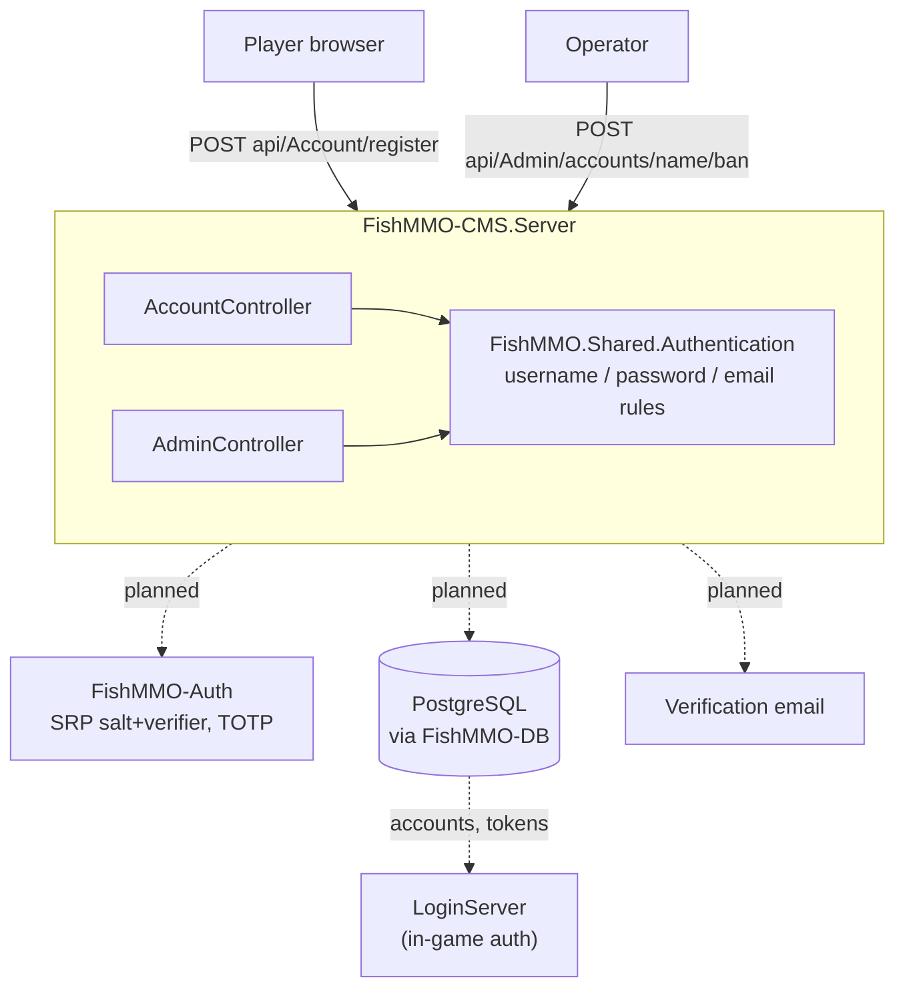

# FishMMO CMS

> **Status: scaffold.** The routes below exist and are reachable, but every
> handler body is a `TODO` stub that returns a canned success response. There is
> no database wiring, no authentication, and no persistence yet. Do not deploy
> this, and do not treat its endpoints as a working API.

An ASP.NET Core web API for **account management** — self-service registration
and password/2FA management for players, plus administrative account actions
(ban, access level, token revocation, 2FA reset) for operators. It is the
out-of-game counterpart to the in-game authentication handled by the LoginServer.

## Table of Contents

- [Overview](#overview)
- [Supported Platforms](#supported-platforms)
- [Project Structure](#project-structure)
- [Endpoints](#endpoints)
- [Configuration](#configuration)
- [Build and Run](#build-and-run)
- [Implementation Status](#implementation-status)
- [Flow Diagram](#flow-diagram)
- [License](#license)

## Overview

The CMS exists so that account operations that do not belong in the game client
— creating an account before first launch, recovering from a lost authenticator,
an operator banning a cheater — have a home outside the FishNet connection
lifecycle.

It is wired to share the same primitives as the rest of the stack rather than
reimplement them: SRP salt/verifier generation and TOTP helpers are to come from
`FishMMO-Auth` and persistence from `FishMMO-DB` — both are referenced and
imported but not yet called — while username, password, and email validation are
already delegated to `FishMMO.Shared.Authentication`
so the rules cannot drift from the ones the LoginServer enforces
(`FishMMO-SharedUtility/FishMMO-SharedUtility/Authentication.cs`).

> **The launcher's news panel does not come from here.** It is fetched from
> `Constants.Configuration.LauncherHtmlUrl`, which is baked at build time from
> `GeneratedHostConfig.LauncherHtmlUrl` (CI substitutes it from
> `FISHMMO_ROOT_DOMAIN`). Nothing in this project serves it.

## Supported Platforms

| Target | Status |
|---|---|
| .NET 8.0 — Linux | Yes (recommended) |
| .NET 8.0 — Windows | Yes |
| .NET 8.0 — macOS | Yes |

| Requirement | Version |
|---|---|
| .NET SDK | 8.0+ |
| PostgreSQL | Required once persistence is wired up |

## Project Structure

```
FishMMO-CMS/
├── FishMMO-CMS.slnx
└── FishMMO-CMS.Server/
    ├── FishMMO-CMS.Server.csproj   # net8.0 web SDK; RootNamespace FishMMO.CMS.Server;
    │                               # copies appsettings from FishMMO-Setup
    ├── Program.cs                  # Host builder, config layering, Swagger, controller mapping
    └── Controllers/
        ├── AccountController.cs    # api/Account  — player self-service
        └── AdminController.cs      # api/Admin    — operator actions
```

There is no client or frontend project — `FishMMO-CMS.slnx` contains exactly one
project, `FishMMO-CMS.Server`. Callers are the browser, `curl`, or the Swagger UI.

### Project References

| Reference | Provides |
|---|---|
| `FishMMO-Auth/FishMMO-ServerAuth` | The server auth cores, and transitively `FishMMO-AuthShared`: `ClientSrpData` (SRP salt/verifier) and `CryptoHelper.TwoFactor` (TOTP secret, recovery codes, otpauth URI). Both controllers `using FishMMO.Auth.Core` / `FishMMO.Auth.Implementation`; neither calls anything from them yet |
| `FishMMO-Database/FishMMO-DB` | Account, token, and secret services (not yet registered in DI) |

`Swashbuckle.AspNetCore` `6.5.0` is the only NuGet package reference; it supplies
the Swagger UI, which is served only in the Development environment.

## Endpoints

### `api/Account` — player self-service

| Method | Route | Purpose |
|---|---|---|
| POST | `register` | Create an account; generates SRP salt and verifier from the supplied credentials |
| POST | `verify` | Confirm the account with the code emailed at registration |
| POST | `change-password` | Re-derive SRP salt/verifier from a new password and revoke existing tokens |
| POST | `2fa/setup` | Return the otpauth URI and recovery codes for authenticator enrolment |

Request bodies are the DTOs declared alongside each controller: `RegisterRequest`
(`Username`, `Password`, `Email`, `Age`), `VerifyRequest` (`Username`, `Code`),
and `ChangePasswordRequest` (`CurrentPassword`, `NewPassword`). `2fa/setup`
takes no body and reads no route or query parameter — there is nothing yet to
identify the caller with.

Within this controller `register` is the only route that runs all three
`Authentication` checks, returning `400` with an `error` member on failure.
`change-password` validates `NewPassword` only — `CurrentPassword` is never
read. `verify` checks that both fields are non-blank. Every other outcome is the
canned `200`.

### `api/Admin` — operator actions

| Method | Route | Purpose |
|---|---|---|
| GET | `accounts/search?query=` | Find accounts by username or email |
| POST | `accounts/{username}/ban` | Set access level to `Banned`, revoke tokens, disconnect live sessions |
| POST | `accounts/{username}/unban` | Restore access level to `Player` |
| POST | `accounts/{username}/access-level` | Set an arbitrary `AccessLevel` |
| POST | `accounts/{username}/revoke-tokens` | Force re-authentication everywhere |
| POST | `accounts/{username}/reset-2fa` | Clear the TOTP secret and recovery codes |
| POST | `accounts/{username}/force-password-reset` | Admin-set password, revoking tokens |

`accounts/search` returns an empty array; the `{username}` routes echo the name
back in a `message` string without touching a database. `force-password-reset`
validates `NewPassword` via `Authentication.IsAllowedPassword`; `access-level`
accepts a `SetAccessLevelRequest.AccessLevel` byte and does not yet check it
against the `AccessLevel` enum.

## Configuration

`Program.cs` layers configuration in this order, so a deployed instance can be
retuned without rebuilding:

1. **Bundled defaults** — `ContentRootPath` is `AppContext.BaseDirectory`, and
   the build copies `FishMMO-Setup/Development/appsettings.CMS.json` to the
   output directory as `appsettings.json` (and the Production variant as
   `appsettings.Production.json`, when it exists).
2. **Working-directory overrides** — `./appsettings.json` and
   `./appsettings.{Environment}.json`, both optional, both `reloadOnChange`.

Edit the templates under `FishMMO-Setup/`, not the copies in `bin/` — the build
overwrites those.

The Development template sets `AllowedHosts` to `localhost` and ships an empty
`ConnectionStrings` block; the PostgreSQL connection string is expected from the
`ConnectionStrings__DefaultConnection` environment variable in both environments,
never from the committed file. Nothing in `Program.cs` reads either key yet — see
[Implementation Status](#implementation-status).

## Build and Run

```bash
cd FishMMO-CMS
dotnet build FishMMO-CMS.slnx -c Release

# Development (Swagger UI at /swagger)
dotnet run --project FishMMO-CMS.Server
```

`app.UseHttpsRedirection()` is active, so plain-HTTP callers are redirected.
Behind NGINX, terminate TLS at the proxy as the other FishMMO web services do.

## Implementation Status

Everything below must be built before this service is usable. The `TODO`
comments in the source are the authoritative list; this is the summary.

| Area | State |
|---|---|
| Route surface and request DTOs | Done |
| Input validation (username, password, email) | Done — via `FishMMO.Shared.Authentication` |
| Swagger / OpenAPI | Done (Development only) |
| Configuration layering | Done |
| Database service registration | **Not started** — `Program.cs` TODO |
| Auth service registration | **Not started** — `Program.cs` TODO |
| SRP salt/verifier generation and persistence | **Not started** |
| Email verification (send + confirm) | **Not started** |
| TOTP secret generation, encryption, recovery-code hashing | **Not started** |
| Caller authentication on `api/Account` | **Not started** — `change-password` and `2fa/setup` are unauthenticated |
| Admin authorization on `api/Admin` | **Not started** — every admin route is open |
| Token revocation and live-session kick | **Not started** |

`Program.cs` calls `app.UseAuthorization()` but registers neither
`AddAuthentication` nor `AddAuthorization`, and no controller carries an
`[Authorize]` attribute — so the middleware has no policy to enforce and every
request is permitted.

> Until the two authorization rows are addressed, this service must not be
> exposed to a network. Any caller can invoke every administrative route.

## Flow Diagram



Solid edges are implemented. Dashed edges are the wiring the `TODO`s describe.

## License

This project is part of the FishMMO project and is distributed under the FishMMO
project license.
