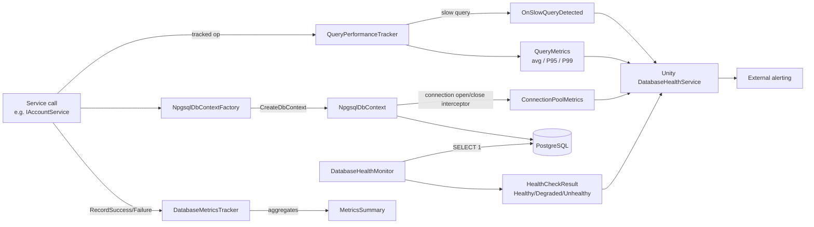

# Monitoring Infrastructure

Unified monitoring namespace for database observability, health checks, and performance metrics.

## Table of Contents

- [Description](#description)
- [Supported Platforms](#supported-platforms)
- [Directory Structure](#directory-structure)
- [Architecture](#architecture)
- [Namespaces](#namespaces)
- [Key Components](#key-components)
- [Usage](#usage)
- [Configuration](#configuration)
- [Future Expansions](#future-expansions)
- [Design Principles](#design-principles)
- [Integration Points](#integration-points)
- [Flow Diagram](#flow-diagram)

## Description

The `Monitoring/` namespace provides the observability layer for `FishMMO.Database.Npgsql`. It is split into three single-responsibility sub-namespaces — **Health** (is the database reachable?), **Metrics** (how fast and how often?), and **Diagnostics** (which queries are slow?) — that are composed together by `NpgsqlDbContextFactory` and surfaced to Unity by `FishMMO.Database.Unity.DatabaseHealthService`. All trackers are thread-safe and toggleable so they can be enabled selectively per environment via `appsettings.json`.

## Supported Platforms

| Target | Status |
|---|---|
| .NET Standard 2.1 (FishMMO-DB.csproj) | Yes |
| .NET 8.0 host (servers, tools) | Yes |
| Unity 6.3 LTS | Yes (via `Unity/DatabaseHealthService`) |

| Requirement | Notes |
|---|---|
| EF Core | Connection interceptors used to drive `ConnectionPoolMetrics` |
| Npgsql | Underlying PostgreSQL provider |

## Architecture

```
NpgsqlDbContextFactory
├── ConnectionPoolMetrics       (Metrics/) — driven by EF Core interceptors
├── DatabaseMetricsTracker      (Metrics/) — success / failure / latency aggregates
├── QueryPerformanceTracker     (Diagnostics/) — per-operation percentiles, slow query events
└── DatabaseHealthMonitor       (Health/) — SELECT 1 probe + status classification
```

## Directory Structure

```
Monitoring/
├── Health/                      # Database availability and connectivity monitoring
│   ├── DatabaseHealthMonitor.cs    # Performs health checks and connection validation
│   ├── HealthCheckResult.cs        # Health check result data structure
│   └── HealthStatus.cs             # Health status enumeration (Healthy, Degraded, Unhealthy)
│
├── Metrics/                     # Performance metrics and statistics tracking
│   ├── ConnectionPoolMetrics.cs    # Runtime connection open/close + pool signals (via EF Core interceptors)
│   ├── DatabaseMetricsTracker.cs   # Aggregate database operation metrics
│   └── MetricsSummary.cs           # Metrics summary data structure
│
└── Diagnostics/                 # Query-level performance diagnostics
    ├── QueryPerformanceTracker.cs  # Tracks per-operation query performance;
    │                               #   also declares SlowQueryEventArgs
    ├── QueryMetrics.cs             # Per-operation metrics (avg, min, max, percentiles)
    ├── QueryPerformanceConfiguration.cs  # Configuration for tracking levels and sampling
    └── TrackingLevel.cs            # Enum for tracking overhead levels
```

## Namespaces

### Health Monitoring
**Namespace:** `FishMMO.Database.Npgsql.Monitoring.Health`

Focuses on **availability** and **connectivity**:
- Database connection health
- Response time monitoring
- Connection pool status
- Health status reporting

### Metrics Tracking
**Namespace:** `FishMMO.Database.Npgsql.Monitoring.Metrics`

Focuses on **performance** and **statistics**:
- Query success/failure rates
- Response time aggregation
- Connection open/close + pool runtime metrics
- Performance summaries

### Diagnostics
**Namespace:** `FishMMO.Database.Npgsql.Monitoring.Diagnostics`

Focuses on **query-level performance** and **troubleshooting**:
- Per-operation query performance tracking
- Slow query detection and alerting
- Percentile metrics (P95, P99)
- Configurable tracking levels for overhead control
- Sample-based tracking for production

## Usage

### Health Monitoring

```csharp
using FishMMO.Database.Npgsql.Monitoring.Health;

var healthMonitor = new DatabaseHealthMonitor(dbContextFactory);
var healthResult = await healthMonitor.CheckHealthAsync();

if (healthResult.Status == HealthStatus.Healthy)
{
    Console.WriteLine($"Database healthy: {healthResult.ResponseTimeMs}ms");
}
```

### Metrics Tracking

```csharp
using FishMMO.Database.Npgsql.Monitoring.Metrics;

var metricsTracker = new DatabaseMetricsTracker();

// Record operation
metricsTracker.RecordSuccess(TimeSpan.FromMilliseconds(45));

// Get summary
var summary = metricsTracker.GetSummary();
Console.WriteLine($"Success Rate: {summary.SuccessRate}%");
Console.WriteLine($"Avg Response: {summary.AverageResponseTimeMs}ms");
```

### Connection Pool Metrics

`ConnectionPoolMetrics` is updated from EF Core connection interceptors (DbConnection open/close events). This means:
- `ActiveConnections` reflects currently-open DbConnections (checked out from the pool).
- It does *not* reflect DbContext creation/disposal counts.


### Query Performance Diagnostics

```csharp
using System.Diagnostics;
using FishMMO.Database.Npgsql.Monitoring.Diagnostics;

// Access through NpgsqlDbContextFactory (automatically configured from appsettings.json)
var factory = new NpgsqlDbContextFactory(configPath);
var performanceTracker = factory.PerformanceTracker;

// In your service methods:
public async Task<DatabaseResult<Player>> FetchPlayerAsync(long playerId, CancellationToken ct = default)
{
    const string operationName = "FetchPlayer";
    var stopwatch = Stopwatch.StartNew();
	var success = false;

	try
	{
		using var dbContext = factory.CreateDbContext();
		var player = await dbContext.Players.FindAsync(new object[] { playerId }, ct);
		success = true;
		return DatabaseResult<Player>.Success(player);
	}
	finally
	{
		stopwatch.Stop();
		performanceTracker?.RecordQuery(operationName, stopwatch.Elapsed, success);
	}
}

// Subscribe to slow query events
performanceTracker.SlowQueryDetected += (sender, e) => 
{
    Console.WriteLine($"Slow query: {e.OperationName} took {e.DurationMs}ms");
};

// Get performance report
var slowestOps = performanceTracker.GetSlowestOperations(10);
foreach (var (opName, metrics) in slowestOps)
{
    Console.WriteLine($"{opName}: Avg={metrics.AverageMs}ms, P95={metrics.P95Ms}ms, P99={metrics.P99Ms}ms");
}
```

#### Query Diagnostics Enhancements (Future)

- SQL query plan analysis
- Query execution plan caching
- Index usage recommendations
- Automated performance regression detection

#### Configuration (appsettings.json)

```json
{
  "QueryPerformanceTracking": {
    "Enabled": false,
    "Level": "None",
    "SlowQueryThresholdMs": 1000,
    "SampleRate": 0.1,
    "MaxTrackedOperations": 1000
  }
}
```

**Tracking Levels:**
- `None`: No tracking (zero overhead)
- `Basic`: Track execution count and success rate only
- `Standard`: + Track average execution time
- `Detailed`: + Track min/max times
- `Full`: + Track P95/P99 percentiles and slow query detection

**Recommended Settings:**
- **Production (Normal)**: `Enabled: false` for zero overhead
- **Production (Investigation)**: `Enabled: true, Level: Basic/Standard, SampleRate: 0.01-0.1`
- **Staging**: `Enabled: true, Level: Standard, SampleRate: 0.1`
- **Development**: `Enabled: true, Level: Full, SampleRate: 1.0`

**See [QueryPerformanceTracker.cs](Diagnostics/QueryPerformanceTracker.cs) for the tracking API and the `SlowQueryDetected` event.**
```csharp
using FishMMO.Database.Npgsql.Monitoring.Metrics;

// Access through NpgsqlDbContextFactory
var factory = new NpgsqlDbContextFactory(configPath);
var poolMetrics = factory.PoolMetrics;

Console.WriteLine($"Active Connections: {poolMetrics.ActiveConnections}");
Console.WriteLine($"Pool Utilization: {poolMetrics.GetUtilizationPercentage(factory.MaxPoolSize)}%");
```

## Future Expansions

The Monitoring namespace is designed to accommodate:

### Diagnostics (Future)
- Query performance tracking per operation
- Slow query detection and logging
- Query plan analysis
- Performance profiling

### Telemetry (Future)
- OpenTelemetry integration
- Distributed tracing
- Custom metrics export
- APM (Application Performance Monitoring) integration

### Alerting (Future)
- Threshold-based alerts
- Anomaly detection
- Health degradation notifications
- Performance regression alerts

## Design Principles

1. **Separation of Concerns**: Health vs Metrics vs Diagnostics
2. **Single Responsibility**: Each class has one focused purpose
3. **Thread Safety**: All classes designed for concurrent access
4. **Low Overhead**: Minimal performance impact when enabled
5. **Toggleable**: Can be enabled/disabled via configuration
6. **Observable**: Designed for integration with monitoring tools

## Integration Points

- **NpgsqlDbContextFactory**: Integrates ConnectionPoolMetrics and QueryPerformanceTracker
- **DatabaseHealthMonitor**: Combines health checks with pool metrics
- **Services**: Integrate QueryPerformanceTracker for operation-level monitoring
- **Unity**: DatabaseHealthService for game server monitoring
- **Configuration**: All monitoring components configurable via appsettings.json

## Flow Diagram


