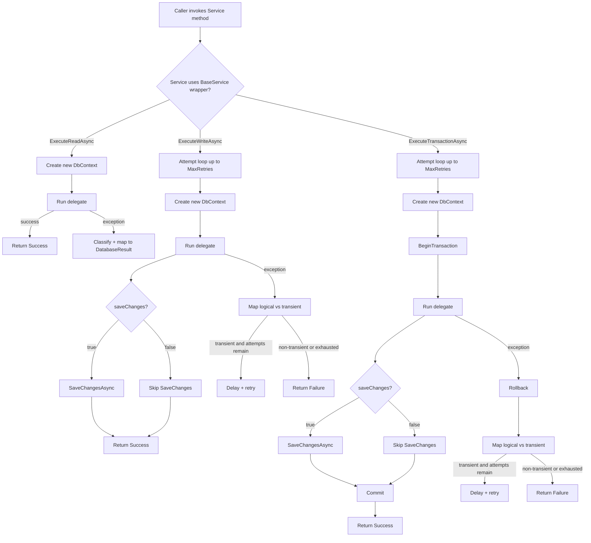

# UnitOfWorkService flow + execution examples

This document explains how `UnitOfWorkService` and the `BaseService` execution wrappers behave:
- when you call a service normally (no ambient scope)
- when you call services inside a unit of work (ambient DbContext + transaction)

It reflects the current behavior of:
- `FishMMO-DB/Npgsql/Services/UnitOfWorkService.cs`
- `FishMMO-DB/Npgsql/Services/BaseService.cs`

---

## Key terms

- **Ambient scope**: a `DbContext` stored in `AsyncLocal` via `DatabaseExecutionScope`. Any `BaseService` wrapper called inside this scope will reuse the same context.
- **Unit of work**: `UnitOfWorkService.BeginAsync()` creates an ambient `DbContext` + begins a transaction. The transaction is finalized by `CommitAsync()` or `RollbackAsync()`.
- **`saveChanges` flag**: in the execution wrappers, controls whether `DbContext.SaveChangesAsync()` is called after the delegate completes.
- **Savepoint**: a nested rollback point inside an existing transaction. Used to keep the outer transaction usable after a nested failure.

---

## Flow chart: normal service call (no unit of work)



### Normal-call example: single statement write

```csharp
// No unit-of-work: wrapper creates a fresh DbContext per attempt.
var result = await characterService.DeleteAsync(characterId, incomingVersion, ct);
if (!result.IsSuccess)
{
    // result.ErrorCode, result.ErrorMessage
}
```

What happens (high level):
1. `DeleteAsync(...)` calls a BaseService write wrapper.
2. Wrapper creates a new DbContext.
3. Delegate runs.
4. If `saveChanges: false` (raw SQL), wrapper does not call `SaveChangesAsync()`.
5. Wrapper maps exceptions (stale state, transient Npgsql failures, etc.) into `DatabaseResult`.

---

## Flow chart: UnitOfWorkService + ambient scope

```mermaid
flowchart TD
  A[Caller] --> B[BeginAsync]
  B --> B1[Create DbContext]
  B1 --> B2[Enter DatabaseExecutionScope (ambient DbContext)]
  B2 --> B3[BeginTransaction on ambient DbContext]
  B3 --> C[Caller invokes multiple Service methods]

  C --> D{BaseService wrapper sees ambient DbContext?}
  D -->|Yes| E[Reuse ambient DbContext]

  E --> F{Which wrapper?}

  F -->|ExecuteReadAsync| R[Run delegate]
  R --> R2[Return result]

  F -->|ExecuteWriteAsync| W[Optional: create Savepoint if transaction supports it]
  W --> W1[Run delegate]
  W1 --> W2{saveChanges?}
  W2 -->|true| W3[SaveChangesAsync (flushes tracked changes into the current tx)]
  W2 -->|false| W4[Skip SaveChanges]
  W3 --> W5[Release savepoint]
  W4 --> W5
  W1 -->|exception| W6[Rollback to savepoint (keeps outer tx usable)]

  F -->|ExecuteTransactionAsync| T{Ambient tx exists?}
  T -->|Yes| S[Create savepoint + run delegate]
  S --> S1{saveChanges?}
  S1 -->|true| S2[SaveChangesAsync]
  S1 -->|false| S3[Skip SaveChanges]
  S2 --> S4[Release savepoint]
  S3 --> S4
  S -->|exception| S5[Rollback to savepoint]

  T -->|No| N[BeginTransaction inside ambient]
  N --> N1[Run delegate]
  N1 --> N2{saveChanges?}
  N2 -->|true| N3[SaveChangesAsync]
  N2 -->|false| N4[Skip SaveChanges]
  N3 --> N5[Commit]
  N4 --> N5
  N1 -->|exception| N6[Rollback]

  C --> Z{Caller ends unit of work}
  Z -->|CommitAsync| K[SaveChangesAsync + Commit]
  Z -->|RollbackAsync| L[Rollback]
  K --> M[Dispose ambient scope + DbContext]
  L --> M
```

### Unit-of-work example: multiple related writes

```csharp
await using var unitOfWork = await unitOfWorkService.BeginAsync(ct);

// All service calls below reuse the same ambient DbContext and transaction.
var r1 = await characterService.SaveAsync(characterData, ct);
if (!r1.IsSuccess)
{
    await unitOfWork.RollbackAsync(ct);
    return;
}

var r2 = await characterInventoryService.PersistAsync(items, ct);
if (!r2.IsSuccess)
{
    await unitOfWork.RollbackAsync(ct);
    return;
}

await unitOfWork.CommitAsync(ct);
```

What happens (high level):
1. `BeginAsync` creates a `DbContext`, enters the ambient execution scope, and begins a DB transaction.
2. `SaveAsync` / `PersistAsync` wrappers detect ambient DbContext and reuse it.
3. Nested wrappers use **savepoints** to keep the outer transaction usable if one call fails.
4. `CommitAsync` performs a final `SaveChangesAsync` (for any remaining tracked changes) and commits the transaction.

---

## Important execution rules (practical guidance)

### 1) “Transaction wrapper truly means transaction”
- Outside a unit-of-work, `ExecuteTransactionAsync` always begins/commits/rolls back a transaction.
- Inside a unit-of-work (ambient transaction exists), `ExecuteTransactionAsync` provides nested atomicity via **savepoints**.

### 2) `saveChanges` inside a unit of work
- If a service calls `ExecuteWriteAsync(..., saveChanges: true)` inside a unit-of-work, it will flush tracked changes earlier.
- This does **not** commit the transaction early; it only issues SQL within the still-open transaction.

### 3) Raw SQL vs EF tracked changes
- Raw SQL (`ExecuteSqlRawAsync`, `FromSqlRaw`) executes immediately against the connection, but is only durable after commit.
- EF tracked changes only become SQL when `SaveChangesAsync` is called (either by a wrapper with `saveChanges: true`, or by `CommitAsync`).

### 4) Retry behavior
- No-unit-of-work wrappers may retry transient failures (up to `MaxRetries`).
- Inside a unit-of-work, retries are generally not performed by nested wrappers, because the surrounding logical operation often needs explicit control. (The outer code can decide whether to restart the whole unit-of-work.)

---

## Minimal examples of common patterns

### Pattern A: read-only query (no unit-of-work)

```csharp
var fetchResult = await characterService.FetchAsync(characterId, ct);
if (fetchResult.IsSuccess)
{
    var data = fetchResult.Data;
}
```

### Pattern B: single-statement idempotent write (no unit-of-work)

```csharp
var kick = await kickRequestService.EnqueueAsync(accountName, ct);
```

### Pattern C: multi-step operation requiring atomicity (unit-of-work)

```csharp
await using var uow = await unitOfWorkService.BeginAsync(ct);

var a = await characterService.DeleteAsync(characterId, incomingVersion, ct);
if (!a.IsSuccess) { await uow.RollbackAsync(ct); return; }

var b = await characterGuildService.DeleteAsync(characterId, incomingVersion, ct);
if (!b.IsSuccess) { await uow.RollbackAsync(ct); return; }

await uow.CommitAsync(ct);
```
