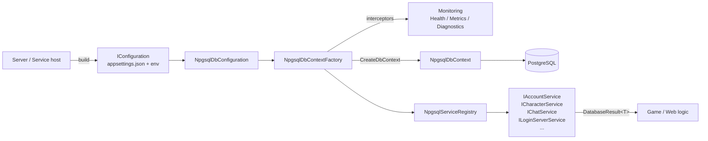

# FishMMO-DB

`FishMMO-DB` is the shared data-access library for the FishMMO project.

This document describes the project layout, the supported platforms, and — at length — how to wire environment configuration (`appsettings.json`, `FISHMMO_ENVIRONMENT`, OS-specific environment variable persistence) for development, CI, and production deployments.

## Table of Contents

- [Description](#description)
- [Supported Platforms](#supported-platforms)
- [Architecture](#architecture)
- [Key Components](#key-components)
- [Configuration](#configuration)
- [Recommended appsettings files](#recommended-appsettings-files)
- [Environment variables by OS](#environment-variables-by-os)
- [Overriding individual settings via environment variables](#overriding-individual-settings-via-environment-variables)
- [Database.cs setup examples](#databasecs-setup-examples)
- [Npgsql service usage examples](#npgsql-service-usage-examples)
- [Securing appsettings.json](#securing-appsettingsjson)
- [Flow Diagram](#flow-diagram)
- [Notes](#notes)

## Supported Platforms

| Target | Status |
|---|---|
| .NET Standard 2.1 (this library) | Yes |
| .NET 8.0 hosts (LoginServer / WorldServer / SceneServer launchers, web services) | Yes |
| Unity 6.3 LTS (Editor + headless server builds) | Yes |
| Linux / Windows / macOS | All supported |

| Backing Store | Notes |
|---|---|
| PostgreSQL | 14+ recommended. Primary persistence (Npgsql / EF Core). Used for cross-server data persistence. |
| PgBouncer | Recommended in front of PostgreSQL for transaction pooling. |

## Architecture

```
FishMMO-DB/
├── Data/                       POCO entities + enums shared across servers
├── Migrations/                 EF Core migrations (created by FishMMO-DB-Migrator)
├── Exceptions/                 Typed database exceptions
├── Npgsql/                     Concrete PostgreSQL implementation
│   ├── NpgsqlDbContext.cs        EF Core DbContext
│   ├── NpgsqlDbContextFactory.cs Factory + interceptors + monitoring wiring
│   ├── NpgsqlDbConfiguration.cs  Reads IConfiguration → connection string
│   ├── NpgsqlServiceRegistry.cs  IDatabaseServiceRegistry implementation
│   ├── Entities/                 EF Core entity types
│   ├── EntityConfigurations/     Fluent EF Core configurations
│   ├── Services/                 Per-domain service implementations
│   │   └── Interfaces/             IAccountService, ICharacterService, …
│   └── Monitoring/               Health / Metrics / Diagnostics (see Monitoring/README.md)
├── Unity/                          Unity MonoBehaviour wrapper (see Unity/README.md)
├── Database.cs                 High-level orchestrator (IDatabase implementation)
├── IDatabase.cs                Public contract consumed by servers / services
├── IDatabaseServiceRegistry.cs Per-domain service registry contract
├── AppSettings.cs              Strongly-typed appsettings.json binder
├── DatabaseConfigurationHelper.cs  Convenience helpers for IConfiguration builders
├── DatabaseErrorCodes.cs       Stable error code enum returned via DatabaseResult
├── DatabaseResult.cs           Result<T> envelope (IsSuccess / ErrorCode / Data)
└── appsettings.json            Default config (do NOT commit secrets)
```

## Key Components

| Component | Responsibility |
|---|---|
| `Database` | High-level orchestrator. Wraps an `INpgsqlDbContextFactory` and an `IDatabaseServiceRegistry`. Consumed by servers as `IDatabase`. |
| `IDatabase` | Public contract: `ServiceRegistry`, `ContextFactory`, async lifecycle. |
| `IDatabaseServiceRegistry` | Per-domain service lookup (`TryGet<TService>(out var svc)`). |
| `NpgsqlDbContext` / `NpgsqlDbContextFactory` | EF Core context + factory with connection interceptors driving `ConnectionPoolMetrics`. |
| `NpgsqlServiceRegistry` | Wires `IAccountService`, `ICharacterService`, `IChatService`, `ILoginServerService`, etc. |
| `NpgsqlDbConfiguration` | Builds the connection string from `IConfiguration` (`ConnectionStrings:NpgsqlConnection` or `Npgsql:*`). |
| `AppSettings` | Strongly-typed `appsettings.json` binder (Npgsql). |
| `DatabaseResult<T>` / `DatabaseErrorCodes` | Uniform error envelope returned from every service. |
| `Monitoring/` (under Npgsql) | Health probes, pool metrics, query performance diagnostics. See [`Npgsql/Monitoring/README.md`](./Npgsql/Monitoring/README.md). |
| `Unity/DatabaseHealthService` | MonoBehaviour that surfaces all of the above to Unity headless servers. See [`Unity/README.md`](./Unity/README.md). |

## Configuration

`FishMMO-DB` reads configuration through the standard ASP.NET / .NET Generic Host `IConfiguration` pipeline. The recommended source order is:

1. `appsettings.json` (default values, committed)
2. `appsettings.{FISHMMO_ENVIRONMENT}.json` (per-environment overrides, NOT committed)
3. Environment variables (typically used for secrets)

The selected environment is controlled by `FISHMMO_ENVIRONMENT` (preferred). `DOTNET_ENVIRONMENT` is also honoured as a fallback. The remainder of this document covers the OS-specific mechanics for persisting these variables and the supported override keys.

---

# FishMMO-DB Environment Configuration

This library supports layered configuration in this order:

1. `appsettings.json` (required)
2. `appsettings.{Environment}.json` (optional)
3. Environment variables (highest priority)

Environment is resolved by your host/.NET configuration pipeline (for example via `DOTNET_ENVIRONMENT` or `ASPNETCORE_ENVIRONMENT`).

---

## Recommended appsettings files

Keep shared defaults in `appsettings.json`, and only override differences in environment files.

- `appsettings.Development.json`
- `appsettings.Production.json`

Example override file:

```json
{
  "Npgsql": {
    "Host": "127.0.0.1",
    "Database": "fish_mmo_postgresql_dev",
    "Username": "postgres",
    "Password": "dev_password"
  },
  "QueryPerformanceTracking": {
    "Enabled": true,
    "Level": "Basic"
  }
}
```

---

## Environment variables by OS

## Windows

### PowerShell (current session)

```powershell
$env:DOTNET_ENVIRONMENT = "Development"
```

### CMD (current session)

```cmd
set DOTNET_ENVIRONMENT=Development
```

### Persist for future sessions

```powershell
setx DOTNET_ENVIRONMENT "Production"
```

Restart terminal (or app) after `setx`.

---

## CachyOS (Arch Linux, fish shell)

### Current shell session

```fish
set -x DOTNET_ENVIRONMENT Development
```

### Persist for your user (all future fish sessions)

```fish
set -Ux DOTNET_ENVIRONMENT Production
```

### Remove universal variable

```fish
set -eU DOTNET_ENVIRONMENT
```

---

## Ubuntu (Debian family)

### Current shell session (bash/zsh)

```bash
export DOTNET_ENVIRONMENT=Development
```

### Persist per-user (bash)

Add to `~/.bashrc`:

```bash
export DOTNET_ENVIRONMENT=Production
```

Then reload:

```bash
source ~/.bashrc
```

### Systemd service example

Use in service unit:

```ini
[Service]
Environment=DOTNET_ENVIRONMENT=Production
```

or use an env file:

```ini
[Service]
EnvironmentFile=/etc/fishmmo-db.env
```

with `/etc/fishmmo-db.env`:

```bash
DOTNET_ENVIRONMENT=Production
```

---

## Overriding individual settings via environment variables

Use double underscores (`__`) for nested keys:

- `Npgsql__Host`
- `Npgsql__Port`
- `Npgsql__Database`
- `Npgsql__Username`
- `Npgsql__Password`
- `Npgsql__CommandTimeout`

Example (fish):

```fish
set -x Npgsql__Host 10.0.0.25
set -x Npgsql__Database fish_mmo_postgresql
set -x Npgsql__Username postgres
set -x Npgsql__Password super_secret
```

---

## Database.cs setup examples

## 1) Build IConfiguration and pass it to Database

```csharp
using FishMMO.Database;
using Microsoft.Extensions.Configuration;

IConfiguration configuration = new ConfigurationBuilder()
	.SetBasePath("/opt/fishmmo/config")
	.AddJsonFile("appsettings.json", optional: false, reloadOnChange: false)
	.AddJsonFile($"appsettings.{Environment.GetEnvironmentVariable("DOTNET_ENVIRONMENT")}.json", optional: true, reloadOnChange: false)
	.AddEnvironmentVariables()
	.Build();

IDatabase database = new Database(
	configuration,
	enableLogging: false,
	commandTimeout: 15,
	healthCheckWarningMs: 100,
	healthCheckCriticalMs: 500);
```

## 2) Normalize custom environment variable before building configuration

```csharp
string? fishEnv = Environment.GetEnvironmentVariable("FISHMMO_ENVIRONMENT");
if (!string.IsNullOrWhiteSpace(fishEnv))
{
	Environment.SetEnvironmentVariable("DOTNET_ENVIRONMENT", fishEnv);
	Environment.SetEnvironmentVariable("ASPNETCORE_ENVIRONMENT", fishEnv);
}
```

---

## Npgsql service usage examples

Services are resolved from `database.ServiceRegistry` by interface.

## Account service

```csharp
using FishMMO.Database.Npgsql.Services.Interfaces;

if (!database.ServiceRegistry.TryGet<IAccountService>(out var accountService))
	throw new InvalidOperationException("IAccountService not registered.");

var loginResult = await accountService.FetchForLoginAsync("myAccount", cancellationToken);
if (!loginResult.IsSuccess)
{
	Console.WriteLine($"Login lookup failed: {loginResult.ErrorCode} - {loginResult.ErrorMessage}");
	return;
}

var account = loginResult.Data;
```

## Character service

```csharp
using FishMMO.Database.Npgsql.Services.Interfaces;

if (!database.ServiceRegistry.TryGet<ICharacterService>(out var characterService))
	throw new InvalidOperationException("ICharacterService not registered.");

var characterResult = await characterService.FetchByAccountAsync("myAccount", cancellationToken);
if (!characterResult.IsSuccess)
{
	Console.WriteLine($"Character fetch failed: {characterResult.ErrorCode} - {characterResult.ErrorMessage}");
	return;
}

var character = characterResult.Data;
```

## Chat service

```csharp
using FishMMO.Database.Npgsql.Services.Interfaces;
using FishMMO.Database.Data.Enums;

if (!database.ServiceRegistry.TryGet<IChatService>(out var chatService))
	throw new InvalidOperationException("IChatService not registered.");

var persist = await chatService.PersistAsync(
	characterId: 123,
	characterName: "Ari",
	accountName: "myAccount",
	worldServerId: 1,
	sceneServerId: 10,
	channel: ChatChannel.World,
	message: "Hello world",
	serverReceivedTime: DateTime.UtcNow,
	cancellationToken: cancellationToken);

if (!persist.IsSuccess)
	Console.WriteLine($"Chat persist failed: {persist.ErrorCode} - {persist.ErrorMessage}");
```

---

## Optional: explicit environment selection in code

If you need direct factory creation, pass `IConfiguration` into `NpgsqlDbConfiguration`:

```csharp
using FishMMO.Database.Npgsql;
using Microsoft.Extensions.Configuration;

var rootConfiguration = new ConfigurationBuilder()
	.SetBasePath("/opt/fishmmo/config")
	.AddJsonFile("appsettings.json", optional: false, reloadOnChange: false)
	.AddJsonFile("appsettings.Production.json", optional: true, reloadOnChange: false)
	.AddEnvironmentVariables()
	.Build();

var config = new NpgsqlDbConfiguration(
	rootConfiguration,
	enableLogging: false,
	commandTimeoutOverride: null);

var factory = new NpgsqlDbContextFactory(config);
```

## Securing appsettings.json

Protecting `appsettings.json` (and any environment-specific overrides) is essential to prevent accidental secret leakage. The following guidance shows practical, OS-specific steps and general recommendations.

- **General recommendations:**
	- **Avoid committing secrets:** Add `appsettings.*.json` to `.gitignore` in your project root.
	- **Prefer environment variables/secret stores:** Use environment variables or a secret manager (Azure Key Vault, AWS Secrets Manager, HashiCorp Vault) in production instead of plaintext files.
	- **Use `dotnet user-secrets` for development only:** Useful for local dev, not for servers.
	- **Restrict file read access:** Ensure only the service account or user running the application can read the file.

### Ubuntu / Debian (and most Linux distributions)

- **Set ownership and permissions** (example where `fishmmo` is the service user and `/opt/fishmmo/config/appsettings.json` is the file):

	```bash
	sudo chown root:fishmmo /opt/fishmmo/config/appsettings.json
	sudo chmod 640 /opt/fishmmo/config/appsettings.json
	# If the service runs as root-owned user, consider 600 and appropriate owner
	```

- **Systemd service using an EnvironmentFile** (store sensitive values in a separate file with restricted permissions):

	```ini
	[Service]
	User=fishmmo
	Group=fishmmo
	EnvironmentFile=/etc/fishmmo-db.env
	```

	Set permissions on the env file so only root (or the service user) can read it:

	```bash
	sudo chown root:root /etc/fishmmo-db.env
	sudo chmod 600 /etc/fishmmo-db.env
	```

- **Optional: encrypt config files at rest** using tools like `gpg` or filesystem encryption (LUKS) if disk-level protection is required.

### CachyOS / Arch Linux

- Arch-derived systems use the same POSIX permissions and `systemd` examples above. Use the same `chown`/`chmod` patterns and keep the environment file under `/etc` with `600` permissions.

### Windows

- **Use ACLs to restrict access** to the JSON file. Example using `icacls` to remove inheritance and grant read access to a specific service account (replace `NT Service\\MyService` or `DOMAIN\\svc_account` as appropriate):

	```powershell
	# Remove inherited permissions and grant read to the service account
	icacls "C:\\path\\to\\appsettings.json" /inheritance:r
	icacls "C:\\path\\to\\appsettings.json" /grant "NT Service\\MyService":R
	```

- **Data Protection API / user secrets:** For development, prefer `dotnet user-secrets`. For production, use Windows Certificate Store or a managed secret store rather than plaintext files.

### Git / Source control

- **Exclude configuration with secrets** from commits. Add this to your repository `.gitignore`:

	```gitignore
	# Local/secret config
	FishMMO-DB/appsettings.*.json
	**/appsettings.*.json
	```

- **Audit history:** If secrets were committed historically, rotate those credentials immediately and remove them from git history using tools like `git-filter-repo`.

### Quick checklist before deploy

- **Remove secrets from repo**, or ensure overrides are not committed.
- **Set file ownership and permissions** so only the service user can read config files.
- **Use environment variables or secret manager** for production secrets.
- **Disable sensitive logging** in production (`enableLogging: false`).

---

## Flow Diagram



## Notes

- Prefer `FISHMMO_ENVIRONMENT` for environment configuration.
- Keep secrets out of source control; use environment variables or secret stores.
- In production, set `enableLogging: false` to avoid sensitive data logging.