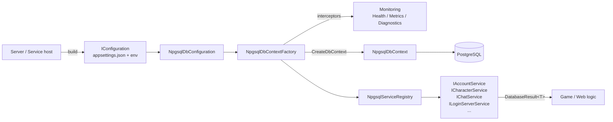

# FishMMO-DB

`FishMMO-DB` is the shared data-access library for the FishMMO project.

This document describes the project layout, the supported platforms, and — at length — how to wire environment configuration (`appsettings.json`, `FISHMMO_ENVIRONMENT`, OS-specific environment variable persistence) for development, CI, and production deployments.

## Table of Contents

- [Description](#fishmmo-db)
- [Supported Platforms](#supported-platforms)
- [Architecture](#architecture)
- [Key Components](#key-components)
- [Table inventory](#table-inventory)
- [Items live in one table](#items-live-in-one-table)
- [Configuration](#configuration)
- [Credentials are never in appsettings.json](#credentials-are-never-in-appsettingsjson)
- [Recommended appsettings files](#recommended-appsettings-files)
- [Environment variables by OS](#environment-variables-by-os)
- [Overriding individual settings via environment variables](#overriding-individual-settings-via-environment-variables)
- [Database.cs setup examples](#databasecs-setup-examples)
- [Npgsql service usage examples](#npgsql-service-usage-examples)
- [Securing appsettings.json](#securing-appsettingsjson)
- [Flow Diagram](#flow-diagram)
- [Notes](#notes)
- [Character session ownership](#character-session-ownership)
- [Expired leases are not "online"](#expired-leases-are-not-online)
- [Scene instance identity](#scene-instance-identity)
- [Scene rows are reaped, not just written](#scene-rows-are-reaped-not-just-written)
- [The channel-switch cooldown lives on the character](#the-channel-switch-cooldown-lives-on-the-character)
- [Kick requests expire](#kick-requests-expire)
- [The database clock](#the-database-clock)
- [Batched reads and writes](#batched-reads-and-writes)
- [The chat table is read through a window](#the-chat-table-is-read-through-a-window)

## Supported Platforms

| Target | Status |
|---|---|
| .NET Standard 2.1 (this library) | Yes |
| .NET 8.0 hosts (LoginServer / WorldServer / SceneServer launchers, web services) | Yes |
| Unity 6.3 LTS (Editor + headless server builds) | Yes |
| Linux / Windows / macOS | All supported |

| Backing Store | Notes |
|---|---|
| PostgreSQL | 14+ recommended. Primary persistence (Npgsql / EF Core). Used for cross-server data persistence. |
| PgBouncer | Recommended in front of PostgreSQL for transaction pooling. |

## Architecture

```
FishMMO-DB/
├── Data/                       Plain data records + enums shared across servers
│   ├── Arena/                    ArenaMatchData, ArenaMatchComposer, ArenaRatingSource
│   ├── Character/                Per-character sub-entity records, including CharacterItemData
│   │                             and its ItemContainerType discriminator, and the batched
│   │                             save's CharacterPersistRequest / CharacterPersistResult
│   ├── Enums/                    ChatChannel, SceneStatus, SceneType, CharacterSessionState,
│   │                             ArenaMatchStatus, ArenaSeatStatus, GroupFinderQueueStatus,
│   │                             LeaderboardSourceKind, …
│   ├── GroupFinder/              GroupFinderQueueData, GroupFinderMatchData, GroupFinderPulseData
│   │                             (a heartbeat row plus party membership), GroupFinderQueueKey
│   ├── Guild/                    Guild, rank, log, application and update records
│   ├── Housing/                  PlotData, PlotStructureData, PlotAccessData, PlotVaultData,
│   │                             PlotUpdateData, PlotUpdatePollData (marks + the database time
│   │                             of the poll), PlotTaxCharge / PlotTaxChargeResult (the offline
│   │                             tax batch)
│   ├── Leaderboard/              LeaderboardQuery (which board, who is eligible), the row, page
│   │                             and standing records ILeaderboardService returns
│   ├── Party/                    Party records
│   ├── ChatPumpData.cs           ChatPumpQuery, ChatRelayQuery, ChatPumpPage: one windowed read
│   │                             of the chat table
│   ├── ChatReadWindow.cs         A chat reader's window and seen-ID set, on the database clock
│   ├── DaemonCommandExpiry.cs    A claimed daemon command's time left, counted on a monotonic clock
│   ├── ServerBandwidthData.cs    ServerBandwidthKind, ServerBandwidthMath (retention, rollup and
│   │                             wire-estimate rules), ServerBandwidthSample (one minute row) and
│   │                             the bandwidth report records
│   └── ServerControlState.cs     A server row's lock and scheduled shutdown, with the seconds
│                                 left measured by the database
├── (../../Migrations/)         EF Core migrations live at the monorepo root, not in this folder,
│                                 and FishMMO-DB.csproj compiles them in (`..\..\Migrations\*.cs`).
│                                 Gitignored, so a checkout has none until they are generated
│                                 locally with FishMMO-DB-Migrator as the startup project
├── Exceptions/                 Typed database exceptions
├── Npgsql/                     Concrete PostgreSQL implementation
│   ├── NpgsqlDbContext.cs        EF Core DbContext — one DbSet per table
│   ├── NpgsqlDbContextFactory.cs Factory + interceptors + monitoring wiring
│   ├── NpgsqlDbConfiguration.cs  Reads the `Npgsql` IConfiguration section → connection string
│   ├── NpgsqlServiceRegistry.cs  IDatabaseServiceRegistry implementation
│   ├── SchemaValidationResult.cs Pending-migration report returned by ValidateSchemaAsync
│   ├── DbContextExtensions.cs    GetTableName<TEntity>(), for services that emit raw SQL
│   ├── Entities/                 EF Core entity types (Bandwidth / Daemon / Login / Maintenance /
│   │                             Scene / Support / World)
│   ├── EntityConfigurations/     Fluent EF Core configurations (see EntityConfigurations/README.md)
│   ├── Services/                 Per-domain service implementations
│   │   ├── BaseService.cs          Execution wrappers, transient retry, raw-SQL helpers, the
│   │   │                           database-clock read (DatabaseUtcClockSql, ReadDatabaseUtcNowAsync)
│   │   ├── BulkBatch.cs            Shared bulk-write rules: KeepNewest, RequireAnyLiveCharacter
│   │   ├── ServerControlSql.cs     The control columns world and scene server rows are read by, and
│   │   │                           the delay-from-database-now shutdown schedule
│   │   ├── UnitOfWorkService.cs    IUnitOfWork — one ambient transaction across several services
│   │   ├── Bandwidth/              ServerBandwidthService (a server's own minute rows),
│   │   │                           ServerBandwidthReportService (the panel's read, rollup, prune)
│   │   ├── Scene/Character/        … and CharacterWriteGate, the one ownership gate every
│   │   │                           per-character sub-entity write passes through
│   │   └── Interfaces/             IAccountService, ICharacterItemService, IPlotService, …
│   │       └── Actions/              IPersistAction, IPersistManyOwnedAction, IFetchByKeyAction, …
│   │                                 reusable method shapes
│   └── Monitoring/               Health / Metrics / Diagnostics (see Monitoring/README.md)
├── Unity/                      Unity MonoBehaviour wrapper, commented out (see Unity/README.md)
├── Database.cs                 High-level orchestrator (IDatabase implementation)
├── IDatabase.cs                Public contract consumed by servers / services
├── IDatabaseServiceRegistry.cs Per-domain service registry contract
├── AppSettings.cs              Strongly-typed binder for the `Npgsql` appsettings section
├── DatabaseSecrets.cs          Credential resolver — env vars / platform secrets file only
├── DatabaseConfigurationHelper.cs  Convenience helpers for IConfiguration builders
├── DatabaseErrorCodes.cs       Stable error code enum returned via DatabaseResult
├── DatabaseResult.cs           Result<T> envelope (IsSuccess / ErrorCode / Data)
└── BulkWriteResult.cs          What a batched, version-gated write actually did:
                                 Filtered (refused; Unowned is the claim-gate share of it)
                                 vs Superseded (lost the version race)
```

## Key Components

| Component | Responsibility |
|---|---|
| `Database` | High-level orchestrator. Wraps an `INpgsqlDbContextFactory` and an `IDatabaseServiceRegistry`. Consumed by servers as `IDatabase`. |
| `IDatabase` | Public contract: `ServiceRegistry`, `DbContextFactory`, `HealthMonitor`, `MetricsTracker`, `Shutdown` / `ShutdownAsync`. |
| `IDatabaseServiceRegistry` | Per-domain service lookup (`TryGet<TService>(out var svc)`). |
| `NpgsqlDbContext` / `NpgsqlDbContextFactory` | EF Core context + factory with connection interceptors driving `ConnectionPoolMetrics`. |
| `NpgsqlServiceRegistry` | Holds the services. It registers nothing itself — `Database.RegisterNpgsqlServicesByReflection` discovers every `I*Service` in `FishMMO.Database.Npgsql.Services.Interfaces`, pairs it with the single concrete class in `FishMMO.Database.Npgsql.Services` (or a sub-namespace) that implements it, and constructs it with the `INpgsqlDbContextFactory`. Adding a table therefore needs no wiring: create the interface and the implementation and it is registered. A name that matches zero or several implementations throws at startup. |
| `NpgsqlDbConfiguration` | Builds the connection string from the `Npgsql` section of `IConfiguration`, plus credentials resolved by `DatabaseSecrets`. There is no `ConnectionStrings` key. |
| `AppSettings` / `NpgsqlSettings` | Strongly-typed binder for the `Npgsql` section: `Host`, `Port`, `Database`, `Schema`, `CommandTimeout`, `ConnectionTimeout`, `MinPoolSize`, `MaxPoolSize`, `QueryPerformanceTracking`, `RetryPolicy`. Deliberately no `Username` or `Password`. |
| `DatabaseSecrets` | The only source of credentials: `FISHMMO_DB_*` environment variables, then the platform secrets file. See [Credentials are never in appsettings.json](#credentials-are-never-in-appsettingsjson). |
| `BaseService` | Base class for every service: execution wrappers, transient-failure retry, exception mapping, and the `{0}` → `@p0` placeholder rewriting used by the raw-SQL paths. `DatabaseUtcClockSql` / `ReadDatabaseUtcNowAsync` give a service the database's own UTC time; see [The database clock](#the-database-clock). |
| `CharacterWriteGate` | The ownership check every per-character sub-entity write runs inside its own transaction. See [Sub-entity writes carry the claim too](#sub-entity-writes-carry-the-claim-too). |
| `ServerControlState` / `ServerControlSql` | A world or scene server row's operator state (lock, scheduled shutdown) and the seconds left before the shutdown, measured by the database in the statement that read the row. `ServerControlSql` is the one column list and mapper the pulses, the world registration and the scene servers' read of a world row share, and the `SetShutdownInAsync` statement that adds a delay to the database's time. |
| `ChatReadWindow` / `ChatPumpQuery` / `ChatRelayQuery` | The windowed read of the chat table. See [The chat table is read through a window](#the-chat-table-is-read-through-a-window). |
| `DaemonCommandExpiry` | Whether a claimed daemon command may still run: the seconds the database measured at the claim, counted down on the daemon's monotonic clock from the moment the claim was sent. |
| `IUnitOfWorkService` / `IUnitOfWork` | One ambient transaction shared by several services, finalized only by `CommitAsync` or `RollbackAsync`. |
| `DatabaseResult<T>` / `DatabaseErrorCodes` | Uniform error envelope returned from every service. |
| `BulkWriteResult` | Outcome of a batched, version-gated write. Separates `Filtered` (the service refused the row) from `Superseded` (the row lost the version race, and the stored value is the newer one). `Unowned` is the part of `Filtered` an ownership-gated write refused because the writer no longer holds that character's claim. |
| `Monitoring/` (under Npgsql) | Health probes, pool metrics, query performance diagnostics. See [`Npgsql/Monitoring/README.md`](./Npgsql/Monitoring/README.md). |
| `Unity/DatabaseHealthService` | Reference MonoBehaviour that would surface all of the above to Unity headless servers. The file is **entirely commented out** — this project targets .NET Standard 2.1 and cannot reference `UnityEngine`, so it is not compiled by anything today. See [`Unity/README.md`](./Unity/README.md). |

## Table inventory

72 tables, one entity type and one `IEntityTypeConfiguration<T>` apiece — the folders under
`Npgsql/Entities/` and `Npgsql/EntityConfigurations/` mirror each other exactly (`Bandwidth/`,
`Daemon/` and `Maintenance/` keep all their configurations in one file each). The table name
each configuration declares with `ToTable(...)` is the authority; the C# names are
`<Name>Entity` / `<Name>EntityConfiguration`.

| Group | Tables |
|---|---|
| (root) | `deployment_secrets` |
| `Login/` | `accounts`, `account_beta_codes`, `admin_audit_log`, `auth_tokens`, `beta_codes`, `connection_token_keys`, `email_queue`, `login_servers`, `login_server_signing_keys`, `password_reset_tokens`, `sms_queue`, `two_factor_recovery_codes`, `two_factor_reset_requests`, `web_sessions` |
| `World/` | `world_servers`, `kick_requests` |
| `Bandwidth/` | `server_bandwidth_minute`, `server_bandwidth_hour` |
| `Daemon/` | `daemon_hosts`, `daemon_apps`, `daemon_commands`, `daemon_app_events` |
| `Maintenance/` | `maintenance_operations`, `maintenance_targets` |
| `Support/` | `support_tickets`, `support_ticket_messages` |
| `Scene/` | `scenes`, `scene_servers`, `chat`, `quests`, `group_finder_queue` |
| `Scene/Character/` | `characters`, `character_abilities`, `character_achievements`, `character_archetypes`, `character_attributes`, `character_buffs`, `character_dialogue_choices`, `character_factions`, `character_friends`, `character_guild`, `character_hotkeys`, `character_item`, `character_itemcooldowns`, `character_knownabilities`, `character_mail`, `character_party`, `character_pet`, `character_pet_attributes`, `character_pet_buffs`, `character_quests`, `character_skills`, `character_waypoints`, `currency_ledger` |
| `Scene/Guild/` | `guilds`, `guild_rank`, `guild_log`, `guild_application`, `guild_updates` |
| `Scene/Party/` | `parties`, `party_updates` |
| `Scene/Arena/` | `arena_match`, `arena_match_member`, `arena_season`, `arena_rating`, `arena_penalty` |
| `Scene/Housing/` | `plots`, `plot_structures`, `plot_access`, `plot_vault`, `plot_updates` |

The newer groups and what owns them:

| Group | Service(s) | Notes |
|---|---|---|
| `group_finder_queue` | `IGroupFinderQueueService` | The dungeon and arena queue. Shared by every scene server on a world server, each running the same matching pump; every state change is a single statement or single transaction whose `WHERE` re-asserts the state it expects, so two servers acting at once give one winner and one no-op. `TryFormArenaMatchAsync` is the only thing that creates an arena match, inside the transaction that takes its players out of the queue. Heartbeats, queue and match times are stamped by the database clock and every staleness test is made in SQL: callers pass a `TimeSpan staleAfter`, never an instant. `PulseAsync` is one `UPDATE ... RETURNING` that hands back each row (`GroupFinderPulseData`) with the character's party membership; `CountWaitingAsync` has a many-key overload, and `FetchBackfillOpeningsAsync` is the lock-free check before the backfill transaction. |
| `arena_*` | `IArenaMatchService`, `IArenaRatingService`, `IArenaPenaltyService` | Match status only ever moves forward — the `WHERE` refuses a status lower than the current one, so a late write from a server that lost the instance cannot reopen an ended match. Ratings are keyed by season; `arena_penalty` is the deserter queue-lock. `CancelAbandonedAsync(TimeSpan olderThan, ...)` ages matches by the database clock and reads only unfinished ones, through the partial index `ix_arena_match_unfinished_time_created`; `SetBackfillWindowAsync(matchId, TimeSpan? window)` stamps the window's end from the database clock too. |
| `plot_*` / `plots` | `IPlotService`, `IPlotStructureService`, `IPlotAccessService`, `IPlotVaultService`, `IPlotUpdateService` | Plots are scoped to a world server: the same scene runs on every world, and an unscoped row would show one player's house as owned land to everybody on every other world. Every ownership change reports its affected-row count and the caller must check it — treating zero as success sells one plot to two players. The tax sweep reads by `(tax_due_utc, id)` keyset pages (`FetchTaxDueAsync`) and by owner (`FetchTaxDueForOwnersAsync`); `ChargeTaxOfflineAsync` bills a page of owners no server holds in one transaction (`SKIP LOCKED`, each bill in full or not at all, ledger row in the same commit, no `plot_updates` mark) and defers a plot whose owner a server holds via `plots.tax_next_attempt_utc`. `IPlotUpdateService.FetchAsync` returns `PlotUpdatePollData`: the marks and the database time the poll was taken at. The rules are in `FishMMO-Unity/Assets/Scripts/Server/Implementation/World/SceneServer/Housing/README.md`. |
| `server_bandwidth_*` | `IServerBandwidthService`, `IServerBandwidthReportService` | What each server process measured on its own transport, one row per server, process and minute. A server keys its minute from the database clock (`FetchDatabaseUtcNowAsync`) before writing, and `RecordAsync` is a SET-upsert, so re-sending a row after a lost reply writes nothing twice. No foreign key to the server tables: the history outlives a deregistered server. The Control Panel's `RollupAsync` recomputes hour rows from the minutes (the trailing 6 hours each pass; every hour that still has minutes on the first pass after a panel starts), `PruneAsync` keeps minutes 14 days and hours 13 months and rolls an hour before deleting its minutes, and `FetchReportAsync` reads the page in one `REPEATABLE READ` snapshot. |
| `character_waypoints` | `ICharacterWaypointService` | Bitmask pages, OR-merged rather than replaced. `MergeAsync` is idempotent and can never clear a bit; a character does not un-discover a place. |
| `currency_ledger` | `ICurrencyLedgerService` | Append-only, written after the balance change is persisted and the outcome known. A lost row is a gap in reporting, never a gap in the economy. |

## Items live in one table

`character_item` replaced `character_inventory`, `character_equipment` and `character_bank`.
The three tables had three identity sequences, so inventory row 42 and equipment row 42 were two
different items wearing the same number — which made an item id useless as an identity and forced
a second, process-local id alongside it.

| Concern | Shape at HEAD |
|---|---|
| Key | `character_item.id`, database-generated on first insert. It is the **item's** identity, not the slot's. |
| Container | `ItemContainerType` (`Inventory` = 0, `Equipment` = 1, `Bank` = 2), an ordinary mutable column. Its numeric values must match `FishMMO.Shared.InventoryType`; `ItemContainerTypeParityTests` pins the pairing. |
| Slot | An ordinary mutable column. Moving an item updates the row it already had. |
| Uniqueness | A unique index on `(character_id, container, slot)` — one item per slot. It is **not** the upsert conflict target; the primary key is. |
| Entity / data | `CharacterItemEntity`, `CharacterItemData`, `CharacterEntity.Items`, `NpgsqlDbContext.CharacterItems`. |
| Service | `ICharacterItemService`, replacing `ICharacterInventoryService` / `ICharacterEquipmentService` / `ICharacterBankService`. |

A `CharacterItemData.ID` of zero means "never written": the write paths draw the next identity from
the table's sequence and return it, and the caller must write that value back onto the runtime item.

`SaveSnapshotAsync(characterId, containers, items)` is the backstop for the incremental per-item
writes, which can be silently rejected by the version gate. It deletes and re-inserts every row for
the containers it names — supplied identities are preserved, zero ids draw new ones and come back in
`CharacterItemIdAssignment`. Deleting first is what makes it immune to the unique index: two items
swapping slots have no intermediate state in which both hold the same one. Containers **not** listed
are left untouched, so a caller that could read only two of the three does not prune the third.
It is deliberately not version-gated, since version gating is the very mechanism it exists to
survive.


## Configuration

`FishMMO-DB` reads configuration through the standard ASP.NET / .NET Generic Host `IConfiguration` pipeline. The recommended source order is:

1. `appsettings.json` (default values, committed)
2. `appsettings.{FISHMMO_ENVIRONMENT}.json` (per-environment overrides, NOT committed)
3. Environment variables (typically used for secrets)

The selected environment is controlled by `FISHMMO_ENVIRONMENT` (preferred). `DOTNET_ENVIRONMENT` is also honoured as a fallback. The remainder of this document covers the OS-specific mechanics for persisting these variables and the supported override keys.

---

# FishMMO-DB Environment Configuration

This library supports layered configuration in this order:

1. `appsettings.json` (required)
2. `appsettings.{Environment}.json` (optional)
3. Environment variables (highest priority)

Environment is resolved by your host/.NET configuration pipeline (for example via `DOTNET_ENVIRONMENT` or `ASPNETCORE_ENVIRONMENT`).

---

## Recommended appsettings files

Keep shared defaults in `appsettings.json`, and only override differences in environment files.

- `appsettings.Development.json`
- `appsettings.Production.json`

Example override file. Note that every key this library reads lives **inside** the `Npgsql`
section — `NpgsqlDbConfiguration` binds `configuration.GetSection("Npgsql")` and nothing else — and
that there is no `Username` or `Password` key at any level:

```json
{
  "Npgsql": {
    "Host": "127.0.0.1",
    "Database": "fishmmo_dev",
    "QueryPerformanceTracking": {
      "Enabled": true,
      "Level": "Basic"
    }
  }
}
```

---

## Environment variables by OS

## Windows

### PowerShell (current session)

```powershell
$env:DOTNET_ENVIRONMENT = "Development"
```

### CMD (current session)

```cmd
set DOTNET_ENVIRONMENT=Development
```

### Persist for future sessions

```powershell
setx DOTNET_ENVIRONMENT "Production"
```

Restart terminal (or app) after `setx`.

---

## CachyOS (Arch Linux, fish shell)

### Current shell session

```fish
set -x DOTNET_ENVIRONMENT Development
```

### Persist for your user (all future fish sessions)

```fish
set -Ux DOTNET_ENVIRONMENT Production
```

### Remove universal variable

```fish
set -eU DOTNET_ENVIRONMENT
```

---

## Ubuntu (Debian family)

### Current shell session (bash/zsh)

```bash
export DOTNET_ENVIRONMENT=Development
```

### Persist per-user (bash)

Add to `~/.bashrc`:

```bash
export DOTNET_ENVIRONMENT=Production
```

Then reload:

```bash
source ~/.bashrc
```

### Systemd service example

Use in service unit:

```ini
[Service]
Environment=DOTNET_ENVIRONMENT=Production
```

or use an env file:

```ini
[Service]
EnvironmentFile=/etc/fishmmo-db.env
```

with `/etc/fishmmo-db.env`:

```bash
DOTNET_ENVIRONMENT=Production
```

---

## Overriding individual settings via environment variables

Use double underscores (`__`) for nested keys:

- `Npgsql__Host`
- `Npgsql__Port`
- `Npgsql__Database`
- `Npgsql__Schema`
- `Npgsql__CommandTimeout`
- `Npgsql__MinPoolSize` / `Npgsql__MaxPoolSize`
- `Npgsql__QueryPerformanceTracking__Enabled` / `__Level` / `__SlowQueryThresholdMs` / `__SampleRate`

`Npgsql__Username` and `Npgsql__Password` are **not** in that list and do nothing. Credentials
have their own resolver — see [Credentials are never in appsettings.json](#credentials-are-never-in-appsettingsjson).

Example (fish):

```fish
set -x Npgsql__Host 10.0.0.25
set -x Npgsql__Database fishmmo
set -x FISHMMO_DB_USERNAME postgres
set -x FISHMMO_DB_PASSWORD super_secret
```

## Credentials are never in appsettings.json

`NpgsqlDbConfiguration` binds the non-sensitive settings from the `Npgsql` section and then asks
`DatabaseSecrets` for the username and password. There is no `IConfiguration` fallback for either:
the keys were removed from `NpgsqlSettings` entirely, so putting them in a JSON file has no effect
at all rather than a partial one.

Resolution order, first wins:

1. Environment variables — `FISHMMO_DB_USERNAME`, `FISHMMO_DB_PASSWORD`
2. Platform secrets file:
   - Linux: `/etc/fishmmo/db-secrets.env`
   - Windows: `%ProgramData%\FishMMO\db-secrets.env`

The secrets file is `KEY=VALUE`, one per line, with `#` comments and blank lines ignored. On Linux
it should be `chmod 600` and owned by the service user.

`FISHMMO_DB_HOST`, `FISHMMO_DB_PORT` and `FISHMMO_DB_NAME` are resolved the same way and override
the JSON values, so a container deployment can configure the database entirely from environment
variables.

---

## Database.cs setup examples

## 1) Build IConfiguration and pass it to Database

```csharp
using FishMMO.Database;
using Microsoft.Extensions.Configuration;

IConfiguration configuration = new ConfigurationBuilder()
	.SetBasePath("/opt/fishmmo/config")
	.AddJsonFile("appsettings.json", optional: false, reloadOnChange: false)
	.AddJsonFile($"appsettings.{Environment.GetEnvironmentVariable("DOTNET_ENVIRONMENT")}.json", optional: true, reloadOnChange: false)
	.AddEnvironmentVariables()
	.Build();

IDatabase database = new Database(
	configuration,
	enableLogging: false,
	commandTimeout: 15,
	healthCheckWarningMs: 100,
	healthCheckCriticalMs: 500);
```

## 2) Normalize custom environment variable before building configuration

```csharp
string? fishEnv = Environment.GetEnvironmentVariable("FISHMMO_ENVIRONMENT");
if (!string.IsNullOrWhiteSpace(fishEnv))
{
	Environment.SetEnvironmentVariable("DOTNET_ENVIRONMENT", fishEnv);
	Environment.SetEnvironmentVariable("ASPNETCORE_ENVIRONMENT", fishEnv);
}
```

---

## Npgsql service usage examples

Services are resolved from `database.ServiceRegistry` by interface.

## Account service

```csharp
using FishMMO.Database.Npgsql.Services.Interfaces;

if (!database.ServiceRegistry.TryGet<IAccountService>(out var accountService))
	throw new InvalidOperationException("IAccountService not registered.");

var loginResult = await accountService.FetchForLoginAsync("myAccount", cancellationToken);
if (!loginResult.IsSuccess)
{
	Console.WriteLine($"Login lookup failed: {loginResult.ErrorCode} - {loginResult.ErrorMessage}");
	return;
}

var account = loginResult.Data;
```

## Character service

```csharp
using FishMMO.Database.Npgsql.Services.Interfaces;

if (!database.ServiceRegistry.TryGet<ICharacterService>(out var characterService))
	throw new InvalidOperationException("ICharacterService not registered.");

var characterResult = await characterService.FetchByAccountAsync("myAccount", cancellationToken);
if (!characterResult.IsSuccess)
{
	Console.WriteLine($"Character fetch failed: {characterResult.ErrorCode} - {characterResult.ErrorMessage}");
	return;
}

var character = characterResult.Data;
```

## Chat service

```csharp
using FishMMO.Database.Npgsql.Services.Interfaces;
using FishMMO.Database.Data.Enums;

if (!database.ServiceRegistry.TryGet<IChatService>(out var chatService))
	throw new InvalidOperationException("IChatService not registered.");

var persist = await chatService.PersistAsync(
	characterId: 123,
	characterName: "Ari",
	accountName: "myAccount",
	worldServerId: 1,
	sceneServerId: 10,
	channel: ChatChannel.World,
	message: "Hello world",
	serverReceivedTime: DateTime.UtcNow,
	cancellationToken: cancellationToken);

if (!persist.IsSuccess)
	Console.WriteLine($"Chat persist failed: {persist.ErrorCode} - {persist.ErrorMessage}");
```

---

## Optional: explicit environment selection in code

If you need direct factory creation, pass `IConfiguration` into `NpgsqlDbConfiguration`:

```csharp
using FishMMO.Database.Npgsql;
using Microsoft.Extensions.Configuration;

var rootConfiguration = new ConfigurationBuilder()
	.SetBasePath("/opt/fishmmo/config")
	.AddJsonFile("appsettings.json", optional: false, reloadOnChange: false)
	.AddJsonFile("appsettings.Production.json", optional: true, reloadOnChange: false)
	.AddEnvironmentVariables()
	.Build();

var config = new NpgsqlDbConfiguration(
	rootConfiguration,
	enableLogging: false,
	commandTimeoutOverride: null);

var factory = new NpgsqlDbContextFactory(config);
```

## Securing appsettings.json

Protecting `appsettings.json` (and any environment-specific overrides) is essential to prevent accidental secret leakage. The following guidance shows practical, OS-specific steps and general recommendations.

- **General recommendations:**
	- **Avoid committing secrets:** Add `appsettings.*.json` to `.gitignore` in your project root.
	- **Prefer environment variables/secret stores:** Use environment variables or a secret manager (Azure Key Vault, AWS Secrets Manager, HashiCorp Vault) in production instead of plaintext files.
	- **Use `dotnet user-secrets` for development only:** Useful for local dev, not for servers.
	- **Restrict file read access:** Ensure only the service account or user running the application can read the file.

### Ubuntu / Debian (and most Linux distributions)

- **Set ownership and permissions** (example where `fishmmo` is the service user and `/opt/fishmmo/config/appsettings.json` is the file):

	```bash
	sudo chown root:fishmmo /opt/fishmmo/config/appsettings.json
	sudo chmod 640 /opt/fishmmo/config/appsettings.json
	# If the service runs as root-owned user, consider 600 and appropriate owner
	```

- **Systemd service using an EnvironmentFile** (store sensitive values in a separate file with restricted permissions):

	```ini
	[Service]
	User=fishmmo
	Group=fishmmo
	EnvironmentFile=/etc/fishmmo-db.env
	```

	Set permissions on the env file so only root (or the service user) can read it:

	```bash
	sudo chown root:root /etc/fishmmo-db.env
	sudo chmod 600 /etc/fishmmo-db.env
	```

- **Optional: encrypt config files at rest** using tools like `gpg` or filesystem encryption (LUKS) if disk-level protection is required.

### CachyOS / Arch Linux

- Arch-derived systems use the same POSIX permissions and `systemd` examples above. Use the same `chown`/`chmod` patterns and keep the environment file under `/etc` with `600` permissions.

### Windows

- **Use ACLs to restrict access** to the JSON file. Example using `icacls` to remove inheritance and grant read access to a specific service account (replace `NT Service\\MyService` or `DOMAIN\\svc_account` as appropriate):

	```powershell
	# Remove inherited permissions and grant read to the service account
	icacls "C:\\path\\to\\appsettings.json" /inheritance:r
	icacls "C:\\path\\to\\appsettings.json" /grant "NT Service\\MyService":R
	```

- **Data Protection API / user secrets:** For development, prefer `dotnet user-secrets`. For production, use Windows Certificate Store or a managed secret store rather than plaintext files.

### Git / Source control

- **Exclude configuration with secrets** from commits. Add this to your repository `.gitignore`:

	```gitignore
	# Local/secret config — use environment variables for production secrets
	FishMMO-Setup/**/appsettings.*.json
	**/appsettings.*.json
	```

- **Audit history:** If secrets were committed historically, rotate those credentials immediately and remove them from git history using tools like `git-filter-repo`.

### Quick checklist before deploy

- **Remove secrets from repo**, or ensure overrides are not committed.
- **Set file ownership and permissions** so only the service user can read config files.
- **Use environment variables or secret manager** for production secrets.
- **Disable sensitive logging** in production (`enableLogging: false`).

---

## Flow Diagram



## Notes

- Prefer `FISHMMO_ENVIRONMENT` for environment configuration.
- Keep secrets out of source control; use environment variables or secret stores.
- In production, set `enableLogging: false` to avoid sensitive data logging.

## Character session ownership

The claim taken by `TryClaimAsync` gates who may *load* a character. It is also enforced on
*writes*:

| Method | Purpose |
|---|---|
| `PersistOwnedAsync(data, ownership)` | Character-row write that additionally requires `session_state = Online` and a matching `session_owner_server_id` / `session_owner_token`, verified in the same statement as the write. Returns `Forbidden` when the claim is gone — checked before the version comparison, since a displaced writer usually looks version-stale too. |
| `PersistManyAsync(requests)` | The batched sibling: each `CharacterPersistRequest` with a claim is checked exactly as `PersistOwnedAsync` checks it, one without as the plain save, and each row gets its own outcome, `OwnershipLost` checked before `Stale` for the same reason. See [Batched reads and writes](#batched-reads-and-writes). |
| `FetchUnownedSessionsAsync(leases)` | Returns which of the supplied ownership triples the database no longer attributes to that owner. A diagnostic read for the short-count path of `RefreshSessionLeasesAsync`, which reports only a row count. |

Plain `PersistAsync` remains for legitimate non-owner writes — the world server clearing
`IsInInstance` while the character is Offline between servers, and character creation.

### Sub-entity writes carry the claim too

Every per-character sub-entity table with a scene-server writer — attributes, abilities, known
abilities, achievements, factions, archetypes, skills, quests, hotkeys, item cooldowns, pets, pet
attributes and pet buffs — offers `PersistOwnedAsync(rows, claims)` (`IPersistManyOwnedAction<T>`)
beside the ungated `PersistAsync`. Both run one shared gate, `CharacterWriteGate.AdmitAsync`,
inside the write's own transaction:

- One statement takes `FOR SHARE` on every named character that is live, `Online` and claimed
  under exactly the quoted triple, in ascending id order, and the write touches only those
  characters' rows. `FOR SHARE` is the weakest lock an `UPDATE` of the character row waits
  behind, so a release, a claim, the lease refresh and the row save all queue behind a write in
  flight, while two sub-entity writes for one character do not block each other. A release that
  commits while the write waits is seen: the locking read re-checks its predicate against the row
  version it waited for.
- Rows of a live character whose claim the writer no longer holds are not attempted and are
  counted as `BulkWriteResult.Unowned`, which is part of `Filtered` — so a caller that clears dirty
  marks only on `Filtered == 0` keeps them. A write that could touch none of its characters fails
  with `Forbidden` (they exist, none is ours) or `NotFound` (none exists).
- With no claims (`PersistAsync`) the gate only checks that each character exists — per character,
  not per batch — for character creation, deletion, and writes already inside a unit of work that
  asserted ownership itself (the item layer's).

Three single-row writes have owned variants beside their ungated ones, sharing one body each and
admitted by the same gate in their own transaction (`CharacterWriteGate.AdmitOneAsync`), and each
checks first that its claim names the row's character (`CharacterWriteGate.ValidateClaim`):

| Owned | Ungated | Written by |
|---|---|---|
| `ICharacterAbilityService.PersistOwnedAsync(row, claim)` | `PersistAsync(row)` | an ability grant; returns the row identity |
| `ICharacterAbilityService.DeleteAbilityOwnedAsync(..., claim, admitReleased)` | `DeleteAbilityAsync(...)` | a forget; with `admitReleased`, the grant's revoke |
| `ICharacterQuestService.DeleteQuestOwnedAsync(..., claim)` | `DeleteQuestAsync(...)` | a quest turn-in or abandon |

`admitReleased` is the one widening, and only for a delete that undoes the writer's own row
(`CharacterWriteGate.AdmitOwnOrReleasedAsync`): the character is also admitted while it holds no
claim at all — not `Online` and no owner server, the ownership assertion's own definition of
unclaimed — under the same share lock, so a claim waits for the delete. A grant's player may have
logged out before the grant could be settled, and the revoke of the unpaid row then always runs after
the release. Once another session holds the character it is refused like any other write. A hotkey
batch skips a stale row as superseded, like every sibling batch, instead of failing the whole batch.

`character_item` is gated by `ICharacterSessionOwnershipService.AssertOwnershipAsync`, which takes
a stronger lock (`FOR NO KEY UPDATE`) for the whole item transaction. It is equivalent only when a
write that carries a claim is asserted with `allowUnclaimed: false`; the item layer does exactly
that (`CharacterInventorySystem.AllowsUnclaimedItemWrite`), because a just-released character's
row is unclaimed and would otherwise accept the released session's late write.

Waypoint pages and dialogue choices are deliberately not gated: they are OR-merges that can only
add what the character really did, so a late merge loses nothing and refusing one would.

Buffs have no write of their own. `CharacterData.Buffs`, when not null, rides the character row:
`PersistOwnedAsync`, `PersistAsync` and each row of `PersistManyAsync` replace that character's
stored buffs with exactly that set (`CharacterBuffService.ReplaceSetsAsync`) in the same
transaction, and only for rows the character `UPDATE` actually wrote — the row's version is the
only per-character ordering that makes "delete what the set no longer names" safe against saves
landing out of order. `ICharacterBuffService` only reads, and tombstones on deletion.

The offline tax charge (`IPlotService.ChargeTaxOfflineAsync`) carries no claim by design: it
debits a character no server holds, and asserts exactly that under the row lock for its whole
transaction.

A pet-row write (`ICharacterPetService.PersistAsync` / `PersistOwnedAsync`) also deletes, in the
same transaction, every pet attribute and pet buff row of that character whose version differs
from the pet row now stored: the restore keeps only rows whose version matches, so those could
never be read again and used to pile up for the life of the character.

### Expired leases are not "online"

`AnyOnlineAsync` and `FetchInWorldCharacterAsync` additionally require
`session_lease_expires_utc > now`, matching the predicate `TryClaimAsync` already uses to steal
an expired claim. Without it, a scene server that died holding characters locked those accounts
out of login **permanently** with "already online", against a session that no longer existed and
a character any server was free to claim.

### Scene instance identity

`characters.scene_handle` and `scenes.scene_handle` look like the same thing and are not.

| Column | Meaning |
|---|---|
| `scenes.id` | **The** identity of a scene instance. Unique by construction, and the only value that means the same thing in every process. |
| `characters.scene_handle` (`bigint`) | The `scenes.id` of the instance the character belongs to. `0` means "no preference" — the world server assigns any instance with capacity. |
| `scenes.scene_handle` (`integer`) | Diagnostic only once the row is `Ready`: the hosting scene server's own scene-manager handle for the loaded scene. `0` while `Pending`; while `Loading`, the negative claim token of the `DequeueAsync` that took the row, which `SetReadyAsync` replaces with the real handle. |
| `scenes.scene_server_id` | `0` while `Pending`; the server that claimed the row from the queue while `Loading`; the server that made it `Ready` after. |

A scene-manager handle is drawn from a per-process counter, so two scene servers running the
same build and loading the same scenes in the same order routinely allocate identical values.
Used as a cross-process identity that made two different instances indistinguishable: the world
server's routing map collapsed them into a single entry and double-counted its capacity, a scene
server accepted a character routed to a *different* server's instance whenever handle and scene
name both matched, and `PulseAsync` had two servers overwriting each other's population — the
very number routing and load-balancing decide on. Every cross-process API (`SetReadyAsync`,
`PulseAsync`, `PulseBatchAsync`, `DeleteAsync`, `DeleteManyAsync`, `UpdateStatusManyAsync`,
`FetchWithAgesAsync`, and the character-side `UpdateSceneAsync` / `UpdateSceneBatchAsync`) is
addressed by row ID. The handle-keyed `DeleteByHandleAsync` has been removed.

`DequeueAsync(sceneServerId)` claims the oldest `Pending` row for the calling server and is safe to
retry: the claim (the server's id, plus a claim token taken once per call and written into
`scene_handle`) lets a retry after a reply lost past the commit find the row its first attempt
took instead of claiming a second one. It returns the row with its age in seconds by the database
clock, the only form of `time_created` a scene server can compare with anything.

`SetReadyAsync` names the row explicitly rather than claiming "the oldest loading row with this
name". Ordering was ambiguous whenever two loads of one scene overlapped, so each could stamp its
server and handle onto the other's row — and because an instanced row keeps the `character_id`
it was created for, that handed a character the dungeon created for somebody else.

### Scene rows are reaped, not just written

Scene rows are ephemeral runtime registrations, and two sweeps own the cases nothing else covers:

| Method | Removes |
|---|---|
| `DeleteStaleUnreadyAsync(worldServerId, minAgeSeconds, maxRows)` | Rows that never reached `Ready` and are at least `minAgeSeconds` old. A `Pending` row no scene server ever takes has no owner to remove it, and a row that failed to load is left behind by the server that tried. Left alone, the row keeps its `character_id` and the character it belongs to is routed at an instance that will never exist. A `Loading` row names the server that claimed it, so one orphaned by a scene server that died mid-load goes with that server's restart cleanup (`DeleteBySceneServerAsync`) or the dead-host sweep below first; this sweep is the backstop. |
| `DeleteByStaleSceneServersAsync(worldServerId, pulseStaleSeconds, maxRows)` | Every row that names a host (a `Ready` scene, or a load that host had claimed) whose last pulse is at least `pulseStaleSeconds` old, or which has deregistered. A crashed scene server deletes nothing on its way out, so every scene it hosted stays advertised as available and clients are routed to an address that refuses them — or, once a replacement reuses the port, to a server that does not have the scene and bounces them straight back. Rows with `scene_server_id = 0` are skipped, and a window that is not positive is refused: it would call every scene server dead. |

Both cutoffs are ages measured in SQL against the database clock that stamped `time_created` and
`last_pulse`. They used to be instants computed on the world server's host, so the sweep's idea of
"stale" moved with that host's clock: a world server running a minute fast reaped every scene of
every healthy scene server.

Both use `FOR UPDATE SKIP LOCKED` so a row a scene server is concurrently dequeuing is left to
it rather than deleted out from under an in-flight load. `Ready` rows with a live host are never
touched here — they belong to the scene server that owns them.

### The channel-switch cooldown lives on the character

`characters.last_channel_switch_utc` is claimed by `TryBeginChannelSwitchAsync`, which checks and
stamps in **one** statement:

```sql
UPDATE characters
SET last_channel_switch_utc = @now
WHERE id = @id AND deleted = false AND last_channel_switch_utc <= @eligibleBefore
```

Zero rows affected means the switch is still on cooldown. Reading the timestamp and writing it
back separately would let two scene servers each observe an elapsed cooldown and each allow a
switch — which is precisely the case that matters, because consecutive switches land on
different servers by design.

It is persisted rather than held in memory because a channel switch **is** a disconnect: the
scene server releases the character and drops the connection, and the client returns through the
world server on a fresh connection id. A cooldown kept per connection is erased by the action it
exists to limit, so it only ever delayed retries after a switch that had already been refused.
The write is deliberately not version-gated — this is a rate limit, not gameplay state, and it
must neither lose to a concurrent save nor bump the version a save is guarding on.

### Kick requests expire

`HasPendingAsync` ignores requests older than `PendingKickRequestTtl` (3 minutes). A kick request
is deleted by whichever game server acts on it, so the normal lifetime is seconds — but if that
server dies before polling, nothing ever deletes the row and an unbounded check reported the
account as "already online" at every future login, forever.

## The database clock

Every server runs on its own host, and hosts disagree about the time. So a stamp that another
process will judge is written by the database, and how old a stamp is, or how long is left before
a deadline, is measured by the database as well. A process's own `DateTime.UtcNow` never meets a
database stamp: subtracted from one, it measures that host's skew along with the age — a panel a
minute fast calls every healthy server silent, and a deadline planned from it moves by the skew.

| Rule | Where |
|---|---|
| Stamped by the database | Server pulses (`login_servers`, `world_servers`, `scene_servers`); `scenes.time_created`; `chat.time_created` (per row, from every writer, the Discord bridge included); the `plot_updates`, `guild_updates` and `party_updates` marks; group-finder heartbeats, queue and match times; arena match times and backfill windows; daemon heartbeats and commands; a shutdown scheduled by delay (`SetShutdownInAsync`) and a maintenance window's deadline. |
| Returned as an age or a countdown, measured in the reading statement | `SceneServerData.PulseAgeSeconds`; the `AgeSeconds` of `ISceneService.DequeueAsync` and `FetchWithAgesAsync`; `ServerControlState.ShutdownInSeconds` from every pulse and control read; `DaemonCommandData.ExpiresInSeconds`; `IServerBoardService.FetchPulseAgeAsync`; and the Control Panel's `ServerAdminData`, `DaemonHostData`, `DaemonAppData`, `GroupFinderQueueAdminData`, `MaintenanceOperationData` and `MaintenanceTargetData` ages. |
| Passed in as a duration, never an instant | `IGroupFinderQueueService` (`TimeSpan staleAfter`); `IArenaMatchService.CancelAbandonedAsync` and `SetBackfillWindowAsync`; `ISceneService.DeleteStaleUnreadyAsync` and `DeleteByStaleSceneServersAsync` (seconds); `SetShutdownInAsync` on world and scene servers (seconds from the database's now). |
| Read explicitly, for a key or a watermark | `BaseService.ReadDatabaseUtcNowAsync`; `IServerBandwidthService.FetchDatabaseUtcNowAsync`; `ChatPumpPage.ReadStartedUtc`; `PlotUpdatePollData.AsOfUtc`. |

A process anchors a countdown it is handed on its own monotonic clock, so no wall-clock step moves
it (`DaemonCommandExpiry` anchors when the claim is sent rather than when the reply arrives, so its
error is always toward refusing). `clock_timestamp()` is used where a value should be as late as the
statement allows — the update marks and chat rows readers sweep past, the seconds-left columns —
and `now()`, the transaction's start, where every row of one transaction must share an instant or
every age in one read must be measured against one clock.

## Batched reads and writes

The paths that touch many rows on a timer do it in one statement per batch, not one round trip
per row.

| Method | Replaces |
|---|---|
| `ICharacterService.PersistManyAsync(requests)` | The periodic save's one `PersistOwnedAsync` per character. One transaction: the rows are locked in id order, written by one `UPDATE ... FROM UNNEST` that makes the single-row save's deleted, version and (for a request with a claim) ownership checks per row, and the rows it did not write are read back under the same locks and classified (`CharacterPersistOutcome`: `Saved`, `Replayed`, `NotFound`, `Stale`, `OwnershipLost`, `Invalid`). No row's outcome decides another's. `Replayed` — the row already holds exactly this version under this caller's claim — is a write whose commit reply was lost, and counts as stored. The scene server sends 500 rows a call, since the locks are held until the commit. |
| `ICharacterService.ReleaseManyAsync(leases)` | `ReleaseAsync` per character; returns the ids actually released. |
| `ICharacterService.UpdateSceneBatchAsync(worldServerId, binds)` | The world server's routing pass binding one character row per round trip. Up to 1,000 characters a statement; a later entry for the same character wins. |
| `ICharacterService.FetchSelectedWithLockAsync(account)` | `FetchByAccountAsync` followed by `FetchLockAsync` over the same row. |
| `ISceneService.SumCharacterCountAsync(worldServerId)` | Reading every scene row to add up a world's population: one `SUM` over its `Ready` scenes. |
| `ISceneService.UpdateStatusManyAsync`, `DeleteManyAsync`, `FetchWithAgesAsync` | Per-row status writes, deletes and reads in the scene and world servers' sweeps and instance routing. |
| `ICharacterPartyService.FetchManyAsync(long[])` and `FetchOnlineMemberIdsAsync(long[])`, `ICharacterGuildService.FetchManyAsync(long[])`, `IGuildRankService.FetchManyAsync(long[])` | The party and guild update pumps' roster, online and ladder reads per party or guild. Every requested id is always present in the result, so an empty list means "read, and empty". |
| `IGuildService.FetchNamesAsync`, `ICharacterService.FetchNamesAsync` | One query per name in the scene servers' name lookups. Each resolves at most 128 ids a call, and a deleted character does not resolve. |
| `IKickRequestService.FetchAsync` | A last-login lookup per kick: each request carries `KickRequestData.AccountLastLogin`, read in the same query. |
| Sub-entity `PersistAsync` / `PersistOwnedAsync` | Failing the whole batch for one missing character. A batch leaves out the rows of a character that is missing or deleted (counted as `Filtered`) and fails with `NotFound` only when it named no live character at all (`BulkBatch.RequireAnyLiveCharacter`). |

**Every multi-row writer of `characters` locks in ascending id order** — `PersistManyAsync`,
`ReleaseManyAsync`, `UpdateSceneBatchAsync` and `RefreshSessionLeasesAsync` with
`FOR NO KEY UPDATE` (the mode an ordinary `UPDATE` takes, so foreign-key checks are not blocked),
and the sub-entity gate with `FOR SHARE`. Two statements that locked overlapping rows in their own
plan order could each hold a row the other waits on; one order means no cycle can form.

## The chat table is read through a window

`chat.time_created` is stamped by the database (`clock_timestamp()`, per row) in the one
idempotent `INSERT` every writer uses: `PersistBatchAsync` (the scene servers' flush),
`PersistAsync`, and `PersistBridgedAsync` (the Discord bridge). A row becomes visible only when its
transaction commits, so two writers can commit in the opposite order to their stamps — and to their
ids, which are also taken at the `INSERT`. A reader paging by "after the last row I saw" moved past a
row that had not committed yet and never saw it. Readers keep a window instead of a cursor:

- Each read starts at a watermark held `ChatService.PumpCommitWindowSeconds` (10 s) behind what the
  reader has settled, and passes the ids it has already handled in that window to be skipped. A row
  is read exactly once as long as it commits within 10 s of its stamp.
- Pages are read while they come back full, up to the query's `MaxPages` (defaults 100 rows a page
  and 10 pages; the service clamps them to 1,000 and 100). `ChatPumpPage.Drained` says whether the
  reader caught up, and `ReadStartedUtc` is the database clock taken before the first page.
- A reader's first read starts at the database's own "now", and nothing stamped before it is ever
  read, so a restarted reader does not replay history. A failed read settles nothing, so its span is
  read again.

| Reader | Query | Rows returned |
|---|---|---|
| The scene servers' cross-server pump (`ChatPumpCursor` in the game's server code: the same window, plus per-recipient relevance) | `FetchPumpAsync(ChatPumpQuery)` | Only rows relevant to what the reading server hosts, decided in SQL: World, Trade and Discord by world id; Party and Guild by the id in the message's first word; Tell by the lowercased target name (quoted when it has a space). A server's own World, Trade, Party, Guild and Tell lines are its echo and are left out. |
| The Discord relay | `FetchRelayAsync(ChatRelayQuery)` | Every game row; never a row bridged in from Discord. |

`ChatReadWindow` is the window alone — `SnapshotSeenIds` for the query, `Admit` for each row
returned, `CompleteRead` to settle — as pure bookkeeping, for a reader that takes every row.
