# Unity Database Health Service

Production-ready Unity MonoBehaviour for comprehensive database monitoring in Unity headless servers.

## Table of Contents

- [Description](#description)
- [Supported Platforms](#supported-platforms)
- [Architecture](#architecture)
- [Features](#features)
- [Quick Start](#quick-start)
- [Configuration](#configuration)
- [Events](#events)
- [Manual Operations](#manual-operations)
- [Status Display](#status-display)
- [Integration Example](#integration-example)
- [Performance Notes](#performance-notes)
- [Troubleshooting](#troubleshooting)
- [Production Recommendations](#production-recommendations)
- [Flow Diagram](#flow-diagram)
- [See Also](#see-also)

## Description

`DatabaseHealthService` is a Unity MonoBehaviour wrapper around the `FishMMO.Database.Npgsql.Monitoring` stack. Drop it into a headless server scene, hand it an initialized `Database` instance, and it will periodically poll connectivity, sample the connection pool, log aggregated performance metrics, and raise `UnityEvent`/C# events that can be wired into alerting systems (Slack, PagerDuty, Discord webhook, etc.). All thresholds and intervals are configurable from the Unity Inspector.

## Supported Platforms

| Target | Status |
|---|---|
| Unity 6.3 LTS — headless Linux server build | Yes (recommended) |
| Unity 6.3 LTS — headless Windows server build | Yes |
| Unity 6.3 LTS — Editor (Play Mode) | Yes (for development) |

| Requirement | Notes |
|---|---|
| FishMMO-DB DLL | Must be present in `Assets/Dependencies/` |
| PostgreSQL | 14+, reachable from the headless server |

## Architecture

```
Unity Scene
└── GameObject "DatabaseHealthMonitor"
    └── DatabaseHealthService (MonoBehaviour)
        ├── ref Database (FishMMO.Database)
        │     └── NpgsqlDbContextFactory
        │           └── Monitoring/
        │                 ├── Health/DatabaseHealthMonitor
        │                 ├── Metrics/DatabaseMetricsTracker
        │                 └── Diagnostics/QueryPerformanceTracker
        └── Inspector-driven coroutines:
              ├── HealthCheckLoop      (every healthCheckInterval)
              ├── PoolMonitorLoop      (every poolCheckInterval)
              └── MetricsLogLoop       (every metricsLogInterval)
```

## Features

✅ **Automatic Health Checks** - Periodic connectivity and response time monitoring  
✅ **Connection Pool Monitoring** - Open-connection utilization and exhaustion tracking  
✅ **Query Performance Tracking** - Slow query detection and metrics collection  
✅ **Configurable Alerts** - Console warnings/errors based on severity  
✅ **Inspector Integration** - Real-time status display in Unity Editor  
✅ **Event System** - Subscribe to health/pool/slow query events  
✅ **Context Menu Commands** - Manual health checks via Unity Editor  

## Quick Start

### 1. Add to Scene
```csharp
// Add DatabaseHealthService component to a GameObject in your server scene
GameObject healthMonitor = new GameObject("DatabaseHealthMonitor");
DatabaseHealthService healthService = healthMonitor.AddComponent<DatabaseHealthService>();
```

### 2. Initialize
```csharp
// In your server startup code (after Database initialization)
public class ServerManager : MonoBehaviour
{
    private Database database;
    private DatabaseHealthService healthService;

    void Start()
    {
        var configuration = new ConfigurationBuilder()
            .SetBasePath("./Config")
            .AddJsonFile("appsettings.json", optional: false, reloadOnChange: false)
            .AddJsonFile($"appsettings.{Environment.GetEnvironmentVariable("DOTNET_ENVIRONMENT")}.json", optional: true, reloadOnChange: false)
            .AddEnvironmentVariables()
            .Build();

        // Initialize database
        database = new Database(
            configuration,
            enableLogging: false,
            commandTimeout: 10,
            healthCheckWarningMs: 100,
            healthCheckCriticalMs: 500);

        // Initialize health service
        healthService = GetComponent<DatabaseHealthService>();
        healthService.Initialize(database);
    }
}
```

### 3. Configure (Optional)
Use the Unity Inspector to adjust:
- **Health Check Interval**: How often to check database connectivity (default: 30s)
- **Pool Check Interval**: How often to check connection pool (default: 15s)  
- **Metrics Log Interval**: How often to log performance metrics (default: 60s)
- **Alert Thresholds**: Warning/critical levels for open-connection utilization (default: 70%/85%)

## Configuration

### Inspector Fields

**Health Check Configuration**
- `healthCheckInterval`: Seconds between full health checks (30s default)
- `initialHealthCheckDelay`: Delay before first check (5s default)
- `enableHealthChecks`: Toggle automatic health checks

**Pool Monitoring Configuration**
- `enablePoolMonitoring`: Toggle pool health monitoring
- `poolCheckInterval`: Seconds between pool checks (15s default)
- `poolWarningThreshold`: Utilization % for warnings (70% default)
- `poolCriticalThreshold`: Utilization % for critical alerts (85% default)

**Metrics Configuration**
- `enableMetricsLogging`: Toggle automatic metrics logging
- `metricsLogInterval`: Seconds between metrics logs (60s default)

**Alerting Configuration**
- `enableAlerts`: Toggle console alerts for critical issues
- `enableSlowQueryLogging`: Toggle slow query logging
- `slowQueryThresholdMs`: Milliseconds threshold for slow queries (1000ms default)

## Events

Subscribe to events for external monitoring systems:

```csharp
healthService.OnHealthStatusChanged += (result) =>
{
    if (result.Status == HealthStatus.Unhealthy)
    {
        // Send alert to Slack, PagerDuty, etc.
        SendCriticalAlert($"Database unhealthy: {result.Message}");
    }
};

healthService.OnPoolStatusChanged += (poolHealth) =>
{
    if (poolHealth.Status == PoolHealthStatus.Critical)
    {
        // Pool is running low on connections
        LogWarning($"Pool critical: {poolHealth.RecommendedAction}");
    }
};

healthService.OnSlowQueryDetected += (slowQuery) =>
{
    // Log slow queries to your monitoring system
    LogSlowQuery(slowQuery.OperationName, slowQuery.Duration);
};
```

## Manual Operations

### Via Code
```csharp
// Trigger manual health check
healthService.ManualHealthCheck();

// Check pool health
healthService.ManualPoolCheck();

// Log current metrics
healthService.ManualMetricsLog();

// Get formatted health report
string report = healthService.GetHealthReport();
Debug.Log(report);

// Control monitoring
healthService.StartMonitoring();
healthService.StopMonitoring();
```

### Via Unity Editor
Right-click the component in the Inspector to access context menu commands:
- **Perform Health Check** - Immediate health check
- **Check Pool Health** - Immediate pool check
- **Log Metrics** - Print current metrics
- **Print Health Report** - Full formatted report
- **Start/Stop Monitoring** - Control automatic monitoring

## Status Display

The Inspector shows real-time read-only status:
- `currentHealthStatus`: Database health (Healthy/Degraded/Unhealthy)
- `lastHealthMessage`: Last check message
- `lastResponseTimeMs`: Database response time
- `poolStatus`: Pool health status
- `poolUtilization`: Pool usage percentage
- `poolConnections`: Active/Max connections
- `totalQueries`: Total queries executed
- `successRate`: Query success percentage
- `avgResponseTimeMs`: Average query time

## Integration Example

Complete server integration:

```csharp
using UnityEngine;
using FishMMO.Database;
using FishMMO.Server.Database;
using FishMMO.Database.Npgsql.Monitoring.Health;
using Microsoft.Extensions.Configuration;

public class GameServerManager : MonoBehaviour
{
    private Database database;
    private DatabaseHealthService healthService;

    async void Start()
    {
        var configuration = new ConfigurationBuilder()
            .SetBasePath("./Config")
            .AddJsonFile("appsettings.json", optional: false, reloadOnChange: false)
            .AddJsonFile($"appsettings.{Environment.GetEnvironmentVariable("DOTNET_ENVIRONMENT")}.json", optional: true, reloadOnChange: false)
            .AddEnvironmentVariables()
            .Build();

        // Initialize database
        database = new Database(
            configuration,
            enableLogging: false);

        // Setup health monitoring
        GameObject healthObj = new GameObject("DatabaseHealthMonitor");
        healthService = healthObj.AddComponent<DatabaseHealthService>();
        healthService.Initialize(database);

        // Subscribe to critical alerts
        healthService.OnHealthStatusChanged += OnDatabaseHealthChanged;
        healthService.OnPoolStatusChanged += OnPoolHealthChanged;

        Debug.Log("Database and monitoring initialized successfully.");
    }

    private void OnDatabaseHealthChanged(HealthCheckResult result)
    {
        if (result.Status == HealthStatus.Unhealthy)
        {
            // Critical: Database unavailable
            // Trigger server shutdown or failover
            Debug.LogError($"CRITICAL: Database unhealthy - {result.Message}");
            // InitiateServerShutdown();
        }
        else if (result.Status == HealthStatus.Degraded)
        {
            // Warning: Performance degraded
            Debug.LogWarning($"WARNING: Database degraded - {result.Message}");
        }
    }

    private void OnPoolHealthChanged(PoolHealthResult poolHealth)
    {
        if (poolHealth.Status == PoolHealthStatus.Unhealthy)
        {
            // Pool exhausted - may need to reject new connections
            Debug.LogError($"Pool exhausted: {poolHealth.Message}");
            Debug.LogError($"Action: {poolHealth.RecommendedAction}");
        }
    }

    void OnDestroy()
    {
        // Cleanup subscriptions
        if (healthService != null)
        {
            healthService.OnHealthStatusChanged -= OnDatabaseHealthChanged;
            healthService.OnPoolStatusChanged -= OnPoolHealthChanged;
        }
    }
}
```

## Performance Notes

- **Health checks** perform a lightweight `SELECT 1` query - minimal overhead
- **Pool checks** are in-memory operations - no database query
- **Metrics logging** aggregates cached data - no performance impact
- Safe for frequent monitoring (15-30 second intervals)
- All operations run on Unity's main thread (no async/await needed)

## Troubleshooting

**"Not Initialized" in Inspector**
- Ensure `Initialize(database)` is called after database creation
- Check for exceptions during initialization in the console

**No Health Checks Running**
- Verify `enableHealthChecks` is checked in Inspector
- Check that the GameObject is active
- Look for "Monitoring started" log message

**Pool Always Shows "Unknown"**
- Ensure database is properly initialized
- Verify DbContextFactory is of type `NpgsqlDbContextFactory`
- Check that pool metrics are being tracked

**Metrics Not Updating**
- Enable query performance tracking in `appsettings.json`:
  ```json
  "QueryPerformanceTracking": {
    "Enabled": true,
    "Level": "Standard"
  }
  ```

## Production Recommendations

1. **Set appropriate thresholds** based on your workload
2. **Integrate with external monitoring** (Slack, PagerDuty, Datadog)
3. **Log health reports** to persistent storage for historical analysis
4. **Monitor pool exhaustion** - indicates need to increase `MaxPoolSize`
5. **Track slow queries** - optimize or add indexes for recurring slow operations

## Flow Diagram

```mermaid
flowchart TD
    Start[Scene loads] --> Add[AddComponent DatabaseHealthService]
    Add --> Init["Initialize(database)"]
    Init --> Start3[Start coroutines]
    Start3 --> Health[HealthCheckLoop]
    Start3 --> Pool[PoolMonitorLoop]
    Start3 --> Metrics[MetricsLogLoop]

    Health -->|SELECT 1| DB[(PostgreSQL)]
    DB -->|ok/fail + ms| Result[HealthCheckResult]
    Result --> Evt1[OnHealthStatusChanged]

    Pool -->|read counters| CPM[ConnectionPoolMetrics]
    CPM --> Util{Utilization}
    Util -->|"greater than warn"| Warn[Console warning]
    Util -->|"greater than critical"| Crit[Console error]
    Util --> Evt2[OnPoolStatusChanged]

    Metrics -->|read tracker| QPT[QueryPerformanceTracker]
    QPT -->|slow query| Evt3[OnSlowQueryDetected]
    QPT -->|summary| Log[Console summary]

    Evt1 --> Ext[External alerting<br/>Slack / PagerDuty / Discord]
    Evt2 --> Ext
    Evt3 --> Ext
```



## See Also

- [POOL_HEALTH_MONITORING.md](../POOL_HEALTH_MONITORING.md) - Connection pool details
- [Database.cs](../Database.cs) - Main database orchestrator
- [DatabaseHealthMonitor.cs](../Npgsql/Monitoring/Health/DatabaseHealthMonitor.cs) - Core health check logic
