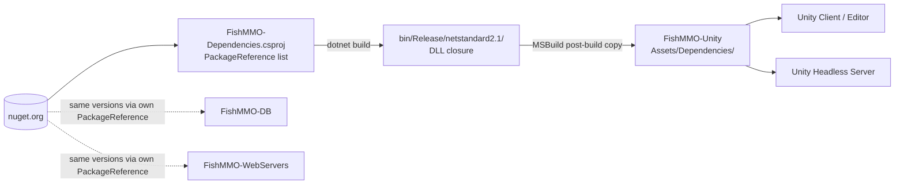

# FishMMO-Dependencies

A **.NET Standard 2.1 class library** whose sole purpose is to centralize all
third-party NuGet packages used by the server-side and Unity-consumable parts
of FishMMO. Building this project produces a folder of DLLs that is mirrored
into `FishMMO-Unity/Assets/Dependencies/` so Unity can use the exact same
package versions as the headless servers and EF Core migrator.

There is intentionally no source code beyond a placeholder `Class1.cs` — the
project file (`FishMMO-Dependencies.csproj`) is the artifact that matters.

---

## Table of Contents

- [Description](#description)
- [Supported Platforms](#supported-platforms)
- [Architecture](#architecture)
- [Key Components](#key-components)
  - [EF Core stack](#ef-core-stack)
  - [Database providers](#database-providers)
  - [Microsoft.Extensions stack](#microsoftextensions-stack)
  - [Utility libraries](#utility-libraries)
- [Configuration](#configuration)
- [Build & Usage](#build--usage)
- [Adding or Upgrading a Package](#adding-or-upgrading-a-package)
- [Flow Diagram](#flow-diagram)

---

## Description

Unity (especially older LTS releases that target .NET Standard 2.1) cannot
consume NuGet packages directly. The standard workaround is to compile a normal
.NET project that lists the needed NuGet packages, then copy the resulting DLLs
into `Assets/Dependencies/`.

This project is that compile target. It guarantees a **single source of truth**
for third-party package versions across the entire FishMMO solution, so the
server, the database, and Unity all link against the same binaries.

---

## Supported Platforms

| Target | Status |
|---|---|
| .NET Standard 2.1 | Yes |
| Unity 6.3 LTS | Yes (via DLL copy) |
| .NET 8.0 servers | Yes (via `PackageReference` instead of DLL copy when possible) |

---

## Architecture

```
FishMMO-Dependencies/
├── FishMMO-Dependencies.csproj   # The PackageReference list (the real artifact)
├── Class1.cs                     # Empty placeholder (required for a .csproj to compile)
└── bin/Release/netstandard2.1/   # Output: all package DLLs + dependencies
                                  # → mirrored to FishMMO-Unity/Assets/Dependencies/
```

A custom MSBuild target copies the full transitive DLL closure (not just the
top-level package DLLs) into the Unity `Assets/Dependencies/` folder after build.

---

## Key Components

### EF Core stack

| Package | Purpose |
|---|---|
| `Microsoft.EntityFrameworkCore` | Core ORM |
| `Microsoft.EntityFrameworkCore.Abstractions` | Public abstractions (DbContext, DbSet) |
| `Microsoft.EntityFrameworkCore.Relational` | SQL-emitting relational provider base |
| `Microsoft.EntityFrameworkCore.Design` | Design-time services (used by Migrator) |
| `Microsoft.EntityFrameworkCore.Tools` | `dotnet ef` CLI integration |
| `EFCore.NamingConventions` | Snake-case naming convention for PostgreSQL |

### Database providers

| Package | Purpose |
|---|---|
| `Npgsql` | PostgreSQL ADO.NET driver |
| `Npgsql.EntityFrameworkCore.PostgreSQL` | EF Core PostgreSQL provider |

### Microsoft.Extensions stack

| Package | Purpose |
|---|---|
| `Microsoft.Extensions.Configuration` (+`Abstractions`, +`Json`) | Hierarchical config + JSON binding |
| `Microsoft.Extensions.DependencyInjection` (+`Abstractions`) | DI container |
| `Microsoft.Extensions.Logging` (+`Abstractions`) | Standard logging API |
| `Microsoft.Extensions.Caching.Abstractions` / `.Memory` | `IMemoryCache` |
| `Microsoft.Extensions.Options` | Options pattern |
| `Microsoft.Extensions.Primitives` | Change tracking (`IChangeToken`, `StringValues`) |
| `Microsoft.Bcl.AsyncInterfaces` | `IAsyncEnumerable<T>` polyfill for netstandard2.1 |

### Utility libraries

| Package | Purpose |
|---|---|
| `srp` | Secure Remote Password (SRP-6a) protocol for login |
| `HtmlAgilityPack` | HTML parsing (used by the CMS and patcher tooling) |
| `Humanizer` | Human-readable strings / dates / numbers |
| `OpenAI` | OpenAI API client (used by experimental NPC tooling) |
| `System.Collections.Immutable` | Immutable collection types |
| `System.ComponentModel.Annotations` | `[Required]`, `[MaxLength]`, etc. |
| `System.Diagnostics.DiagnosticSource` | `Activity` / event source instrumentation |
| `System.IO.Hashing` | xxHash, Crc32, Crc64 |
| `System.Runtime.CompilerServices.Unsafe` | Low-level pointer helpers |
| `System.Text.Encodings.Web` | Encoders for JSON / HTML / URL |
| `System.Text.Json` | High-performance JSON |
| `System.Threading.Channels` | Producer/consumer queues |

---

## Configuration

None. This project is a build-only artifact.

---

## Build & Usage

```bash
# Build (Release recommended for Unity)
dotnet build FishMMO-Dependencies/FishMMO-Dependencies.csproj -c Release
```

After a successful build the DLL closure is copied to
`../FishMMO-Unity/Assets/Dependencies/`. Unity must be **closed** during the
build, otherwise file locks may cause `MSB3027` errors on locked DLLs.

Other server projects in the solution should prefer a `PackageReference` of
their own (re-listing the package they need) so NuGet handles transitive
versioning — they should NOT reference `FishMMO-Dependencies.dll` directly.

---

## Adding or Upgrading a Package

1. Add or change a `<PackageReference>` in
   `FishMMO-Dependencies/FishMMO-Dependencies.csproj`.
2. Close Unity.
3. Run `dotnet build FishMMO-Dependencies/FishMMO-Dependencies.csproj -c Release`.
4. Re-open Unity; verify the assembly resolves under `Assets/Dependencies/`.
5. If a previously copied DLL has been **removed** from the package list, delete
   it manually from `Assets/Dependencies/` — the build does not prune.

> **Tip:** When changing major versions of Npgsql / EF Core, also update the
> matching references in `FishMMO-DB.csproj` and the WebServer projects so all
> three trees agree on a single version.

---

## Flow Diagram


