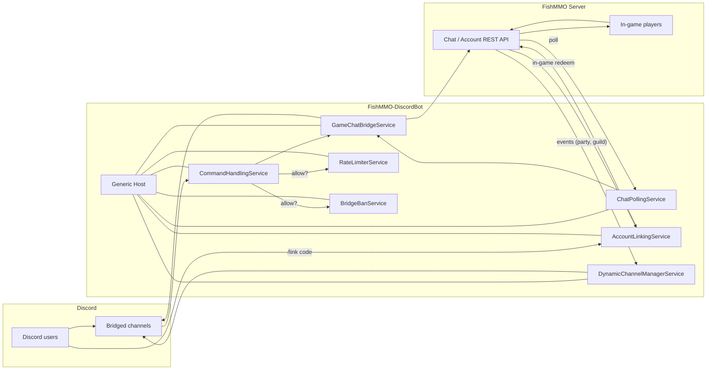

# FishMMO Discord Bot

A standalone .NET 8 application that bridges a live FishMMO server with a Discord
guild. The bot relays in-game chat to Discord channels and back, lets players
**link** their Discord account to a FishMMO character, exposes administrative
slash-style commands (mute, ban, kick, character lookup), and dynamically
provisions per-guild / per-party voice or text channels.

It runs as a long-lived service alongside the rest of the FishMMO server stack.

---

## Table of Contents

- [Description](#description)
- [Supported Platforms](#supported-platforms)
- [Architecture](#architecture)
- [Key Components](#key-components)
  - [Modules (Discord-side commands)](#modules-discord-side-commands)
  - [Services (long-running workers)](#services-long-running-workers)
  - [Data](#data)
- [Configuration](#configuration)
  - [`appsettings.json` shape](#appsettingsjson-shape)
- [Build & Run](#build--run)
- [Deployment Notes](#deployment-notes)
- [Flow Diagram](#flow-diagram)

---

## Description

The bot is built on the **Discord.Net** client library and the standard
`Microsoft.Extensions.Hosting` generic host. It composes a fixed set of
modules (command handlers) and services (background workers) through DI, reads
its configuration from `appsettings.json`, and connects to the FishMMO chat
endpoint to poll chat events and post outbound messages.

Bridging is two-way:

- **Game → Discord:** `ChatPollingService` periodically polls the FishMMO chat
  REST API and forwards new messages to the configured Discord channels via
  `GameChatBridgeService`.
- **Discord → Game:** Discord chat messages (and slash commands) are intercepted
  by `CommandHandlingService` and pushed back to the FishMMO chat API, subject
  to `RateLimiterService` and `BridgeBanService`.

---

## Supported Platforms

| Target | Status |
|---|---|
| .NET 8.0 (Linux, Windows, macOS) | Yes |
| Docker / Linux service | Recommended for production |

| Requirement | Version |
|---|---|
| .NET SDK | 8.0+ |
| Discord application + bot token | Required |
| FishMMO server | Required (for chat API) |

---

## Architecture

```
FishMMO-DiscordBot/
├── Program.cs                 # Generic host + DI composition + bot startup
├── ChatChannel.cs             # Enum / mapping of FishMMO chat channels
├── appsettings.json           # Bot configuration (token, mappings, limits)
├── Data/                      # Plain DTOs / configuration POCOs
├── Modules/                   # Discord slash + text command handlers
│   ├── AdminModule.cs
│   ├── CharacterModule.cs
│   ├── CommandListModule.cs
│   ├── DatabaseModule.cs
│   ├── GeneralModule.cs
│   ├── LinkModule.cs
│   └── ModerationModule.cs
└── Services/                  # Long-running hosted services
    ├── AccountLinkingService.cs
    ├── BotConfigurationService.cs
    ├── BridgeBanService.cs
    ├── ChatPollingService.cs
    ├── CommandHandlingService.cs
    ├── DynamicChannelManagerService.cs
    ├── GameChatBridgeService.cs
    └── RateLimiterService.cs
```

The generic host wires `IHostedService` implementations for each background
worker; the bot's lifetime is the host's lifetime.

---

## Key Components

### Modules (Discord-side commands)

| Module | Responsibility |
|---|---|
| `AdminModule` | Owner / admin-only commands (reload config, shutdown, diagnostics). |
| `CharacterModule` | Character lookup by name / Discord-linked account. |
| `CommandListModule` | `!help` / `/help` — self-documenting command list. |
| `DatabaseModule` | Read-only DB queries gated behind admin permissions. |
| `GeneralModule` | Ping, status, server uptime. |
| `LinkModule` | `/link` workflow — issues short-lived one-time codes that a player redeems in-game to link Discord ↔ FishMMO account. |
| `ModerationModule` | Mute / unmute / ban / unban for the chat bridge (uses `BridgeBanService`). |

### Services (long-running workers)

| Service | Responsibility |
|---|---|
| `BotConfigurationService` | Loads `appsettings.json`, watches for changes, exposes config to other services. |
| `AccountLinkingService` | Manages pending link codes and persists confirmed Discord ↔ account mappings. |
| `ChatPollingService` | Polls FishMMO chat API at a configured interval; emits events to `GameChatBridgeService`. |
| `GameChatBridgeService` | Forwards game messages → Discord channels and Discord messages → game chat. |
| `DynamicChannelManagerService` | Creates / archives Discord channels in response to in-game events (party formed, guild created, etc.). |
| `CommandHandlingService` | Dispatches inbound Discord messages to `Modules/` and handles command results. |
| `BridgeBanService` | Tracks Discord users banned from the bridge; consulted before forwarding. |
| `RateLimiterService` | Per-user / per-channel sliding-window rate limiter to prevent spam from either side. |

### Data

`Data/` holds POCOs used for configuration binding (channel mappings, bridge
policy, rate-limit windows) and DTOs for the FishMMO chat REST contract.

---

## Configuration

Place `appsettings.json` in the project root. It is copied to the output
directory by the build (`<CopyToOutputDirectory>PreserveNewest</CopyToOutputDirectory>`).

### `appsettings.json` shape

```json
{
  "Discord": {
    "Token": "YOUR_DISCORD_BOT_TOKEN",
    "Prefix": "!",
    "GuildId": "0000000000000000000"
  },
  "FishMMO": {
    "ApiUrl": "http://localhost:5000/api/",
    "ApiKey": "YOUR_FISHMMO_API_KEY",
    "ChatPollIntervalMs": 1500
  },
  "ChannelMappings": {
    "World":   "discord-channel-id",
    "Trade":   "discord-channel-id",
    "Admin":   "discord-admin-channel-id"
  },
  "DynamicChannels": {
    "Enabled": true,
    "CategoryId": "discord-category-id",
    "AutoArchiveMinutes": 60
  },
  "RateLimits": {
    "PerUserPerMinute": 10,
    "PerChannelPerMinute": 60
  },
  "Linking": {
    "CodeLengthChars": 8,
    "CodeTtlSeconds": 300
  }
}
```

| Section | Notes |
|---|---|
| `Discord.Token` | **Secret.** Store via environment override in production. |
| `Discord.Prefix` | Legacy text-command prefix (slash commands are preferred). |
| `FishMMO.ApiUrl` / `ApiKey` | FishMMO chat / account REST endpoint. |
| `ChannelMappings` | In-game chat channel → Discord channel ID. |
| `DynamicChannels` | Configures `DynamicChannelManagerService`. |
| `RateLimits` | Sliding-window settings for `RateLimiterService`. |
| `Linking` | Controls `/link` codes (length and TTL). |

> **Production:** override `Discord.Token`, `FishMMO.ApiKey`, and any SMTP-like
> secrets through environment variables (e.g. `Discord__Token=…`) rather than
> committing them to `appsettings.json`.

---

## Build & Run

```bash
# Restore + build
dotnet build FishMMO-DiscordBot.sln -c Release

# Run from source
dotnet run --project FishMMO-DiscordBot/FishMMO-DiscordBot.csproj
```

The process is intended to be supervised — restart on exit. The published
output is a self-contained app suitable for `systemd`, Windows Service, or
Docker.

---

## Deployment Notes

- The bot needs the `MESSAGE CONTENT` and `GUILD MEMBERS` privileged intents
  enabled in the Discord developer portal.
- Required Discord scopes: `bot`, `applications.commands`.
- Required bot permissions: read/send/manage messages in the bridged channels,
  manage channels under the configured dynamic category, and (for moderation
  commands) timeout / ban members.
- Run it on the same network as the FishMMO API so polling latency stays low.

---

## Flow Diagram


