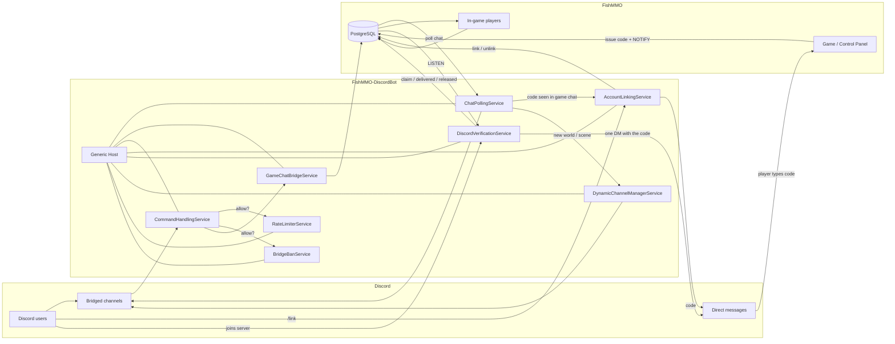

# FishMMO Discord Bot

A standalone .NET 8 application that bridges a live FishMMO server with a Discord
guild. The bot relays in-game chat to Discord channels and back, delivers the
**Discord account-verification code** to players who chose Discord at
registration, lets players **link** their Discord account to their FishMMO
account, exposes administrative commands (mute, ban, kick, character lookup),
and dynamically provisions per-world / per-scene channels.

It runs as a long-lived service alongside the rest of the FishMMO server stack.

---

## Table of Contents

- [Description](#description)
- [Supported Platforms](#supported-platforms)
- [Architecture](#architecture)
- [Key Components](#key-components)
  - [Modules (Discord-side commands)](#modules-discord-side-commands)
  - [Services (long-running workers)](#services-long-running-workers)
  - [Data](#data)
- [Account Verification by Discord](#account-verification-by-discord)
- [Account Links](#account-links)
- [Configuration](#configuration)
  - [`appsettings.json` shape](#appsettingsjson-shape)
- [Build & Run](#build--run)
- [Deployment Notes](#deployment-notes)
- [Flow Diagram](#flow-diagram)

---

## Description

The bot is built on the **Discord.Net** client library and the standard
`Microsoft.Extensions.Hosting` generic host. It composes a fixed set of
modules (command handlers) and services (background workers) through DI, reads
its configuration from `appsettings.json`, and talks to the FishMMO PostgreSQL
database directly through the shared `FishMMO-DB` project.

Bridging is two-way:

- **Game → Discord:** `ChatPollingService` periodically reads new rows from the
  game's chat table and forwards the relayable ones to the matching Discord
  channel. It reads through `ChatService.FetchRelayAsync` with a `ChatReadWindow`
  (both in `FishMMO-DB`), the same window the scene servers' chat pump keeps:
  each read starts a commit window behind what it has settled and skips by ID
  what it has already handled, so a row that commits out of ID order is not
  skipped and no row is relayed twice. Each poll reads at most 5 pages of 200
  rows, so a relay that has fallen behind catches up over several polls, and the
  first read starts at the database's "now", so a restarted bot does not replay
  history. A read that fails settles nothing and is read again on the next poll;
  once a batch's reads have succeeded, each row is recorded as handled before it
  is checked for a link code or sent, so a row whose send fails costs that one
  row and is never relayed twice.
- **Discord → Game:** Discord messages in a managed channel are intercepted by
  `CommandHandlingService` and written into the chat table by
  `GameChatBridgeService`, subject to `RateLimiterService` and `BridgeBanService`.
  The write goes through `ChatService.PersistBridgedAsync`, the same `INSERT` the
  scene servers use, so the row is stamped by the database clock the scene
  servers' chat pumps page by, not by the bot host's clock, which could stamp a
  row behind a window the pumps had already passed.

Account verification is one-way: the game and the Control Panel issue a code,
`DiscordVerificationService` DMs it to the player, and the player types it back
into the game or the panel.

---

## Supported Platforms

| Target | Status |
|---|---|
| .NET 8.0 (Linux, Windows, macOS) | Yes |
| Docker / Linux service | Recommended for production |

| Requirement | Version |
|---|---|
| .NET SDK | 8.0+ |
| Discord application + bot token | Required |
| FishMMO PostgreSQL database | Required (chat, accounts, links) |

---

## Architecture

```
FishMMO-DiscordBot/
├── Program.cs                 # Generic host + DI composition + bot startup
├── ChatChannel.cs             # Enum / mapping of FishMMO chat channels
├── Data/                      # Plain DTOs / persisted bot state
├── Modules/                   # Discord text command handlers
│   ├── AdminModule.cs
│   ├── CharacterModule.cs
│   ├── CommandListModule.cs
│   ├── DatabaseModule.cs
│   ├── GeneralModule.cs
│   ├── LinkModule.cs
│   └── ModerationModule.cs
└── Services/                  # Long-running hosted services
    ├── AccountLinkingService.cs
    ├── BotConfigurationService.cs
    ├── BridgeBanService.cs
    ├── ChatPollingService.cs
    ├── ChatRelayPolicy.cs
    ├── CommandHandlingService.cs
    ├── DiscordVerificationService.cs
    ├── DynamicChannelManagerService.cs
    ├── GameChatBridgeService.cs
    └── RateLimiterService.cs
```

The generic host wires `IHostedService` implementations for each background
worker; the bot's lifetime is the host's lifetime. Configuration comes from
`FishMMO-Setup/<Environment>/appsettings.DiscordBot.json`, which the build copies
into the output directory as `appsettings.json` / `appsettings.Production.json`.

---

## Key Components

### Modules (Discord-side commands)

| Module | Responsibility |
|---|---|
| `AdminModule` | Owner / admin-only commands (command permissions, diagnostics). |
| `CharacterModule` | `char inspect` / `char whois` — character lookup, and the game account, Discord username and linked-since date of a linked Discord user. |
| `CommandListModule` | `help` — self-documenting command list. |
| `DatabaseModule` | Read-only DB queries gated behind admin permissions. `getaccount` shows the account's Discord username, whether a Discord user is linked, whether Discord is verified, and whether the verification DM went out. |
| `GeneralModule` | Ping, status, server uptime. |
| `LinkModule` | `/link` issues a short-lived code the player types into game chat; `/unlink` removes the link. Both read and write the link in the database. |
| `ModerationModule` | `mod kick` / `mod ban` / `mod unban` on game accounts, and ban / unban for the chat bridge (uses `BridgeBanService`). The game-account commands need the Discord user linked to a Game Master or Admin game account, apply the Control Panel's guards (not yourself, not a peer or superior), call the same account services the panel does, and write each attempt to the admin audit log with source `discord`. |

### Services (long-running workers)

| Service | Responsibility |
|---|---|
| `BotConfigurationService` | Loads and saves `botconfig.json` (dynamic channels) and `botdata.json` (bridge bans, muted zones, command permissions, and legacy links awaiting import). |
| `AccountLinkingService` | Holds pending `/link` codes in memory, writes confirmed links to the database, caches link lookups for 60 s, and imports old `botdata.json` links on start. |
| `DiscordVerificationService` | Delivers the one Discord verification DM per account. Woken by PostgreSQL `LISTEN/NOTIFY`, a slow safety sweep, the gateway's Ready event and member joins. See [Account Verification by Discord](#account-verification-by-discord). |
| `ChatPollingService` | Reads new chat rows at a configured interval through `ChatService.FetchRelayAsync` and a `ChatReadWindow`, spots `/link` codes typed in game chat, and relays allowed channels to Discord. |
| `ChatRelayPolicy` | The allowlist of in-game channels that may be republished to Discord. |
| `GameChatBridgeService` | Writes Discord messages from managed channels into the game's chat table through `ChatService.PersistBridgedAsync`, after rate-limit and bridge-ban checks. |
| `DynamicChannelManagerService` | Creates / archives Discord channels for game worlds and scenes. |
| `CommandHandlingService` | Dispatches inbound Discord messages to `Modules/` and handles command results. |
| `BridgeBanService` | Tracks characters and accounts banned from the bridge; consulted before forwarding. A Discord author is checked by their linked account. |
| `RateLimiterService` | Per-user sliding-window rate limiter for the bridge. |

### Data

`Data/` holds the bot's own persisted state (`BotPersistentData`, bridge bans,
command permissions, dynamic channel state) and in-memory DTOs such as
`PendingLinkVerification`. `LinkedAccount` survives only so old `botdata.json`
files still load; see [Account Links](#account-links).

---

## Account Verification by Discord

A player can verify their game account by email, SMS or **Discord**, and any one
correct code verifies it. For Discord they give their Discord username at
registration, in either form Discord uses — `fishfan`, or `FishFan#1234` for a
name that still has its discriminator. The database stores it lowercase.

The game or the Control Panel issues the code. The bot's only job is to carry
it: **players never type a code into Discord**.

### The bot sends exactly one DM, ever

Each account is sent its code once. There are no resends, and there is no command
to ask for one. A delivery is *claimed* in the database before the bot sends it
and *marked delivered* after, so two bot instances — or a bot racing a player who
has just verified by email — cannot both send.

What happens when a send fails depends on whether the message could have gone out:

| Outcome | What the bot does |
|---|---|
| Delivered | Marks it delivered. Nothing is ever sent for that account again. |
| Discord **definitely refused** it (a 4xx, e.g. `50007` — the member's DMs are closed or they blocked the bot) | Releases it with the reason, and counts an attempt. After `MaxSendAttempts` (5) it stops. |
| Discord **rate-limited** it (429) | Releases it uncounted; it goes out on a later pass. |
| **Unknown** — a timeout, a 5xx, a dropped connection | **Leaves it claimed** and logs an error for staff. |

> **Why an ambiguous failure stays claimed.** A timed-out request may already have
> delivered the message. Retrying it is exactly the second DM this design exists to
> prevent, so the bot doesn't: one DM ever beats a guaranteed delivery. Staff check
> with the player and resolve the row by hand. For the same reason the send turns off
> Discord.Net's automatic retry of timeouts and 502s; only rate limits are retried.

The bot also will not DM a Discord user who is **already linked to a different game
account**; that delivery is released with the reason and counts as an attempt.

### Players must join the Discord server

Discord only lets a bot DM someone it shares a server with, and only lets it look a
username up among that server's members. So `Discord:DefaultGuildId` must be the
server the game's invite link sends players to.

A player who isn't a member yet is recorded as *waiting to join*, and is sent
their code the moment they join. The join is handled from the gateway's
member-joined event, with a read of just that member's username, not by polling.
On a delivery's very first try, if the member isn't in the local member cache,
the bot makes one REST member search. After that it relies on the cache and the
join event, so a player who never joins costs nothing per sweep.

A username matches a member ignoring case. A bare name (`fishfan`) matches only a
member without a discriminator, and a tagged name (`fishfan#1234`) needs the exact
discriminator. If a name matches more than one member, the bot sends nothing and
records why. A DM to the wrong person puts a verification code in a stranger's
hands.

### Why LISTEN/NOTIFY and not polling

Codes are rare and the accounts table is not small, so the bot doesn't query it on
a timer. Issuing a code raises a PostgreSQL notification on
`fishmmo_discord_verification`. The bot keeps one dedicated, **unpooled**
connection on `LISTEN` (a LISTEN is session state, and the shared pool doesn't
reset sessions), and runs a pass when it fires. It reconnects with capped
exponential backoff, logging once per outage, and runs a pass after every
reconnect, in case something was raised while it was down.

A slow safety sweep (`SweepMinutes`, default 5) and the gateway's Ready event
catch anything raised while the bot itself was down. Passes never overlap: every
wake source signals one queue with a single reader, and wakes during a pass fold
into one more pass.

### Pacing

`MinDmIntervalMs` (default 1500 ms, never below 250) is a **global** minimum gap
between any two DMs, sent or failed. Nothing a player does can make the bot send
faster than that.

### Privileged intent

Matching usernames against members needs the **Server Members** (`GUILD_MEMBERS`)
privileged intent, enabled in the Discord developer portal. The bot already
requests it and downloads the member list on connect. A pass waits until that
download completes, so nobody is wrongly recorded as not having joined.

---

## Account Links

A game account's linked Discord user is a **database column**, unique across
accounts: one Discord account links one game account. A verified Discord code and
a `/link` are the same link.

- `/link <character>` DMs the player a short-lived code. When that code appears in
  game chat from the named character, the bot links the character's account.
  Only the pending code lives in memory; the link is written to the database. If
  the Discord user is already linked to a different account, nothing changes and
  the player is told why.
- `/unlink` removes the link. The account stays verified — an unlink is not a
  reason to lock a player out — but the Discord channel's own proof goes.
- `char whois` shows the linked game account, Discord username and linked-since
  date. A link names an account, not a character.
- The bridge-ban check on a Discord author uses their linked **account**.

Lookups are cached for 60 seconds, because the bridge checks the link on every
message. Links this bot makes or removes take effect at once. A link made in the
game or Control Panel is seen within the minute.

> **Migrating from `botdata.json`.** Older bots kept links in `botdata.json`. On
> start the bot imports every remaining entry into the database. It removes the
> entries that imported, and the ones the database refused for good (that Discord
> user is linked to another account, the account no longer exists, or the account
> already has a different Discord user), logging each refusal. Entries that failed
> transiently stay in the file and are retried on the next start.

---

## Configuration

Configuration lives in `FishMMO-Setup/Development/appsettings.DiscordBot.json`
and `FishMMO-Setup/Production/appsettings.DiscordBot.json`. The build copies them
to the output directory as `appsettings.json` and `appsettings.Production.json`,
and `appsettings.json` files in the working directory override them.

### `appsettings.json` shape

```json
{
  "Discord": {
    "DefaultGuildId": 0
  },
  "Npgsql": {
    "Host": "127.0.0.1",
    "Port": "5432",
    "Database": "fishmmo",
    "Schema": "public"
  },
  "ChatPollingIntervalSeconds": 5,
  "ChatRelay": {
    "GameToDiscordChannels": [ "Say", "World", "Trade", "Region" ]
  },
  "BridgeMessageMaxLength": 128,
  "DiscordVerification": {
    "SweepMinutes": 5,
    "BatchSize": 25,
    "MinDmIntervalMs": 1500
  },
  "RateLimiting": {
    "MaxMessagesPerWindow": 5,
    "WindowSeconds": 10
  }
}
```

| Section | Notes |
|---|---|
| `FISHMMO_DISCORD_TOKEN` (environment) | **Secret.** Not a config key: the bot reads its token only from this environment variable, and refuses to connect without it. |
| `Discord.DefaultGuildId` | The Discord server the bot operates in. **Must be the server the game's invite link points players to** — verification DMs can only reach its members. `0` disables channel creation and verification delivery. |
| `Npgsql` | Database host, port, name and pool settings, read by FishMMO-DB's `NpgsqlDbConfiguration` through the shared `NpgsqlDbContextFactory`, as every other FishMMO process reads them. **No credentials here:** they come from `FISHMMO_DB_USERNAME` / `FISHMMO_DB_PASSWORD` or the platform secrets file (see the FishMMO-DB README). `FISHMMO_DB_HOST` / `FISHMMO_DB_PORT` / `FISHMMO_DB_NAME` override the host, port and name. |
| `ChatPollingIntervalSeconds` | How often `ChatPollingService` reads new chat rows. |
| `ChatRelay.GameToDiscordChannels` | **Allowlist** of in-game channels the bot may republish to Discord. Omit for the default (`Say`, `World`, `Trade`, `Region`). See the warning below. |
| `BridgeMessageMaxLength` | Caps a Discord message bridged into the game. Keep at or below the game's `ChatBroadcast.MaxTextLength` (**128**) — clients discard anything longer, so a larger value makes long messages vanish rather than arrive truncated. |
| `DiscordVerification.SweepMinutes` | Safety sweep for verification deliveries (default 5, clamped 1–60). Not the delivery path — `LISTEN/NOTIFY` and member joins are. |
| `DiscordVerification.BatchSize` | Most pending deliveries one sweep pass reads (default 25, clamped 1–100). |
| `DiscordVerification.MinDmIntervalMs` | Global minimum gap between any two verification DMs (default 1500, clamped 250–60000). |
| `RateLimiting` | Sliding-window settings for `RateLimiterService`. |

> **The relay is an allowlist, and private channels are not configurable.**
> The bot used to select every chat row *except* Discord's own and forward it, which meant
> **`[Tell]` whispers were republished to a public Discord channel** — full message body, both
> character names. Relaying is now opt-in per channel. `Tell`, `Guild`, `Party`, `Discord` and
> `Command` are on a `NeverRelayable` set and are refused **even if you name them here**, with an
> error logged; making a private channel relayable is a deliberate code change, not a config edit.
> Inbound Discord messages are sanitised at the bridge and again server-side, and are no longer
> exempt from in-game tab filtering.

> **Production:** set `FISHMMO_DISCORD_TOKEN`, `FISHMMO_DB_USERNAME` and
> `FISHMMO_DB_PASSWORD` through the environment (or the database secrets file)
> rather than committing them to any `appsettings` file.

---

## Build & Run

```bash
# Restore + build
dotnet build FishMMO-DiscordBot.sln -c Release

# Run from source
dotnet run --project FishMMO-DiscordBot/FishMMO-DiscordBot.csproj
```

The process is intended to be supervised — restart on exit. The published
output is a self-contained app suitable for `systemd`, Windows Service, or
Docker.

---

## Deployment Notes

- The bot needs the `MESSAGE CONTENT` and `SERVER MEMBERS` (`GUILD_MEMBERS`)
  privileged intents enabled in the Discord developer portal. Without Server
  Members the gateway refuses the connection, and verification codes cannot be
  delivered at all.
- Required Discord scopes: `bot`, `applications.commands`.
- Required bot permissions: read/send/manage messages in the bridged channels,
  manage channels under the dynamic category, and (for moderation commands)
  timeout / ban members.
- The database user needs `LISTEN` on the FishMMO database. Point the `Npgsql`
  settings (or `FISHMMO_DB_HOST` / `FISHMMO_DB_PORT`) at PostgreSQL directly, or
  at a pooler in **session** mode. A transaction-mode pooler (PgBouncer's default) drops
  `LISTEN`, and deliveries then wait for the sweep.
- A delivery left claimed after an ambiguous send is logged at error level with
  the account name. Watch for those; each one needs a person to check with the
  player.
- Run it on the same network as the database so polling and notifications stay
  prompt.

---

## Flow Diagram


