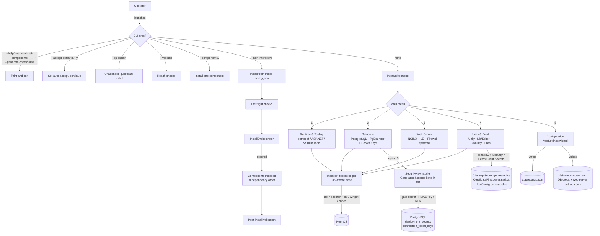

# FishMMO-Installer

FishMMO-Installer is a cross-platform .NET 8 console tool that automates FishMMO server dependency setup. It provides an interactive menu-driven interface to install and configure all infrastructure components required to run a FishMMO game server. It also supports a CLI-driven non-interactive mode for headless/automated deployment.

## Table of Contents

- [Description](#fishmmo-installer)
- [Supported Platforms](#supported-platforms)
- [Menu Structure](#menu-structure)
- [CLI / Non-Interactive Mode](#cli--non-interactive-mode)
- [Key Component Versions](#key-component-versions)
- [Architecture](#architecture)
- [Configuration & Environment](#configuration--environment)
- [Prerequisites](#prerequisites)
- [Build and Run](#build-and-run)
- [appsettings.json Example](#appsettingsjson-example)
- [install-config.json Schema](#install-configjson-schema)
- [Operational checks after installation](#operational-checks-after-installation)
- [NGINX setup guide (per OS)](#nginx-setup-guide-per-os)
- [Flow Diagram](#flow-diagram)
- [License](#license)

## Supported Platforms

| Platform | Install Strategy |
|---|---|
| Windows 10/11 | EXE/ZIP installers + Windows services (UAC elevation) |
| Ubuntu/Debian | `apt-get` + `systemctl` |
| Arch Linux / CachyOS | `pacman` + `systemctl` |
| RHEL / Fedora | `dnf` / `yum` + `systemctl` |

---

## Menu Structure

```
=== FishMMO Installer ===
1 : Runtime & Tooling
2 : Database
3 : Web Server
4 : Unity & Build
5 : Configuration
0 : Quit
```

### 1 — Runtime & Tooling

| Option | Description |
|---|---|
| 1 | Install dotnet-ef global tool |
| 2 | Install ASP.NET Core Runtime (8.0.x) |
| 3 | Install Visual Studio Build Tools *(Windows only)* |

VS Build Tools installs the **`.NET desktop development`** and **`Desktop development with C++`** workloads plus the Windows 10 SDK silently via the VS 2022 bootstrapper.

### 2 — Database

| Option | Description |
|---|---|
| 1 | Configure Database Secrets (env vars / secrets file for DB credentials) |
| 2 | Install PostgreSQL |
| 3 | Install PgBouncer (connection pooler) |
| 4 | Install FishMMO Database (user / schema / initial EF migration) |
| 5 | Create a new EF Core database migration |
| 6 | Grant user permissions on the FishMMO database |
| 7 | **Delete FishMMO Database** *(destructive — prompts for confirmation)* |
| 8 | Configure PgBouncer (generate `pgbouncer.ini`, auth_query or userlist.txt, Linux only) |
| 9 | Configure Server Keys (DB-backed deployment secrets — gate secret, HMAC key, KEK) |

### 3 — Web Server

| Option | Description |
|---|---|
| 1 | Install NGINX `1.29.5` and configure service startup |
| 2 | Install / Renew Let's Encrypt certificate for NGINX |
| 3 | Deploy FishMMO `nginx.conf` (from `FishMMO-Setup/`) |
| 4 | Configure Firewall Rules (open ports 80, 443) |
| 5 | Register FishMMO Web Servers as systemd Services (Linux) or Windows Services via NSSM |

On **Windows** NGINX runs as a Windows service managed by NSSM `2.24` and TLS is automated via win-acme `2.2.9.1701`.  
On **Linux** NGINX is managed by systemd and TLS is automated via certbot.

The web server service registration (menu 3-5) is **cross-platform** — systemd on Linux, NSSM on Windows — with environment variables set automatically to `Production` (configurable via `FISHMMO_SERVICE_ENVIRONMENT`).

### 4 — Unity & Build

| Option | Description |
|---|---|
| 1 | Install Unity Hub |
| 2 | Install Unity Editor `6000.3.2f1` with selectable modules |
| 3 | Build all C# projects under a selected root directory |
| 4 | Build FishMMO-Unity (Client/Server/Addressables via headless batch mode) |

**Available Unity modules**

| Module ID | Display Name |
|---|---|
| `linux-il2cpp` | Linux Build Support (IL2CPP) |
| `linux-mono` | Linux Build Support (Mono) |
| `linux-dedicated-server` | Linux Dedicated Server Build Support |
| `mac-mono` | Mac Build Support (Mono) |
| `mac-il2cpp` | Mac Build Support (IL2CPP) |
| `mac-server` | Mac Dedicated Server Build Support |
| `windows-mono` | Windows Build Support (Mono) |
| `windows-il2cpp` | Windows Build Support (IL2CPP) |
| `windows-dedicated-server` | Windows Dedicated Server Build Support |
| `webgl` | Web Build Support |
| `android` | Android Build Support |
| `ios` | iOS Build Support |

**Default modules installed:** `linux-il2cpp`, `linux-dedicated-server`, `webgl`, `windows-mono`, `windows-il2cpp`, `windows-dedicated-server`

**Project build** scans the chosen directory recursively for `.csproj` files, builds dependency-order projects synchronously first (FishMMO-Dependencies → FishMMO-Logger → FishMMO-Database → FishMMO-SharedUtility → FishMMO-Auth → FishMMO-CMS), then runs the remaining builds in parallel.

**Unity build** locates the Unity Editor executable via multiple resolution strategies (env var, default install path, Unity Hub CLI, filesystem probe, interactive prompt), then invokes `-batchmode -nographics` with the appropriate `-executeMethod` target from `FishMMO.Shared.CustomBuildTool`.

### 5 — Configuration

| Option | Description |
|---|---|
| 1 | Configure AppSettings (secure setup wizard) |

The AppSettings wizard supports configuration for 6 components:

| Component | Config File | Key Settings |
|---|---|---|
| Database | `appsettings.json` | Npgsql connection (Host, Port, Database, Username, Password, pool settings) |
| IPFetch Web Server | `appsettings.json` | HttpPort, Npgsql connection string |
| Patcher Web Server | `appsettings.json` | HttpPort, Patches directory |
| WebGL Web Server | `appsettings.json` | HttpPort |
| Discord Bot | `appsettings.json` | Token, Guild ID, Npgsql DSN, rate limiting |
| CMS Server | `appsettings.json` | DefaultConnection string |

For each component, the wizard can generate:

- `appsettings.json` — base configuration (`chmod 600` on Linux)
- `appsettings.Development.json` / `appsettings.Production.json` — environment overrides (`chmod 600`)
- `~/.config/fish/conf.d/fishmmo-secrets.fish` — fish shell snippet (`chmod 600`)
- `fishmmo-secrets.env` — systemd / Docker `.env` file in the target directory (`chmod 600`)
- `%USERPROFILE%\Documents\WindowsPowerShell\fishmmo-secrets.ps1` — PowerShell snippet (Windows)
- `%USERPROFILE%\fishmmo-secrets.cmd` — CMD batch snippet (Windows)

All secrets files set the same environment variable format. .NET IConfiguration maps double-underscore (`__`) to JSON nesting — e.g. `Npgsql__Password` → `Npgsql:Password` in `appsettings.json`.

> **Note:** These env-var secrets files contain **database credentials and web server configuration only**. Application secrets (gate secret, connection token HMAC key, signing key KEK) are **never stored in env files** — they are generated by the SecurityKeyInstaller and stored directly in the PostgreSQL database. Client-side `.generated.cs` files (`ClientApiSecret.generated.cs`, `CertificatePins.generated.cs`, `HostConfig.generated.cs`) are generated from within the Unity Editor via **FishMMO > Security > Fetch Client Secrets** (and analogous Fetch Certificate Pins, Fetch Host Config).

---

## CLI / Non-Interactive Mode

The installer supports a full CLI mode for automated/headless deployment. Run `FishMMO-Installer --help` for the full list.

```
Usage:
  FishMMO-Installer                           Interactive menu mode (default)
  FishMMO-Installer --help / -h               Show help
  FishMMO-Installer --version / -v            Show version
  FishMMO-Installer --component <name>        Install one component interactively
  FishMMO-Installer --non-interactive -f cfg  Unattended install from config file
  FishMMO-Installer --dry-run                 Simulate without making changes
  FishMMO-Installer --validate                Run post-install health checks
  FishMMO-Installer --generate-checksums      Generate SHA256 hashes for downloaded files
  FishMMO-Installer --quickstart              Unattended install with quickstart defaults
  FishMMO-Installer --accept-defaults / -y    Skip all confirmation prompts
  FishMMO-Installer --list-components         List available component names and exit
  FishMMO-Installer --configure-server-secrets <regions>  Generate deployment keys and store in database
  FishMMO-Installer --log-file <path>          Write log output to a file in addition to console
```

### Available component names

| Component | Description |
|---|---|
| `dotnet-ef` | dotnet-ef global tool (required for database migrations) |
| `aspnet-runtime` | ASP.NET Core Runtime 8.0 |
| `vs-build-tools` | Visual Studio Build Tools (Windows only) |
| `postgresql` | PostgreSQL server |
| `pgbouncer` | PgBouncer connection pooler |
| `fishmmo-db` | FishMMO database, user, and initial migration |
| `nginx` | NGINX reverse proxy |
| `letsencrypt` | Let's Encrypt TLS certificate |
| `unity-hub` | Unity Hub |
| `unity-editor` | Unity Editor + modules |
| `build-projects` | Build all C# projects |
| `build-unity` | Build FishMMO-Unity player/addressables |
| `appsettings` | Configure appsettings.json + secrets |
| `create-migration` | Create a new EF Core database migration |
| `firewall` | Configure host firewall rules |
| `systemd-services` | Register FishMMO web servers as systemd services (Linux) |
| `all` | Run every component in dependency order |

### Pre-flight checks

The installer runs pre-flight checks at startup in all modes. In non-interactive/CLI modes, blocking errors halt installation. In interactive mode, all results are shown as warnings/logs only:
- Internet connectivity (pings `dot.net`)
- Disk space (minimum 5 GB recommended)
- System memory (minimum 2 GB recommended)
- Administrator / passwordless-sudo access
- Port conflicts on standard FishMMO ports (80, 443, 5432, 6432, 8000, 8080, 8090)

---

## Key Component Versions

| Component | Version |
|---|---|
| dotnet-ef | `5.0.17` (pinned for Unity3D compatibility) |
| ASP.NET Core Runtime | Latest in 8.0 channel (hardcoded fallback `8.0.16`) |
| PostgreSQL | latest via package manager (Linux) / EnterpriseDB installer (Windows) |
| PgBouncer | latest via package manager, default port `6432` |
| NGINX | `1.29.5` (Windows ZIP), package manager (Linux) |
| Unity Editor | `6000.3.2f1` (default, overridable at prompt) |
| win-acme | `2.2.9.1701` (Windows TLS automation) |
| NSSM | `2.24` (Windows service wrapper for NGINX) |
| Visual Studio Build Tools | VS 2022 bootstrapper (`aka.ms/vs/17/release/vs_buildtools.exe`) |

> **Note:** The .NET SDK is a prerequisite for running this installer and is not installed by it. The ASP.NET Core Runtime download URL and SHA512 hash are resolved dynamically from Microsoft's official release metadata API, providing cryptographically-verifiable integrity for the hosting bundle download.

---

## Architecture

### Root-level installers (one file per subsystem)

| File | Responsibility |
|---|---|
| `Program.cs` | Entry point — environment setup, config load, interactive menu loop, CLI dispatch |
| `InstallationConstants.cs` | All download URLs, filenames, version strings, default config values, EF paths, monorepo layout |
| `InstallerProcessHelper.cs` | Shared process execution, shell detection (fish → bash → cmd), prompting utilities, Linux DotNet PATH/DOTNET_ROOT bootstrap |
| `DotNetInstaller.cs` | ASP.NET Runtime install and version detection, dotnet-ef tool install, EF migration/database-update commands |
| `VSBuildToolsInstaller.cs` | VS Build Tools silent install (Windows only) |
| `PostgreSQLInstaller.cs` | PostgreSQL install, database/user creation, EF migrations, permission grants, database deletion |
| `PostgreSQLHardening.cs` | PostgreSQL security hardening — rewrites `pg_hba.conf` to `scram-sha-256`, updates `postgresql.conf` (partial class of `PostgreSQLInstaller`) |
| `PgBouncerInstaller.cs` | PgBouncer install, systemd service setup, `pgbouncer.ini` generation with auth_query (recommended) or auth_file/userlist.txt SCRAM-SHA-256 modes |
| `SecurityKeyInstaller.cs` | Cryptographic key generation and storage in the database (gate secret, connection token HMAC key, signing key KEK). Client .generated.cs files are generated separately from the Unity Editor. |
| `NGINXInstaller.cs` | NGINX install, Windows service registration (NSSM), Linux systemd configuration, nginx.conf deployment |
| `LetsEncryptInstaller.cs` | certbot (Linux) and win-acme (Windows) TLS certificate automation for NGINX |
| `UnityInstaller.cs` | Unity Hub and Unity Editor install via Unity Hub CLI with module selection |
| `UnityBuildInstaller.cs` | Unity headless builds (Client/Server/Addressables) via `-batchmode -nographics` with multi-strategy editor resolution |
| `ProjectBuildInstaller.cs` | Staged/parallel `dotnet build` across all discovered `.csproj` files with priority-based ordering |
| `AppSettingsInstaller.cs` | Interactive wizard to write `appsettings.json`, env overlays, and secrets env-var files for FishMMO web servers, Discord Bot, and CMS. Client security files are no longer generated here — use SecurityKeyInstaller (DB) + Unity Editor (client .generated.cs). |
| `LinuxConfigHardeningHelper.cs` | Atomic privileged file writes via `sudo install`, one-time `.pre-fishmmo.bak` backups, idempotent managed-marker detection |

### Components (cross-cutting concerns)

| File | Responsibility |
|---|---|
| `Components/FirewallInstaller.cs` | Host firewall rule creation (ufw / firewalld on Linux, netsh on Windows) |
| `Components/HealthChecker.cs` | Post-install validation — .NET SDK, ASP.NET Runtime, PostgreSQL, NGINX, PgBouncer, systemd services, database connectivity, disk space |
| `Components/SystemdServiceInstaller.cs` | Cross-platform service installation — systemd unit files on Linux, NSSM Windows services on Windows. Covers web servers (IPFetch, Patcher, WebGL) and the AppHealthMonitor daemon |

### Infrastructure (shared services)

| File | Responsibility |
|---|---|
| `Infrastructure/CliParser.cs` | CLI argument parsing into `CliCommand` model, help/version text |
| `Infrastructure/DotNetReleaseHelper.cs` | Dynamic ASP.NET Core Runtime URL and version resolution from Microsoft release metadata API |
| `Infrastructure/DownloadHelper.cs` | File downloads with SHA256/SHA512 integrity verification, progress bars, checksum management, disk-space gating |
| `Infrastructure/InstallOrchestrator.cs` | Multi-component orchestration with dependency ordering, manifest-driven non-interactive installs |
| `Infrastructure/LinuxPackageManagerHelper.cs` | Package manager detection and command generation (pacman, apt-get, dnf, yum) |
| `Infrastructure/PlatformAbstractions.cs` | `IPlatform` interface + Windows/Linux implementations with `PlatformFactory` singleton |
| `Infrastructure/PreFlightChecker.cs` | System readiness checks (internet, disk, RAM, admin access, port conflicts) |

### Models (data transfer objects)

| File | Responsibility |
|---|---|
| `Models/CliCommand.cs` | Parsed CLI command record (Help, Version, NonInteractive, DryRun, Validate, GenerateChecksums, Quickstart, AcceptDefaults, ListComponents, LogFilePath, ComponentName, ConfigFilePath) |
| `Models/InstallManifest.cs` | Deserialized `install-config.json` model for non-interactive installations |
| `Models/InstallResult.cs` | Single component installation result (Success, ComponentName, ErrorMessage, Duration) |

---

## Configuration & Environment

At startup, the installer resolves the active environment name once and propagates it to all three standard variables:

```
FISHMMO_ENVIRONMENT
DOTNET_ENVIRONMENT
ASPNETCORE_ENVIRONMENT
```

The environment name is resolved via `DatabaseConfigurationHelper.ResolveEnvironmentName()` which checks (in order): `FISHMMO_ENVIRONMENT` env var → `DOTNET_ENVIRONMENT` → `ASPNETCORE_ENVIRONMENT`. Defaults to `"Development"` if none are set.

Configuration is loaded via `DatabaseConfigurationHelper.BuildDesignTimeConfiguration`, which:
1. Checks the **working directory** for `appsettings.json` (operator override).
2. Falls back to the **bundled copy** in the EXE directory (copied from [`FishMMO-Setup/Development/appsettings.Database.json`](../FishMMO-Setup/Development/appsettings.Database.json) at build time).
3. Merges an optional `appsettings.{Environment}.json` overlay.
4. Applies environment variables as the highest-priority source.

### Environment variables for non-interactive mode

When running in non-interactive mode (`--non-interactive` or `--component`), some components require credentials that would normally be prompted interactively. Set these environment variables before launching to enable fully unattended operation:

| Variable | Used by | Description |
|---|---|---|
| `FISHMMO_INSTALL_ROOT` | all | Override monorepo root path (skips auto-detection; useful for published builds) |
| `FISHMMO_LOG_LEVEL` | all | Override console logging verbosity (e.g. `Debug`, `Verbose`). Requires restart. |
| `FISHMMO_PG_SUPERUSER_PASSWORD` | `fishmmo-db` | PostgreSQL superuser password (avoids interactive prompt) |
| `FISHMMO_PG_LISTEN_ADDRESSES` | PostgreSQL hardening | Override `listen_addresses` in postgresql.conf (default: `localhost`) |
| `FISHMMO_UNITY_EXE` | `build-unity` | Path to Unity Editor executable (skips auto-detection) |
| `FISHMMO_SERVICE_ENVIRONMENT` | service installers | Override the environment name set in systemd/NSSM service units (default: `Production`) |
| `FISHMMO_CLIENT_GATE_SECRET` | `--configure-server-secrets` | Pre-populate the gate secret for DB storage (if unset, SecurityKeyInstaller generates one automatically). Not read directly by web servers — they load it from the DB at startup. |
| `FISHMMO_SIGNING_KEY_KEK_BASE64` | `--configure-server-secrets` | Pre-populate the signing key KEK for DB storage (if unset, SecurityKeyInstaller generates one automatically). |

Logging is bootstrapped from `logging.json` (copied from [`FishMMO-Setup/logging.json`](../FishMMO-Setup/logging.json) at build time). The `FISHMMO_LOG_LEVEL` environment variable overrides console verbosity at runtime without editing the file.

### Linux DotNet environment

Before any `dotnet` command runs on Linux, the installer prepares the runtime environment in-process (once per process lifetime):

- Adds `~/.dotnet` to `PATH` if missing
- Adds `~/.dotnet/tools` to `PATH` if missing
- Sets `DOTNET_ROOT` to `~/.dotnet` if it exists, otherwise `/usr/share/dotnet`

### EF Core project paths (relative to EXE output directory)

| Role | Path |
|---|---|
| EF project | `./FishMMO-Database/FishMMO-DB/FishMMO-DB.csproj` |
| Startup project | `./FishMMO-Database/FishMMO-DB-Migrator/FishMMO-DB-Migrator.csproj` |
| Migrations output | `Migrations/` (inside the FishMMO-DB project) |

> **MSBuild note:** There is no stash-and-restore step. The installer's
> `CopyFishMMODatabase` target (in `FishMMO-Installer.csproj`) mirrors the
> FishMMO-Database source tree into its output directory but **excludes**
> `**\Migrations\**` — along with `bin`, `obj`, and `.vs`. Generated migrations
> therefore stay solely in the real `FishMMO-DB` project and are never copied,
> so an installer `dotnet clean` / `dotnet build` cycle cannot duplicate or
> clobber them.

### Unity executable resolution

Unity builds resolve the editor executable in this order:

1. Cached value from a previous successful resolve in the same session
2. `FISHMMO_UNITY_EXE` environment variable (set this to skip auto-detection)
3. Default Unity Hub install path for the configured version
4. Unity Hub CLI (`unityhub -- --headless editors --installed`) output
5. Common alternate install locations (`/opt`, `~/.local/share/unityhub`, etc.)
6. Interactive prompt for a user-supplied path

### Monorepo root detection

The installer checks `FISHMMO_INSTALL_ROOT` first (if set), then walks up from the executing assembly until it finds a directory containing both `FishMMO-Unity` and `FishMMO-Setup` subdirectories. Falls back to `~/Dev/FishMMO-Dev` if not found. If the env var path exists but is missing expected subdirectories, a warning is logged and the path is used anyway.

---

## Prerequisites

- .NET SDK 8+ to build and run this repository
- Administrator / root privileges for system-level installs
- Internet connectivity for downloads and package repositories
- 5 GB+ free disk space recommended (Unity Editor + build tools)
- 2 GB+ RAM recommended

### Install .NET SDK (if not already installed)

#### Windows 10/11

Install from Microsoft:

- https://dotnet.microsoft.com/download/dotnet/8.0

Then verify:

```powershell
dotnet --list-sdks
```

#### Ubuntu/Debian

```bash
sudo apt-get update
sudo apt-get install -y dotnet-sdk-8.0
dotnet --list-sdks
```

#### Arch Linux / CachyOS

```bash
sudo pacman -S --noconfirm dotnet-sdk
dotnet --list-sdks
```

#### RHEL / Fedora

```bash
sudo dnf install -y dotnet-sdk-8.0
dotnet --list-sdks
```

---

## Build and Run

The solution file is at the repository root:

```bash
cd path/to/FishMMO-Installer
dotnet build
dotnet run --project FishMMO-Installer/FishMMO-Installer.csproj
```

Run the compiled binary directly:

- Windows: `FishMMO-Installer/FishMMO-Installer/bin/Debug/net8.0/FishMMO-Installer.exe`
- Linux: `./FishMMO-Installer/FishMMO-Installer/bin/Debug/net8.0/FishMMO-Installer`

> **Important:** `logging.json` and `appsettings.json` are copied from [`FishMMO-Setup/`](../FishMMO-Setup/) to the output directory automatically by the build. Edit the templates in `FishMMO-Setup/Development/` with your credentials before building, or use the Configuration wizard (menu 5) to apply overrides. Place a modified copy in the working directory to override the bundled defaults at runtime.

> **Note:** `checksums.json` is also copied to the output directory. Populate it with SHA256 hashes of your downloaded artifacts to enable integrity verification. See [checksums.json](#download-integrity-verification) below.

---

## appsettings.json Example
Database operations require `appsettings.json` in the working directory. Non-sensitive settings (host, port, database name, pool sizes) are stored in JSON. Secrets (password) are set via environment variables — see the `_comment` field in each template for the env var name to set.

```json
{
  "_comment": "Non-sensitive defaults only. Override secrets via env vars: Npgsql__Password, Npgsql__Username",
  "Npgsql": {
    "Database": "fish_mmo_postgresql",
    "Schema": "public",
    "Username": "",
    "Password": "",
    "Host": "127.0.0.1",
    "Port": "5432",
    "CommandTimeout": 10,
    "ConnectionTimeout": 15,
    "MinPoolSize": 5,
    "MaxPoolSize": 100,
    "RetryPolicy": {
      "MaxRetries": 3,
      "BaseDelayMs": 20,
      "MaxJitterMs": 10
    },
    "QueryPerformanceTracking": {
      "Enabled": false,
      "Level": "Basic",
      "SlowQueryThresholdMs": 1000,
      "SampleRate": 0.1
    }
  },
  "ConnectionPoolHealth": {
    "WarningThresholdPercent": 70,
    "CriticalThresholdPercent": 85,
    "MonitoringIntervalSeconds": 60
  }
}
```
```

### Npgsql connection string format (for web servers, Discord bot, CMS)

Components that use `ConnectionStrings` format use semicolon-delimited Npgsql DSNs:

```
Host=127.0.0.1;Port=5432;Database=fish_mmo_postgresql;Username=;Password=;Ssl Mode=Prefer;
```

---

## install-config.json Schema

For non-interactive mode, create an `install-config.json`:

```json
{
  "components": ["postgresql", "fishmmo-db", "nginx", "letsencrypt"],
  "configureFirewall": true,
  "firewallPorts": [80, 443],
  "registerSystemdServices": true,
  "webServers": ["ipfetch", "patcher", "webgl"],
  "validateAfterInstall": true,
  "dryRun": false
}
```

| Field | Type | Description |
|---|---|---|
| `components` | `string[]` | Component names to install, in desired order (sorted by dependency before execution) |
| `configureFirewall` | `bool` | Whether to open firewall ports after installation |
| `firewallPorts` | `int[]` | TCP ports to open (defaults to `[80, 443]` if empty) |
| `registerSystemdServices` | `bool` | Whether to register FishMMO web servers as systemd services (Linux only) |
| `webServers` | `string[]` | Web server names to register (`ipfetch`, `patcher`, `webgl` or `fishmmo-ipfetch` etc). When empty or omitted, all three are registered. |
| `validateAfterInstall` | `bool` | Run health checks after installation completes |
| `dryRun` | `bool` | Simulate without making changes |

### Example templates

**Quickstart** (minimum viable server):
```json
{
  "components": ["postgresql", "fishmmo-db", "nginx", "firewall"],
  "configureFirewall": true,
  "validateAfterInstall": true
}
```

**Full stack** (everything):
```json
{
  "components": ["dotnet-ef", "aspnet-runtime", "postgresql", "pgbouncer", "fishmmo-db", "nginx", "letsencrypt", "firewall", "systemd-services", "appsettings"],
  "configureFirewall": true,
  "registerSystemdServices": true,
  "validateAfterInstall": true
}
```

---

## Operational checks after installation

### NGINX

- Linux:

```bash
sudo systemctl status nginx
sudo nginx -t
```

- Windows (PowerShell):

```powershell
sc.exe query "FishMMO-NGINX"
```

### PostgreSQL

- Linux:

```bash
sudo systemctl status postgresql
```

- Windows: verify PostgreSQL service is running in Services or with `sc.exe query`.

### PgBouncer (Linux)

```bash
sudo systemctl status pgbouncer
sudo pgbouncer -V
```

### DotNet + EF tool

```bash
dotnet --list-sdks
dotnet tool list --global
```

Confirm `dotnet-ef` appears in the global tools list.

### FishMMO web server services

**Linux (systemd):**
```bash
systemctl status fishmmo-ipfetch
systemctl status fishmmo-patcher
systemctl status fishmmo-webgl
systemctl status fishmmo-apphealthmonitor
```

**Windows (NSSM / PowerShell):**
```powershell
sc.exe query FishMMO-IpFetch
sc.exe query FishMMO-Patcher
sc.exe query FishMMO-WebGL
sc.exe query FishMMO-AppHealthMonitor
```

Services are configured with `ASPNETCORE_ENVIRONMENT`, `DOTNET_ENVIRONMENT`, and `FISHMMO_ENVIRONMENT` set to `Production` (overridable via `FISHMMO_SERVICE_ENVIRONMENT` env var). On Windows, NSSM passes these via `AppEnvironmentExtra`; on Linux, systemd uses `Environment=` directives and an optional `EnvironmentFile=-/etc/fishmmo/db-secrets.env` for database credentials. Application secrets (gate secret, HMAC key, KEK) are **not** set via environment — servers load them from the database at startup.

### Health check (built-in)

```bash
FishMMO-Installer --validate
```

This checks: .NET SDK, ASP.NET Core Runtime, PostgreSQL, NGINX, PgBouncer, systemd services, database connectivity, and available disk space.

---

## Download integrity verification

The installer supports SHA256 checksum verification for all downloaded artifacts via `checksums.json`. This file is shipped with the installer and copied to the build output directory.

### Current state

`checksums.json` contains the list of downloadable files with placeholder (empty) SHA256 checksum values and approximate file sizes. **Empty checksums skip verification.** To enable integrity verification, populate the file with actual hashes.

> **Exception:** The ASP.NET Core Runtime (both Windows Hosting Bundle and Linux tarball) is verified against Microsoft's published SHA512 hash from the .NET release metadata API — this happens automatically at download time, independent of `checksums.json`.

### Generating checksums

**Recommended:** Use the built-in command after downloading artifacts:

```bash
FishMMO-Installer --generate-checksums
```

This hashes every file listed in `checksums.json` that is present in the working directory and writes the updated file back. Copy the result to the source directory to persist across builds.

**Manual method:** After downloading all artifacts at least once (run the installer interactively or use `--non-interactive` with a config), you can also compute checksums manually:

```bash
# Linux
cd FishMMO-Installer/bin/Debug/net8.0/
for f in *.exe *.zip; do
  if [ -f "$f" ]; then
    hash=$(sha256sum "$f" | cut -d' ' -f1)
    echo "  \"$f\": \"$hash\","
  fi
done
```

```powershell
# Windows PowerShell
Get-ChildItem *.exe,*.zip | ForEach-Object {
  $hash = (Get-FileHash $_.FullName -Algorithm SHA256).Hash.ToLower()
  Write-Output "  `"$($_.Name)`": `"$hash`","
}
```

Then update `checksums.json` in the source directory (not the bin output) so future builds include the verified hashes.

---

## NGINX setup guide (per OS)

This section shows exactly where to place `nginx.conf`, which ports must be opened/forwarded, and verification commands.

### Required networking model

- Public internet ports to expose:
  - `80/tcp` (Let's Encrypt HTTP-01 challenge + HTTP→HTTPS redirect)
  - `443/tcp` (all game/web/API traffic through NGINX)
- Keep backend app ports local-only (do **not** forward publicly):
  - `8000` (WebGL server)
  - `8080` (IPFetch)
  - `8090` (Patcher)
- If using current websocket routing (`wss://game.<domain>/ws/{port}`), keep game ports `7770-7899` private behind NGINX.

> Router/NAT forwarding itself is usually configured on your router UI (not on the host terminal). Terminal commands below open host firewall rules only.

### Linux (Ubuntu/Debian + Arch/CachyOS)

#### 1) Place your nginx.conf

Recommended production location (the installer's "Deploy nginx.conf" option automates this):

```bash
sudo cp "/home/$USER/Dev/FishMMO-Dev/FishMMO-Setup/nginx.conf" /etc/nginx/nginx.conf
sudo chown root:root /etc/nginx/nginx.conf
sudo chmod 644 /etc/nginx/nginx.conf
```

#### 2) Ensure certbot challenge webroot exists

```bash
sudo mkdir -p /var/www/certbot/.well-known/acme-challenge
sudo chown -R root:root /var/www/certbot
sudo chmod -R 755 /var/www/certbot
```

#### 3) Open host firewall ports 80/443

If using `ufw`:

```bash
sudo ufw allow 80/tcp
sudo ufw allow 443/tcp
sudo ufw status
```

If using `firewalld`:

```bash
sudo firewall-cmd --permanent --add-service=http
sudo firewall-cmd --permanent --add-service=https
sudo firewall-cmd --reload
sudo firewall-cmd --list-services
```

#### 4) Test and reload NGINX

```bash
sudo nginx -t
sudo systemctl enable --now nginx
sudo systemctl reload nginx
sudo systemctl status nginx
```

#### 5) Router/NAT forwarding

Forward these from router WAN to your Linux host LAN IP:

- `TCP 80` → `<server_lan_ip>:80`
- `TCP 443` → `<server_lan_ip>:443`

### Windows 10/11

#### 1) Place your nginx.conf

If installed by this installer, expected NGINX home is:

- `C:\nginx\nginx-1.29.5`

Copy config (the installer's "Deploy nginx.conf" option automates this):

```powershell
Copy-Item "C:\path\to\FishMMO-Setup\nginx.conf" "C:\nginx\nginx-1.29.5\conf\nginx.conf" -Force
```

#### 2) Open Windows Firewall ports 80/443

Run PowerShell as Administrator:

```powershell
netsh advfirewall firewall add rule name="FishMMO NGINX HTTP" dir=in action=allow protocol=TCP localport=80
netsh advfirewall firewall add rule name="FishMMO NGINX HTTPS" dir=in action=allow protocol=TCP localport=443
netsh advfirewall firewall show rule name="FishMMO NGINX HTTP"
netsh advfirewall firewall show rule name="FishMMO NGINX HTTPS"
```

#### 3) Validate and restart NGINX service

The installer manages the NGINX Windows service via NSSM. Service operations (install, start, stop, restart) require **Administrator privileges** — the installer checks this before any service operation.

```powershell
# Validate configuration
& "C:\nginx\nginx-1.29.5\nginx.exe" -t

# Restart via NSSM (preferred — handles service state correctly)
& ".\nssm\nssm.exe" stop "FishMMO-NGINX"
Start-Sleep 1.5
& ".\nssm\nssm.exe" start "FishMMO-NGINX"

# Check service status
& ".\nssm\nssm.exe" status "FishMMO-NGINX"
sc.exe query "FishMMO-NGINX"
```

**Troubleshooting:**
- Service won't start → check `C:\nginx\nginx-1.29.5\logs\service-err.log` (NSSM captures stderr)
- Port 80/443 in use → `netstat -ano | findstr :80`
- Run installer as Administrator for all service operations
- If NSSM download fails, install manually from https://nssm.cc/release/nssm-2.24.zip

#### 4) Router/NAT forwarding

Forward these from router WAN to your Windows host LAN IP:

- `TCP 80` → `<server_lan_ip>:80`
- `TCP 443` → `<server_lan_ip>:443`

### Verify externally after forwarding

From any external machine/network:

```bash
curl -I http://your-domain
curl -I https://your-domain
```

Expected outcome:

- HTTP responds with redirect to HTTPS (or ACME challenge path on renewal)
- HTTPS responds successfully with your configured certificate

### Important FishMMO port notes

- Do **NOT** public-forward `8000`, `8080`, `8090`.
- Do **NOT** public-forward `7770-7899` unless intentionally bypassing NGINX websocket path routing.
- Primary public surface should be only `80` and `443`.
- PostgreSQL hardening (`scram-sha-256`, `listen_addresses` — default `localhost`, overridable via `FISHMMO_PG_LISTEN_ADDRESSES` env var) is applied automatically during database setup on Linux.

---

## Flow Diagram



---

## License

See the main FishMMO repository for license information.
