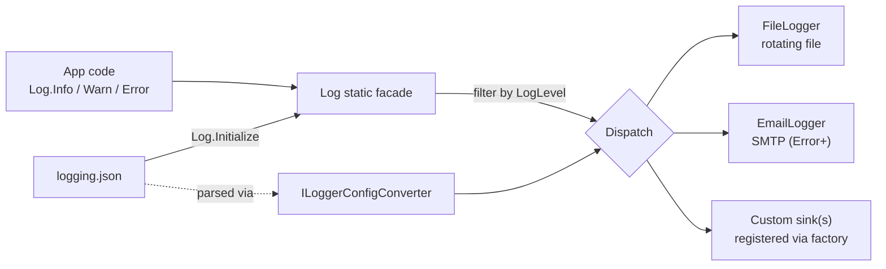

# FishMMO-Logger

`FishMMO-Logger` is a small, configurable, **JSON-driven logging library** used by
every headless FishMMO server (LoginServer, WorldServer, SceneServer, WebServers,
DiscordBot, AppHealthMonitor) and by the Unity client builds. It exposes a
static `Log` facade, a typed `LogLevel` enum, a structured `LogEntry`, and a
plug-in model for sinks (`ILogger` + `ILoggerConfig`). Two built-in sinks are
shipped — `File` (with rotation) and `Email` (via SMTP) — and you can register
additional sinks at runtime.

The library is **netstandard2.1**, has no dependency on Unity or EF Core, and
is safe to reference from any FishMMO project.

---

## Table of Contents

- [Description](#description)
- [Supported Platforms](#supported-platforms)
- [Architecture](#architecture)
- [Key Components](#key-components)
- [Configuration](#configuration)
  - [`logging.json` shape](#loggingjson-shape)
  - [File logger options](#file-logger-options)
  - [Email logger options](#email-logger-options)
- [Initialization Example](#initialization-example)
- [Extending — Adding a Custom Sink](#extending--adding-a-custom-sink)
- [Build](#build)
- [Flow Diagram](#flow-diagram)

---

## Description

The logger is intentionally small and synchronous-friendly. Application code
calls `Log.Info("Category", "message")` (or `Warn`, `Error`, `Critical`,
`Debug`, `Trace`); the call is dispatched to every configured sink that
satisfies the configured minimum level. `Log.Initialize(...)` reads a JSON
configuration file, parses it via a polymorphic `ILoggerConfigConverter`, and
instantiates each registered sink type.

The same library is used to centralize **email alerts on Error / Critical**
log lines from production servers, and to write rotating per-server log files
that the patcher service exposes to the operator dashboard.

---

## Supported Platforms

| Target | Status |
|---|---|
| .NET Standard 2.1 | Yes |
| .NET 8.0 servers | Yes (via netstandard2.1 multi-target) |
| Unity 6.3 LTS | Yes (referenced as a managed DLL in `Assets/Dependencies/`) |

| Dependency | Notes |
|---|---|
| `System.Text.Json` | Configuration parsing |
| `System.Net.Mail` (BCL) | Email sink |

---

## Architecture

```
FishMMO-Logger/
├── Log.cs                       # Static facade — Initialize, Info/Warn/Error/...
├── LogEntry.cs                  # Immutable struct: timestamp, level, category, message, exception
├── LogLevel.cs                  # Trace < Debug < Info < Warning < Error < Critical
├── LoggingConfig.cs             # Root config object loaded from logging.json
├── LoggingManagerConfig.cs      # Per-logger envelope (Type + Config)
├── ConsoleFormatter/            # ANSI / plain-text console formatting helpers
└── Logger/
    ├── ILogger.cs               # Sink contract:  Task LogAsync(LogEntry entry)
    ├── ILoggerConfig.cs         # Config contract per sink type
    ├── ILoggerConfigConverter.cs# System.Text.Json polymorphic converter
    └── Types/
        ├── File/                # FileLogger + FileLoggerConfig (rotation, append)
        └── Email/               # EmailLogger + EmailLoggerConfig (SMTP)
```

Application code only depends on `Log` and `LogLevel`. Everything else is
internal plumbing that lets the JSON configuration round-trip into concrete
sink instances at startup.

---

## Key Components

| Type | Responsibility |
|------|----------------|
| `Log` | Static facade. `Initialize(path)`, `RegisterLoggerFactory(name, factory)`, `Info/Warn/Error/Debug/Trace/Critical(category, message [, exception])`, `Shutdown()`. |
| `LogEntry` | Structured payload passed to each sink — timestamp, level, category, message, optional `Exception`. |
| `LogLevel` | Ordered enum used for filter comparisons. |
| `LoggingConfig` | Root config object (`LogLevel` + `Loggers[]`). |
| `LoggingManagerConfig` | Polymorphic envelope `{ "Type": "File", "Config": { ... } }` parsed by `ILoggerConfigConverter`. |
| `ILogger` | Sink contract — `Task LogAsync(LogEntry entry)`. |
| `ILoggerConfig` | Sink-config contract — discovered by reflection / explicit registration. |
| `ConsoleFormatter` | Optional helper that formats `LogEntry` with ANSI colors for terminal output. |
| `Logger/Types/File/FileLogger` | Append-or-truncate file sink with byte-size based rotation. |
| `Logger/Types/Email/EmailLogger` | SMTP sink (typically filtered to `Error` / `Critical`). |

---

## Configuration

The logger is driven by a single JSON file (canonically `logging.json`) loaded
via `Log.Initialize("logging.json")` at process start. The file binds to
`LoggingConfig`.

### `logging.json` shape

```json
{
  "LogLevel": "Info",
  "Loggers": [
    {
      "Type": "File",
      "Config": {
        "FilePath": "logs/app.log",
        "Append": true,
        "MaxFileSizeMB": 10
      }
    },
    {
      "Type": "Email",
      "Config": {
        "MinimumLevel": "Error",
        "SmtpServer": "smtp.example.com",
        "Port": 587,
        "EnableSsl": true,
        "Username": "alerts@example.com",
        "Password": "********",
        "From": "alerts@example.com",
        "To": "ops@example.com",
        "Subject": "FishMMO Log Alert"
      }
    }
  ]
}
```

| Field | Description |
|---|---|
| `LogLevel` | Global minimum level. Sinks may raise it further. |
| `Loggers` | Array of `{ Type, Config }` pairs. `Type` must match a registered factory (built-in: `File`, `Email`). |

### File logger options

| Field | Description |
|---|---|
| `FilePath` | Path to the log file (created if missing). Relative to working directory. |
| `Append` | `true` to append; `false` to truncate on startup. |
| `MaxFileSizeMB` | Optional rotation threshold. Rolled file is renamed with a timestamp suffix. |

### Email logger options

| Field | Description |
|---|---|
| `MinimumLevel` | Per-sink override of the global level (recommended: `Error` or `Critical`). |
| `SmtpServer` | SMTP host. |
| `Port` | SMTP port. |
| `EnableSsl` | `true` for TLS. |
| `Username` / `Password` | SMTP credentials. **Treat as secret.** |
| `From` / `To` | Envelope addresses. |
| `Subject` | Subject prefix used for every alert. |

> **Security note:** keep `logging.json` out of source control if it contains
> SMTP credentials, or load credentials from environment variables in a custom
> sink wrapper.

---

## Initialization Example

```csharp
using FishMMO.Logging;
using System.Threading.Tasks;

class Program
{
    static async Task Main()
    {
        // Optional: register a custom sink type before initialization.
        Log.RegisterLoggerFactory(
            "MyCustomLoggerConfig",
            (cfg, logCallback) => new MyCustomLogger((MyCustomLoggerConfig)cfg, logCallback));

        await Log.Initialize("logging.json");

        await Log.Info("Bootstrap", "Application started.");
        try
        {
            // ... your code ...
        }
        catch (System.Exception ex)
        {
            await Log.Critical("Bootstrap", "Unhandled exception", ex);
            throw;
        }
        finally
        {
            await Log.Shutdown();
        }
    }
}
```

---

## Extending — Adding a Custom Sink

1. Implement `ILoggerConfig` with the fields you need.
2. Implement `ILogger` and accept your config in its constructor:
   ```csharp
   public sealed class MyCustomLogger : ILogger
   {
       public MyCustomLogger(MyCustomLoggerConfig cfg, Action<string> logCallback) { ... }
       public Task LogAsync(LogEntry entry) { ... }
   }
   ```
3. Register a factory **before** `Log.Initialize`:
   ```csharp
   Log.RegisterLoggerFactory("MyCustomLoggerConfig",
       (cfg, cb) => new MyCustomLogger((MyCustomLoggerConfig)cfg, cb));
   ```
4. Reference it from `logging.json`:
   ```json
   { "Type": "MyCustom", "Config": { ... } }
   ```

---

## Build

```bash
dotnet build FishMMO-Logger.sln -c Release
```

The output `FishMMO-Logger.dll` is consumed by the other server projects via
`ProjectReference`, and copied into the Unity dependencies folder for use by
the Unity client and headless server builds.

---

## Flow Diagram


