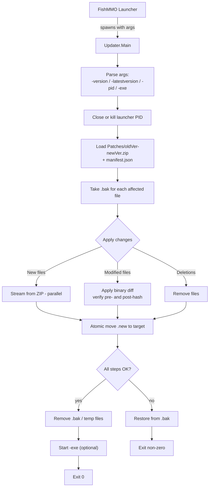

# FishMMO Updater

The FishMMO Updater is a **standalone .NET 8 console executable** that brings a
FishMMO client up-to-date by applying versioned binary patches. It is launched
by the FishMMO launcher when an update is required, takes ownership of the
update transaction, optionally restarts the client when finished, and exits.

The updater is transactional: every file is processed with a backup, and any
critical failure triggers a rollback to the pre-patch state.

> **Build & ship together with patches.** Always include `Updater.exe`
> (or the platform equivalent) in your release, but generate patches **before**
> packaging so the launcher has something to apply.

---

## Table of Contents

- [Description](#description)
- [Supported Platforms](#supported-platforms)
- [Architecture](#architecture)
- [Key Components](#key-components)
- [Patch File Structure](#patch-file-structure)
- [Configuration](#configuration)
- [Command-Line Arguments](#command-line-arguments)
- [Usage Example](#usage-example)
- [Logging](#logging)
- [Build](#build)
- [Flow Diagram](#flow-diagram)

---

## Description

The updater applies one or more sequential patches (e.g. `1.0.0 → 1.0.1
→ 1.1.0`) by reading a ZIP archive per version step. Each archive contains:

- A `manifest.json` describing the per-file operations (**new**, **modified**,
  **deleted**) including the source hash, the target hash, and (for modified
  files) a binary diff payload.
- The raw bytes / diff payloads referenced by the manifest.

For modified files the updater verifies the **pre-patch hash** against the
file on disk, applies the binary diff, and verifies the **post-patch hash**
before swapping the file into place.

---

## Supported Platforms

| Target | Status |
|---|---|
| .NET 8.0 — Windows | Yes |
| .NET 8.0 — Linux  | Yes |
| .NET 8.0 — macOS  | Yes |

The updater is designed to be called by the FishMMO launcher, but it also runs
standalone for manual updates and for CI validation.

---

## Architecture

```
FishMMO-Patcher/Updater/
├── Program.cs           # Entry point: argument parsing, orchestration, restart
├── Patch/               # Patch loading, manifest model, hash + diff utilities
├── Updater.csproj
└── Updater.sln
```

Patching is performed in a single pass with these phases:

1. **Argument parsing** — current version, target version, launcher PID, exe to restart.
2. **Launcher shutdown** — graceful close, fall back to kill.
3. **Patch application** — per-version archive, parallel new/modified file handling, sequential deletes.
4. **Move-into-place** — temporary `.new` files are atomically moved over the originals.
5. **Rollback** — on any unrecoverable error, restore every backup taken in this run.
6. **Cleanup** — remove temporary files and backups.
7. **Restart** — optionally start the configured executable, then exit.

---

## Key Components

| Component | Responsibility |
|---|---|
| `Program.Main` | Argument parsing, top-level try/catch, exit code policy. |
| Launcher control | Locates the launcher process by PID and shuts it down (graceful → forceful). |
| `Patch/` manifest reader | Loads `manifest.json` out of the patch ZIP. |
| New-file writer | Streams new files from the ZIP into the target tree (parallelized). |
| Binary diff applier | Applies binary diffs to existing files, with hash verification on both sides. |
| Deletion handler | Removes files marked for deletion in the manifest. |
| Backup / rollback | Per-file `.bak` taken before any write; replayed in reverse on failure. |
| Restart hook | Optionally starts the client executable post-patch. |

---

## Patch File Structure

Patch archives are ZIP files inside the `Patches/` directory next to the
updater executable. Naming convention:

```
Patches/<oldVersion>-<newVersion>.zip
```

Archive contents:

| Entry | Purpose |
|---|---|
| `manifest.json` | Describes `New`, `Modified`, `Deleted` operations with hashes and (for modified) diff entry names. |
| File payloads | Raw bytes for new files. |
| Diff payloads | Binary diff payloads for modified files. |

---

## Configuration

The updater has no external configuration file — behavior is controlled by
command-line arguments and a small set of internal defaults that can be
overridden by editing the source.

| Internal option | Default | Description |
|---|---|---|
| `MaxFileOperationRetries` | `5` | Retry count for transient file I/O errors. |
| `FileOperationRetryDelayMs` | `200` | Delay between retries. |
| `PatchesDirectory` | `Patches` | Directory (relative to working dir) holding patch ZIPs. |

---

## Command-Line Arguments

| Argument | Required | Description |
|---|---|---|
| `-version=<currentVersion>` | Yes | The version currently installed. |
| `-latestversion=<latestVersion>` | Yes | The target version to upgrade to. |
| `-pid=<launcherPID>` | Yes | Process ID of the launcher; updater will close/kill it before patching. |
| `-exe=<executablePath>` | Optional | Relative path to the client executable to start after a successful patch. |

If the chain `currentVersion → latestVersion` requires multiple patch archives,
the updater locates and applies each step in order, only proceeding to the next
when the previous step has been verified and moved into place.

---

## Usage Example

```bash
# Linux
./Updater -version=1.0.0 -latestversion=1.1.0 -pid=1234 -exe=FishMMOClient

# Windows
Updater.exe -version=1.0.0 -latestversion=1.1.0 -pid=1234 -exe=FishMMOClient.exe
```

This call:

1. Waits for / kills launcher PID `1234`.
2. Looks for `Patches/1.0.0-1.0.x.zip`, …, ending at `…-1.1.0.zip`.
3. Applies them transactionally.
4. On success, starts `FishMMOClient(.exe)` and exits with code `0`.
5. On failure, rolls back and exits with a non-zero code; the launcher should
   detect this and surface the error to the user.

---

## Logging

All actions, warnings, and errors are written to the console. The launcher is
expected to capture stdout/stderr and surface a user-facing summary. Log lines
include: file path, operation (new/modified/deleted), pre- and post-hash,
retry counts, and rollback decisions.

---

## Build

```bash
dotnet build Updater.sln -c Release
# Or publish a self-contained single-file binary for shipping:
dotnet publish Updater/Updater.csproj -c Release -r linux-x64 --self-contained true -p:PublishSingleFile=true
dotnet publish Updater/Updater.csproj -c Release -r win-x64   --self-contained true -p:PublishSingleFile=true
```

Ship the resulting binary alongside the launcher, plus the `Patches/` directory
populated by the patch generator.

---

## Flow Diagram


