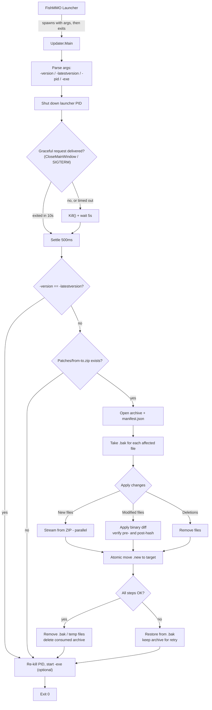

# FishMMO Updater

The FishMMO Updater is a **standalone .NET 8 console executable** that brings a
FishMMO client up-to-date by applying versioned binary patches. It is launched
by the FishMMO launcher when an update is required, takes ownership of the
update transaction, optionally restarts the client when finished, and exits.

The updater is transactional: every file is processed with a backup, and any
critical failure triggers a rollback to the pre-patch state.

> **Build & ship together with patches.** Always include `Updater.exe`
> (or the platform equivalent) in your release, but generate patches **before**
> packaging so the launcher has something to apply.

---

## Table of Contents

- [Description](#description)
- [Supported Platforms](#supported-platforms)
- [Architecture](#architecture)
- [Key Components](#key-components)
- [Patch File Structure](#patch-file-structure)
- [Configuration](#configuration)
- [Command-Line Arguments](#command-line-arguments)
- [Usage Example](#usage-example)
- [Logging](#logging)
- [Build](#build)
- [Flow Diagram](#flow-diagram)

---

## Description

The updater applies **one** patch archive per run: the single file that upgrades
directly from `-version` to `-latestversion` (`Patches/<from>-<to>.zip`). It does
not chain intermediate steps — the patch server indexes and serves a direct
archive for each supported source version, and if no such archive exists the
update cannot proceed (the launcher surfaces this as `PatchUnavailable` and asks
the player to reinstall). The archive contains:

- A `manifest.json` describing the per-file operations (**new**, **modified**,
  **deleted**) including the source hash, the target hash, and (for modified
  files) a binary diff payload.
- The raw bytes / diff payloads referenced by the manifest.

For modified files the updater verifies the **pre-patch hash** against the
file on disk, applies the binary diff, and verifies the **post-patch hash**
before swapping the file into place.

---

## Supported Platforms

| Target | Status |
|---|---|
| .NET 8.0 — Windows | Yes |
| .NET 8.0 — Linux  | Yes |
| .NET 8.0 — macOS  | Yes |

The updater is designed to be called by the FishMMO launcher, but it also runs
standalone for manual updates and for CI validation.

---

## Architecture

```
FishMMO-Patcher/Updater/
├── Program.cs           # Entry point: argument parsing, orchestration, restart
├── Patch/               # Patch loading, manifest model, hash + diff utilities
├── Updater.csproj
└── Updater.sln
```

Patching is performed in a single pass with these phases:

1. **Argument parsing** — current version, target version, launcher PID, exe to restart.
2. **Launcher shutdown** — graceful request, fall back to a forced kill (see below).
3. **Patch application** — one archive, parallel new/modified file handling, sequential deletes.
4. **Move-into-place** — temporary `.new` files are atomically moved over the originals.
5. **Rollback** — on any unrecoverable error, restore every backup taken in this run.
6. **Cleanup** — remove temporary files and backups; on success, delete the consumed archive.
7. **Restart** — kill the PID again as a safety net, optionally start the configured executable, then exit.

### Shutting the client down

Patching a live install corrupts it, so the client must be gone before any file
is touched. The request is platform-specific:

| Platform | Graceful request | Fallback |
|---|---|---|
| Windows | `Process.CloseMainWindow()` | `Process.Kill()` |
| Linux / macOS | `kill(pid, SIGTERM)` via P/Invoke to `libc` | `Process.Kill()` (SIGKILL) |

`CloseMainWindow` is Windows-only and throws `PlatformNotSupportedException`
elsewhere, so it cannot be the single path. Every route where the graceful
request is refused, undeliverable, or ignored past the timeout falls through to
the forced kill — an ungraceful client shutdown is far cheaper than patching
files underneath a running process.

### Failure semantics

`ApplyPatchFile` reports success or failure, and the two outcomes differ in what
is left on disk:

| Outcome | Install state | `Patches/<from>-<to>.zip` |
|---|---|---|
| Applied | Upgraded to `-latestversion` | Deleted, so `Patches/` does not accumulate every update ever installed |
| Rolled back | Still on the **old** version | Kept, so a retry does not have to re-download it |

The updater always terminates with exit code `0` and always attempts to restart
`-exe`, on both outcomes. Success is reported on the console, not through the
exit code, and the launcher does not read it — the updater kills the launcher
before patching, so there is no launcher left to observe the result. After a
failed apply the restarted client is still on the old version and its next
version check re-enters the update flow.

---

## Key Components

| Component | Responsibility |
|---|---|
| `Program.Main` | Argument parsing, orchestration, restart handoff. |
| `KillLauncherProcess` | Locates the launcher process by PID and shuts it down (graceful → forceful). |
| `TryRequestGracefulExit` | Platform-appropriate graceful shutdown request: `CloseMainWindow` on Windows, `kill(SIGTERM)` on POSIX. |
| `Patch/` manifest reader | Loads `manifest.json` out of the patch ZIP. |
| New-file writer | Streams new files from the ZIP into the target tree (parallelized). |
| Binary diff applier | Applies binary diffs to existing files, with hash verification on both sides. |
| Deletion handler | Removes files marked for deletion in the manifest. |
| Backup / rollback | Per-file `.bak` taken before any write; replayed in reverse on failure. |
| Restart hook | Optionally starts the client executable post-patch. |

---

## Patch File Structure

Patch archives are ZIP files inside the `Patches/` directory next to the
updater executable. Naming convention:

```
Patches/<oldVersion>-<newVersion>.zip
```

> **Three-way contract.** This directory name and file-name scheme are shared by
> three independently built components and must be changed in all three at once:
>
> | Component | Resolves it as |
> |---|---|
> | Unity client (launcher, downloads here) | `Constants.GetPatchesDirectory()` / `Constants.GetPatchFileName(from, to)` |
> | Updater (reads here) | `AppDomain.CurrentDomain.BaseDirectory` + `Patches`, hard-coded — it cannot reference the Unity assembly |
> | Patcher web server (indexes and serves) | `Patches:DirectoryName` in `appsettings.json` + the index regex |
>
> Both client processes run from the install root, so the first two agree. If
> they ever diverge, every update silently no-ops: the launcher downloads to one
> place, the updater finds nothing at the other, and the client relaunches at the
> same version forever.

Archive contents:

| Entry | Purpose |
|---|---|
| `manifest.json` | Describes `New`, `Modified`, `Deleted` operations with hashes and (for modified) diff entry names. |
| File payloads | Raw bytes for new files. |
| Diff payloads | Binary diff payloads for modified files. |

---

## Configuration

The updater has no external configuration file — behavior is controlled by
command-line arguments and a small set of internal defaults that can be
overridden by editing the source.

| Internal option | Default | Description |
|---|---|---|
| `MaxFileOperationRetries` | `5` | Retry count for transient file I/O errors. |
| `FileOperationRetryDelayMs` | `200` | Delay between retries. |
| `PatchesDirectory` | `Patches` | Directory (relative to the updater's base directory) holding patch ZIPs. Overridable at runtime with `-patches=`. |
| `GracefulExitTimeoutMs` | `10000` | How long to wait for the client to exit after the graceful request before forcing a kill. |
| `ForceKillTimeoutMs` | `5000` | How long to wait for the process to disappear after `Kill()`. |
| `PostKillSettleMs` | `500` | Settle delay after shutdown, so the OS releases file handles before patching. |

---

## Command-Line Arguments

| Argument | Required | Description |
|---|---|---|
| `-version=<currentVersion>` | Yes | The version currently installed. |
| `-latestversion=<latestVersion>` | Yes | The target version to upgrade to. |
| `-pid=<launcherPID>` | Yes | Process ID of the launcher; updater will close/kill it before patching. |
| `-exe=<executablePath>` | Optional | Path to the client executable to start when the updater is done, relative to the updater's base directory. |
| `-patches=<absoluteDir>` | Optional | Directory to read patch archives from. Defaults to `Patches` under the updater's base directory. |

Arguments are matched by prefix, so `-version` also matches `-versionfoo`; pass
them exactly as listed. If `-version` and `-latestversion` are equal the updater
does nothing but restart `-exe`. If the single archive `<version>-<latestversion>.zip`
is missing from the patches directory, it reports the missing file and restarts the
client unchanged.

`-patches` must be **absolute**. A relative path resolves against whatever the current
directory happens to be, which is not guaranteed to be the install root when the updater
is started by the OS rather than by the launcher — so the same string could name two
different folders. A path that is relative, missing, or unreadable is ignored with a
warning and the default is used; the launcher applies the identical rule to its own
setting, so both sides fall back together rather than to different places.

This argument only changes where a **verified** archive is read from. The launcher hashes
the download against the server-supplied SHA-256 before the updater is invoked at all, and
anyone able to write the launcher's configuration file could equally drop a file into the
default location — so redirecting it does not weaken the integrity check.

**It does not relocate the install.** The updater patches files relative to its own
directory and ships beside the client binaries, so the install root is fixed by
construction; moving an install means moving the updater with it.

---

## Usage Example

```bash
# Linux
./Updater -version=1.0.0 -latestversion=1.1.0 -pid=1234 -exe=FishMMOClient

# Windows
Updater.exe -version=1.0.0 -latestversion=1.1.0 -pid=1234 -exe=FishMMOClient.exe
```

This call:

1. Shuts down launcher PID `1234` — graceful request first, forced kill if it
   does not exit in time.
2. Looks for exactly `Patches/1.0.0-1.1.0.zip`.
3. Applies it transactionally.
4. On success, deletes the archive; on failure, rolls back and keeps it.
5. Starts `FishMMOClient(.exe)` either way and exits with code `0`.

---

## Logging

All actions, warnings, and errors are written to the console. Log lines include:
file path, operation (new/modified/deleted), pre- and post-hash, retry counts,
and rollback decisions.

The launcher does **not** capture this output. It hands off and shuts down (the
updater kills it by PID regardless), so the console is the operator's and the
player's only view of what happened. Run the updater from a terminal when
diagnosing a failed update.

---

## Build

```bash
dotnet build Updater.sln -c Release
# Or publish a self-contained single-file binary for shipping:
dotnet publish Updater/Updater.csproj -c Release -r linux-x64 --self-contained true -p:PublishSingleFile=true
dotnet publish Updater/Updater.csproj -c Release -r win-x64   --self-contained true -p:PublishSingleFile=true
```

Ship the resulting binary alongside the launcher, plus the `Patches/` directory
populated by the patch generator.

---

## Flow Diagram



> Both outcomes converge on the same exit. The updater never signals failure
> through its exit code — see [Failure semantics](#failure-semantics).
