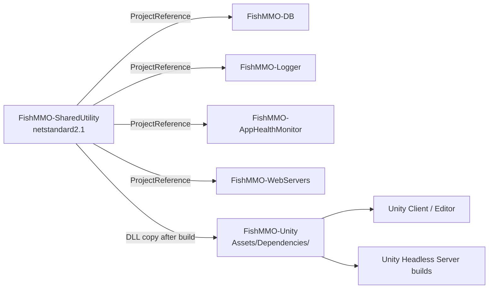

# FishMMO-SharedUtility

A lightweight, **pure C# / netstandard2.1** class library containing cross-cutting
utility code shared between the FishMMO Unity client and the FishMMO-Database
server project. The library has no dependency on `UnityEngine`, FishNet, or EF
Core, which lets it be referenced from both Unity and headless .NET tooling.

The post-build target copies `FishMMO-SharedUtility.dll` into
`../FishMMO-Unity/Assets/Dependencies/` so Unity picks it up automatically as a
managed plugin.

---

## Table of Contents

- [Description](#description)
- [Supported Platforms](#supported-platforms)
- [Architecture](#architecture)
- [Key Components](#key-components)
  - [Top-level utilities](#top-level-utilities)
  - [Compression](#compression)
  - [Extensions](#extensions)
- [What Belongs Here](#what-belongs-here)
- [Configuration](#configuration)
- [Build](#build)
- [Consuming from FishMMO-DB](#consuming-from-fishmmo-db)
- [Flow Diagram](#flow-diagram)

---

## Description

`FishMMO-SharedUtility` is the lowest layer of the FishMMO C# stack. It is the
only assembly that is safe to reference from every other C# project in the
monorepo, including FishMMO-DB, FishMMO-AppHealthMonitor, the WebServers, and
the Unity managed scripts. Its scope is intentionally narrow:

- Pure-data validators (e.g. SRP-6a-friendly password and username rules).
- Generic, allocation-aware data structures (`CircularBuffer<T>`, `SetOnce<T>`).
- Math and bit utilities that aren't already in BCL.
- String / dictionary compression that wraps `System.IO.Compression`.
- A large set of primitive and collection extensions used throughout the codebase.

---

## Supported Platforms

| Target | Status |
|---|---|
| .NET Standard 2.1 | Yes |
| Unity 6.3 LTS (IL2CPP / Mono) | Yes (via `Assets/Dependencies/`) |
| .NET 8.0 server projects | Yes |

| Requirement | Version |
|---|---|
| .NET SDK | 8.0+ |
| Language Version | `latest` |
| Nullable Reference Types | Enabled |
| `ZString` | `2.6.0` |

---

## Architecture

```
FishMMO-SharedUtility/
├── Authentication.cs          # Username/password validators
├── CircularBuffer.cs          # Allocation-light ring buffer
├── Configuration.cs           # Flat key/value store with typed accessors + file I/O
├── FastActivator.cs           # Expression-tree compiled object factory
├── MathHelper.cs              # Vector/scalar/clamp helpers
├── IReference.cs              # Reference-equality interface contract
├── RefWrapper.cs              # Boxed reference wrapper for value types
├── SetOnce.cs                 # Write-once latch (no validator)
├── Compression/
│   ├── StringCompression.cs   # GZip-based string round-trip
│   └── DictionaryCompression.cs
└── Extensions/
    ├── ArrayExtensions.cs
    ├── DirectoryExtensions.cs
    ├── EnumExtensions.cs
    ├── IListExtensions.cs
    ├── ProcessExtensions.cs
    ├── RandomExtensions.cs
    ├── StringExtensions.cs
    ├── TypeExtensions.cs
    └── Primitive/             # Byte, Short, Int, Long, Float bit helpers
```

All public types live in the `FishMMO.Shared` namespace.

---

## Key Components

### Top-level utilities

| Type | Responsibility |
|------|----------------|
| `Authentication` | Static validators for usernames, passwords, character names — the same rules used by the LoginServer and account-creation flows. |
| `CircularBuffer<T>` | Circular doubly-linked list — an unbounded, thread-safe container for reference types. |
| `Configuration` | Thread-safe flat key/value store (`Dictionary<string, string>` behind a `ReaderWriterLockSlim`, keys case-insensitive) with typed accessors, `key=value` file I/O and environment-variable overrides. There is no node tree — an older description of this type said there was. |
| `FastActivator<TResult>` | Compiled-expression factory — faster than `Activator.CreateInstance` and avoids reflection per-call. |
| `MathHelper` | Numeric helpers (clamp, lerp, snapping). |
| `RefWrapper<T>` | Wraps a value type so reference-comparison works (used for parameter capture). |
| `SetOnce<T>` | Latch that allows exactly one assignment; throws thereafter (no validator parameter). |
| `IReference` | Marker interface for objects compared by reference. |

### Compression

| Type | Responsibility |
|------|----------------|
| `StringCompression` | GZip compress/decompress for arbitrary UTF-8 strings. |
| `DictionaryCompression` | Compresses dictionaries of strings using a shared dictionary frame. |

### Extensions

| Namespace | Highlights |
|---|---|
| `Extensions/*Extensions.cs` | `ArrayExtensions`, `IListExtensions` (binary search, swap, shuffle), `StringExtensions` (case-insensitive contains, hex), `TypeExtensions` (assignable-from cache), `RandomExtensions` (range pickers), `DirectoryExtensions`, `EnumExtensions`, `ProcessExtensions`. |
| `Extensions/Primitive/` | `ByteExtensions`, `ShortExtensions`, `IntExtensions`, `LongExtensions`, `FloatExtensions`, and their bit-twiddling helpers (`IntBitExtensions`, `LongBitExtensions`). |

---

## What Belongs Here

| Include | Do NOT Include |
|---|---|
| Validation helpers (Authentication, naming rules) | Anything that references `UnityEngine` |
| Pure math / string / collection utilities | Database / EF Core entities or services |
| Shared constants and enums | Networking code that depends on FishNet |
| Compression / allocation-free helpers | Logging — use FishMMO-Logger instead |

If a candidate utility imports `UnityEngine`, FishNet, or `Microsoft.EntityFrameworkCore`, it does **not** belong here.

---

## Configuration

None of its own — the library is dependency-injection-free and runtime-config-free. It *provides*
the `Configuration` type that the game and servers use for theirs; a few of its guarantees are
load-bearing enough to state here, because the client's whole settings system rests on them.

**Values are written and read with `CultureInfo.InvariantCulture`**, and `float`/`double` use the
round-trip (`"R"`) format so a stored value parses back to identical bits. `Set<T>` routes numeric
types through that path explicitly: a generic type parameter is invisible to overload resolution,
so a caller writing `Set(key, someFloat)` from inside another generic method reaches the generic
overload rather than the `float` one. This used to call `value.ToString()` — the *current* culture
— while every reader parsed invariantly, so on a comma-decimal locale `0.75f` was stored as
`"0,75"` and read back as **75**, the comma accepted as a digit-group separator.

**A value that is present but unreadable yields the caller's `defaultValue`**, not the type's
default. Every `TryGet*` returns `false` *and* assigns the supplied fallback; they previously left
`result` at `0`/`false`, so a truncated write or a hand edit meant zero rather than the documented
default. Float and double parse with `NumberStyles.Float`, which rejects digit-group separators
instead of absorbing them.

**File format.** One `key=value` per line, UTF-8 without BOM (a BOM is stripped on read), `#` and
`;` comments, split on the *first* `=` so values may contain more. Malformed lines are skipped with
a warning rather than aborting the load. `Remove` deletes a key outright — callers that want
"absent" should use it rather than storing an empty string.

**Environment overrides.** Any read prefers `FISHMMO_CONFIG_<KEY>` (uppercased, `.`/`:`/`-` → `_`)
over the stored value, so operators can supply secrets without committing them. Overrides are
deliberately **not** included in `GetKeys()`, which reports what the file holds.

---

## Build

```bash
dotnet build FishMMO-SharedUtility.slnx
```

The `CopyToUnityDependencies` MSBuild target copies the built DLL into
`../../FishMMO-Unity/Assets/Dependencies/` after every successful build (both
`Debug` and `Release`).

---

## Consuming from FishMMO-DB

FishMMO-DB references this project via a `<ProjectReference>`. No manual DLL
copying is needed for the database side.

```xml
<ProjectReference Include="../../FishMMO-SharedUtility/FishMMO-SharedUtility/FishMMO-SharedUtility.csproj" />
```

---

## Flow Diagram


