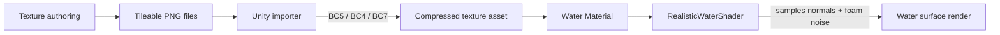

# FishMMO Water Textures

Conventions for the texture assets consumed by `RealisticWaterShader`. This
folder is intentionally empty by default — drop your own texture files in here
matching the names and formats below, then assign them on the Ocean / Lake /
Beach material presets in the parent folder.

## Table of Contents

- [Description](#fishmmo-water-textures)
- [Supported Platforms](#supported-platforms)
- [Architecture](#architecture)
- [Key Components](#key-components)
- [Configuration](#configuration)
- [Authoring Workflow](#authoring-workflow)
- [Performance Notes](#performance-notes)
- [Flow Diagram](#flow-diagram)

## Supported Platforms

| Platform | Notes |
| --- | --- |
| Windows / Linux / macOS | Full BC5/BC4/BC7 compression supported. |
| Android / iOS           | Prefer ASTC equivalents; reduce to 512x512 or 256x256. |
| WebGL                   | Use DXT/ETC2 fallbacks; keep textures ≤ 512x512. |

Requirements: Unity 6.3 LTS (URP) with the standard texture importer.

## Architecture

This folder is asset-only; it has no scripts. The shader samples up to five
textures:

```
Textures/
├── WaterNormal.png       (required)  Primary animated water normal
├── WaveNormal.png        (required)  Secondary normal (different direction)
├── FoamNoise.png         (required)  Grayscale foam mask noise
├── CausticPattern.png    (optional)  RGB caustic pattern for underwater light
└── FoamPattern.png       (optional)  Alpha-only foam shape mask
```

## Key Components

| File | Type | Resolution | Format | Purpose |
| --- | --- | --- | --- | --- |
| `WaterNormal.png`    | Normal map (tileable) | 512x512 or 1024x1024 | BC5 | Primary wave detail. |
| `WaveNormal.png`     | Normal map (tileable) | 512x512 or 1024x1024 | BC5 | Secondary layer, scrolled in a different direction for parallax. |
| `FoamNoise.png`      | Grayscale noise (tileable) | 256x256 or 512x512 | BC4 | Drives the foam mask. High contrast, seamless. |
| `CausticPattern.png` | RGB texture | 512x512 | BC1 / BC7 | Optional caustic lighting pattern for underwater bodies. |
| `FoamPattern.png`    | Alpha texture | 256x256 | BC4 | Optional sharp foam shapes. |

## Configuration

Importer settings to apply:

**Normal maps (`WaterNormal`, `WaveNormal`)**
```
Texture Type:        Normal map
sRGB:                Off
Filter Mode:         Trilinear
Wrap Mode:           Repeat
Generate Mip Maps:   On
Compression:         High Quality (BC5 on desktop)
```

**Data / noise textures (`FoamNoise`, `FoamPattern`)**
```
Texture Type:        Default
sRGB:                Off  (data textures)
Filter Mode:         Trilinear
Wrap Mode:           Repeat
Generate Mip Maps:   On
Compression:         BC4 (single channel)
```

**Color textures (`CausticPattern`)**
```
Texture Type:        Default
sRGB:                On
Filter Mode:         Trilinear
Wrap Mode:           Repeat
Compression:         BC1 or BC7
```

## Authoring Workflow

**Water / Wave normals**
1. Generate in Blender (Ocean modifier baked to normal), Substance Designer, or
   any tileable normal map generator.
2. Export 16-bit PNG, ensure tileable on all four edges.
3. Import into Unity with the normal-map settings above.

**Foam noise**
1. Photoshop Clouds filter (or any tileable noise) → high contrast → mild
   Gaussian blur.
2. Verify tileability with the offset filter.

**Caustics**
1. Render or download a tileable caustic loop, take a single representative
   frame, or animate via UV offset in the shader.

Acceptable third-party sources: Unity Asset Store, Substance Share, Quixel
Megascans (with subscription), hand-painted assets.

## Performance Notes

- Prefer compressed formats appropriate for the target platform.
- Enable mip maps; the shader uses them for distance-based detail reduction.
- For mobile / WebGL, halve the resolution and consider disabling the
  `WaveNormal` second layer in the material.
- Use texture streaming if many water bodies are visible simultaneously.

## Flow Diagram


