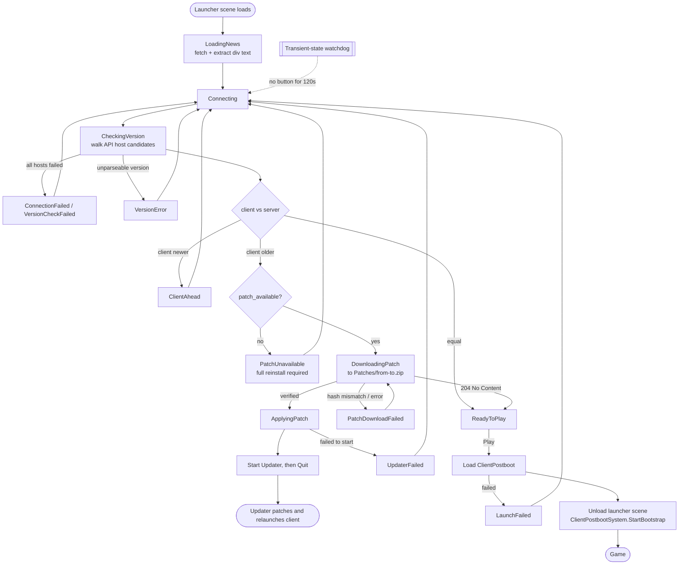

# Client Launcher

**Short description:** The launcher is the first window a standalone player sees. It renders news fetched over HTTP, resolves an API host, checks the installed version against the patch server, downloads and verifies a patch when one is needed, hands the install over to the external Updater, and — when the client is current — loads the game and gets out of the way.

## Table of Contents

- [Overview](#overview)
- [Supported Platforms](#supported-platforms)
- [Features](#features)
- [Prerequisites](#prerequisites)
- [Configuration](#configuration)
- [State Machine](#state-machine)
- [The Update Path](#the-update-path)
- [Handoff to the Game](#handoff-to-the-game)
- [API Host Resolution and Request Signing](#api-host-resolution-and-request-signing)
- [Operational Checks](#operational-checks)
- [Flow Diagram](#flow-diagram)
- [Project Structure](#project-structure)
- [License](#license)

## Overview

`ClientLauncher` is a plain `MonoBehaviour` living in the `ClientLauncher` Addressable scene. It is deliberately **not** a `BootstrapSystem`: it is a terminal stage that hands control onward explicitly rather than being auto-discovered and chained. See the [Bootstrap README](../../Shared/Implementation/Bootstrap/README.md) for where it sits in the boot order.

The launcher only exists on standalone builds. `ClientPreboot`'s postload scene list routes Editor and WebGL straight to `ClientPostboot`, skipping the launcher entirely — neither can run an external updater process, so there is nothing for it to do.

Everything it does over the network goes through an injected service so the flow can be tested and swapped:

| Dependency | Interface | Default implementation |
|---|---|---|
| Web requests | — | `UnityWebRequestService` |
| News HTML | `IHtmlContentFetcher` | `UnityHtmlContentFetcher` |
| Version + patch download | `IPatchServerService` | `HttpPatchServerService` |
| Updater process | `IUpdaterLauncher` | `SystemUpdaterLauncher` |

## Supported Platforms

| Platform | Launcher runs | Notes |
|---|---|---|
| Windows | Yes | Full news → version check → patch → play flow |
| Linux | Yes | Full flow |
| macOS | Yes | Full flow |
| Editor | **No** | `ClientPreboot` postloads `ClientPostboot` directly |
| WebGL | **No** | No external updater in the browser sandbox; an outdated build reports "refresh the page" instead |

## Features

- **Explicit UI state machine** — one `LauncherState` drives the button label, its interactability, its click action, and progress-bar visibility, all from a single `SetLauncherState` switch. Every failure state is recoverable: the button is re-enabled and wired to a retry action that can actually succeed.
- **Multi-host API failover** — `ApiHostResolver.GetCandidates()` returns an ordered candidate list; the version check walks it until one responds, and the subsequent patch download is pinned to the host that answered so the archive matches the version we were told about.
- **Patch integrity verification** — the server reports the expected SHA-256 and byte size up front; the downloaded archive is hashed and rejected on mismatch.
- **Unreachable-update detection** — the server states whether it holds a patch *from this specific version*, so a client with no upgrade path lands in `PatchUnavailable` (reinstall required) rather than looping forever on a request that can only 404.
- **Transient-state watchdog** — any state with no interactive button is forced back to a recoverable one after `transientStateTimeoutSeconds`. Download progress resets the timer, so a slow patch is never interrupted. This is a catch-all for a coroutine that dies (Unity logs the exception and silently stops it), not a substitute for per-operation error handling.
- **Re-entrancy interlocks** — `isConnecting`, `isLaunching`, and `isUpdating` guard the three entry points. The button state alone is insufficient, because the update flow is also entered directly from the version check.
- **Signed requests** — every call carries an `X-FishMMO-Client` HMAC header via `ClientApiSigner`, which the IPFetch and Patcher servers' `ClientGate` middleware validates.

## Prerequisites

- The `ClientLauncher` scene, with `ClientLauncher` and its four service components wired in the Inspector. A missing dependency is reported at `Awake` and the launcher refuses to run rather than null-referencing mid-flow.
- `Constants.Configuration.APIHost` and `LauncherHtmlUrl`, both baked at build time from `GeneratedHostConfig` (CI substitutes them from `FISHMMO_ROOT_DOMAIN`).
- `ClientApiSecret.generated.cs`, produced by **FishMMO Dashboard > Game Settings**. A build still carrying the sentinel value will be rejected by `ClientGate`.
- The Updater executable present at the install root (`Constants.Configuration.UpdaterExecutable`).

## Configuration

### Inspector

| Property | Type | Default | Purpose |
|---|---|---|---|
| `htmlViewURL` | `string` | `""` | Per-scene override for the news URL. **Leave empty.** |
| `divClass` | `string` | — | CSS class of the `div` whose text is extracted from the fetched page |
| `defaultScreenWidth` / `defaultScreenHeight` | `int` | — | Window size applied on launch |
| `transientStateTimeoutSeconds` | `float` | `120` | Watchdog timeout for states with no interactive button |

> **Why `htmlViewURL` defaults to empty.** A non-empty default gets baked into the scene the first time it is saved, and the serialized copy then silently wins over the build-time configured value for every subsequent build — which is exactly how a stale hard-coded URL once shipped. Resolution happens at read time instead: `HtmlViewURL` falls back to `Constants.Configuration.LauncherHtmlUrl` whenever the override is blank.

### UI text

All player-facing strings are constants on the nested `UIText` class — status labels (`StatusPatchUnavailable`, `StatusServerRejectedVersion`, …), long-form explanations (`DetailPatchUnavailable`, `DetailApplyingPatch`, …), and log format strings. Change copy there, not at the call sites.

## State Machine

| State | Button | Click action | Meaning |
|---|---|---|---|
| `LoadingNews` | disabled | — | Fetching the news page |
| `Connecting` | disabled | — | Contacting the API host |
| `CheckingVersion` | disabled | — | Comparing installed version to the server's |
| `DownloadingPatch` | disabled | — | Progress bar visible; heartbeats the watchdog |
| `ApplyingPatch` | disabled | — | Updater has been handed the install |
| `ReadyToPlay` | **Play** | `PlayButtonLaunch` | Versions match |
| `ClientAhead` | enabled | `PlayButtonConnect` | Client is newer than the server — re-check, do **not** allow Play |
| `PatchUnavailable` | enabled | `PlayButtonConnect` | No upgrade path from this version; re-runs the version check rather than retrying an impossible download |
| `ServerRejectedVersion` | enabled | `PlayButtonConnect` | Reserved — see note below |
| `ConnectionFailed` | enabled | `PlayButtonConnect` | Retry |
| `VersionCheckFailed` | enabled | `PlayButtonConnect` | Retry |
| `PatchDownloadFailed` | enabled | `PlayButtonUpdate` | Retry the download |
| `UpdaterFailed` | enabled | `PlayButtonConnect` | Re-check, then retry the update |
| `LaunchFailed` | enabled | `PlayButtonConnect` | Back to the version check — a failing scene load is often fixed by re-patching |
| `VersionError` | enabled | `PlayButtonConnect` | Retry; version parse failures can be transient after a partial patch |

> `ServerRejectedVersion` is defined and wired into the state machine but not currently reachable. Version rejection is presently handled during the authentication handshake (`ClientAuthenticationResult.VersionMismatch`) and rendered through a separate UI path. The state exists for a future version-check endpoint that rejects a client outright without offering a patch.

## The Update Path

`GetLatestVersion()` walks the API host candidates, then compares versions:

- **client == server** → `ReadyToPlay`.
- **client > server** → `ClientAhead`. Play stays blocked.
- **client < server** → if `PatchInfo.PatchAvailable` is false, `PatchUnavailable`; otherwise `PlayButtonUpdate()` runs immediately.

`VersionConfig.Parse` returns `null` for malformed input rather than throwing, so both versions are null-checked explicitly. A null client version would otherwise compare as older than everything and start downloading a patch for a version the server has never heard of.

`PlayButtonUpdate()` then:

1. Computes the destination as `Constants.GetPatchesDirectory()` + `Constants.GetPatchFileName(currentVersion, latestVersion)` — i.e. `<install root>/Patches/<from>-<to>.zip`. **This path is a contract.** The Updater resolves the same location from its own base directory and looks nowhere else; if the archive is not exactly there it reports "patch file not found", relaunches the client unchanged, and the launcher detects the same mismatch on the next run. See the [Updater README](../../../../../FishMMO-Patcher/Updater/README.md).
2. Downloads from the pinned host, verifying the SHA-256 when the server supplied one.
3. If the server answers **204 No Content** mid-flight — the version we checked against was superseded, or we raced a deployment — no archive is written and the launcher goes straight to `ReadyToPlay` instead of invoking the Updater on a file that does not exist.
4. Otherwise enters `ApplyingPatch` and starts the Updater. The archive is deliberately **not** deleted here: the Updater is about to read it, and removes it itself once applied.
5. On successful handoff, quits promptly so the client binaries are released for patching. `LaunchUpdater` must not wait for the Updater to exit — the Updater kills this process by PID before patching, so waiting is a mutual deadlock.

A download error deletes the partial file best-effort and lands in `PatchDownloadFailed`.

## Handoff to the Game

`PlayButtonLaunch()` enqueues the `ClientPostboot` scene, waits on the returned `AddressableLoadBatch`, then in `OnPostbootSceneLoaded`:

1. Unloads the `ClientLauncher` scene.
2. Finds the `ClientPostbootSystem` among the loaded scene's roots and calls `StartBootstrap()` on it.

If `ClientPostboot` is already loaded — reachable when a previous launch failed — the launch completes directly instead of enqueueing a second load, which would otherwise dead-end.

## API Host Resolution and Request Signing

`ApiHostResolver` turns the configured `APIHost` into an ordered candidate list and exposes `SanitizeForLog` so hosts can be logged without leaking full URLs. Loopback targets are detected explicitly.

`ClientApiSigner` builds the gate header:

```
X-FishMMO-Client: v1.<timestamp>.<nonce>.<signature>
```

The signing secret lives in `GeneratedClientSecret.Secret` (`ClientApiSecret.generated.cs`). **It is not a credential.** It ships inside the client binary and is recoverable by anyone with the build; its job is to filter crawlers, port scanners, and blatant header forgery. Real authority comes from the SRP-derived session token issued by the auth server.

## Operational Checks

| Check | How to verify | Expected result |
|---|---|---|
| News renders | Launch a standalone build | News panel populated; on failure, a logged warning and the flow continues to the version check |
| Host failover | Point the first candidate at a dead host | Debug log per failed candidate, then success on the next |
| Up-to-date client | Launch at the server's version | Button reads **Play** |
| Patch applied | Launch an outdated client with a published patch | Download progress → `ApplyingPatch` → launcher exits → client restarts at the new version, and `Patches/` is empty afterwards |
| No upgrade path | Launch an outdated client the server has no patch for | `PatchUnavailable`, button re-runs the version check — never a repeating 404 |
| Corrupt download | Corrupt the served archive | Hash mismatch → `PatchDownloadFailed`, partial file removed |
| Watchdog | Force a transient state and stall it | After `transientStateTimeoutSeconds`, an error is logged and the UI returns to a usable button |
| Slow patch not interrupted | Throttle the download below the timeout | Progress heartbeats keep the watchdog from firing |

## Flow Diagram



## Project Structure

```
Client/Launcher/
├── ClientLauncher.cs            # MonoBehaviour: UI, state machine, orchestration
├── LauncherState.cs             # The 15 UI/process states
├── PatchInfo.cs                 # Server patch metadata: UpToDate, PatchAvailable, Sha256, Size
├── VersionFetch.cs              # Version response parsing
│
├── IPatchServerService.cs       # Contract: GetLatestVersion, DownloadPatch
├── HttpPatchServerService.cs    #   → HTTP implementation with SHA-256 verification
├── IHtmlContentFetcher.cs       # Contract: fetch a page, extract a div's text
├── UnityHtmlContentFetcher.cs   #   → UnityWebRequest implementation
├── IUpdaterLauncher.cs          # Contract: start the external updater and hand off
├── SystemUpdaterLauncher.cs     #   → Process.Start implementation
├── UnityWebRequestService.cs    # Shared UnityWebRequest wrapper
│
├── ApiHostResolver.cs           # Candidate host list, loopback detection, log sanitizing
├── ClientApiSigner.cs           # X-FishMMO-Client HMAC header
└── ClientApiSecret.cs           # Compiled-in gate secret (NOT a credential)
```

`ClientApiSecret.generated.cs` sits alongside these but is generated, not committed.

### Related

| Component | Relationship |
|---|---|
| [Bootstrap](../../Shared/Implementation/Bootstrap/README.md) | Loads the launcher scene; the launcher hands back to `ClientPostbootSystem` |
| [Updater](../../../../../FishMMO-Patcher/Updater/README.md) | Consumes the downloaded archive; shares the `Patches/` path contract |
| [Patcher server](../../../../../FishMMO-WebServers/PatcherASP.NET/README.md) | Serves `/latest_version` metadata and the patch archive |
| `Constants.Configuration` | `APIHost`, `LauncherHtmlUrl`, `UpdaterExecutable`, `PatchesDirectoryName` |

## License

This module is part of the FishMMO project and is distributed under the FishMMO project license.
