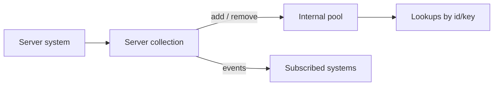

# Server Core Collections

**Short description:** Reusable, thread-safe queue/index tracker primitives and data structures used by FishMMO server systems to implement low-GC, bounded TTL cleanup and efficient capacity-based routing under heavy load.

## Table of Contents

- [Overview](#overview)
- [Supported Platforms](#supported-platforms)
- [Features](#features)
- [Prerequisites](#prerequisites)
- [Installation / Build](#installation--build)
- [Quick Start Guides](#quick-start-guides)
- [Configuration](#configuration)
- [Usage Examples](#usage-examples)
- [Operational Checks](#operational-checks)
- [Flow Diagram](#flow-diagram)
- [Project Structure](#project-structure)
- [License](#license)

## Overview

This module contains transport-agnostic collection primitives designed for high-throughput server scenarios. Each collection avoids full dictionary enumeration in hot-path maintenance loops and instead uses head-first linked-list sweeps bounded by configurable `maxScan` and `maxRemove` parameters. This keeps update-loop cleanup predictable even during large traffic spikes or attacks.

All tracker classes live in the `FishMMO.Server.Core.Collections` namespace and can be used from both the Core and Implementation server layers.

The five collections are:

| Class | Purpose |
|---|---|
| `ExpiringKeyTracker<TKey>` | Debounce / rate-limit windows keyed by `TKey` with bounded expiry sweeps. Takes "now" from the caller: a `DateTime`, or a `MonotonicClock.NowSeconds` reading through the `double` overloads. One tracker is driven by one clock |
| `LastSeenCacheTracker<TKey, TValue>` | Key-value cache where entries expire by inactivity (last-seen); reads extend lifetime. Like `ExpiringKeyTracker`, "now" is a `DateTime` or a `MonotonicClock.NowSeconds` reading through the `double` overloads (`MonotonicInstant` carries the reading); the authenticators' real-IP caches use the monotonic ones. One cache is driven by one clock |
| `TimedCache<TKey, TValue>` | Write-through TTL cache where entries expire after a fixed duration from storage; reads do **not** extend lifetime |
| `SingleFlightCache<TKey, TValue>` | Fixed-TTL cache of **asynchronous reads**: callers arriving while a read is in flight share it, a completed read is served until its TTL (counted from when it started), and a failed read is never cached |
| `InstanceCapacityHeap` | Max-heap of scene-instance handles ordered by remaining capacity for O(log N) routing |

`MonotonicInstant` (internal) is the helper behind the monotonic overloads: it carries a `MonotonicClock.NowSeconds` reading in a `DateTime`, so the two `DateTime`-backed trackers need no second implementation. The result is not a calendar instant and means nothing outside the tracker that stored it.

> **Note:** `ArrivalOrderTracker<TKey>` (oldest-first stale-entry processing for unauthenticated SRP/encryption sweeps) used to live here but has been moved to the engine-independent `FishMMO-ServerAuth.dll` library under `FishMMO.Auth.Core.Collections`. Server systems that need it should reference it from there.

## Supported Platforms

| Platform | Supported | Notes |
|---|---|---|
| Windows | Yes | Primary development platform |
| Linux | Yes | Primary deployment platform |
| WebGL | N/A | Server-only module — not applicable |

**Engine:** Unity 6.3 LTS
**Scripting Backend:** IL2CPP

## Features

- **Bounded sweep cleanup** — all TTL trackers (`ExpiringKeyTracker`, `LastSeenCacheTracker`, `TimedCache`) accept `maxScan` and `maxRemove` parameters to cap per-frame work.
- **Head-first linked-list traversal** — expired entries are processed from the oldest end of a `LinkedList`, avoiding full dictionary scans.
- **Thread-safe by default** — `ExpiringKeyTracker`, `LastSeenCacheTracker`, and `TimedCache` use `lock`-based synchronization around all public methods.
- **Stale-node detection** — when a key is refreshed (touched / re-set), the old queue node is detected as stale during the next sweep and skipped without incorrect removal.
- **O(log N) capacity routing** — `InstanceCapacityHeap` uses an array-backed binary max-heap so the instance with the most remaining capacity is always at the root.
- **Custom equality comparers** — all generic trackers accept an optional `IEqualityComparer<TKey>` at construction.
- **Zero-allocation inner types** — nested helper types (`ExpiryQueueNode`, `QueueNode`, `CacheEntry`, `CacheValue`) are `readonly struct` to avoid heap pressure.
- **Transport-agnostic** — no dependency on FishNet, networking, or Unity APIs; pure C# collections.

## Prerequisites

- Unity 6.3 LTS (or newer)
- FishMMO project (these classes are compiled as part of the server assemblies)
- No external NuGet packages or third-party dependencies required

## Installation / Build

This is an integrated module within the FishMMO project. The source files are compiled automatically as part of the server assembly when the Unity project is built. No separate installation steps are needed.

To include these collections in a new server system, add:

```csharp
using FishMMO.Server.Core.Collections;
```

## Quick Start Guides

### Debounce / Rate-Limit with ExpiringKeyTracker

```csharp
var tracker = new ExpiringKeyTracker<string>();

// Attempt to begin a 5-second debounce window for a key
bool allowed = tracker.TryBegin("someAccountId", DateTime.UtcNow, TimeSpan.FromSeconds(5));
// allowed == true on first call; false if called again within 5 seconds

// In your update loop, sweep expired entries (bounded work per frame)
int removed = tracker.SweepExpired(DateTime.UtcNow, maxScan: 64, maxRemove: 16);
```

### Last-Seen Cache with LastSeenCacheTracker

```csharp
var cache = new LastSeenCacheTracker<int, string>();

// Insert or update an entry
cache.Upsert(connectionId, ipAddress, DateTime.UtcNow);

// Retrieve and refresh the last-seen timestamp
if (cache.TryGetAndTouch(connectionId, DateTime.UtcNow, out string ip))
{
    // ip is valid; last-seen timestamp has been refreshed
}

// Sweep entries not seen within the last 60 seconds
int removed = cache.SweepExpired(DateTime.UtcNow, TimeSpan.FromSeconds(60), maxScan: 64, maxRemove: 16);
```

### Fixed-TTL Cache with TimedCache

```csharp
var cache = new TimedCache<string, List<SceneData>>();

// Store a value (stamped with MonotonicClock.NowSeconds internally — a TTL is a duration,
// so a stepped host clock must not keep entries alive or expire them all at once)
cache.Set("worldKey", sceneDataList);

// Retrieve only if stored within the last 30 seconds (reads do NOT extend lifetime)
if (cache.TryGet("worldKey", TimeSpan.FromSeconds(30), out var data))
{
    // data is still fresh
}

// Explicitly invalidate a single entry
cache.Invalidate("worldKey");

// Bounded sweep in an update loop (reads the same monotonic clock itself)
int removed = cache.SweepExpired(TimeSpan.FromSeconds(30), maxScan: 64, maxRemove: 16);
```

### Shared Asynchronous Reads with SingleFlightCache

```csharp
var pages = new SingleFlightCache<LeaderboardPageKey, LeaderboardPageData>();

// The first caller on a miss starts the read; everyone asking for the same key until the read
// finishes joins it, and everyone after that is served the value until the TTL runs out.
LeaderboardPageData page = await pages.GetOrFetchAsync(key, TimeSpan.FromSeconds(60), async () =>
{
    var result = await service.FetchPageAsync(key.Query, key.Offset, key.Limit);
    if (!result.IsSuccess)
    {
        throw new InvalidOperationException(result.ErrorMessage);   // shared by its callers, never cached
    }
    return result.Data;
});

// Bounded sweep in an update loop (completed entries older than the TTL)
int removed = pages.SweepExpired(TimeSpan.FromSeconds(60), maxScan: 512, maxRemove: 256);
```

Use it instead of `TimedCache` when many callers want the same value at once and reading it is the expensive part: `TimedCache` has no notion of a read in progress, so a miss sends every concurrent caller to the database.

### Oldest-First Tracking with ArrivalOrderTracker

> Moved to `FishMMO-ServerAuth.dll` under `FishMMO.Auth.Core.Collections`. Add `using FishMMO.Auth.Core.Collections;` and reference `FishMMO-ServerAuth.dll` from your assembly. First-seen times are monotonic seconds (a `double`), not `DateTime`: the account manager's backstop sweep ages entries by them, and a stepped wall clock aged every entry at once.

```csharp
var tracker = new ArrivalOrderTracker<NetworkConnection>();

// Track a new connection (no-op if already tracked); the time is a monotonic reading in seconds
tracker.TrackIfMissing(conn, MonotonicClock.NowSeconds);

// Peek at the oldest tracked entry
if (tracker.TryPeekOldest(out var key, out double firstSeenSeconds))
{
    // key is the oldest connection, firstSeenSeconds is when it was added
}

// Pop and remove the oldest entry
if (tracker.PopOldest(out var oldestKey, out double seenSeconds))
{
    // Process the oldest stale connection
}

// Remove a specific key (O(1))
tracker.Remove(conn);
```

### Capacity-Based Routing with InstanceCapacityHeap

```csharp
var heap = new InstanceCapacityHeap(capacity: 16);

// Push instances with their remaining player capacity
heap.Push(handle: 1, remainingCapacity: 50);
heap.Push(handle: 2, remainingCapacity: 30);

// Assign a player to the instance with the most remaining capacity
if (heap.TryAssignFromTop(out int assignedHandle))
{
    // assignedHandle == 1 (had 50 capacity, now 49 after assignment)
}
```

## Configuration

These collections are configured at construction time or per-call through method parameters. There are no external configuration files.

| Parameter | Where Used | Description |
|---|---|---|
| `IEqualityComparer<TKey>` | All generic tracker constructors | Optional custom equality comparer for keys |
| `maxScan` | `SweepExpired()` on `ExpiringKeyTracker`, `LastSeenCacheTracker`, `TimedCache` | Maximum queue nodes to inspect per sweep call |
| `maxRemove` | `SweepExpired()` on `ExpiringKeyTracker`, `LastSeenCacheTracker`, `TimedCache` | Maximum entries to remove per sweep call |
| `duration` | `ExpiringKeyTracker.TryBegin()` | Length of the debounce / rate-limit window |
| `ttl` | `LastSeenCacheTracker.SweepExpired()`, `TimedCache.TryGet()`, `TimedCache.SweepExpired()` | Time-to-live for cached entries |
| `capacity` | `InstanceCapacityHeap` constructor | Initial backing-array size (avoids resizing) |

## Usage Examples

### BaseServerAuthenticator

- `ExpiringKeyTracker<string>` / `ExpiringKeyTracker<int>` — handshake, token-revoke (per key and global) and token-mint rate limiters, all on the monotonic overloads.
- `LastSeenCacheTracker<int, string>` — connection-to-real-IP cache, refreshed while the connection is active (monotonic).
- `LastSeenCacheTracker<string, int>` — redeemed connection tokens, kept on the wall clock on purpose: it is replay protection for a token whose own expiry is a wall-clock time.

The kick, account and IP debounces of the SRP login path live in `SrpAuthenticatorCore`, which uses the `FishMMO-ServerAuth.dll` copies of these trackers.

### WorldSceneSystem

- `ExpiringKeyTracker<string>` — instance-lookup debounce to avoid redundant database queries.
- `TimedCache<string, IReadOnlyList<SceneData>>` — caches available scene-instance query results with a fixed TTL.
- `TimedCache<long, ushort>` — caches scene-server address lookups.
- `InstanceCapacityHeap` — orders a scene's instances by remaining capacity while a routing pass places players.

### SceneChannelSystem

- `TimedCache<string, IReadOnlyList<SceneData>>` — caches available scene-instance query results.
- `TimedCache<long, ushort>` — caches scene-server address lookups.

### ServerSelectSystem

- `SingleFlightCache<byte, WorldServerDetails[]>` — the world-server list, one shared read per `serverListCacheSeconds` (2 s by default) for every client asking; driven by the monotonic clock through the cache's clock seam.

### LeaderboardSystem

- `SingleFlightCache<LeaderboardPageKey, LeaderboardPageData>` — one entry per page of each board; every player viewing a page shares one database read per cache lifetime.
- `SingleFlightCache<LeaderboardStandingKey, LeaderboardStandingData>` — a player's own rank on a board, read only when they are not on the page they are viewing.

### AccountManager

- `ArrivalOrderTracker<NetworkConnection>` *(now in `FishMMO-ServerAuth.dll` — `FishMMO.Auth.Core.Collections`)* — tracks unauthenticated SRP/encryption handshake connections for oldest-first stale-state sweeps. The `AccountManager<TConnection>` base class in FishMMO-Auth owns the tracker; FishMMO-Unity does not need to reference it directly.

## Operational Checks

| Check | Method | Expected Outcome |
|---|---|---|
| Debounce blocks duplicate key within window | `ExpiringKeyTracker.TryBegin()` returns `false` on second call within `duration` | Second call blocked |
| Debounce allows key after window expires | `ExpiringKeyTracker.TryBegin()` returns `true` after `duration` elapses | Call succeeds |
| Sweep removes only expired entries | `SweepExpired()` with entries of mixed age | Only entries older than TTL are removed |
| Sweep respects `maxScan` / `maxRemove` bounds | `SweepExpired()` with many expired entries | Removal count ≤ `maxRemove`, nodes inspected ≤ `maxScan` |
| Stale queue nodes are skipped | Touch/re-set a key then sweep | Old queue node discarded; entry survives until its refreshed TTL expires |
| `TimedCache` reads do not extend lifetime | `TryGet()` after `Set()` | Entry still expires relative to `Set()` time, not `TryGet()` time |
| `SingleFlightCache` shares a read in flight | Two `GetOrFetchAsync()` calls before the first read completes | One fetch; both callers receive the same task |
| `SingleFlightCache` never caches a failure | A read that throws, then another `GetOrFetchAsync()` | The next call starts a new read |
| `LastSeenCacheTracker` reads extend lifetime | `TryGetAndTouch()` refreshes last-seen | Entry survives longer after being touched |
| `InstanceCapacityHeap` assigns highest capacity first | `Push()` multiple handles, `TryAssignFromTop()` | Returns handle with greatest remaining capacity |
| `InstanceCapacityHeap` auto-removes zero-capacity | Assign until capacity reaches 0 | Entry removed; next `TryAssignFromTop()` returns next largest |

## Flow Diagram

### High-Level Overview



```
┌──────────────────────────────────────────────────────────────────┐
│                     Server Update Loop                           │
│                                                                  │
│  ┌────────────┐   TryBegin()    ┌─────────────────────────────┐  │
│  │  Incoming   │──────────────►│  ExpiringKeyTracker<TKey>    │  │
│  │  Request    │   allowed?     │  (debounce / rate-limit)     │  │
│  └────────────┘                └──────────┬──────────────────┘  │
│                                           │                      │
│  ┌────────────┐  TryGetAndTouch / Upsert  │                      │
│  │  Cache Hit  │◄─────────────────────────┤                      │
│  │  or Miss    │   ┌──────────────────────┴──────────────────┐  │
│  └────────────┘   │  LastSeenCacheTracker<TKey, TValue>      │  │
│                    │  (reads extend lifetime)                  │  │
│                    └─────────────────────────────────────────┘  │
│                                                                  │
│  ┌────────────┐   TryGet() / Set()                               │
│  │  Fixed-TTL  │◄────────────┐                                   │
│  │  Lookup     │   ┌─────────┴───────────────────────────────┐  │
│  └────────────┘   │  TimedCache<TKey, TValue>                │  │
│                    │  (reads do NOT extend lifetime)           │  │
│                    └─────────────────────────────────────────┘  │
│                                                                  │
│  ┌────────────┐  TrackIfMissing / PopOldest                      │
│  │  Stale-     │◄────────────┐                                   │
│  │  Connection │   ┌─────────┴───────────────────────────────┐  │
│  │  Sweep      │   │  ArrivalOrderTracker<TKey>              │  │
│  └────────────┘   │  (in FishMMO-ServerAuth.dll —            │  │
│                    │   FishMMO.Auth.Core.Collections)         │  │
│                    └─────────────────────────────────────────┘  │
│                                                                  │
│  ┌────────────┐  TryAssignFromTop()                              │
│  │  Instance   │◄────────────┐                                   │
│  │  Routing    │   ┌─────────┴───────────────────────────────┐  │
│  └────────────┘   │  InstanceCapacityHeap                    │  │
│                    │  (max-heap, O(log N) per assignment)      │  │
│                    └─────────────────────────────────────────┘  │
│                                                                  │
│  ── Per-frame bounded sweep ──────────────────────────────────  │
│  SweepExpired(nowUtc, maxScan, maxRemove) called on each        │
│  tracker to reclaim memory without stalling the game loop.       │
└──────────────────────────────────────────────────────────────────┘
```

## Project Structure

```
Assets/Scripts/Server/Core/Collections/
├── ExpiringKeyTracker.cs         # Debounce / rate-limit expiry tracker
├── InstanceCapacityHeap.cs       # Max-heap for capacity-based instance routing
├── LastSeenCacheTracker.cs       # Last-seen TTL cache (reads extend lifetime)
├── MonotonicInstant.cs           # Internal: a MonotonicClock reading carried in a DateTime
├── SingleFlightCache.cs          # Fixed-TTL cache of async reads; concurrent callers share one read
├── TimedCache.cs                 # Fixed-TTL write-through cache (reads do not extend)
└── README.md                     # This file
```

> `ArrivalOrderTracker.cs` was previously in this folder but has been moved to `FishMMO-ServerAuth.dll` (`FishMMO.Auth.Core.Collections`) so it can be shared with the engine-independent authentication core. No replacement file lives here.

### Class Relationships

```
                  ┌─────────────────────────┐
                  │  <<interface>>           │
                  │  IEqualityComparer<TKey> │
                  └────────┬────────────────┘
                           │ (optional ctor param)
          ┌────────────────┼────────────────────────┐
          ▼                ▼                         ▼
┌──────────────────┐ ┌──────────────────────┐ ┌──────────────────────┐
│ExpiringKeyTracker│ │LastSeenCacheTracker   │ │TimedCache            │
│<TKey>      sealed│ │<TKey,TValue>   sealed│ │<TKey,TValue>   sealed│
├──────────────────┤ ├──────────────────────┤ ├──────────────────────┤
│TryBegin()        │ │TryGetAndTouch()      │ │TryGet()              │
│SweepExpired()    │ │Upsert()              │ │Set()                 │
│Clear()           │ │Remove()              │ │Invalidate()          │
│                  │ │SweepExpired()        │ │Clear()               │
│                  │ │Clear()               │ │SweepExpired()        │
└──────────────────┘ └──────────────────────┘ └──────────────────────┘

┌──────────────────────┐
│InstanceCapacityHeap  │
│              struct  │
├──────────────────────┤
│Push()                │
│TryAssignFromTop()    │
│Count                 │
└──────────────────────┘
```

All tracker classes share the same internal pattern: a `Dictionary` for O(1) key lookup paired with a `LinkedList` for ordered expiry traversal, protected by a `lock` gate. `InstanceCapacityHeap` is a value-type (`struct`) using an array-backed binary max-heap without locking. `ArrivalOrderTracker<TKey>` follows the same dictionary + linked-list pattern but now lives in `FishMMO-ServerAuth.dll` (`FishMMO.Auth.Core.Collections`).

## License

This module is part of the FishMMO project and is distributed under the FishMMO project license. See the repository root for full license terms.
