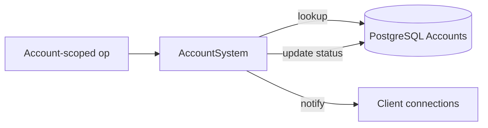

# Account System

**Short description:** Manages server-side account and connection lifecycle including X25519 encryption key exchange, SRP and token authentication state machines, bidirectional account-to-connection mappings, and periodic stale-connection sweeps.

## Table of Contents

- [Overview](#overview)
- [Supported Platforms](#supported-platforms)
- [Features](#features)
- [Prerequisites](#prerequisites)
- [Installation / Build](#installation--build)
- [Quick Start Guides](#quick-start-guides)
- [Configuration](#configuration)
- [Usage Examples](#usage-examples)
- [Operational Checks](#operational-checks)
- [Flow Diagram](#flow-diagram)
- [Project Structure](#project-structure)
- [License](#license)

## Overview

The Account system manages the server-side lifecycle of player connections, including encryption key exchange, authentication state, account-to-connection mappings, and access level tracking. It is split into a Core interface layer (transport-agnostic) and an Implementation layer that binds to FishNet's `NetworkConnection`.

The Core layer defines `IAccountManager<TConnection>`, `ISrpAccountManager<TConnection>`, and `ITokenAccountManager<TConnection>` — generic interfaces for encryption management, auth-state transitions, and account lookup. The Implementation layer provides three thin Unity wrappers — concrete FishNet-typed classes that bind `TConnection = NetworkConnection` and carry no logic of their own. All implementation lives in the FishMMO-Auth generic base classes (`FishMMO.Auth.Implementation` namespace):

- **`AccountManager`** — Inherits `AccountManager<NetworkConnection>` from FishMMO-Auth verbatim. No additional members. Thread-safe base implementing `IAccountManager<NetworkConnection>`: owns all internal dictionaries, the unified `AuthState` CAS machine, and the `ArrivalOrderTracker`-backed unauthenticated connection tracker.
- **`SrpAccountManager`** — Inherits `SrpAccountManager<NetworkConnection>` from FishMMO-Auth verbatim. No additional members. Extends `AccountManager<TConnection>` with SRP-specific `AddConnectionAccount`, periodic `SweepUnauthenticatedConnections`, and `ClearSrpState`. Used by `LoginServer`.
- **`TokenAccountManager`** — Inherits `TokenAccountManager<NetworkConnection>` from FishMMO-Auth, providing a constructor that passes `conn => conn.ClientId.ToString()` as the connection-ID resolver. Extends `AccountManager<TConnection>` with a simplified `AddConnectionAccount` (name + access level only). Used by World and Scene servers.

All public methods acquire `lock(syncRoot)` before accessing any internal state. `AccountData.AuthState` is the **single source of truth** for where a connection sits in the authentication lifecycle. All transitions are performed atomically via `TryAdvanceAuthState` (compare-and-swap under lock).

## Supported Platforms

| Platform | Supported | Notes |
|----------|-----------|-------|
| Windows  | Yes       | Fully supported as a server host |
| Linux    | Yes       | Fully supported as a server host |
| WebGL    | N/A       | Server-only component; not applicable to browser builds |

**Engine:** Unity 6.3 LTS
**Scripting backend:** IL2CPP

## Features

- **Thread-safe account/connection management** — All public methods synchronize via `lock(syncRoot)`, supporting concurrent access from FishNet broadcast handlers, async worker threads, and scene-server handoff operations.
- **Unified AuthState machine** — A single `AuthState` enum (8 states, `byte`-backed) replaces former per-flow in-flight dictionaries. All transitions use atomic compare-and-swap under lock.
- **Bidirectional account ↔ connection maps** — `connectionAccounts` (connection → name) and `accountConnections` (name → connection) are kept in sync by all add/remove operations, providing O(1) lookup in both directions.
- **X25519 encryption key exchange** — `TryAddConnectionEncryptionData` stores the client's X25519 public key and creates `AccountData` at `Handshake` state. Directional AES-256-GCM keys and nonce contexts are established later via `PromoteToDirectional` after ECDH key agreement.
- **SRP authentication (LoginServer)** — `SrpAccountManager.AddConnectionAccount` creates `ServerSrpData` (2048-bit SRP parameters, SHA-512), generates server ephemeral values, and advances auth state to `WaitingForProof`. Proof verification via `ServerSrpData.GetProof` derives the session.
- **Token authentication (World/Scene)** — `TokenAccountManager.AddConnectionAccount` registers account name and access level without SRP state. Used for post-login reconnection via signed tokens.
- **Oldest-first stale-connection sweeps** — `SweepUnauthenticatedConnections` processes the `ArrivalOrderTracker` head-first, dropping authenticated entries from tracking and purging stale unauthenticated entries with configurable `maxScan` and `maxRemovals` per sweep.
- **Sensitive material cleanup** — `ConnectionEncryptionData.Clear()` zeroes AES keys via `CryptographicOperations.ZeroMemory` and disposes nonce contexts. `AccountData.Clear()` resets auth state and nulls SRP references. `ClearSrpState()` removes SRP material post-success while preserving access level.
- **Re-handshake protection** — `IsAuthInProgress` checks `AuthState > Handshake` to reject repeated handshakes while authentication is in progress.
- **Callback-in-lock transitions** — `TryAdvanceAuthState` with an `onSuccess` callback executes the callback inside the lock, enabling atomic read-modify-write patterns. Callbacks must not block or re-enter the manager.
- **Graceful full clear** — `Clear()` zeroes all encryption key material, clears all SRP data, and empties all dictionaries and the unauthenticated tracker.

## Prerequisites

- Unity 6.3 LTS (IL2CPP scripting backend)
- FishNet networking framework (`FishNet.Connection.NetworkConnection`)
- FishMMO server core assemblies (`FishMMO.Server.Core.Account`, `FishMMO.Server.Core.Collections`)
- `FishMMO-Auth.dll` shared library — provides the generic `AccountManager<T>` / `SrpAccountManager<T>` / `TokenAccountManager<T>` base classes, `AccountData`, `ConnectionEncryptionData`, `ServerSrpData`, the `AuthState` enum, and the `ArrivalOrderTracker<T>` collection (in `FishMMO.Auth.Core.Collections`).
- `SecureRemotePassword` third-party library (2048-bit parameters, SHA-512)
- `System.Security.Cryptography` for SHA-512 and `CryptographicOperations.ZeroMemory`
- `CryptoHelper` (FishMMO shared) for X25519 ECDH + HKDF-SHA256 key derivation, AES-GCM, nonce construction
- `AccessLevel` enum (FishMMO shared) defining account permission tiers

## Installation / Build

This is an integrated module within the FishMMO Unity project. No separate installation is required.

1. Ensure the FishMMO Unity project is open in the Unity Editor.
2. The account managers are instantiated by server behaviours (e.g., `LoginServerSystem` creates `SrpAccountManager`; World/Scene server systems create `TokenAccountManager`).
3. No separate ScriptableObject or asset creation is needed — the managers are plain C# objects owned by their respective server systems.

## Quick Start Guides

### Using SrpAccountManager (LoginServer)

1. Create an `SrpAccountManager` instance in the login server's initialization.
2. When a client connects and sends its public key, call `TryAddConnectionEncryptionData(connection, publicKey)` — this creates `AccountData` at `Handshake` state and begins unauthenticated tracking.
3. On receiving an SRP verify request, advance state with `TryAdvanceAuthState(connection, Handshake, VerifyPending)`.
4. In the async worker, call `AddConnectionAccount(connection, accountName, publicClientEphemeral, salt, verifier, accessLevel)` — this creates `ServerSrpData`, generates server ephemeral values, and advances to `WaitingForProof`.
5. Send the server's ephemeral and salt back to the client.
6. On receiving the client's proof, advance with `TryAdvanceAuthState(connection, WaitingForProof, ProofPending)`.
7. In the async worker, verify using `ServerSrpData.GetProof(clientProof, out serverProof)` and advance to `SrpSuccess`.
8. Send the server's proof, then advance to `Authenticated` and call `ClearSrpState(connection)` to remove sensitive SRP material.

### Using TokenAccountManager (World/Scene Server)

1. Create a `TokenAccountManager` instance in the world or scene server's initialization.
2. On public-key handshake, call `TryAddConnectionEncryptionData(connection, publicKey)`.
3. On receiving a token, advance with `TryAdvanceAuthState(connection, Handshake, TokenPending)`.
4. In the async worker, validate the token against the database. On success, call `AddConnectionAccount(connection, accountName, accessLevel)` and advance to `Authenticated`.

### Periodic Stale-Connection Cleanup

1. In the server's update loop (e.g., `ServerAuthenticator.Update()`), periodically call:
   ```csharp
   srpAccountManager.SweepUnauthenticatedConnections(
       maxUnauthenticatedAge: TimeSpan.FromSeconds(30),
       isAuthenticated: conn => conn.IsAuthenticated,
       maxScan: 50,
       maxRemovals: 10
   );
   ```
2. This processes the oldest tracked entries first, drops already-authenticated entries from the tracker, and purges stale unauthenticated entries (encryption data, account data, and mappings).

## Configuration

The account managers have no serialized inspector fields. All behaviour is controlled programmatically by the server systems that own them.

| Parameter | Configured By | Purpose |
|-----------|---------------|---------|
| `maxUnauthenticatedAge` | Caller of `SweepUnauthenticatedConnections` | Maximum age before an unauthenticated connection is purged |
| `maxScan` | Caller of `SweepUnauthenticatedConnections` | Maximum tracked entries to evaluate per sweep |
| `maxRemovals` | Caller of `SweepUnauthenticatedConnections` | Maximum stale entries to purge per sweep |
| `isAuthenticated` | Caller of `SweepUnauthenticatedConnections` | Predicate to check if a connection is authenticated at the transport level |

### SRP Parameters

SRP authentication uses fixed parameters defined at `ServerSrpData` construction:

| Parameter | Value |
|-----------|-------|
| Group size | 2048-bit |
| Hash algorithm | SHA-512 |
| Library | `SecureRemotePassword` (third-party) |

## Usage Examples

### Looking Up an Account Name

```csharp
if (accountManager.GetAccountNameByConnection(connection, out string accountName))
{
    // accountName is the authenticated player's account
}
```

### Reverse Lookup: Connection by Account Name

```csharp
if (accountManager.GetConnectionByAccountName("PlayerOne", out NetworkConnection conn))
{
    // conn is the live connection for "PlayerOne"
}
```

### Checking Authentication State

```csharp
if (accountManager.HasAuthState(connection, AuthState.Authenticated))
{
    // Connection is fully authenticated
}

if (accountManager.IsAuthInProgress(connection))
{
    // Reject repeated handshake — auth already in progress
}
```

### Atomic State Transition with Callback

```csharp
bool ok = accountManager.TryAdvanceAuthState(
    connection,
    AuthState.WaitingForProof,
    AuthState.WaitingForProof,
    accountData =>
    {
        // Runs inside the lock — read SRP data, prepare response
        var srpData = accountData.SrpData;
        serverEphemeral = srpData.ServerEphemeral.Public;
        salt = srpData.Salt;
        return true;
    });
```

### Removing a Connection on Disconnect

```csharp
accountManager.RemoveConnectionAccount(connection);
// All encryption data zeroed, AccountData cleared, bidirectional maps removed, tracking removed
```

### Server Shutdown

```csharp
accountManager.Clear();
// All encryption keys zeroed, all SRP data cleared, all dictionaries emptied
```

## Operational Checks

| Check | How to Verify | Expected Result |
|-------|---------------|-----------------|
| Encryption data stored | Call `GetConnectionEncryptionData` after handshake | Returns `true`, non-null `ConnectionEncryptionData` with public key |
| AccountData created at handshake | Call `GetConnectionAccountData` after `TryAddConnectionEncryptionData` | Returns `true`, `AuthState == Handshake` |
| SRP state transitions | Advance through `Handshake → VerifyPending → WaitingForProof → ProofPending → SrpSuccess → Authenticated` | Each `TryAdvanceAuthState` returns `true` in order |
| Token state transitions | Advance through `Handshake → TokenPending → Authenticated` | Each `TryAdvanceAuthState` returns `true` in order |
| Bidirectional map consistency | Call `GetAccountNameByConnection` and `GetConnectionByAccountName` after `AddConnectionAccount` | Both return `true` and cross-reference correctly |
| Re-handshake rejection | Call `IsAuthInProgress` after advancing past `Handshake` | Returns `true` |
| Stale sweep removes old entries | Call `SweepUnauthenticatedConnections` with a short `maxAge` after waiting | Returns count > 0; encryption and account data removed |
| Stale sweep skips authenticated | Authenticate a connection, then sweep | Connection untracked but not purged |
| SRP material cleared post-success | Call `ClearSrpState` after `Authenticated` | `AccountData.SrpData` is `null`, access level preserved |
| Full clear zeroes keys | Call `Clear()` | All dictionaries empty, all `ConnectionEncryptionData` zeroed |
| Out-of-order transition rejected | Call `TryAdvanceAuthState` with wrong `required` state | Returns `false`, state unchanged |
| Disconnect cleanup | Call `RemoveConnectionAccount` | All maps, encryption data, and account data removed; `AccountData.Clear()` called |

## Flow Diagram

### High-Level Overview



```
┌─────────────────────────────────────────────────────────────────────────┐
│                   Account System — Connection Lifecycle                  │
├─────────────────────────────────────────────────────────────────────────┤
│                                                                         │
│  1. Client Connects — Public Key Handshake                              │
│  ┌────────────────────────────────────────────────────────────────────┐ │
│  │ TryAddConnectionEncryptionData(connection, publicKey)              │ │
│  │   ├── Store ConnectionEncryptionData (X25519 public key)          │ │
│  │   ├── Create AccountData { AuthState = Handshake }                │ │
│  │   └── Track in unauthenticatedTracker (arrival-ordered)           │ │
│  └────────────────────────────────────────────────────────────────────┘ │
│                              │                                          │
│              ┌───────────────┴───────────────┐                          │
│              ▼                               ▼                          │
│                                                                         │
│  2a. SRP Flow (LoginServer)       2b. Token Flow (World/Scene)         │
│  ┌──────────────────────────┐     ┌──────────────────────────────────┐ │
│  │ TryAdvanceAuthState      │     │ TryAdvanceAuthState              │ │
│  │   Handshake → VerifyPend.│     │   Handshake → TokenPending       │ │
│  │                          │     │                                  │ │
│  │ Worker:                  │     │ Worker:                          │ │
│  │   AddConnectionAccount   │     │   Validate token against DB      │ │
│  │   (name, ephemeral,      │     │   AddConnectionAccount           │ │
│  │    salt, verifier, ACL)  │     │   (name, accessLevel)            │ │
│  │   → AuthState =          │     │   TryAdvanceAuthState            │ │
│  │     WaitingForProof      │     │     TokenPending → Authenticated │ │
│  │                          │     └──────────────────────────────────┘ │
│  │ Send server ephemeral    │                    │                     │
│  │   + salt to client       │                    │                     │
│  │                          │                    │                     │
│  │ TryAdvanceAuthState      │                    │                     │
│  │   WaitingForProof →      │                    │                     │
│  │   ProofPending           │                    │                     │
│  │                          │                    │                     │
│  │ Worker:                  │                    │                     │
│  │   GetProof(clientProof)  │                    │                     │
│  │   → SrpSuccess           │                    │                     │
│  │   Send server proof      │                    │                     │
│  │                          │                    │                     │
│  │ TryAdvanceAuthState      │                    │                     │
│  │   SrpSuccess →           │                    │                     │
│  │   Authenticated          │                    │                     │
│  │ ClearSrpState(conn)      │                    │                     │
│  └──────────────────────────┘                    │                     │
│              │                                   │                     │
│              └───────────────┬───────────────────┘                     │
│                              ▼                                          │
│  3. Authenticated Session                                               │
│  ┌────────────────────────────────────────────────────────────────────┐ │
│  │ AuthState = Authenticated                                         │ │
│  │ Unauthenticated tracking removed                                  │ │
│  │ Bidirectional maps active: connection ↔ accountName               │ │
│  │ Encryption keys active: directional AES-256-GCM                   │ │
│  └────────────────────────────────────────────────────────────────────┘ │
│                              │                                          │
│                              ▼                                          │
│  4. Disconnect / Removal                                                │
│  ┌────────────────────────────────────────────────────────────────────┐ │
│  │ RemoveConnectionAccount(connection)                                │ │
│  │   ├── ConnectionEncryptionData.Clear() — zero AES keys, dispose   │ │
│  │   ├── AccountData.Clear() — reset AuthState, null SRP refs        │ │
│  │   ├── Remove from connectionAccounts + accountConnections         │ │
│  │   └── Untrack from unauthenticatedTracker                         │ │
│  └────────────────────────────────────────────────────────────────────┘ │
│                                                                         │
│  5. Periodic Stale Sweep (SrpAccountManager only)                       │
│  ┌────────────────────────────────────────────────────────────────────┐ │
│  │ SweepUnauthenticatedConnections(maxAge, isAuthenticated,          │ │
│  │                                  maxScan, maxRemovals)            │ │
│  │   ├── Process oldest tracked entries first                        │ │
│  │   ├── Authenticated entries → untrack only                        │ │
│  │   ├── Fresh entries → stop (queue is ordered oldest→newest)       │ │
│  │   └── Stale entries → ClearEncryption + ClearAccountData + remove │ │
│  └────────────────────────────────────────────────────────────────────┘ │
│                                                                         │
└─────────────────────────────────────────────────────────────────────────┘
```

### AuthState Transitions

```
SRP flow:   None → Handshake → VerifyPending → WaitingForProof → ProofPending → SrpSuccess → Authenticated
Token flow: None → Handshake → TokenPending → Authenticated
```

| State | Value | Description |
|-------|-------|-------------|
| `None` | 0 | Default / cleared — no active authentication |
| `Handshake` | 1 | Public-key exchange complete — AccountData created |
| `VerifyPending` | 2 | SRP verify request accepted — worker in progress |
| `WaitingForProof` | 3 | SRP server ephemeral ready — awaiting client proof |
| `ProofPending` | 4 | SRP proof request accepted — worker in progress |
| `SrpSuccess` | 5 | SRP proof verified — session keys established |
| `TokenPending` | 6 | Token auth request accepted — worker in progress |
| `Authenticated` | 7 | Terminal state — fully authenticated session |

Values are explicitly numbered and must not be renumbered — sweep logic and guard checks rely on ordinal comparisons (`state > AuthState.Handshake` means "auth is in progress").

## Project Structure

### Directory Tree

```
# FishMMO-Auth (netstandard2.1 shared library — Assets/Dependencies/FishMMO-Auth.dll)
FishMMO-Auth/
├── Core/
│   ├── Interfaces/
│   │   ├── IAccountManager.cs                 # Generic interface: encryption, auth-state, account-connection maps
│   │   ├── ISrpAccountManager.cs              # SRP-specific interface: AddConnectionAccount with SRP params
│   │   └── ITokenAccountManager.cs            # Token-specific interface: AddConnectionAccount (name + ACL)
│   ├── Enums/
│   │   ├── AuthState.cs                       # Unified auth state enum (None → Handshake → … → Authenticated)
│   │   └── AccessLevel.cs                     # Account permission tiers
│   └── Collections/
│       ├── ArrivalOrderTracker.cs             # Oldest-first tracking utility for TTL sweeps
│       ├── ExpiringKeyTracker.cs              # Keyed debounce / rate-limit with head-first expiry
│       └── LastSeenCacheTracker.cs            # TTL cache by last-seen timestamp
│
└── Implementation/
    ├── Connection/
    │   ├── AccountData.cs                     # Access level + auth state + SRP data container
    │   └── ConnectionEncryptionData.cs        # X25519 public key, directional AES-256 keys, nonce contexts
    ├── SRP/
    │   └── ServerSrpData.cs                   # Server-side SRP session (ephemeral, proof, session)
    └── Account/
        ├── AccountManager.cs                  # Thread-safe base: all dictionaries, CAS machine, sweep tracking
        ├── SrpAccountManager.cs               # SRP extension: AddConnectionAccount, SweepUnauthenticated, ClearSrpState
        └── TokenAccountManager.cs             # Token extension: simplified AddConnectionAccount (name + ACL)

# FishMMO-Unity (this assembly)
Server/
└── Implementation/Account/                    # FishNet-typed thin wrappers (this directory)
    ├── AccountManager.cs                      # Inherits AccountManager<NetworkConnection>; no members
    ├── SrpAccountManager.cs                   # Inherits SrpAccountManager<NetworkConnection>; no members
    ├── TokenAccountManager.cs                 # Inherits TokenAccountManager<NetworkConnection>; adds ClientId resolver ctor
    └── README.md                              # This file
```

### Inheritance Hierarchies

**Interfaces**

```
IAccountManager<TConnection>
├── ISrpAccountManager<TConnection>
└── ITokenAccountManager<TConnection>
```

**Generic Implementation Classes (FishMMO-Auth)**

```
AccountManager<TConnection> : IAccountManager<TConnection>
├── SrpAccountManager<TConnection> : AccountManager<TConnection>, ISrpAccountManager<TConnection>
└── TokenAccountManager<TConnection> : AccountManager<TConnection>, ITokenAccountManager<TConnection>
```

**FishNet-Typed Wrappers (FishMMO-Unity)**

```
AccountManager : AccountManager<NetworkConnection>             // no additional members
SrpAccountManager : SrpAccountManager<NetworkConnection>      // no additional members
TokenAccountManager : TokenAccountManager<NetworkConnection>   // adds ClientId resolver constructor
```

**Data Types**

```
AccountData
├── AuthState         (enum, byte-backed)
├── AccessLevel       (enum, from FishMMO.Shared)
└── ServerSrpData     (nullable, SRP session state)

ConnectionEncryptionData
├── PublicKey          (byte[], X25519)
├── MasterSecret      (byte[], ECDH-derived, nulled after promotion)
├── ClientToServerKey  (byte[], AES-256)
├── ServerToClientKey  (byte[], AES-256)
├── SendNonceCtx      (GcmNonceContext, server→client)
├── ReceiveNonceCtx   (GcmNonceContext, client→server)
└── AgreedVersion     (ushort, protocol version for AAD)
```

### Internal Data Stores (AccountManager)

| Dictionary | Key → Value | Purpose |
|------------|-------------|---------|
| `connectionEncryptionEntries` | `NetworkConnection → ConnectionEncryptionData` | Encryption keys per connection |
| `connectionAccounts` | `NetworkConnection → string` | Connection → account name lookup |
| `accountConnections` | `string → NetworkConnection` | Account name → connection reverse lookup |
| `connectionAccountData` | `NetworkConnection → AccountData` | Connection → full account data (auth state, access level, SRP) |
| `unauthenticatedTracker` | `ArrivalOrderTracker<NetworkConnection>` | Oldest-first stale-state sweep support |

### Thread Safety Model

| Thread | Work |
|--------|------|
| FishNet main thread | Broadcast handlers, handshake processing, disconnect cleanup |
| Async worker threads | Database lookups, SRP verification, token validation |
| Scene server handoff | Account queries during cross-server transitions |

All public methods acquire `lock(syncRoot)`. The `TryAdvanceAuthState` callback variant executes the callback **inside** the lock — callbacks must not block or re-enter the `AccountManager`.

### External Dependencies

| Dependency | Purpose |
|------------|---------|
| `FishNet.Connection.NetworkConnection` | FishNet's connection type used as `TConnection` |
| `SecureRemotePassword` | Third-party SRP library (2048-bit parameters, SHA-512) |
| `System.Security.Cryptography` | SHA-512 hash algorithm for SRP; `CryptographicOperations.ZeroMemory` for key cleanup |
| `CryptoHelper` | X25519 ECDH + HKDF-SHA256 key derivation, AES-GCM, nonce construction, protocol versioning |
| `AccessLevel` | Enum defining account permission tiers (Player, GameMaster, Admin, etc.) |
| `ArrivalOrderTracker<T>` *(now in `FishMMO-Auth.dll` — `FishMMO.Auth.Core.Collections`)* | O(1) track/untrack with oldest-first iteration for TTL sweeps |

### Integration Points

| Consumer | Interface Used | Role |
|----------|---------------|------|
| Login ServerBehaviour | `SrpAccountManager` | Creates manager; passes to `SrpAuthenticatorCore` via `InitializeCoreInstance` |
| `SrpAuthenticatorCore` (FishMMO-Auth) | `ISrpAccountManager<NetworkConnection>` | Calls `TryAddConnectionEncryptionData`, drives all SRP state transitions, runs `SweepUnauthenticatedConnections` |
| `TokenAuthenticatorCore` (FishMMO-Auth) | `ITokenAccountManager<NetworkConnection>` | Drives `Handshake → TokenPending → Authenticated` transitions |
| World/Scene Servers | `AccountManager` (base) | Query `GetAccountNameByConnection` and `GetConnectionAccountData` for permission checks |
| Disconnect Handling | `AccountManager` (base) | Calls `RemoveConnectionAccount` to clean up all mappings |
| Server Shutdown | `AccountManager` (base) | Calls `Clear()` to release all tracked connections and data |

## License

This module is part of the FishMMO project and is subject to the FishMMO project license.
