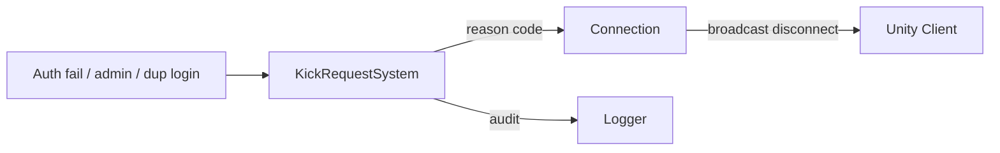

# Kick Request System

**Short description:** Periodically polls the database for account kick requests, filters stale entries via last-login timestamps, and disconnects matching connections on the main thread through a dedicated queue container.

## Table of Contents

- [Overview](#overview)
- [Supported Platforms](#supported-platforms)
- [Features](#features)
- [Prerequisites](#prerequisites)
- [Installation / Build](#installation--build)
- [Quick Start Guides](#quick-start-guides)
- [Configuration](#configuration)
- [Usage Examples](#usage-examples)
- [Operational Checks](#operational-checks)
- [Flow Diagram](#flow-diagram)
- [Project Structure](#project-structure)
- [License](#license)

## Overview

The Kick Request system enforces account disconnect requests issued through the database. It runs on any FishMMO server (Login, Scene, or World) as a `ServerBehaviour` and periodically polls for new kick requests through a read window kept on the database clock. Each request is validated against account last-login timestamps to filter stale entries (accounts that have already reconnected). Valid kick actions are marshalled to the Unity main thread through a dedicated `MainThreadQueueData` container, since FishNet connection operations are not thread-safe. The disconnect itself goes through `ServerBehaviour.DisconnectWithNotice(AdministrativeKick, terminal: true)` rather than `NetworkConnection.Kick(...)`.

The system is split into a Core interface layer and an Implementation layer:

- **Core layer** (`Server/Core/KickRequest/`) — Defines `IKickRequestSystem`, `IKickRequestSystemQueueData`, and `IKickRequestSystemMainThreadQueueData` as engine-agnostic contracts. Other systems can query or modify runtime pump parameters (`UpdatePumpRate`, `UpdateFetchCount`) without referencing the implementation.
- **Implementation layer** (`Server/Implementation/KickRequest/`) — Provides three concrete classes:
  - **`KickRequestSystem`** — Orchestrates polling, validation, and kick execution. Extends `ServerBehaviour` and implements `IKickRequestSystem`.
  - **`KickRequestSystemQueueData`** — Holds the poll's `KickRequestReadWindow` (FishMMO-DB), the monotonic moment it began watching (`WatchStartedAt`), and an overlap gate (`IsProcessing`). Extends `RuntimeDataContainer`.
  - **`KickRequestSystemMainThreadQueueData`** — Per-system main-thread action queue container. Extends `SystemMainThreadQueueData`.

Database and polling work run asynchronously via `AsyncWorkerData`, while all FishNet connection operations are dispatched through the main-thread queue to guarantee thread safety.

## Supported Platforms

| Platform | Supported | Notes |
|----------|-----------|-------|
| Windows  | Yes       | Fully supported as a server host |
| Linux    | Yes       | Fully supported as a server host |
| WebGL    | N/A       | Server-only component; not applicable to browser builds |

**Engine:** Unity 6.3 LTS
**Scripting backend:** IL2CPP

## Features

- **A read window on the database clock** — Each poll reads from `KickRequestReadWindow.Watermark`, which trails what the poll has settled by `KickRequestService.PollCommitWindowSeconds` (10 s), and skips the kicks it has already handled by `(id, time_created)`. It replaced a `(LastFetchTime, LastPosition)` cursor that was seeded from this host's `DateTime.UtcNow` and compared with stamps the database wrote: a host running ahead of the database skipped every kick stamped inside its lead, and a kick whose transaction committed after a later-stamped one's (a ban writes its kick inside a longer transaction, stamped at its start) was passed before it was visible. Every instant the window holds comes back from the database (`KickRequestPage.ReadStartedUtc`); the first read reaches back to when this server began watching as a duration (`FirstReadLookbackSeconds`), so no two host clocks are ever compared. A kick is recorded as handled only once it is on its way to the main thread or was found stale; a kick the main-thread queue refuses, and everything after it, is read again on the next poll, so a full queue cannot lose an operator's kick. A second kick of an account keeps its row's ID and moves the stamp, and is read as the new kick it is.
- **Stale request filtering** — Each kick request carries its account's last-login timestamp. If the last login occurred after the kick request was created, the request is considered stale (account already reconnected) and is skipped. Both stamps are the database's (`AccountService.PersistLastLoginAsync` stamps `last_login` with the database clock), so a login server whose clock ran ahead can no longer make an earlier login look later than the kick. A request with no matching account row is kicked anyway, with a warning.
- **Last-login check in the same query** — `IKickRequestService.FetchAsync` returns each request with its account's last login (`KickRequestData.AccountLastLogin`, a correlated subquery on the `accounts.name_lowercase` index), so a poll is one round trip however many kicks it returns. It used to be followed by one `FetchLastLoginAsync` per kick on every login, world and scene server.
- **Overlap protection** — `IKickRequestSystemQueueData.IsProcessing` is checked under a lock before each poll to prevent concurrent overlapping database fetches.
- **Main-thread kick dispatch** — All disconnects are enqueued via `TryEnqueueMainThread<IKickRequestSystemMainThreadQueueData>` and drained on the main thread each frame, respecting `maxMainThreadActionsPerFrame` to avoid frame spikes.
- **The player is told they were kicked** — `DisconnectWithNotice(AdministrativeKick, terminal: true)`, never `NetworkConnection.Kick(...)`. FishNet does not carry a kick reason to the client, so a plain `Kick` landed the player on the login screen with no explanation *and* left the client's reconnect loop to spend all ten attempts dialling back into a server that would refuse them again. `Kick` would also have discarded the notice: it calls `Disconnect(true)`, which stops the transport immediately and throws away everything still queued for the tick. `Terminal = true` is what stops the retry loop, because an operator kick does not resolve by retrying.
- **Disconnect cleanup that cannot be dropped** — When a remote connection stops, the system deletes any pending kick request for that account from the database, preventing stale requests from re-triggering after legitimate disconnect/reconnect cycles. This delete goes through `EnqueuePersistence`, not `TryEnqueueAsyncWork`: the connection is already gone, so there is nobody to tell if the write was refused, and a delete that is silently dropped kicks the account again on its next login. `EnqueuePersistence` admits the work even when the worker is past its backpressure threshold (it waits behind the backlog under the worker's concurrency cap, and the overflow is logged as a counted Error at most every 10 s); only when the worker is not running at all does the delete run on the thread pool, through a small bounded gate. The work is keyed by `accountName.GetDeterministicHashCode()`, so repeated cleanups for one account stay ordered.
- **Configurable pump rate** — Poll interval (`updatePumpRate`) and fetch count (`updateFetchCount`) are exposed as serialized fields and runtime properties, tunable via the Unity Inspector or code.
- **Periodic update integration** — Registers with `IPeriodicUpdateSystem` for fixed-rate polling cadence rather than relying on per-frame checks.
- **Graceful shutdown drain** — On deinitialization, the system drains all remaining main-thread actions so clients receive their final disconnect messages.
- **Async worker backpressure** — The periodic poll is submitted via `TryEnqueueAsyncWork`, which returns `false` when the worker pool is full and logs a warning; a skipped poll costs nothing, because the next tick reads from the same watermark. The disconnect cleanup deliberately does not use it — see above.

## Prerequisites

- Unity 6.3 LTS (IL2CPP scripting backend)
- FishNet networking framework (`FishNet.Connection.NetworkConnection`)
- FishMMO Database layer with an `IKickRequestService` implementation
- FishMMO Server Core (`ServerBehaviour`, `RuntimeDataContainer`, `AsyncWorkerData`, `SystemMainThreadQueueData`)
- A running PostgreSQL (or compatible) database with kick request and account tables

## Installation / Build

The Kick Request system is an integrated module within the FishMMO server architecture. It is included automatically when building any server (Login, Scene, or World) and requires no separate installation steps.

1. Ensure the FishMMO Unity project is set up with all dependencies resolved.
2. Create a `KickRequestSystem` ScriptableObject asset via **Assets → Create → FishMMO → Server → WorldServer → Kick Request System**.
3. Assign the asset to the target server's system list.
4. Create `KickRequestSystemQueueData` and `KickRequestSystemMainThreadQueueData` data container assets and register them in the `DataContainerRegistry`.

## Quick Start Guides

### Inspector Setup

1. Select the `KickRequestSystem` ScriptableObject asset.
2. Configure **Update Pump Rate** (default `5.0` seconds) — how often the system polls the database.
3. Configure **Update Fetch Count** (default `100`) — maximum kick requests fetched per poll.
4. Configure **Max Main Thread Actions Per Frame** (default `100`) — limits frame spikes from large kick batches.

### Runtime Tuning

```csharp
// Adjust poll interval at runtime
if (server.TryGetSystem<IKickRequestSystem>(out var kickSystem))
{
    kickSystem.UpdatePumpRate = 2.0f;   // poll every 2 seconds
    kickSystem.UpdateFetchCount = 50;   // fetch up to 50 per poll
}
```

### Issuing a Kick Request

Kick requests are inserted into the database by external systems (e.g., admin tools, login server). The `KickRequestSystem` will pick them up on the next poll cycle and disconnect the matching connection if the account is still online.

## Configuration

| Field / Property | Type | Default | Purpose |
|------------------|------|---------|---------|
| `maxMainThreadActionsPerFrame` | `int` | `100` | Maximum kick actions drained from the main-thread queue per frame. Clamped to a minimum of 1. |
| `updatePumpRate` / `UpdatePumpRate` | `float` | `5.0f` | Database poll interval in seconds. Controls how frequently the system checks for new kick requests. |
| `updateFetchCount` / `UpdateFetchCount` | `int` | `100` | Maximum number of kick requests fetched per database poll. |

### Runtime Data State

| Container | Field | Type | Default | Purpose |
|-----------|-------|------|---------|---------|
| `KickRequestSystemQueueData` | `IsProcessing` | `bool` | `false` | Overlap gate preventing concurrent polls |
| `KickRequestSystemQueueData` | `ReadWindow` | `KickRequestReadWindow` | empty (first read) | Watermark and handled kicks, on the database clock |
| `KickRequestSystemQueueData` | `WatchStartedAt` | `double` | `MonotonicClock.NowSeconds` at init | How far back the first read reaches, as a duration |

## Usage Examples

### Querying Kick System State

```csharp
if (server.TryGetSystem<IKickRequestSystem>(out var kickSystem))
{
    Debug.Log($"Poll rate: {kickSystem.UpdatePumpRate}s, Fetch count: {kickSystem.UpdateFetchCount}");
}
```

### Inserting a Kick Request (Database Side)

```csharp
// From an admin tool or another server system
if (database.ServiceRegistry.TryGet<IKickRequestService>(out var kickService))
{
    await kickService.InsertAsync(new KickRequestData
    {
        AccountName = "targetAccount",
        TimeCreated = DateTime.UtcNow
    });
}
```

### Connection Disconnect Lifecycle

```csharp
// Automatically handled by KickRequestSystem:
// 1. Poll detects kick request for "targetAccount"
// 2. Last-login check confirms account hasn't reconnected
// 3. Main-thread queue receives kick action
// 4. On next frame drain: DisconnectWithNotice(conn, AdministrativeKick, terminal: true)
// 5. OnRemoteConnectionStopped fires → kick request deleted from DB
```

## Operational Checks

| Check | How to verify | Expected |
|-------|---------------|----------|
| System initialized | Log output: `"Initialized (UpdatePumpRate=5s, FetchCount=100)"` | Appears once at server start |
| Polling active | Monitor database query logs for periodic `FetchAsync` calls | Queries every `updatePumpRate` seconds |
| Kick executed | Watch for client disconnects after inserting a kick request | Client disconnected within one poll cycle |
| Stale filtering | Insert kick request, then log the account in again before next poll | Account stays connected; request skipped |
| Disconnect cleanup | Disconnect an account with a pending kick request | Kick request deleted from database |
| Overlap protection | Set `updatePumpRate` very low with slow DB | Only one `ProcessKickRequestsAsync` runs at a time |
| Main-thread drain | Insert many kick requests at once | Kicks processed at `maxMainThreadActionsPerFrame` per frame |
| Poll backpressure | Saturate async worker pool | Warning logged: `"Failed to enqueue periodic kick-request processing work item."` |
| Cleanup backpressure | Saturate the worker past its threshold, then disconnect an account with a pending kick request | Error logged: `"async worker over its threshold — persistence admitted behind the backlog"`; the request is still deleted once the backlog drains |
| Graceful shutdown | Stop the server with pending kick actions | All queued actions drain before shutdown completes |

## Flow Diagram

### High-Level Overview



```
┌─────────────────────────────────────────────────────────────┐
│                    KickRequestSystem                        │
│                                                             │
│  ┌───────────────────┐    ┌──────────────────────────────┐  │
│  │  InitializeOnce   │    │       OnDeinitialize         │  │
│  │  ─ Validate deps  │    │  ─ DrainMainThreadQueue(all) │  │
│  │  ─ Subscribe conn │    │  ─ Unsubscribe events        │  │
│  │  ─ Register pump  │    │  ─ Unregister periodic       │  │
│  └───────────────────┘    └──────────────────────────────┘  │
│                                                             │
│  ┌──────────────────────────────────────────────────────┐   │
│  │              Periodic Poll (every N seconds)         │   │
│  │                                                      │   │
│  │  OnPeriodicUpdate(deltaTime)                         │   │
│  │    │                                                 │   │
│  │    ▼                                                 │   │
│  │  TryEnqueueAsyncWork(ProcessKickRequestsAsync)       │   │
│  │    │                                                 │   │
│  │    ▼  [Async Worker Thread]                          │   │
│  │  ProcessKickRequestsAsync()                          │   │
│  │    │                                                 │   │
│  │    ├─ lock(data) → check IsProcessing                │   │
│  │    │                                                 │   │
│  │    ├─ kickRequestService.FetchAsync(                  │   │
│  │    │    ReadWindow.BuildQuery(FetchCount, lookback))  │   │
│  │    │    each row carries AccountLastLogin             │   │
│  │    │                                                 │   │
│  │    ├─ ReadWindow.MarkHandled per settled kick,        │   │
│  │    │  then ReadWindow.CompleteRead(page)              │   │
│  │    │                                                 │   │
│  │    ├─ For each valid request:                         │   │
│  │    │    lastLogin < kickRequest.TimeCreated?          │   │
│  │    │      ├─ Yes → TryEnqueueMainThread(kick action) │   │
│  │    │      └─ No  → Skip (stale)                      │   │
│  │    │                                                 │   │
│  │    └─ finally: lock(data) → IsProcessing = false     │   │
│  └──────────────────────────────────────────────────────┘   │
│                                                             │
│  ┌──────────────────────────────────────────────────────┐   │
│  │           Main-Thread Drain (every frame)            │   │
│  │                                                      │   │
│  │  OnUpdate(deltaTime)                                 │   │
│  │    │                                                 │   │
│  │    ▼                                                 │   │
│  │  DrainMainThreadQueue(drainAll: false)               │   │
│  │    │                                                 │   │
│  │    ▼  Up to maxMainThreadActionsPerFrame:            │   │
│  │  AccountManager.GetConnectionByAccountName(name)     │   │
│  │    │                                                 │   │
│  │    ▼                                                 │   │
│  │  DisconnectWithNotice(AdministrativeKick, terminal)  │   │
│  └──────────────────────────────────────────────────────┘   │
│                                                             │
│  ┌──────────────────────────────────────────────────────┐   │
│  │           Disconnect Cleanup                         │   │
│  │                                                      │   │
│  │  OnRemoteConnectionStopped(conn)                     │   │
│  │    │                                                 │   │
│  │    ├─ AccountManager.GetAccountNameByConnection(conn) │   │
│  │    │                                                 │   │
│  │    ▼  [Async Worker Thread]                          │   │
│  │  EnqueuePersistence(DeleteKickRequestAsync)          │   │
│  │    │  keyed by GetDeterministicHashCode()            │   │
│  │    │                                                 │   │
│  │    ▼                                                 │   │
│  │  kickRequestService.DeleteAsync(accountName)         │   │
│  └──────────────────────────────────────────────────────┘   │
└─────────────────────────────────────────────────────────────┘
```

## Project Structure

### Directory Tree

```
Server/
├── Core/
│   └── KickRequest/
│       ├── IKickRequestSystem.cs                    # Engine-agnostic public API (UpdatePumpRate, UpdateFetchCount)
│       ├── IKickRequestSystemQueueData.cs           # Polling state contract (IsProcessing, ReadWindow, WatchStartedAt)
│       └── IKickRequestSystemMainThreadQueueData.cs # Main-thread queue marker interface
└── Implementation/
    └── KickRequest/
        ├── KickRequestSystem.cs                     # Polling, validation, and kick execution orchestration
        ├── KickRequestSystemQueueData.cs            # Read window + processing gate runtime state
        ├── KickRequestSystemMainThreadQueueData.cs  # Per-system main-thread action queue container
        └── README.md
```

### Inheritance Hierarchies

#### Behaviour

```
ServerBehaviour
└── KickRequestSystem : IKickRequestSystem
```

#### Runtime Data Containers

```
RuntimeDataContainer
├── KickRequestSystemQueueData : IKickRequestSystemQueueData
└── SystemMainThreadQueueData (abstract)
    └── KickRequestSystemMainThreadQueueData : IKickRequestSystemMainThreadQueueData
```

### External Integration Points

| Dependency | Interface | Role |
|------------|-----------|------|
| Kick Request Service | `IKickRequestService` | Fetch kick requests (each with its account's last login) and delete them |
| Account Manager | `AccountManager` | Account-to-connection lookup and reverse cleanup mapping |
| Periodic Update System | `IPeriodicUpdateSystem` | Fixed-rate polling cadence registration |
| Async Worker Data | `AsyncWorkerData` | Bounded async execution with enqueue backpressure; `EnqueuePersistence` (disconnect cleanup) is admitted past the threshold |
| Main Thread Queue Data | `IKickRequestSystemMainThreadQueueData` | Thread-safe dispatch of network kick operations |

### Threading Model

| Thread | Work |
|--------|------|
| Main / periodic callback thread | Schedule polling, drain main-thread queue |
| Async worker threads | DB fetch, read-window updates, stale-filter checks, kick request deletion |
| Main thread (via queue) | FishNet broadcast + `Disconnect(false)` operations |

## License

This module is part of the FishMMO project and is distributed under the FishMMO project license. See the repository root for full license terms.
