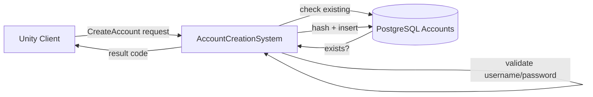

# Account Creation System

**Short description:** Asynchronous, rate-limited login-server pipeline for creating new player accounts without blocking the network thread, using AES-encrypted SRP credentials, per-IP DoS protection, and bounded async workers with main-thread response marshalling.

## Table of Contents

- [Overview](#overview)
- [Supported Platforms](#supported-platforms)
- [Features](#features)
- [Prerequisites](#prerequisites)
- [Installation / Build](#installation--build)
- [Quick Start Guides](#quick-start-guides)
- [Configuration](#configuration)
- [Usage Examples](#usage-examples)
- [Operational Checks](#operational-checks)
- [Flow Diagram](#flow-diagram)
- [Project Structure](#project-structure)
- [License](#license)

## Overview

The Account Creation system is an asynchronous, rate-limited login-server pipeline for creating new accounts without blocking the network thread. Incoming `CreateAccountBroadcast` messages are treated as ultra-fast UDP gate events: encrypted payloads are validated and queued immediately on the network thread, while AES decryption, SRP credential conversion, username validation, and database persistence are executed by background `AsyncWorkerData` workers. Responses are marshalled back to the main Unity thread through a dedicated `AccountCreationSystemMainThreadQueueData` queue container to preserve FishNet thread-safety.

Main-thread response dispatch is time-sliced by `maxMainThreadResponsesPerFrame` to avoid frame spikes under heavy ingress. The system is fully stateless — all mutable state lives in `RuntimeDataContainer` instances managed by the `DataContainerRegistry`, ensuring each system gets its own isolated data.

The request pipeline follows four stages:

1. **Network Thread (UDP Gate)** — validates connection encryption data, rejects oversized payloads, captures client IP, creates an immutable `AccountCreationRequest<NetworkConnection>`, and enqueues via bounded channel with backpressure. No decryption or DB I/O occurs here.
2. **Queue + Backpressure** — requests are dispatched through centralized `AsyncWorkerData`, keyed on `conn.ClientId` so a connection's requests stay ordered relative to one another. The rolling global hourly budget is checked (not consumed) before the enqueue. A refused enqueue, or an exhausted budget, returns `EnqueueResult.QueueFull`, which reaches the client as `ServerBusy` — deliberately the same answer, so a prober cannot detect the global cap's existence or threshold.
3. **Worker Threads** — AES-decrypt username/salt/verifier using per-field sequence-derived nonces, convert bytes to strings via `CryptoHelper.StrictUtf8` (throws `DecoderFallbackException` on malformed UTF-8), zero decrypted byte arrays with `CryptographicOperations.ZeroMemory()`, validate username against centralized `Authentication.IsAllowedUsername()` rules, validate salt/verifier length limits, persist via `IAccountService.PersistAsync()`, update runtime metrics and per-IP failure tracking.
4. **Main Thread Response** — `OnUpdate` drains queued actions through `Drain(maxMainThreadResponsesPerFrame)` and sends FishNet `ClientAuthResultBroadcast` on the main thread. On shutdown, remaining queued responses are fully drained.

## Supported Platforms

| Platform | Supported | Notes |
|----------|-----------|-------|
| Windows  | Yes       | Server runtime |
| Linux    | Yes       | Server runtime |
| WebGL    | N/A       | Server-only system — not applicable to client builds |

| Requirement      | Version / Detail |
|------------------|------------------|
| Unity            | 6.3 LTS          |
| Scripting Backend| IL2CPP           |

## Features

- **Zero-blocking network thread** — encrypted payloads are validated and queued on the network thread with no decryption or I/O
- **AES-GCM encryption** — per-field sequence-derived nonces for username, salt, and verifier with AAD binding to `AuthMessageType.CreateAccount`
- **SRP (Secure Remote Password) protocol** — credentials stored as salt + verifier; plaintext passwords never reach the server
- **Per-IP rate limiting** — configurable `ipRateLimitSeconds` cooldown between attempts from the same IP using atomic `ConcurrentDictionary.AddOrUpdate` (TOCTOU-safe)
- **Per-IP failure tracking and DoS blocking** — IPs exceeding `maxFailedAttempts` are temporarily blocked and immediately disconnected. The tracker is capped at `MaxIpFailureTrackerEntries` (50,000); at the cap `TryTrackIpFailure` returns `false` so the caller fails closed rather than silently skipping the increment, which would let an offender sit just under the block threshold indefinitely
- **Global hourly creation cap** — `maxGlobalAccountCreationsPerHour` (default 1000) bounds the blast radius of a distributed registration flood that per-IP limits cannot see. The window is UTC hours-since-epoch, held under `globalCreationsCounterLock`; the budget is *checked* at enqueue and *consumed* only after a successful persist, so failed requests do not deplete it. A value of 0 or less disables the cap and logs a loud startup `Warning`
- **Per-IP verification debounce** — `AccountVerifyBroadcast` is debounced to one attempt per IP per second by an `ExpiringKeyTracker<string>` (`VerifyRateLimitDuration`), independent of the failure counter. Before it, every verify message from an unauthenticated connection bought a decrypt and a database lookup until `maxFailedAttempts` had accumulated
- **Proxy / NAT / load balancer compatibility** — optional `useConnectionIdForRateLimiting` mode switches the rate-limiting key from IP to `conn.ClientId`; enabling it logs a startup warning that it is only safe behind a trusted reverse proxy
- **Bounded async worker backpressure** — `AsyncWorkerData` refuses admission once its outstanding-item cap is reached, preventing unbounded queue growth under attack
- **Main-thread time-slicing** — configurable `maxMainThreadResponsesPerFrame` prevents frame spikes during login waves
- **Automatic memory hygiene** — `CryptographicOperations.ZeroMemory()` scrubs decrypted byte arrays immediately after use (or on failure)
- **Strict UTF-8 validation** — `CryptoHelper.StrictUtf8` with `DecoderFallbackException` rejects malformed payloads
- **Username validation** — centralized `Authentication.IsAllowedUsername()` check before any DB call
- **Salt / verifier length validation** — `MaxSaltLength` (256) and `MaxVerifierLength` (1024) enforced before persistence
- **Encrypted field size guard** — `MaxEncryptedFieldSize` (2048 bytes) rejects oversized payloads on the network thread
- **Periodic stale-entry cleanup** — every 60 seconds, bounded sweeps evict expired rate-limit and failure entries with configurable scan/removal caps
- **Per-connection caching** — `LastSeenCacheTracker` caches IP addresses and encryption data to reduce lock pressure on `AccountManager`
- **Thread-safe runtime metrics** — `Interlocked`-backed counters for `TotalProcessed`, `TotalRejected`, `TotalFailed`
- **Database error mapping** — `UniqueViolation` and `ValidationError` mapped to `InvalidUsernameOrPassword`; other errors map to `ServerBusy`
- **Graceful shutdown** — full queue drain on deinitialize ensures clients receive final responses
- **Stateless behaviour** — all mutable state in `RuntimeDataContainer` instances; system logic is pure and testable
- **Engine-agnostic core** — interface/implementation split with generic `TConnection` parameter
- **Account verification** — encrypted verification code flow via `AccountVerifyBroadcast`; validates codes against database before marking accounts as verified
- **Per-username verification brute-force protection** — failed verification attempts tracked per username (lowercased). After `MaxVerifyFailuresPerUsername` (5) failures, further attempts are rejected for `VerifyUsernameLockoutDuration` (60 minutes). Bounded sweep (`VerifyUsernameFailureSweepMaxScan`, 64) evicts stale entries. Hard cap of `MaxVerifyUsernameFailureEntries` (50,000) prevents memory exhaustion.
- **Email verification queue** — verification codes are enqueued to the `email_queue` table and delivered asynchronously via SMTP; a background processor sends one email per sweep (configurable interval)
- **Grace-period login** — unverified accounts can log in and play immediately; login is only blocked after the verification email has been sent (`VerificationEmailSentAt`), giving the SMTP system time to process new accounts without blocking players
- **Dev/Release mode gating** — `#if UNITY_EDITOR || DEVELOPMENT_BUILD` skips 2FA setup and email verification entirely in development builds; release builds run the full pipeline
- **Single verification policy** — `AccountVerificationPolicy.IsAutoVerifyEnabled` is the one place that answers "is the email-verification gate bypassed?". Both call sites consult it: account creation (persist `verified = true` instead of queueing a code and enrolling TOTP) and the login lookup (accept an account whose `verification_email_sent_at` is stamped but which is still unverified). Without the login side honouring it, accounts created before the flag was enabled stayed locked out of a local server permanently. It fails closed on a null configuration and is compiled out entirely in production builds, so a Development `LoginServer.cfg` that leaks into a production deployment cannot re-enable the bypass — which also means a server built with the Production working environment ignores the key
- **Mandatory 2FA setup** — account creation generates a TOTP secret (encrypted at rest with the server-side master key), recovery codes (PBKDF2-SHA256 hashed), and delivers the otpauth URI and plaintext recovery codes to the client via AES-encrypted transport

## Prerequisites

- FishNet networking framework (provides `NetworkConnection`, `IBroadcast`, `ServerManager`)
- `AsyncWorkerData` runtime data container registered in the `DataContainerRegistry`
- `AccountManager` providing per-connection AES key/IV via `GetConnectionEncryptionData()`
- Database layer with `IAccountService`, `IEmailQueueService`, and `ITwoFactorRecoveryCodeService` registered in the `Database.ServiceRegistry` (Npgsql-backed)
- `email_queue` table — outbound email queue for SMTP delivery of verification codes
- SMTP configuration (`Smtp:Host`, `Smtp:Port`, `Smtp:Username`, `Smtp:Password`, `Smtp:FromAddress`, `Smtp:FromName`, `Smtp:UseSsl`) for production email delivery
- `ISmtpService` — implemented by `FishMMO.Server.Implementation.Smtp.SmtpService` (`Server/Implementation/Smtp/SmtpService.cs`), constructed lazily from `Server.Configuration` on first use. It is not registered in `Database.ServiceRegistry`
- `CryptoHelper` shared utility for AES decrypt, strict UTF-8 encoding, and AAD construction
- `Authentication` shared utility providing `IsAllowedUsername()` validation

## Installation / Build

This is an integrated module within the FishMMO server architecture. No separate installation is required.

1. The `AccountCreationSystem` ScriptableObject is created via **Assets → Create → FishMMO → Server → LoginServer → Account Creation System**.
2. Add the asset to the Login Server's `ServerBehaviour` list.
3. Ensure the following `[RequiresDataContainer]` dependencies are registered in the `DataContainerRegistry`:
   - `AsyncWorkerData`
   - `AccountCreationSystemRuntimeData`
   - `AccountCreationSystemMappingData`
   - `AccountCreationSystemMainThreadQueueData`

## Quick Start Guides

### Creating the System Asset

1. In the Unity Editor, right-click in the Project window.
2. Select **Create → FishMMO → Server → LoginServer → Account Creation System**.
3. Name the asset `AccountCreationSystem`.
4. Assign it to the Login Server's behaviour list.

### Tuning for Production

1. Set `ipRateLimitSeconds` to a value appropriate for expected registration traffic (default: `5.0`).
2. Set `maxFailedAttempts` to limit brute-force attempts (default: `5`).
3. Set `ipBlockDurationSeconds` for how long blocked IPs remain blocked (default: `300` — 5 minutes).
4. Set `maxMainThreadResponsesPerFrame` based on server frame budget (default: `100`).
5. If behind a proxy/NAT/load balancer, enable `useConnectionIdForRateLimiting`.
6. Set `maxGlobalAccountCreationsPerHour` above expected organic growth; leaving it at 0 or less disables the global DoS cap and is warned about at startup.

### Monitoring at Runtime

Query the public behaviour properties to monitor system health:

- `PendingRequestCount` — current async queue depth
- `TotalProcessed` — successful account creations since start
- `TotalRejected` — rate-limited or backpressure-rejected requests since start

## Configuration

### Inspector Fields

| Field | Type | Default | Header | Description |
|-------|------|---------|--------|-------------|
| `ipRateLimitSeconds` | `float` | `5.0` | Rate Limiting | Minimum seconds between account creation attempts from the same IP address |
| `maxFailedAttempts` | `int` | `5` | Rate Limiting | Maximum failed attempts allowed before an IP is temporarily blocked |
| `ipBlockDurationSeconds` | `float` | `300.0` | Rate Limiting | Duration in seconds that an IP remains blocked after exceeding the failed-attempt threshold (5 minutes) |
| `maxGlobalAccountCreationsPerHour` | `int` | `1000` | Rate Limiting | Rolling one-hour global ceiling on successful account creations. Excess requests are refused as `ServerBusy`. `<= 0` disables the cap and logs a startup warning. |
| `maxMainThreadResponsesPerFrame` | `int` | `100` | Main Thread Dispatch | Maximum number of queued main-thread response actions processed per frame |
| `cleanupMaxScanPerMap` | `int` | `256` | Cleanup Bounds | Maximum entries scanned per map during one maintenance sweep |
| `cleanupMaxRemovalsPerMap` | `int` | `128` | Cleanup Bounds | Maximum entries removed per map during one maintenance sweep |
| `useConnectionIdForRateLimiting` | `bool` | `false` | Proxy Compatibility | Use `conn.ClientId` instead of IP for rate limiting; enable when behind a proxy/NAT/load balancer where all clients share one IP. Safe only behind a trusted reverse proxy — enabling it logs a startup warning. |
| `emailSendIntervalSeconds` | `float` | `10.0` | Email Queue | Seconds between email queue processing sweeps; set to 0 to disable |

All tunables are clamped to safe minimums during `InitializeOnce()`:

- `ipRateLimitSeconds` → `max(0, value)`
- `maxFailedAttempts` → `max(1, value)`
- `ipBlockDurationSeconds` → `max(1, value)`
- `maxMainThreadResponsesPerFrame` → `max(1, value)`
- `cleanupMaxScanPerMap` → `max(1, value)`
- `cleanupMaxRemovalsPerMap` → `max(1, value)`

### Compile-Time Constants

| Constant | Value | Purpose |
|----------|-------|---------|
| `MaxEncryptedFieldSize` | `2048` bytes | Rejects oversized encrypted payloads on the network thread before any decryption or allocation |
| `MaxSaltLength` | `256` chars | Maximum allowed length for the decrypted SRP salt string |
| `MaxVerifierLength` | `1024` chars | Maximum allowed length for the decrypted SRP verifier string |
| `MaxVerifyFailuresPerUsername` | `5` | Maximum failed verification attempts per username before lockout. Tightened from 10: against a 900,000-value six-digit code space, 10 attempts with IP rotation gave a non-trivial success probability |
| `VerifyUsernameLockoutDuration` | `60` min | Lockout window for per-username verification failures. Extended from 30 minutes to outlast typical email-delivery windows |
| `MaxVerifyUsernameFailureEntries` | `50,000` | Hard cap on tracked username entries to prevent memory exhaustion |
| `VerifyUsernameFailureSweepMaxScan` | `64` | Maximum entries scanned per sweep for expired verification failures |
| `MaxIpFailureTrackerEntries` | `50,000` | Hard cap on the per-IP failure tracker; at the cap `TryTrackIpFailure` returns `false` and the request fails closed |
| `VerifyRateLimitDuration` | `1` s | Per-IP debounce for `AccountVerifyBroadcast`, held in an `ExpiringKeyTracker<string>` |

## Usage Examples

### Enqueuing an Account Creation Request Programmatically

```csharp
// Build an AccountCreationRequest with encrypted credentials
var request = new AccountCreationRequest<NetworkConnection>(
    conn,
    encryptedUsername,   // AES-encrypted byte[]
    encryptedSalt,       // AES-encrypted byte[]
    encryptedVerifier,   // AES-encrypted byte[]
    encryptionData,      // ConnectionEncryptionData from handshake
    ipAddress,
    seq                  // Client-sent sequence number
);

// Attempt to enqueue
bool accepted = accountCreationSystem.TryEnqueueAccountCreation(request);
if (!accepted)
{
    // Request was rate-limited, blocked, or queue full
}
```

### Querying Runtime Metrics

```csharp
// From any server system with access to the AccountCreationSystem reference
int pending   = accountCreationSystem.PendingRequestCount;
long created  = accountCreationSystem.TotalProcessed;
long rejected = accountCreationSystem.TotalRejected;
```

### Client-Side Broadcast

```csharp
// Client sends encrypted SRP credentials to the login server
var broadcast = new CreateAccountBroadcast
{
    Username = encryptedUsername,  // byte[]
    Salt     = encryptedSalt,     // byte[]
    Verifier = encryptedVerifier, // byte[]
    Seq      = sequenceNumber     // uint
};
ClientManager.Broadcast(broadcast);
```

## Operational Checks

| Check | Method | Expected Result |
|-------|--------|-----------------|
| System initializes | Assign asset to Login Server behaviour list and start server | Log: `"Initialized (RateLimit=5s, MaxFailures=5, BlockDuration=300s)"` |
| Normal account creation (dev) | Client sends valid `CreateAccountBroadcast` under `DEVELOPMENT_BUILD` | `ClientAuthResultBroadcast` with `AccountVerified` immediately; no 2FA or email |
| Normal account creation (release) | Client sends valid `CreateAccountBroadcast` in release build | 2FA setup + verification email enqueued; `AccountCreated` result; SMTP processor delivers email in background |
| Rate-limited request | Same IP sends two requests within `ipRateLimitSeconds` | `ClientAuthResultBroadcast` with `ServerBusy` (unreliable channel); `TotalRejected` increments |
| Blocked IP | IP exceeds `maxFailedAttempts` failures | Connection disconnected immediately; `TotalRejected` increments |
| Queue full | `AsyncWorkerData` bounded channel is at capacity | `ClientAuthResultBroadcast` with `ServerBusy`; `TotalRejected` increments |
| Oversized payload | Encrypted field exceeds 2048 bytes | Connection disconnected on network thread; no decryption attempted |
| Invalid encrypted data | Decryption fails (bad key/nonce/tampered) | `CryptographicException` caught; connection disconnected; failure tracked against IP |
| Malformed UTF-8 | Decrypted bytes are not valid UTF-8 | `DecoderFallbackException` caught; decrypted arrays zeroed; connection disconnected |
| Invalid username | Username fails `Authentication.IsAllowedUsername()` | `InvalidUsernameOrPassword` response; no DB call made |
| Duplicate username | DB returns `UniqueViolation` | `InvalidUsernameOrPassword` response; IP failure count incremented |
| Stale entry cleanup | 60 seconds elapse | Expired rate-limit and failure entries evicted within scan/removal bounds |
| Graceful shutdown | Server deinitializes | Remaining queued responses fully drained; broadcasts unregistered; caches cleared |
| Proxy mode | `useConnectionIdForRateLimiting = true` | Rate limiting keyed by `conn.ClientId` instead of IP address; startup logs a warning that this needs a trusted proxy |
| Global hourly cap | Exceed `maxGlobalAccountCreationsPerHour` successful creations within one UTC hour | Further requests refused with `ServerBusy` (indistinguishable from queue-full, by design) until the hour rolls over |
| Global cap disabled | Set `maxGlobalAccountCreationsPerHour` to 0 | Startup `Warning`: "the global account-creation DoS cap is DISABLED" |
| Verify flood | Same IP sends `AccountVerifyBroadcast` twice within one second | Second message dropped with no reply, no decrypt, and no database lookup |

## Flow Diagram

### High-Level Overview



```
┌─────────┐    CreateAccountBroadcast     ┌────────────────────────────────┐
│  Client  │ ──────────────────────────▶  │   Network Thread (UDP Gate)    │
└─────────┘                               │                                │
                                          │  1. Verify encryption data     │
                                          │  2. Reject oversized fields    │
                                          │  3. Capture IP address         │
                                          │  4. Build immutable request    │
                                          │  5. Check IP block list        │
                                          │  6. Atomic rate-limit check    │
                                          │  7. Enqueue to async worker    │
                                          └──────────┬─────────────────────┘
                                                     │
                                          ┌──────────▼─────────────────────┐
                                          │   AsyncWorkerData (Bounded)    │
                                          │   entityKey = conn.ClientId    │
                                          └──────────┬─────────────────────┘
                                                     │
                                          ┌──────────▼─────────────────────┐
                                          │   Worker Thread                │
                                          │                                │
                                          │  1. Consume & validate seqs    │
                                          │  2. AES-GCM decrypt fields     │
                                          │     (nonce = seq-derived)      │
                                          │  3. StrictUtf8 → strings       │
                                          │  4. ZeroMemory(decrypted[])    │
                                          │  5. IsAllowedUsername() check   │
                                          │  6. Validate salt/verifier len │
                                          │  7. IAccountService.PersistAsync│
                                          │  8. Generate TOTP + recovery   │
                                          │     codes (release builds)     │
                                          │  9. Enqueue verification email │
                                          │ 10. Consume global hour budget │
                                          │ 11. Update metrics & IP track  │
                                          │ 12. Enqueue response action    │
                                          └──────────┬─────────────────────┘
                                                     │
                                          ┌──────────▼─────────────────────┐
                                          │   Main Thread Queue            │
                                          │   (time-sliced drain per frame)│
                                          └──────────┬─────────────────────┘
                                                     │
                                          ┌──────────▼─────────────────────┐
┌─────────┐  ClientAuthResultBroadcast    │   Main Thread (OnUpdate)       │
│  Client  │ ◀────────────────────────── │   Broadcast result to client   │
└─────────┘                               └────────────────────────────────┘

Rejection paths (no worker involvement):
  • Oversized payload      → disconnect on network thread
  • Blocked IP             → disconnect on network thread
  • Rate-limited / full    → ServerBusy (unreliable) on network thread
  • Global hour cap spent  → ServerBusy (unreliable) on network thread
  • Verify debounce hit    → dropped silently on network thread
  • Crypto failure         → disconnect via main-thread queue
  • Malformed UTF-8        → disconnect via main-thread queue
```

## Project Structure

### Directory Tree

```
Server/Implementation/LoginServer/AccountCreation/
├── AccountCreationSystem.cs                     # Stateless ServerBehaviour logic and worker orchestration
├── AccountCreationSystemRuntimeData.cs          # Metrics, connection caches, cleanup timer
├── AccountCreationSystemMappingData.cs          # Per-IP rate/failure trackers (DoS/rate-limiting)
├── AccountCreationSystemMainThreadQueueData.cs  # Per-system main-thread action queue container
├── IAccountCreationPuzzleProvider.cs            # Proof-of-work scaffold — NOT wired in (see below)
└── README.md

Server/Core/LoginServer/AccountCreation/
├── IAccountCreationSystem.cs                    # Engine-agnostic public API interface
├── IAccountCreationSystemRuntimeData.cs         # Runtime metrics interface
├── IAccountCreationSystemMappingData.cs         # Mapping data interface (rate-limit/failure)
├── IAccountCreationSystemMainThreadQueueData.cs # Main-thread queue interface
└── AccountCreationRequest.cs                    # Immutable request struct (generic over TConnection)
```

#### Proof-of-work scaffold (not shipped)

`IAccountCreationPuzzleProvider`, `AccountCreationPuzzle` and `NullAccountCreationPuzzleProvider` describe a client-side proof-of-work challenge intended to make a registration flood cost the attacker CPU. Nothing in `AccountCreationSystem` calls any of it at HEAD — there is no puzzle on the wire and no client implementation. The interface exists so a production implementation can be wired in without touching call sites; `maxGlobalAccountCreationsPerHour` is the mechanism actually protecting the endpoint today.

### Inheritance Hierarchies

#### Behaviour

```
ServerBehaviour
└── AccountCreationSystem : IAccountCreationSystem<NetworkConnection>
```

#### Runtime Data Containers

```
RuntimeDataContainer
├── AccountCreationSystemRuntimeData         : IAccountCreationSystemRuntimeData
├── AccountCreationSystemMappingData         : IAccountCreationSystemMappingData
└── MainThreadQueueData (abstract)
    └── SystemMainThreadQueueData (abstract)
        └── AccountCreationSystemMainThreadQueueData : IAccountCreationSystemMainThreadQueueData
```

### Runtime Data Container Details

#### AccountCreationSystemRuntimeData

Runtime statistics, connection caches, and worker tracking. Implements `IAccountCreationSystemRuntimeData`. Counter fields use `Interlocked` for thread-safe increments from async workers.

| Property | Type | Purpose |
|----------|------|---------|
| `ConnectionIpCache` | `LastSeenCacheTracker<int, string>` | Per-connection IP address cache for ingress validation |
| `ConnectionEncryptionCache` | `LastSeenCacheTracker<int, ConnectionEncryptionData>` | Per-connection AES key/IV cache for decryption |
| `TotalProcessed` | `long` | Successfully processed account creations since start |
| `TotalRejected` | `long` | Rejected requests (rate-limited, queue full) since start |
| `TotalFailed` | `long` | Failed creations (DB/decrypt errors) since start |
| `CleanupTimer` | `float` | Accumulator for periodic mapping data cleanup sweeps |

**Lifecycle:** `InitializeOnce()` creates fresh `LastSeenCacheTracker` instances and zeros all counters. `Clear()` clears caches and resets counters without nulling references. `OnDeinitialize()` clears and nulls all references.

#### AccountCreationSystemMappingData

Thread-safe per-IP rate limiting and DoS protection data. Implements `IAccountCreationSystemMappingData`.

| Property | Type | Purpose |
|----------|------|---------|
| `IpRateLimitTracker` | `ConcurrentDictionary<string, DateTime>` | Last attempt timestamp per IP for rate limiting |
| `IpFailureTracker` | `ConcurrentDictionary<string, int>` | Failed attempt count per IP for DoS blocking |

**Thread Safety:** Both dictionaries are `ConcurrentDictionary` — safe for simultaneous access from network and worker threads.

**Lifecycle:** `InitializeOnce()` creates empty concurrent dictionaries. `Clear()` clears dictionaries without nulling (may be accessed from other threads during runtime). `OnDeinitialize()` clears and nulls references.

#### AccountCreationSystemMainThreadQueueData

Per-system main-thread action queue. Inherits from `SystemMainThreadQueueData` → `MainThreadQueueData`. Implements `IAccountCreationSystemMainThreadQueueData`.

Provides `Enqueue(Action)` and `Drain(int)` methods for marshalling async worker responses back to the Unity main thread. A separate concrete type ensures the `DataContainerRegistry` creates an independent instance for this system.

### External Integration Points

| Dependency | Role |
|------------|------|
| **FishNet** | Receives `CreateAccountBroadcast`, sends `ClientAuthResultBroadcast` |
| **AccountManager** | Provides per-connection AES key/IV needed to decrypt payloads |
| **Database Service Registry** | Resolves `IAccountService` for persistence via `PersistAsync(username, salt, verifier)` |
| **`ExpiringKeyTracker<string>`** (`Server/Core/Collections/`) | Backs the per-IP verification debounce |
| **IEmailQueueService** | Enqueues verification emails for asynchronous SMTP delivery via `EnqueueAsync` |
| **ISmtpService** | Sends emails via SMTP using server-configured credentials (lazily constructed from `IServerConfiguration`) |
| **ITwoFactorRecoveryCodeService** | Stores PBKDF2-SHA256 hashed recovery codes via `PersistManyAsync` during account creation |
| **DataContainerRegistry** | Supplies queue, runtime, mapping, and main-thread queue containers |
| **CryptoHelper** | AES decrypt, strict UTF-8 encoding, AAD construction, `AuthMessageType.CreateAccount` |
| **Authentication** | Centralized `IsAllowedUsername()` validation |

## License

This module is part of the FishMMO project and is subject to the FishMMO project license.
