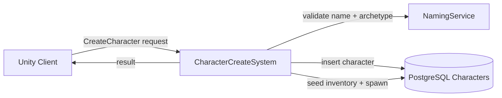

# Character Create System

**Short description:** LoginServer subsystem that validates character creation requests, initializes starting data (attributes, factions, abilities, inventory, equipment), and persists new characters atomically via a transactional database pipeline with main-thread safety for Unity API access.

## Table of Contents

- [Overview](#overview)
- [Supported Platforms](#supported-platforms)
- [Features](#features)
- [Prerequisites](#prerequisites)
- [Installation / Build](#installation--build)
- [Quick Start Guides](#quick-start-guides)
- [Configuration](#configuration)
- [Usage Examples](#usage-examples)
- [Operational Checks](#operational-checks)
- [Flow Diagram](#flow-diagram)
- [Project Structure](#project-structure)
- [License](#license)

## Overview

The Character Create system is the LoginServer subsystem responsible for handling character creation for player accounts. It validates character data, initializes starting equipment and abilities, and persists everything transactionally to the database.

The implementation uses a three-phase execution model:

- **Main thread (network handler):** receives `CharacterCreateBroadcast`, performs fast validation (character name, account binding, race template, prefab/spawnable checks via Unity API), acquires the per-connection in-flight gate, and enqueues async work.
- **Async worker:** validates immutable spawn/race data from `WorldSceneDetailsCache`, enforces the account character count limit, builds all DTOs (character, factions, abilities, inventory, equipment, attributes), creates the character row and all sub-entities inside a Unit of Work transaction, and commits atomically.
- **Main-thread queue:** marshals all network responses (`Broadcast`, `Kick`) back to the Unity main thread via `ICharacterCreateSystemMainThreadQueueData`, drained each frame in `OnUpdate` with a bounded per-frame cap (`maxMainThreadResponsesPerFrame`).

All Unity object access (templates, prefabs, `SpawnablePrefabs`) occurs on the main thread. Only database operations and DTO construction run asynchronously. Broadcast replies are marshalled back to the main thread via a thread-safe queue to guarantee FishNet/Unity API safety.

## Supported Platforms

| Platform | Supported | Notes |
|---|---|---|
| Windows | Yes | |
| Linux | Yes | |
| WebGL | N/A | Server-only module |
| Unity 6.3 LTS | Yes | Required engine version |
| IL2CPP | Yes | Supported scripting backend |

## Features

- Character name validation via `Authentication.IsAllowedCharacterName` with field-length guards (`maxSceneFieldLength`, default `256`)
- Account binding verification through `AccountManager.GetAccountNameByConnection`
- Race template and model validation via `RaceTemplate.Get<RaceTemplate>(msg.RaceTemplateID)` and `GetModelReference(msg.ModelIndex)`
- Spawnable prefab validation through `IPlayerCharacter` component check and `SpawnablePrefabs.GetObject`
- Spawn point validation against `WorldSceneDetailsCache` with per-spawner allowed-race enforcement
- Per-account character count limit enforcement (configurable `maxCharacters`, default 8)
- Starting data composition combining global templates with race-specific templates:
  - **Attributes:** from `raceTemplate.InitialAttributes.Attributes`
  - **Factions:** from `raceTemplate.InitialFaction` (allied, neutral, hostile)
  - **Abilities:** global `StartingAbilities` + `raceTemplate.StartingAbilities`
  - **Inventory:** global `StartingInventoryItems` + `raceTemplate.StartingInventoryItems`
  - **Equipment:** global `StartingEquipment` + `raceTemplate.StartingEquipment` (with `ItemGenerator` seed generation)
- Atomic transactional persistence via `IUnitOfWorkService` — character row created first to obtain ID, then all sub-entities persisted and committed together
- Database error mapping: `AlreadyExists` → `CharacterNameTaken`, `ValidationError` → `InvalidCharacterName`
- Per-connection in-flight gate (`InFlightRequests`) preventing duplicate concurrent create operations
- Per-connection post-release cooldown (`createRequestCooldownMilliseconds`, default 2000 ms) preventing sequential spam
- Bounded main-thread response drain (`maxMainThreadResponsesPerFrame`, default 100) to avoid frame spikes during login waves
- Automatic cleanup of per-connection state on disconnect via `OnRemoteConnectionStopped`
- Deinitialize drains all remaining main-thread responses so clients receive final messages

## Prerequisites

- Unity 6.3 LTS with IL2CPP scripting backend
- FishNet networking framework (FishNet.Runtime)
- FishMMO Server Core and Shared assemblies
- PostgreSQL database with Npgsql services:
  - `ICharacterService`
  - `ICharacterFactionService`
  - `ICharacterAbilityService`
  - `ICharacterItemService`
  - `ICharacterAttributeService`
  - `IUnitOfWorkService`
- Configured `WorldSceneDetailsCache` asset with scene spawn positions and allowed races
- Race templates (`RaceTemplate`) with prefabs, models, initial attributes, factions, and starting items
- Ability templates (`AbilityTemplate`), item templates (`BaseItemTemplate`), and equipment templates (`EquippableItemTemplate`) as needed

## Installation / Build

This is an integrated module within the FishMMO server architecture. No separate installation is required.

1. The `CharacterCreateSystem` ScriptableObject is created via the Unity menu:
   **Assets → Create → FishMMO → Server → LoginServer → Character Create System**
2. Assign the asset to the LoginServer's server behaviour list.
3. The system's `[RequiresDataContainer]` attributes ensure the `DataContainerRegistry` automatically creates:
   - `CharacterCreateSystemMainThreadQueueData`
   - `CharacterCreateSystemRuntimeData`
   - `AsyncWorkerData`

## Quick Start Guides

### Creating the System Asset

1. In the Unity Editor, right-click in the Project window.
2. Select **Create → FishMMO → Server → LoginServer → Character Create System**.
3. Configure the inspector fields (see [Configuration](#configuration)).
4. Add the asset to the LoginServer's behaviour collection.

### Configuring Starting Data

1. Populate `Starting Abilities` with `AbilityTemplate` references for abilities all new characters should receive.
2. Populate `Starting Inventory Items` with `BaseItemTemplate` references for default inventory contents.
3. Populate `Starting Equipment` with `EquippableItemTemplate` references for default equipped gear.
4. Assign the `World Scene Details Cache` asset containing scene spawn point definitions.
5. Race-specific starting data is configured on each `RaceTemplate` asset (attributes, factions, abilities, inventory, equipment).

### Character Creation Flow (Client)

1. Client sends a `CharacterCreateBroadcast` with `CharacterName`, `RaceTemplateID`, `ModelIndex`, `SceneName`, and `SpawnerName`.
2. Server validates and processes the request asynchronously.
3. Client receives a `CharacterCreateResultBroadcast` with the result (`Success`, `TooMany`, `InvalidCharacterName`, `CharacterNameTaken`, `InvalidSpawn`, or `Error`).
4. On success, the original `CharacterCreateBroadcast` is echoed back to the client as confirmation.

## Configuration

### Inspector Fields

| Field | Type | Default | Description |
|---|---|---|---|
| `maxMainThreadResponsesPerFrame` | `int` | `100` | Maximum character-create responses drained from the main-thread queue per frame. Caps per-frame dispatch cost to avoid frame spikes. |
| `maxCharacters` | `int` | `8` | Maximum number of characters allowed per account. Clamped to minimum 1 at initialization. |
| `createRequestCooldownMilliseconds` | `int` | `2000` | Cooldown in milliseconds between character-create requests per connection. Prevents sequential spam after the in-flight guard releases. |
| `worldSceneDetailsCache` | `WorldSceneDetailsCache` | — | Cached world scene details used for validating spawn positions and initial character creation. Must be assigned. |
| `startingAbilities` | `List<AbilityTemplate>` | empty | Global ability templates granted to all new characters on creation. |
| `startingInventoryItems` | `List<BaseItemTemplate>` | empty | Global item templates added to all new characters' inventory on creation. |
| `startingEquipment` | `List<EquippableItemTemplate>` | empty | Global equipment templates equipped on all new characters at creation. |
| `maxSceneFieldLength` | `int` | `256` | Maximum allowed length for `SceneName` and `SpawnerName` fields from client messages. Oversized fields result in a kick. |

## Usage Examples

### Broadcast Structures

**Client → Server: `CharacterCreateBroadcast`**

| Field | Type | Description |
|---|---|---|
| `CharacterName` | `string` | Name of the character to create |
| `RaceTemplateID` | `int` | Template ID for the character's race |
| `ModelIndex` | `int` | Index of the character model to use |
| `SceneName` | `string` | Name of the scene where the character will be spawned |
| `SpawnerName` | `string` | Name of the spawner to use for character placement |

**Server → Client: `CharacterCreateResultBroadcast`**

| Field | Type | Description |
|---|---|---|
| `Result` | `CharacterCreateResult` | Result of the character creation operation |

### Result Codes

| Code | Value | Meaning |
|---|---|---|
| `Success` | `0` | Character creation succeeded |
| `TooMany` | `1` | Too many characters exist for this account |
| `InvalidCharacterName` | `2` | Character name is invalid (forbidden characters, empty, etc.) |
| `CharacterNameTaken` | `3` | Character name is already taken by another player |
| `InvalidSpawn` | `4` | Spawn location or spawner is invalid |
| `Error` | `5` | An internal server error occurred during character creation |

### Starting Data Composition

Global starting templates from the system inspector are merged with race-specific templates from `RaceTemplate`:

```
Final Abilities   = system.StartingAbilities       + raceTemplate.StartingAbilities
Final Inventory   = system.StartingInventoryItems   + raceTemplate.StartingInventoryItems
Final Equipment   = system.StartingEquipment        + raceTemplate.StartingEquipment
Final Attributes  = raceTemplate.InitialAttributes.Attributes
Final Factions    = raceTemplate.InitialFaction (allied/neutral/hostile)
```

Equipment uses `ItemGenerator.Generate(1, template)` to produce a deterministic seed so item-derived stats can be reconstructed on character load.

## Operational Checks

| Check | Expected | Notes |
|---|---|---|
| System initializes | `Log.Debug("CharacterCreateSystem", "Initialized")` | Requires all three data containers registered |
| Character name validation | Rejects names failing `Authentication.IsAllowedCharacterName` | Returns `InvalidCharacterName` result |
| Scene/spawner field length | Fields > 256 characters trigger kick | `maxSceneFieldLength` inspector field |
| Account not bound | Connection kicked | `KickReason.UnusualActivity` |
| Invalid race/model/prefab | Connection kicked | `KickReason.UnusualActivity` |
| Invalid spawn scene | Returns `InvalidSpawn` | Scene not in `WorldSceneDetailsCache` |
| Invalid spawner name | Returns `InvalidSpawn` | Spawner not in scene's `InitialSpawnPositions` |
| Race not allowed at spawner | Connection kicked | `KickReason.UnusualActivity` |
| Character count at limit | Returns `TooMany` | Checked via `characterService.CountAsync` |
| Duplicate character name | Returns `CharacterNameTaken` | Database `AlreadyExists` error code |
| In-flight duplicate request | Returns `Error` | `InFlightRequests.TryAdd` fails |
| Cooldown not elapsed | Returns `Error` | `NextAllowedCreateUtcByClientId` check |
| Async worker queue full | Returns `Error` | `TryEnqueueAsyncWork` returns false |
| Unit of work commit failure | Returns `Error` | Transaction rolled back, no partial data |
| Sub-entity persist failure | Returns `Error` | Logged and reported to client |
| Client disconnects mid-request | In-flight state cleaned up | `OnRemoteConnectionStopped` removes entries |
| Deinitialize | All queued responses drained | `DrainMainThreadQueue(drainAll: true)` called |

## Flow Diagram

### High-Level Overview



```
┌────────┐  CharacterCreateBroadcast   ┌──────────────────────────────────────┐
│ Client ├─────────────────────────────►│ OnServerCharacterCreateBroadcastRcvd │
└────────┘                              │          (Main Thread)               │
                                        └──────────┬───────────────────────────┘
                                                   │
                                    ┌──────────────▼──────────────┐
                                    │  1. Validate character name  │
                                    │  2. Validate field lengths   │
                                    │  3. Resolve account name     │
                                    │  4. Resolve DB services      │
                                    │  5. Validate RaceTemplate    │
                                    │  6. Validate prefab/spawnable│
                                    │  7. Acquire in-flight gate   │
                                    └──────────────┬──────────────┘
                                                   │ TryEnqueueAsyncWork
                                    ┌──────────────▼──────────────┐
                                    │  ProcessCharacterCreateAsync │
                                    │       (Worker Thread)        │
                                    └──────────────┬──────────────┘
                                                   │
                                    ┌──────────────▼──────────────┐
                                    │  1. Validate spawn scene     │
                                    │  2. Validate spawner name    │
                                    │  3. Validate allowed race    │
                                    │  4. Check character count    │
                                    │  5. Build all DTOs           │
                                    │  6. Begin Unit of Work       │
                                    │  7. Create character row     │
                                    │  8. Persist sub-entities     │
                                    │     (factions, abilities,    │
                                    │      inventory, equipment,   │
                                    │      attributes)             │
                                    │  9. Commit transaction       │
                                    └──────────────┬──────────────┘
                                                   │ TryEnqueueMainThread
                                    ┌──────────────▼──────────────┐
                                    │   DrainMainThreadQueue       │
                                    │      (OnUpdate / frame)      │
                                    │   Broadcast result to client │
                                    └──────────────┬──────────────┘
                                                   │
                                    ┌──────────────▼──────────────┐
                                    │         EndCreateRequest     │
                                    │  Release in-flight gate      │
                                    │  Set cooldown timestamp      │
                                    └─────────────────────────────┘
```

## Project Structure

### Directory Tree

```
Server/Implementation/LoginServer/CharacterCreate/
├── CharacterCreateSystem.cs                    # Main system: validation, async pipeline, DTO building, persistence
├── CharacterCreateSystemRuntimeData.cs         # Per-connection in-flight gate and cooldown tracking
├── CharacterCreateSystemMainThreadQueueData.cs # Per-system main-thread action queue container
└── README.md

Shared/Implementation/Network/CharacterCreate/
├── CharacterCreateBroadcasts.cs                # CharacterCreateBroadcast and CharacterCreateResultBroadcast
└── CharacterCreateResult.cs                    # CharacterCreateResult enum (Success, TooMany, etc.)

Server/Core/LoginServer/CharacterCreate/
├── ICharacterCreateSystem.cs                   # Engine-agnostic public API interface
└── ICharacterCreateSystemMainThreadQueueData.cs # Main-thread queue data interface
```

### Inheritance Hierarchies

**System Behaviour:**

```
ServerBehaviour
└── CharacterCreateSystem : ICharacterCreateSystem
```

**Runtime Data Containers:**

```
RuntimeDataContainer
├── CharacterCreateSystemRuntimeData
└── MainThreadQueueData (abstract)
    └── SystemMainThreadQueueData (abstract)
        └── CharacterCreateSystemMainThreadQueueData : ICharacterCreateSystemMainThreadQueueData
```

**Prepared DTO Structs (private, inside CharacterCreateSystem):**

```
PreparedAttributeEntry   — readonly struct { TemplateID, Value, IsResourceAttribute }
PreparedFactionEntry     — readonly struct { TemplateID, Value }
PreparedAbilityEntry     — readonly struct { TemplateID, AbilityEvents }
PreparedInventoryEntry   — readonly struct { TemplateID, Slot }
PreparedEquipmentEntry   — readonly struct { TemplateID, Slot, Seed }
```

### Runtime Data Container Details

**`CharacterCreateSystemRuntimeData`**

Mutable runtime state for the character creation system.

| Property | Type | Purpose |
|---|---|---|
| `InFlightRequests` | `ConcurrentDictionary<int, byte>` | Per-connection in-flight gate preventing duplicate concurrent create operations |
| `NextAllowedCreateUtcByClientId` | `ConcurrentDictionary<int, DateTime>` | Per-connection post-release cooldown timestamp; enforces `createRequestCooldownMilliseconds` gap between successive create attempts |

Thread safety: `ConcurrentDictionary` allows safe access from both network and worker threads.

Lifecycle: `InitializeOnce()` creates empty dictionaries → `Clear()` clears entries → `Deinitialize()` clears and nulls references.

**`CharacterCreateSystemMainThreadQueueData`**

Per-system main-thread action queue. Inherits from `SystemMainThreadQueueData` (which inherits `MainThreadQueueData`). Implements `ICharacterCreateSystemMainThreadQueueData`.

Provides `Enqueue(Action)` and `Drain(int)` methods for marshalling async worker responses back to the Unity main thread. A separate concrete type ensures the `DataContainerRegistry` creates an independent instance for this system.

### Runtime Data Dependencies

`CharacterCreateSystem` declares three runtime container dependencies via attributes:

| Container | Attribute | Responsibility |
|---|---|---|
| `CharacterCreateSystemRuntimeData` | `[RequiresDataContainer]` | Per-connection in-flight gate and cooldown tracking |
| `AsyncWorkerData` | `[RequiresDataContainer]` | Runs DB-heavy work off the network/main thread with bounded backpressure-aware queuing |
| `CharacterCreateSystemMainThreadQueueData` | `[RequiresDataContainer]` | Marshals thread-unsafe FishNet/Unity operations back to the main thread |

## License

This module is part of the FishMMO project and is subject to the FishMMO project license.
