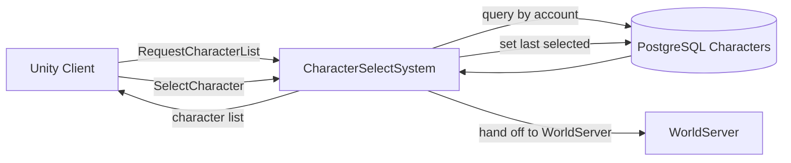

# Character Select System

**Short description:** Login-server subsystem that handles character listing, deletion, and selection for authenticated player accounts, with per-connection in-flight gating, async database operations, and main-thread response marshalling.

## Table of Contents

- [Overview](#overview)
- [Supported Platforms](#supported-platforms)
- [Features](#features)
- [Prerequisites](#prerequisites)
- [Installation / Build](#installation--build)
- [Quick Start Guides](#quick-start-guides)
- [Configuration](#configuration)
- [Usage Examples](#usage-examples)
- [Operational Checks](#operational-checks)
- [Flow Diagram](#flow-diagram)
- [Project Structure](#project-structure)
- [License](#license)

## Overview

The Character Select system manages the character list, delete, and select workflows on the login server. It keeps the network handler path lightweight by queuing database-heavy work onto `AsyncWorkerData`, then marshals all FishNet broadcast responses back onto the Unity main thread through a dedicated main-thread queue container (`CharacterSelectSystemMainThreadQueueData`).

Per-connection in-flight gating prevents a single client from queuing multiple concurrent operations, and a post-release cooldown (`RequestCooldownMilliseconds = 2000`) prevents rapid sequential spam. List requests have their own gate and cooldown (`InFlightListRequests` / `NextAllowedListRequestUtc`), separate from select/delete: sharing one pair meant the list request the client issues on arrival armed a two-second cooldown that then refused the player's very next click on Play. Bounded main-thread response draining (`maxMainThreadResponsesPerFrame`) avoids frame spikes.

### Threading Model

| Thread | Work |
|--------|------|
| Network / Main | Broadcast receive, fast validation, enqueue async work |
| Async Workers | Database fetch / delete / select operations |
| Main Thread | FishNet `Broadcast` and `DisconnectWithNotice` operations via queued actions |

`OnUpdate` drains queued main-thread actions every frame, capped by `maxMainThreadResponsesPerFrame`. `OnDeinitialize` drains all remaining actions so clients receive final messages.

### Broadcast Protocol

| Broadcast | Direction | Purpose |
|-----------|-----------|---------|
| `CharacterRequestListBroadcast` | Client → Server | Request list of characters for the authenticated account |
| `CharacterListBroadcast` | Server → Client | Response containing `CharacterDetails[]` |
| `CharacterListResultBroadcast` | Server → Client | Sent instead of a list when the request cannot be answered: `CharacterListResult.Busy` or `.Failed` |
| `ServerBusyBroadcast` | Server → Client | Accompanies `Busy` when the async worker pool refused the work (`SendServerBusy`) |
| `CharacterDeleteBroadcast` | Client → Server | Request deletion of a named character |
| `CharacterDeleteBroadcast` | Server → Client | Echo confirming deletion (character name) or failure (empty name) |
| `CharacterSelectBroadcast` | Client → Server | Request selection of a named character |
| `CharacterSelectResultBroadcast` | Server → Client | Terminal answer for every selection: `Success`, `OtherCharacterInWorld` (with the offending `CharacterName`), or `Failed` |
| `ServerListBroadcast` | Server → Client | Sent after a successful selection, containing `WorldServerDetails[]` of active world servers |

### Failure Response Behaviour

All request flows guarantee a response to the client, even on failure, to prevent indefinite client hangs:

- **Character List:** An empty `CharacterListBroadcast` is deliberately *not* used as the failure answer — it is indistinguishable from "this account has no characters", so a database outage reached the player as their characters having been deleted. A refusal sends `CharacterListResultBroadcast` with `Busy` (cooldown, in-flight duplicate, or a saturated worker pool) or `Failed` (service unavailable or the fetch itself failed).
- **Character Select:** Every selection gets a `CharacterSelectResultBroadcast`, success included — the client arms a reply deadline when it sends the request and only this message ends it. Failure paths (service unavailability, UoW failure, `SetSelectedAsync` failure, ownership verification failure, commit failure, world server fetch failure) send `Failed`. A character already in the world on the same account sends `OtherCharacterInWorld` carrying that character's name; re-selecting the *same* character is allowed, since that is how a player rejoins a combat-logged body. `FetchInWorldCharacterAsync` fails closed: a failed read refuses the selection rather than falling through it.
- **Character Delete:** On failure, a `CharacterDeleteBroadcast` with an empty `CharacterName` is sent. The in-flight guard releases so the user can retry.
- **Protocol violations:** A select request naming a character that does not exist, or one owned by another account, ends the connection with `DisconnectWithNotice(conn, DisconnectNoticeReason.ProtocolViolation, terminal: true)` — the client is told why before the socket closes. There are no `NetworkConnection.Kick` calls in this system.

## Supported Platforms

| Platform | Supported | Notes |
|----------|-----------|-------|
| Windows | Yes | |
| Linux | Yes | |
| WebGL | N/A | Server-only subsystem |

**Engine:** Unity 6.3 LTS
**Scripting Backend:** IL2CPP

## Features

- **Character list retrieval** — async database fetch via `ICharacterService.FetchManyAsync`, maps `CharacterData` rows to `CharacterDetails` (name, scene, race template ID, and `IsCombatLogged` from `CharacterFlags.IsCombatLogged`), sent as `CharacterDetails[]`
- **Equipment preview not populated** — `CharacterDetails.EquippedItems` exists on the DTO for dressing the select-screen preview model, but this system leaves it `null`, which the field documents as "not sent" (distinct from an empty array meaning "wearing nothing"). No server code populates it at HEAD.
- **Character deletion** — atomic Unit of Work transaction covering sub-entity cleanup and soft-delete of the character row
- **Character selection** — atomic Unit of Work transaction with defense-in-depth ownership verification and `SetSelectedAsync`
- **World server routing** — after successful selection, fetches active world servers via `IWorldServerService.FetchActiveAsync` and sends `ServerListBroadcast`
- **Per-connection in-flight gating** — `ConcurrentDictionary<int, byte>` prevents duplicate concurrent operations per connection
- **Post-release cooldown** — 2-second gap between successive requests enforced via `NextAllowedRequestUtc`, with `NextAllowedListRequestUtc` tracking list requests independently
- **Separate list gate** — list requests use `InFlightListRequests` / `NextAllowedListRequestUtc` so the automatic list fetch on arrival cannot throttle the deliberate selection that immediately follows it
- **Single-character-in-world enforcement** — `ICharacterService.FetchInWorldCharacterAsync` refuses a selection while another character on the account is still in the world; the read fails closed
- **Bounded main-thread draining** — configurable `maxMainThreadResponsesPerFrame` to time-slice response dispatch
- **Character name validation** — `Authentication.IsAllowedCharacterName` check on delete and select before any async work
- **Disconnect cleanup** — `OnRemoteConnectionStopped` removes in-flight and cooldown entries for disconnected clients
- **Configurable deletion retention** — `KeepDeleteData` toggle controls whether sub-entity rows are preserved or purged
- **Sub-entity deletion** — when `KeepDeleteData` is false, deletes abilities, achievements, attributes, buffs, factions, friends, hotkeys, items, known abilities, pets, pet attributes, pet buffs, waypoints, and archetypes (guild/party memberships handled by `CharacterService.DeleteAsync`). Inventory, bank and equipment share one table, so `ICharacterItemService.DeleteAsync` covers all three in a single statement. `ICharacterWaypointService.DeleteAsync` takes no version — the waypoint pages are a merge-only bitmask with no version stream. Deletes run with `deleteVersion = long.MaxValue` to unconditionally pass the per-entity version guards, and failures are logged but do not abort: the character-row soft-delete is the critical operation and orphaned sub-entity rows are harmless.

## Prerequisites

- FishMMO server framework with `ServerBehaviour` base class
- FishNet networking library
- PostgreSQL database with Npgsql services implementing:
  - `ICharacterService`
  - `IWorldServerService`
  - `IUnitOfWorkService`
  - `ICharacterAbilityService`, `ICharacterAchievementService`, `ICharacterAttributeService`, `ICharacterBuffService`, `ICharacterFactionService`, `ICharacterFriendService`, `ICharacterHotkeyService`, `ICharacterItemService`, `ICharacterKnownAbilityService`, `ICharacterPetService`, `ICharacterPetAttributeService`, `ICharacterPetBuffService`, `ICharacterWaypointService`, `ICharacterArchetypeService`
- `AccountManager` for connection-to-account mapping
- `AsyncWorkerData` runtime data container for background task dispatch
- `DataContainerRegistry` with required containers registered

## Installation / Build

This is an integrated module within the FishMMO server framework. No separate installation is required.

1. The `CharacterSelectSystem` ScriptableObject is created via **Assets → Create → FishMMO → Server → LoginServer → Character Select System**.
2. Add the created asset to the login server's `ServerBehaviour` list.
3. The `DataContainerRegistry` automatically creates required runtime data containers declared via `[RequiresDataContainer]` attributes.

## Quick Start Guides

### Server Operator

1. Create the `CharacterSelectSystem` ScriptableObject asset via the Unity menu.
2. Assign it to the login server behaviour list.
3. Configure inspector fields (see [Configuration](#configuration)).
4. Start the login server — the system registers broadcast handlers on `InitializeOnce`.
5. Authenticated clients can now request character lists, delete characters, and select characters.

### Developer

1. `CharacterSelectSystem` extends `ServerBehaviour` and implements `ICharacterSelectSystem`.
2. Broadcast handlers are registered in `InitializeOnce` and unregistered in `OnDeinitialize`.
3. All async database work is dispatched via `TryEnqueueAsyncWork` onto `AsyncWorkerData`.
4. All FishNet broadcasts are marshalled back to the main thread via `TryEnqueueMainThread<ICharacterSelectSystemMainThreadQueueData>`.
5. Per-connection state is stored in `CharacterSelectSystemRuntimeData` — always release in-flight gates in `finally` blocks.

## Configuration

### Inspector Fields (`CharacterSelectSystem`)

| Field | Type | Default | Description |
|-------|------|---------|-------------|
| `maxMainThreadResponsesPerFrame` | `int` | `100` | Maximum queued main-thread response actions processed per frame. Clamped to minimum of 1 on initialization. |
| `keepDeleteData` | `bool` | `true` | If true, deleted character sub-entity rows are preserved in the database for recovery or auditing. If false, all sub-entity data is purged before soft-deleting the character row. |

### Constants

| Constant | Value | Description |
|----------|-------|-------------|
| `RequestCooldownMilliseconds` | `2000` | Minimum interval in milliseconds between successive character-select requests from the same connection. |

### Runtime Data: `CharacterSelectSystemRuntimeData`

| Property | Type | Purpose |
|----------|------|---------|
| `InFlightRequests` | `ConcurrentDictionary<int, byte>` | Per-connection in-flight gate preventing duplicate concurrent select/delete operations |
| `NextAllowedRequestUtc` | `ConcurrentDictionary<int, DateTime>` | Per-connection post-release cooldown timestamp for select/delete; enforces `RequestCooldownMilliseconds` |
| `InFlightListRequests` | `ConcurrentDictionary<int, byte>` | Per-connection in-flight gate for list requests, tracked separately from select/delete |
| `NextAllowedListRequestUtc` | `ConcurrentDictionary<int, DateTime>` | Per-connection cooldown timestamp for list requests |

**Thread Safety:** `ConcurrentDictionary` allows safe access from both network and worker threads.

**Lifecycle:**
- `InitializeOnce()` — creates empty dictionaries.
- `Clear()` — clears dictionary entries.
- `OnDeinitialize()` — clears and nulls references.

### Runtime Data Dependencies

`CharacterSelectSystem` declares three required containers via attributes:

| Container | Responsibility |
|-----------|----------------|
| `CharacterSelectSystemRuntimeData` | Per-connection in-flight gate and cooldown for list/select/delete request deduplication |
| `AsyncWorkerData` | Executes database operations in background worker threads |
| `CharacterSelectSystemMainThreadQueueData` | Marshals network-safe response actions to the main thread |

## Usage Examples

### Character List Request (Client → Server → Client)

```
Client sends: CharacterRequestListBroadcast { }
Server validates account, fetches characters from DB
Server sends: CharacterListBroadcast { Characters = [ { CharacterName, SceneName, RaceTemplateID, IsCombatLogged }, ... ] }
Server sends: CharacterListResultBroadcast { Result = Busy }    // refused: cooldown / in-flight / worker pool full
Server sends: CharacterListResultBroadcast { Result = Failed }  // service unavailable or fetch failed
```

### Character Delete Request (Client → Server → Client)

```
Client sends: CharacterDeleteBroadcast { CharacterName = "MyHero" }
Server validates account + ownership, runs atomic delete transaction
Server sends: CharacterDeleteBroadcast { CharacterName = "MyHero" }   // success
Server sends: CharacterDeleteBroadcast { CharacterName = "" }         // failure
```

### Character Select Request (Client → Server → Client)

```
Client sends: CharacterSelectBroadcast { CharacterName = "MyHero" }
Server validates account + ownership, refuses if another character is in the world,
sets selected, fetches world servers
Server sends: CharacterSelectResultBroadcast { Result = Success, CharacterName = "MyHero" }
Server sends: ServerListBroadcast { Servers = [ { Name, Port, CharacterCount, Locked }, ... ] }

// refusals
Server sends: CharacterSelectResultBroadcast { Result = OtherCharacterInWorld, CharacterName = "MyOtherHero" }
Server sends: CharacterSelectResultBroadcast { Result = Failed, CharacterName = "MyHero" }
```

## Operational Checks

| Check | How to Verify | Expected Result |
|-------|---------------|-----------------|
| System initializes | Login server startup logs | `"CharacterSelectSystem: Initialized"` in debug log |
| Character list works | Authenticate and request character list | Client receives `CharacterListBroadcast` with character entries |
| Character deletion works | Delete a character from the selection screen | Client receives `CharacterDeleteBroadcast` echo with character name |
| Character selection works | Select a character | Client receives `ServerListBroadcast` with active world servers |
| In-flight gating | Rapid-fire requests from same connection | Only one request processed at a time; subsequent requests silently dropped |
| Cooldown enforcement | Send request immediately after previous completes | Request rejected until 2-second cooldown expires |
| Ownership verification | Attempt to select/delete another account's character | Connection closed via `DisconnectWithNotice(DisconnectNoticeReason.ProtocolViolation, terminal: true)` (select) or `CharacterDeleteBroadcast` with an empty name (delete) |
| Disconnect cleanup | Client disconnects mid-flow | In-flight and cooldown entries removed for that connection |
| Failure responses | DB service unavailable or query failure | Client receives `CharacterListResultBroadcast`/`CharacterSelectResultBroadcast` with a reason — never an empty list, never silence |
| Second character in world | Select character B while A is still in the world | `CharacterSelectResultBroadcast { OtherCharacterInWorld, CharacterName = A }`; re-selecting A itself is allowed |
| KeepDeleteData=false | Delete character with retention disabled | All sub-entity rows purged before character soft-delete |

## Flow Diagram

### High-Level Overview



### Character List Flow

```
Client                    LoginServer                        Database
  |                           |                                 |
  |-- CharacterRequestList -->|                                 |
  |                           |-- Validate account ------------>|
  |                           |-- Enqueue async work            |
  |                           |       |                         |
  |                           |       |-- FetchManyAsync ------>|
  |                           |       |<-- CharacterData[] -----|
  |                           |       |                         |
  |                           |<- Enqueue main-thread response  |
  |<-- CharacterListBroadcast |                                 |
```

### Character Delete Flow

```
Client                    LoginServer                        Database
  |                           |                                 |
  |-- CharacterDelete ------->|                                 |
  |                           |-- Validate account + name       |
  |                           |-- Acquire in-flight gate        |
  |                           |-- Enqueue async work            |
  |                           |       |                         |
  |                           |       |-- BeginAsync (UoW) ---->|
  |                           |       |-- FetchAsync ---------->|
  |                           |       |<-- CharacterData -------|
  |                           |       |-- Verify ownership      |
  |                           |       |-- Delete sub-entities*->|
  |                           |       |-- DeleteAsync --------->|
  |                           |       |-- CommitAsync --------->|
  |                           |       |                         |
  |                           |<- Enqueue main-thread response  |
  |<-- CharacterDeleteBroadcast (echo)                          |
  |                           |-- Release in-flight gate        |

* Sub-entity deletion only when KeepDeleteData == false.
  Deletes: abilities, achievements, attributes, buffs, factions,
  friends, hotkeys, items (inventory + bank + equipment in one
  statement), known abilities, pets, pet attributes, pet buffs,
  waypoints, archetypes. Guild/party handled by CharacterService.
```

### Character Select Flow

```
Client                    LoginServer                        Database
  |                           |                                 |
  |-- CharacterSelect ------->|                                 |
  |                           |-- Validate account + name       |
  |                           |-- Acquire in-flight gate        |
  |                           |-- Enqueue async work            |
  |                           |       |                         |
  |                           |       |-- BeginAsync (UoW) ---->|
  |                           |       |-- FetchAsync ---------->|
  |                           |       |<-- CharacterData -------|
  |                           |       |-- Verify ownership      |
  |                           |       |-- FetchInWorldCharacter>|
  |                           |       |   (fail-closed refusal) |
  |                           |       |-- SetSelectedAsync ---->|
  |                           |       |-- FetchByAccountAsync ->|
  |                           |       |   (defense-in-depth)    |
  |                           |       |-- CommitAsync --------->|
  |                           |       |                         |
  |                           |       |-- FetchActiveAsync ---->|
  |                           |       |<-- WorldServerData[] ---|
  |                           |       |                         |
  |                           |<- Enqueue main-thread response  |
  |<-- CharacterSelectResultBroadcast (Success)                 |
  |<-- ServerListBroadcast    |                                 |
  |                           |-- Release in-flight gate        |
```

## Project Structure

### Directory Tree

```
Server/Implementation/LoginServer/CharacterSelect/
├── CharacterSelectSystem.cs                    # Login-server character list/delete/select behaviour
├── CharacterSelectSystemRuntimeData.cs         # Per-connection in-flight gate and cooldown container
├── CharacterSelectSystemMainThreadQueueData.cs # Per-system main-thread action queue container
└── README.md

Server/Core/LoginServer/CharacterSelect/
├── ICharacterSelectSystem.cs                   # Engine-agnostic public API interface
└── ICharacterSelectSystemMainThreadQueueData.cs # Main-thread queue data interface

Shared/Implementation/Network/CharacterSelect/
├── CharacterSelectBroadcasts.cs                # Broadcast structs + CharacterListResult / CharacterSelectResult enums
└── CharacterDetails.cs                         # CharacterDetails and EquippedItemEntry

Shared/Implementation/Network/
├── WorldServerDetails.cs                       # Serializable world server details (name, address, port, etc.)
└── ServerSelect/ServerSelectBroadcasts.cs      # ServerListBroadcast struct
```

### Inheritance Hierarchies

#### Behaviour

```
ServerBehaviour
└── CharacterSelectSystem : ICharacterSelectSystem
```

#### Runtime Data Containers

```
RuntimeDataContainer
├── CharacterSelectSystemRuntimeData
└── MainThreadQueueData (abstract)
    └── SystemMainThreadQueueData (abstract)
        └── CharacterSelectSystemMainThreadQueueData : ICharacterSelectSystemMainThreadQueueData
```

#### Broadcast Structs

```
IBroadcast
├── CharacterRequestListBroadcast
├── CharacterListBroadcast          → CharacterDetails[]
├── CharacterListResultBroadcast    → CharacterListResult (Busy = 0, Failed = 1)
├── CharacterDeleteBroadcast        → string CharacterName
├── CharacterSelectBroadcast        → string CharacterName
├── CharacterSelectResultBroadcast  → CharacterSelectResult (Success = 0,
│                                     OtherCharacterInWorld = 1, Failed = 2)
│                                     + string CharacterName
└── ServerListBroadcast             → WorldServerDetails[]
```

#### Shared Data Classes

```
CharacterDetails
├── CharacterName   : string
├── SceneName       : string
├── RaceTemplateID  : int
├── IsCombatLogged  : bool
└── EquippedItems   : EquippedItemEntry[]   (left null by this system)

EquippedItemEntry
├── Slot            : ItemSlot
└── TemplateID      : int

WorldServerDetails
├── Name            : string
├── Port            : ushort
├── CharacterCount  : int
└── Locked          : bool
```

### External Integration Points

| Dependency | Purpose |
|------------|---------|
| `AccountManager` | Validates connection ownership via `GetAccountNameByConnection` |
| `Database Service Registry` | Resolves all character / world / unit-of-work services |
| `ICharacterService` | Fetch list, fetch by name, fetch by account, set selected, delete character |
| `IWorldServerService` | Supplies active world server list after successful selection |
| `IUnitOfWorkService` | Provides atomic transaction boundaries for delete and select operations |
| `AsyncWorkerData` | Centralized background task queue for async database work |
| `CharacterSelectSystemMainThreadQueueData` | Guarantees main-thread-safe network dispatch |
| `Authentication` | Character name validation via `IsAllowedCharacterName` |
| `ICharacterWaypointService`, `ICharacterArchetypeService` | Sub-entity cleanup on delete when `KeepDeleteData` is false |

## License

This module is part of the FishMMO project and is subject to the FishMMO project license.
