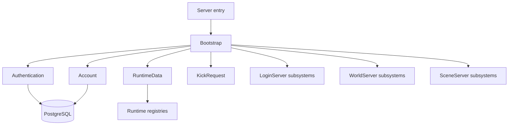

# Server Implementation

**Short description:** Concrete server-side runtime layer that composes core services, FishNet networking, database access, authentication, and modular server behaviours into running Login, World, and Scene server processes.

## Table of Contents

- [Overview](#overview)
- [Supported Platforms](#supported-platforms)
- [Features](#features)
- [Prerequisites](#prerequisites)
- [Installation / Build](#installation--build)
- [Quick Start Guides](#quick-start-guides)
- [Configuration](#configuration)
- [Usage Examples](#usage-examples)
- [Operational Checks](#operational-checks)
- [Flow Diagram](#flow-diagram)
- [Project Structure](#project-structure)
- [License](#license)

## Overview

The `Server` class (`Server.cs`) is the composition root for every FishMMO server process. It inherits `MonoBehaviour` and implements `IServer<INetworkManagerWrapper, NetworkConnection, IServerBehaviour>`, `IServer<INetworkManagerWrapper, NetworkConnection, IRuntimeDataContainer>`, and `IPeriodicUpdateSystem`.

At startup the composition root:

1. Resolves a `NetworkManager` from the scene.
2. Builds `IServerConfiguration`, `IServerEvents`, `ICoreServer`, and `INetworkManagerWrapper`.
3. Fetches the external IP address asynchronously.
4. Once the IP is available, initialises the core server, database orchestrator, address provider, authenticator, account manager, runtime data containers (auto-discovered via `RequiresDataContainerAttribute`), and server behaviours.
5. Disables KCC auto-simulation and starts the FishNet server.

During runtime, `LateUpdate` drives two loops: the behaviour update loop (snapshot-safe against registration mutations) and the periodic callback system (enumeration-complete-before-invoke pattern). Shutdown is idempotent and tears down subsystems in reverse order.

The Implementation layer sits between the abstract `Server.Core` interfaces and the concrete FishNet/Unity runtime. Each server type (Login, World, Scene) is loaded as an Addressable scene; `ServerLauncher` selects which scene(s) to load based on command-line arguments or a configurable boot list.

### Sub-System Organisation

| Sub-System | Description |
|---|---|
| **Account** | Account management strategies — SRP-based (login) and token-based (world/scene). |
| **Authentication** | Server authenticator hierarchy — base, SRP (`ServerAuthenticator`), and token (`TokenServerAuthenticator`). |
| **RuntimeData** | Shared runtime data containers, factory, and registry for mutable per-system state. |
| **LoginServer** | Login-server-specific systems: account creation, character create/select, server select, and the login server lifecycle. |
| **World** | World and scene server systems organised into `WorldServer/`, `SceneServer/`, and `KickRequest/`. |

## Supported Platforms

| Platform | Supported | Notes |
|---|---|---|
| Windows | Yes | Full support including console title via `SetConsoleTitle` (kernel32) |
| Linux | Yes | Process name set via `prctl` (libc.so.6) |
| macOS | Yes | Process title set via `setproctitle` (libc.dylib) |
| WebGL | N/A | Server-only — not applicable |

| Requirement | Version |
|---|---|
| Unity | 6.3 LTS |
| Scripting Backend | IL2CPP |
| FishNet | Runtime dependency |

## Features

- **Composition-root architecture** — `Server` wires core services, networking, database, authentication, behaviours, and data containers in a single orchestrated startup.
- **Modular server behaviours** — `ServerBehaviour` (ScriptableObject-based) provides a plug-in lifecycle: `InitializeOnce`, `OnUpdate`, `OnDeinitialize`.
- **Auto-discovered runtime data containers** — behaviours declare `[RequiresDataContainer(typeof(T))]`; the server discovers, deduplicates, priority-sorts, and creates containers automatically.
- **Generic component registries** — `ServerComponentRegistry<TNet, TConn, TComponent>` registers components under concrete type and all `IServerComponent`-derived interfaces for dependency lookup.
- **Network abstraction** — `INetworkManagerWrapper` / `FishNetNetworkWrapper` decouple the server from FishNet internals, exposing start/stop, transport config, broadcast registration, and authenticator attachment.
- **Periodic callback system** — `IPeriodicUpdateSystem` with register/unregister/update-interval; enumeration-safe dispatch; callbacks receive their registered interval, not frame delta.
- **Main-thread queue helper** — generic `MainThreadQueueHelper.Drain<T>` / `TryEnqueue<T>` for marshalling async work back to Unity's main thread.
- **Address resolution** — `ServerAddressProvider` resolves IPv4/IPv6 bind addresses from the transport layer with optional overrides.
- **Physics ticker** — `PhysicsTicker` hooks FishNet's `OnPrePhysicsSimulation` to manually advance a scene's `PhysicsScene`.
- **Server launcher** — `ServerLauncher` loads Addressable scenes by command-line argument (`LOGIN`, `WORLD`, `SCENE`) or a configurable boot list.
- **Window title updater** — `ServerWindowTitleUpdater` periodically sets the OS process/console title with transport type, connection state, and client count (Windows, Linux, macOS).
- **Dual account manager strategy** — `SrpAccountManager` for SRP-authenticated login servers; `TokenAccountManager` for token-authenticated world/scene servers.
- **Dual authenticator strategy** — `ServerAuthenticator` (SRP) and `TokenServerAuthenticator` selected at startup based on scene type.
- **Idempotent shutdown** — `PerformShutdown` runs once via `hasShutdown` flag, cleaning up behaviours, containers, authenticator workers, network, database, and core server in reverse order.
- **KCC integration** — `KinematicCharacterSystem.AutoSimulation` set to `false` for deterministic server-driven simulation.
- **Snapshot-safe behaviour dispatch** — behaviour list is snapshotted before `OnLateUpdate` dispatch to prevent `InvalidOperationException` if behaviours register or unregister during update.
- **Cached delegate names** — `PeriodicCallbackData.CallbackName` caches the reflection-derived display name at construction time; no runtime reflection in any log path.

## Prerequisites

- Unity 6.3 LTS with IL2CPP scripting backend.
- FishNet networking framework (imported via Plugins).
- KinematicCharacterController package.
- PostgreSQL database (configured via `appsettings.json`).
- ZString for zero-allocation string formatting.
- Addressable Assets for scene and template loading.
- `FishMMO.Server.Core` and `FishMMO.Shared` assemblies.

## Installation / Build

This is an integrated module within the FishMMO Unity project. No separate installation is required.

1. Open the FishMMO-Unity project in Unity 6.3 LTS.
2. Ensure all dependencies (FishNet, KCC, ZString, Addressables) are imported.
3. Configure `appsettings.json` for database connection strings.
4. Build server executables via Unity Build Settings with the desired server scenes.
5. Alternatively, enter Play Mode with the `ServerLauncher` bootstrap scene to run locally.

## Quick Start Guides

### Running in the Editor

1. Open the bootstrap scene containing `ServerLauncher`.
2. Ensure the `BootList` field on `ServerLauncher` includes the desired server scenes (default: `LoginServer`, `WorldServer`, `SceneServer`).
3. Enter Play Mode. The launcher loads scenes as Addressables and each `Server` MonoBehaviour self-initialises.

### Running a Standalone Build

```bash
# Launch all servers (default boot list)
./FishMMO-Server

# Launch a specific server type
./FishMMO-Server LOGIN
./FishMMO-Server WORLD
./FishMMO-Server SCENE
```

The second command-line argument selects the server type. If no argument is provided, all scenes in the boot list are loaded.

### Adding a New Server Behaviour

1. Create a class extending `ServerBehaviour`.
2. Implement `InitializeOnce()`, `OnDeinitialize()`, and optionally `OnUpdate(float deltaTime)`.
3. If the behaviour needs mutable runtime state, create a `RuntimeDataContainer` subclass and annotate the behaviour with `[RequiresDataContainer(typeof(YourData))]`.
4. Create a ScriptableObject asset for the behaviour and add it to the `Server` component's `serverBehaviours` list.

## Configuration

| Setting | Source | Description |
|---|---|---|
| `AddressOverride` | `Server` inspector field | Optional bind address override |
| `PortOverride` | `Server` inspector field | Optional bind port override |
| `BootList` | `ServerLauncher` inspector field | Array of scene names to load at startup |
| `updateRate` | `ServerWindowTitleUpdater` inspector field | Window title refresh interval (seconds, default 15) |
| Database connection | `appsettings.json` | PostgreSQL connection string |
| Environment | `ASPNETCORE_ENVIRONMENT` or `DOTNET_ENVIRONMENT` | Selects `appsettings.{env}.json` overlay |
| Transport settings | `IServerConfiguration` / `appsettings.json` | Bind address, port, max clients applied via `ApplyTransportConfiguration` |

## Usage Examples

### Registering a Periodic Callback

```csharp
// Inside a ServerBehaviour's InitializeOnce:
Server.RegisterPeriodicCallback(5.0f, OnHeartbeat);

private void OnHeartbeat(float interval)
{
    // interval == 5.0f (the registered period, not frame deltaTime)
    Database.SendHeartbeat();
}

// In OnDeinitialize:
Server.UnregisterPeriodicCallback(OnHeartbeat);
```

### Enqueuing Main-Thread Work from an Async Worker

```csharp
MainThreadQueueHelper.TryEnqueue<MySystemMainThreadQueueData>(
    Server,
    () => ProcessResult(result));
```

### Draining a Main-Thread Queue in OnUpdate

```csharp
public override void OnUpdate(float deltaTime)
{
    MainThreadQueueHelper.Drain<MySystemMainThreadQueueData>(Server, maxActions: 10, drainAll: false);
}
```

### Looking Up a Behaviour or Data Container

```csharp
if (Server.BehaviourRegistry.TryGet<IMyBehaviour>(out var behaviour))
{
    behaviour.DoWork();
}

if (Server.DataContainerRegistry.TryGet<MyRuntimeData>(out var data))
{
    data.Counter++;
}
```

## Operational Checks

| Check | Method | Expected Result |
|---|---|---|
| Server starts | Enter Play Mode with `ServerLauncher` | Log: `"Server is starting..."` followed by `"Initialization Complete"` |
| External IP resolved | Startup sequence | No exception at `OnFinalizeSetup` |
| Database connected | Startup sequence | Log: `"Initializing Database with Environment: ..."` |
| Login server initialised | `ServerEvents.OnLoginServerInitialized` fires | Log: `"LoginServer initialized."` |
| World server initialised | `ServerEvents.OnWorldServerInitialized` fires | Log: `"WorldServer initialized."` |
| Scene server initialised | `ServerEvents.OnSceneServerInitialized` fires | Log: `"SceneServer initialized."` |
| Behaviours initialised | `BehaviourRegistry.InitializeAll` | No `"failed to initialize"` warnings |
| Data containers created | `DiscoverAndCreateDataContainers` | Log: `"Auto-created RuntimeDataContainer: ..."` for each type |
| Network listening | `ServerManager_OnServerConnectionState` | Log: `"Local: ... Remote: ... - Started"` |
| Window title updated | 15-second cycle (default) | OS process/console title reflects server status |
| Graceful shutdown | Stop Play Mode or `Ctrl+C` | All subsystems deinitialised in reverse order, no errors |
| Periodic callbacks fire | Register a callback with known interval | Callback invoked on schedule with correct interval argument |

## Flow Diagram

### High-Level Overview



```
┌─────────────────────────────────────────────────────────────────────┐
│                        ServerLauncher                               │
│  (Bootstrap: parse CLI args → load Addressable server scenes)       │
└──────────────────────────────┬──────────────────────────────────────┘
                               │ loads scene(s)
                               ▼
┌─────────────────────────────────────────────────────────────────────┐
│                     Server (MonoBehaviour)                           │
│                     Composition Root                                │
│                                                                     │
│  Start()                                                            │
│   ├─ Resolve NetworkManager                                         │
│   ├─ Create Configuration, ServerEvents, CoreServer                 │
│   ├─ Create FishNetNetworkWrapper                                   │
│   └─ FetchExternalIPAddress → OnFinalizeSetup(remoteAddress)        │
│                                                                     │
│  OnFinalizeSetup()                                                  │
│   ├─ CoreServer.Initialize(remoteAddress, sceneName)                │
│   ├─ Build Database (Npgsql from appsettings.json)                 │
│   ├─ Create ServerAddressProvider                                   │
│   ├─ Apply transport config + attach authenticator                  │
│   ├─ Create AccountManager (SRP or Token based on authenticator)    │
│   ├─ Discover + create RuntimeDataContainers (priority-sorted)      │
│   ├─ Register + initialise data containers                          │
│   ├─ Register + initialise ServerBehaviours                         │
│   ├─ KCC AutoSimulation = false                                     │
│   └─ NetworkWrapper.StartServer()                                   │
│                                                                     │
│  LateUpdate()                                                       │
│   ├─ UpdateServerBehaviours(deltaTime)   ← snapshot-safe dispatch   │
│   └─ UpdatePeriodicCallbacks(deltaTime)  ← enum-then-invoke         │
│                                                                     │
│  PerformShutdown() [idempotent]                                     │
│   ├─ Clear periodic callbacks                                       │
│   ├─ Deinitialise + unregister behaviours (reverse order)           │
│   ├─ Deinitialise + unregister data containers (reverse order)      │
│   ├─ Shutdown authenticator workers                                 │
│   ├─ Stop network server                                            │
│   ├─ Shutdown database                                              │
│   ├─ Deinitialise core server + clear account manager               │
│   └─ Unsubscribe event handlers                                     │
└─────────────────────────────────────────────────────────────────────┘
          │                    │                     │
          ▼                    ▼                     ▼
   ┌─────────────┐   ┌────────────────┐   ┌────────────────┐
   │ LoginServer  │   │  WorldServer   │   │  SceneServer   │
   │  Scene       │   │   Scene        │   │   Scene        │
   │              │   │                │   │                │
   │ Systems:     │   │ Systems:       │   │ Systems:       │
   │ · Login      │   │ · WorldServer  │   │ · SceneServer  │
   │ · AcctCreate │   │ · WorldScene   │   │ · Achievement  │
   │ · CharCreate │   │ · Auth         │   │ · Character    │
   │ · CharSelect │   │ · KickRequest  │   │ · Inventory    │
   │ · ServerSel  │   │                │   │ · Chat/Guild   │
   └─────────────┘   └────────────────┘   │ · Party/Friend │
                                           │ · Pet/Hotkey   │
                                           │ · Interactable │
                                           │ · Naming       │
                                           │ · SceneChannel │
                                           └────────────────┘
```

## Project Structure

```
Implementation/
├── README.md                                    # This document
├── Server.cs                                    # Composition root and lifecycle coordinator
├── ServerBehaviour.cs                           # Base class for server-side behaviours (ScriptableObject)
├── ServerBehaviourRegistry.cs                   # Behaviour registration/initialisation orchestration
├── ServerComponentRegistry.cs                   # Generic component registry base class
├── FishNetNetworkWrapper.cs                     # FishNet adapter implementing INetworkManagerWrapper
├── INetworkManagerWrapper.cs                    # Network abstraction interface
├── MainThreadQueueHelper.cs                     # Static helper for main-thread queue drain/enqueue
├── ServerAddressProvider.cs                     # Local/public server address resolution
├── PeriodicCallbackData.cs                      # Periodic callback timing state with cached name
├── PhysicsTicker.cs                             # Physics tick integration via FishNet TimeManager
├── ServerLauncher.cs                            # Bootstrap: CLI args → Addressable scene loading
├── ServerWindowTitleUpdater.cs                  # OS-native window/process title updater
├── ServerWindowTitleUpdaterRuntimeData.cs       # Runtime state for window title updater
│
├── Account/                                     # Account management strategies
│   ├── AccountManager.cs                        #   Base/interface for account managers
│   ├── SrpAccountManager.cs                     #   SRP-based account manager (login server)
│   └── TokenAccountManager.cs                   #   Token-based account manager (world/scene)
│
├── Authentication/                              # Server authenticator hierarchy
│   ├── IServerAuthenticator.cs                  #   Authenticator interface
│   ├── BaseServerAuthenticator.cs               #   Shared authenticator base class
│   ├── ServerAuthenticator.cs                   #   SRP authenticator (login server)
│   └── TokenServerAuthenticator.cs              #   Token authenticator (world/scene)
│
├── RuntimeData/                                 # Shared runtime data container framework
│   ├── RuntimeDataContainer.cs                  #   Base class for runtime data containers
│   ├── RuntimeDataContainerFactory.cs           #   Factory for creating containers by type
│   ├── RuntimeDataContainerRegistry.cs          #   Registry for container lifecycle management
│   ├── AsyncWorkerData.cs                       #   Base for async worker thread data
│   ├── MainThreadQueueData.cs                   #   Base for main-thread queue data containers
│   └── SystemMainThreadQueueData.cs             #   System-level main-thread queue data
│
├── LoginServer/                                 # Login-server-specific systems
│   ├── AccountCreation/                         #   Account creation workflow
│   │   ├── AccountCreationSystem.cs
│   │   ├── AccountCreationSystemMainThreadQueueData.cs
│   │   ├── AccountCreationSystemMappingData.cs
│   │   └── AccountCreationSystemRuntimeData.cs
│   ├── CharacterCreate/                         #   Character creation workflow
│   │   ├── CharacterCreateSystem.cs
│   │   ├── CharacterCreateSystemMainThreadQueueData.cs
│   │   └── CharacterCreateSystemRuntimeData.cs
│   ├── CharacterSelect/                         #   Character selection workflow
│   │   ├── CharacterSelectSystem.cs
│   │   ├── CharacterSelectSystemMainThreadQueueData.cs
│   │   └── CharacterSelectSystemRuntimeData.cs
│   ├── LoginServer/                             #   Login server lifecycle
│   │   ├── LoginServerSystem.cs
│   │   └── LoginServerRuntimeData.cs
│   └── ServerSelect/                            #   Server selection workflow
│       ├── ServerSelectSystem.cs
│       ├── ServerSelectSystemMainThreadQueueData.cs
│       └── ServerSelectSystemRuntimeData.cs
│
└── World/                                       # World and scene server systems
    ├── KickRequest/                             #   Player kick request handling
    │   ├── KickRequestSystem.cs
    │   ├── KickRequestSystemMainThreadQueueData.cs
    │   └── KickRequestSystemQueueData.cs
    ├── LoginServer/                             #   Login-server-facing world systems
    │   └── ServerSelect/
    ├── SceneServer/                             #   Scene-server-specific systems
    │   ├── Achievement/                         #     Achievement tracking
    │   ├── Authentication/                      #     Scene-server authentication
    │   ├── Character/                           #     Character state management
    │   ├── CharacterInventory/                  #     Inventory operations
    │   ├── Chat/                                #     Chat messaging
    │   ├── Friend/                              #     Friend list management
    │   ├── Guild/                               #     Guild systems
    │   ├── Hotkey/                              #     Hotkey configuration
    │   ├── Interactable/                        #     Interactable objects
    │   ├── Naming/                              #     Entity naming
    │   ├── Party/                               #     Party systems
    │   ├── Pet/                                 #     Pet systems
    │   ├── SceneChannel/                        #     Scene channel management
    │   └── SceneServer/                         #     Scene server lifecycle
    │       ├── SceneServerSystem.cs
    │       ├── SceneServerRuntimeData.cs
    │       ├── SceneServerSystemMainThreadQueueData.cs
    │       ├── SceneInstanceDetails.cs
    │       └── SceneInstanceMappingData.cs
    └── WorldServer/                             #   World-server-specific systems
        ├── Authentication/                      #     World-server authentication
        │   └── WorldServerAuthenticator.cs
        ├── WorldScene/                          #     World scene management
        │   ├── WorldSceneSystem.cs
        │   ├── WorldSceneSystemRuntimeData.cs
        │   ├── WorldSceneSystemMainThreadQueueData.cs
        │   └── WorldSceneMappingData.cs
        └── WorldServer/                         #     World server lifecycle
            ├── WorldServerSystem.cs
            └── WorldServerSystemRuntimeData.cs
```

### Inheritance Hierarchy

```
MonoBehaviour
└── Server : IServer<...IServerBehaviour>, IServer<...IRuntimeDataContainer>, IPeriodicUpdateSystem

ScriptableObject
└── ServerBehaviour : IServerBehaviour<INetworkManagerWrapper, ServerManager, NetworkConnection, IServerBehaviour>
    ├── LoginServerSystem
    ├── AccountCreationSystem
    ├── CharacterCreateSystem
    ├── CharacterSelectSystem
    ├── ServerSelectSystem
    ├── WorldServerSystem
    ├── WorldSceneSystem
    ├── SceneServerSystem
    ├── KickRequestSystem
    ├── ServerWindowTitleUpdater
    └── (scene-server systems: Achievement, Character, Chat, Guild, etc.)

RuntimeDataContainer : IRuntimeDataContainer
├── LoginServerRuntimeData
├── AccountCreationSystemRuntimeData
├── CharacterCreateSystemRuntimeData
├── CharacterSelectSystemRuntimeData
├── ServerSelectSystemRuntimeData
├── WorldServerSystemRuntimeData
├── WorldSceneSystemRuntimeData
├── SceneServerRuntimeData
├── ServerWindowTitleUpdaterRuntimeData
├── KickRequestSystemQueueData
└── *SystemMainThreadQueueData variants

INetworkManagerWrapper
└── FishNetNetworkWrapper

IAccountManager<NetworkConnection>
├── SrpAccountManager
└── TokenAccountManager

IServerAuthenticator
└── BaseServerAuthenticator
    ├── ServerAuthenticator        (SRP — login server)
    └── TokenServerAuthenticator   (token — world/scene servers)

ServerComponentRegistry<TNet, TConn, TComponent>
├── ServerBehaviourRegistry  : IServerBehaviourRegistry<...>
└── RuntimeDataContainerRegistry
```

## License

This module is part of the FishMMO project and is distributed under the FishMMO project license. See the repository root for full license terms.
