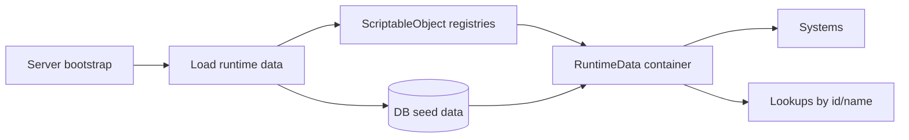

# Runtime Data

**Short description:** Provides a container-based separation of mutable runtime state from server behaviour logic, with automatic attribute-driven discovery, deduplication, priority-ordered initialization, and shared cross-system containers for async work queues and main-thread action marshalling.

## Table of Contents

- [Overview](#overview)
- [Supported Platforms](#supported-platforms)
- [Features](#features)
- [Prerequisites](#prerequisites)
- [Installation / Build](#installation--build)
- [Quick Start Guides](#quick-start-guides)
- [Configuration](#configuration)
- [Usage Examples](#usage-examples)
- [Operational Checks](#operational-checks)
- [Flow Diagram](#flow-diagram)
- [Project Structure](#project-structure)
- [License](#license)

## Overview

The Runtime Data system enforces a clean separation between server business logic (`ServerBehaviour` ScriptableObjects) and mutable runtime state (`RuntimeDataContainer` classes). ServerBehaviours handle configuration, event subscriptions, validation, and algorithms — they are stateless. RuntimeDataContainers hold all dictionaries, trackers, timestamps, and queues — they contain no business logic.

Containers are automatically discovered via `[RequiresDataContainer]` attributes placed on ServerBehaviour classes. The server scans all behaviours at startup, creates container instances through `RuntimeDataContainerFactory` (reflection-based, parameterless-constructor validation), deduplicates by concrete type so multiple systems requiring the same container share one instance, orders them by `InitializationPriority`, and registers them in a global `RuntimeDataContainerRegistry` for type-safe lookup.

The Core layer (`Server/Core/RuntimeData/`) defines engine-agnostic interfaces: `IRuntimeDataContainer` (marker extending `IServerComponent`), the generic `IRuntimeDataContainer<TNetworkManager, TServerManager, TConnection, TDataContainer>` (with `Initialize`, `Clear`), `IRuntimeDataContainerFactory`, `IRuntimeDataContainerRegistry<...>`, `IAsyncWorkerData`, and `IMainThreadQueueData`. The Implementation layer (`Server/Implementation/RuntimeData/`) provides the abstract `RuntimeDataContainer` base class, the concrete `RuntimeDataContainerFactory` and `RuntimeDataContainerRegistry`, and shared cross-system containers: `AsyncWorkerData` (bounded async work queue with backpressure and entity-keyed ordering), `MainThreadQueueData` (thread-safe main-thread action marshalling with copy-then-invoke drain), and `SystemMainThreadQueueData` (thin abstract subclass for per-system queue isolation).

Concrete per-system containers (e.g., `PartySystemRuntimeData`, `GuildSystemRuntimeData`, `CharacterMappingData`) live alongside their respective system implementations under `Server/Implementation/World/` and `Server/Implementation/LoginServer/`, while shared cross-system containers are centralized here.

## Supported Platforms

| Platform | Supported | Notes |
|----------|-----------|-------|
| Windows  | Yes       | Fully supported as a server host |
| Linux    | Yes       | Fully supported as a server host |
| WebGL    | N/A       | Server-only component; not applicable to browser builds |

**Engine:** Unity 6.3 LTS
**Scripting backend:** IL2CPP

## Features

- **Logic / data separation** — `ServerBehaviour` ScriptableObjects own immutable configuration and business logic; `RuntimeDataContainer` classes own all mutable runtime state. Neither crosses into the other's responsibility.
- **Automatic attribute-driven discovery** — `[RequiresDataContainer(typeof(T))]` on any `ServerBehaviour` causes the server to instantiate container `T` at startup without manual wiring.
- **Deduplication** — Multiple behaviours can declare the same container type; only one instance is created and shared across all consumers.
- **Priority-ordered initialization** — `RequiresDataContainerAttribute.InitializationPriority` (int, lower = earlier) controls container initialization order when containers depend on each other.
- **Reflection-based factory with validation** — `RuntimeDataContainerFactory.CreateContainer(Type)` validates that the type is non-null, non-abstract, not an interface, assignable to `IRuntimeDataContainer`, and has a public parameterless constructor before calling `Activator.CreateInstance`.
- **Type-safe registry** — `RuntimeDataContainerRegistry` extends `ServerComponentRegistry` and provides `Register<T>()`, `Unregister<T>()`, `TryGet<T>(out T)`, `Get<T>()`, `InitializeAll(IServer)`, and `DeinitializeAll()`. Behaviours access containers via `Server.DataContainerRegistry.TryGet<IMyData>(out var data)`.
- **Lifecycle management** — `InitializeAll` iterates registered containers, calling `container.Initialize(server, serverManager)` which sets references and calls the abstract `InitializeOnce()`. `DeinitializeAll` calls `Clear()` then `Deinitialize()` on each unique instance (deduplicated via `HashSet`), then empties the registry.
- **Bounded async work queue (AsyncWorkerData)** — Replaces fire-and-forget `_ = SomeAsync(...)` with backpressure-aware scheduling. Concurrency is bounded by a `SemaphoreSlim` (`maxConcurrency`, default 32), not by a fixed set of worker loops, so an item awaiting a database call or a main-thread hand-off delays only the items ordered behind it. Admission is bounded separately: `Enqueue` returns `false` once `maxOutstandingItems` (default 16384) items are accepted but unfinished. `Enqueue(work, entityKey)` appends to a per-key `OrderedLane` — a chain of `ContinueWith` continuations held in a `ConcurrentDictionary<long, OrderedLane>` and retired when the key empties — giving FIFO order per entity while different keys proceed independently; `entityKey` 0 means "no ordering requirement" and takes the unordered path. Dispatch always goes through `Task.Run` / `TaskScheduler.Default`, so nothing ever executes inline on the enqueuing (main) thread. Exposes `PendingCount` and `CompletedCount` for monitoring.
- **Shutdown drains rather than discards (AsyncWorkerData)** — `Clear()` only stops accepting new work; it does not throw away what was already accepted, because the work pending at shutdown is precisely the character saves and session releases the behaviours enqueued as they tore down. `OnDeinitialize` then polls `outstandingCount` for up to `DrainTimeoutMilliseconds` (3000), clamped to whatever is left of the process-wide teardown budget by `UnitySyncOverAsync.ClampToShutdownBudget`. The `SemaphoreSlim` is dropped, never disposed — an item that outlived the drain still holds it.
- **Main-thread action marshalling (MainThreadQueueData)** — Abstract base container with a `Queue<Action>` guarded by `lock`. Background threads call `TryEnqueue(Action)` (bounded at 10 000 pending actions). Main thread calls `Drain()` or `Drain(int maxActions)` each frame, which copies actions under lock then invokes outside the lock to minimize lock hold time. Uses a reusable `drainBuffer` list to avoid per-call allocation.
- **Per-system queue isolation (SystemMainThreadQueueData)** — Abstract subclass of `MainThreadQueueData` that concrete per-system queue containers inherit, ensuring each system gets its own isolated queue instance via the `DataContainerRegistry`.
- **Diagnostic counters** — `AsyncWorkerData` tracks `CompletedCount` (atomic `Interlocked.Read`) and `PendingCount` (accepted minus running, floored at 0 — an item that is actually executing is reported by neither counter). Work items carry an optional `CallerName` for error logging attribution.
- **Structured logging** — Lifecycle events are logged via `FishMMO.Logging.Log` with category tags (`"AsyncWorkerData"`, `"MainThreadQueue"`, `"RuntimeDataContainerRegistry"`). Routine lifecycle lines are `Debug`; only genuine faults — a work item that threw, a queued action that threw, a container that failed to initialize — reach `Error`/`Warning`.

## Prerequisites

- Unity 6.3 LTS (IL2CPP scripting backend)
- FishNet networking framework (`FishNet.Connection.NetworkConnection`, `FishNet.Managing.Server.ServerManager`)
- FishMMO server core assemblies (`FishMMO.Server.Core` — `IRuntimeDataContainer`, `IRuntimeDataContainerFactory`, `IRuntimeDataContainerRegistry`, `IServerComponent`, `IServerComponentRegistry`, `ServerComponentRegistry`, `RequiresDataContainerAttribute`, `IAsyncWorkerData`, `IMainThreadQueueData`)
- FishMMO logging (`FishMMO.Logging.Log`)
- `System.Collections.Concurrent` (`ConcurrentDictionary` for `AsyncWorkerData`'s per-entity ordering lanes)
- `System.Threading` (`SemaphoreSlim`, `Interlocked`, `Volatile`, `Task`) for async worker lifecycle

## Installation / Build

This is an integrated module within the FishMMO Unity project. No separate installation is required.

1. Ensure the FishMMO Unity project is open in the Unity Editor.
2. The `RuntimeDataContainerRegistry`, `RuntimeDataContainerFactory`, and all container instances are created automatically by the server during `OnFinalizeSetup`. No manual ScriptableObject or asset creation is needed.
3. ServerBehaviours declare container dependencies via `[RequiresDataContainer(typeof(T))]` — the server handles discovery, creation, deduplication, and initialization.

## Quick Start Guides

### Creating a New Runtime Data Container

1. Define a Core interface extending `IRuntimeDataContainer`:

```csharp
public interface IMySystemData : IRuntimeDataContainer
{
    Dictionary<long, string> Tracker { get; }
    DateTime LastSyncTime { get; set; }
}
```

2. Implement the container extending `RuntimeDataContainer`:

```csharp
public class MySystemData : RuntimeDataContainer, IMySystemData
{
    private readonly Dictionary<long, string> tracker = new();

    public Dictionary<long, string> Tracker => tracker;
    public DateTime LastSyncTime { get; set; }

    public override ServerComponentInitializationStatus InitializeOnce()
    {
        LastSyncTime = DateTime.UtcNow;
        return ServerComponentInitializationStatus.Initialized;
    }

    public override void Clear()
    {
        tracker.Clear();
        LastSyncTime = DateTime.UtcNow;
    }

    protected override void OnDeinitialize() => Clear();
}
```

3. Declare the dependency on your ServerBehaviour:

```csharp
[RequiresDataContainer(typeof(MySystemData))]
public class MySystem : ServerBehaviour
{
    public override ServerComponentInitializationStatus InitializeOnce()
    {
        if (!Server.DataContainerRegistry.TryGet<IMySystemData>(out var data))
            return ServerComponentInitializationStatus.FailedToGetDataContainer;

        // Container is ready — subscribe to events, store local ref, etc.
        return ServerComponentInitializationStatus.Initialized;
    }
}
```

### Using AsyncWorkerData for Background Work

1. Declare the dependency:

```csharp
[RequiresDataContainer(typeof(AsyncWorkerData))]
public class PersistenceSystem : ServerBehaviour { ... }
```

2. Enqueue work (unordered — runs as soon as a concurrency slot is free):

```csharp
if (Server.DataContainerRegistry.TryGet<IAsyncWorkerData>(out var asyncWorker))
{
    asyncWorker.Enqueue(() => PersistInventoryAsync(dto));
}
```

3. Enqueue ordered work (entity-keyed):

```csharp
asyncWorker.Enqueue(() => SaveCharacterAsync(charData), characterID);
// Same characterID shares one ordering lane — FIFO guaranteed; other keys run concurrently
```

### Using MainThreadQueueData for Thread Marshalling

1. Create a concrete queue container inheriting `SystemMainThreadQueueData`:

```csharp
public class MySystemMainThreadQueue : SystemMainThreadQueueData { }
```

2. Declare it on your behaviour and drain each frame:

```csharp
[RequiresDataContainer(typeof(MySystemMainThreadQueue))]
public class MyNetworkSystem : ServerBehaviour
{
    private IMainThreadQueueData mainThreadQueue;

    public override ServerComponentInitializationStatus InitializeOnce()
    {
        if (!Server.DataContainerRegistry.TryGet<IMainThreadQueueData>(out mainThreadQueue))
            return ServerComponentInitializationStatus.FailedToGetDataContainer;
        return ServerComponentInitializationStatus.Initialized;
    }

    // Called from async worker thread
    private void OnAsyncResult(NetworkConnection conn, byte[] payload)
    {
        mainThreadQueue.TryEnqueue(() => conn.Broadcast(new ResultMsg { Data = payload }));
    }

    // Called each frame on main thread
    public void OnLateUpdate() => mainThreadQueue.Drain();
}
```

## A dropped main-thread action is a stuck client

For a request/response handler the queued action *is* the reply. The client sent a request,
disabled its control, and is waiting — so an action that never runs is a player looking at a
screen whose only button does nothing, with no error and no explanation. Two rules keep that
from happening.

**One action's failure costs only that action.** `Drain` invokes each action inside its own
try/catch. A single `Invoke` loop abandoned the whole remainder of the batch on the first
exception, and because the actions had already been dequeued they were simply gone — every
client whose reply happened to sit behind the throwing one waited for a message that no longer
existed. The actions in a batch belong to unrelated connections and nothing may assume
otherwise.

**The drain buffer is cleared in a `finally`.** It used to be cleared after the loop, so an
exception escaping the loop left it populated and the *next* `Drain` cleared it on entry —
silently discarding actions that had been dequeued but never run.

Capacity rejection (`MaxQueueCapacity`, 10,000 per system) is the other way an action is lost.
`MainThreadQueueHelper` counts and rate-limits a warning for those, and callers that hold state
across the hand-off must check the return value — `CharacterSystem.LoadCharacterAsync` releases
its session claim when the spawn hand-off is rejected, rather than stranding it. Beyond that the
client is the backstop: no login-flow panel waits on a reply without a deadline. See
[Client Connection Manager](../../../Client/Connection/README.md#no-panel-waits-on-a-reply-forever).

## Configuration

| Parameter | Location | Default | Description |
|-----------|----------|---------|-------------|
| `AsyncWorkerMaxConcurrency` | Server configuration file (falls back to `AsyncWorkerData.maxConcurrency`) | `32` | Work items executing at once. Must stay under the database connection pool (`AppSettings.MaxPoolSize`, 100 by default); clamped to a minimum of 1 |
| `AsyncWorkerMaxOutstandingItems` | Server configuration file (falls back to `AsyncWorkerData.maxOutstandingItems`) | `16384` | Items accepted but unfinished before `Enqueue` returns `false`; clamped up to at least the concurrency limit |
| Max queue capacity | `MainThreadQueueData.MaxQueueCapacity` | `10000` | Maximum pending actions before `TryEnqueue` returns `false` |
| Drain timeout | `AsyncWorkerData.DrainTimeoutMilliseconds` | `3000` ms | Bounded wait for in-flight work in `OnDeinitialize`, further clamped by `UnitySyncOverAsync.ClampToShutdownBudget` |
| Drain poll interval | `AsyncWorkerData.DrainPollMilliseconds` | `25` ms | Sleep between outstanding-count checks while draining |
| `InitializationPriority` | `[RequiresDataContainer]` attribute | `0` | Lower values initialize first; set per-attribute on each ServerBehaviour |

The two `AsyncWorker*` keys are read once, in `InitializeOnce`, via `Server.Configuration.GetInt` — the fields hold the defaults, so a deployment that names neither key gets 32/16384. Everything else is a compile-time constant; to adjust, modify the source and rebuild.

## Usage Examples

### Shared Container Across Multiple Systems

```csharp
[RequiresDataContainer(typeof(CharacterMappingData))]
public class CharacterSystem : ServerBehaviour { }

[RequiresDataContainer(typeof(CharacterMappingData))]  // Same container
public class PartySystem : ServerBehaviour { }

[RequiresDataContainer(typeof(CharacterMappingData))]  // Same container
public class FriendSystem : ServerBehaviour { }

// Result: Only ONE CharacterMappingData instance is created and shared
```

### Priority-Ordered Initialization

```csharp
[RequiresDataContainer(typeof(CharacterMappingData), InitializationPriority = 0)]
[RequiresDataContainer(typeof(CharacterItemData), InitializationPriority = 10)]
public class CharacterInventorySystem : ServerBehaviour { }

// CharacterMappingData initialized first (priority 0)
// CharacterItemData initialized second (priority 10)
```

### Monitoring Async Worker Health

```csharp
if (Server.DataContainerRegistry.TryGet<IAsyncWorkerData>(out var asyncWorker))
{
    int pending = asyncWorker.PendingCount;
    long completed = asyncWorker.CompletedCount;
    Log.Info("Health", $"AsyncWorker: pending={pending}, completed={completed}");
}
```

### Party System — Full Container Pattern

**Core interface:**

```csharp
public interface IPartySystemRuntimeData : IRuntimeDataContainer
{
    bool TryGetPendingInvitation(long targetCharacterID, out long partyID);
    bool TryAddPendingInvitation(long targetCharacterID, long partyID, DateTime nowUtc);
    bool RemovePendingInvitation(long targetCharacterID);
    int SweepExpiredInvitations(DateTime nowUtc, TimeSpan ttl, int maxScan, int maxRemove);
    DateTime LastFetchTime { get; set; }
    bool TryBeginUpdatePump();
    void EndUpdatePump();
    DateTime NextInvitationSweepUtc { get; set; }
    IngressGuard IngressGuard { get; }
}
```

**Implementation:**

```csharp
public class PartySystemRuntimeData : RuntimeDataContainer, IPartySystemRuntimeData
{
    private LastSeenCacheTracker<long, long> pendingInvitations;
    private int updatePumpInFlight;

    public DateTime LastFetchTime { get; set; }
    public DateTime NextInvitationSweepUtc { get; set; }
    public IngressGuard IngressGuard { get; private set; }

    public override ServerComponentInitializationStatus InitializeOnce()
    {
        pendingInvitations = new LastSeenCacheTracker<long, long>();
        LastFetchTime = DateTime.UtcNow;
        Interlocked.Exchange(ref updatePumpInFlight, 0);
        NextInvitationSweepUtc = DateTime.UtcNow;
        IngressGuard = new IngressGuard();
        return ServerComponentInitializationStatus.Initialized;
    }

    public override void Clear()
    {
        pendingInvitations?.Clear();
        LastFetchTime = DateTime.UtcNow;
        Interlocked.Exchange(ref updatePumpInFlight, 0);
        NextInvitationSweepUtc = DateTime.UtcNow;
        IngressGuard?.Clear();
    }

    protected override void OnDeinitialize()
    {
        Clear();
        pendingInvitations = null;
    }
}
```

**Behaviour:**

```csharp
[CreateAssetMenu(fileName = "PartySystem", menuName = "FishMMO/Server/SceneServer/Party System", order = 1)]
[RequiresDataContainer(typeof(PartySystemRuntimeData))]
[RequiresDataContainer(typeof(PartyCharacterMappingData))]
[RequiresDataContainer(typeof(PartySystemMainThreadQueueData))]
[RequiresDataContainer(typeof(AsyncWorkerData))]
public class PartySystem : ServerBehaviour, IPartySystem<NetworkConnection>
{
    [SerializeField] private int maxPartySize = 6;
    [SerializeField] private float updatePumpRate = 1.0f;

    public int MaxPartySize => maxPartySize;
    public float UpdatePumpRate => updatePumpRate;

    public override ServerComponentInitializationStatus InitializeOnce()
    {
        if (!Server.DataContainerRegistry.TryGet<IPartySystemRuntimeData>(out var runtimeData))
            return ServerComponentInitializationStatus.FailedToGetDataContainer;

        Server.NetworkWrapper.RegisterBroadcast<PartyCreateBroadcast>(
            OnServerPartyCreateBroadcastReceived, true);

        return ServerComponentInitializationStatus.Initialized;
    }
}
```

## Operational Checks

| Check | How to Verify | Expected Result |
|-------|---------------|-----------------|
| Container discovery | Check server startup logs for `"RuntimeDataContainerRegistry"` → `"Initializing all data containers"` | All declared containers appear in log output |
| Container initialization | Check per-container log `"[TypeName] Initialization Status: Initialized"` | Every container reports `Initialized` |
| Deduplication | Declare same container type on multiple behaviours | Only one instance created; all behaviours share it |
| Priority ordering | Assign different `InitializationPriority` values | Lower-priority containers initialize first |
| Factory validation | Pass an abstract type or interface to `RuntimeDataContainerFactory.CreateContainer` | `InvalidOperationException` with descriptive message |
| Async worker startup | Check debug log `"AsyncWorkerData"` → `"Initialized (MaxConcurrency=32, MaxOutstanding=16384)"` | Values match the configured (or default) limits |
| Async worker backpressure | Hold more than `maxOutstandingItems` items accepted-but-unfinished | `Enqueue` returns `false`; the caller handles the refusal rather than the item being silently dropped |
| Async worker entity ordering | Enqueue multiple items with the same non-zero `entityKey` | All items share one `OrderedLane` and execute in FIFO order; items with other keys run concurrently |
| Async worker shutdown | Stop the server | Debug log `"Deinitialized (Completed=X, Remaining=Y)"`; `Remaining` is 0 unless the drain budget expired first |
| Main-thread queue capacity | Enqueue more than 10 000 actions without draining | `TryEnqueue` returns `false` |
| Main-thread drain | Call `Drain()` on main thread after enqueueing actions | All queued actions execute; drain returns count |
| Registry DeinitializeAll | Stop server | Each unique container instance has `Clear()` and `Deinitialize()` called exactly once (deduplicated via `HashSet`) |
| Full lifecycle | Start → operate → stop server | Containers created → initialized → used → cleared → deinitialized; no leaked state |

## Flow Diagram

### High-Level Overview



```
Server.Start()
    │
    └── OnFinalizeSetup(remoteAddress)
            │
            ├── DataContainerRegistry = new RuntimeDataContainerRegistry()
            │
            ├── DiscoverAndCreateDataContainers()
            │   ├── Scan all ServerBehaviours for [RequiresDataContainer] attributes
            │   ├── Create container instances via RuntimeDataContainerFactory
            │   │   └── Activator.CreateInstance(containerType)
            │   ├── Deduplicate by concrete Type (multiple decls → one instance)
            │   └── Order by InitializationPriority (lower = first)
            │
            ├── RegisterAllDataContainers()
            │   └── Register each container in DataContainerRegistry
            │       └── Stored by interface type for TryGet<T>() lookup
            │
            ├── DataContainerRegistry.InitializeAll(this)
            │   └── For each container:
            │       ├── Cast server to IServer<INetworkManagerWrapper, NetworkConnection, IRuntimeDataContainer>
            │       ├── container.Initialize(server, serverManager)
            │       │   ├── Set Server + ServerManager references
            │       │   ├── Call InitializeOnce()
            │       │   │   ├── AsyncWorkerData: read config, create semaphore + lanes
            │       │   │   ├── MainThreadQueueData: queue ready at construction
            │       │   │   └── Custom containers: init trackers, set timestamps
            │       │   └── Set Initialized = true
            │       └── Log initialization status
            │
            ├── BehaviourRegistry.InitializeAll(this)
            │   └── For each behaviour:
            │       └── behaviour.InitializeOnce()
            │           └── TryGet<IMyData>() → container guaranteed initialized
            │
            └── NetworkWrapper.StartServer()
                └── Server Running ✓

  ┌─────────────────────── Runtime Operation ───────────────────────┐
  │                                                                 │
  │  ServerBehaviour (main thread)                                  │
  │    ├── Receives broadcast → reads/writes container data         │
  │    ├── asyncWorkerData.Enqueue(() => PersistAsync(data))        │
  │    │       └── Unordered or entity-keyed → ordering lane        │
  │    └── mainThreadQueue.Drain() (each frame in OnLateUpdate)     │
  │             └── Copy-under-lock → invoke outside lock           │
  │                                                                 │
  │  AsyncWorkerData (thread pool)                                  │
  │    ├── Task.Run → await concurrencyGate.WaitAsync()             │
  │    ├── Execute work item → Interlocked.Increment(completedCount)│
  │    └── On error: log with CallerName attribution                │
  │                                                                 │
  │  Background thread → MainThreadQueueData                        │
  │    └── TryEnqueue(Action) → main thread executes via Drain()    │
  └─────────────────────────────────────────────────────────────────┘

Server.Stop()
    │
    └── DataContainerRegistry.DeinitializeAll()
            ├── Deduplicate instances via HashSet<IRuntimeDataContainer>
            ├── For each unique instance:
            │   ├── container.Clear()
            │   │   ├── AsyncWorkerData: stop accepting; accepted work is kept
            │   │   ├── MainThreadQueueData: clear queue under lock
            │   │   └── Custom containers: clear dictionaries, reset timestamps
            │   └── container.Deinitialize()
            │       ├── Call OnDeinitialize()
            │       │   ├── AsyncWorkerData: stop accepting → poll outstanding
            │       │   │   (3s, clamped to shutdown budget) → log stats → drop
            │       │   │   the semaphore (never disposed) and the lanes
            │       │   ├── MainThreadQueueData: drain remaining actions
            │       │   └── Custom containers: cleanup resources
            │       └── Reset Initialized, Server, ServerManager to null
            └── components.Clear() → registry empty
```

## Project Structure

```
Server/
├── Core/RuntimeData/
│   ├── IRuntimeDataContainer.cs              # Marker + generic data container interface (extends IServerComponent)
│   ├── IRuntimeDataContainerFactory.cs       # Factory interface: CreateContainer(Type), IsValidContainerType(Type)
│   ├── IRuntimeDataContainerRegistry.cs      # Registry interface (extends IServerComponentRegistry)
│   ├── IAsyncWorkerData.cs                   # Interface: Enqueue (unordered + entity-keyed), PendingCount, CompletedCount
│   ├── IMainThreadQueueData.cs               # Interface: TryEnqueue(Action), Drain(), Drain(int maxActions)
│   └── RequiresDataContainerAttribute.cs     # [RequiresDataContainer(typeof(T), InitializationPriority = N)]
│
└── Implementation/RuntimeData/
    ├── RuntimeDataContainer.cs               # Abstract base: Initialized, Server, ServerManager, Initialize → InitializeOnce, Deinitialize → OnDeinitialize, Clear
    ├── RuntimeDataContainerFactory.cs        # Reflection factory: Activator.CreateInstance with type validation
    ├── RuntimeDataContainerRegistry.cs       # Concrete registry: InitializeAll (cast + iterate), DeinitializeAll (HashSet dedup)
    ├── AsyncWorkerData.cs                    # Semaphore-bounded pool: 32 concurrent, 16384 outstanding, per-entity ordering lanes
    ├── MainThreadQueueData.cs                # Abstract main-thread queue: lock + Queue<Action>, copy-then-invoke Drain, 10K cap
    └── SystemMainThreadQueueData.cs          # Abstract subclass of MainThreadQueueData for per-system queue isolation
```

### Inheritance Hierarchy

```
IServerComponent
└── IRuntimeDataContainer (marker)
    ├── IAsyncWorkerData
    │       • Enqueue(Func<Task>, callerName?) → bool
    │       • Enqueue(Func<Task>, entityKey, callerName?) → bool
    │       • PendingCount → int
    │       • CompletedCount → long
    ├── IMainThreadQueueData
    │       • TryEnqueue(Action) → bool
    │       • Drain() → void
    │       • Drain(int maxActions) → int
    └── IRuntimeDataContainer<TNetworkManager, TServerManager, TConnection, TDataContainer>
            • Initialize(server, serverManager) → ServerComponentInitializationStatus
            • Clear() → void

RuntimeDataContainer (abstract)
    : IRuntimeDataContainer<INetworkManagerWrapper, ServerManager, NetworkConnection, IRuntimeDataContainer>
    │   • Initialized : bool
    │   • Server : IServer<...>
    │   • ServerManager : ServerManager
    │   • Initialize() → sets refs → calls InitializeOnce()
    │   • Deinitialize() → calls OnDeinitialize() → resets refs
    │   • InitializeOnce() [abstract]
    │   • OnDeinitialize() [abstract]
    │   • Clear() [abstract]
    │
    ├── AsyncWorkerData : IAsyncWorkerData
    │       SemaphoreSlim concurrency gate, ConcurrentDictionary<long, OrderedLane>,
    │       unordered + entity-keyed enqueue, bounded drain on teardown
    │
    ├── MainThreadQueueData (abstract) : IMainThreadQueueData
    │   │   Queue<Action> + lock, TryEnqueue (10K cap), copy-then-invoke Drain
    │   │
    │   └── SystemMainThreadQueueData (abstract)
    │           Per-system concrete subclasses inherit this
    │
    ├── PartySystemRuntimeData, GuildSystemRuntimeData, ChatSystemRuntimeData, ...
    └── (per-system containers alongside their ServerBehaviour implementations)

IServerComponentRegistry<...>
└── ServerComponentRegistry<INetworkManagerWrapper, NetworkConnection, IRuntimeDataContainer>
    └── RuntimeDataContainerRegistry
            • InitializeAll: cast server, iterate containers, call Initialize
            • DeinitializeAll: HashSet dedup, Clear + Deinitialize each, empty registry

IRuntimeDataContainerFactory
└── RuntimeDataContainerFactory
        • CreateContainer(Type): validate → Activator.CreateInstance
        • IsValidContainerType(Type): non-null, non-abstract, non-interface, assignable, has parameterless ctor
```

### Design Rules

| Rule | ServerBehaviour (Logic) | RuntimeDataContainer (Data) |
|------|-------------------------|-----------------------------|
| **Unity type** | ScriptableObject | Plain C# class |
| **State** | Stateless — immutable config only | All mutable runtime state |
| **Logic** | Business logic, validation, events | No business logic |
| **Collections** | None (no Dictionary, List, etc.) | Owns all collections |
| **Creation** | Added via Unity Inspector | Created via reflection factory |
| **Serialization** | Serializable (ScriptableObject) | Non-serializable runtime only |
| **Hot Reload** | Unity can reload without state loss | State survives SO reload |
| **Testability** | Mock containers, not entire systems | Mock via interface |
| **Thread Safety** | Accesses containers through registry | Containers lock independently |

## License

This module is part of the FishMMO project and is subject to the FishMMO project license.
