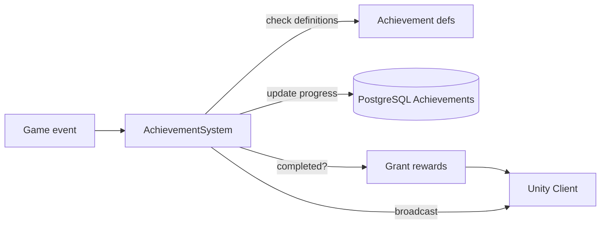

# Achievement System

**Short description:** Server-side achievement progression and reward payout system for scene-server player characters, handling event-driven updates, immediate client broadcasts, synchronous reward application, and asynchronous persistence.

## Table of Contents

- [Overview](#overview)
- [Supported Platforms](#supported-platforms)
- [Features](#features)
- [Prerequisites](#prerequisites)
- [Installation / Build](#installation--build)
- [Quick Start Guides](#quick-start-guides)
- [Configuration](#configuration)
- [Usage Examples](#usage-examples)
- [Operational Checks](#operational-checks)
- [Flow Diagram](#flow-diagram)
- [Project Structure](#project-structure)
- [License](#license)

## Overview

The Achievement system handles server-side achievement progression and reward payout for scene-server player characters. It listens to achievement update/completion events, pushes immediate client UI updates via broadcasts, applies gameplay rewards synchronously (abilities/items), and persists reward side effects asynchronously through `AsyncWorkerData` to avoid blocking gameplay flow.

All DB writes are queued through `TryEnqueueAsyncWork(...)` to `IAsyncWorkerData`. If queueing fails (backpressure/missing dependency), the system logs warnings with character/slot/template context while keeping gameplay state intact. This design keeps player feedback immediate while deferring I/O latency.

## Supported Platforms

| Platform | Supported | Notes |
|---|---|---|
| Windows | Yes | |
| Linux | Yes | |
| WebGL | N/A | Server-only module |
| Unity 6.3 LTS | Yes | Required engine version |
| IL2CPP | Yes | Supported scripting backend |

## Features

- Event-driven achievement progress tracking via `IAchievementController.OnUpdateAchievement` and `IAchievementController.OnCompleteAchievement`
- Real-time client notification of achievement progress and tier updates via `AchievementUpdateBroadcast`
- Ability reward processing: learns unknown base abilities and ability events, skips already-known entries, broadcasts additions
- Item reward processing with inventory-first placement and automatic bank fallback when inventory capacity is insufficient; the destination container is chosen once, before any item is placed, so a reward set is never split across inventory and bank
- Item rewards are granted through `ICharacterInventorySystem.TryGrantItem`, the inventory system's single funnel. The funnel places the item, broadcasts the slot, persists it and writes back the identity the database assigns. This system does not place, broadcast or persist items itself: doing so left every reward at `ID == 0` — unequippable, and rewritten as a fresh row on every save until a snapshot repaired it
- Asynchronous persistence of all reward side effects through `IAsyncWorkerData` to avoid blocking gameplay
- Per-learned-template DB persistence queuing for known abilities
- Per-modified-slot DTO capture on main thread with async persistence queuing for items
- Graceful degradation: logs warnings on persistence queue failures while keeping in-memory gameplay state intact

## Prerequisites

- **Unity 6.3 LTS**
- **FishNetworking** — networking framework
- **FishMMO Server Core** — provides `ServerBehaviour`, `IAchievementSystem`, controller interfaces, broadcast types, and `IAsyncWorkerData`

## Installation / Build

This is an integrated module within FishMMO. It is included as part of the server-side scene-server implementation and does not require separate installation. Ensure the FishMMO Server Core and its dependencies are properly configured in your Unity project.

## Quick Start Guides

1. Ensure `AchievementSystem` is present on the scene server GameObject (it inherits from `ServerBehaviour` and implements `IAchievementSystem`).
2. Verify that `IAchievementController` is registered and firing `OnUpdateAchievement` and `OnCompleteAchievement` events.
3. Confirm that the required persistence services (`ICharacterKnownAbilityService`, `ICharacterItemService`) are registered in the DB registry for reward persistence.
4. Confirm that `IAsyncWorkerData` is available for non-blocking DB write queuing.
5. On initialize, `AchievementSystem` automatically subscribes to the controller events; on deinitialize, it unsubscribes.

## Configuration

### Reward Resolution Services

The following optional persistence services are resolved from the DB registry at reward processing time:

| Service | Purpose |
|---|---|
| `ICharacterKnownAbilityService` | Persists newly learned abilities and ability events |
| `ICharacterItemService` | Resolved at reward time and passed to `HandleItemRewards`, which no longer uses it — item persistence belongs to the inventory system's grant funnel. The parameter is kept so the call site reads as before |

### Threading Model

| Thread | Work |
|---|---|
| Main thread | Event callbacks, gameplay mutations, broadcasts, DTO capture |
| Async worker | DB persistence of reward side effects |

## Usage Examples

### Event Wiring

`AchievementSystem` subscribes to static controller events on initialize:

- `IAchievementController.OnUpdateAchievement`
- `IAchievementController.OnCompleteAchievement`

And unsubscribes on deinitialize.

### Broadcasts Emitted

| Broadcast | Purpose |
|---|---|
| `AchievementUpdateBroadcast` | Notify current progress/tier updates |
| `KnownAbilityAddMultipleBroadcast` | Notify newly learned base abilities |
| `KnownAbilityEventAddMultipleBroadcast` | Notify newly learned ability events |
| `ChatBroadcast` (`ChatChannel.System`) | Tells the owner when inventory and bank are both too full to deliver the item rewards |

Item slot updates (`InventorySetMultipleItemsBroadcast`, `BankSetMultipleItemsBroadcast`) are sent by `CharacterInventorySystem` as part of the grant funnel, not by this system.

### External Integration Points

| Integration | Role |
|---|---|
| `AchievementController` (`IAchievementController`) | Event source for achievement updates and completions |
| `AbilityController` (`IAbilityController`) | Ability learn/known checks |
| `InventoryController` / `BankController` | Free-slot capacity check that chooses the reward destination |
| `CharacterInventorySystem` (`ICharacterInventorySystem`) | `TryGrantItem` — placement, slot broadcast, persistence and identity write-back for every item reward |
| `AsyncWorkerData` (`IAsyncWorkerData`) | Queued non-blocking persistence |
| Database services | Known ability persistence |

### Reward Categories

#### Ability Rewards

Uses generic helper `HandleAbilityGenericRewards<...>` for both `BaseAbilityTemplate` rewards and `AbilityEvent` rewards.

Behavior:

1. Skip known abilities/events.
2. Learn unknown rewards via `IAbilityController`.
3. Queue DB persist (`PersistKnownAbilityAsync`) per learned template.
4. Broadcast single/multi known-ability add payloads.

#### Item Rewards

`HandleItemRewards(...)`:

1. Checks reward list; returns when empty.
2. Resolves `ICharacterInventorySystem` from `Server.BehaviourRegistry`. Without it the rewards are dropped and an error is logged — there is no local placement path any more.
3. Chooses a destination: `InventoryType.Inventory` when `IInventoryController.FreeSlots()` covers the whole reward list, otherwise `InventoryType.Bank` when `IBankController.FreeSlots()` does.
4. If neither has room, sends the owner a `ChatBroadcast` on `ChatChannel.System` ("Your inventory and bank are full…") and returns.
5. Calls `inventorySystem.TryGrantItem(character, new Item(template, 1), destination)` per reward, skipping null templates and logging a warning for any item the funnel refuses to place.

## Operational Checks

| Check | How to Verify |
|---|---|
| Event subscription active | Confirm `AchievementSystem` initializes without errors; controller events are wired |
| Progress broadcast delivery | Trigger an achievement update and verify `AchievementUpdateBroadcast` reaches the client |
| Ability reward learn | Complete an achievement with ability rewards; confirm `KnownAbilityAddMultipleBroadcast` is sent and ability is learned |
| Ability event reward learn | Complete an achievement with ability-event rewards; confirm `KnownAbilityEventAddMultipleBroadcast` is sent |
| Item reward — inventory route | Complete an achievement with item rewards when inventory has free slots; verify `InventorySetMultipleItemsBroadcast` arrives from the grant funnel |
| Item reward — bank fallback | Complete an achievement with item rewards when inventory is full but bank has room; verify `BankSetMultipleItemsBroadcast` |
| Item reward — both full | Complete an achievement with item rewards when neither container has room; verify the System-channel refusal message and that no item is placed |
| Reward item identity | Inspect a rewarded item after the grant; its `ID` must be the database-assigned row id, not `0` (the funnel writes the identity back and re-sends the slot) |
| Async persistence queuing | Check logs for successful `TryEnqueueAsyncWork` calls after reward application |
| Persistence failure graceful degradation | Simulate persistence queue failure; confirm warning is logged and gameplay state remains intact |

## Flow Diagram

### High-Level Overview



### Progress Update

```
IAchievementController_OnUpdateAchievement(...)
│
├─ 1. Validate character/achievement objects
├─ 2. Confirm character is an IPlayerCharacter
└─ 3. Broadcast AchievementUpdateBroadcast to owner
       ├── Template ID
       ├── Current value
       └── Current tier
```

### Completion Rewards

```
IAchievementController_HandleAchievementRewards(...)
│
├─ 1. Validate character/template/tier
├─ 2. Resolve optional persistence services from DB registry
│      ├── ICharacterKnownAbilityService
│      └── ICharacterItemService
│
├─ 3. Apply reward groups
│      ├── Ability rewards (HandleAbilityGenericRewards<BaseAbilityTemplate>)
│      │    └── Skip known → Learn unknown → Queue DB persist → Broadcast
│      │
│      ├── Ability-event rewards (HandleAbilityGenericRewards<AbilityEvent>)
│      │    └── Skip known → Learn unknown → Queue DB persist → Broadcast
│      │
│      └── Item rewards (HandleItemRewards)
│           ├── Resolve ICharacterInventorySystem (drop + error if absent)
│           ├── Choose destination once: Inventory → Bank → refuse
│           ├── Refusal → System ChatBroadcast to the owner
│           └── Per reward → ICharacterInventorySystem.TryGrantItem
│                └── funnel places, broadcasts, persists, writes back ID
│
└─ Reward application: immediate in memory
   Persistence: queued asynchronously via IAsyncWorkerData
```

## Project Structure

### Directory Structure

```
Achievement/
├── AchievementSystem.cs   # Event-driven achievement updates and reward processing
└── README.md
```

### Related Core Contract

- `Server/Core/World/SceneServer/Achievement/IAchievementSystem.cs`

### Inheritance Hierarchy

```
ServerBehaviour
└── AchievementSystem : IAchievementSystem
```

## License

This project is subject to the FishMMO project license.
