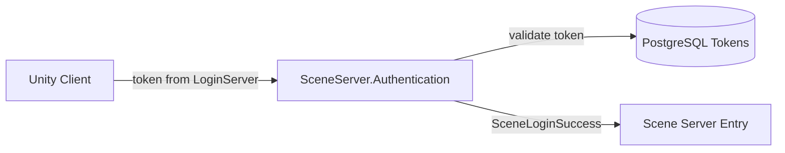

# Scene Server Authentication

**Short description:** Scene-server-specific authentication gate that handles scene-transfer token validation after shared token-based authentication succeeds.

## Table of Contents

- [Overview](#overview)
- [Supported Platforms](#supported-platforms)
- [Features](#features)
- [Prerequisites](#prerequisites)
- [Installation / Build](#installation--build)
- [Quick Start Guides](#quick-start-guides)
- [Configuration](#configuration)
- [Usage Examples](#usage-examples)
- [Operational Checks](#operational-checks)
- [Flow Diagram](#flow-diagram)
- [Project Structure](#project-structure)
- [License](#license)

## Overview

The SceneServer Authentication system is a pass-through gate for the shared token-based authenticator flow. After base token authentication succeeds, `TryLoginAsync` simply promotes `LoginSuccess` to `SceneLoginSuccess` with no additional admission checks. Scene-level authorization (zone access, instance limits) is handled by the scene manager system rather than the authenticator.

## Supported Platforms

| Platform | Supported | Notes |
|---|---|---|
| Windows | Yes | |
| Linux | Yes | |
| WebGL | N/A | Server-only module |
| Unity 6.3 LTS | Yes | Required engine version |
| IL2CPP | Yes | Supported scripting backend |

## Features

- Inherits full X25519 ECDH handshake, main-thread marshalling, stale-auth TTL sweeps, and hard deadline enforcement from `BaseServerAuthenticator`
- Inherits HMAC-signed token verification, bounded async worker channel, and account mapping from `TokenServerAuthenticator`
- Pass-through `TryLoginAsync` override — promotes `LoginSuccess` to `SceneLoginSuccess` without additional admission checks
- Scene-level authorization is delegated to the scene manager system (zone access, instance caps, etc.)

## Prerequisites

- **Unity 6.3 LTS**
- **FishNetworking** — networking framework (provides `Authenticator`, `NetworkConnection`)
- **FishMMO Server Core** — provides `BaseServerAuthenticator`, `TokenServerAuthenticator`
- **FishMMO Shared** — provides `ClientAuthenticationResult` enum (`LoginSuccess`, `SceneLoginSuccess`)

## Installation / Build

This is an integrated module within FishMMO. It is included as part of the server-side scene-server implementation and does not require separate installation.

## Quick Start Guides

1. Ensure `SceneServerAuthenticator` is present on the scene server GameObject. It inherits from `TokenServerAuthenticator` (which inherits from `BaseServerAuthenticator` → FishNet `Authenticator`).
2. No additional configuration beyond the base authenticator is needed — scene-level authorization is handled by the scene manager system.

## Configuration

### Inspector Parameters

The `SceneServerAuthenticator` class has no scene-specific inspector parameters. All configurable values are inherited from the base classes (see the main Authentication README).

## Usage Examples

### Authentication Flow

1. A client connects to the scene server with a valid auth token from the LoginServer.
2. `BaseServerAuthenticator` performs the X25519 ECDH key exchange.
3. `TokenServerAuthenticator` verifies the HMAC-signed token and checks revocation/expiration.
4. `SceneServerAuthenticator.TryLoginAsync` promotes `LoginSuccess` to `SceneLoginSuccess`.
5. The result is broadcast to the client via `ClientAuthResultBroadcast`.

## Operational Checks

| Check | How to Verify |
|---|---|
| Initialization success | Confirm `SceneServerAuthenticator` is attached to the scene server GameObject and no errors appear during startup |
| Successful scene login | Connect with a valid token; confirm client receives `SceneLoginSuccess` |
| Token auth failure passthrough | Send an invalid token; confirm the base authentication failure result propagates unchanged |

## Flow Diagram

### High-Level Overview



### Full Authentication Pipeline

```
Client Connection
│
▼
BaseServerAuthenticator
├── X25519 ECDH Key Exchange
├── Encrypted Channel Established
│
▼
TokenServerAuthenticator
├── Decrypt Token Payload
├── HMAC Signature Verification
├── Account Mapping
├── Expiration and Revocation Checks
│
▼
SceneServerAuthenticator.TryLoginAsync
│
└── result == LoginSuccess? → SceneLoginSuccess (pass-through)
```

## Project Structure

### Directory Tree

```
Authentication/
├── SceneServerAuthenticator.cs   # Scene-server pass-through authentication gate
└── README.md                     # This file
```

### Related Files

| File | Purpose |
|---|---|
| `Server/Implementation/Authentication/BaseServerAuthenticator.cs` | Shared X25519 ECDH handshake, main-thread queue, stale-auth TTL sweeps |
| `Server/Implementation/Authentication/TokenServerAuthenticator.cs` | Token-based auth pipeline: HMAC verification, bounded async channel, account mapping |
| `Shared/Implementation/Network/Authentication/ClientAuthenticationResult.cs` | Enum defining all authentication result codes |

### Inheritance Hierarchy

```
Authenticator (FishNet)
└── BaseServerAuthenticator
    ├── X25519 ECDH handshake
    ├── Main-thread action queue
    ├── Stale-auth TTL sweeps
    └── TokenServerAuthenticator
        ├── HMAC-signed token verification
        ├── Bounded async channel
        ├── Account mapping
        └── SceneServerAuthenticator
            └── Pass-through TryLoginAsync (LoginSuccess → SceneLoginSuccess)
```

## License

This module is part of the FishMMO project and is subject to the FishMMO project license. See the repository root for license details.
