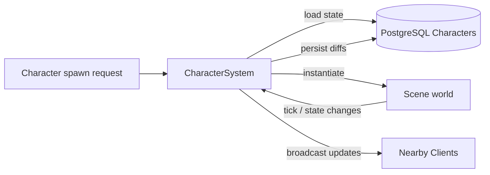

# Character System

**Short description:** SceneServer subsystem for the full player character lifecycle — authentication-triggered loading, async database hydration with session claiming, prefab instantiation, scene validation, network spawning, periodic persistence, batched session lease refresh, teleportation, death/respawn, out-of-bounds correction, social data broadcast, and connection cleanup with save-then-release semantics and a retry queue that guarantees claims are never stranded.

## Table of Contents

- [Overview](#overview)
- [Supported Platforms](#supported-platforms)
- [Features](#features)
- [Prerequisites](#prerequisites)
- [Installation / Build](#installation--build)
- [Quick Start Guides](#quick-start-guides)
- [Configuration](#configuration)
- [Usage Examples](#usage-examples)
- [Operational Checks](#operational-checks)
- [Flow Diagram](#flow-diagram)
- [Project Structure](#project-structure)
- [License](#license)

## Overview

The Character system is the SceneServer authority for player character lifecycle management. It handles authentication-triggered character loading, async database hydration with session claiming, prefab instantiation, scene validation, FishNet network spawning/despawning, periodic persistence, teleportation across scenes, death/respawn logic, out-of-bounds correction, social data broadcasting, and connection cleanup with save-then-release semantics.

The implementation uses a split execution model:
- **Main thread:** Unity/FishNet object lifecycle, map mutations, prefab instantiation, controller hydration, scene validation, network broadcasts, periodic out-of-bounds checks, and main-thread queue drain.
- **Async worker:** database load/save/session operations (claim, release, lease refresh), social data fetches, and character persistence via `EnqueueAsyncWork`.
- **Main-thread queue:** marshaling async completion actions back to Unity/FishNet-safe context via `ICharacterSystemMainThreadQueueData`.

Character sessions are explicitly claimed and released to prevent dual-server ownership. The session lifecycle uses `TryClaimAsync` during load, a batched `RefreshSessionLeasesAsync` on its own timer, and `ReleaseAsync` on disconnect, teleport, error, or deinitialize. All release paths follow save-then-release ordering to ensure data is persisted while the session lock is still held.

Two properties of that lifecycle are load-bearing for scene transfers and easy to regress:

- **A release is never dropped.** The async worker pool is bounded and drops writes when full, and the session token is removed from `SessionTokens` before the release runs — so a lost work item would leave the character `Online` with nothing left in the process holding its token. Every release path routes through `ReleaseSessionSafely`, and anything that fails to enqueue or fails at the database lands on the pending-flush retry queue (also drained during `OnDeinitialize`). A stranded claim blocks the destination scene server from claiming the character and kicks the player repeatedly until the lease expires.
- **Lease liveness is independent of save throughput.** Leases are refreshed by `OnPeriodicSessionLeaseRefresh` in a single batched statement, not per-character inside the sequential save loop. `PersistAsync` does not touch the lease at all.

## Supported Platforms

| Platform | Supported | Notes |
|---|---|---|
| Windows | Yes | |
| Linux | Yes | |
| WebGL | N/A | Server-only module |
| Unity 6.3 LTS | Yes | Required engine version |
| IL2CPP | Yes | Supported scripting backend |

## Features

- Authentication-triggered character load with per-connection rate limiting (`AuthCallbackCooldownSeconds = 2.0s`)
- Async database fetch of character and 13 sub-entity data sets within a single Unit of Work for a consistent snapshot
- Early session claim (`TryClaimAsync`) before sub-entity hydration to fail fast if another server owns the character, with a bounded retry (5 attempts, ~1.5s) that absorbs the hand-off window during a scene transfer instead of kicking
- Authoritative re-read of the character row **after** the claim succeeds, so a transfer cannot load a snapshot that predates the source server's final save
- Race-template-based prefab instantiation from the FishNet object pool
- Full controller hydration from pre-fetched DTOs: attributes, inventory, bank, equipment, abilities, known abilities, achievements, friends, guild, party, hotkeys, buffs, factions
- Equipment attribute modifier application during load (`item.Equippable.Equip`)
- Buff restoration with tick-based expiry/next-tick recalculation from remaining time
- Scene validation and FishNet scene loading for both world scenes and instances
- Two-phase client scene handshake: `SceneManager_OnClientLoadedStartScenes` → `ClientValidatedSceneBroadcast` → `OnClientValidatedSceneBroadcastReceived`
- Network spawning with physics scene assignment for stacked scene support
- Immortality toggling during teleport (immortal) and scene entry (mortal)
- `IsLoaded` flag management to prevent controller actions before the character is fully in the world
- Immediate non-DB payload broadcast after spawn: known abilities, known ability events, achievements, inventory, bank, hotkeys
- Async social payload broadcast after spawn: guild members, party members, friend online status
- Targeted broadcast helpers by character name (case-insensitive) or character ID
- Periodic save with configurable interval, main-thread DTO snapshot, async persistence, and an atomic processing guard to prevent overlapping save cycles
- Batched session lease refresh on an independent timer (`sessionLeaseRefreshRate`, default 20s), one statement for the whole resident population
- Pending-flush retry queue for saves and releases that could not be enqueued or failed at the database, with linear backoff and a bounded attempt count
- Periodic out-of-bounds check with respawn point teleportation for characters outside scene boundaries
- Teleport flow: teleporter validation, scene unload, immortality, position/scene update, instance flag removal, save-then-release with reconnect through world routing
- Transfer watchdog: a connection whose character has been handed off is force-disconnected after `TransferDisconnectGrace` (15s) if the client never reports its scene unload, so a crashed or modified client cannot idle on a server that no longer holds its character
- Death/respawn: player marked `IsDead`, death dialog shown on client. Player chooses Respawn (teleport to bind + revive) or waits for Resurrect (revive at corpse location). A respawn into a different scene follows the same ordering as the teleporter path, so `OnDisconnect` subscribers see the scene being left rather than the one being entered. Reconnect-while-dead re-shows the death dialog. NPC despawn with corpse decay timer; pet killed event with immediate despawn
- Connection disconnect cleanup: waiting-scene-load character pool return with session release, spawned character mapping removal with save-then-despawn
- Graceful deinitialize: main-thread DTO snapshot of all characters, async persist all, release all sessions (spawned + waiting-to-load)
- Optimistic concurrency via `character.Version++` on every save
- Runtime mapping caches for fast lookups: by ID, by lowercase name, by world, by connection, waiting-scene-load, session tokens
- Lifecycle events for cross-system coordination: `OnBeforeLoadCharacter`, `OnAfterLoadCharacter`, `OnConnect`, `OnDisconnect`, `OnSpawnCharacter`, `OnDespawnCharacter`, `OnPetKilled`
- Per-system main-thread queue isolation with configurable drain cap per frame
- Async worker backpressure via `EnqueueAsyncWork` with entity-key-based consistent routing and diagnostic caller names

## Prerequisites

- **Unity 6.3 LTS**
- **FishNetworking** — networking framework (ServerManager, SceneManager, NetworkObject, NetworkConnection, object pooling)
- **FishMMO Server Core** — provides `ServerBehaviour`, `ICharacterSystem`, `ICharacterMappingData`, `ICharacterSystemRuntimeData`, `ICharacterSystemMainThreadQueueData`, `ISceneServerSystem`, `ISceneServerRuntimeData`, `IAsyncWorkerData`, `CharacterSessionInfo`, `SceneServerAuthenticator`, broadcast types (`ClientValidatedSceneBroadcast`, `ClientScenesUnloadedBroadcast`, `GuildAddBroadcast`, `GuildAddMultipleBroadcast`, `PartyAddBroadcast`, `PartyAddMultipleBroadcast`, `FriendAddBroadcast`, `FriendAddMultipleBroadcast`, `KnownAbilityAddBroadcast`, `KnownAbilityAddMultipleBroadcast`, `KnownAbilityEventAddBroadcast`, `KnownAbilityEventAddMultipleBroadcast`, `AchievementUpdateBroadcast`, `AchievementUpdateMultipleBroadcast`, `InventorySetItemBroadcast`, `InventorySetMultipleItemsBroadcast`, `BankSetItemBroadcast`, `BankSetMultipleItemsBroadcast`, `HotkeySetBroadcast`, `HotkeySetMultipleBroadcast`), `WorldSceneDetails`, `SceneTeleporterDetails`, `CharacterRespawnPositionDetails`, and `IPeriodicUpdateSystem`
- **FishMMO Database** — provides `ICharacterService`, `IUnitOfWorkService`, `ICharacterInventoryService`, `ICharacterBankService`, `ICharacterEquipmentService`, `ICharacterAttributeService`, `ICharacterAbilityService`, `ICharacterKnownAbilityService`, `ICharacterAchievementService`, `ICharacterFriendService`, `ICharacterGuildService`, `ICharacterPartyService`, `ICharacterHotkeyService`, `ICharacterBuffService`, `ICharacterFactionService`, `CharacterData`, and all sub-entity data DTOs
- **FishMMO Shared** — provides `IPlayerCharacter`, `ICharacterDamageController`, `ICharacterAttributeController`, `IAbilityController`, `IAchievementController`, `IInventoryController`, `IBankController`, `IEquipmentController`, `IFriendController`, `IGuildController`, `IPartyController`, `IBuffController`, `IFactionController`, `RaceTemplate`, `CharacterFlags`, `AccessLevel`, `Item`, `Ability`, `Buff`, `Faction`, `Achievement`, `HotkeyData`

## Installation / Build

This is an integrated module within FishMMO. It is included as part of the server-side scene-server implementation and does not require separate installation. Ensure the FishMMO Server Core and its dependencies are properly configured in your Unity project.

## Quick Start Guides

1. Ensure `CharacterSystem` is present on the scene server GameObject (it inherits from `ServerBehaviour` and implements `ICharacterSystem<NetworkConnection, Scene>`). The asset is created via `Create > FishMMO > Server > SceneServer > Character System`.
2. Verify that the following data containers are registered in `DataContainerRegistry`:
   - `CharacterMappingData` → `ICharacterMappingData<NetworkConnection>`
   - `CharacterSystemRuntimeData` → `ICharacterSystemRuntimeData`
   - `CharacterSystemMainThreadQueueData` → `ICharacterSystemMainThreadQueueData`
   - `AsyncWorkerData` (shared async work queue)
3. Verify that `ISceneServerSystem<NetworkConnection>` is registered in `BehaviourRegistry` for scene loading and validation.
4. Verify that `SceneServerAuthenticator` exists in the scene for authentication event subscription.
5. Verify that `ICharacterService` and all sub-entity services are registered in `Database.ServiceRegistry`.
6. Adjust inspector parameters (`saveRate`, `sessionLeaseRefreshRate`, `outOfBoundsCheckRate`, `maxMainThreadActionsPerFrame`) as needed.
7. On initialize, `CharacterSystem` registers the authenticator callback, broadcast handlers (`ClientValidatedSceneBroadcast`, `ClientScenesUnloadedBroadcast`, `RespawnAtBindPointBroadcast`, `ResurrectAcceptBroadcast`), scene manager events, connection state events, character events (`IPlayerCharacter.OnTeleport`, `ICharacterDamageController.OnKilled`), and periodic callbacks for save, session lease refresh, pending-flush retry, transfer watchdog, out-of-bounds checks, and respawn/resurrect guard sweep.
8. On deinitialize, it unregisters all event handlers, snapshots and persists all character data, drains the pending-flush retry queue, and releases all claimed sessions.

## Configuration

### Inspector Parameters

| Parameter | Type | Default | Description |
|---|---|---|---|
| `maxMainThreadActionsPerFrame` | int | 200 | Max character-system actions drained from main-thread queue per frame |
| `saveRate` | float | 30.0 | Interval in seconds between periodic character saves (min 1.0) |
| `sessionLeaseRefreshRate` | float | 20.0 | Interval in seconds between batched session lease refreshes (min 1.0). Must stay well under the 2-minute lease duration so a few missed passes cannot let a live character's claim lapse. |
| `outOfBoundsCheckRate` | float | 2.5 | Interval in seconds between out-of-bounds checks (min 0.1) |

### Constants

| Constant | Value | Description |
|---|---|---|
| `AuthCallbackCooldownSeconds` | 2.0 | Minimum seconds between auth-callback character load requests per connection |
| `ValidatedSceneBroadcastCooldownSeconds` | 2.0 | Minimum seconds between validated-scene broadcasts per connection |
| `PendingFlushRetryIntervalSeconds` | 3.0 | Interval between pending save/release retry passes |
| `MaxPendingFlushAttempts` | 12 | Attempts before abandoning a pending flush (spans past the 2-minute lease, after which the claim frees itself) |
| `TransferDisconnectGrace` | 15s | Grace period for a handed-off client to disconnect on its own before the watchdog forces it |
| `TransferDisconnectSweepIntervalSeconds` | 5.0 | Interval between transfer watchdog sweeps |
| `DefaultSessionLeaseDuration` | 2 min | Database-side lease duration (`CharacterService`), the backstop that frees a claim held by a dead server |

### Required Data Containers

| Attribute | Container Type | Purpose |
|---|---|---|
| `[RequiresDataContainer]` | `CharacterMappingData` | Runtime mapping caches (connection, ID, name, world, waiting load, session tokens) |
| `[RequiresDataContainer]` | `CharacterSystemRuntimeData` | Periodic save processing guard (atomic begin/end save) |
| `[RequiresDataContainer]` | `CharacterSystemMainThreadQueueData` | Per-system main-thread queue for marshaling async completions |
| `[RequiresDataContainer]` | `AsyncWorkerData` | Shared async work queue with entity-key routing |

### Runtime Mapping Model

`CharacterMappingData` maintains synchronized runtime indices:

| Map | Key → Value | Purpose |
|---|---|---|
| `CharactersByID` | characterID → `IPlayerCharacter` | Fast lookup by character ID |
| `CharactersByLowerCaseName` | lowercase name → `IPlayerCharacter` | Case-insensitive name lookup |
| `CharactersByWorld` | worldID → (characterID → `IPlayerCharacter`) | Per-world character grouping |
| `ConnectionCharacters` | connection → `IPlayerCharacter` | Active spawned character per connection |
| `WaitingSceneLoadCharacters` | connection → `IPlayerCharacter` | Character loaded from DB but not yet scene-validated |
| `SessionTokens` | characterID → `CharacterSessionInfo` | Claimed session ownership (Token + ServerID) |

### Threading Model

| Thread | Responsibilities |
|---|---|
| Main thread | Unity/FishNet object lifecycle, prefab instantiation, controller hydration, map mutations, scene validation, broadcasts, out-of-bounds checks, main-thread queue drain |
| Async worker | DB load/save/session operations (claim, release, lease refresh), social data fetches, character persistence |

## Usage Examples

### Registered Broadcasts

`CharacterSystem` registers the following server-side broadcast handlers on initialize:

| Broadcast | Handler | Purpose |
|---|---|---|
| `ClientValidatedSceneBroadcast` | `OnClientValidatedSceneBroadcastReceived` | Client confirms scene loaded; server spawns character and sends initial payloads |
| `ClientScenesUnloadedBroadcast` | `OnClientScenesUnloadedBroadcastReceived` | Client confirms scene unloaded; server disconnects if no character is loaded |

### Subscribed Events

| Event Source | Event | Handler | Purpose |
|---|---|---|---|
| `SceneServerAuthenticator` | `OnClientAuthenticationResult` | `Authenticator_OnClientAuthenticationResult` | Entry point for character loading after authentication |
| `SceneManager` | `OnClientLoadedStartScenes` | `SceneManager_OnClientLoadedStartScenes` | Validates character scene and sends `ClientValidatedSceneBroadcast` |
| `IPlayerCharacter` | `OnTeleport` | `IPlayerCharacter_OnTeleport` | Handles teleportation between scenes |
| `ICharacterDamageController` | `OnKilled` | `CharacterDamageController_OnKilled` | Handles player death, NPC despawn, pet death |
| `RespawnAtBindPointBroadcast` | Client broadcast | `OnClientRespawnAtBindPointBroadcastReceived` | Handles dead player respawn at bind point |
| `ResurrectAcceptBroadcast` | Client broadcast | `OnClientResurrectAcceptBroadcastReceived` | Handles dead player accepting a resurrect |
| Connection state | Remote connection stopped | `OnRemoteConnectionStopped` | Cleans up auth rate-limit tracking and character mappings |

### Exposed Lifecycle Events

`CharacterSystem` exposes the following events for cross-system coordination:

| Event | Signature | When Fired |
|---|---|---|
| `OnBeforeLoadCharacter` | `Action<NetworkConnection, long>` | Before character is loaded from the database |
| `OnAfterLoadCharacter` | `Action<NetworkConnection, IPlayerCharacter>` | After character is successfully loaded and scene load initiated |
| `OnConnect` | `Action<NetworkConnection, IPlayerCharacter>` | After character is added to active connection mapping (post-spawn) |
| `OnDisconnect` | `Action<NetworkConnection, IPlayerCharacter>` | After character is removed from active mapping (disconnect or teleport) |
| `OnSpawnCharacter` | `Action<NetworkConnection, IPlayerCharacter, Scene>` | After character is spawned in the scene via `ServerManager.Spawn` |
| `OnDespawnCharacter` | `Action<NetworkConnection, IPlayerCharacter>` | After character is despawned during save-and-despawn |
| `OnPetKilled` | `Action<NetworkConnection, IPlayerCharacter>` | After a pet owned by a player character is killed |

Every one of these events is raised through `DispatchCharacterEvent`, which invokes each
subscriber independently and logs anything that throws. They all fire part-way through a
teardown, with the save, the session release or the despawn still to come on the line after
them — so a plain `?.Invoke` let one exception in a social system abandon both the rest of the
invocation list and the caller, leaving a character removed from every mapping but never saved
and never released, or its NetworkObject spawned in the world with no owner. Losing one
subscriber's bookkeeping is recoverable; losing the teardown is not.

It also exposes one command, `BeginDeliberateTransfer(conn)`. It marks the next disconnect on
that connection as a hand-off to another scene server rather than a player leaving, which
suppresses the combat-logout linger for it. Only callers that transfer a character *through*
the ordinary disconnect pipeline need it — `SceneChannelSystem` is the one that does.
`IPlayerCharacter_OnTeleport` and the cross-scene bind-point respawn instead release the
character themselves before disconnecting, so they never reach the linger check. A transfer
that lingered would leave the body and its session claim on the source server while the client
arrived at the destination, which could then not claim the character and would kick it on every
retry until the linger expired.

### Character Load Pipeline

**Step 1 — Authentication callback** (`Authenticator_OnClientAuthenticationResult`):

1. Rate-limits per-connection auth callbacks (`AuthCallbackCooldownSeconds`).
2. Validates: connection not already loading, authenticated, account name resolved, `ISceneServerSystem` available, `ICharacterService` available, server ID valid.
3. Enqueues `LoadCharacterAsync` to the async worker.

**Step 2 — Async DB snapshot + session claim** (`LoadCharacterAsync`):

1. Fetches the selected character for the account via `ICharacterService.FetchByAccountAsync` to resolve its ID.
2. Claims the session via `ClaimCharacterSessionAsync` → `TryClaimAsync(characterID, serverID)`, before heavy hydration, so contention fails before 13 sub-entity fetches. Contention (`InvalidOperation`) is retried up to 5 times with linear backoff (~1.5s total); any other error fails immediately. This runs **outside** the Unit of Work — retrying inside an open transaction would hold it for the whole backoff.
3. Re-reads the character row now that the claim is held, and verifies the selected character did not change. The pre-claim read is unsynchronised and on a scene transfer can predate the source server's final save; loading it would put the player back where they started.
4. Begins `IUnitOfWork` for a consistent sub-entity snapshot. If this fails, the already-committed claim is released explicitly (there is no transaction to roll it back).
5. Fetches 13 sub-entity datasets sequentially within the UoW: inventory, bank, equipment, attributes, abilities, known abilities, achievements, friends, guild, party, hotkeys, buffs, factions.
6. Commits the read-only transaction.
7. Bundles all data into `CharacterLoadContext` and marshals to main thread.
8. On failure after claim: releases session and kicks connection.

**Step 3 — Main-thread instantiate + hydrate** (`InstantiateAndLoadCharacter`):

1. Validates connection is still active; releases session if not.
2. Validates character is not already loaded.
3. Fires `OnBeforeLoadCharacter`.
4. Looks up `RaceTemplate` and instantiates prefab from FishNet object pool.
5. Populates base character fields from `CharacterData` (ID, name, account, world, scene, bind point, instance, race, flags, etc.).
6. Hydrates all controllers from pre-fetched DTOs: attributes (resource vs regular), inventory, bank, equipment (with `Equippable.Equip`), abilities, known abilities, achievements, friends, guild, party, hotkeys, buffs (with tick recalculation), factions.
7. Resolves scene (world or instance) and attempts scene load via `ISceneServerSystem.TryLoadSceneForConnection`.
8. On success: fires `OnAfterLoadCharacter`, stores session token, moves character to `WaitingSceneLoadCharacters`.
9. On failure: releases session, pools prefab, disconnects.

**Step 4 — Scene validation + spawn** (`SceneManager_OnClientLoadedStartScenes` → `OnClientValidatedSceneBroadcastReceived`):

1. `SceneManager_OnClientLoadedStartScenes`: verifies character exists in `WaitingSceneLoadCharacters`, validates scene is loaded and valid, sends `ClientValidatedSceneBroadcast` to client.
2. `OnClientValidatedSceneBroadcastReceived`: promotes character from `WaitingSceneLoadCharacters` into all active maps (`ConnectionCharacters`, `CharactersByID`, `CharactersByLowerCaseName`, `CharactersByWorld`), sets physics scene, toggles mortal, activates GameObject, enables `IsLoaded` flag, spawns via `ServerManager.Spawn`, fires `OnSpawnCharacter` and `OnConnect`, sends non-DB payloads, enqueues async social data fetch.

### Initial Payloads After Spawn

**Immediate non-DB payloads** (`SendNonDbCharacterData`):

| Payload | Broadcast Type |
|---|---|
| Known base abilities | `KnownAbilityAddMultipleBroadcast` |
| Known ability events | `KnownAbilityEventAddMultipleBroadcast` |
| Achievements | `AchievementUpdateMultipleBroadcast` |
| Inventory items | `InventorySetMultipleItemsBroadcast` |
| Bank items | `BankSetMultipleItemsBroadcast` |
| Hotkeys | `HotkeySetMultipleBroadcast` |

**Async social payloads** (`SendAllCharacterDataAsync`):

| Payload | Broadcast Type |
|---|---|
| Guild members | `GuildAddMultipleBroadcast` |
| Party members | `PartyAddMultipleBroadcast` |
| Friend online status | `FriendAddMultipleBroadcast` |

### Session Ownership and Release

Character sessions are explicitly claimed/released to prevent dual-server ownership:

| Operation | Method | When |
|---|---|---|
| Claim | `TryClaimAsync(characterID, serverID)` | During `LoadCharacterAsync`, before sub-entity hydration. Succeeds only when the row is `Offline` or its lease has expired. Skipped when a combat-logout reattach hands the load a claim this server already holds. |
| Lease refresh | `RefreshSessionLeasesAsync(leases)` | `OnPeriodicSessionLeaseRefresh`, batched across every held session in one statement |
| Release | `ReleaseAsync(characterID, serverID, token)` | On disconnect, teleport, bind-point respawn into another scene, load failure, scene validation failure, deinitialize |

Claim, release and lease refresh all verify the full ownership triple (character, owner server, owner token), so a stale server can neither free nor extend a claim it no longer holds.

A claim handed to `LoadCharacterAsync` by a combat-logout reattach is tracked from the method's first line, alongside the character ID it belongs to, so the abandon paths that run *before* any character row has been read still have something to give back — and so a reattach whose account no longer selects that character is refused rather than installing the token under the wrong ID. The final hand-off to the main thread is checked too: it is the only step that installs the claim in `SessionTokens`, so a rejected enqueue releases instead of stranding it.

All release paths follow **save-then-release** ordering via `SaveAndReleaseCharacterAsync` to ensure data is persisted while the session lock is still held. `TryExtractAndReleaseSession` is used for non-save release paths (waiting-to-load characters, scene validation failures), and every path ultimately routes through `ReleaseSessionSafely`.

The release happens **even if the save fails**. Holding the claim back because a write failed strands the character far more visibly than losing one save: the destination scene server cannot claim it and kicks the player. A failed save is retried separately by the pending-flush queue, where the version guard drops it if the next owner has already written something newer.

#### Pending flush retry

`QueuePendingFlush` records any save and/or release that could not be completed on its first attempt — because `EnqueueAsyncWork` returned `false` (bounded worker channel, `DropWrite`) or because the database call failed. `OnPeriodicPendingFlushRetry` drains it every `PendingFlushRetryIntervalSeconds` with linear backoff up to `MaxPendingFlushAttempts`, and `DrainPendingFlushes` flushes whatever remains during `OnDeinitialize`.

Terminal outcomes are not retried: a release that reports `InvalidOperation`/`NotFound` means the session is no longer ours, and a save rejected as `StaleState` means newer state is already persisted.

Note that a character queued for release has already been removed from `SessionTokens`, so the lease refresher no longer covers it — if every retry fails, the claim still frees itself when the lease expires.

### Periodic Save

`OnPeriodicSave(deltaTime)` fires at `saveRate` intervals:

1. Validates initialization and character count.
2. Acquires atomic processing guard via `TryBeginSave`.
3. Snapshots character DTOs on the main thread via `BuildCharacterData` (increments `character.Version` for optimistic concurrency).
4. Enqueues `SaveAllCharactersAsync`:
   - Persists each character via `ICharacterService.PersistAsync`.
   - Releases processing guard in `finally`.

Saving does not touch session leases. `PersistAsync` previously extended the lease for any row whose session was `Online` without checking which server was writing, which let a stale save from a released character extend the *new* owner's lease.

### Periodic Session Lease Refresh

`OnPeriodicSessionLeaseRefresh(deltaTime)` fires at `sessionLeaseRefreshRate` intervals, independently of the save cycle:

1. Snapshots every entry in `SessionTokens` into `CharacterSessionLeaseData` triples on the main thread.
2. Enqueues a single batched `ICharacterService.RefreshSessionLeasesAsync` call (chunked at 500 rows per statement).
3. Logs a warning when fewer rows were refreshed than sent — that means at least one claim is no longer owned by this server, the signature of the split-brain window the lease exists to bound.

This is deliberately decoupled from `saveRate`: the save walk is sequential with a round trip per character, so on a busy shard with a slow database the characters at its tail could exceed the 2-minute lease between refreshes and become claimable while still online.

### Periodic Out-of-Bounds Check

`OnPeriodicOutOfBoundsCheck(deltaTime)` fires at `outOfBoundsCheckRate` intervals:

1. Iterates all `ConnectionCharacters`.
2. Resolves scene name (instance or world).
3. Checks character position against `WorldSceneDetails.Boundaries`.
4. If out of bounds: selects a random respawn position and teleports the character.

### Teleport Flow

`IPlayerCharacter_OnTeleport(character)`:

1. Validates character exists and `IsTeleporting`.
2. Resolves current scene from `WorldSceneDetailsCache`.
3. Validates teleporter exists in scene details.
4. Tells connection to unload current world scene.
5. Sets character immortal.
6. Fires `OnDisconnect` early (requires current scene context).
7. Updates `SceneName` and position/rotation to teleporter destination.
8. Removes instance and loaded flags.
9. Calls `RemoveCharacterConnectionMapping` with `skipOnDisconnect: true` — triggers save-then-release, forcing reconnect through world routing.
10. Arms the transfer watchdog via `ArmTransferDisconnect(owner)`.

Nothing in this flow disconnects the client directly. The transfer depends on the client
reporting its scene unload (`ClientScenesUnloadedBroadcast`), which is what sends it back to
the world server. Two safeguards keep that from becoming a hang:

- `OnClientScenesUnloadedBroadcastReceived` checks for a loaded character **before**
  consulting its rate limiter. A client unloads scenes on the way in as well as on the way
  out, so stamping the limiter on the benign entry-time broadcast would swallow a teleport
  broadcast arriving within the next five seconds — which teleporters placed near a spawn
  point hit every time.
- `OnPeriodicTransferDisconnectSweep` force-disconnects any armed connection still present
  after `TransferDisconnectGrace`, skipping connections that have since acquired a character
  (FishNet recycles ClientIds).

### Death/Respawn Flow

`CharacterDamageController_OnKilled(killer, defender)`:

1. Removes all buffs from the defender.
2. **Player character:**
   - Sets `IsDead` flag, sends `DeathBroadcast` to client to show death dialog.
   - Player chooses: "Respawn at Bind Point" (teleports to bind + revives) or waits for "Resurrect" from another player (revives at corpse location).
   - Reconnect-while-dead: `IsDead` flag is persisted; `DeathBroadcast` re-sent after scene load so dialog reappears.
3. **NPC:** calls `npc.Despawn()` which enters corpse state for `CorpseDecayDuration` seconds before returning to the object pool.
4. **Pet:** calls `pet.Despawn()` which returns to pool immediately (no corpse timer).

Client-side death handlers:
- `RespawnAtBindPointBroadcast` → `OnClientRespawnAtBindPointBroadcastReceived`: revives character, teleports to bind.
- `ResurrectAcceptBroadcast` → `OnClientResurrectAcceptBroadcastReceived`: revives character at current position (no teleport).

When the bind point is in a **different scene**, respawning is a scene-server transfer and
follows the same ordering as the teleporter path: fire `OnDisconnect` while the character
still knows the scene it is in, then apply the bind scene/position, then
`RemoveCharacterConnectionMapping(skipOnDisconnect: true)` to save and release, then
disconnect. Deferring the save and release to the connection-stopped handler instead meant
`SceneName` had already been overwritten with `BindScene` by the time `OnDisconnect` ran, so
party, guild and per-scene bookkeeping were told the player left the scene they were
respawning *into* rather than the one they died in.

### Targeted Broadcasts

| Method | Lookup | Returns |
|---|---|---|
| `SendBroadcastToCharacter<T>(string characterName, T msg)` | `CharactersByLowerCaseName` (case-insensitive) | `true` if sent |
| `SendBroadcastToCharacter<T>(long characterID, T msg)` | `CharactersByID` | `true` if sent |

### Disconnect Cleanup

`OnRemoteConnectionStopped(conn)`:

1. Removes the transfer watchdog entry, scene-unload and validated-scene rate-limit tracking for the connection.
2. Removes auth callback rate-limit tracking for the account.
3. Consumes any `BeginDeliberateTransfer` marker for the connection.
4. Calls `RemoveCharacterConnectionMapping(conn, allowCombatLinger: <not a deliberate transfer>)`.

`RemoveCharacterConnectionMapping(conn, skipOnDisconnect)`:

1. Checks for waiting-scene-load character: removes from map, extracts and releases session, fires `OnDisconnect`, pools prefab.
2. Checks for spawned character: removes from all mapping dictionaries (`ConnectionCharacters`, `CharactersByID`, `CharactersByLowerCaseName`, `CharactersByWorld`).
3. Fires `OnDisconnect` (unless `skipOnDisconnect`).
4. Extracts session info from `SessionTokens`.
5. Calls `SaveAndDespawnCharacter`: disables `IsLoaded`, snapshots DTO on main thread, enqueues `SaveAndReleaseCharacterAsync`, despawns immediately.

### Deinitialize

`OnDeinitialize`:

1. Unregisters all event handlers (authenticator, broadcasts, scene manager, connection state, character events, periodic callbacks).
2. Snapshots all character DTOs on the main thread.
3. Captures all session tokens (spawned + waiting-to-load).
4. Synchronously runs async task (bounded by `shutdownFlushTimeoutMs`): persists all characters, drains the pending-flush retry queue, then releases all sessions.

### Failure Semantics

- Auth rate-limited connections are silently skipped (timestamp not updated).
- Invalid authentication state results in `Kick(UnusualActivity)`.
- `TryClaimAsync` contention is retried up to 5 times before kicking; non-contention errors kick immediately. No sub-entity data is fetched in either case.
- A selected character that changes between the pre-claim and post-claim reads releases the claim and kicks.
- Connection dying between async load and main-thread marshal triggers session release without kick.
- Duplicate character load attempts are detected via `CharactersByID` and result in session release + kick.
- Failed scene load releases session, pools prefab, and disconnects.
- Scene validation failures after `WaitingSceneLoadCharacters` release session, pool prefab, and kick.
- A release that cannot be enqueued or that fails at the database is queued for retry rather than dropped; if every attempt fails, the 2-minute database lease is the backstop.
- Failed `EnqueueAsyncWork` logs a warning; critical paths (load, save-and-despawn) also take fallback action.
- `SaveAllCharactersAsync` refreshes session leases even when individual saves fail.
- Deinitialize catches per-character snapshot/save/release failures independently.

## Operational Checks

| Check | How to Verify |
|---|---|
| Initialization success | Confirm `CharacterSystem` logs "Initialized (SaveRate=30s, OutOfBoundsCheckRate=2.5s)" without errors on server startup |
| Data containers available | Verify `ICharacterMappingData`, `ICharacterSystemRuntimeData`, `ICharacterSystemMainThreadQueueData`, and `IAsyncWorkerData` all resolve from `DataContainerRegistry` |
| Scene server system available | Verify `ISceneServerSystem<NetworkConnection>` resolves from `BehaviourRegistry` |
| Authenticator found | Verify `SceneServerAuthenticator` exists in the scene and `OnClientAuthenticationResult` is subscribed |
| Character service available | Verify `ICharacterService` resolves from `Database.ServiceRegistry` |
| Auth rate limiting | Send rapid repeated auth callbacks from the same connection; confirm excess requests are logged as rate-limited |
| Character load | Authenticate a client with a selected character; confirm character is loaded, hydrated, and placed in `WaitingSceneLoadCharacters` |
| Session claim | During load, confirm `TryClaimAsync` succeeds and session token is stored in `SessionTokens` |
| Session claim conflict | Attempt to load a character already claimed by another server; confirm `TryClaimAsync` fails and connection is kicked |
| Sub-entity hydration | After load, confirm all 13 sub-entity datasets are populated on the character's controllers |
| Scene validation | Confirm `SceneManager_OnClientLoadedStartScenes` validates the scene and sends `ClientValidatedSceneBroadcast` |
| Character spawn | Confirm `OnClientValidatedSceneBroadcastReceived` promotes character into active maps, spawns network object, and fires `OnSpawnCharacter` |
| Non-DB payload broadcast | After spawn, confirm client receives known abilities, achievements, inventory, bank, and hotkeys broadcasts |
| Social payload broadcast | After spawn, confirm client receives guild members, party members, and friend online status broadcasts |
| Periodic save | Wait for `saveRate` interval; confirm `OnPeriodicSave` fires, characters are persisted, and session leases are refreshed |
| Save processing guard | Trigger overlapping save cycles; confirm only one executes at a time via `TryBeginSave` |
| Session lease refresh | During periodic save, confirm `RefreshSessionLeaseAsync` is called for each character even on save failure |
| Out-of-bounds check | Move a character outside scene boundaries; confirm `OnPeriodicOutOfBoundsCheck` teleports them to a respawn point |
| Teleport flow | Trigger a valid teleporter; confirm scene unload, immortality, position update, and save-then-release with reconnect |
| Invalid teleporter | Trigger a non-existent teleporter name; confirm it is logged and no mutation occurs |
| Player death (same scene) | Kill a player character whose bind scene matches current scene; confirm full heal and respawn at bind position |
| Player death (cross-scene) | Kill a player character whose bind scene differs; confirm scene/position update, flag removal, and disconnect |
| NPC death | Kill an NPC; confirm `Despawn()` is called |
| Pet death | Kill a pet; confirm `OnPetKilled` is fired for the pet owner |
| Disconnect cleanup | Disconnect a client; confirm character is saved, despawned, session released, and all mappings removed |
| Waiting character disconnect | Disconnect a client with a character in `WaitingSceneLoadCharacters`; confirm session released and prefab pooled |
| Deinitialize | Trigger server deinitialize; confirm all characters are saved, all sessions released, and all handlers unregistered |
| Optimistic concurrency | Save a character; confirm `character.Version` is incremented in the persisted `CharacterData` |
| Main-thread queue drain | Confirm queued async results are dispatched on the main thread within `maxMainThreadActionsPerFrame` per frame |
| Async backpressure | Saturate async worker queue; confirm new work is rejected with a logged warning |
| Connection dead after async | Kill a connection during async load; confirm session is released without kick on main-thread marshal |
| Duplicate load prevention | Attempt to load an already-loaded character; confirm session release and kick |

## Flow Diagram

### High-Level Overview



### Character Load Pipeline

```
Authenticator_OnClientAuthenticationResult(conn, authenticated)
│
├─ 1. Rate-limit check (AuthCallbackCooldownSeconds)
├─ 2. Validate: not already loading, authenticated, account name, dependencies
├─ 3. Resolve serverID on main thread
└─ 4. EnqueueAsyncWork → LoadCharacterAsync
       │
       ├─ IUnitOfWorkService.BeginAsync → UoW
       ├─ ICharacterService.FetchByAccountAsync(accountName, selected: true)
       ├─ ICharacterService.TryClaimAsync(characterID, serverID) → sessionToken
       ├─ Fetch 13 sub-entity datasets within UoW:
       │    inventory, bank, equipment, attributes, abilities,
       │    knownAbilities, achievements, friends, guild, party,
       │    hotkeys, buffs, factions
       ├─ UoW.CommitAsync (read-only)
       └─ TryEnqueueMainThread → InstantiateAndLoadCharacter(CharacterLoadContext)
              │
              ├─ Validate connection still active
              ├─ Validate character not already loaded
              ├─ OnBeforeLoadCharacter(conn, characterID)
              ├─ RaceTemplate.Get → Instantiate prefab from pool
              ├─ Populate base character fields from CharacterData
              ├─ Hydrate controllers: attributes, inventory, bank,
              │    equipment (+Equip), abilities, knownAbilities,
              │    achievements, friends, guild, party, hotkeys,
              │    buffs (tick recalc), factions
              ├─ TryLoadSceneForConnection(conn, instance)
              ├─ OnAfterLoadCharacter(conn, character)
              ├─ Store SessionTokens[characterID]
              └─ WaitingSceneLoadCharacters.Add(conn, character)
```

### Scene Validation + Spawn

```
SceneManager_OnClientLoadedStartScenes(conn, asServer)
│
├─ Validate character in WaitingSceneLoadCharacters
├─ Validate scene is loaded and valid
└─ Broadcast ClientValidatedSceneBroadcast to conn

OnClientValidatedSceneBroadcastReceived(conn, msg, channel)
│
├─ Remove from WaitingSceneLoadCharacters
├─ Add to ConnectionCharacters, CharactersByID,
│    CharactersByLowerCaseName, CharactersByWorld
├─ Set physics scene (stacked scene support)
├─ Set mortal, activate GameObject, enable IsLoaded
├─ ServerManager.Spawn(nob, conn, scene)
├─ OnSpawnCharacter(conn, character, scene)
├─ OnConnect(conn, character)
├─ SendNonDbCharacterData (immediate, main thread):
│    knownAbilities, knownAbilityEvents, achievements,
│    inventory, bank, hotkeys
└─ EnqueueAsyncWork → SendAllCharacterDataAsync:
       guildMembers, partyMembers, friendOnlineStatus
```

### Disconnect + Save

```
OnRemoteConnectionStopped(conn)
│
├─ Remove auth rate-limit tracking
└─ RemoveCharacterConnectionMapping(conn)
       │
       ├─ [Waiting character] Remove from WaitingSceneLoadCharacters
       │    ├─ TryExtractAndReleaseSession
       │    ├─ OnDisconnect(conn, character)
       │    └─ Pool prefab
       │
       └─ [Spawned character] Remove from all mappings
            ├─ OnDisconnect(conn, character)
            ├─ Extract SessionTokens entry
            └─ SaveAndDespawnCharacter(conn, character, sessionInfo)
                   │
                   ├─ DisableFlags(IsLoaded)
                   ├─ BuildCharacterData (Version++)
                   ├─ EnqueueAsyncWork → SaveAndReleaseCharacterAsync
                   │    ├─ SaveCharacterAsync (persist while holding lock)
                   │    └─ ReleaseCharacterSessionAsync (Online → Offline)
                   ├─ OnDespawnCharacter(conn, character)
                   └─ ServerManager.Despawn(nob, Pool)
```

### Teleport

```
IPlayerCharacter_OnTeleport(character)
│
├─ Validate character exists and IsTeleporting
├─ Resolve current scene from WorldSceneDetailsCache
├─ Validate teleporter in SceneTeleporterDetails
├─ UnloadSceneForConnection(conn, currentScene)
├─ Set immortal
├─ OnDisconnect(conn, character) [early, needs current scene]
├─ Update SceneName, position, rotation to destination
├─ DisableFlags(IsInInstance, IsLoaded)
└─ RemoveCharacterConnectionMapping(conn, skipOnDisconnect: true)
       └─ Save-then-release → reconnect via world routing
```

### Death/Respawn

```
CharacterDamageController_OnKilled(killer, defender)
│
├─ RemoveAll buffs
├─ [Player + different bind scene]
│    ├─ Heal(999999)
│    ├─ Update SceneName/position to bind point
│    ├─ DisableFlags(IsInInstance, IsLoaded)
│    └─ Disconnect → reconnect via world server
├─ [Player + same bind scene]
│    ├─ Heal(999999)
│    └─ SetPositionAndRotationAndVelocity(bindPosition)
├─ [NPC] → Despawn()
└─ [Pet] → OnPetKilled(petOwner.conn, petOwner)
```

### Periodic Save

```
OnPeriodicSave(deltaTime)
│
├─ Validate initialized, characters exist
├─ TryBeginSave (atomic guard)
├─ Snapshot all CharacterData DTOs on main thread (Version++)
├─ Capture all SessionTokens
└─ EnqueueAsyncWork → SaveAllCharactersAsync
       │
       ├─ For each character:
       │    ├─ ICharacterService.PersistAsync(charData)
       │    └─ ICharacterService.RefreshSessionLeaseAsync(charID, serverID, token)
       └─ finally: EndSave (release guard)
```

## Project Structure

### Directory Tree

```
Character/
├── CharacterSystem.cs                    # Core lifecycle: initialization, deinitialize, update, main-thread queue, async work helpers
├── CharacterSystem.Connection.cs         # Partial: disconnect handling, teleportation, out-of-bounds checks, death/respawn
├── CharacterSystem.Loading.cs            # Partial: auth callback, async DB fetch, prefab instantiation, scene validation, spawn
├── CharacterSystem.Saving.cs             # Partial: periodic save, save-and-despawn, session claim/release, BuildCharacterData
├── CharacterSystem.Social.cs             # Partial: async guild/party/friend fetch, non-DB payload broadcast, targeted broadcasts
├── CharacterMappingData.cs               # Runtime mapping caches (connection, ID, name, world, waiting load, session tokens)
├── CharacterSystemRuntimeData.cs         # Runtime state: atomic save processing guard (TryBeginSave/EndSave)
├── CharacterSystemMainThreadQueueData.cs # Per-system main-thread queue container
└── README.md
```

### Related Core Contracts

```
Server/Core/World/SceneServer/Character/
├── ICharacterSystem.cs
├── ICharacterMappingData.cs
├── ICharacterSystemMainThreadQueueData.cs
├── ICharacterSystemRuntimeData.cs
└── CharacterSessionInfo.cs

Server/Core/RuntimeData/
├── IAsyncWorkerData.cs
└── IMainThreadQueueData.cs
```

### Inheritance Hierarchy

**Behaviour:**

```
ServerBehaviour
└── CharacterSystem : ICharacterSystem<NetworkConnection, Scene>
        Partial classes:
        ├── CharacterSystem.Connection.cs
        ├── CharacterSystem.Loading.cs
        ├── CharacterSystem.Saving.cs
        └── CharacterSystem.Social.cs
```

**Runtime Data Containers:**

```
RuntimeDataContainer
├── CharacterMappingData : ICharacterMappingData<NetworkConnection>
├── CharacterSystemRuntimeData : ICharacterSystemRuntimeData
└── SystemMainThreadQueueData (abstract)
    └── CharacterSystemMainThreadQueueData : ICharacterSystemMainThreadQueueData
```

## License

This module is part of the FishMMO project and is subject to the FishMMO project license.

## Session claims are binding on writes

`TryClaimAsync` / `ReleaseAsync` / `RefreshSessionLeasesAsync` gate who may **load** a
character. Until recently nothing gated who may **write** one: `PersistAsync` was guarded only
by the monotonic `Version`, which does not identify the writer.

That made a lease lapse corrupting rather than untidy. A scene server whose lease expired while
it was still running (a database outage or async-worker saturation lasting past the two-minute
lease) kept simulating and saving characters another server had legitimately claimed — and
reliably **won**, because its version counter had been climbing all session while the new owner
restarted from the persisted row. Every periodic save overwrote the live session.

Two changes close it:

- **`ICharacterService.PersistOwnedAsync`** puts the ownership triple in the same `UPDATE` as
  the write, so there is no check-then-write window. A displaced server gets
  `DatabaseErrorCodes.Forbidden`, checked *before* the version comparison — a displaced server
  usually looks version-stale too, and reporting that as a benign stale write is what let it
  retry forever. Every save path that holds a claim uses it: periodic save, save-and-release,
  combat-linger snapshot, linger reattach, pending-flush retry, and the shutdown flush.
- **`ICharacterService.FetchUnownedSessionsAsync`** resolves *which* claims were lost when the
  batched lease refresh reports a short count, so eviction happens within one refresh interval
  (~20 s) rather than waiting for a save to be refused.

### Lost-claim eviction

`EvictLostCharacter` removes a character this server no longer owns. It deliberately does
**not** save and does **not** release:

- not save, because the other server has been authoritative since it loaded — writing this
  server's diverged snapshot would overwrite the live session's progress, which loses strictly
  more than discarding it;
- not release, because the row's owner token belongs to somebody else.

It logs at Error with the character ID, name and discarded version, removes the mappings, fires
`OnDisconnect` so scene counts and social systems stay in step, despawns, and disconnects the
client — which reconnects through the world server and reloads the authoritative row.

> **Residual.** Sub-entity writes (inventory, buffs, attributes, abilities) remain version-gated
> only. The window is bounded to one refresh interval instead of being unbounded, and within it
> both servers write the same `version + 1`, so it degrades to last-writer-wins per row rather
> than systematic overwrite. Extending the ownership gate to those services is a mechanical
> follow-up.

## Death, respawn and resurrect

`CharacterDamageController_OnKilled` flags `IsDead` **first**, before any side-effecting call.
`CharacterDamageController.Kill` guards re-entry on that flag but never sets it — this handler
does, and it is invoked at the very end of `Kill`. Anything side-effecting that ran before the
flag was set executed inside a window where a second `Kill` would sail past the guard and
recurse; buff removal, which invokes each buff's removal effects, is exactly such a call.

The handler never revives, teleports, or moves the character. Bind-point movement happens only
in `OnClientRespawnAtBindPointBroadcastReceived`, in response to an explicit client request.

### Resurrect offers

`ApplyReviveAction` **offers** a resurrect to a player rather than applying one — the revive
happens only if they accept. It previously called `Revive` and *then* sent the offer, which
made the prompt meaningless and left the target with health restored but `IsDead` still set,
because only the accept handler cleared it. A player who ignored the prompt stayed in that
contradictory state indefinitely.

Offers are recorded server-side (`pendingResurrectOffers`: who offered, how much, 30 s expiry)
and raised through `ICharacterDamageController.OnResurrectOffered`, so the shared ECA action
does not need to reference server types.

`OnClientResurrectAcceptBroadcastReceived` requires a matching, unexpired recorded offer.
Previously it only checked that the named resurrector existed and shared the scene — **not that
they had offered anything** — so a dead player could revive themselves at full health at will
by naming any nearby character. The accept now applies the offer's configured amount, credited
to the actual resurrector so their ECA resurrect triggers fire, instead of a blanket full heal.
Choosing bind-point respawn declines any outstanding offer; unanswered offers expire on the
existing respawn/resurrect sweep.

### Reconnecting while dead

Death survives a disconnect intact: combat-logout linger declines a dead character, the save
preserves `IsDead` (only `IsInCombat` is masked), and health persists at zero. On reload the
flag and health are restored, scene entry re-sends `DeathBroadcast`, and `Immortal` is cleared.
The character cannot regenerate, be healed, be damaged further, move, or cast.
`CharacterAnimationController` re-applies the death pose when the animator appears, because
death is an Animator *trigger* — a one-shot with nothing to restore — so a character that
arrives already dead would otherwise stand and idle.
