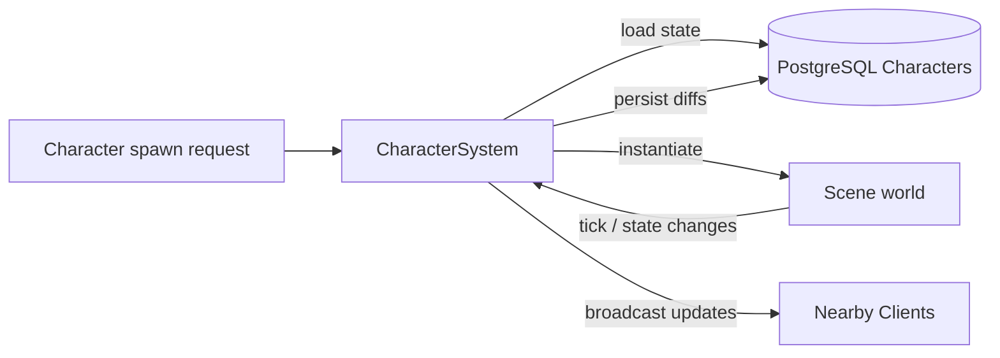

# Character System

**Short description:** SceneServer subsystem for the full player character lifecycle — authentication-triggered loading, async database hydration with session claiming, prefab instantiation, scene validation, network spawning, periodic persistence with session lease refresh, teleportation, death/respawn, out-of-bounds correction, social data broadcast, and connection cleanup with save-then-release semantics.

## Table of Contents

- [Overview](#overview)
- [Supported Platforms](#supported-platforms)
- [Features](#features)
- [Prerequisites](#prerequisites)
- [Installation / Build](#installation--build)
- [Quick Start Guides](#quick-start-guides)
- [Configuration](#configuration)
- [Usage Examples](#usage-examples)
- [Operational Checks](#operational-checks)
- [Flow Diagram](#flow-diagram)
- [Project Structure](#project-structure)
- [License](#license)

## Overview

The Character system is the SceneServer authority for player character lifecycle management. It handles authentication-triggered character loading, async database hydration with session claiming, prefab instantiation, scene validation, FishNet network spawning/despawning, periodic persistence, teleportation across scenes, death/respawn logic, out-of-bounds correction, social data broadcasting, and connection cleanup with save-then-release semantics.

The implementation uses a split execution model:
- **Main thread:** Unity/FishNet object lifecycle, map mutations, prefab instantiation, controller hydration, scene validation, network broadcasts, periodic out-of-bounds checks, and main-thread queue drain.
- **Async worker:** database load/save/session operations (claim, release, lease refresh), social data fetches, and character persistence via `EnqueueAsyncWork`.
- **Main-thread queue:** marshaling async completion actions back to Unity/FishNet-safe context via `ICharacterSystemMainThreadQueueData`.

Character sessions are explicitly claimed and released to prevent dual-server ownership. The session lifecycle uses `TryClaimAsync` during load, `RefreshSessionLeaseAsync` during periodic saves, and `ReleaseAsync` on disconnect, teleport, error, or deinitialize. All release paths follow save-then-release ordering to ensure data is persisted while the session lock is still held.

## Supported Platforms

| Platform | Supported | Notes |
|---|---|---|
| Windows | Yes | |
| Linux | Yes | |
| WebGL | N/A | Server-only module |
| Unity 6.3 LTS | Yes | Required engine version |
| IL2CPP | Yes | Supported scripting backend |

## Features

- Authentication-triggered character load with per-connection rate limiting (`AuthCallbackCooldownSeconds = 2.0s`)
- Async database fetch of character and 13 sub-entity data sets within a single Unit of Work for a consistent snapshot
- Early session claim (`TryClaimAsync`) before sub-entity hydration to fail fast if another server owns the character
- Race-template-based prefab instantiation from the FishNet object pool
- Full controller hydration from pre-fetched DTOs: attributes, inventory, bank, equipment, abilities, known abilities, achievements, friends, guild, party, hotkeys, buffs, factions
- Equipment attribute modifier application during load (`item.Equippable.Equip`)
- Buff restoration with tick-based expiry/next-tick recalculation from remaining time
- Scene validation and FishNet scene loading for both world scenes and instances
- Two-phase client scene handshake: `SceneManager_OnClientLoadedStartScenes` → `ClientValidatedSceneBroadcast` → `OnClientValidatedSceneBroadcastReceived`
- Network spawning with physics scene assignment for stacked scene support
- Immortality toggling during teleport (immortal) and scene entry (mortal)
- `IsLoaded` flag management to prevent controller actions before the character is fully in the world
- Immediate non-DB payload broadcast after spawn: known abilities, known ability events, achievements, inventory, bank, hotkeys
- Async social payload broadcast after spawn: guild members, party members, friend online status
- Targeted broadcast helpers by character name (case-insensitive) or character ID
- Periodic save with configurable interval, main-thread DTO snapshot, async persistence, session lease refresh even on save failure, and atomic processing guard to prevent overlapping save cycles
- Periodic out-of-bounds check with respawn point teleportation for characters outside scene boundaries
- Teleport flow: teleporter validation, scene unload, immortality, position/scene update, instance flag removal, save-then-release with reconnect through world routing
- Death/respawn: player full heal + respawn at bind position (same scene) or save + disconnect for cross-scene bind (reconnect via world server); NPC despawn; pet killed event
- Connection disconnect cleanup: waiting-scene-load character pool return with session release, spawned character mapping removal with save-then-despawn
- Graceful deinitialize: main-thread DTO snapshot of all characters, async persist all, release all sessions (spawned + waiting-to-load)
- Optimistic concurrency via `character.Version++` on every save
- Runtime mapping caches for fast lookups: by ID, by lowercase name, by world, by connection, waiting-scene-load, session tokens
- Lifecycle events for cross-system coordination: `OnBeforeLoadCharacter`, `OnAfterLoadCharacter`, `OnConnect`, `OnDisconnect`, `OnSpawnCharacter`, `OnDespawnCharacter`, `OnPetKilled`
- Per-system main-thread queue isolation with configurable drain cap per frame
- Async worker backpressure via `EnqueueAsyncWork` with entity-key-based consistent routing and diagnostic caller names

## Prerequisites

- **Unity 6.3 LTS**
- **FishNetworking** — networking framework (ServerManager, SceneManager, NetworkObject, NetworkConnection, object pooling)
- **FishMMO Server Core** — provides `ServerBehaviour`, `ICharacterSystem`, `ICharacterMappingData`, `ICharacterSystemRuntimeData`, `ICharacterSystemMainThreadQueueData`, `ISceneServerSystem`, `ISceneServerRuntimeData`, `IAsyncWorkerData`, `CharacterSessionInfo`, `SceneServerAuthenticator`, broadcast types (`ClientValidatedSceneBroadcast`, `ClientScenesUnloadedBroadcast`, `GuildAddBroadcast`, `GuildAddMultipleBroadcast`, `PartyAddBroadcast`, `PartyAddMultipleBroadcast`, `FriendAddBroadcast`, `FriendAddMultipleBroadcast`, `KnownAbilityAddBroadcast`, `KnownAbilityAddMultipleBroadcast`, `KnownAbilityEventAddBroadcast`, `KnownAbilityEventAddMultipleBroadcast`, `AchievementUpdateBroadcast`, `AchievementUpdateMultipleBroadcast`, `InventorySetItemBroadcast`, `InventorySetMultipleItemsBroadcast`, `BankSetItemBroadcast`, `BankSetMultipleItemsBroadcast`, `HotkeySetBroadcast`, `HotkeySetMultipleBroadcast`), `WorldSceneDetails`, `SceneTeleporterDetails`, `CharacterRespawnPositionDetails`, and `IPeriodicUpdateSystem`
- **FishMMO Database** — provides `ICharacterService`, `IUnitOfWorkService`, `ICharacterInventoryService`, `ICharacterBankService`, `ICharacterEquipmentService`, `ICharacterAttributeService`, `ICharacterAbilityService`, `ICharacterKnownAbilityService`, `ICharacterAchievementService`, `ICharacterFriendService`, `ICharacterGuildService`, `ICharacterPartyService`, `ICharacterHotkeyService`, `ICharacterBuffService`, `ICharacterFactionService`, `CharacterData`, and all sub-entity data DTOs
- **FishMMO Shared** — provides `IPlayerCharacter`, `ICharacterDamageController`, `ICharacterAttributeController`, `IAbilityController`, `IAchievementController`, `IInventoryController`, `IBankController`, `IEquipmentController`, `IFriendController`, `IGuildController`, `IPartyController`, `IBuffController`, `IFactionController`, `RaceTemplate`, `CharacterFlags`, `AccessLevel`, `Item`, `Ability`, `Buff`, `Faction`, `Achievement`, `HotkeyData`

## Installation / Build

This is an integrated module within FishMMO. It is included as part of the server-side scene-server implementation and does not require separate installation. Ensure the FishMMO Server Core and its dependencies are properly configured in your Unity project.

## Quick Start Guides

1. Ensure `CharacterSystem` is present on the scene server GameObject (it inherits from `ServerBehaviour` and implements `ICharacterSystem<NetworkConnection, Scene>`). The asset is created via `Create > FishMMO > Server > SceneServer > Character System`.
2. Verify that the following data containers are registered in `DataContainerRegistry`:
   - `CharacterMappingData` → `ICharacterMappingData<NetworkConnection>`
   - `CharacterSystemRuntimeData` → `ICharacterSystemRuntimeData`
   - `CharacterSystemMainThreadQueueData` → `ICharacterSystemMainThreadQueueData`
   - `AsyncWorkerData` (shared async work queue)
3. Verify that `ISceneServerSystem<NetworkConnection>` is registered in `BehaviourRegistry` for scene loading and validation.
4. Verify that `SceneServerAuthenticator` exists in the scene for authentication event subscription.
5. Verify that `ICharacterService` and all sub-entity services are registered in `Database.ServiceRegistry`.
6. Adjust inspector parameters (`saveRate`, `outOfBoundsCheckRate`, `maxMainThreadActionsPerFrame`) as needed.
7. On initialize, `CharacterSystem` registers the authenticator callback, broadcast handlers (`ClientValidatedSceneBroadcast`, `ClientScenesUnloadedBroadcast`), scene manager events, connection state events, character events (`IPlayerCharacter.OnTeleport`, `ICharacterDamageController.OnKilled`), and periodic callbacks for save and out-of-bounds checks.
8. On deinitialize, it unregisters all event handlers, snapshots and persists all character data, and releases all claimed sessions.

## Configuration

### Inspector Parameters

| Parameter | Type | Default | Description |
|---|---|---|---|
| `maxMainThreadActionsPerFrame` | int | 200 | Max character-system actions drained from main-thread queue per frame |
| `saveRate` | float | 30.0 | Interval in seconds between periodic character saves (min 1.0) |
| `outOfBoundsCheckRate` | float | 2.5 | Interval in seconds between out-of-bounds checks (min 0.1) |

### Constants

| Constant | Value | Description |
|---|---|---|
| `AuthCallbackCooldownSeconds` | 2.0 | Minimum seconds between auth-callback character load requests per connection |

### Required Data Containers

| Attribute | Container Type | Purpose |
|---|---|---|
| `[RequiresDataContainer]` | `CharacterMappingData` | Runtime mapping caches (connection, ID, name, world, waiting load, session tokens) |
| `[RequiresDataContainer]` | `CharacterSystemRuntimeData` | Periodic save processing guard (atomic begin/end save) |
| `[RequiresDataContainer]` | `CharacterSystemMainThreadQueueData` | Per-system main-thread queue for marshaling async completions |
| `[RequiresDataContainer]` | `AsyncWorkerData` | Shared async work queue with entity-key routing |

### Runtime Mapping Model

`CharacterMappingData` maintains synchronized runtime indices:

| Map | Key → Value | Purpose |
|---|---|---|
| `CharactersByID` | characterID → `IPlayerCharacter` | Fast lookup by character ID |
| `CharactersByLowerCaseName` | lowercase name → `IPlayerCharacter` | Case-insensitive name lookup |
| `CharactersByWorld` | worldID → (characterID → `IPlayerCharacter`) | Per-world character grouping |
| `ConnectionCharacters` | connection → `IPlayerCharacter` | Active spawned character per connection |
| `WaitingSceneLoadCharacters` | connection → `IPlayerCharacter` | Character loaded from DB but not yet scene-validated |
| `SessionTokens` | characterID → `CharacterSessionInfo` | Claimed session ownership (Token + ServerID) |

### Threading Model

| Thread | Responsibilities |
|---|---|
| Main thread | Unity/FishNet object lifecycle, prefab instantiation, controller hydration, map mutations, scene validation, broadcasts, out-of-bounds checks, main-thread queue drain |
| Async worker | DB load/save/session operations (claim, release, lease refresh), social data fetches, character persistence |

## Usage Examples

### Registered Broadcasts

`CharacterSystem` registers the following server-side broadcast handlers on initialize:

| Broadcast | Handler | Purpose |
|---|---|---|
| `ClientValidatedSceneBroadcast` | `OnClientValidatedSceneBroadcastReceived` | Client confirms scene loaded; server spawns character and sends initial payloads |
| `ClientScenesUnloadedBroadcast` | `OnClientScenesUnloadedBroadcastReceived` | Client confirms scene unloaded; server disconnects if no character is loaded |

### Subscribed Events

| Event Source | Event | Handler | Purpose |
|---|---|---|---|
| `SceneServerAuthenticator` | `OnClientAuthenticationResult` | `Authenticator_OnClientAuthenticationResult` | Entry point for character loading after authentication |
| `SceneManager` | `OnClientLoadedStartScenes` | `SceneManager_OnClientLoadedStartScenes` | Validates character scene and sends `ClientValidatedSceneBroadcast` |
| `IPlayerCharacter` | `OnTeleport` | `IPlayerCharacter_OnTeleport` | Handles teleportation between scenes |
| `ICharacterDamageController` | `OnKilled` | `CharacterDamageController_OnKilled` | Handles player death, NPC despawn, pet death |
| Connection state | Remote connection stopped | `OnRemoteConnectionStopped` | Cleans up auth rate-limit tracking and character mappings |

### Exposed Lifecycle Events

`CharacterSystem` exposes the following events for cross-system coordination:

| Event | Signature | When Fired |
|---|---|---|
| `OnBeforeLoadCharacter` | `Action<NetworkConnection, long>` | Before character is loaded from the database |
| `OnAfterLoadCharacter` | `Action<NetworkConnection, IPlayerCharacter>` | After character is successfully loaded and scene load initiated |
| `OnConnect` | `Action<NetworkConnection, IPlayerCharacter>` | After character is added to active connection mapping (post-spawn) |
| `OnDisconnect` | `Action<NetworkConnection, IPlayerCharacter>` | After character is removed from active mapping (disconnect or teleport) |
| `OnSpawnCharacter` | `Action<NetworkConnection, IPlayerCharacter, Scene>` | After character is spawned in the scene via `ServerManager.Spawn` |
| `OnDespawnCharacter` | `Action<NetworkConnection, IPlayerCharacter>` | After character is despawned during save-and-despawn |
| `OnPetKilled` | `Action<NetworkConnection, IPlayerCharacter>` | After a pet owned by a player character is killed |

### Character Load Pipeline

**Step 1 — Authentication callback** (`Authenticator_OnClientAuthenticationResult`):

1. Rate-limits per-connection auth callbacks (`AuthCallbackCooldownSeconds`).
2. Validates: connection not already loading, authenticated, account name resolved, `ISceneServerSystem` available, `ICharacterService` available, server ID valid.
3. Enqueues `LoadCharacterAsync` to the async worker.

**Step 2 — Async DB snapshot + session claim** (`LoadCharacterAsync`):

1. Begins `IUnitOfWork` for consistent snapshot.
2. Fetches the selected character for the account via `ICharacterService.FetchByAccountAsync`.
3. Claims character session via `TryClaimAsync(characterID, serverID)` before heavy hydration — fails fast if another server owns the character.
4. Fetches 13 sub-entity datasets sequentially within the UoW: inventory, bank, equipment, attributes, abilities, known abilities, achievements, friends, guild, party, hotkeys, buffs, factions.
5. Commits the read-only transaction.
6. Bundles all data into `CharacterLoadContext` and marshals to main thread.
7. On failure after claim: releases session and kicks connection.

**Step 3 — Main-thread instantiate + hydrate** (`InstantiateAndLoadCharacter`):

1. Validates connection is still active; releases session if not.
2. Validates character is not already loaded.
3. Fires `OnBeforeLoadCharacter`.
4. Looks up `RaceTemplate` and instantiates prefab from FishNet object pool.
5. Populates base character fields from `CharacterData` (ID, name, account, world, scene, bind point, instance, race, flags, etc.).
6. Hydrates all controllers from pre-fetched DTOs: attributes (resource vs regular), inventory, bank, equipment (with `Equippable.Equip`), abilities, known abilities, achievements, friends, guild, party, hotkeys, buffs (with tick recalculation), factions.
7. Resolves scene (world or instance) and attempts scene load via `ISceneServerSystem.TryLoadSceneForConnection`.
8. On success: fires `OnAfterLoadCharacter`, stores session token, moves character to `WaitingSceneLoadCharacters`.
9. On failure: releases session, pools prefab, disconnects.

**Step 4 — Scene validation + spawn** (`SceneManager_OnClientLoadedStartScenes` → `OnClientValidatedSceneBroadcastReceived`):

1. `SceneManager_OnClientLoadedStartScenes`: verifies character exists in `WaitingSceneLoadCharacters`, validates scene is loaded and valid, sends `ClientValidatedSceneBroadcast` to client.
2. `OnClientValidatedSceneBroadcastReceived`: promotes character from `WaitingSceneLoadCharacters` into all active maps (`ConnectionCharacters`, `CharactersByID`, `CharactersByLowerCaseName`, `CharactersByWorld`), sets physics scene, toggles mortal, activates GameObject, enables `IsLoaded` flag, spawns via `ServerManager.Spawn`, fires `OnSpawnCharacter` and `OnConnect`, sends non-DB payloads, enqueues async social data fetch.

### Initial Payloads After Spawn

**Immediate non-DB payloads** (`SendNonDbCharacterData`):

| Payload | Broadcast Type |
|---|---|
| Known base abilities | `KnownAbilityAddMultipleBroadcast` |
| Known ability events | `KnownAbilityEventAddMultipleBroadcast` |
| Achievements | `AchievementUpdateMultipleBroadcast` |
| Inventory items | `InventorySetMultipleItemsBroadcast` |
| Bank items | `BankSetMultipleItemsBroadcast` |
| Hotkeys | `HotkeySetMultipleBroadcast` |

**Async social payloads** (`SendAllCharacterDataAsync`):

| Payload | Broadcast Type |
|---|---|
| Guild members | `GuildAddMultipleBroadcast` |
| Party members | `PartyAddMultipleBroadcast` |
| Friend online status | `FriendAddMultipleBroadcast` |

### Session Ownership and Release

Character sessions are explicitly claimed/released to prevent dual-server ownership:

| Operation | Method | When |
|---|---|---|
| Claim | `TryClaimAsync(characterID, serverID)` | During `LoadCharacterAsync`, before sub-entity hydration |
| Lease refresh | `RefreshSessionLeaseAsync(characterID, serverID, token)` | During `SaveAllCharactersAsync`, per character (even on save failure) |
| Release | `ReleaseAsync(characterID, serverID, token)` | On disconnect, teleport, load failure, scene validation failure, deinitialize |

All release paths follow **save-then-release** ordering via `SaveAndReleaseCharacterAsync` to ensure data is persisted while the session lock is still held. `TryExtractAndReleaseSession` is used for non-save release paths (waiting-to-load characters, scene validation failures).

### Periodic Save

`OnPeriodicSave(deltaTime)` fires at `saveRate` intervals:

1. Validates initialization and character count.
2. Acquires atomic processing guard via `TryBeginSave`.
3. Snapshots character DTOs on the main thread via `BuildCharacterData` (increments `character.Version` for optimistic concurrency).
4. Captures all session tokens.
5. Enqueues `SaveAllCharactersAsync`:
   - Persists each character via `ICharacterService.PersistAsync`.
   - Refreshes session lease for each character regardless of save success.
   - Releases processing guard in `finally`.

### Periodic Out-of-Bounds Check

`OnPeriodicOutOfBoundsCheck(deltaTime)` fires at `outOfBoundsCheckRate` intervals:

1. Iterates all `ConnectionCharacters`.
2. Resolves scene name (instance or world).
3. Checks character position against `WorldSceneDetails.Boundaries`.
4. If out of bounds: selects a random respawn position and teleports the character.

### Teleport Flow

`IPlayerCharacter_OnTeleport(character)`:

1. Validates character exists and `IsTeleporting`.
2. Resolves current scene from `WorldSceneDetailsCache`.
3. Validates teleporter exists in scene details.
4. Tells connection to unload current world scene.
5. Sets character immortal.
6. Fires `OnDisconnect` early (requires current scene context).
7. Updates `SceneName` and position/rotation to teleporter destination.
8. Removes instance and loaded flags.
9. Calls `RemoveCharacterConnectionMapping` with `skipOnDisconnect: true` — triggers save-then-release, forcing reconnect through world routing.

### Death/Respawn Flow

`CharacterDamageController_OnKilled(killer, defender)`:

1. Removes all buffs from the defender.
2. **Player character:**
   - Full heal via `damageController.Heal`.
   - If bind scene differs from current scene: update scene/position to bind point, remove instance/loaded flags, disconnect (reconnects via world server).
   - If bind scene matches: teleport to bind position in place.
3. **NPC:** calls `npc.Despawn()`.
4. **Pet:** fires `OnPetKilled` for the pet owner.

### Targeted Broadcasts

| Method | Lookup | Returns |
|---|---|---|
| `SendBroadcastToCharacter<T>(string characterName, T msg)` | `CharactersByLowerCaseName` (case-insensitive) | `true` if sent |
| `SendBroadcastToCharacter<T>(long characterID, T msg)` | `CharactersByID` | `true` if sent |

### Disconnect Cleanup

`OnRemoteConnectionStopped(conn)`:

1. Removes auth callback rate-limit tracking for the connection.
2. Calls `RemoveCharacterConnectionMapping(conn)`.

`RemoveCharacterConnectionMapping(conn, skipOnDisconnect)`:

1. Checks for waiting-scene-load character: removes from map, extracts and releases session, fires `OnDisconnect`, pools prefab.
2. Checks for spawned character: removes from all mapping dictionaries (`ConnectionCharacters`, `CharactersByID`, `CharactersByLowerCaseName`, `CharactersByWorld`).
3. Fires `OnDisconnect` (unless `skipOnDisconnect`).
4. Extracts session info from `SessionTokens`.
5. Calls `SaveAndDespawnCharacter`: disables `IsLoaded`, snapshots DTO on main thread, enqueues `SaveAndReleaseCharacterAsync`, despawns immediately.

### Deinitialize

`OnDeinitialize`:

1. Unregisters all event handlers (authenticator, broadcasts, scene manager, connection state, character events, periodic callbacks).
2. Snapshots all character DTOs on the main thread.
3. Captures all session tokens (spawned + waiting-to-load).
4. Synchronously runs async task: persists all characters, releases all sessions.

### Failure Semantics

- Auth rate-limited connections are silently skipped (timestamp not updated).
- Invalid authentication state results in `Kick(UnusualActivity)`.
- Failed `TryClaimAsync` results in kick — no sub-entity data is fetched.
- Connection dying between async load and main-thread marshal triggers session release without kick.
- Duplicate character load attempts are detected via `CharactersByID` and result in session release + kick.
- Failed scene load releases session, pools prefab, and disconnects.
- Scene validation failures after `WaitingSceneLoadCharacters` release session, pool prefab, and kick.
- Failed `EnqueueAsyncWork` logs a warning; critical paths (load, save-and-despawn) also take fallback action.
- `SaveAllCharactersAsync` refreshes session leases even when individual saves fail.
- Deinitialize catches per-character snapshot/save/release failures independently.

## Operational Checks

| Check | How to Verify |
|---|---|
| Initialization success | Confirm `CharacterSystem` logs "Initialized (SaveRate=30s, OutOfBoundsCheckRate=2.5s)" without errors on server startup |
| Data containers available | Verify `ICharacterMappingData`, `ICharacterSystemRuntimeData`, `ICharacterSystemMainThreadQueueData`, and `IAsyncWorkerData` all resolve from `DataContainerRegistry` |
| Scene server system available | Verify `ISceneServerSystem<NetworkConnection>` resolves from `BehaviourRegistry` |
| Authenticator found | Verify `SceneServerAuthenticator` exists in the scene and `OnClientAuthenticationResult` is subscribed |
| Character service available | Verify `ICharacterService` resolves from `Database.ServiceRegistry` |
| Auth rate limiting | Send rapid repeated auth callbacks from the same connection; confirm excess requests are logged as rate-limited |
| Character load | Authenticate a client with a selected character; confirm character is loaded, hydrated, and placed in `WaitingSceneLoadCharacters` |
| Session claim | During load, confirm `TryClaimAsync` succeeds and session token is stored in `SessionTokens` |
| Session claim conflict | Attempt to load a character already claimed by another server; confirm `TryClaimAsync` fails and connection is kicked |
| Sub-entity hydration | After load, confirm all 13 sub-entity datasets are populated on the character's controllers |
| Scene validation | Confirm `SceneManager_OnClientLoadedStartScenes` validates the scene and sends `ClientValidatedSceneBroadcast` |
| Character spawn | Confirm `OnClientValidatedSceneBroadcastReceived` promotes character into active maps, spawns network object, and fires `OnSpawnCharacter` |
| Non-DB payload broadcast | After spawn, confirm client receives known abilities, achievements, inventory, bank, and hotkeys broadcasts |
| Social payload broadcast | After spawn, confirm client receives guild members, party members, and friend online status broadcasts |
| Periodic save | Wait for `saveRate` interval; confirm `OnPeriodicSave` fires, characters are persisted, and session leases are refreshed |
| Save processing guard | Trigger overlapping save cycles; confirm only one executes at a time via `TryBeginSave` |
| Session lease refresh | During periodic save, confirm `RefreshSessionLeaseAsync` is called for each character even on save failure |
| Out-of-bounds check | Move a character outside scene boundaries; confirm `OnPeriodicOutOfBoundsCheck` teleports them to a respawn point |
| Teleport flow | Trigger a valid teleporter; confirm scene unload, immortality, position update, and save-then-release with reconnect |
| Invalid teleporter | Trigger a non-existent teleporter name; confirm it is logged and no mutation occurs |
| Player death (same scene) | Kill a player character whose bind scene matches current scene; confirm full heal and respawn at bind position |
| Player death (cross-scene) | Kill a player character whose bind scene differs; confirm scene/position update, flag removal, and disconnect |
| NPC death | Kill an NPC; confirm `Despawn()` is called |
| Pet death | Kill a pet; confirm `OnPetKilled` is fired for the pet owner |
| Disconnect cleanup | Disconnect a client; confirm character is saved, despawned, session released, and all mappings removed |
| Waiting character disconnect | Disconnect a client with a character in `WaitingSceneLoadCharacters`; confirm session released and prefab pooled |
| Deinitialize | Trigger server deinitialize; confirm all characters are saved, all sessions released, and all handlers unregistered |
| Optimistic concurrency | Save a character; confirm `character.Version` is incremented in the persisted `CharacterData` |
| Main-thread queue drain | Confirm queued async results are dispatched on the main thread within `maxMainThreadActionsPerFrame` per frame |
| Async backpressure | Saturate async worker queue; confirm new work is rejected with a logged warning |
| Connection dead after async | Kill a connection during async load; confirm session is released without kick on main-thread marshal |
| Duplicate load prevention | Attempt to load an already-loaded character; confirm session release and kick |

## Flow Diagram

### High-Level Overview



### Character Load Pipeline

```
Authenticator_OnClientAuthenticationResult(conn, authenticated)
│
├─ 1. Rate-limit check (AuthCallbackCooldownSeconds)
├─ 2. Validate: not already loading, authenticated, account name, dependencies
├─ 3. Resolve serverID on main thread
└─ 4. EnqueueAsyncWork → LoadCharacterAsync
       │
       ├─ IUnitOfWorkService.BeginAsync → UoW
       ├─ ICharacterService.FetchByAccountAsync(accountName, selected: true)
       ├─ ICharacterService.TryClaimAsync(characterID, serverID) → sessionToken
       ├─ Fetch 13 sub-entity datasets within UoW:
       │    inventory, bank, equipment, attributes, abilities,
       │    knownAbilities, achievements, friends, guild, party,
       │    hotkeys, buffs, factions
       ├─ UoW.CommitAsync (read-only)
       └─ TryEnqueueMainThread → InstantiateAndLoadCharacter(CharacterLoadContext)
              │
              ├─ Validate connection still active
              ├─ Validate character not already loaded
              ├─ OnBeforeLoadCharacter(conn, characterID)
              ├─ RaceTemplate.Get → Instantiate prefab from pool
              ├─ Populate base character fields from CharacterData
              ├─ Hydrate controllers: attributes, inventory, bank,
              │    equipment (+Equip), abilities, knownAbilities,
              │    achievements, friends, guild, party, hotkeys,
              │    buffs (tick recalc), factions
              ├─ TryLoadSceneForConnection(conn, instance)
              ├─ OnAfterLoadCharacter(conn, character)
              ├─ Store SessionTokens[characterID]
              └─ WaitingSceneLoadCharacters.Add(conn, character)
```

### Scene Validation + Spawn

```
SceneManager_OnClientLoadedStartScenes(conn, asServer)
│
├─ Validate character in WaitingSceneLoadCharacters
├─ Validate scene is loaded and valid
└─ Broadcast ClientValidatedSceneBroadcast to conn

OnClientValidatedSceneBroadcastReceived(conn, msg, channel)
│
├─ Remove from WaitingSceneLoadCharacters
├─ Add to ConnectionCharacters, CharactersByID,
│    CharactersByLowerCaseName, CharactersByWorld
├─ Set physics scene (stacked scene support)
├─ Set mortal, activate GameObject, enable IsLoaded
├─ ServerManager.Spawn(nob, conn, scene)
├─ OnSpawnCharacter(conn, character, scene)
├─ OnConnect(conn, character)
├─ SendNonDbCharacterData (immediate, main thread):
│    knownAbilities, knownAbilityEvents, achievements,
│    inventory, bank, hotkeys
└─ EnqueueAsyncWork → SendAllCharacterDataAsync:
       guildMembers, partyMembers, friendOnlineStatus
```

### Disconnect + Save

```
OnRemoteConnectionStopped(conn)
│
├─ Remove auth rate-limit tracking
└─ RemoveCharacterConnectionMapping(conn)
       │
       ├─ [Waiting character] Remove from WaitingSceneLoadCharacters
       │    ├─ TryExtractAndReleaseSession
       │    ├─ OnDisconnect(conn, character)
       │    └─ Pool prefab
       │
       └─ [Spawned character] Remove from all mappings
            ├─ OnDisconnect(conn, character)
            ├─ Extract SessionTokens entry
            └─ SaveAndDespawnCharacter(conn, character, sessionInfo)
                   │
                   ├─ DisableFlags(IsLoaded)
                   ├─ BuildCharacterData (Version++)
                   ├─ EnqueueAsyncWork → SaveAndReleaseCharacterAsync
                   │    ├─ SaveCharacterAsync (persist while holding lock)
                   │    └─ ReleaseCharacterSessionAsync (Online → Offline)
                   ├─ OnDespawnCharacter(conn, character)
                   └─ ServerManager.Despawn(nob, Pool)
```

### Teleport

```
IPlayerCharacter_OnTeleport(character)
│
├─ Validate character exists and IsTeleporting
├─ Resolve current scene from WorldSceneDetailsCache
├─ Validate teleporter in SceneTeleporterDetails
├─ UnloadSceneForConnection(conn, currentScene)
├─ Set immortal
├─ OnDisconnect(conn, character) [early, needs current scene]
├─ Update SceneName, position, rotation to destination
├─ DisableFlags(IsInInstance, IsLoaded)
└─ RemoveCharacterConnectionMapping(conn, skipOnDisconnect: true)
       └─ Save-then-release → reconnect via world routing
```

### Death/Respawn

```
CharacterDamageController_OnKilled(killer, defender)
│
├─ RemoveAll buffs
├─ [Player + different bind scene]
│    ├─ Heal(999999)
│    ├─ Update SceneName/position to bind point
│    ├─ DisableFlags(IsInInstance, IsLoaded)
│    └─ Disconnect → reconnect via world server
├─ [Player + same bind scene]
│    ├─ Heal(999999)
│    └─ SetPositionAndRotationAndVelocity(bindPosition)
├─ [NPC] → Despawn()
└─ [Pet] → OnPetKilled(petOwner.conn, petOwner)
```

### Periodic Save

```
OnPeriodicSave(deltaTime)
│
├─ Validate initialized, characters exist
├─ TryBeginSave (atomic guard)
├─ Snapshot all CharacterData DTOs on main thread (Version++)
├─ Capture all SessionTokens
└─ EnqueueAsyncWork → SaveAllCharactersAsync
       │
       ├─ For each character:
       │    ├─ ICharacterService.PersistAsync(charData)
       │    └─ ICharacterService.RefreshSessionLeaseAsync(charID, serverID, token)
       └─ finally: EndSave (release guard)
```

## Project Structure

### Directory Tree

```
Character/
├── CharacterSystem.cs                    # Core lifecycle: initialization, deinitialize, update, main-thread queue, async work helpers
├── CharacterSystem.Connection.cs         # Partial: disconnect handling, teleportation, out-of-bounds checks, death/respawn
├── CharacterSystem.Loading.cs            # Partial: auth callback, async DB fetch, prefab instantiation, scene validation, spawn
├── CharacterSystem.Saving.cs             # Partial: periodic save, save-and-despawn, session claim/release, BuildCharacterData
├── CharacterSystem.Social.cs             # Partial: async guild/party/friend fetch, non-DB payload broadcast, targeted broadcasts
├── CharacterMappingData.cs               # Runtime mapping caches (connection, ID, name, world, waiting load, session tokens)
├── CharacterSystemRuntimeData.cs         # Runtime state: atomic save processing guard (TryBeginSave/EndSave)
├── CharacterSystemMainThreadQueueData.cs # Per-system main-thread queue container
└── README.md
```

### Related Core Contracts

```
Server/Core/World/SceneServer/Character/
├── ICharacterSystem.cs
├── ICharacterMappingData.cs
├── ICharacterSystemMainThreadQueueData.cs
├── ICharacterSystemRuntimeData.cs
└── CharacterSessionInfo.cs

Server/Core/RuntimeData/
├── IAsyncWorkerData.cs
└── IMainThreadQueueData.cs
```

### Inheritance Hierarchy

**Behaviour:**

```
ServerBehaviour
└── CharacterSystem : ICharacterSystem<NetworkConnection, Scene>
        Partial classes:
        ├── CharacterSystem.Connection.cs
        ├── CharacterSystem.Loading.cs
        ├── CharacterSystem.Saving.cs
        └── CharacterSystem.Social.cs
```

**Runtime Data Containers:**

```
RuntimeDataContainer
├── CharacterMappingData : ICharacterMappingData<NetworkConnection>
├── CharacterSystemRuntimeData : ICharacterSystemRuntimeData
└── SystemMainThreadQueueData (abstract)
    └── CharacterSystemMainThreadQueueData : ICharacterSystemMainThreadQueueData
```

## License

This module is part of the FishMMO project and is subject to the FishMMO project license.
