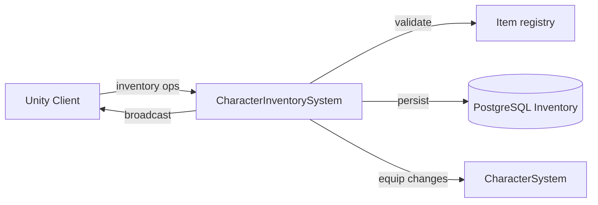

# Character Inventory System

**Short description:** SceneServer authority for item movement across player inventory, equipment, and bank containers, validating incoming client broadcasts, applying runtime container mutations, persisting state through async database services, and echoing successful operations back to the originating client.

## Table of Contents

- [Overview](#overview)
- [Supported Platforms](#supported-platforms)
- [Features](#features)
- [Prerequisites](#prerequisites)
- [Installation / Build](#installation--build)
- [Quick Start Guides](#quick-start-guides)
- [Configuration](#configuration)
- [Usage Examples](#usage-examples)
- [Operational Checks](#operational-checks)
- [Flow Diagram](#flow-diagram)
- [Project Structure](#project-structure)
- [License](#license)

## Overview

The Character Inventory system is the SceneServer authority for item movement across player inventory, equipment, and bank containers. It validates incoming client broadcasts, applies runtime container mutations, persists resulting state through database services, and echoes successful operations back to the originating client.

> **Note:** `EquipmentController` is now part of the prediction pipeline (`IPredictableController` at Order 93). Equipment state is reconciled via `CharacterReconcileData`. The broadcast path (`EquipmentEquipItemBroadcast`/`EquipmentUnequipItemBroadcast`) handles client→server requests and echoes; attribute application is handled by the reconcile path. The legacy `EquipmentSetItemBroadcast` and `EquipmentSetMultipleItemsBroadcast` have been removed.

The system is designed to keep item state deterministic by:
- Executing container mutations on the main thread.
- Building DTO snapshots immediately after mutation.
- Enqueueing persistence work through the centralized async worker.
- Using optimistic concurrency versions on item and attribute records.

A per-connection ingress guard provides debounce, global rate limiting, and in-flight tracking to prevent duplicate or rapid-fire mutation requests. Stale guard entries are swept periodically via `OnUpdate`.

## Supported Platforms

| Platform | Supported | Notes |
|---|---|---|
| Windows | Yes | |
| Linux | Yes | |
| WebGL | N/A | Server-only module |
| Unity 6.3 LTS | Yes | Required engine version |
| IL2CPP | Yes | Supported scripting backend |

## Features

- Server-authoritative inventory, equipment, and bank item management
- Same-container slot swaps via `SwapItemSlots` with affected-item tracking
- Cross-container item moves/swaps between inventory, equipment, and bank with atomic rollback on failure
- Inventory item removal with async database slot deletion
- Equipment equip from inventory or bank with attribute persistence
- Equipment unequip to inventory or bank with attribute persistence
- Bank item removal with banker proximity validation
- Bank slot swaps (within bank, or between bank and inventory) with banker proximity validation
- Per-operation ingress debounce via configurable `ingressDebounceMilliseconds`
- Global per-connection rate limit (`GlobalPerConnectionRateMilliseconds` = 15 ms) across all inventory operations
- Bounded ingress guard sweep with configurable interval, TTL, and max removals per pass
- In-flight guard keys prevent concurrent processing of the same operation for the same connection
- Slot bounds validation before any container mutation
- Equipment slot enum validation (`ItemSlot`) before equip/unequip
- Banker scene object validation: existence check, scene match, interaction range, and banker type confirmation
- Optimistic concurrency via `Version` increments on all item and attribute DTOs
- Async persistence via `TryEnqueueAsyncWork` with per-character ordered processing (`entityKey = characterID`)
- Backpressure handling: persistence enqueue returns `false` when queue is unavailable or full, with logged warnings
- Equipment/attribute coupling: equip and unequip operations persist both item movement and character attribute snapshots
- Cross-container swap rollback: if an exception occurs during a cross-container move, both containers are restored to their original state
- `CreateAssetMenu` integration for ScriptableObject creation in the Unity Editor

## Prerequisites

- **Unity 6.3 LTS**
- **FishNetworking** — networking framework
- **FishMMO Server Core** — provides `ServerBehaviour`, `ICharacterInventorySystem`, `ICharacterInventorySystemRuntimeData`, `IngressGuard`, `AsyncWorkerData`, broadcast types, and container interfaces
- **FishMMO Shared** — provides `IPlayerCharacter`, `IInventoryController`, `IEquipmentController`, `IBankController`, `ICharacterAttributeController`, `IItemContainer`, `Item`, `ItemSlot`, `InventoryType`, `ISceneObject`, `IInteractable`, `Banker`
- **FishMMO Database** — provides `ICharacterItemService`, `ICharacterAttributeService`, and DTO types (`CharacterItemData`, `CharacterAttributeData`)

## Installation / Build

This is an integrated module within FishMMO. It is included as part of the server-side scene-server implementation and does not require separate installation. Ensure the FishMMO Server Core and its dependencies are properly configured in your Unity project.

## Quick Start Guides

1. Create the `CharacterInventorySystem` ScriptableObject asset via **Assets → Create → FishMMO → Server → SceneServer → Character Inventory System**.
2. Ensure the asset is assigned to the scene server's system list so `InitializeOnce()` is invoked at startup.
3. Verify that the following data containers are registered in `DataContainerRegistry`:
   - `CharacterInventorySystemRuntimeData` → `ICharacterInventorySystemRuntimeData`
   - `AsyncWorkerData` (shared async work queue)
4. Verify the following database services are registered in `Server.Database.ServiceRegistry`:
   - `ICharacterItemService`
   - `ICharacterAttributeService`
5. On initialize, `CharacterInventorySystem` validates all dependencies and registers broadcast handlers for inventory, equipment, and bank operations.
6. On deinitialize, it unregisters all broadcast handlers and clears the ingress guard.
7. Clients send the appropriate broadcast (e.g., `InventorySwapItemSlotsBroadcast`, `EquipmentEquipItemBroadcast`) and receive the same broadcast back on success.

## Configuration

### Inspector Parameters

| Parameter | Type | Default | Description |
|---|---|---|---|
| `ingressDebounceMilliseconds` | int | 60 | Minimum milliseconds between identical inventory requests from the same connection |
| `ingressSweepIntervalSeconds` | float | 5.0 | Seconds between bounded ingress guard cleanup sweeps |
| `ingressEntryTtlSeconds` | float | 30.0 | Seconds before stale ingress guard entries are removed |
| `ingressSweepMaxRemovals` | int | 128 | Maximum stale ingress guard entries removed per sweep |

### Internal Constants

| Constant | Value | Description |
|---|---|---|
| `GlobalPerConnectionRateMilliseconds` | 15 | Global per-connection rate limit in milliseconds across all inventory operations |

### Clamped Minimums

On initialization, inspector values are clamped to safe minimums:

| Parameter | Minimum |
|---|---|
| `ingressDebounceMilliseconds` | 0 |
| `ingressSweepIntervalSeconds` | 0.25 |
| `ingressEntryTtlSeconds` | 1.0 |
| `ingressSweepMaxRemovals` | 1 |

### Ingress Operation Codes

| Code | Value | Operation |
|---|---|---|
| `InventoryRemove` | 1 | Remove item from inventory |
| `InventorySwap` | 2 | Swap inventory slots (or cross-container with bank) |
| `EquipmentEquip` | 3 | Equip item from inventory or bank |
| `EquipmentUnequip` | 4 | Unequip item to inventory or bank |
| `BankRemove` | 5 | Remove item from bank |
| `BankSwap` | 6 | Swap bank slots (or cross-container with inventory) |

### Threading Model

| Thread | Work |
|---|---|
| Main thread | Request validation, ingress guard checks, container mutations, DTO building, broadcast dispatch, ingress guard sweep |
| Async worker | Database persistence and deletion (`PersistInventoryItemsAsync`, `PersistBankItemsAsync`, `PersistEquipmentItemAsync`, `PersistAttributesAsync`, `DeleteInventorySlotAsync`, `DeleteBankSlotAsync`, `DeleteEquipmentSlotAsync`) |

## Usage Examples

### Broadcast Handlers

`CharacterInventorySystem` registers the following server-side broadcast handlers on initialize:

| Broadcast | Handler | Purpose |
|---|---|---|
| `InventoryRemoveItemBroadcast` | `OnServerInventoryRemoveItemBroadcastReceived` | Remove an item from inventory |
| `InventorySwapItemSlotsBroadcast` | `OnServerInventorySwapItemSlotsBroadcastReceived` | Swap inventory slots or move bank → inventory |
| `EquipmentEquipItemBroadcast` | `OnServerEquipmentEquipItemBroadcastReceived` | Equip item from inventory or bank |
| `EquipmentUnequipItemBroadcast` | `OnServerEquipmentUnequipItemBroadcastReceived` | Unequip item to inventory or bank |
| `BankRemoveItemBroadcast` | `OnServerBankRemoveItemBroadcastReceived` | Remove an item from bank |
| `BankSwapItemSlotsBroadcast` | `OnServerBankSwapItemSlotsBroadcastReceived` | Swap bank slots or move inventory → bank |

### Inventory Remove Path

`OnServerInventoryRemoveItemBroadcastReceived(conn, msg, channel)`:

1. Validates connection and spawned player object.
2. Acquires ingress guard for `InventoryRemove`.
3. Validates character exists and is not teleporting.
4. Resolves `IInventoryController`.
5. Validates slot bounds via `IsValidSlot(msg.Slot)`.
6. Calls `RemoveItem(msg.Slot)` on the inventory controller.
7. Increments item `Version` and enqueues async `DeleteInventorySlotAsync`.
8. Broadcasts success back to client.

### Inventory Swap Path

`OnServerInventorySwapItemSlotsBroadcastReceived(conn, msg, channel)`:

1. Validates connection, spawned player, character, and `IInventoryController`.
2. Acquires ingress guard for `InventorySwap`.
3. Switches on `msg.FromInventory`:
   - **Inventory → Inventory:** Validates both slot bounds, calls `SwapContainerItems(inventoryController, from, to)`, persists affected items.
   - **Bank → Inventory:** Validates banker scene object, validates slot bounds, calls `SwapContainerItems(bankController, inventoryController, from, to)`, persists bank items, deletes vacated bank slots, persists inventory items.
   - **Equipment → Inventory:** Not handled (no-op).
4. Broadcasts success back to client.

### Equipment Equip Path

`OnServerEquipmentEquipItemBroadcastReceived(conn, msg, channel)`:

1. Validates connection, spawned player, character, and `IEquipmentController`.
2. Acquires ingress guard for `EquipmentEquip`.
3. Validates `msg.Slot` is a defined `ItemSlot` enum value.
4. Switches on `msg.FromInventory`:
   - **Inventory → Equipment:** Validates slot bounds, retrieves item, calls `equipmentController.Equip(...)`. If replacing an existing equipped item, persists the swapped-back inventory item; otherwise deletes the vacated inventory slot. Persists the new equipment slot and character attributes.
   - **Bank → Equipment:** Validates banker scene object, validates slot bounds, follows same logic as inventory equip but against the bank controller.
   - **Equipment → Equipment:** Not handled (returns).
5. Broadcasts success back to client.

### Equipment Unequip Path

`OnServerEquipmentUnequipItemBroadcastReceived(conn, msg, channel)`:

1. Validates connection, spawned player, character, and `IEquipmentController`.
2. Acquires ingress guard for `EquipmentUnequip`.
3. Validates `msg.Slot` is a defined `ItemSlot` enum value.
4. Switches on `msg.ToInventory`:
   - **Equipment → Inventory:** Retrieves equipped item, calls `equipmentController.Unequip(inventoryController, ...)`, persists modified inventory slots, deletes old equipment slot, persists character attributes.
   - **Equipment → Bank:** Validates banker scene object, follows same logic as inventory unequip but against the bank controller.
   - **Equipment → Equipment:** Not handled (no-op).
5. Broadcasts success back to client.

### Bank Remove Path

`OnServerBankRemoveItemBroadcastReceived(conn, msg, channel)`:

1. Validates connection, spawned player, character, and `IBankController`.
2. Acquires ingress guard for `BankRemove`.
3. Validates banker scene object via `ValidateBankerSceneObject`.
4. Validates slot bounds via `IsValidSlot(msg.Slot)`.
5. Calls `RemoveItem(msg.Slot)` on the bank controller.
6. Increments item `Version` and enqueues async `DeleteBankSlotAsync`.
7. Broadcasts success back to client.

### Bank Swap Path

`OnServerBankSwapItemSlotsBroadcastReceived(conn, msg, channel)`:

1. Validates connection, spawned player, character, and `IBankController`.
2. Acquires ingress guard for `BankSwap`.
3. Validates banker scene object.
4. Switches on `msg.FromInventory`:
   - **Inventory → Bank:** Validates both slot bounds, calls `SwapContainerItems(inventoryController, bankController, from, to)`, persists inventory items, deletes vacated inventory slots, persists bank items.
   - **Bank → Bank:** Validates both slot bounds, calls `SwapContainerItems(bankController, from, to)`, persists affected bank items.
   - **Equipment → Bank:** Not handled (no-op).
5. Broadcasts success back to client.

### Public Swap Methods

| Method | Parameters | Description |
|---|---|---|
| `SwapContainerItems` | `(IItemContainer container, int fromIndex, int toIndex, out List<Item> affectedItems)` | Same-container swap; returns affected items |
| `SwapContainerItems` | `(IItemContainer from, IItemContainer to, int fromIndex, int toIndex, out List<Item> affectedFromItems, out List<long> deletedFromSlots, out List<Item> affectedToItems)` | Cross-container swap with rollback; returns affected items and deleted slot indices |

### Banker Validation

`ValidateBankerSceneObject(sceneObjectID, character)` performs four checks:

1. Scene object exists in `SceneObject.Objects`.
2. Banker is in the same scene as the character (`scene.handle` match).
3. Character is within interaction range (`IInteractable.InRange`).
4. Interactable is a `Banker` instance.

### Failure Semantics

- Validation failures: no state change, no broadcast.
- Mutation success: client receives the original success broadcast payload.
- Cross-container swap exceptions: both containers are rolled back to their original state.
- Persistence enqueue/service failures: logged for operational visibility.
- Runtime state remains authoritative in-memory; persistence failures are observable through logs and should be monitored operationally.

## Operational Checks

| Check | How to Verify |
|---|---|
| Initialization success | Confirm `CharacterInventorySystem` logs "Initialized" without errors on server startup |
| Data containers available | Verify `ICharacterInventorySystemRuntimeData` and `AsyncWorkerData` resolve from `DataContainerRegistry` |
| Database services available | Verify `ICharacterItemService`, and `ICharacterAttributeService` resolve from `Server.Database.ServiceRegistry` |
| Inventory remove | Remove an inventory item; confirm client receives `InventoryRemoveItemBroadcast` back and slot is deleted from database |
| Inventory swap (same container) | Swap two inventory slots; confirm client receives `InventorySwapItemSlotsBroadcast` back and both slots are persisted |
| Bank → inventory swap | Swap a bank item to inventory while near a banker; confirm both containers updated and persisted |
| Inventory → bank swap | Swap an inventory item to bank while near a banker; confirm both containers updated and persisted |
| Equip from inventory | Equip an item from inventory; confirm equipment slot persisted, inventory slot deleted or swapped, and attributes persisted |
| Equip from bank | Equip an item from bank while near a banker; confirm equipment slot persisted, bank slot deleted or swapped, and attributes persisted |
| Unequip to inventory | Unequip an item to inventory; confirm inventory slots persisted, equipment slot deleted, and attributes persisted |
| Unequip to bank | Unequip an item to bank while near a banker; confirm bank slots persisted, equipment slot deleted, and attributes persisted |
| Bank remove | Remove a bank item while near a banker; confirm client receives `BankRemoveItemBroadcast` back and slot is deleted from database |
| Bank swap (same container) | Swap two bank slots while near a banker; confirm client receives `BankSwapItemSlotsBroadcast` back and both slots are persisted |
| Banker validation failure | Attempt a bank operation without a valid banker in range; confirm request is silently dropped |
| Slot bounds validation | Send a broadcast with an out-of-bounds slot index; confirm request is silently dropped |
| Equipment slot validation | Send an equip broadcast with an undefined `ItemSlot` value; confirm request is silently dropped |
| Teleporting rejection | Attempt any inventory operation while character is teleporting; confirm request is silently dropped |
| Ingress debounce | Send rapid consecutive requests from the same connection for the same operation; confirm excess requests are dropped |
| Global rate limit | Send different operations faster than 15 ms apart from the same connection; confirm excess requests are dropped |
| Ingress guard sweep | Wait for sweep interval; confirm stale guard entries are removed without errors |
| Cross-container rollback | Trigger an exception during a cross-container swap (e.g., corrupted container); confirm both containers revert to original state |
| Persistence backpressure | Saturate the async work queue; confirm new persistence tasks are rejected and a warning is logged |
| Deinitialize cleanup | Trigger deinitialize; confirm broadcast handlers are unregistered and ingress guard is cleared |

## Flow Diagram

### High-Level Overview



### Inventory Remove

```
OnServerInventoryRemoveItemBroadcastReceived(conn, msg, channel)
│
├─ 1. Validate connection + spawned object
├─ 2. Acquire ingress guard (InventoryRemove)
├─ 3. Validate character exists + not teleporting
├─ 4. Resolve IInventoryController
├─ 5. Validate slot bounds
├─ 6. RemoveItem(msg.Slot)
├─ 7. Version++ → TryEnqueueAsyncWork(DeleteInventorySlotAsync)
└─ 8. Broadcast success to client
```

### Inventory Swap (with cross-container support)

```
OnServerInventorySwapItemSlotsBroadcastReceived(conn, msg, channel)
│
├─ 1. Validate connection + spawned object
├─ 2. Acquire ingress guard (InventorySwap)
├─ 3. Validate character + IInventoryController
│
├─ FromInventory = Inventory:
│  ├─ 4a. Validate both slot bounds
│  ├─ 5a. SwapContainerItems(inventory, from, to)
│  ├─ 6a. BuildInventoryItemDataList → TryEnqueueAsyncWork(PersistInventoryItemsAsync)
│  └─ 7a. Broadcast success
│
├─ FromInventory = Bank:
│  ├─ 4b. Resolve IBankController
│  ├─ 5b. ValidateBankerSceneObject
│  ├─ 6b. Validate slot bounds
│  ├─ 7b. SwapContainerItems(bank → inventory)
│  ├─ 8b. Persist bank items / delete vacated bank slots / persist inventory items
│  └─ 9b. Broadcast success
│
└─ FromInventory = Equipment: no-op
```

### Equipment Equip

```
OnServerEquipmentEquipItemBroadcastReceived(conn, msg, channel)
│
├─ 1. Validate connection + spawned object
├─ 2. Acquire ingress guard (EquipmentEquip)
├─ 3. Validate character + IEquipmentController
├─ 4. Validate ItemSlot enum
│
├─ FromInventory = Inventory:
│  ├─ 5a. Resolve IInventoryController + validate slot + get item
│  ├─ 6a. equipmentController.Equip(...)
│  ├─ 7a. Persist swapped-back inventory item OR delete vacated inventory slot
│  ├─ 8a. Persist equipment slot
│  ├─ 9a. BuildAttributeDataList → PersistAttributesAsync
│  └─ 10a. Broadcast success
│
├─ FromInventory = Bank:
│  ├─ 5b. Resolve IBankController + ValidateBankerSceneObject
│  ├─ 6b. Validate slot + get item
│  ├─ 7b. equipmentController.Equip(...)
│  ├─ 8b. Persist swapped-back bank item OR delete vacated bank slot
│  ├─ 9b. Persist equipment slot
│  ├─ 10b. BuildAttributeDataList → PersistAttributesAsync
│  └─ 11b. Broadcast success
│
└─ FromInventory = Equipment: returns
```

### Equipment Unequip

```
OnServerEquipmentUnequipItemBroadcastReceived(conn, msg, channel)
│
├─ 1. Validate connection + spawned object
├─ 2. Acquire ingress guard (EquipmentUnequip)
├─ 3. Validate character + IEquipmentController
├─ 4. Validate ItemSlot enum
│
├─ ToInventory = Inventory:
│  ├─ 5a. Resolve IInventoryController + get equipped item
│  ├─ 6a. equipmentController.Unequip(inventoryController, ...)
│  ├─ 7a. Persist modified inventory slots
│  ├─ 8a. Delete old equipment slot
│  ├─ 9a. BuildAttributeDataList → PersistAttributesAsync
│  └─ 10a. Broadcast success
│
├─ ToInventory = Bank:
│  ├─ 5b. Resolve IBankController + ValidateBankerSceneObject
│  ├─ 6b. Get equipped item
│  ├─ 7b. equipmentController.Unequip(bankController, ...)
│  ├─ 8b. Persist modified bank slots
│  ├─ 9b. Delete old equipment slot
│  ├─ 10b. BuildAttributeDataList → PersistAttributesAsync
│  └─ 11b. Broadcast success
│
└─ ToInventory = Equipment: no-op
```

### Bank Remove

```
OnServerBankRemoveItemBroadcastReceived(conn, msg, channel)
│
├─ 1. Validate connection + spawned object
├─ 2. Acquire ingress guard (BankRemove)
├─ 3. Validate character exists + not teleporting
├─ 4. Resolve IBankController
├─ 5. ValidateBankerSceneObject
├─ 6. Validate slot bounds
├─ 7. RemoveItem(msg.Slot)
├─ 8. Version++ → TryEnqueueAsyncWork(DeleteBankSlotAsync)
└─ 9. Broadcast success to client
```

### Bank Swap (with cross-container support)

```
OnServerBankSwapItemSlotsBroadcastReceived(conn, msg, channel)
│
├─ 1. Validate connection + spawned object
├─ 2. Acquire ingress guard (BankSwap)
├─ 3. Validate character + IBankController
├─ 4. ValidateBankerSceneObject
│
├─ FromInventory = Inventory:
│  ├─ 5a. Resolve IInventoryController + validate both slot bounds
│  ├─ 6a. SwapContainerItems(inventory → bank)
│  ├─ 7a. Persist inventory items / delete vacated inventory slots / persist bank items
│  └─ 8a. Broadcast success
│
├─ FromInventory = Bank:
│  ├─ 5b. Validate both slot bounds
│  ├─ 6b. SwapContainerItems(bank, from, to)
│  ├─ 7b. BuildBankItemDataList → TryEnqueueAsyncWork(PersistBankItemsAsync)
│  └─ 8b. Broadcast success
│
└─ FromInventory = Equipment: no-op
```

### Ingress Guard Sweep (OnUpdate)

```
OnUpdate(deltaTime)
│
└─ Resolve ICharacterInventorySystemRuntimeData
   └─ IngressGuard.Sweep(ingressSweepIntervalSeconds, ingressEntryTtlSeconds, ingressSweepMaxRemovals)
```

### Cross-Container Swap (internal)

```
SwapContainerItems(from, to, fromIndex, toIndex)
│
├─ Same container? → SwapItemSlots(fromIndex, toIndex)
│
├─ Get source item from 'from' container
│  ├─ Destination occupied:
│  │  ├─ Move destination item back → from.SetItemSlot(toItem, fromIndex)
│  │  └─ Track as affectedFromItem
│  └─ Destination empty:
│     ├─ Clear source → from.SetItemSlot(null, fromIndex)
│     └─ Track as deletedFromSlot
│
├─ Place source item in destination → to.SetItemSlot(fromItem, toIndex)
│  └─ Track as affectedToItem
│
└─ On exception → rollback both containers to original state
```

## Project Structure

### Directory Structure

```
CharacterInventory/
├── CharacterInventorySystem.cs              # SceneServer implementation: broadcast handlers, validation,
│                                            #   container mutations, DTO building, async persistence orchestration
├── CharacterInventorySystemRuntimeData.cs   # Runtime data container for ingress guard state
└── README.md
```

### Related Core Contracts

- `Server/Core/World/SceneServer/CharacterInventory/ICharacterInventorySystem.cs`
- `Server/Core/World/SceneServer/CharacterInventory/ICharacterInventorySystemRuntimeData.cs`

### Inheritance Hierarchy

```
ServerBehaviour
└── CharacterInventorySystem : ICharacterInventorySystem

RuntimeDataContainer
└── CharacterInventorySystemRuntimeData : ICharacterInventorySystemRuntimeData
```

### DTO Types Used

```
CharacterItemData   ← inventory item persistence
CharacterItemData        ← bank item persistence
CharacterItemData   ← equipment item persistence
CharacterAttributeData   ← character attribute persistence
```

### Database Services

```
ICharacterItemService   ← PersistAsync / DeleteAsync for inventory slots
ICharacterItemService        ← PersistAsync / DeleteAsync for bank slots
ICharacterItemService   ← PersistAsync / DeleteAsync for equipment slots
ICharacterAttributeService   ← PersistAsync for character attributes
```

## License

This project is subject to the FishMMO project license.
