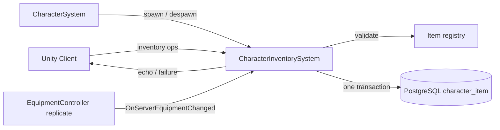

# Character Inventory System

**Short description:** SceneServer authority for item movement across player inventory, equipment, and bank containers, validating incoming client broadcasts, applying runtime container mutations, and persisting every logical operation as a single all-or-nothing database transaction that is gated on the character's session ownership, with a periodic authoritative snapshot as the backstop and an explicit failure broadcast back to the originating client.

## Table of Contents

- [Overview](#overview)
- [Supported Platforms](#supported-platforms)
- [Features](#features)
- [Prerequisites](#prerequisites)
- [Installation / Build](#installation--build)
- [Quick Start Guides](#quick-start-guides)
- [Configuration](#configuration)
- [Usage Examples](#usage-examples)
- [Operational Checks](#operational-checks)
- [Flow Diagram](#flow-diagram)
- [Project Structure](#project-structure)
- [License](#license)

## Overview

The Character Inventory system is the SceneServer authority for item movement across player inventory, equipment, and bank containers. It validates incoming client broadcasts, applies runtime container mutations, persists the resulting state, and echoes successful operations back to the originating client — or tells the client explicitly when the operation did not happen.

> **Note:** `EquipmentController` is part of the prediction pipeline. Equip and unequip are not broadcasts: they ride the owner's replicate input (`CharacterReplicateData.EquipmentRequest`) and are applied inside the replicate tick on both peers. This system installs `EquipmentController.ServerRequestValidator` as the server-side gate and persists the result through `IEquipmentController.OnServerEquipmentChanged`, subscribed per character on `OnSpawnCharacter`. The only equipment broadcast left is `EquipmentUnequipItemBroadcast`, sent server → owner to name the slot the item landed in.

### One table, one row per item

The three slot-keyed tables behind `ICharacterInventoryService`, `ICharacterEquipmentService` and `ICharacterBankService` are gone. There is now one `character_item` table behind one `ICharacterItemService`, keyed by the item's own identity; `container` and `slot` are ordinary mutable columns. That single change is why most of this file looks different from its previous version:

- **A move is an UPDATE, not a delete plus an insert.** Under the per-slot schema, moving an item between two inventory slots, into an equipment socket, or out to the bank vacated a row that had to be deleted separately — often from a different table. Those call sites no longer exist. The only deletes left name items that genuinely ceased to exist.
- **`Item.ID` is a real identity.** Previously an item that moved slots became a different row, two items through one slot shared a row, and three tables' independent sequences handed the same number to three different items.
- **An item written for the first time has no id.** `CharacterItemData.ID == 0` means "never written"; the database mints one and reports it back, and the runtime item's slot stays locked until that identity write-back lands.

`InventoryType` (gameplay) and `ItemContainerType` (persistence) exist as two enums because the database assembly cannot reference the Unity shared assembly. They are numerically identical by contract, pinned by `ItemContainerTypeParityTests`, and every cast goes through `ItemContainerMapping.ToContainerType` / `ToInventoryType` so that contract has one place to be re-checked.

### The memory / database invariant

**The in-memory containers are authoritative. The database is a replica that must converge to them. Memory is never rolled back by the persistence layer.** Handlers mutate the containers synchronously on the main thread and only then capture an `ItemWriteBatch` for the worker. Both alternatives were rejected: mutating memory only after the commit would hold every item operation open across a database round trip while the replicated `SyncObject` slots stayed mutable, and restoring a captured pre-image on failure replays stale state over slots the player may have used since — the repair becomes the bug.

So when a transaction rolls back, the database is left exactly as it was and memory has moved on. That divergence is resolved in memory's favour by `ItemWriteJournal.RequestReconcile`, which schedules an immediate authoritative snapshot. A rolled-back batch is deliberately **not** retried; the reconcile snapshot supersedes it and is always at least as current.

The honest residual: if the process dies between the memory mutation and the commit, the operation is lost and the item is where it was before the player moved it. A lost action, never a lost or duplicated item.

The system is designed to keep item state deterministic by:
- Executing container mutations on the main thread.
- Capturing an immutable DTO batch — never live `Item` references — immediately after mutation.
- Committing everything one logical operation touches in a single transaction, behind an ownership row lock.
- Ordering batches by a main-thread capture sequence, so a stale write cannot undo a newer one.
- Enqueueing persistence through the centralized async worker keyed by `characterID`, which the worker processes FIFO.

A per-connection ingress guard provides debounce, global rate limiting, and in-flight tracking to prevent duplicate or rapid-fire mutation requests. Stale guard entries are swept periodically via `OnUpdate`.

## Supported Platforms

| Platform | Supported | Notes |
|---|---|---|
| Windows | Yes | |
| Linux | Yes | |
| WebGL | N/A | Server-only module |
| Unity 6.3 LTS | Yes | Required engine version |
| IL2CPP | Yes | Supported scripting backend |

## Features

- Server-authoritative inventory, equipment, and bank item management over a single `character_item` table
- Atomic `ItemWriteBatch` persistence: every item row, item delete and attribute row one logical operation touches commits or rolls back together
- Session-ownership gate inside the same transaction (`ICharacterSessionOwnershipService.AssertOwnershipAsync`), quoting the ownership triple held when the mutation happened rather than when the write ran
- Capture-sequence ordering via `ItemWriteJournal`, which refuses a batch superseded by a later-captured write that already committed
- Periodic authoritative item snapshot of every resident character (`ICharacterItemService.SaveSnapshotAsync`) — prune plus ungated upsert of all three containers in one transaction
- Reconcile queue: a batch that never reached the database schedules an immediate repair snapshot with per-character backoff (`MaxReconcileBackoff` 30 s)
- Database-assigned item identities written back on the main thread (`ApplyAssignedIdentities`), with the destination slot locked until they land
- Same-container slot swaps via `SwapContainerItems`, reporting both affected items and any vacated slot
- Cross-container item moves/swaps between inventory, equipment, and bank with rollback of both containers on failure
- Stack split (`InventorySplitItemBroadcast`, `BankSplitItemBroadcast`) and stack merge, the pair that lets a player move any quantity anywhere (issue #198)
- Bulk upsert for identified rows as one statement, so the two halves of a swap never transiently share a `(character, container, slot)` key
- Two-party item exchange (`TryRunExchange`) with row locks taken first, then the memory apply, then the write, then the commit — this is what trade rides
- Explicit client failure notification (`ItemOperationFailedBroadcast`) sent from each handler's `finally`, so a refused request never leaves a stale slot or a stuck pending lock on screen
- Server-side item hooks for ECA actions: `ServerItemHooks.GrantInventoryItem`, `ServerItemHooks.InventoryChanged`
- Consumable persistence via `IAbilityController.OnConsumableItemChanged`, so a potion drunk inside a replicate tick is recorded immediately rather than only by the next snapshot
- Per-operation ingress debounce via configurable `ingressDebounceMilliseconds`
- Global per-connection rate limit (`GlobalPerConnectionRateMilliseconds` = 15 ms) across all inventory operations
- Bounded ingress guard sweep with configurable interval, TTL, and max removals per pass
- Slot bounds validation and `CharacterStateValidation.CanAct` before any container mutation
- Banker scene object validation: existence check, scene match, interaction range, and banker type confirmation
- Backpressure handling: when `AsyncWorkerData` refuses admission (its outstanding-work cap), `EnqueuePersistence` still runs the work on the thread pool as a fallback and the client is told `ServerBusy` ("outcome unknown"), not that the operation failed
- `CreateAssetMenu` integration for ScriptableObject creation in the Unity Editor

## Prerequisites

- **Unity 6.3 LTS**
- **FishNetworking** — networking framework
- **FishMMO Server Core** — provides `ServerBehaviour`, `ICharacterInventorySystem`, `ICharacterInventorySystemRuntimeData`, `ICharacterInventorySystemMainThreadQueueData`, `ItemExchangeLeg`, `IngressGuard`, `AsyncWorkerData`, `ICharacterSystem`, `ICharacterMappingData`, and `CharacterSessionInfo`
- **FishMMO Shared** — provides `IPlayerCharacter`, `IInventoryController`, `IEquipmentController`, `IBankController`, `IAbilityController`, `IItemContainer`, `Item`, `ItemStackTransfer`, `ServerItemHooks`, `RemovedItemRecord`, `ItemSlot`, `InventoryType`, `CharacterStateValidation`, `ISceneObject`, `IInteractable`, `Banker`, and the broadcast types (`InventoryRemoveItemBroadcast`, `InventorySwapItemSlotsBroadcast`, `InventorySplitItemBroadcast`, `BankRemoveItemBroadcast`, `BankSwapItemSlotsBroadcast`, `BankSplitItemBroadcast`, `EquipmentUnequipItemBroadcast`, `ItemOperationFailedBroadcast`)
- **FishMMO Database** — provides `ICharacterItemService`, `ICharacterAttributeService`, `ICharacterSessionOwnershipService`, `IUnitOfWorkService`, `ItemContainerType`, `CharacterItemIdAssignment`, `CharacterSessionLeaseData`, `BulkWriteResult`, and DTO types (`CharacterItemData`, `CharacterAttributeData`)

## Installation / Build

This is an integrated module within FishMMO. It is included as part of the server-side scene-server implementation and does not require separate installation. Ensure the FishMMO Server Core and its dependencies are properly configured in your Unity project.

## Quick Start Guides

1. Create the `CharacterInventorySystem` ScriptableObject asset via **Assets → Create → FishMMO → Server → SceneServer → Character Inventory System**.
2. Ensure the asset is assigned to the scene server's system list so `InitializeOnce()` is invoked at startup.
3. Verify that the following data containers are registered in `DataContainerRegistry`:
   - `CharacterInventorySystemRuntimeData` → `ICharacterInventorySystemRuntimeData`
   - `CharacterInventorySystemMainThreadQueueData` → `ICharacterInventorySystemMainThreadQueueData`
   - `AsyncWorkerData` (shared async work queue)
4. Verify the following database services are registered in `Server.Database.ServiceRegistry`:
   - `ICharacterItemService`
   - `ICharacterAttributeService`
   - `ICharacterSessionOwnershipService` and `IUnitOfWorkService` (resolved per batch on the worker)
5. On initialize, `CharacterInventorySystem` validates its dependencies, registers the inventory and bank broadcast handlers, subscribes `ICharacterSystem.OnSpawnCharacter` / `OnDespawnCharacter`, and installs `EquipmentController.ServerRequestValidator` and the `ServerItemHooks` delegates.
6. On deinitialize, it unregisters the broadcast handlers, unsubscribes the character hooks, clears the delegates it installed (only if they are still its own), clears the ingress guard, and clears the `ItemWriteJournal` — a stale watermark carried into a re-initialize would silently suppress the new run's first writes.
7. Clients send the appropriate broadcast (e.g., `InventorySwapItemSlotsBroadcast`) and receive the same broadcast back on success, or an `ItemOperationFailedBroadcast` naming the operation, a coarse reason and the slots to resync.

## Configuration

### Inspector Parameters

| Parameter | Type | Default | Description |
|---|---|---|---|
| `ingressDebounceMilliseconds` | int | 60 | Minimum milliseconds between identical inventory requests from the same connection |
| `ingressSweepIntervalSeconds` | float | 5.0 | Seconds between bounded ingress guard cleanup sweeps |
| `ingressEntryTtlSeconds` | float | 30.0 | Seconds before stale ingress guard entries are removed |
| `ingressSweepMaxRemovals` | int | 128 | Maximum stale ingress guard entries removed per sweep |
| `itemSnapshotIntervalSeconds` | float | 60.0 | Seconds between full inventory/bank/equipment snapshots of every resident character |

### Internal Constants

| Constant | Value | Description |
|---|---|---|
| `GlobalPerConnectionRateMilliseconds` | 15 | Global per-connection rate limit in milliseconds across all inventory operations |
| `maxIdentityWriteBacksPerFrame` | 64 | Ceiling on queued identity write-backs drained per frame. One action per batch that created items, so this is back-pressure rather than a rate that is reached |
| `DepartedWatermarkRetention` | 10 min | How long a departed character's journal watermarks are kept before the snapshot sweep prunes them |
| `ItemWriteJournal.MaxReconcileBackoff` | 30 s | Longest wait between repair snapshots for one character |

### Clamped Minimums

On initialization, inspector values are clamped to safe minimums:

| Parameter | Minimum |
|---|---|
| `ingressDebounceMilliseconds` | 0 |
| `ingressSweepIntervalSeconds` | 0.25 |
| `ingressEntryTtlSeconds` | 1.0 |
| `ingressSweepMaxRemovals` | 1 |
| `itemSnapshotIntervalSeconds` | 5.0 |

### Ingress Operation Codes

The server-side `IngressOperation` codes are an implementation detail; `ItemOperationType`, the enum on the wire, mirrors them so the client can name the operation that failed.

| Code | Value | Operation |
|---|---|---|
| `InventoryRemove` | 1 | Remove item from inventory |
| `InventorySwap` | 2 | Swap inventory slots (or cross-container with bank) |
| `EquipmentEquip` | 3 | Equip item from inventory or bank |
| `EquipmentUnequip` | 4 | Unequip item to inventory or bank |
| `BankRemove` | 5 | Remove item from bank |
| `BankSwap` | 6 | Swap bank slots (or cross-container with inventory) |
| `InventorySplit` | 7 | Split part of a stack into an inventory slot |
| `BankSplit` | 8 | Split part of a stack into a bank slot |

### Client Failure Reasons

`ItemOperationFailureReason`, carried by `ItemOperationFailedBroadcast`:

| Reason | Value | Meaning |
|---|---|---|
| `Unknown` | 0 | Unclassified |
| `Rejected` | 1 | Validation refused the request; nothing changed |
| `Throttled` | 2 | Ingress debounce or in-flight guard refused it |
| `ServerBusy` | 3 | The async worker refused admission; the work runs on the thread-pool fallback, so the **outcome is unknown** rather than failed |

The message carries no item identity — only the operation, the reason, and the slot indices the client itself sent. It is an instruction to resync those slots, never a source of truth about them.

### Threading Model

| Thread | Work |
|---|---|
| Main thread | Request validation, ingress guard checks, container mutations, batch capture (`BeginItemBatch`, `CaptureSnapshotBatch`, `CaptureExchangeOnMainThread`), sequence allocation, broadcast dispatch, identity write-back, slot lock/unlock, ingress guard sweep, snapshot sweep, reconcile drain |
| Async worker | `ApplyItemBatchAsync` and `RunExchangeAsync` — unit of work, ownership assertion, `ICharacterItemService.SaveSnapshotAsync` / `PersistAsync` / `PersistManyAsync` / `DeleteItemAsync`, and `ICharacterAttributeService` upserts |

## Usage Examples

### Broadcast Handlers

`CharacterInventorySystem` registers the following server-side broadcast handlers on initialize:

| Broadcast | Handler | Purpose |
|---|---|---|
| `InventoryRemoveItemBroadcast` | `OnServerInventoryRemoveItemBroadcastReceived` | Remove an item from inventory |
| `InventorySwapItemSlotsBroadcast` | `OnServerInventorySwapItemSlotsBroadcastReceived` | Swap inventory slots, merge stacks, or move bank → inventory |
| `InventorySplitItemBroadcast` | `OnServerInventorySplitItemBroadcastReceived` | Split part of a stack into an inventory slot |
| `BankRemoveItemBroadcast` | `OnServerBankRemoveItemBroadcastReceived` | Remove an item from bank |
| `BankSwapItemSlotsBroadcast` | `OnServerBankSwapItemSlotsBroadcastReceived` | Swap bank slots, merge stacks, or move inventory → bank |
| `BankSplitItemBroadcast` | `OnServerBankSplitItemBroadcastReceived` | Split part of a stack into a bank slot |

There are **no equipment broadcast handlers**. Outbound, the system sends `EquipmentUnequipItemBroadcast` (server → owner) and `ItemOperationFailedBroadcast`.

### Server-Side Surface

`ICharacterInventorySystem` is what the rest of the server uses to touch items:

| Member | Purpose |
|---|---|
| `TryGrantItem(character, item, container)` | Places a granted item, locks its slot until the database mints an identity, and broadcasts it to the owner with id 0 so the client shows it as pending |
| `TryPersistGrantedItems(character, modifiedItems, container, operation)` | Persists a set of items an external system placed |
| `PersistInventoryChanges(character, changed, removed)` | One batch of row updates plus real deletes; the target of `ServerItemHooks.InventoryChanged` |
| `CaptureDespawnFlush(character, lease)` | Captures the logout snapshot **while the character is still resident** and returns the work as a `Func<Task>`. `CharacterSystem` awaits it before releasing the session, so it is ordered against the hand-off rather than racing it on another lane |
| `TryRunExchange(first, second, applyOnMainThread, onFinished, operation)` | Two-party exchange; trade rides this |
| `NotifyInventorySlots(character, set, emptied)` | Tells the owner what a set of slots now holds |
| `SwapContainerItems(...)` | Same-container and cross-container swap primitives |

### Inventory Remove Path

`OnServerInventoryRemoveItemBroadcastReceived(conn, msg, channel)`:

1. Validates connection and spawned player object.
2. Acquires ingress guard for `InventoryRemove`; a refusal sends `Throttled` — the client holds a pending lock on the slot and with no reply would hold it forever.
3. Validates the character, `CharacterStateValidation.CanAct`, and `IInventoryController`.
4. Validates slot bounds via `IsValidSlot(msg.Slot)`.
5. Calls `RemoveItem(msg.Slot)`.
6. Increments `item.Version` and captures a batch holding one `ItemDelete` addressed by item id — a real destruction, not a vacated hole.
7. Broadcasts the original message back on success; otherwise `ServerBusy`.
8. In `finally`: releases the guard and, if success was never set, sends `ItemOperationFailedBroadcast`. Success is set at exactly one line, so every validation return — including ones a later edit adds — falls through to the notification.

### Inventory Swap Path

`OnServerInventorySwapItemSlotsBroadcastReceived(conn, msg, channel)`:

1. Validates connection, spawned player, character, and `IInventoryController`.
2. Acquires ingress guard for `InventorySwap`.
3. Attempts `TryMergeStacks` first: a drop onto a matching, non-full stack is a merge, not a swap.
4. Otherwise switches on `msg.FromInventory`:
   - **Inventory → Inventory:** validates both slot bounds, calls `SwapContainerItems(inventoryController, from, to, …)`, writes both rows in one batch.
   - **Bank → Inventory:** validates the banker scene object, validates slot bounds, calls the cross-container `SwapContainerItems`, and writes every affected row of both containers in one batch. No vacated-slot deletes: a move updates the item's own row.
   - **Equipment → Inventory:** not handled (no-op).
5. Broadcasts success back to the client, or reports the failure from `finally`.

A swap is refused outright when either slot is locked (`IsSlotLocked`) — an item awaiting its database identity must not move.

### Stack Split and Merge (issue #198)

Split is a new operation rather than a variation on swap: every other item message moves or exchanges whole slots and none changes an amount. The rules — at least one, less than the stack holds, onto an empty slot or a matching stack with room, both slots unlocked — live in `ItemStackTransfer.TrySplit`, which refuses before writing anything, so a refused split leaves the original stack untouched. Both halves travel in one batch, so the database either shows the split or shows the stack as it was. The split half has no identity until its row lands: its slot is locked, the set-slot message goes out with id 0, and `ApplyAssignedIdentities` unlocks and re-sends it.

Merge is the inverse, handled inside the swap handlers by `TryMergeStacks` (`ItemStackTransfer.CanMergeInto` / `TryMerge`). It is **not** echoed as a swap — the client applies an echoed swap by exchanging two slots, which is the wrong thing for a merge — so the outcome goes out as a set-slot for the receiving stack plus either a set-slot or a remove for the donor. Those go out whether or not the batch queued normally: the containers have already changed and the client must be told what they now hold.

The banker must be in range whenever either end of a split is a bank slot.

### Equipment (predicted)

Equip and unequip have no broadcast handlers. The owner queues a request on its `EquipmentController` (`RequestEquip` / `RequestUnequip`), the request rides the next `CharacterReplicateData`, and `EquipmentController.OnReplicate` applies it on the owner and the server on the same tick. On the server the controller first asks `EquipmentController.ServerRequestValidator` — installed by this system as `ValidateEquipmentRequest`: `CharacterStateValidation.CanAct` plus banker range when the container is the bank — and a refusal leaves the socket unchanged, with the owner corrected by the next reconcile.

`Equipment_OnServerEquipmentChanged` then writes **one** batch: the socket row, the container row on the other side of the move, and the attribute rows the change altered. Half of that landing — the item equipped with none of its stats, or the stats without the item — is a state nothing else in the server knows how to repair. An unequip needs no equipment delete: the item that left the socket is written with its new container, which moves its row.

For an unequip the owner is also sent `EquipmentUnequipItemBroadcast` naming the item, the socket, and the container and slot it landed in. The owner chose a slot too, from its own copy of the container, and the two can differ by a grant that landed on one side first; the owner then moves the item by identity.

### Item Exchange (`TryRunExchange`)

The two-party path trade rides. `RunExchangeAsync` runs on a worker with two hops to the main thread, and the ordering is the whole design: take the row locks, **then** apply to memory on the main thread, **then** write, **then** commit. The lane key is the lower of the two character ids, so two exchanges between the same pair queue behind each other; ordering against every other write for either character is the row locks' job, not the lane's.

`PostMainThreadAsync` waits out a full main-thread queue rather than dropping the action — an exchange that cannot reach the main thread cannot finish, and a finish that never arrives leaves a trade window open with its slots locked. Every exit path finishes on the main thread exactly once, and `FinishExchangeOnMainThread` releases the slot locks the run took.

### Periodic Item Snapshot

`SnapshotAllResidentCharacterItems` runs every `itemSnapshotIntervalSeconds` and writes a full snapshot for every resident character, plus any lingering combat-logout bodies (`CollectLingeringCharacters`).

Before it existed, the incremental writes were the *only* record of a character's items — neither the periodic character save nor the logout save touched inventory, bank or equipment — so an incremental write that was silently rejected was permanent loss at the next login rather than a glitch. The snapshot downgrades every such failure to something that survives at most one interval.

It cannot duplicate anything: `SaveSnapshotAsync` deletes every row for the character in the containers it names and re-inserts them in one transaction, so it writes exactly the set of items the server believes in, and running it twice is idempotent. Deleting first is also what makes it immune to the `(character_id, container, slot)` unique index — two items swapping slots have no intermediate state in which both hold the same one.

Three details are load-bearing:

- **It names the containers it read.** A character missing one of its three controllers leaves that container's rows alone rather than having them pruned on the strength of a list nobody built. Listing a container with none of its items is the legitimate way to say "this container is empty", which is why an empty snapshot still has to run.
- **Its upsert is not version-gated.** Version gating is the mechanism that makes an incremental write disappear, and this is the backstop for exactly that. Ordering is preserved instead by the capture sequence (`TryClaimSequence` refuses a snapshot once any later-captured write has committed) and by the per-character FIFO worker lane.
- **One instance in two slots is reported, not written.** A duplicated in-memory instance would fail the primary key on every attempt; the snapshot keeps the first row, drops the rest, and logs at Error naming it an upstream duplication bug.

### Banker Validation

`ValidateBankerSceneObject(sceneObjectID, character)` performs four checks:

1. Scene object exists in `SceneObject.Objects`.
2. Banker is in the same scene as the character (`scene.handle` match).
3. Character is within interaction range (`IInteractable.InRange`).
4. Interactable is a `Banker` instance.

### Failure Semantics

- Validation failures: no state change, and an `ItemOperationFailedBroadcast` with `Rejected` from the handler's `finally`.
- Ingress refusal: `Throttled`.
- Enqueue refusal: the work still runs on the thread-pool fallback, so the client is told `ServerBusy` — outcome unknown, not failed.
- Mutation success: the client receives the original success broadcast payload (or, for a merge, set-slot/remove messages).
- Database rollback: memory is **not** rolled back; `RequestReconcile` schedules a repair snapshot with backoff, and the rolled-back batch is never retried.
- Ownership refusal (`AssertOwnershipAsync` fails): deliberately **not** reconciled. Another server is authoritative for that character; rewriting this server's copy over its state is the duplication the guard exists to prevent.
- Superseded batches are skipped with a debug log naming the operation, character and sequence.
- Cross-container swap exceptions: both containers are rolled back in memory before anything is captured.

## Operational Checks

| Check | How to Verify |
|---|---|
| Initialization success | Confirm `CharacterInventorySystem` logs "Initialized" without errors on server startup |
| Data containers available | Verify `ICharacterInventorySystemRuntimeData`, `ICharacterInventorySystemMainThreadQueueData` and `AsyncWorkerData` resolve from `DataContainerRegistry` |
| Database services available | Verify `ICharacterItemService` and `ICharacterAttributeService` resolve from `Server.Database.ServiceRegistry` |
| Inventory remove | Remove an inventory item; confirm the client receives `InventoryRemoveItemBroadcast` back and the item's row is deleted by id |
| Inventory swap (same container) | Swap two inventory slots; confirm the client receives `InventorySwapItemSlotsBroadcast` back and both rows are updated in one statement |
| Bank → inventory swap | Swap a bank item to inventory while near a banker; confirm both containers updated and the item's row shows the new container and slot |
| Inventory → bank swap | Swap an inventory item to bank while near a banker; confirm the same |
| Stack merge | Drop a stack onto a matching, non-full stack; confirm set-slot messages (not a swap echo) and that the donor is removed when emptied |
| Stack split | Split part of a stack; confirm both halves persist in one batch and the new half's slot unlocks when its identity write-back arrives |
| Equip from inventory | Equip an item; confirm the socket row, the vacated container row and the attribute rows all land in one transaction |
| Equip from bank | Equip from bank while near a banker; confirm the same, and that the request is refused when the banker is out of range |
| Unequip | Unequip an item; confirm `EquipmentUnequipItemBroadcast` names the slot it landed in and the item's row moves container |
| Consumable use | Use a consumable; confirm a reduced stack is a row update and a destroyed one is a delete by item id |
| Bank remove | Remove a bank item while near a banker; confirm the client receives `BankRemoveItemBroadcast` back |
| Banker validation failure | Attempt a bank operation without a valid banker in range; confirm `ItemOperationFailedBroadcast` with `Rejected` |
| Slot bounds validation | Send a broadcast with an out-of-bounds slot index; confirm `Rejected` |
| Locked slot | Attempt to swap a slot whose item is awaiting its database identity; confirm the request is refused |
| CanAct rejection | Attempt any inventory operation while the character cannot act; confirm `Rejected` |
| Ingress debounce | Send rapid consecutive requests for the same operation; confirm excess requests return `Throttled` |
| Global rate limit | Send different operations faster than 15 ms apart from the same connection; confirm `Throttled` |
| Ingress guard sweep | Wait for the sweep interval; confirm stale guard entries are removed without errors |
| Periodic snapshot | Wait `itemSnapshotIntervalSeconds`; confirm every resident character's three containers are written in one transaction and orphan rows are pruned |
| Snapshot prune | Empty a character's bank, wait for a snapshot; confirm the bank rows are removed rather than lingering |
| Reconcile after rollback | Force a batch to fail at the database; confirm memory is unchanged and a repair snapshot follows with backoff |
| Ownership refusal | Let another server claim the character mid-write; confirm the batch is refused, logged, and **not** reconciled |
| Identity write-back | Grant an item; confirm the client first sees id 0 with the slot locked, then the slot unlocks and re-sends with the assigned id |
| Logout flush ordering | Disconnect a character; confirm `CaptureDespawnFlush` runs before the session release, not on a separate lane |
| Exchange | Run a trade; confirm row locks precede the memory apply and the finish runs on the main thread exactly once |
| Persistence backpressure | Saturate the async work queue; confirm the client receives `ServerBusy` and the work still completes on the fallback |
| Deinitialize cleanup | Trigger deinitialize; confirm handlers are unregistered, the installed delegates cleared, the ingress guard cleared and the write journal cleared |

## Flow Diagram

### High-Level Overview



### Batch Lifecycle

```
Main thread                                  Async worker
────────────                                 ────────────
mutate containers
BeginItemBatch(characterID, operation)
  ├─ ResolveSessionLease → ownership triple
  ├─ ItemWriteJournal.NextSequence
  └─ add item writes / deletes / attributes
EnqueueItemBatch → EnqueuePersistence(characterID)
                                             ApplyItemBatchAsync(batch)
                                             ├─ ShouldApply (cheap pre-test)
                                             ├─ IUnitOfWorkService.BeginAsync
                                             ├─ AssertOwnershipAsync (row lock)
                                             │    └─ refused → rollback, NO reconcile
                                             ├─ TryClaimSequence (under the lock)
                                             ├─ ApplyBatchStepsAsync
                                             │    ├─ snapshot → SaveSnapshotAsync
                                             │    └─ incremental → DeleteItemAsync,
                                             │         bulk upsert (identified),
                                             │         PersistAsync (unidentified → new ids)
                                             ├─ attribute upserts
                                             ├─ CommitAsync
                                             │    └─ failure → RequestReconcile
                                             └─ TryEnqueueMainThread
main thread: ApplyAssignedIdentities
  └─ write ids onto live Items, unlock slots, re-broadcast
```

### Inventory Remove

```
OnServerInventoryRemoveItemBroadcastReceived(conn, msg, channel)
│
├─ 1. Validate connection + spawned object
├─ 2. Acquire ingress guard (InventoryRemove) → refused: Throttled
├─ 3. Validate character + CanAct + IInventoryController
├─ 4. Validate slot bounds
├─ 5. RemoveItem(msg.Slot)
├─ 6. Version++ → BeginItemBatch → AddItemDelete(item.ID, version)
├─ 7. EnqueueItemBatch → echo msg, or SendServerBusy
└─ finally: EndIngressGuard + ItemOperationFailedBroadcast if not succeeded
```

### Inventory Swap (merge, same-container, cross-container)

```
OnServerInventorySwapItemSlotsBroadcastReceived(conn, msg, channel)
│
├─ 1. Validate connection + spawned object
├─ 2. Acquire ingress guard (InventorySwap)
├─ 3. Validate character + CanAct + IInventoryController
├─ 4. TryMergeStacks → handled: set-slot / remove messages, done
│
├─ FromInventory = Inventory:
│  ├─ Validate both slot bounds + slots unlocked
│  ├─ SwapContainerItems(inventory, from, to)
│  ├─ One batch: both rows
│  └─ Echo msg
│
├─ FromInventory = Bank:
│  ├─ Resolve IBankController + ValidateBankerSceneObject
│  ├─ Validate slot bounds
│  ├─ SwapContainerItems(bank → inventory)
│  ├─ One batch: every affected row of both containers (no vacated-slot deletes)
│  └─ Echo msg
│
├─ FromInventory = Equipment: no-op
└─ finally: EndIngressGuard + ItemOperationFailedBroadcast if not succeeded
```

### Stack Split

```
OnServerInventorySplitItemBroadcastReceived / OnServerBankSplitItemBroadcastReceived
└─ HandleSplitRequest(conn, ingress, operation, fromInventory, from, toInventory, to, amount)
   │
   ├─ 1. Validate connection + spawned object + ingress guard
   ├─ 2. Banker in range if either end is a bank slot
   ├─ 3. ItemStackTransfer.TrySplit (refuses before writing anything)
   ├─ 4. LockSlot(to) — the new half has no identity yet
   ├─ 5. One batch: both halves
   ├─ 6. Set-slot messages (new half with ID 0, shown pending)
   └─ finally: EndIngressGuard + ItemOperationFailedBroadcast if not succeeded
```

### Equipment (no handler)

```
owner: EquipmentController.RequestEquip / RequestUnequip
   └─ rides CharacterReplicateData.EquipmentRequest
        └─ EquipmentController.OnReplicate (owner + server, same tick)
             ├─ server: ServerRequestValidator → ValidateEquipmentRequest
             │            (CanAct + banker range for InventoryType.Bank)
             └─ server: OnServerEquipmentChanged
                  └─ Equipment_OnServerEquipmentChanged
                       ├─ ONE batch: socket row + other-side row + attribute rows
                       └─ unequip: EquipmentUnequipItemBroadcast (server → owner)
```

### Item Exchange

```
TryRunExchange(first, second, applyOnMainThread, onFinished, operation)
└─ EnqueuePersistence(lane = min(firstID, secondID)) → RunExchangeAsync
   │
   ├─ Resolve IUnitOfWorkService + ICharacterSessionOwnershipService
   ├─ Take row locks for both characters
   ├─ PostMainThreadAsync → CaptureExchangeOnMainThread
   │    ├─ Apply() mutates both characters' containers
   │    └─ CaptureExchangeLeg per side → ItemWriteBatch[] + slot locks + ledger
   ├─ Write both legs inside the transaction
   ├─ CommitAsync
   └─ PostMainThreadAsync → FinishExchangeOnMainThread(committed, applied)
        └─ release exchange slot locks, invoke OnFinished exactly once
```

### Periodic Snapshot + Sweeps (OnUpdate)

```
OnUpdate(deltaTime)
│
├─ IngressGuard.Sweep(ingressSweepIntervalSeconds, ingressEntryTtlSeconds, ingressSweepMaxRemovals)
├─ itemSnapshotTimer elapsed:
│    ├─ SnapshotAllResidentCharacterItems
│    │    └─ per character: CaptureSnapshotBatch (all three containers, one sequence,
│    │         one transaction, containers it read named explicitly)
│    └─ itemWriteJournal.PruneDeparted(DepartedWatermarkRetention)
├─ DrainReconcileRequests → repair snapshots for characters whose write rolled back
└─ DrainMainThreadQueue<ICharacterInventorySystemMainThreadQueueData>(maxIdentityWriteBacksPerFrame)
```

### Cross-Container Swap (internal)

```
SwapContainerItems(from, to, fromIndex, toIndex)
│
├─ Same container? → SwapItemSlots(fromIndex, toIndex)
├─ Either slot locked? → refuse
│
├─ Get source item from 'from' container
│  ├─ Destination occupied:
│  │  ├─ Move destination item back → from.SetItemSlot(toItem, fromIndex)
│  │  └─ Track as affectedFromItem
│  └─ Destination empty:
│     ├─ Clear source → from.SetItemSlot(null, fromIndex)
│     └─ Track as vacated slot (no database delete — the item's row simply moves)
│
├─ Place source item in destination → to.SetItemSlot(fromItem, toIndex)
│  └─ Track as affectedToItem
│
└─ On exception → rollback both containers to original state
```

## Project Structure

### Directory Structure

```
CharacterInventory/
├── CharacterInventorySystem.cs                    # SceneServer implementation: broadcast handlers, validation,
│                                                  #   container mutations, ItemWriteBatch/ItemWriteJournal,
│                                                  #   exchange, snapshot, identity write-back
├── CharacterInventorySystemRuntimeData.cs         # Runtime data container for ingress guard state
├── CharacterInventorySystemMainThreadQueueData.cs # Per-system main-thread queue (identity write-backs,
│                                                  #   exchange hops)
├── ItemContainerMapping.cs                        # InventoryType ↔ ItemContainerType casts, in one place
└── README.md
```

### Related Core Contracts

- `Server/Core/World/SceneServer/CharacterInventory/ICharacterInventorySystem.cs`
- `Server/Core/World/SceneServer/CharacterInventory/ICharacterInventorySystemRuntimeData.cs`
- `Server/Core/World/SceneServer/CharacterInventory/ICharacterInventorySystemMainThreadQueueData.cs`
- `Server/Core/World/SceneServer/CharacterInventory/ItemExchangeLeg.cs`

### Inheritance Hierarchy

```
ServerBehaviour
└── CharacterInventorySystem : ICharacterInventorySystem

RuntimeDataContainer
└── CharacterInventorySystemRuntimeData : ICharacterInventorySystemRuntimeData

SystemMainThreadQueueData
└── CharacterInventorySystemMainThreadQueueData : ICharacterInventorySystemMainThreadQueueData
```

### DTO Types Used

```
CharacterItemData          ← one row per item, in any container (character_item)
CharacterAttributeData     ← character attribute persistence
CharacterSessionLeaseData  ← the ownership triple a batch is written under
CharacterItemIdAssignment  ← identity the database minted for a row written without one
```

### Database Services

```
ICharacterItemService              ← PersistAsync / PersistManyAsync / DeleteItemAsync / SaveSnapshotAsync
ICharacterAttributeService         ← attribute upserts that ride the same transaction
ICharacterSessionOwnershipService  ← AssertOwnershipAsync, inside the transaction, on a row lock
IUnitOfWorkService                 ← the transaction each batch and exchange commits in
```

## License

This project is subject to the FishMMO project license.
