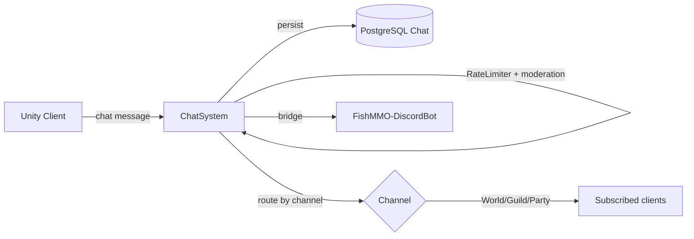

# Chat System

**Short description:** SceneServer authority for player messaging across World, Region, Say, Party, Guild, Team, Tell, Trade, System, and Discord channels, with token-bucket anti-spam, lock-free incoming queue, batch DB persistence, and outbound broadcast batching for 50,000-user scalability.

## Table of Contents

- [Overview](#overview)
- [Supported Platforms](#supported-platforms)
- [Features](#features)
- [Prerequisites](#prerequisites)
- [Installation / Build](#installation--build)
- [Quick Start Guides](#quick-start-guides)
- [Configuration](#configuration)
- [Usage Examples](#usage-examples)
- [Operational Checks](#operational-checks)
- [Flow Diagram](#flow-diagram)
- [Project Structure](#project-structure)
- [License](#license)

## Overview

The Chat system is the SceneServer authority for player messaging across World, Region, Say, Party, Guild, Team, Tell, Trade, System, and Discord channels. It validates inbound client chat, enforces rate/spam limits, routes channel-specific broadcasts, and persists eligible messages through asynchronous database operations. Every persisted message carries the exact UTC timestamp captured at the network receive boundary for legal audit and subpoena compliance.

The implementation uses a split execution model:
- **Main thread:** network callback enqueue, lock-free queue drain, validation, command parsing, channel routing, broadcast dispatch, outbound buffer flush, and main-thread queue drain.
- **Async worker:** database work — remote Tell target resolution (to answer relayed/offline), message pump reads, and batch persistence via `TryEnqueueAsyncWork`. Party, Guild and local Tell delivery need no database: local recipients come from the server's own maps.
- **Main-thread queue:** marshaling async completion actions (broadcast dispatch, cursor updates) back to Unity/FishNet-safe context via `IChatSystemMainThreadQueueData`.

Four architectural features keep the chat pipeline responsive under extreme load:

1. **Lock-Free Incoming Chat Queue** — Network callbacks enqueue stamped messages into a `ConcurrentQueue`; the main-thread `OnUpdate` drains up to `maxIncomingChatsPerFrame` entries per frame. Each sender's token bucket and minimum gap are charged in the network callback, BEFORE the message is queued (`ChatRateGate`), so no one sender can occupy more of the queue than its rate allows. A hard cap (`maxIncomingQueueSize`, default 10,000) bounds memory; a message arriving at the cap is dropped and the drops are logged at most every ten seconds. It used to kick whichever connection arrived next — after a main-thread hitch with many busy players, an honest one (hot-path audit L2).

   A dequeued message whose connection has no spawned character (`FirstObject == null`) is **dropped, not kicked**. The queue is drained a frame or more after the message arrives, and a character despawns while its connection stays up on every scene transfer, bind-point respawn and channel switch — so a line typed just before one of those dequeues with no character attached. Kicking for it disconnected a player mid-transfer, with no notice, for typing. Anything genuinely trying to talk without a character is refused just as effectively by discarding what it sends.
2. **Token Bucket Anti-Spam** — Each player carries a refillable token bucket (`ChatTokens` (double), `ChatTokenLastRefillTicks`), charged at enqueue by the pure `ChatRateGate.TryCharge`. Messages consume one token; when the bucket is empty the message is dropped. Float-precision tokens ensure fractional refill at sub-1-token/s rates accumulates correctly.

   **Flood mute.** Every refusal is counted (`ChatFloodMute`, `ChatSystem.FloodMute.cs`): `floodMuteRefusalThreshold` refusals (10) within `floodMuteWindowSeconds` (10 s) mute the sender for `floodMuteDurationSeconds` (180 s) and tell them why with one system line. Flooding on while muted pushes the end out, so the mute ends a full term after the flooding stops. Like a stored mute it silences chat and not commands, so `/helpme` and `/report` still work, and each line that still gets through the gate is answered with the time left. It is **held in memory** by the chat system, keyed by character ID, on the monotonic clock: it is the rate limit escalating, not a moderation decision, so it writes nothing to the database, leaves the stored-mute fields (`ChatMutedUntilTicks`, which the moderation commands re-read and overwrite) alone, and is not shown in the staff console. It survives a relog on the same scene server and is lost on a move to another one; entries are swept every 30 s once spent.
3. **Batch DB Persistence** — All persist-eligible channels enqueue into a `ConcurrentQueue<PendingChatPersist>`. A periodic callback drains up to `maxPersistBatchSize` (default 2,000) entries and writes the batch via `PersistBatchAsync`, reducing DB round-trips from O(N) to ~O(N/batchSize). One flush runs at a time (`persistFlushInFlight`). A batch refused by a transient failure goes back on the queue and is retried until `persistRetryWindowSeconds` (300 s) after its receipt; one refused for its content is bisected (at most `maxPersistIsolationDepth` = 6 halvings) so only the rows the database will not take are lost.
4. **Outbound Broadcast Batching** — World and Trade channel messages are buffered per-world in `OutboundWorldBroadcastBuffer`. A periodic callback flushes up to `maxOutboundBatchSize` messages per recipient per flush. A hard cap (`maxBufferedWorldMessages`, default 200) per world ID drops oldest messages if the buffer exceeds the limit.

## Supported Platforms

| Platform | Supported | Notes |
|---|---|---|
| Windows | Yes | |
| Linux | Yes | |
| WebGL | N/A | Server-only module |
| Unity 6.3 LTS | Yes | Required engine version |
| IL2CPP | Yes | Supported scripting backend |

## Features

- Ten chat channels: World, Region, Say, Party, Guild, Team, Tell, Trade, System, Discord
- Lock-free incoming chat queue (`ConcurrentQueue`) decoupling network callbacks from main-thread processing with configurable per-frame drain budget
- Memory bound via hard cap on incoming queue size; messages beyond it are dropped and counted, nobody is kicked. Rate is charged per sender at enqueue. Messages from a connection with no resident character are dropped rather than kicked — that state is a routine scene-transfer race, not an exploit
- Token bucket anti-spam with configurable burst capacity (`chatTokenBucketCapacity`) and refill rate (`chatTokenRefillRate`)
- Legacy per-message cooldown (`messageRateLimit`) as a secondary rate-limit gate
- Flood mute: too many lines refused by the rate gate within a short window mute the sender for a few minutes, in memory, with a system line saying why (see Token Bucket Anti-Spam above)
- Repeat-message suppression (configurable via `allowRepeatMessages`), applied to chat only — a repeated **slash command** is never suppressed, because repeating one is the normal response to a command that was refused for a reason that has since cleared
- Rich text tag sanitization (skipped when message contains no `<` for zero-allocation fast path)
- Command extraction and routing via `ChatHelper` command registry, keyed **including** the leading slash and matched case-insensitively
- **Per-command access levels** — commands are registered with a minimum `AccessLevel`, enforced in `ChatHelper.TryParseCommand` against the character's own level as loaded from its database row. A command the sender may not run is *consumed*, not rejected: it is neither executed nor echoed to a channel, and the response is indistinguishable from an unknown command, so command names cannot be probed. Every refusal is reported through `ChatHelper.OnCommandRefused` and logged with the character and account that tried it
- **Every elevated command is audited.** `ChatHelper.TryParseCommand` raises `OnElevatedCommand` for any command registered above `Player`, and `ChatSystem.Audit.cs` writes a row to `admin_audit_log` — the same table the Control Panel writes to, so "show me everything this person did" is one query rather than two. Refusals are recorded as well as successes: a player probing for admin command names produces a run of refusals against one account, which is the pattern the log exists to make visible. The actor is the **account**, not the character, so one operator's history is not split across every character they own. Recording happens at the gate rather than inside each handler, so a command added later is audited because it was registered with an elevated level and not because its author remembered
- **`/help [command]`** (`ChatSystem.Help.cs`) — lists every command the caller may run, or describes one. Registered at `AccessLevel.Player`, so it is not audited. The listing is built by `ChatCommandHelpListing` from the caller's server-loaded `AccessLevel` with the access gate's own test: a player never sees `/gm`, `/admin` or any other elevated command, and a game master never sees `/admin`. `/gm` and `/admin` are listed as one entry each pointing at their own `help`; no sub-command is named. `/help <command>` answers a command above the caller exactly as it answers one that does not exist. Help text is attached with `ChatHelper.SetCommandHelp` beside each `AddCommands` (channel commands: `ChatHelper.ChannelCommandHelp`), and `ChatHelpCommandTests` fails when a registered word is not described.
- **Player support commands** — `/report`, `/bug`, `/helpme` and `/tickets`, all registered at `AccessLevel.Player` and filed against `ISupportTicketService`. The subject is derived from the first 60 characters (or built as `Report: <name>`) so a player never has to type two fields into a chat line; the body is what they typed. Flood control (5 unfinished tickets per account, 60-second cooldown) belongs to the service, and its refusal message is surfaced to the player verbatim rather than paraphrased. **No audit row is written**: these are Player-level commands, the audit hook at the access gate deliberately ignores them, and a player asking for help is not an operator action
- **Authoritative sender resolution** — the sender is taken from `ICharacterMappingData.ConnectionCharacters` (populated by the character load pipeline from the database) rather than from `conn.FirstObject`, so a command's authorisation can never be decided from a network-deserialised payload
- Post-prepend length enforcement capped at `maxMessageLength + MaxChannelIdPrefixLength` (22 chars)
- Synchronous immediate channels: Region (scene-scoped broadcast), Say (observer-scoped broadcast), Team (arena-team-scoped broadcast)
- Say is scoped by the sender's observer set and nothing else. That set is already range-limited by the player distance condition, so an observer of the speaker is by construction close enough to hear them; re-deriving earshot from positions would be a second copy of a radius the interest system already applies, and the two would drift the moment either was retuned
- Arena team channel: Team (`/team`, `/tm`) — resolved locally from `ArenaTeamRegistry` by scene handle and character ID, delivered only to characters seated on the same side of the same match, and never persisted
- Synchronous outbound-batched channels: World and Trade (buffered per-world, flushed periodically)
- Group channels: Party and Guild — local members from `PartyCharacterTracker` / `GuildCharacterTracker`, each checked against its own controller, one multicast; no roster read (hot-path audit M17)
- Tell: a target on this server is resolved from `CharactersByLowerCaseName` and delivered at once; a live whisper to anybody else is looked up in the database for the relayed/offline answer; a pumped whisper never touches the database
- Tell targets with a space: `/tell "Aragorn of Arnor" hello`. A quoted name is the target whole; an unquoted target is one word, as it always was (`ChatTellAddress`, Shared). The persisted row carries the same address — quoted only when the name has a space — and the pump's SQL reads it back the same way
- Server-origin channels: System (server-to-client notifications), Discord (world-scoped relay via `BroadcastToWorld`)
- Batch DB persistence via `ConcurrentQueue<PendingChatPersist>` with periodic flush and configurable batch size
- Synchronous shutdown flush (`FlushPersistQueueSync`), bounded by `persistFlushTimeoutMs` (10 s); a batch still unwritten at the deadline is logged and lost
- Outbound World/Trade broadcast batching with per-world hard cap and oldest-message drop on overflow
- Database message pump (`OnPeriodicMessagePump`) with atomic in-flight flag, a trailing commit window with ID dedupe (`ChatPumpCursor`), SQL relevance filtering, bounded multi-page reads, and shutdown guard
- Pump-sourced messages bypass outbound buffer and broadcast immediately (already persisted, pre-batched)
- Fan-out by multicast: one serialisation per line via `INetworkManagerWrapper.Broadcast(HashSet<NetworkConnection>, …)` / `BroadcastToScene`, with recipients copied into the reusable `ConnectionBroadcastSet` (never FishNet's own sets kept or changed)
- Audit timestamp threading: `ReceivedUtcTicks` stamped once at the network boundary, carried through the entire pipeline, converted to `DateTime` only at the DB boundary
- All rate-limit arithmetic is ticks-only (`long`); no `DateTime` allocation in the hot path
- Async worker backpressure via `TryEnqueueAsyncWork` (rejects when queue unavailable/full, logs warning)
- Per-system main-thread queue isolation with configurable drain cap per frame
- Graceful deinitialize: flushes outbound buffers, signals shutdown, flushes persist queue synchronously, drains incoming queue and main-thread queue, unregisters handlers and periodic callbacks

## Prerequisites

- **Unity 6.3 LTS**
- **FishNetworking** — networking framework
- **FishMMO Server Core** — provides `ServerBehaviour`, `IChatSystem`, `IChatSystemRuntimeData`, `IChatSystemMainThreadQueueData`, `IPeriodicUpdateSystem`, `ISceneServerSystem`, `ISceneServerRuntimeData`, `ICharacterMappingData<NetworkConnection>`, `ChatCommand`, `ChatCommandDetails`, `ChatHelper`, `ChatBroadcast`, `ChatChannel`, `PendingChatPersist`, `AsyncWorkerData`, and `Authentication`
- **FishMMO Database** — provides `IChatService`, `ICharacterPartyService`, `ICharacterGuildService`, `ICharacterService`, `ChatData`, `CharacterPartyData`, `CharacterGuildData`, `CharacterData`, and `DatabaseResult<T>`

## Installation / Build

This is an integrated module within FishMMO. It is included as part of the server-side scene-server implementation and does not require separate installation. Ensure the FishMMO Server Core and its dependencies are properly configured in your Unity project.

## Quick Start Guides

1. Ensure `ChatSystem` is present on the scene server GameObject (it inherits from `ServerBehaviour` and implements `IChatSystem`). The asset is created via `Create > FishMMO > Server > SceneServer > Chat System`.
2. Verify that the following data containers are registered in `DataContainerRegistry`:
   - `ChatSystemRuntimeData` → `IChatSystemRuntimeData`
   - `ChatSystemMainThreadQueueData` → `IChatSystemMainThreadQueueData`
   - `AsyncWorkerData` (shared async work queue)
3. On initialize, `ChatSystem` builds the channel → handler command map, initializes `ChatHelper`, registers the `ChatBroadcast` network handler, and registers four periodic callbacks (message pump, persist flush, outbound broadcast flush, flood-mute sweep).
4. On deinitialize, it flushes remaining outbound buffers, signals shutdown, flushes the persist queue synchronously, drains the incoming chat queue and main-thread queue, unregisters the broadcast handler, and unregisters all periodic callbacks.
5. Clients send a `ChatBroadcast` with text prefixed by a channel command (e.g., `/s`, `/w`, `/p`, `/g`, `/t`, `/tr`, `/team`). The server validates, rate-limits, parses the command, routes to the channel handler, and broadcasts results.
6. Text beginning with a registered **slash command** (`/leaveinstance`, `/gi`, `/pi`, `/admin`, …) is dispatched to that command instead and never reaches a channel. `ChatHelper.GetCommandAndTrim` returns the command *with* its leading slash, which is how every registration is keyed.

## Configuration

### Inspector Parameters

| Parameter | Type | Default | Description |
|---|---|---|---|
| `maxMainThreadActionsPerFrame` | int | 100 | Max chat-system actions drained from main-thread queue per frame |
| `maxIncomingChatsPerFrame` | int | 500 | Max incoming chat messages processed from the lock-free queue per frame |
| `maxIncomingQueueSize` | int | 10000 | Maximum pending incoming chat messages; beyond it new messages are dropped and counted (memory bound) |
| `messageRateLimit` | float | 500.0 | Server chat rate limit in milliseconds (should match client `UITKChat.MessageRateLimit`) |
| `chatTokenBucketCapacity` | int | 5 | Maximum number of chat tokens a player can accumulate (burst capacity) |
| `chatTokenRefillRate` | float | 1.0 | Tokens refilled per second (1.0 = one message permit per second) |
| `persistFlushIntervalSeconds` | float | 0.1 | Seconds between batch DB persistence flushes |
| `maxPersistBatchSize` | int | 2000 | Maximum messages written to the database per flush (overflow carries to next flush) |
| `persistRetryWindowSeconds` | float | 300.0 | Seconds after its receipt that a message refused by a transient database failure keeps being retried before it is discarded |
| `outboundBatchIntervalSeconds` | float | 0.05 | Seconds between outbound World/Trade broadcast flushes |
| `maxOutboundBatchSize` | int | 10 | Maximum buffered World/Trade messages sent per recipient per flush |
| `maxBufferedWorldMessages` | int | 200 | Maximum buffered World/Trade messages per world (oldest dropped when exceeded) |
| `maxMessageLength` | int | 128 | Maximum allowed chat message length |
| `allowRepeatMessages` | bool | false | If true, allows repeat messages without spam filtering |
| `floodMuteRefusalThreshold` | int | 10 | Lines refused by the rate gate, within the window below, that mute the sender. Zero disables the flood mute |
| `floodMuteWindowSeconds` | float | 10.0 | Seconds within which that many refusals mute the sender (min 0.1) |
| `floodMuteDurationSeconds` | float | 180.0 | Seconds a flooding sender is muted for; flooding on while muted pushes the end out |
| `messagePumpRate` | float | 2.0 | Server chat message pump rate limit in seconds |
| `messagePumpPageSize` | int | 100 | Rows per page of a pump read (replaces `messageFetchCount`, which was the whole read) |
| `messagePumpMaxPages` | int | 10 | Most pages one pump read walks while pages come back full; the rest waits for the next pump |

### Channel Command Map

On initialization, the following channel-to-handler map is built in `IChatSystemRuntimeData.ChannelCommandMap`:

| Channel | Handler | Routing |
|---|---|---|
| `ChatChannel.World` | `OnWorldChat` | Outbound-batched per-world; pump-sourced immediate |
| `ChatChannel.Region` | `OnRegionChat` | Immediate broadcast to all scene connections |
| `ChatChannel.Party` | `OnPartyChat` | Local members from `PartyCharacterTracker`, one multicast |
| `ChatChannel.Guild` | `OnGuildChat` | Local members from `GuildCharacterTracker`, one multicast |
| `ChatChannel.Tell` | `OnTellChat` | Local target from `CharactersByLowerCaseName`; otherwise async lookup for relay/offline status |
| `ChatChannel.Trade` | `OnTradeChat` | Outbound-batched per-world; pump-sourced immediate |
| `ChatChannel.Say` | `OnSayChat` | Immediate broadcast to sender observers |
| `ChatChannel.Team` | `OnTeamChat` | Immediate broadcast to the sender's arena teammates in the same scene |
| `ChatChannel.System` | `OnSendSystemMessage` | Server-to-client only (not in command map) |
| `ChatChannel.Discord` | `OnSendDiscordMessage` | World-scoped relay via `BroadcastToWorld` |

### Threading Model

| Thread | Work |
|---|---|
| Main thread | Rate charge at enqueue (`ChatRateGate`), incoming queue drain, sender resolution from `ConnectionCharacters`, validation, repeat filter, sanitization, command parse and access-level check, channel routing, broadcast dispatch, outbound flush, main-thread queue drain |
| Async worker | Remote Tell target resolve (`OnTellChatAsync`), message pump read (`FetchAndProcessChatMessagesAsync` → `IChatService.FetchPumpAsync`), batch persistence (`FlushPersistQueueAsync`) |

## Usage Examples

### Broadcast Handler

`ChatSystem` registers a single server-side broadcast handler on initialize:

| Broadcast | Handler | Purpose |
|---|---|---|
| `ChatBroadcast` | `OnServerChatBroadcastReceived` | Stamps receive time, charges the sender's rate, enqueues into the incoming queue |

### Inbound Message Pipeline

`OnServerChatBroadcastReceived(conn, msg, channel)` → lock-free queue → `DrainIncomingChatQueue` → `ProcessNewChatMessage`:

1. Stamps `msg.ReceivedUtcTicks = DateTime.UtcNow.Ticks` at the network boundary.
2. Resolves the sender from `ConnectionCharacters` and charges `ChatRateGate` (token bucket, then minimum gap); drops if refused, after counting the refusal toward the flood mute (`RecordChatRateRefusal`).
3. Atomically increments incoming queue size counter (O(1)); drops and counts if over `maxIncomingQueueSize`.
4. Enqueues `(conn, msg)` into `IChatSystemRuntimeData.IncomingChatQueue`.
5. Main-thread `OnUpdate` calls `DrainIncomingChatQueue`, dequeuing up to `maxIncomingChatsPerFrame` entries.
6. Skips stale connections (disconnected between enqueue and dequeue).
7. Resolves `IPlayerCharacter` from `ConnectionCharacters` again; drops if missing.

### ProcessNewChatMessage Validation Stages

1. Null/whitespace and length validation (`maxMessageLength`); kicks on failure.
2. (Token bucket and minimum gap were charged at enqueue.)
3. (See above.)
4. Repeat-message suppression (when `allowRepeatMessages` is false).
5. Rich text tag sanitization (skipped when text contains no `<`).
6. Command extraction via `ChatHelper.GetCommandAndTrim`.
7. Non-chat command check via `ChatHelper.TryParseCommand`.
7a. Stored mute (`ChatMutedUntilTicks`), then flood mute (`TryRefuseFloodMuted`): chat is refused with the time left; commands above already ran.
8. Chat command routing via `ChatHelper.TryParseChatCommand`.
9. Channel-specific ID prepend (Guild ID, Party ID, World ID).
10. Post-prepend length enforcement via `Substring(0, N)`.
11. Channel handler invocation; if handler returns `true`, message is enqueued for batch DB persistence.

### World / Trade Chat (Outbound-Batched)

`OnWorldChat(sender, msg)` / `OnTradeChat(sender, msg)`:
- Parses world ID from message text.
- **Live player messages:** buffered into `OutboundWorldBroadcastBuffer[worldID]`; hard cap drops oldest on overflow.
- **Pump-sourced messages** (sender == null): broadcast immediately via `BroadcastToWorld` (already persisted).
- Returns `true` for live messages (triggers batch persist enqueue).

### Region Chat (Scene-Scoped)

`OnRegionChat(sender, msg)`:
- Resolves the sender's scene from its spawned object.
- One multicast over FishNet's connection set for that scene (`BroadcastToScene`).
- Returns `false` (not persisted).

### Say Chat (Observer-Scoped)

`OnSayChat(sender, msg)`:
- One multicast over the sender's `Observers` set.
- Returns `false` (not persisted).

### Team Chat (Arena-Scoped)

`OnTeamChat(sender, msg)` (declared in `ChatSystem.ArenaChat.cs`):
- Reads the sender's scene handle and asks `ArenaTeamRegistry.GetTeam(sceneHandle, sender.ID)` for its team index.
- A negative team index means the sender is not seated in an arena match; a `ChatChannel.System` reply ("You are not on an arena team.") goes back to the sender and nothing is relayed. The sender is told, not silently dropped.
- Otherwise walks only the arena scene's own connections (`INetworkManagerWrapper.TryGetSceneConnections`), keeping each whose resident character holds the same registry team index — it used to walk every character on the server (hot-path audit L3).
- Sends one multicast `ChatBroadcast` with `Channel = ChatChannel.Team` and `SenderID = sender.ID` to the survivors.
- Local and synchronous: every seat of a match is connected to the scene server hosting its instance, so there is no other server to reach and no database to go through. The roster comes from what the arena match coordinator (`InteractableSystem.ArenaMatch.cs`) published into `ArenaTeamRegistry`.
- Returns `false` (never persisted — the channel exists only for the duration of a match, and a chat history query has no team to resolve it against afterwards).

### Party / Guild Chat (Local Membership)

`OnPartyChat(sender, msg)` / `OnGuildChat(sender, msg)`:
- Parses group ID from message text.
- Live message: enqueues persist with the captured receive ticks first — the row carries the line to every other scene server and is the audit record.
- Delivers to this server's members: `PartyCharacterTracker` / `GuildCharacterTracker` give the candidates, each is checked against its own `IPartyController` / `IGuildController`, and one multicast goes to the survivors. No roster is read from the database, on the live path or the pumped one (hot-path audit M17).
- Returns `false` (persisted here).

### Tell Chat (Local First)

`OnTellChat(sender, msg)`:
- Parses the target with `ChatTellAddress.TryParse`: a quoted name whole (spacing normalised), otherwise the first word. No target, an unclosed quote or an empty body is dropped.
- Rejects oversized target names (beyond `Authentication.CharacterNameMaxLength`).
- Short-circuits self-tell (sends `TELL_ERROR_MESSAGE_SELF`).
- Target on this server (`CharactersByLowerCaseName`): delivered at once — `TELL_RELAYED` to a live sender, the line to the target, and a persist for a live line.
- Pumped whisper whose target is not here: dropped; somebody else's to deliver.
- Live whisper to anybody else: `OnTellChatAsync` looks the target up via `ICharacterService.FetchAsync(targetName)` to answer `TELL_RELAYED` or `TARGET_OFFLINE`, and persists it so the target's own server delivers it.
- Persisted as `ChatTellAddress.FormatLine(target, body)`: `Bob hello`, or `"Aragorn of Arnor" hello` when the name has a space. `ChatService.BuildPumpFilterSql` matches a tell row by `lower(COALESCE(substring(message from '^"([^"]+)"'), split_part(message, ' ', 1)))`, and `PumpKeyOf` keys it by `ChatTellAddress.TryParseAddress` — the same rule on both sides. A one-word name's row is what it always was.
- `TARGET_OFFLINE <name>` carries the whole name; the client renders everything after the code as the name.
- Returns `false` (persisted here).

### Database Message Pump

`OnPeriodicMessagePump(deltaTime)` (main thread):
1. Acquires atomic `messagePumpInFlight` flag via `TryBeginMessagePump`.
2. Snapshots what this server hosts — worlds with characters here, `PartyCharacterTracker` and `GuildCharacterTracker` keys, and every resident lower-case name — records them on `ChatPumpCursor.BeginRead`, and builds a `ChatPumpQuery` from the cursor's watermark and seen IDs.
3. Enqueues `FetchAndProcessChatMessagesAsync(query)`, which calls `IChatService.FetchPumpAsync`:
   - Reads the database clock, then pages `(time_created, id)` from the watermark, skipping seen IDs, this server's own echo, and every row not addressed to a world, party, guild or tell target it hosts. Pages continue while full, up to `messagePumpMaxPages`.
4. Marshals the page to the main thread (`ApplyPumpPage`): each row the cursor admits is routed through its channel handler with sender = null (Discord → `OnSendDiscordMessage`); `CompleteRead` then moves the watermark. A failed read leaves the cursor where it was. A *first* read whose page cannot reach the main thread keeps its start (`ChatPumpCursor.PinFloor`), so the next read covers its span instead of starting at a later "now".
5. Pump flag cleared in main-thread `finally` block (success) or async `finally` block (failure/early return).

**Why a window, not a cursor (hot-path audit H5).** Every chat row is stamped by the database clock at its INSERT (`clock_timestamp()`, shared by the scene servers and the Discord bridge) and becomes visible at its commit. Two writers can commit in the opposite order to their stamps, and the old strict `(time, id)` cursor had already moved past the earlier stamp by the time that row was visible — whispers, party and guild lines lost for good. The pump now reads `ChatService.PumpCommitWindowSeconds` (10 s) behind what it has settled and skips by ID what it has handled. A key that becomes relevant here (a player arriving from another server) is only wanted from the previous read's start, so the window does not replay lines their last server showed them. A persist that takes longer than the window is logged by the writer.

### Player Support Commands

Registered in `InitializeOnce` via `RegisterSupportCommands` and removed in `OnDeinitialize` via `UnregisterSupportCommands` — `ChatHelper.Commands` is static and holds delegates bound to this `ScriptableObject`, so a command left behind runs against a destroyed instance on the next play session.

| Command | Syntax | Category |
|---|---|---|
| `/report` | `/report <character name> <what happened>`, or `/report "First Last" <what happened>` | `PlayerReport` |
| `/bug` | `/bug <what happened>` | `Bug` |
| `/helpme` | `/helpme <what you need>` | `Help` |
| `/tickets` | `/tickets` | (lists the caller's own unfinished tickets) |

`/helpme` rather than `/help`: `/help` is the command listing (see above).

**Filing** (`/report`, `/bug`, `/helpme`):
- Refuses, with the usage line, when the description is empty — and `/report` also when it names nobody, or names the caller.
- `/report` reads the name by the `/tell` rule (`ChatTellAddress`, through the pure `ChatSystem.ParseReportCommand`): one word, or a name in double quotes, so a name with a space can be reported. It used to take the first word, and `/report Aragorn of Arnor ...` filed against "Aragorn".
- `/report` resolves the named character against `ICharacterMappingData.CharactersByLowerCaseName` to fill `TargetAccount`, `TargetCharacterName` and `TargetCharacterID`. When the target is **not** on this scene server the ticket is still filed, with the typed name and a zero id — a player who logs off the moment they are reported must not thereby become unreportable — and the reply says which of the two happened.
- Everything the ticket needs (account, character name, character id, scene name, resolved target) is copied off the `IPlayerCharacter` **synchronously, before** the work is queued. The character is a pooled instance and may belong to somebody else by the time an `await` resumes.
- Subject is derived: the first `SupportSubjectLength` (60) characters of the message, or `Report: <name>`. Body is clamped to `SupportBodyLength` (512) as a second bound, so what this file sends does not depend on the `maxMessageLength` inspector field.
- On success: `Ticket #<id> filed. Staff will reply in game; check it with /tickets.`
- On refusal: the service's own `ErrorMessage`, which is written to be shown to the player (`"You already have 5 tickets open..."`, `"You have just filed a ticket..."`).
- Every path answers, including the busy-queue path — a support command that appears to do nothing gets typed again, which is how four identical tickets happen.

**Report panel** (`ChatSystem.ReportPlayer.cs`, issue #252 item 7):
- `ReportPlayerBroadcast` (target id, target name, `PlayerReportReason`, description) is registered and unregistered alongside the support commands, and answered with `ReportPlayerResultBroadcast` (`Filed`, `TicketID`, `Message`) on every path.
- Opened with `PlayerRequestGate.SkipCanAct`: a dead or stunned player must be able to report whoever did it, and nothing the request leads to changes game state.
- Files through the same `SubmitTicket` as `/report`; its optional `SupportTicketAnswer` delivers the outcome to the panel instead of chat, with the same text. There is one `CreateAsync` call, and `ReportPlayerPanelTests` pins that.
- Target resolved by id against `CharactersByID`, then by name, then filed by typed name with id 0. Self-reports are refused. Subject is `Report: <name> (<reason>)`, with the name truncated so the reason survives.
- A 60 s per-account throttle stops a repeating client from reaching the database; the service's own cooldown is still the real limit.

**Listing** (`/tickets`):
- Searches by the caller's own **account**, taken from the server-loaded character, filtered to `Open`, `InProgress` and `AwaitingPlayer` — the same three statuses the service's flood limit counts, so a player who cannot file another ticket can see exactly what is blocking them.
- One line per ticket: `#<id> [<status>] <subject> - <age>`, with the subject truncated against what the rest of the line costs so the line stays inside `ChatBroadcast.MaxTextLength`. The age is relative (`just now`, `12m ago`, `3h ago`, `2d ago`), because a UTC timestamp answers nothing a player is asking.
- Replies are addressed by **character id** and re-resolved on the main thread (`ReplySupportByCharacterID`), never by holding the character across the await.

### Failure Semantics

- Invalid messages fail closed: kicked or silently dropped with no mutation.
- Rate-limit and spam checks enforced before any channel routing.
- Async failures logged without blocking the main thread.
- Main-thread completion paths revalidate runtime state before broadcasting.
- `TryEnqueueAsyncWork` returns `false` when the queue is unavailable or full; a warning is logged.
- Shutdown guard at the top of async methods prevents work against disposed services.
- Synchronous persist flush on deinitialize writes what is queued, bounded at 10 s so a stalled database cannot hold process exit open.

## Operational Checks

| Check | How to Verify |
|---|---|
| Initialization success | Confirm `ChatSystem` logs "Initialized (MessagePumpRate=2s, PumpPageSize=100, PumpMaxPages=10)" without errors on server startup |
| Data containers available | Verify `IChatSystemRuntimeData`, `IChatSystemMainThreadQueueData`, and `AsyncWorkerData` all resolve from `DataContainerRegistry` |
| Channel command map built | Confirm all eight channel handlers (World, Region, Party, Guild, Tell, Trade, Say, Team) are present in `ChannelCommandMap` |
| Broadcast handler registered | Confirm `ChatBroadcast` network handler is registered on initialize |
| Periodic callbacks registered | Confirm four periodic callbacks (message pump, persist flush, outbound flush, flood-mute sweep) are registered |
| World chat | Send a `/w` message; confirm all characters in the same world receive the broadcast after the next outbound flush |
| Region chat | Send a `/r` message; confirm all connections in the sender's scene receive the broadcast immediately |
| Say chat | Send a `/s` message; confirm all observers of the sender receive the broadcast immediately |
| Party chat | Send a `/p` message while in a party; confirm all party members receive the broadcast |
| Guild chat | Send a `/g` message while in a guild; confirm all guild members receive the broadcast |
| Team chat | Send a `/team` message while seated in an arena match; confirm only same-side teammates in that scene receive it, and that nothing is written to the chat table |
| Team chat outside an arena | Send `/team` while not in a match; confirm the sender receives the System-channel "You are not on an arena team." reply |
| Tell chat | Send `/t <name> <message>`; confirm sender receives `TELL_RELAYED` and target receives the message |
| Tell self-rejection | Send `/t <own_name>`; confirm sender receives `TELL_ERROR_MESSAGE_SELF` |
| Tell to a name with a space | Send `/tell "First Last" hi` to a character on another scene server; confirm it is delivered, the row reads `"First Last" hi`, and `/tell "First Last" hi` to an offline one answers "First Last" offline |
| Flood mute | Send lines faster than the bucket refills until ten are refused within ten seconds; confirm one system line says the sender is muted, that chat is refused with the time left, that `/helpme` still works, and that nothing is written to the mute columns |
| Tell offline target | Send `/t <offline_name>`; confirm sender receives `TARGET_OFFLINE` status |
| Trade chat | Send a `/tr` message; confirm all characters in the same world receive the broadcast after the next outbound flush |
| System message | Call `OnSendSystemMessage(conn, message)`; confirm the connection receives a `ChatBroadcast` on the System channel |
| Discord relay | Confirm pump-sourced Discord messages are broadcast to all characters in the target world via `BroadcastToWorld` |
| Token bucket throttle | Send messages faster than `chatTokenRefillRate`; confirm messages are dropped when the bucket is exhausted |
| Legacy rate limit | Send messages faster than `messageRateLimit`; confirm excess messages are dropped |
| Repeat suppression | Send the same message twice with `allowRepeatMessages` = false; confirm the duplicate is dropped |
| Rich text sanitization | Send a message containing `<b>test</b>`; confirm tags are stripped |
| Queue cap | Fill the incoming queue beyond `maxIncomingQueueSize` (many senders within their rate); confirm new messages are dropped and a drop count is logged, and nobody is kicked |
| Batch DB persistence | Send persist-eligible messages; confirm they appear in the database after the next persist flush interval |
| Outbound batch flush | Send multiple World/Trade messages; confirm they are delivered in a batch after `outboundBatchIntervalSeconds` |
| Outbound buffer cap | Buffer more than `maxBufferedWorldMessages` for a world; confirm oldest messages are dropped |
| Message pump | Wait for `messagePumpRate`; confirm `FetchAndProcessChatMessagesAsync` fires and fetched messages are routed |
| Pump-sourced bypass | Confirm pump-sourced World/Trade messages bypass the outbound buffer and broadcast immediately |
| Shutdown persist flush | Trigger deinitialize; confirm `FlushPersistQueueSync` drains all remaining persist entries |
| Async backpressure | Saturate async worker queue; confirm new work is rejected with a logged warning |
| Main-thread queue drain | Confirm queued async results are dispatched on the main thread within `maxMainThreadActionsPerFrame` per frame |
| Support commands registered | Confirm `/report`, `/bug`, `/helpme` and `/tickets` appear in `ChatHelper.Commands` at `AccessLevel.Player` after initialize, and are absent after deinitialize |
| File a bug | Send `/bug <text>`; confirm the reply names a ticket id and a row appears in `support_ticket` with category `Bug` and the derived subject |
| Report an online player | Send `/report <online name> <text>`; confirm the reply says the target is on this scene server and the row carries `TargetAccount` and a non-zero `TargetCharacterID` |
| Report an offline player | Send `/report <name not on this scene server> <text>`; confirm the ticket is still filed, with the typed name and `TargetCharacterID` = 0, and the reply says so |
| Support refusal surfaced | File six tickets in a row; confirm the sixth is refused with the service's own message rather than a silent no-op |
| Support usage replies | Send `/report` and `/bug` with no arguments; confirm each answers with its usage line |
| List own tickets | Send `/tickets`; confirm only the caller's unfinished tickets are listed, with id, status, subject and relative age |
| No audit row for support | Run each support command; confirm **no** row is written to `admin_audit_log` — they are Player level and the gate ignores them |
| Deinitialize cleanup | Trigger deinitialize; confirm outbound buffers flushed, persist queue flushed, incoming queue drained, broadcast handler unregistered, and periodic callbacks unregistered |

## Flow Diagram

### High-Level Overview



### Inbound Message Pipeline

```
OnServerChatBroadcastReceived(conn, msg, channel)
│
├─ 1. Stamp msg.ReceivedUtcTicks = DateTime.UtcNow.Ticks
├─ 2. Resolve sender (ConnectionCharacters) → drop if none
├─ 3. ChatRateGate.TryCharge (bucket, then minimum gap) → refused: count it (flood mute), drop
├─ 4. Atomic increment IncomingQueueSize
│     └── Over maxIncomingQueueSize → decrement + drop (counted, logged)
└─ 5. Enqueue (conn, msg) into IncomingChatQueue

OnUpdate(deltaTime) → DrainIncomingChatQueue
│
├─ Dequeue up to maxIncomingChatsPerFrame entries
├─ Skip stale connections
└─ ProcessNewChatMessage(conn, sender, msg)
       │
       ├─ 1. Null / length validation → kick
       ├─ 2-3. (rate charged at enqueue)
       ├─ 4. Repeat-message filter → drop if duplicate
       ├─ 5. Rich text sanitization (skip if no '<')
       ├─ 6. Command extraction (GetCommandAndTrim)
       ├─ 7. Non-chat command check → return if handled
       ├─ 7a. Stored mute, then flood mute → system line with the time left
       ├─ 8. Chat command routing (TryParseChatCommand)
       ├─ 9. Channel ID prepend (Guild/Party/World ID)
       ├─ 10. Post-prepend length cap
       └─ 11. Channel handler.Invoke(sender, msg)
              └── Returns true → EnqueuePersist(...)
```

### World / Trade Chat (Outbound-Batched)

```
OnWorldChat(sender, msg) / OnTradeChat(sender, msg)
│
├─ Parse worldID from msg.Text
├─ Live sender:
│     ├─ Buffer into OutboundWorldBroadcastBuffer[worldID]
│     ├─ Hard cap: drop oldest if > maxBufferedWorldMessages
│     └─ Return true (triggers EnqueuePersist)
└─ Pump-sourced (sender == null):
      ├─ BroadcastToWorld(worldID, newMsg) immediately
      └─ Return false (already persisted)

OnPeriodicOutboundFlush → FlushOutboundBroadcastBuffers
│
├─ Collect world IDs into reusable key buffer
├─ For each world:
│     ├─ Send up to maxOutboundBatchSize messages per recipient
│     └─ Remove sent messages; keep overflow
└─ Clean up empty world entries
```

### Party / Guild Chat (Local Membership)

```
OnPartyChat(sender, msg) / OnGuildChat(sender, msg)
│
├─ Parse groupID from msg.Text
├─ Live sender → EnqueuePersist(groupID + " " + text, receivedTicks)
└─ SendToLocalGroupMembers(groupID)
       ├─ PartyCharacterTracker / GuildCharacterTracker[groupID]
       ├─ keep members whose own controller names groupID
       └─ one multicast
```

### Tell Chat (Local First)

```
OnTellChat(sender, msg)
│
├─ Parse targetName from msg.Text
├─ Reject oversized target names
├─ Short-circuit self-tell → TELL_ERROR_MESSAGE_SELF
├─ CharactersByLowerCaseName[target] → DeliverLocalTell
│     ├─ TELL_RELAYED to a live sender
│     ├─ line to the target
│     └─ EnqueuePersist if live
├─ Pumped (sender == null) and not here → drop
└─ Live, target elsewhere → OnTellChatAsync
       ├─ ICharacterService.FetchAsync(targetName)
       ├─ TELL_RELAYED or TARGET_OFFLINE to sender
       └─ EnqueuePersist(..., receivedTicks)
```

### Batch DB Persistence

```
OnPeriodicPersistFlush → FlushPersistQueueAsync
│
├─ Drain up to maxPersistBatchSize from PendingPersistQueue
├─ Convert ReceivedTicks → DateTime at DB boundary
└─ IChatService.PersistBatchAsync(batch)

OnDeinitialize → FlushPersistQueueSync
│
├─ Signal IsShuttingDown = true
├─ Drain ALL remaining from PendingPersistQueue
└─ UnitySyncOverAsync.TryRun(ct => PersistBatchAsync(copy, ct)) (bounded block; shutdown only)
```

### Database Message Pump

```
OnPeriodicMessagePump(deltaTime)                       [main thread]
│
├─ 1. Check Initialized + Server started + scene server
├─ 2. TryBeginMessagePump (atomic compare-exchange)
├─ 3. BuildPumpQuery: worlds, party IDs, guild IDs, resident names
│     └─ ChatPumpCursor.BeginRead(keys); FromUtc = Watermark; ExcludeIds = seen
└─ 4. TryEnqueueAsyncWork → FetchAndProcessChatMessagesAsync(query)
       │
       ├─ IChatService.FetchPumpAsync(query)            [worker]
       │     ├─ SELECT clock_timestamp()  → ReadStartedUtc
       │     └─ pages while full (≤ messagePumpMaxPages):
       │          time_created >= FromUtc, id <> ALL(seen), not own echo, relevant key
       └─ TryEnqueueMainThread → ApplyPumpPage          [main thread]
              ├─ per row: cursor.Admit(id, time, key) → handler (sender = null)
              ├─ cursor.CompleteRead(ReadStartedUtc, Drained, lastRow)
              └─ finally: ClearMessagePumpFlag
       │
       └─ finally (safety net): ClearMessagePumpFlag if not handed off
```

## Project Structure

### Directory Structure

```
Chat/
├── ChatSystem.cs                      # Main chat orchestration, parsing, routing, persistence dispatch, incoming queue drain, batch flush
├── ChatSystem.ArenaChat.cs             # Partial: Team (arena team) channel handler
├── ChatSystem.GroupChat.cs             # Partial: Party and Guild handlers (local members from the trackers)
├── ChatSystem.LocalChat.cs             # Partial: Region (scene-scoped) and Say (observer-scoped) broadcast handlers
├── ChatSystem.TellChat.cs              # Partial: Tell (private whisper): local target first, remote lookup for status
├── ChatSystem.SupportCommands.cs       # Partial: /report, /bug, /helpme, /tickets player support commands
├── ChatSystem.Help.cs                  # Partial: /help, the access-level guarded command listing
├── ChatSystem.Audit.cs                 # Partial: elevated commands (run or refused) written to admin_audit_log
├── ChatSystem.ReportPlayer.cs          # Partial: the report panel (ReportPlayerBroadcast → ReportPlayerResultBroadcast)
├── ChatMutePolicy.cs                  # Pure rule combining a character's and its account's stored mutes
├── ChatCommandHelpListing.cs           # Pure /help text builder (visibility, grouping, no-oracle topic answer)
├── ChatSystem.WorldChat.cs             # Partial: World and Trade outbound-batched channel handlers + BroadcastToWorld
├── ChatRateGate.cs                    # Pure per-sender rate rule (token bucket, then minimum gap), charged at enqueue
├── ChatFloodMute.cs                   # Pure flood-mute rule: refusals in a window, the mute and its extension
├── ChatSystem.FloodMute.cs            # Partial: in-memory flood states, the refusal hook, the chat check, the sweep
├── ChatSystemRuntimeData.cs           # Pump cursor, incoming/persist queues, outbound buffers, multicast recipient set
├── ChatSystemMainThreadQueueData.cs   # Per-system main-thread action queue container
└── README.md                          # System documentation
```

### Related Core Contracts

- `Server/Core/World/SceneServer/Chat/IChatSystem.cs`
- `Server/Core/World/SceneServer/Chat/IChatSystemRuntimeData.cs`
- `Server/Core/World/SceneServer/Chat/IChatSystemMainThreadQueueData.cs`
- `Server/Core/World/SceneServer/Chat/ChatPumpCursor.cs` — the pump's trailing window, seen-ID set and per-key start (pure; `ChatPumpTests`)
- `Shared/Implementation/Network/Chat/ChatTellAddress.cs` — a whisper's target: one word or a quoted name; the persisted address (pure; `ChatTellAddressTests`)

### Inheritance Hierarchy

```
ServerBehaviour
└── ChatSystem : IChatSystem (partial class)
       ├── ChatSystem.ArenaChat.cs      # OnTeamChat
       ├── ChatSystem.GroupChat.cs      # OnPartyChat, OnGuildChat, SendToLocalGroupMembers
       ├── ChatSystem.LocalChat.cs      # OnRegionChat, OnSayChat
       ├── ChatSystem.TellChat.cs       # OnTellChat, DeliverLocalTell + async handler for remote targets
       ├── ChatSystem.SupportCommands.cs # /report, /bug, /helpme, /tickets
       ├── ChatSystem.ReportPlayer.cs   # Report panel
       ├── ChatSystem.Help.cs           # /help
       ├── ChatSystem.Audit.cs          # Elevated-command audit rows
       ├── ChatSystem.FloodMute.cs      # In-memory flood mute
       └── ChatSystem.WorldChat.cs      # OnWorldChat, OnTradeChat, BroadcastToWorld

RuntimeDataContainer
└── ChatSystemRuntimeData : IChatSystemRuntimeData

SystemMainThreadQueueData
└── ChatSystemMainThreadQueueData : IChatSystemMainThreadQueueData
```

## License

This project is subject to the FishMMO project license.
