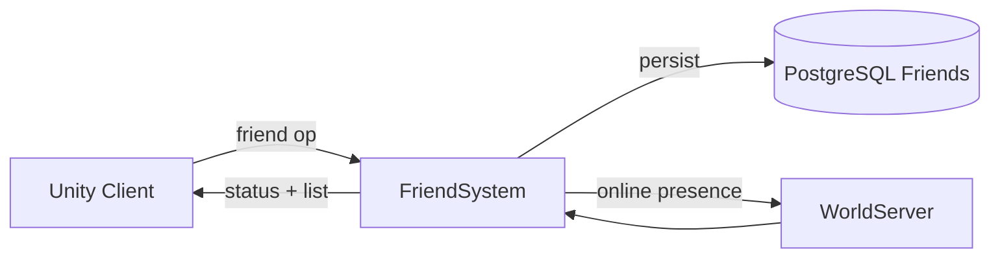

# Friend System

**Short description:** Server-side friend list management system for scene-server player characters, handling add/remove friend requests with validation, asynchronous database persistence, ingress guarding, and main-thread-marshaled client broadcasts.

## Table of Contents

- [Overview](#overview)
- [Supported Platforms](#supported-platforms)
- [Features](#features)
- [Prerequisites](#prerequisites)
- [Installation / Build](#installation--build)
- [Quick Start Guides](#quick-start-guides)
- [Configuration](#configuration)
- [Usage Examples](#usage-examples)
- [Operational Checks](#operational-checks)
- [Flow Diagram](#flow-diagram)
- [Project Structure](#project-structure)
- [License](#license)

## Overview

The Friend system is the SceneServer social subsystem for friend list management. It handles add/remove friend requests from connected players, validates constraints (self-add, max capacity), persists friend relationships asynchronously, and relays successful updates back to the owning client.

The design separates responsibilities across execution contexts:
- **Main thread:** request validation, in-memory controller updates, and network broadcasts.
- **Async worker:** database fetch/persist/delete operations dispatched through `IAsyncWorkerData`.
- **Main-thread queue:** marshaling async completion actions back to Unity/FishNet-safe context via `FriendSystemMainThreadQueueData`.

All DB writes are queued through `TryEnqueueAsyncWork(...)` to `IAsyncWorkerData`. If queueing fails (backpressure/missing dependency), the system logs warnings while keeping gameplay state intact. Broadcasts are only emitted after successful in-memory state changes, ensuring clients never see stale or uncommitted data.

## Supported Platforms

| Platform | Supported | Notes |
|---|---|---|
| Windows | Yes | |
| Linux | Yes | |
| WebGL | N/A | Server-only module |
| Unity 6.3 LTS | Yes | Required engine version |
| IL2CPP | Yes | Supported scripting backend |

## Features

- Add and remove friend requests with full validation (self-add prevention, max capacity enforcement, duplicate detection)
- Per-connection ingress guarding with debounce and in-flight protection to prevent duplicate operations
- Asynchronous database persistence for friend relationships via `IAsyncWorkerData` to avoid blocking gameplay
- Main-thread marshaling of async completion actions for safe controller mutation and network broadcasts
- Online status resolution for newly added friends via `ICharacterService.FetchAsync`
- Time-sliced main-thread queue draining with configurable per-frame action limits to avoid frame spikes
- Periodic ingress guard cleanup sweeps with configurable TTL and max removals per sweep
- Achievement integration for friend-add events via configurable `AchievementTemplate`
- Graceful degradation: logs warnings on persistence queue failures while keeping in-memory gameplay state intact
- Guard release deferred until async operation completes, preventing overlap windows for duplicate operations

## Prerequisites

- **Unity 6.3 LTS**
- **FishNetworking** — networking framework
- **FishMMO Server Core** — provides `ServerBehaviour`, `IFriendSystem`, controller interfaces, broadcast types, `IAsyncWorkerData`, and `IngressGuard`

## Installation / Build

This is an integrated module within FishMMO. It is included as part of the server-side scene-server implementation and does not require separate installation. Ensure the FishMMO Server Core and its dependencies are properly configured in your Unity project.

## Quick Start Guides

1. Ensure `FriendSystem` is present on the scene server GameObject (it inherits from `ServerBehaviour` and implements `IFriendSystem`).
2. Verify that `FriendSystemMainThreadQueueData` and `FriendSystemRuntimeData` data containers are registered (declared via `[RequiresDataContainer]` attributes).
3. Confirm that `AsyncWorkerData` (`IAsyncWorkerData`) is available for non-blocking DB write queuing.
4. Confirm that `ICharacterSystem<NetworkConnection, Scene>` is registered in the behaviour registry.
5. Verify that database services (`ICharacterService`, `ICharacterFriendService`) are available in the DB service registry.
6. On initialize, `FriendSystem` automatically registers broadcast handlers for `FriendAddNewBroadcast` and `FriendRemoveBroadcast`; on deinitialize, it unregisters them.

## Configuration

### Inspector Settings

| Field | Type | Default | Purpose |
|---|---|---|---|
| `maxFriends` | `int` | `100` | Maximum number of friends allowed per character |
| `maxMainThreadActionsPerFrame` | `int` | `100` | Max friend-system actions drained from main-thread queue per frame |
| `ingressDebounceMilliseconds` | `int` | `100` | Minimum milliseconds between friend add/remove requests per connection |
| `ingressSweepIntervalSeconds` | `float` | `5.0` | Seconds between bounded ingress guard cleanup sweeps |
| `ingressEntryTtlSeconds` | `float` | `30.0` | Seconds before stale ingress guard entries are removed |
| `ingressSweepMaxRemovals` | `int` | `128` | Maximum stale ingress guard entries removed per sweep |
| `FriendAddAchievementTemplate` | `AchievementTemplate` | `null` | Optional achievement template incremented when a friend is added |

### Required Data Containers

| Container | Interface | Purpose |
|---|---|---|
| `FriendSystemMainThreadQueueData` | `IFriendSystemMainThreadQueueData` | Per-system main-thread action queue for marshaling async completions |
| `FriendSystemRuntimeData` | `IFriendSystemRuntimeData` | Runtime state container for ingress guard |
| `AsyncWorkerData` | `IAsyncWorkerData` | Queued non-blocking async DB work dispatch |

### Database Service Dependencies

| Service | Purpose |
|---|---|
| `ICharacterService` | Resolves target character existence and online status during add-friend |
| `ICharacterFriendService` | Persists and deletes friend relationships in the database |

### Threading Model

| Thread | Work |
|---|---|
| Main thread | Request validation, ingress guarding, in-memory controller updates, network broadcasts, DTO capture |
| Async worker | Database fetch/persist/delete operations via `IAsyncWorkerData` |

## Usage Examples

### Broadcast Handlers

`FriendSystem` registers the following server broadcast handlers on initialize:

- `FriendAddNewBroadcast` → `OnServerFriendAddNewBroadcastReceived`
- `FriendRemoveBroadcast` → `OnServerFriendRemoveBroadcastReceived`

And unregisters them on deinitialize.

### Broadcasts Emitted

| Broadcast | Purpose |
|---|---|
| `FriendAddBroadcast` | Notify requester of successful friend addition (includes online status) |
| `FriendRemoveBroadcast` | Notify requester of successful friend removal |

### External Integration Points

| Integration | Role |
|---|---|
| `IFriendController` | In-memory friend list state on the character object |
| `ICharacterSystem<NetworkConnection, Scene>` | Character lookup and validation |
| `IngressGuard` (via `IFriendSystemRuntimeData`) | Per-connection debounce and in-flight protection |
| `AsyncWorkerData` (`IAsyncWorkerData`) | Queued non-blocking async persistence |
| `IAchievementController` | Optional achievement increment on friend add |
| Database services (`ICharacterService`, `ICharacterFriendService`) | Friend relationship persistence and character resolution |

### Ingress Guarding

Friend ingress uses per-connection operation keys with debounce + in-flight protection. Operation codes are scoped per action type (`AddFriend`, `RemoveFriend`). For async-backed handlers, guard release is deferred until the queued async operation completes (not at enqueue-time), preventing overlap windows for duplicate operations.

### Async Worker and Backpressure

`TryEnqueueAsyncWork(...)` dispatches all async DB work through `IAsyncWorkerData`.

Behavior:
- Returns `true` when accepted.
- Returns `false` when queue is unavailable or full.
- Logs warnings on rejection/unavailability.
- Uses `entityKey = characterID` for per-character ordering.

This prevents unbounded fire-and-forget tasks and preserves operation order per player.

## Operational Checks

| Check | How to Verify |
|---|---|
| System initialization | Confirm `FriendSystem` initializes without errors; broadcast handlers are registered |
| Add friend validation | Send a `FriendAddNewBroadcast` and verify self-add and max-capacity constraints reject invalid requests |
| Add friend success | Send a valid `FriendAddNewBroadcast`; verify `FriendAddBroadcast` reaches the client with correct character ID and online status |
| Remove friend success | Send a `FriendRemoveBroadcast` for an existing friend; verify `FriendRemoveBroadcast` acknowledgement reaches the client |
| Ingress debounce | Send rapid duplicate requests; confirm only the first is processed within the debounce window |
| Async persistence | Check logs for successful `TryEnqueueAsyncWork` calls after add/remove operations |
| Main-thread queue draining | Verify queued actions are executed each frame within `maxMainThreadActionsPerFrame` limit |
| Persistence failure graceful degradation | Simulate persistence queue failure; confirm warning is logged and in-memory state remains unchanged |
| Achievement increment | Configure `FriendAddAchievementTemplate`; add a friend and verify achievement counter increments |
| Ingress guard cleanup | Verify stale ingress guard entries are removed during periodic sweeps |

## Flow Diagram

### High-Level Overview



### Add Friend

```
OnServerFriendAddNewBroadcastReceived(conn, msg, channel)
│
├─ 1. Validate connection and spawned object
├─ 2. Acquire ingress guard (debounce + in-flight)
├─ 3. Validate IFriendController exists
├─ 4. Check friend count < MaxFriends
├─ 5. Validate database services available
├─ 6. Reject self-friending (characterID == msg.CharacterID)
├─ 7. Enqueue guarded async work → AddFriendAsync(...)
│      │
│      ├─ Resolve ICharacterService, ICharacterFriendService
│      ├─ FetchAsync target character from DB (verify existence + online status)
│      ├─ PersistAsync friend relationship to DB
│      └─ Enqueue main-thread completion action:
│           ├── Re-validate connection/controller state
│           ├── Recheck max capacity and duplicate status
│           ├── Add friend to in-memory IFriendController
│           ├── Broadcast FriendAddBroadcast (CharacterID + Online)
│           └── Increment FriendAddAchievementTemplate (if configured)
│
└─ Guard release: deferred until async operation completes
```

### Remove Friend

```
OnServerFriendRemoveBroadcastReceived(conn, msg, channel)
│
├─ 1. Validate connection and spawned object
├─ 2. Acquire ingress guard (debounce + in-flight)
├─ 3. Validate IFriendController exists
├─ 4. Confirm friend exists in in-memory set
├─ 5. Enqueue guarded async work → RemoveFriendAsync(...)
│      │
│      ├─ Resolve ICharacterFriendService
│      ├─ DeleteAsync friend relationship from DB
│      └─ Enqueue main-thread completion action:
│           ├── Re-validate connection/controller state
│           ├── Confirm friend still in in-memory set
│           ├── Remove friend from IFriendController
│           └── Broadcast FriendRemoveBroadcast (CharacterID)
│
└─ Guard release: deferred until async operation completes
```

### Failure Semantics

```
Error Handling
│
├─ Invalid requests → ignored without state mutation
├─ DB/service lookup failures → abort async operation safely
├─ Queue rejection/unavailability → logged, work skipped
├─ Async exceptions → caught and logged with character context
└─ Broadcasts → only emitted after successful in-memory state changes
```

## Project Structure

### Directory Structure

```
Friend/
├── FriendSystem.cs                    # Friend add/remove orchestration and async persistence dispatch
├── FriendSystemRuntimeData.cs         # Runtime state container for ingress guard
├── FriendSystemMainThreadQueueData.cs # Per-system main-thread action queue container
└── README.md                          # System documentation
```

### Related Core Contracts

- `Server/Core/World/SceneServer/Friend/IFriendSystem.cs`
- `Server/Core/World/SceneServer/Friend/IFriendSystemMainThreadQueueData.cs`
- `Server/Core/World/SceneServer/Friend/IFriendSystemRuntimeData.cs`

### Inheritance Hierarchy

```
ServerBehaviour
└── FriendSystem : IFriendSystem

RuntimeDataContainer
└── FriendSystemRuntimeData : IFriendSystemRuntimeData

SystemMainThreadQueueData
└── FriendSystemMainThreadQueueData : IFriendSystemMainThreadQueueData
```

## License

This project is subject to the FishMMO project license.
