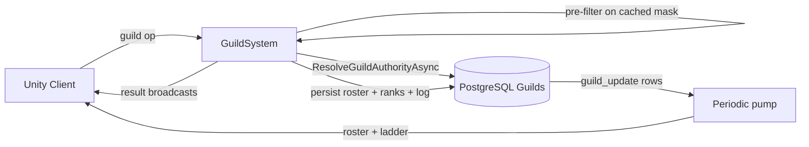

# Guild System

**Short description:** SceneServer social subsystem for guild lifecycle, membership and governance — creation (with an optional currency fee), invitations, applications and a public recruitment directory, an editable permission-mask rank ladder, member notes, message of the day and notice, leadership transfer, disband, an activity log, and periodic cross-server membership synchronization, all with asynchronous database persistence.

## Table of Contents

- [Overview](#overview)
- [Supported Platforms](#supported-platforms)
- [Features](#features)
- [Prerequisites](#prerequisites)
- [Installation / Build](#installation--build)
- [Quick Start Guides](#quick-start-guides)
- [Configuration](#configuration)
- [Usage Examples](#usage-examples)
- [Operational Checks](#operational-checks)
- [Flow Diagram](#flow-diagram)
- [Project Structure](#project-structure)
- [License](#license)

## Overview

The Guild system is the SceneServer social subsystem for guild lifecycle, membership and governance. It handles creation, invitations, applications, the recruitment directory, leave/remove flows, the rank ladder, member notes, guild text, leadership transfer, disband, the activity log, and periodic guild membership synchronization across servers.

The subsystem uses a split execution model:
- **Main thread:** cheap pre-filter validation against the controller's cached permission mask, in-memory controller state changes, tracker updates, achievement increments, and network broadcasts.
- **Async worker:** database reads/writes, the authoritative permission decision, and cross-server guild update markers via `TryEnqueueAsyncWork` / `TryEnqueueIngressWork`.
- **Main-thread queue:** marshaling async completion actions back to Unity/FishNet-safe execution via `IGuildSystemMainThreadQueueData`.

All mutating guild flows trigger guild-update persistence so other servers can reconcile member lists. Pending invitations are stored with a configurable TTL and bounded periodic sweeps. Per-connection ingress guards use debounce + in-flight semantics keyed by connection and operation type, with guard release deferred until async completion on the async-backed handlers.

### Permissions are a mask read from the database

`GuildRank` enum comparisons are gone. Every server-side permission decision consults a `GuildAuthority` — one character's authoritative standing in one guild, produced by a database read rather than anything cached on the character. The controller's copy of a rank is a client-visible convenience that can be a broadcast out of date, and "a broadcast out of date" is precisely the window in which a demoted officer would still be able to kick. The handlers still pre-filter on the cached mask so a request that can obviously never succeed costs nothing, but the decision is always re-made in `ResolveGuildAuthorityAsync`.

A rank no longer implies its powers by its name or its position. It holds a `GuildPermissions` mask, and the position (`RankOrder`, higher is more senior) is used for one thing only: seniority, so "you cannot act on somebody at or above you" still has an answer. Leadership is *the highest order row that exists in this guild*, read from the database, precisely so a guild that adds ranks does not end up with a leader seat defined by a constant.

`GuildAuthority.None` is what every failure resolves to — no membership, wrong guild, database unavailable — with `Permissions` of `None` and `RankOrder` of zero, so the failure mode of forgetting to check `IsMember` is refusal rather than escalation. The authority also carries the guild's whole `Ladder`, because almost every caller that needs one rank needs to validate a second in the same breath, and re-reading per question would turn one round trip into four, each able to observe a different edit.

`GuildRules` holds the decisions as pure functions returning `GuildActionResult`: `CanKick`, `CanChangeMemberRank`, `CanEditRank`, `CanCreateRank`, `CanDeleteRank`, `CanTransferLeadership`, `CanUse`, and the guard `WouldOrphanRankAdministration`.

### The rank ladder is contiguous

A seeded guild is 1 / 2 / 3 — member, officer, leader — with no free slots between them. Three consequences:

- **Adding a rank is a two-table INSERT, not a fill.** `IGuildRankService.InsertAsync` takes `FOR UPDATE` on the whole ladder and then moves everything at or above the new order up one rung inside a single transaction — `guild_ranks` **one `UPDATE` statement per row, descending**, because the unique index on `(guild_id, rank_order)` is checked per row and the single ranged `UPDATE` the obvious implementation wants collides with whichever occupied target the planner reaches first; and `character_guild` in one statement, since nothing there is unique. There is no free position to drop a rank into.
  - **The membership rows' `version` is bumped with them.** Every membership write is guarded by "version < the one I read plus one", so a rank change another scene server decided against the *pre-shift* ladder — "promote to 2", meaning the officer rank, computed a moment before 2 became a new empty tier — arrives already overtaken and is refused as stale instead of landing the member on a rank nobody chose.
  - **The insert itself is guarded by `WHERE EXISTS (SELECT 1 FROM guilds WHERE id = ...)`.** Zero rows inserted means the guild was disbanded while the request was in flight; it is reported rather than ignored, so the shift above rolls back with it. Capacity (`GuildRankDefaults.MaxRanksPerGuild`) and headroom (nothing may be pushed past `MaxRankOrder`) are both settled inside that same transaction, against the locked ladder, not by the caller.
- **The new rank must sit at or below the creator's own seat**, and may hold only permissions the creator holds — otherwise "may edit ranks" is "may become the leader", one step removed. Inserting *at* the creator's order is deliberately allowed: it puts the new rank directly below them and carries their own row up with the rest of the ladder, changing nobody's permissions and nobody's relative standing.
- **A member's own row is rename-only.** Seniority is strict for any change to a mask, because editing the seat you occupy is the shortest path from "may edit ranks" to "may do anything". A rename carries no such path — the mask is compared bit for bit and must be identical — and without the exception the guild's top rank could never be called anything but what it was seeded as, since nobody outranks the leader. Rows *above* the actor stay off limits entirely.

Deleting a rank additionally refuses when the ladder is down to two rungs (a guild needs a seat to admit new members into and a seat to lead from) or when the deletion would leave nobody holding `EditRanks` — a guild that loses its last rank administrator cannot restore one, whereas a guild that loses every `Invite` can still edit a rank to grant it back.

The edit path's grant check compares only the bits being **added** against the actor's own mask. A rank that already holds a permission the actor lacks keeps it: removing it is not an escalation, and refusing the whole edit over it would make such a rank uneditable forever by anyone below whoever granted it.

## Supported Platforms

| Platform | Supported | Notes |
|---|---|---|
| Windows | Yes | |
| Linux | Yes | |
| WebGL | N/A | Server-only module |
| Unity 6.3 LTS | Yes | Required engine version |
| IL2CPP | Yes | Supported scripting backend |

## Features

- Guild creation with name validation (`Authentication.IsAllowedGuildName`), uniqueness checks, and async database persistence
- Optional guild creation fee charged against any `CharacterAttributeTemplate` (currency is an attribute in FishMMO and is spent against the attribute's BASE value), with refund on failure and an `ICurrencyLedgerService` row recording the movement under `CurrencyMovementReason.GuildCreation` (`absorbed: true` for the charge, a second row with `absorbed: false` for a refund; a refund that cannot be delivered because the character has left the server is logged as an error to be restored by hand). Leaving the template empty or the amount at zero makes founding free and changes nothing else about the create path
- Guild invitation flow: a member holding `GuildPermissions.Invite` sends, the target receives a pending invite tracked with TTL-based expiration
- Per-target invite cooldown (`perTargetInviteCooldownSeconds`, default 60 s). The pending-invitation slot is not a rate limit — declining clears it instantly — and the ingress debounce is per connection rather than per target, so neither stops one player keeping a modal permanently on another's screen; this does
- Invite acceptance with guild capacity verification, membership persistence, and guild-update marker propagation
- Invite decline clears the pending invitation immediately
- Public recruitment: a per-guild advertisement (blurb, normalized tags, recruiting flag) gated on `EditRecruitment`, and a searchable directory bounded by `guildDirectoryPageSize` — a cap, not a page cursor, because the directory is browsed by searching rather than by paging
- Application queue: apply with a message, officers holding `ManageApplications` list and resolve; the per-guild unique index stops repeat applications, `maxPendingApplicationsPerCharacter` is enforced inside the INSERT, and `applicationCooldownSeconds` is the rate limit that a player working down the directory cannot defeat
- Applicants blocked by guild leadership are refused (`IsBlockedByGuildLeadershipAsync`, via `ICharacterFriendService`)
- Editable rank ladder: list, create, edit and delete ranks, all decided by `GuildRules` against a freshly resolved `GuildAuthority`
- Member notes: a public note and an officer note per member, gated on `EditPublicNotes` / `EditOfficerNotes`, with `ViewOfficerNotes` deciding whether the officer note is even put on the wire
- Message of the day and notice, length-bounded by `GuildTextLimits` and gated on `EditMessageOfTheDay` / `EditNotice`
- Leadership transfer, stricter than the permission alone: the actor must also currently occupy the top seat, because a rank editor could otherwise grant `TransferLeadership` to a subordinate rank
- Disband, gated on `GuildPermissions.Disband`, re-authorised server-side because it is the one guild action with no undo, and confirmed by typing the guild's name (compared case-insensitively against the **stored** name, so the player confirms the guild that exists rather than the one their client last rendered)
- Guild-owned housing plots are released on disband (`IPlotService.ReleaseAllForGuildAsync`), because plots left owned by an identifier no guild answers to are unclaimable and untaxable — removed from the game permanently and silently. Done here rather than in the housing system, since a sweep for orphans would have to enumerate every guild-owned plot in the world
- Guild leave with automatic leadership succession — a random member drawn from the **most senior remaining rank**, and if no successor can be found the leave is **refused** rather than leaving the guild leaderless — or guild deletion when no members remain
- Guild member removal (kick) with seniority checks: you cannot act on somebody at or above you
- Guild rank changes for members, decided by `GuildRules.CanChangeMemberRank`
- Append-only activity log (`GuildLogEventType`) trimmed to `guildLogRetainedEntries` every `guildLogPruneInterval` appends — pruning on every append would double the write cost of every guild event for a table that only needs to stay roughly bounded
- Periodic guild update synchronization pump on the party pump's watermark model (`UpdatePumpWatermark`): the mark starts at the fetch time less a clock-skew allowance, an unreadable guild holds it only within a retry horizon, and a processed-update record stops the passes inside that window re-sending the same update. Rosters and ladders for every changed guild are read in two bulk queries
- Roster deltas: after a member's first full roster from this server, the pump sends `GuildRosterDeltaBroadcast` with only the rows that changed for that member's officer-note audience, falls back to the whole roster when more than half changed, and sends the rank list only when the ladder or the member's own rank moved (`GuildRosterDelta`, `GuildRecipientBaselines`). Every copy is one multicast per audience
- A 30 s guild existence sweep that notices guilds disbanded on another scene server (a disband leaves no update row for the pump to find)
- Per-guild online character tracking (`GuildCharacterTracker`) and the roster as last delivered (`GuildMemberTracker`, full rows keyed by character ID), with automatic cleanup when no local members remain
- Chat command integration (`/gi`, `/ginvite`) for in-game guild invitations by character name
- Achievement integration for guild creation (`GuildCreateAchievementTemplate`) and guild joining (`GuildJoinAchievementTemplate`)
- Membership-removal in-flight guard (`BeginMembershipRemoval` / `EndMembershipRemoval`) so a leave and a kick for the same character cannot both run
- Per-connection ingress debounce and in-flight guards across 21 operations
- Bounded TTL sweeps for pending invitations, invite cooldowns, application cooldowns, and stale ingress guard entries
- Async DB tasks queued through `TryEnqueueAsyncWork` / `TryEnqueueIngressWork` with backpressure (rejects when the queue is unavailable or full, logs a warning and answers the client `ServerBusy`)
- Entity-keyed ordering for per-character/per-guild sequencing on async work
- Optimistic concurrency via version-based sequencing on guild member persistence
- Character connect/disconnect hooks that persist guild member location ("Offline" on disconnect) and trigger guild-update markers
- Graceful failure semantics: invalid requests ignored safely, permission/rank/capacity checks fail closed, async failures logged without blocking the main thread, main-thread completion paths revalidate connection/object/controller state

## Prerequisites

- **Unity 6.3 LTS**
- **FishNetworking** — networking framework
- **FishMMO Server Core** — provides `ServerBehaviour`, `IGuildSystem`, `IGuildSystemRuntimeData`, `IGuildSystemMainThreadQueueData`, `IGuildCharacterMappingData`, `ICharacterSystem`, `AsyncWorkerData`, `IngressGuard`, `RepeatingFaultLog`, `MonotonicClock` and `ChatHelper`; `UpdatePumpWatermark` lives beside the party system (`../Party/`), which shares it
- **FishMMO Shared** — provides `IGuildController`, `GuildPermissions`, `GuildRankDefaults`, `GuildTextLimits`, `GuildLogEventType`, `GuildResultType`, `CharacterAttributeTemplate`, `CharacterCurrency`, `AchievementTemplate`, `Authentication`, and the broadcast types (`GuildCreateBroadcast`, `GuildInviteBroadcast`, `GuildAcceptInviteBroadcast`, `GuildDeclineInviteBroadcast`, `GuildLeaveBroadcast`, `GuildRemoveBroadcast`, `GuildChangeRankBroadcast`, `GuildSetMessageOfTheDayBroadcast`, `GuildSetNoticeBroadcast`, `GuildTransferLeadershipBroadcast`, `GuildDisbandBroadcast`, `GuildLogRequestBroadcast`, `GuildRankListRequestBroadcast`, `GuildEditRankBroadcast`, `GuildCreateRankBroadcast`, `GuildDeleteRankBroadcast`, `GuildSetMemberNoteBroadcast`, `GuildSetRecruitmentBroadcast`, `GuildDirectoryRequestBroadcast`, `GuildApplyBroadcast`, `GuildApplicationListRequestBroadcast`, `GuildResolveApplicationBroadcast`, and the outbound `GuildAddBroadcast`, `GuildAddMultipleBroadcast`, `GuildRosterDeltaBroadcast`, `GuildAddEntry`, `GuildRankListBroadcast`, `GuildRankEntry`, `GuildInfoBroadcast`, `GuildRecruitmentInfoBroadcast`, `GuildDirectoryBroadcast`, `GuildApplicationListBroadcast`, `GuildLogBroadcast`, `GuildCreationCostBroadcast`, `GuildResultBroadcast`)
- **FishMMO Database** — provides `IGuildService`, `ICharacterGuildService`, `IGuildUpdateService`, `IGuildRankService`, `IGuildApplicationService`, `IGuildLogService`, `ICharacterAttributeService`, `ICharacterFriendService`, `ICurrencyLedgerService`, `IPlotService`, `GuildRankData`, and `DatabaseResult<T>`

## Installation / Build

This is an integrated module within FishMMO. It is included as part of the server-side scene-server implementation and does not require separate installation. Ensure the FishMMO Server Core and its dependencies are properly configured in your Unity project.

## Quick Start Guides

1. Ensure `GuildSystem` is present on the scene server GameObject (it inherits from `ServerBehaviour` and implements `IGuildSystem<NetworkConnection>`). The ScriptableObject is created via `Create > FishMMO > Server > SceneServer > Guild System`.
2. Verify that the following data containers are registered in `DataContainerRegistry`:
   - `GuildSystemRuntimeData` → `IGuildSystemRuntimeData`
   - `GuildCharacterMappingData` → `IGuildCharacterMappingData`
   - `GuildSystemMainThreadQueueData` → `IGuildSystemMainThreadQueueData`
   - `AsyncWorkerData` (shared async work queue)
3. On initialize, `GuildSystem` validates its data containers and `ICharacterSystem`, registers the chat commands (`/gi`, `/ginvite`), registers 22 broadcast handlers, subscribes to character connect/disconnect hooks, registers the periodic guild update callback and the guild existence sweep, and clamps every inspector value.
4. On deinitialize, it drains the remaining main-thread queue, unregisters broadcast handlers, unsubscribes character hooks, and unregisters the periodic callback.
5. Clients send guild broadcasts; the server pre-filters on the cached mask, performs async DB work that re-resolves the requester's `GuildAuthority`, and replies with result broadcasts. Other servers pick up changes via the periodic guild update synchronization pump.

## Configuration

### Inspector Parameters

| Parameter | Type | Default | Description |
|---|---|---|---|
| `maxMainThreadActionsPerFrame` | int | 100 | Max guild-system actions drained from main-thread queue per frame (min 1) |
| `maxGuildSize` | int | 100 | Maximum number of members allowed per guild |
| `updatePumpRate` | float | 1.0 | Periodic guild update polling interval in seconds |
| `guildUpdateClockSkewAllowanceSeconds` | float | 5.0 | Skew between this server's clock and the database's tolerated by the pump's watermark (min 0). The retry horizon is ten times this, and never under 60 s; the processed-update record is kept for twice the horizon |
| `guildExistenceSweepSeconds` | float | 30.0 | Seconds between checks that every guild with members on this server still exists; a guild disbanded on another server is noticed within this long (min 1) |
| `guildCreationFeeCurrency` | CharacterAttributeTemplate | — | Currency attribute charged to found a guild. Empty means free |
| `guildCreationFee` | long | 0 | Amount charged to found a guild. Zero or less disables the fee |
| `invitationTtlSeconds` | float | 45.0 | Invitation lifetime in seconds before automatic expiration (min 5.0) |
| `invitationSweepIntervalSeconds` | float | 1.0 | Seconds between bounded invitation cleanup sweeps (min 0.1) |
| `invitationSweepMaxScan` | int | 128 | Maximum invitation entries scanned per cleanup sweep (min 1) |
| `invitationSweepMaxRemove` | int | 128 | Maximum invitation entries removed per cleanup sweep (min 1) |
| `perTargetInviteCooldownSeconds` | float | 60.0 | Minimum seconds between invitations to the same target from the same inviter |
| `guildLogRetainedEntries` | int | 100 | Activity log rows retained per guild, and the read cap (clamped 10–200) |
| `guildLogPruneInterval` | int | 25 | Appends between activity log prune passes (min 1) |
| `ingressDebounceMilliseconds` | int | 100 | Minimum milliseconds between guild requests per connection and operation |
| `ingressSweepIntervalSeconds` | float | 5.0 | Seconds between bounded ingress guard cleanup sweeps (min 0.25) |
| `ingressEntryTtlSeconds` | float | 30.0 | Seconds before stale ingress guard entries are removed (min 1.0) |
| `ingressSweepMaxRemovals` | int | 128 | Maximum stale ingress guard entries removed per sweep (min 1) |
| `guildDirectoryPageSize` | int | 50 | Directory rows returned per browse request |
| `guildApplicationPageSize` | int | 50 | Pending applications sent to an officer per request |
| `maxPendingApplicationsPerCharacter` | int | 5 | Most applications one character may have outstanding at once |
| `applicationCooldownSeconds` | float | 30.0 | Minimum seconds between applications from the same character |
| `GuildCreateAchievementTemplate` | AchievementTemplate | — | Achievement to increment when a player creates a guild |
| `GuildJoinAchievementTemplate` | AchievementTemplate | — | Achievement to increment when a player joins a guild |

### Rank Ladder Constants (`GuildRankDefaults`)

| Constant | Value | Description |
|---|---|---|
| `MinRankOrder` | 1 | Lowest legal rank order. Zero means "no rank", i.e. not in a guild |
| `MaxRankOrder` | 200 | Highest legal rank order, leaving room above the seeded ladder |
| `MaxRanksPerGuild` | 12 | Most rank rows one guild may define |
| `MaxRankNameLength` | 24 | Matches `character varying(24)` on `guild_rank.name` |
| `MemberPermissions` | `None` | Mask the seeded lowest rank holds |
| `OfficerPermissions` | see below | The exact set the old `Rank >= GuildRank.Officer` checks granted, plus `ViewOfficerNotes` and `ManageApplications` — both gate functionality that did not exist to be withheld, so including them takes nothing from anybody, while leaving them out would ship a recruitment queue no officer could reach |

### Permission Mask (`GuildPermissions`)

`Invite`, `Kick`, `Promote`, `EditMessageOfTheDay`, `EditNotice`, `EditRanks`, `ManageBank`, `ManageApplications`, `Disband`, `EditRecruitment`, `ViewOfficerNotes`, `EditOfficerNotes`, `EditPublicNotes`, `TransferLeadership`.

`ManageBank` exists in the mask; there is no guild bank implementation behind it yet.

### Ingress Operations

Every operation is debounced per connection by `ingressDebounceMilliseconds`. Async-backed handlers defer the guard release until the async work completes; read-only and immediate handlers release it in `finally`.

| Operation | Key | | Operation | Key |
|---|---|---|---|---|
| Create | 1 | | RankList | 12 |
| Invite | 2 | | EditRank | 13 |
| AcceptInvite | 3 | | CreateRank | 14 |
| DeclineInvite | 4 | | DeleteRank | 15 |
| Leave | 5 | | SetNote | 16 |
| Remove | 6 | | SetRecruitment | 17 |
| ChangeRank | 7 | | Directory | 18 |
| SetInfo | 8 | | Apply | 19 |
| TransferLeadership | 9 | | ApplicationList | 20 |
| Disband | 10 | | ResolveApplication | 21 |
| LogRequest | 11 | | | |

### Threading Model

| Thread | Work |
|---|---|
| Main thread | Request pre-filter against the controller's cached mask, ingress guard checks, in-memory controller state changes, tracker updates, achievement increments, currency deduction, network broadcasts, queue drain, invitation sweep, cooldown sweeps, ingress sweep |
| Async worker | `ResolveGuildAuthorityAsync` and every database read/write: `CreateGuildAsync`, `InviteToGuildAsync`, `AcceptGuildInviteAsync`, `JoinGuildAsync`, `LeaveGuildAsync`, `RemoveGuildMemberAsync`, `ChangeGuildRankAsync`, `EditGuildRankAsync`, `CreateGuildRankAsync`, `DeleteGuildRankAsync`, `SetGuildMemberNoteAsync`, `SetGuildTextAsync`, `TransferGuildLeadershipAsync`, `DisbandGuildAsync`, `SendGuildLogAsync`, `SetGuildRecruitmentAsync`, `SendGuildDirectoryAsync`, `ApplyToGuildAsync`, `SendGuildApplicationsAsync`, `ResolveGuildApplicationAsync`, `AdmitApplicantAsync`, `PersistGuildMemberAsync`, `PublishGuildInfoAsync`, `PublishGuildRankLadderAsync`, `FetchAndProcessGuildUpdatesAsync` |

## Usage Examples

### Chat Commands

| Command | Handler | Purpose |
|---|---|---|
| `/gi <name>` | `OnGuildInvite` | Invite a character by name to the sender's guild |
| `/ginvite <name>` | `OnGuildInvite` | Alias for `/gi` |

### Broadcast Handlers

`GuildSystem` registers the following server-side broadcast handlers on initialize:

| Broadcast | Handler | Permission | Purpose |
|---|---|---|---|
| `GuildCreateBroadcast` | `OnServerGuildCreateBroadcastReceived` | — | Create a new guild |
| `GuildInviteBroadcast` | `OnServerGuildInviteBroadcastReceived` | `Invite` | Invite a character to a guild |
| `GuildAcceptInviteBroadcast` | `OnServerGuildAcceptInviteBroadcastReceived` | — | Accept a pending guild invitation |
| `GuildDeclineInviteBroadcast` | `OnServerGuildDeclineInviteBroadcastReceived` | — | Decline a pending guild invitation |
| `GuildLeaveBroadcast` | `OnServerGuildLeaveBroadcastReceived` | — | Leave current guild |
| `GuildRemoveBroadcast` | `OnServerGuildRemoveBroadcastReceived` | `Kick` | Remove a member from a guild |
| `GuildChangeRankBroadcast` | `OnServerGuildChangeRankBroadcastReceived` | `Promote` | Change a guild member's rank |
| `GuildSetMessageOfTheDayBroadcast` | `OnServerGuildSetMessageOfTheDayBroadcastReceived` | `EditMessageOfTheDay` | Set the message of the day |
| `GuildSetNoticeBroadcast` | `OnServerGuildSetNoticeBroadcastReceived` | `EditNotice` | Set the guild notice |
| `GuildTransferLeadershipBroadcast` | `OnServerGuildTransferLeadershipBroadcastReceived` | `TransferLeadership` + must occupy the top seat | Hand the top seat to another member |
| `GuildDisbandBroadcast` | `OnServerGuildDisbandBroadcastReceived` | `Disband` + name confirmation | Delete the guild |
| `GuildLogRequestBroadcast` | `OnServerGuildLogRequestBroadcastReceived` | member | Read the activity log |
| `GuildRankListRequestBroadcast` | `OnServerGuildRankListRequestBroadcastReceived` | member | Read the rank ladder |
| `GuildEditRankBroadcast` | `OnServerGuildEditRankBroadcastReceived` | `EditRanks` | Rename or re-permission a rank |
| `GuildCreateRankBroadcast` | `OnServerGuildCreateRankBroadcastReceived` | `EditRanks` | Insert a rank into the ladder |
| `GuildDeleteRankBroadcast` | `OnServerGuildDeleteRankBroadcastReceived` | `EditRanks` | Remove a rank from the ladder |
| `GuildSetMemberNoteBroadcast` | `OnServerGuildSetMemberNoteBroadcastReceived` | `EditPublicNotes` / `EditOfficerNotes` | Set a member's public or officer note |
| `GuildSetRecruitmentBroadcast` | `OnServerGuildSetRecruitmentBroadcastReceived` | `EditRecruitment` | Edit the recruitment advertisement |
| `GuildDirectoryRequestBroadcast` | `OnServerGuildDirectoryRequestBroadcastReceived` | — | Browse/search recruiting guilds |
| `GuildApplyBroadcast` | `OnServerGuildApplyBroadcastReceived` | — | Apply to a recruiting guild |
| `GuildApplicationListRequestBroadcast` | `OnServerGuildApplicationListRequestBroadcastReceived` | `ManageApplications` | Read the pending application queue |
| `GuildResolveApplicationBroadcast` | `OnServerGuildResolveApplicationBroadcastReceived` | `ManageApplications` | Accept or reject an application |

Any member may read the rank ladder: a player cannot be expected to work within rules they are not allowed to see, and the masks are already implied by which buttons every other member visibly has.

Outbound, the system sends `GuildAddBroadcast`, `GuildAddMultipleBroadcast`, `GuildRosterDeltaBroadcast`, `GuildLeaveBroadcast`, `GuildRankListBroadcast`, `GuildInfoBroadcast`, `GuildRecruitmentInfoBroadcast`, `GuildDirectoryBroadcast`, `GuildApplicationListBroadcast`, `GuildLogBroadcast`, `GuildCreationCostBroadcast`, `GuildInviteBroadcast` and `GuildResultBroadcast`.

### Create Guild Path

`OnServerGuildCreateBroadcastReceived(conn, msg, channel)`:

1. Validates connection and spawned player object.
2. Acquires ingress guard (Create).
3. Validates the character is not already in a guild; sends `GuildResultType.AlreadyInGuild` if so.
4. Trims and validates the guild name via `Authentication.IsAllowedGuildName`; sends `GuildResultType.InvalidGuildName` if invalid.
5. If a creation fee is configured, `TryPersistCreationFeeCurrency` deducts it on the main thread first, so a player who cannot pay never reaches the database. `SendGuildCreationCost` is what tells the client the price.
6. Enqueues async work: `CreateGuildAsync`.
   - Checks name uniqueness via `IGuildService.ExistsAsync`; `GuildResultType.NameAlreadyExists` if taken.
   - Creates the guild via `IGuildService.PersistAsync` (returns the new guild ID).
   - Seeds the rank ladder (`BuildDefaultLadder` → member / officer / leader).
   - Persists the creator at the leader rank via `ICharacterGuildService.PersistAsync`.
   - Records the fee through `ICurrencyLedgerService` and marshals to the main thread: sets controller ID/rank, adds the tracker, broadcasts `GuildAddBroadcast`, increments `GuildCreateAchievementTemplate`.
   - Any failure routes through `FailCreate`, which refunds the fee (`RefundCreationFee`) and answers the client.

### Invite / Accept / Decline Path

**Invite** (`OnServerGuildInviteBroadcastReceived`): validates the inviter holds `Invite` and is not self-inviting, checks the per-target cooldown, then `InviteToGuildAsync` re-resolves authority, checks capacity via `ICharacterGuildService.CountAsync`, and marshals back to add the pending invitation and send `GuildInviteBroadcast` to the target.

**Accept** (`OnServerGuildAcceptInviteBroadcastReceived`): validates the character is not already in a guild and that a pending invitation exists, then `AcceptGuildInviteAsync` → `JoinGuildAsync` re-checks capacity, persists membership at the guild's lowest rank order (`ResolveLowestRankOrderAsync`, not a hardcoded constant), triggers the guild-update marker, appends the activity log, and marshals back to set the controller, clear the invitation, add the tracker, broadcast the roster, and increment `GuildJoinAchievementTemplate`.

**Decline** (`OnServerGuildDeclineInviteBroadcastReceived`): clears the pending invitation immediately.

### Recruitment and Applications

`SetGuildRecruitmentAsync` stores the blurb, the normalized tags (`NormalizeTags`) and the recruiting flag, then `PublishGuildRecruitmentInfoAsync` pushes `GuildRecruitmentInfoBroadcast` to the guild.

`SendGuildDirectoryAsync` returns up to `guildDirectoryPageSize` recruiting guilds matching a search term.

`ApplyToGuildAsync` refuses an applicant already in a guild, one blocked by guild leadership (`IsBlockedByGuildLeadershipAsync`), one over `maxPendingApplicationsPerCharacter`, or one inside `applicationCooldownSeconds`. The outstanding cap and the per-guild uniqueness are both enforced inside the INSERT.

`ResolveGuildApplicationAsync` is where the interesting races are settled, because an application sits around for as long as it takes an officer to look at it: in that window the guild can fill up, disband or stop recruiting, and the applicant can join elsewhere, block the recruiter, or apply again from a second client. An accept re-checks that the applicant is still unguilded, then goes on to `AdmitApplicantAsync`, which admits them through the ordinary `JoinGuildAsync` path — tolerating an applicant who is offline or on another scene server, who receives the membership when their character next loads (login or zone change), because requiring them to be logged in and in the right zone at the moment an officer clicks Accept would make the queue nearly useless. It is not the pump that delivers it: the pump refreshes only characters its server already knows are members. `JoinGuildAsync` returns its outcome, which is sent to the accepting officer — their queue entry is gone either way — and `ApplicationAccepted` is logged only when the admission succeeded.

### Rank Ladder Paths

Each of `EditGuildRankAsync`, `CreateGuildRankAsync` and `DeleteGuildRankAsync` follows the same shape: re-resolve `GuildAuthority`, mask the proposed permissions with `GuildPermissions.All`, ask `GuildRules`, sanitize the name via `GuildRankDefaults.TrySanitizeRankName`, write, `AppendGuildLog`, then `NotifyGuildOfRankChangeAsync`.

A refusal answers through `RefuseRankEdit`, which sends both the `GuildResultType` (mapped from `GuildActionResult` by `ToGuildResultType`) **and** a fresh rank list — and when the *service* refuses, the ladder it sends is re-resolved rather than the one the decision was made on, because the service decided against the locked ladder which may already differ.

`SendGuildRankList` / `PublishGuildRankLadderAsync` emit `GuildRankListBroadcast` carrying the ladder, the viewer's own rank order and the viewer's permissions, so the client draws only what the viewer may actually do.

`PublishGuildRankLadderAsync` (after any ladder edit) reads the roster and the ladder once, then delivers on the main thread (`DeliverPublishedLadder`): each local member is re-checked (their controller must still name the guild), their server-side standing is refreshed, and they join the audience for their rank — **one multicast per rank held locally**, through the same `DeliverRankListAudiences` the pump uses, instead of one message per member. The ladder becomes the guild's delivered ladder (`AdvanceDeliveredLadder`) and each recipient is recorded as holding its generation at their rank, so the pump's pass over the update this edit writes does not send the same list again, and a member already holding it is skipped. `SendGuildRankList` (one member: a rank-list request, create) still forgets that member's ladder baseline, because its ladder comes from a resolve of its own.

### Leave / Remove / Rank Change Path

**Leave** (`LeaveGuildAsync`): fetches the current members; when the leaver holds the top seat and members remain it finds the most senior remaining rank order and promotes a random member of that rank into the leader seat — and if no successor can be found at all it **refuses the leave**, logging an error, rather than leaving the guild leaderless. It then deletes the leaving member, and — when nobody remains — deletes the guild, its update marker, and releases its housing plots (`ReleaseGuildPlotsAsync`). Otherwise it triggers the guild-update marker. Marshals back (`CompleteLocalLeave`) to reset the controller, remove the tracker, and broadcast `GuildLeaveBroadcast`. Two cases stop short of that: a leaver with **no row** in the roster (removed on another server before this one heard) writes nothing at all and only clears the stale local state — the remaining-member count would otherwise be one short, and a two-member guild would be deleted with its other member still in it — and a member **delete that fails** refuses the leave with `Failed` instead of telling the player they left while the row stays.

**Remove** (`RemoveGuildMemberAsync`): re-resolves the requester's authority, verifies the same guild, applies `GuildRules.CanKick` (you cannot kick somebody at or above you), deletes the member, triggers the guild-update marker, appends the log, and marshals back to remove the tracker.

**Rank Change** (`ChangeGuildRankAsync`): re-resolves authority, applies `GuildRules.CanChangeMemberRank`, updates via `ICharacterGuildService.UpdateRankAsync` under the membership row's version, and triggers the guild-update marker on success.

`BeginMembershipRemoval` / `EndMembershipRemoval` mark a character's removal as in flight, so a leave and a kick for the same character cannot both run.

### Periodic Synchronization Pump

`OnPeriodicUpdate(deltaTime)`:

1. Sweeps the processed-update record every 30 s (`SweepProcessedGuildUpdates`, records older than `UpdatePumpWatermark.ProcessedRecordLifetime`), whether or not a pass is in flight.
2. Guards against re-entrance via `TryBeginUpdatePump`.
3. Snapshots tracked guild IDs and the last fetch time on the main thread.
4. Enqueues async work: `FetchAndProcessGuildUpdatesAsync`.
   - Reads this server's clock **before** the query, less `guildUpdateClockSkewAllowanceSeconds` (`UpdatePumpWatermark.FetchStarted`): the update rows are stamped by the database's clock, so the mark trails this server's by the allowance. That is where the pass's mark starts.
   - Fetches guild update rows since `lastFetch` via `IGuildUpdateService.FetchAsync`, and skips any the processed-update record says were already delivered (`HasProcessedGuildUpdate`).
   - Reads the rosters of every remaining guild in one query (`ICharacterGuildService.FetchManyAsync(long[])`) and their ladders in another (`IGuildRankService.FetchManyAsync(long[])`). A bulk read fails only because the database did, so a failure holds every guild in the pass. Seeding a ladder for a guild that has none is the one per-guild step left.
   - A guild whose roster came back **empty** — which is what a deleted guild reads as — is checked with `IGuildService.FetchExistingIdsAsync` before its empty ladder would be re-seeded; one that is gone has its local members cleared (`ClearLocalGuildMembers`). No other guild's existence is read by the pump.
   - Each unprocessed update is classified by `UpdatePumpWatermark.Classify`: **read** (delivered and recorded as processed), **unread inside the retry horizon** (the mark is held at its timestamp so the next pass fetches it again), or **unread for longer than the horizon** (logged once and released, so one unreadable guild can no longer pin the mark). A guild enters the delivery only with both its roster and its ladder.
   - Marshals to the main thread: sets `LastFetchTime` to the mark, then `ApplyGuildSnapshot` for each guild read. The processed record is written only once that delivery is actually queued, so a full main-thread queue re-fetches the update instead of dropping it.

`ApplyGuildSnapshot(guildID, rows, ladder, mapData)`, per guild:

- Members in the previous snapshot and not in this one are untracked (`RemoveGuildCharacterTracker`) and have their standing cleared (`ClearGuildStanding`). If that takes the last local member, the guild's delivered roster and ladder are dropped and nothing is sent.
- `GuildMemberTracker[guildID]` becomes the new roster, as full rows (officer notes included) keyed by character ID: the baseline the next pass diffs against.
- Each local member whose controller names **this** guild (`guildController.ID == guildID`; a character who has moved to another guild is skipped) has its server-side rank order, permission mask and leader seat refreshed from the row just read.
- Each online member is placed in one of four roster audiences: the public or officer-note copy (by whether their rank holds `ViewOfficerNotes`), each whole or delta. A member whose client already holds this guild's roster from this server, in the same copy (`GuildRecipientBaselines.HasRoster`), gets the delta; anybody else gets the whole roster and is recorded as holding it.
- The delta copy is `GuildRosterDelta.Diff` against the previous roster, then `GuildRosterDelta.Choose`: nothing when nothing that audience can see changed; `GuildRosterDeltaBroadcast` (`GuildID`, `Upserts`, `Removals`) otherwise; the whole roster when more than half the rows changed. Last-seen counts as a change only while the member is offline, since an online character's last-seen moves with every save; the officer note counts only for the officer copy.
- The rank list goes only to members whose client does not hold the current ladder **generation** at their current rank (`GuildRecipientBaselines.HasLadder`). A generation is a counter that moves only when the ladder read differs from the one last delivered (`AdvanceDeliveredLadder`), so a member changing zone costs one roster row, not a roster and a ladder for everybody.
- Every copy is one multicast (`Server.NetworkWrapper.Broadcast(HashSet<NetworkConnection>, …)`), serialised once; the rank list goes out as one multicast per rank held locally (`DeliverRankListAudiences`), since it carries the viewer's own rank and mask. Each recipient receives its roster or delta before its rank list.

Baselines are forgotten whenever the client may no longer hold what was recorded: on connect and disconnect, when a character joins or leaves the guild here, when the pump evicts them, and — the ladder only — when a rank list reaches them by a path that records no generation (one member's rank-list request, the create path). The login snapshot that `CharacterSystem` sends as a character loads calls `IGuildSystem.ForgetGuildDeliveryBaselines`, so the pump's next delivery to that character goes out whole. A forgotten baseline costs one full send; a wrong one would leave a panel stale.

Roster entries carry `LastOnlineUnixSeconds` (via `ToUnixSeconds`), not .NET ticks, and the guild id lives once on the `GuildAddMultipleBroadcast` and `GuildRosterDeltaBroadcast` envelopes rather than being repeated on every member row. The location a member carries while logged out is `GuildRosterDelta.OfflineLocation` ("Offline"), the one definition the disconnect path, the delta rule and the client panel share.

### Guild Existence Sweep

A disband deletes the guild's update row with it, so the pump never hears of a disband done on another scene server. `OnPeriodicGuildExistenceSweep` (every `guildExistenceSweepSeconds`, 30 s) snapshots the tracked guild IDs and `SweepVanishedGuildsAsync` asks which still exist; the local members of any that do not are cleared exactly as a local disband clears them. It has its own in-flight flag and `RepeatingFaultLog`; a failed read clears nothing and the next sweep asks again. The pump used to read the existence of every tracked guild on every one-second pass.

### Failure Semantics

- Null/invalid requests return early (silent no-op).
- Permission, seniority, ladder-integrity and guild-capacity checks fail closed; `GuildAuthority.None` is the value a missing membership produces, and `GuildAuthority.Unavailable` (also a non-member, with `LookupFailed` set) the value a failed read produces, so the refusal is reported as `Failed` rather than `InsufficientRank`.
- A database read that FAILED is never read as its default: not as "not found", "not blocked", a count of zero or an empty ladder. It is logged with its error code and message and answered `Failed`; the domain refusals (`GuildNotFound`, `GuildFull`, `TargetIsBlocked`, …) are sent only when the database actually said so.
- The main-thread pre-filter is a convenience, never the decision: every mutating path re-resolves authority from the database before writing.
- Async failures are logged and do not block the main thread.
- Main-thread completion paths revalidate connection/object/controller state before mutating or broadcasting.
- `TryEnqueueAsyncWork` / `TryEnqueueIngressWork` return `false` when the queue is unavailable or full; a warning is logged, the ingress guard is released, and the client is answered `ServerBusy`.

## Operational Checks

| Check | How to Verify |
|---|---|
| Initialization success | Confirm `GuildSystem` logs "Initialized (MaxGuildSize=100, UpdatePumpRate=1s)" without errors on server startup |
| Data containers available | Verify `IGuildSystemRuntimeData`, `IGuildCharacterMappingData`, and `IGuildSystemMainThreadQueueData` all resolve from `DataContainerRegistry` |
| Guild creation | Send `GuildCreateBroadcast` with a valid name; confirm the ladder is seeded 1/2/3 and the creator lands on the top rank |
| Creation fee | Configure `guildCreationFeeCurrency` and `guildCreationFee`; confirm the client is quoted the cost, the currency is deducted, a ledger row is written, and a failed create refunds |
| Duplicate guild name | Send `GuildCreateBroadcast` with an existing name; confirm `GuildResultType.NameAlreadyExists` and that the fee is refunded |
| Invalid guild name | Send `GuildCreateBroadcast` with whitespace or forbidden characters; confirm `GuildResultType.InvalidGuildName` |
| Guild invite (chat) | Type `/gi <name>` or `/ginvite <name>`; confirm `GuildInviteBroadcast` reaches the target |
| Per-target invite cooldown | Invite, decline, invite the same target again immediately; confirm the second is refused for `perTargetInviteCooldownSeconds` |
| Invite capacity check | Fill a guild to `maxGuildSize`; confirm subsequent invites and application accepts are rejected |
| Invitation TTL expiry | Wait past `invitationTtlSeconds`; confirm the invitation is swept and accept fails |
| Join rank | Accept an invite in a guild that has added ranks; confirm the new member lands on the guild's **lowest** rank order, not a hardcoded one |
| Rank list | Send `GuildRankListRequestBroadcast` as an ordinary member; confirm the ladder, the viewer's rank order and the viewer's mask come back |
| Create rank | Insert a rank at the creator's own order; confirm everything at or above moves up one rung — ranks and membership rows alike — in one transaction |
| Create rank ceiling | Add ranks past `MaxRanksPerGuild`; confirm `GuildResultType.TooManyRanks` and a fresh ladder in the refusal |
| Edit own rank | Rename your own rank; confirm it succeeds. Change its mask; confirm it is refused |
| Edit rank grant check | Grant a permission you do not hold; confirm refusal. Remove one the rank holds that you lack; confirm it is allowed |
| Delete rank floor | Delete down to two rungs; confirm `WouldOrphanGuild` |
| Orphaned rank administration | Remove `EditRanks` from the last rank holding it; confirm refusal |
| Member notes | Set a public and an officer note; confirm a viewer without `ViewOfficerNotes` never receives the officer note on the wire |
| Message of the day / notice | Set both; confirm length limits and that only holders of the matching permission may edit |
| Transfer leadership | Attempt as a non-leader holding `TransferLeadership`; confirm refusal. Attempt as the leader; confirm the seat moves and the log records it |
| Disband | Attempt with a mistyped name; confirm `InvalidGuildName`. Confirm correctly; confirm the guild, its update marker and its housing plots are all released |
| Recruitment advertisement | Set blurb/tags/recruiting; confirm tags are normalized and the guild appears in the directory |
| Directory search | Search the directory; confirm at most `guildDirectoryPageSize` rows come back |
| Application limits | Apply repeatedly; confirm `applicationCooldownSeconds`, `maxPendingApplicationsPerCharacter` and the per-guild unique index each refuse in turn |
| Blocked applicant | Have guild leadership block a character, then apply; confirm refusal |
| Application resolution races | Fill or disband the guild while an application is pending; confirm the accept is refused rather than writing |
| Activity log | Perform several guild actions; confirm entries appear, and that the table is trimmed to `guildLogRetainedEntries` every `guildLogPruneInterval` appends |
| Guild leave (leader transfer) | Leave as leader with remaining members; confirm leadership is transferred |
| Guild leave (last member) | Leave as the sole member; confirm the guild, its update marker and its plots are removed |
| Remove rank constraint | Kick a member at or above your rank order; confirm refusal |
| Periodic sync pump | Confirm updates are fetched at `updatePumpRate`; a member's first delivery from this server is `GuildAddMultipleBroadcast` plus `GuildRankListBroadcast` |
| Roster delta | With the roster already delivered, have one member change zone; confirm the others receive one `GuildRosterDeltaBroadcast` carrying that row, and no rank list |
| Unreadable guild | Make one guild's roster read fail repeatedly; confirm other guilds' updates still arrive once each, and that the stuck update is logged and released after the retry horizon (60 s at the default allowance) |
| Removed member sync | Remove a member on another server; confirm the pump detects the removal and sends `GuildLeaveBroadcast` locally |
| Disband on another server | Disband a guild on another scene server; confirm this server's members receive `GuildLeaveBroadcast` within `guildExistenceSweepSeconds` |
| Rank edit publish | Edit a rank with members of several ranks online here; confirm one `GuildRankListBroadcast` per rank held, and that the next pump pass does not send it again |
| Cross-server rank edit | Edit a rank on another server; confirm local members' controllers pick up the new mask on the next pump |
| Ingress debounce | Send rapid consecutive guild requests from the same connection; confirm excess requests are dropped |
| Ingress in-flight guard | Send overlapping async-backed guild requests; confirm only the first is processed |
| Membership removal guard | Trigger a leave and a kick for the same character at once; confirm only one runs |
| Character connect hook | Connect a character in a guild; confirm the tracker is updated and the member location persisted |
| Character disconnect hook | Disconnect a character in a guild; confirm the tracker is removed and "Offline" persisted |
| Tracker cleanup | Disconnect all local members of a guild; confirm both `GuildCharacterTracker` and `GuildMemberTracker` entries are removed |
| Achievement: create / join | Confirm `GuildCreateAchievementTemplate` and `GuildJoinAchievementTemplate` are incremented |
| Main-thread queue drain | Confirm queued async results are dispatched within `maxMainThreadActionsPerFrame` per frame |
| Deinitialize cleanup | Trigger deinitialize; confirm broadcast handlers are unregistered, character hooks unsubscribed, the periodic callback unregistered, and the main-thread queue drained |

## Flow Diagram

### High-Level Overview



### The Shape Every Mutating Handler Follows

```
OnServerGuild<X>BroadcastReceived(conn, msg, channel)
│
├─ 1. TryBeginGuildRequest → connection, player object, IGuildController, ingress guard
├─ 2. Cheap pre-filter: guildController.HasGuildPermission(<flag>)
│     └── Fail → GuildResultBroadcast(InsufficientRank)
├─ 3. Shape/bounds validation on the message
└─ 4. TryEnqueueIngressWork → <X>Async  (guard release deferred to completion)
       │
       ├─ Async: ResolveGuildAuthorityAsync(guildID, characterID)   ← the real decision
       ├─ Async: GuildRules.Can<X>(authority, …) → GuildActionResult
       │     └── Not Allowed → RefuseRankEdit / SendGuildResult (with a fresh ladder)
       ├─ Async: the write
       ├─ Async: AppendGuildLog(...)
       ├─ Async: IGuildUpdateService.PersistAsync  (marker for other servers)
       └─ TryEnqueueMainThread → controller/tracker updates + broadcasts
```

### Guild Creation

```
OnServerGuildCreateBroadcastReceived(conn, msg, channel)
│
├─ 1. Validate connection + spawned object + ingress guard (Create)
├─ 2. Validate not already in a guild → AlreadyInGuild
├─ 3. Trim + validate guild name → InvalidGuildName
├─ 4. HasCreationFee → TryPersistCreationFeeCurrency (main thread, BASE value)
└─ 5. TryEnqueueIngressWork → CreateGuildAsync
       │
       ├─ Async: IGuildService.ExistsAsync → NameAlreadyExists → FailCreate (refund)
       ├─ Async: IGuildService.PersistAsync → new guild ID
       ├─ Async: seed the ladder (BuildDefaultLadder: member / officer / leader)
       ├─ Async: ICharacterGuildService.PersistAsync (creator at leader rank)
       ├─ Async: ICurrencyLedgerService (RecordCurrencyMovement)
       └─ TryEnqueueMainThread
          ├── Set controller ID + rank order + permission mask
          ├── AddGuildCharacterTracker
          ├── Broadcast GuildAddBroadcast + GuildRankListBroadcast
          └── Increment GuildCreateAchievementTemplate
```

### Rank Ladder Insert

```
OnServerGuildCreateRankBroadcastReceived → CreateGuildRankAsync
│
├─ ResolveGuildAuthorityAsync(guildID, creatorCharacterID)
├─ proposed = (GuildPermissions)requestedPermissions & GuildPermissions.All
├─ GuildRules.CanCreateRank(creator, rankOrder, proposed)
│     ├── at or below the creator's own seat
│     └── only permissions the creator holds
├─ GuildRankDefaults.TrySanitizeRankName → InvalidRankName
├─ IGuildRankService.InsertAsync(rank, MaxRanksPerGuild, MaxRankOrder)
│     └── ONE transaction: every rank row AND membership row at or above
│         this order moves up one rung. The ladder is contiguous, so there
│         is never a free slot to fill.
│     └── CapacityExceeded → TooManyRanks, refused with a FRESH ladder
├─ AppendGuildLog(RankCreated)
└─ NotifyGuildOfRankChangeAsync → PublishGuildRankLadderAsync
```

### Application Queue

```
OnServerGuildApplyBroadcastReceived → ApplyToGuildAsync
│
├─ TryBeginApplicationCooldown(characterID)         ← the real rate limit
├─ Refuse if already in a guild
├─ IsBlockedByGuildLeadershipAsync(guildID, applicantID)
└─ IGuildApplicationService insert
      ├─ per-guild unique index (no repeat applications)
      └─ maxPendingApplicationsPerCharacter enforced in the INSERT

OnServerGuildResolveApplicationBroadcastReceived → ResolveGuildApplicationAsync
│
├─ ResolveGuildAuthorityAsync → ManageApplications
├─ Reject → delete the row, log, done
└─ Accept
      ├─ Re-check that the applicant is still unguilded (they may have joined
      │    elsewhere; the membership table is keyed per character, so a second
      │    row would fail or quietly move them out of the guild they chose)
      ├─ AdmitApplicantAsync → JoinGuildAsync → GuildResultType
      │    ├─ Persist membership at ResolveLowestRankOrderAsync(guildID)
      │    │     (an unreadable ladder refuses the join rather than guessing)
      │    ├─ AppendGuildLog(Joined)
      │    └─ IGuildUpdateService.PersistAsync
      │    (the applicant may be offline or on another scene server: the join
      │     still happens, and they receive it when their character next loads)
      ├─ Success → AppendGuildLog(ApplicationAccepted)
      └─ SendGuildResult(officer, outcome)
```

### Disband

```
OnServerGuildDisbandBroadcastReceived → DisbandGuildAsync
│
├─ ResolveGuildAuthorityAsync → GuildPermissions.Disband   (re-established: no undo)
├─ IGuildService.FetchAsync(guildID)
├─ Compare the typed confirmation name against the STORED name, case-insensitively
│     └── mismatch → InvalidGuildName
├─ IGuildService.DeleteAsync(guildID)
├─ IGuildUpdateService delete
├─ IPlotService.ReleaseAllForGuildAsync(guildID)   ← guild-owned housing
└─ TryEnqueueMainThread → reset every local member's controller, broadcast GuildLeaveBroadcast
```

### Periodic Synchronization Pump

```
OnPeriodicUpdate(deltaTime)
│
├─ 1. Check Initialized + ServerState == Started
├─ 2. Every 30 s: SweepProcessedGuildUpdates (records older than twice the retry horizon)
├─ 3. TryBeginUpdatePump (re-entrance guard)
├─ 4. Snapshot GuildCharacterTracker keys + LastFetchTime on main thread
├─ 5. TryEnqueueAsyncWork → FetchAndProcessGuildUpdatesAsync
│     │
│     ├─ Async: mark = now − skew allowance (read BEFORE the query)
│     ├─ Async: IGuildUpdateService.FetchAsync(since lastFetch)
│     │     └── skip updates already in the processed-update record
│     ├─ Async: ICharacterGuildService.FetchManyAsync(ids) + IGuildRankService.FetchManyAsync(ids)
│     │     (one query each for every changed guild; a failure holds them all)
│     ├─ Async: empty roster → FetchExistingIdsAsync for those guilds only;
│     │     gone → ClearLocalGuildMembers
│     ├─ Async: UpdatePumpWatermark.Classify per update
│     │     ├── read               → deliver, record as processed
│     │     ├── unread, in horizon → hold the mark at its timestamp
│     │     └── unread, too old    → log once, release
│     └─ TryEnqueueMainThread
│        ├── LastFetchTime = mark
│        └── ApplyGuildSnapshot per guild
│              ├── Evict members missing from the roster (untrack + ClearGuildStanding)
│              ├── GuildMemberTracker[guild] = roster (full rows, the next diff's baseline)
│              ├── Refresh each local member's rank order, mask and leader seat
│              ├── Roster: whole to members with no baseline in their officer-note copy,
│              │     GuildRosterDeltaBroadcast to the rest (whole if > half changed)
│              └── Rank list: one multicast per rank, only to members without the
│                    current ladder generation at their rank
│
└─ On failure / empty: EndUpdatePump

OnPeriodicGuildExistenceSweep(deltaTime)            [every guildExistenceSweepSeconds]
│
├─ Snapshot GuildCharacterTracker keys; in-flight flag
└─ SweepVanishedGuildsAsync → FetchExistingIdsAsync(all tracked)
       └─ vanished → TryEnqueueMainThread → ClearLocalGuildMembers

OnUpdate(deltaTime)
│
├─ 1. DrainMainThreadQueue (up to maxMainThreadActionsPerFrame)
├─ 2. SweepPendingInvitations (bounded TTL sweep, plus invite/application cooldowns)
└─ 3. SweepIngressGuards (bounded TTL sweep)
```

### Character Connect / Disconnect

```
CharacterSystem_OnConnect(conn, character)
│
├─ 1. SendGuildCreationCost (every character, in a guild or not)
├─ 2. Validate character has IGuildController with ID > 0
├─ 3. AddGuildCharacterTracker(guildID, characterID)   (forgets the delivery baselines)
└─ 4. EnqueuePersistence → PersistGuildMemberAsync(characterID, guildID, sceneName)
       ├─ ICharacterGuildService.UpdateLocationAsync: one UPDATE of the location
       │     label, matched on character AND guild. No row, or a row in another
       │     guild → nothing matches (the controller is stale; never re-create)
       ├─ Trigger guild-update marker
       └─ PublishGuildInfoAsync to this member alone (notice + message of the day)

CharacterSystem_OnDisconnect(conn, character)
│
├─ 1. RemovePendingInvitation(character.ID)
├─ 2. Forget the character's delivery baselines
├─ 3. Validate character has IGuildController with ID > 0
├─ 4. RemoveGuildCharacterTracker(guildID, characterID)
└─ 5. Skipped while a leave/kick of this character is in flight here; otherwise
       EnqueuePersistence → PersistGuildMemberAsync(characterID, guildID, "Offline")
       ├─ Same location-only UPDATE as connect, with GuildRosterDelta.OfflineLocation
       └─ Trigger guild-update marker
```

## Project Structure

### Directory Structure

```
Guild/
├── GuildSystem.cs                     # Core orchestration: create (with fee), invite/accept/decline,
│                                      #   leave, remove, change rank, MOTD/notice, transfer leadership,
│                                      #   disband, activity log, sync pump, character hooks
├── GuildSystem.Authority.cs           # Partial: ResolveGuildAuthorityAsync, ladder fetch/seed,
│                                      #   roster and rank-list builders, ladder publishing
├── GuildSystem.Ranks.cs               # Partial: rank list/create/edit/delete handlers, member notes
├── GuildSystem.Recruitment.cs         # Partial: advertisement, directory, application queue
├── GuildAuthority.cs                  # GuildAuthority value, GuildActionResult, GuildRules
├── GuildRosterDelta.cs                # Pure rules for roster deltas: RowChanged, Diff, Choose
│                                      #   (none / delta / full), SameLadder, OfflineLocation
├── GuildRecipientBaselines.cs         # What each local member's client holds: roster (guild +
│                                      #   officer-note audience) and ladder (generation + rank)
├── GuildSystemRuntimeData.cs          # Pending invitations, invite/application cooldowns, membership
│                                      #   removal guard, last guild-update fetch timestamp, the
│                                      #   processed-update record, ingress guard
├── GuildSystemMainThreadQueueData.cs  # Per-system main-thread action queue container
├── GuildCharacterMappingData.cs       # Local online members per guild, and each guild's roster as last delivered
└── README.md                          # System documentation
```

### Related Core Contracts

- `Server/Core/World/SceneServer/Guild/IGuildSystem.cs`
- `Server/Core/World/SceneServer/Guild/IGuildSystemRuntimeData.cs`
- `Server/Core/World/SceneServer/Guild/IGuildSystemMainThreadQueueData.cs`
- `Server/Core/World/SceneServer/Guild/IGuildCharacterMappingData.cs`

### Inheritance Hierarchy

```
ServerBehaviour
└── GuildSystem : IGuildSystem<NetworkConnection>
        Partial classes:
        ├── GuildSystem.Authority.cs
        ├── GuildSystem.Ranks.cs
        └── GuildSystem.Recruitment.cs

RuntimeDataContainer
├── GuildSystemRuntimeData : IGuildSystemRuntimeData
└── GuildCharacterMappingData : IGuildCharacterMappingData

SystemMainThreadQueueData
└── GuildSystemMainThreadQueueData : IGuildSystemMainThreadQueueData
```

`GuildAuthority`, `GuildActionResult` and `GuildRules` are plain types with no base class; `GuildRules` is a static decision table over `GuildAuthority`. `GuildRosterDelta` is a pure static class and `GuildRecipientBaselines` a plain main-thread class, so the delta rules can be pinned by EditMode tests without a server.

## License

This project is subject to the FishMMO project license.
