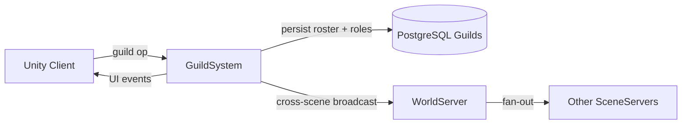

# Guild System

**Short description:** SceneServer social subsystem for guild lifecycle and membership management, handling guild creation, invitations, acceptance/decline, member leave/remove, rank changes, achievement tracking, and periodic cross-server guild membership synchronization with asynchronous database persistence.

## Table of Contents

- [Overview](#overview)
- [Supported Platforms](#supported-platforms)
- [Features](#features)
- [Prerequisites](#prerequisites)
- [Installation / Build](#installation--build)
- [Quick Start Guides](#quick-start-guides)
- [Configuration](#configuration)
- [Usage Examples](#usage-examples)
- [Operational Checks](#operational-checks)
- [Flow Diagram](#flow-diagram)
- [Project Structure](#project-structure)
- [License](#license)

## Overview

The Guild system is the SceneServer social subsystem for guild lifecycle and membership management. It handles guild creation, invitations, invite acceptance/decline, member leave/remove flows, rank changes, and periodic guild membership synchronization across servers.

The subsystem uses a split execution model:
- **Main thread:** validation, in-memory controller state changes, tracker updates, achievement increments, and network broadcasts.
- **Async worker:** database reads/writes and cross-server guild update markers via `TryEnqueueAsyncWork`.
- **Main-thread queue:** marshaling async completion actions back to Unity/FishNet-safe execution via `IGuildSystemMainThreadQueueData`.

All mutating guild flows trigger guild-update persistence so other servers can reconcile member lists. Pending invitations are stored in a `LastSeenCacheTracker` with configurable TTL and bounded periodic sweeps. Per-connection ingress guards use debounce + in-flight semantics keyed by connection and operation type, with guard release deferred until async completion on async-backed handlers (`Create`, `Invite`, `AcceptInvite`, `Leave`, `Remove`, `ChangeRank`).

## Supported Platforms

| Platform | Supported | Notes |
|---|---|---|
| Windows | Yes | |
| Linux | Yes | |
| WebGL | N/A | Server-only module |
| Unity 6.3 LTS | Yes | Required engine version |
| IL2CPP | Yes | Supported scripting backend |

## Features

- Guild creation with name validation (`Authentication.IsAllowedGuildName`), uniqueness checks, and async database persistence
- Guild invitation flow: leader/officer sends invite, target receives pending invite tracked with TTL-based expiration
- Invite acceptance with guild capacity verification, membership persistence, and guild-update marker propagation
- Invite decline clears the pending invitation immediately
- Guild leave with automatic leadership transfer (random officer, then random member) or guild deletion when no members remain
- Guild member removal by officers/leaders with rank-based permission checks (cannot remove equal or higher rank)
- Guild rank changes (leader-only, assignable range: Member or Officer)
- Periodic guild update synchronization pump: fetches update rows from database, computes removed members, broadcasts leave/add to local members
- Per-guild online character tracking (`GuildCharacterTracker`) and cached member tracking (`GuildMemberTracker`) with automatic cleanup when no local members remain
- Chat command integration (`/gi`, `/ginvite`) for in-game guild invitations by character name
- Achievement integration for guild creation (`GuildCreateAchievementTemplate`) and guild joining (`GuildJoinAchievementTemplate`)
- Per-connection ingress debounce and in-flight guards to prevent overlapping requests
- Bounded TTL sweep for pending invitation expiration
- Bounded periodic sweep for stale ingress guard entries
- Async DB tasks queued through `TryEnqueueAsyncWork` with backpressure (rejects when queue unavailable/full, logs warning)
- Entity-keyed ordering for per-character/per-guild sequencing on async work
- Optimistic concurrency via version-based sequencing on guild member persistence
- Character connect/disconnect hooks that persist guild member location ("Offline" on disconnect) and trigger guild-update markers
- Graceful failure semantics: invalid requests ignored safely, permission/rank/capacity checks fail closed, async failures logged without blocking main thread, main-thread completion paths revalidate connection/object/controller state

## Prerequisites

- **Unity 6.3 LTS**
- **FishNetworking** — networking framework
- **FishMMO Server Core** — provides `ServerBehaviour`, `IGuildSystem`, `IGuildSystemRuntimeData`, `IGuildSystemMainThreadQueueData`, `IGuildCharacterMappingData`, broadcast types (`GuildCreateBroadcast`, `GuildInviteBroadcast`, `GuildAcceptInviteBroadcast`, `GuildDeclineInviteBroadcast`, `GuildLeaveBroadcast`, `GuildRemoveBroadcast`, `GuildChangeRankBroadcast`, `GuildAddBroadcast`, `GuildAddMultipleBroadcast`, `GuildResultBroadcast`), `AsyncWorkerData`, `IngressGuard`, `MainThreadQueueHelper`, and `ChatHelper`
- **FishMMO Database** — provides `IGuildService`, `ICharacterGuildService`, `IGuildUpdateService`, and `DatabaseResult<T>`

## Installation / Build

This is an integrated module within FishMMO. It is included as part of the server-side scene-server implementation and does not require separate installation. Ensure the FishMMO Server Core and its dependencies are properly configured in your Unity project.

## Quick Start Guides

1. Ensure `GuildSystem` is present on the scene server GameObject (it inherits from `ServerBehaviour` and implements `IGuildSystem<NetworkConnection>`). The ScriptableObject is created via `Create > FishMMO > Server > SceneServer > Guild System`.
2. Verify that the following data containers are registered in `DataContainerRegistry`:
   - `GuildSystemRuntimeData` → `IGuildSystemRuntimeData`
   - `GuildCharacterMappingData` → `IGuildCharacterMappingData`
   - `GuildSystemMainThreadQueueData` → `IGuildSystemMainThreadQueueData`
   - `AsyncWorkerData` (shared async work queue)
3. On initialize, `GuildSystem` validates all data containers, registers chat commands (`/gi`, `/ginvite`), registers broadcast handlers, subscribes to character connect/disconnect hooks, and registers the periodic guild update callback.
4. On deinitialize, it drains the remaining main-thread queue, unregisters broadcast handlers, unsubscribes character hooks, and unregisters the periodic callback.
5. Clients send guild broadcasts (`GuildCreateBroadcast`, `GuildInviteBroadcast`, etc.); the server validates, performs async DB work, and replies with result broadcasts. Other servers pick up changes via the periodic guild update synchronization pump.

## Configuration

### Inspector Parameters

| Parameter | Type | Default | Description |
|---|---|---|---|
| `maxMainThreadActionsPerFrame` | int | 100 | Max guild-system actions drained from main-thread queue per frame |
| `maxGuildSize` | int | 100 | Maximum number of members allowed per guild |
| `updatePumpRate` | float | 1.0 | Periodic guild update polling interval in seconds |
| `invitationTtlSeconds` | float | 45.0 | Invitation lifetime in seconds before automatic expiration |
| `invitationSweepIntervalSeconds` | float | 1.0 | Seconds between bounded invitation cleanup sweeps |
| `invitationSweepMaxScan` | int | 128 | Maximum invitation entries scanned per cleanup sweep |
| `invitationSweepMaxRemove` | int | 128 | Maximum invitation entries removed per cleanup sweep |
| `ingressDebounceMilliseconds` | int | 100 | Minimum milliseconds between guild requests per connection and operation |
| `ingressSweepIntervalSeconds` | float | 5.0 | Seconds between bounded ingress guard cleanup sweeps |
| `ingressEntryTtlSeconds` | float | 30.0 | Seconds before stale ingress guard entries are removed |
| `ingressSweepMaxRemovals` | int | 128 | Maximum stale ingress guard entries removed per sweep |
| `GuildCreateAchievementTemplate` | AchievementTemplate | — | Achievement to increment when a player creates a guild |
| `GuildJoinAchievementTemplate` | AchievementTemplate | — | Achievement to increment when a player joins a guild |

### Ingress Operations

| Operation | Key | Guard Behavior |
|---|---|---|
| Create | 1 | Debounce + in-flight, deferred release on async completion |
| Invite | 2 | Debounce + in-flight, deferred release on async completion |
| AcceptInvite | 3 | Debounce + in-flight, deferred release on async completion |
| DeclineInvite | 4 | Debounce only, immediate release |
| Leave | 5 | Debounce + in-flight, deferred release on async completion |
| Remove | 6 | Debounce + in-flight, deferred release on async completion |
| ChangeRank | 7 | Debounce + in-flight, deferred release on async completion |

### Threading Model

| Thread | Work |
|---|---|
| Main thread | Request validation, ingress guard checks, in-memory controller state changes, tracker updates, achievement increments, network broadcasts, queue drain, invitation sweep, ingress sweep |
| Async worker | Database reads/writes (`CreateGuildAsync`, `InviteToGuildAsync`, `AcceptGuildInviteAsync`, `LeaveGuildAsync`, `RemoveGuildMemberAsync`, `ChangeGuildRankAsync`, `PersistGuildMemberAsync`, `FetchAndProcessGuildUpdatesAsync`) |

## Usage Examples

### Chat Commands

| Command | Handler | Purpose |
|---|---|---|
| `/gi <name>` | `OnGuildInvite` | Invite a character by name to the sender's guild |
| `/ginvite <name>` | `OnGuildInvite` | Alias for `/gi` |

### Broadcast Handlers

`GuildSystem` registers the following server-side broadcast handlers on initialize:

| Broadcast | Handler | Purpose |
|---|---|---|
| `GuildCreateBroadcast` | `OnServerGuildCreateBroadcastReceived` | Create a new guild |
| `GuildInviteBroadcast` | `OnServerGuildInviteBroadcastReceived` | Invite a character to a guild |
| `GuildAcceptInviteBroadcast` | `OnServerGuildAcceptInviteBroadcastReceived` | Accept a pending guild invitation |
| `GuildDeclineInviteBroadcast` | `OnServerGuildDeclineInviteBroadcastReceived` | Decline a pending guild invitation |
| `GuildLeaveBroadcast` | `OnServerGuildLeaveBroadcastReceived` | Leave current guild |
| `GuildRemoveBroadcast` | `OnServerGuildRemoveBroadcastReceived` | Remove a member from a guild |
| `GuildChangeRankBroadcast` | `OnServerGuildChangeRankBroadcastReceived` | Change a guild member's rank |

### Create Guild Path

`OnServerGuildCreateBroadcastReceived(conn, msg, channel)`:

1. Validates connection and spawned player object.
2. Acquires ingress guard (Create).
3. Validates character is not already in a guild; sends `GuildResultType.AlreadyInGuild` if so.
4. Trims and validates guild name via `Authentication.IsAllowedGuildName`; sends `GuildResultType.InvalidGuildName` if invalid.
5. Enqueues async work: `CreateGuildAsync`.
   - Checks guild name uniqueness via `IGuildService.ExistsAsync`; sends `GuildResultType.NameAlreadyExists` if taken.
   - Creates guild via `IGuildService.PersistAsync` (returns new guild ID).
   - Persists creator as leader via `ICharacterGuildService.PersistAsync`.
   - Marshals to main thread: sets controller ID/Rank, adds tracker, broadcasts `GuildAddBroadcast`, increments `GuildCreateAchievementTemplate`.

### Invite / Accept / Decline Path

**Invite:** `OnServerGuildInviteBroadcastReceived(conn, msg, channel)`:

1. Validates inviter is leader or officer, not self-inviting.
2. Enqueues async work: `InviteToGuildAsync`.
   - Checks guild capacity via `ICharacterGuildService.CountAsync`.
   - Marshals to main thread: adds pending invitation (`TryAddPendingInvitation`), validates target not in a guild, sends `GuildInviteBroadcast` to target.

**Accept:** `OnServerGuildAcceptInviteBroadcastReceived(conn, msg, channel)`:

1. Validates character not already in a guild.
2. Validates pending invitation exists via `TryGetPendingInvitation`.
3. Enqueues async work: `AcceptGuildInviteAsync`.
   - Re-checks guild capacity.
   - Persists membership as `GuildRank.Member`.
   - Triggers guild-update marker via `IGuildUpdateService.PersistAsync`.
   - Marshals to main thread: sets controller, removes pending invitation, adds tracker, broadcasts `GuildAddBroadcast`, increments `GuildJoinAchievementTemplate`.

**Decline:** `OnServerGuildDeclineInviteBroadcastReceived(conn, msg, channel)`:

1. Validates connection and character; removes pending invitation immediately.

### Leave / Remove / Rank Change Path

**Leave:** `OnServerGuildLeaveBroadcastReceived(conn, msg, channel)`:

1. Validates character is in a guild.
2. Enqueues async work: `LeaveGuildAsync`.
   - Fetches current members for leadership transfer.
   - If leader and remaining members exist: transfers leadership to a random officer (or random member if no officers).
   - Deletes leaving member via `ICharacterGuildService.DeleteAsync`.
   - If no remaining members: deletes guild (`IGuildService.DeleteAsync`) and update marker.
   - Otherwise: triggers guild-update marker.
   - Marshals to main thread: resets controller, removes tracker, broadcasts `GuildLeaveBroadcast`.

**Remove:** `OnServerGuildRemoveBroadcastReceived(conn, msg, channel)`:

1. Validates requester is officer or leader, target is not self.
2. Enqueues async work: `RemoveGuildMemberAsync`.
   - Fetches target member, verifies same guild.
   - Rank permission check: cannot remove equal or higher rank.
   - Deletes target member.
   - Triggers guild-update marker.
   - Marshals to main thread: removes tracker for removed member.

**Rank Change:** `OnServerGuildChangeRankBroadcastReceived(conn, msg, channel)`:

1. Validates requester is leader, target is not self.
2. Validates new rank is within assignable range (Member or Officer).
3. Enqueues async work: `ChangeGuildRankAsync`.
   - Fetches member version for optimistic concurrency.
   - Updates rank via `ICharacterGuildService.UpdateRankAsync`.
   - Triggers guild-update marker on success.

### Periodic Synchronization Pump

`OnPeriodicUpdate(deltaTime)`:

1. Guards against re-entrance via `TryBeginUpdatePump`.
2. Snapshots tracked guild IDs and last fetch time on main thread.
3. Enqueues async work: `FetchAndProcessGuildUpdatesAsync`.
   - Fetches guild update rows since `lastFetch` via `IGuildUpdateService.FetchAsync`.
   - For each updated guild, fetches current member rows via `ICharacterGuildService.FetchManyAsync`.
   - Marshals to main thread:
     - Updates `LastFetchTime` to `DateTime.UtcNow`.
     - Computes removed members (in previous cache but not in current) and sends `GuildLeaveBroadcast` where applicable.
     - Refreshes `GuildMemberTracker` cache.
     - Broadcasts `GuildAddMultipleBroadcast` (full member snapshots) to all local online guild members.
     - Updates server-side `IGuildController.Rank` for each member with latest DB value.

### Failure Semantics

- Null/invalid requests return early (silent no-op).
- Permission/rank/guild-capacity checks fail closed.
- Async failures are logged and do not block main thread.
- Main-thread completion paths revalidate connection/object/controller state before mutating or broadcasting.
- `TryEnqueueAsyncWork` returns `false` when the queue is unavailable or full; a warning is logged.

## Operational Checks

| Check | How to Verify |
|---|---|
| Initialization success | Confirm `GuildSystem` logs "Initialized (MaxGuildSize=100, UpdatePumpRate=1s)" without errors on server startup |
| Data containers available | Verify `IGuildSystemRuntimeData`, `IGuildCharacterMappingData`, and `IGuildSystemMainThreadQueueData` all resolve from `DataContainerRegistry` |
| Guild creation | Send `GuildCreateBroadcast` with a valid name; confirm `GuildAddBroadcast` reply with leader rank and new guild ID |
| Duplicate guild name | Send `GuildCreateBroadcast` with an existing name; confirm `GuildResultType.NameAlreadyExists` response |
| Invalid guild name | Send `GuildCreateBroadcast` with whitespace or forbidden characters; confirm `GuildResultType.InvalidGuildName` response |
| Already in guild | Send `GuildCreateBroadcast` while already in a guild; confirm `GuildResultType.AlreadyInGuild` response |
| Guild invite (chat) | Type `/gi <name>` or `/ginvite <name>` in chat; confirm `GuildInviteBroadcast` sent to target |
| Guild invite (broadcast) | Send `GuildInviteBroadcast` as leader/officer; confirm target receives the invitation |
| Invite capacity check | Fill guild to `maxGuildSize`; confirm subsequent invites are silently rejected |
| Accept invite | Send `GuildAcceptInviteBroadcast` after receiving an invite; confirm `GuildAddBroadcast` reply with member rank |
| Decline invite | Send `GuildDeclineInviteBroadcast`; confirm pending invitation is removed |
| Invitation TTL expiry | Wait past `invitationTtlSeconds` without accepting; confirm invitation is swept and accept fails |
| Guild leave (member) | Send `GuildLeaveBroadcast` as member; confirm `GuildLeaveBroadcast` reply and controller reset |
| Guild leave (leader transfer) | Send `GuildLeaveBroadcast` as leader with remaining members; confirm leadership transferred to random officer or member |
| Guild leave (last member) | Send `GuildLeaveBroadcast` as sole member; confirm guild is deleted |
| Guild remove | Send `GuildRemoveBroadcast` as officer/leader targeting a lower-rank member; confirm member is removed and guild-update marker triggered |
| Remove rank constraint | Send `GuildRemoveBroadcast` targeting an equal or higher rank; confirm request is silently rejected |
| Rank change | Send `GuildChangeRankBroadcast` as leader; confirm target rank updated and guild-update marker triggered |
| Rank change self-protection | Send `GuildChangeRankBroadcast` targeting self; confirm request is silently rejected |
| Periodic sync pump | Confirm guild updates are fetched at `updatePumpRate` interval and local members receive `GuildAddMultipleBroadcast` |
| Removed member sync | Remove a member on another server; confirm sync pump detects removal and sends `GuildLeaveBroadcast` to the removed member locally |
| Ingress debounce | Send rapid consecutive guild requests from the same connection; confirm excess requests are dropped |
| Ingress in-flight guard | Send overlapping async-backed guild requests; confirm only the first is processed |
| Character connect hook | Connect a character in a guild; confirm tracker is updated and guild member location persisted |
| Character disconnect hook | Disconnect a character in a guild; confirm tracker is removed and "Offline" location persisted |
| Tracker cleanup | Disconnect all local members of a guild; confirm both `GuildCharacterTracker` and `GuildMemberTracker` entries are removed |
| Achievement: create | Create a guild with `GuildCreateAchievementTemplate` assigned; confirm achievement is incremented |
| Achievement: join | Accept a guild invite with `GuildJoinAchievementTemplate` assigned; confirm achievement is incremented |
| Main-thread queue drain | Confirm queued async results are dispatched on the main thread within `maxMainThreadActionsPerFrame` per frame |
| Deinitialize cleanup | Trigger deinitialize; confirm broadcast handlers are unregistered, character hooks unsubscribed, periodic callback unregistered, and main-thread queue is drained |

## Flow Diagram

### High-Level Overview



### Guild Creation

```
OnServerGuildCreateBroadcastReceived(conn, msg, channel)
│
├─ 1. Validate connection + spawned object
├─ 2. Acquire ingress guard (Create)
├─ 3. Validate not already in a guild
│     └── Fail → GuildResultBroadcast(AlreadyInGuild)
├─ 4. Trim + validate guild name
│     └── Fail → GuildResultBroadcast(InvalidGuildName)
└─ 5. TryEnqueueIngressWork → CreateGuildAsync
       │
       ├─ Async: Check name uniqueness (IGuildService.ExistsAsync)
       │  └── Exists → TryEnqueueMainThread → GuildResultBroadcast(NameAlreadyExists)
       ├─ Async: Create guild (IGuildService.PersistAsync → new guild ID)
       ├─ Async: Persist creator as leader (ICharacterGuildService.PersistAsync)
       └─ TryEnqueueMainThread
          ├── Set controller ID + Rank (Leader)
          ├── AddGuildCharacterTracker
          ├── Broadcast GuildAddBroadcast
          └── Increment GuildCreateAchievementTemplate
```

### Guild Invite → Accept / Decline

```
OnServerGuildInviteBroadcastReceived(conn, msg, channel)
│
├─ 1. Validate connection + spawned object
├─ 2. Acquire ingress guard (Invite)
├─ 3. Validate inviter is leader or officer, not self-targeting
└─ 4. TryEnqueueIngressWork → InviteToGuildAsync
       │
       ├─ Async: Check guild capacity (ICharacterGuildService.CountAsync)
       │  └── Full → abort
       └─ TryEnqueueMainThread
          ├── TryAddPendingInvitation(targetCharacterID, guildID)
          ├── Validate target is not already in a guild
          │   └── In guild → send error chat, RemovePendingInvitation
          └── Broadcast GuildInviteBroadcast to target

OnServerGuildAcceptInviteBroadcastReceived(conn, msg, channel)
│
├─ 1. Validate connection + not in a guild
├─ 2. Acquire ingress guard (AcceptInvite)
├─ 3. TryGetPendingInvitation → pendingGuildID
└─ 4. TryEnqueueIngressWork → AcceptGuildInviteAsync
       │
       ├─ Async: Re-check guild capacity
       ├─ Async: Persist membership as Member
       ├─ Async: Trigger guild-update marker
       └─ TryEnqueueMainThread
          ├── Set controller ID + Rank (Member)
          ├── RemovePendingInvitation
          ├── AddGuildCharacterTracker
          ├── Broadcast GuildAddBroadcast
          └── Increment GuildJoinAchievementTemplate

OnServerGuildDeclineInviteBroadcastReceived(conn, msg, channel)
│
├─ 1. Validate connection
├─ 2. Acquire ingress guard (DeclineInvite)
└─ 3. RemovePendingInvitation(character.ID)
```

### Guild Leave

```
OnServerGuildLeaveBroadcastReceived(conn, msg, channel)
│
├─ 1. Validate connection + in a guild
├─ 2. Acquire ingress guard (Leave)
└─ 3. TryEnqueueIngressWork → LeaveGuildAsync
       │
       ├─ Async: Fetch current members (ICharacterGuildService.FetchManyAsync)
       ├─ If leader + remaining members:
       │  ├── Collect officers and remaining members
       │  ├── Pick random officer (or random member) as new leader
       │  └── UpdateRankAsync(newLeader, Leader)
       ├─ Async: Delete leaving member (ICharacterGuildService.DeleteAsync)
       ├─ If no remaining members:
       │  ├── Delete guild (IGuildService.DeleteAsync)
       │  └── Delete update marker (IGuildUpdateService.DeleteAsync)
       ├─ Else: Trigger guild-update marker
       └─ TryEnqueueMainThread
          ├── Reset controller ID=0, Rank=None
          ├── RemoveGuildCharacterTracker
          └── Broadcast GuildLeaveBroadcast
```

### Guild Remove / Rank Change

```
OnServerGuildRemoveBroadcastReceived(conn, msg, channel)
│
├─ 1. Validate requester is officer/leader, target is not self
├─ 2. Acquire ingress guard (Remove)
└─ 3. TryEnqueueIngressWork → RemoveGuildMemberAsync
       │
       ├─ Async: Fetch target member (ICharacterGuildService.FetchAsync)
       ├─ Verify same guild + rank permission (cannot remove equal/higher)
       ├─ Async: Delete member (ICharacterGuildService.DeleteAsync)
       ├─ Async: Trigger guild-update marker
       └─ TryEnqueueMainThread
          └── RemoveGuildCharacterTracker(guildID, memberID)

OnServerGuildChangeRankBroadcastReceived(conn, msg, channel)
│
├─ 1. Validate requester is leader, target is not self
├─ 2. Validate new rank in range [Member, Officer]
├─ 3. Acquire ingress guard (ChangeRank)
└─ 4. TryEnqueueIngressWork → ChangeGuildRankAsync
       │
       ├─ Async: Fetch member version (optimistic concurrency)
       ├─ Async: UpdateRankAsync(memberID, guildID, newRank)
       └─ On success: Trigger guild-update marker
```

### Periodic Synchronization Pump

```
OnPeriodicUpdate(deltaTime)
│
├─ 1. Check Initialized + ServerState == Started
├─ 2. TryBeginUpdatePump (re-entrance guard)
├─ 3. Snapshot GuildCharacterTracker keys + LastFetchTime on main thread
├─ 4. TryEnqueueAsyncWork → FetchAndProcessGuildUpdatesAsync
│     │
│     ├─ Async: Fetch guild update rows since lastFetch (IGuildUpdateService.FetchAsync)
│     ├─ For each updated guild: fetch current members (ICharacterGuildService.FetchManyAsync)
│     └─ TryEnqueueMainThread
│        ├── Update LastFetchTime = DateTime.UtcNow
│        ├── For each guild:
│        │   ├── Compute removed members (previous cache − current DB members)
│        │   ├── For removed local members: reset controller, broadcast GuildLeaveBroadcast
│        │   ├── Refresh GuildMemberTracker cache
│        │   ├── Build GuildAddMultipleBroadcast from current members
│        │   └── Broadcast to all local online guild members + update controller ranks
│        └── EndUpdatePump (finally)
│
└─ On failure / empty: EndUpdatePump

OnUpdate(deltaTime)
│
├─ 1. DrainMainThreadQueue (up to maxMainThreadActionsPerFrame)
├─ 2. SweepPendingInvitations (bounded TTL sweep)
└─ 3. SweepIngressGuards (bounded TTL sweep)
```

### Character Connect / Disconnect

```
CharacterSystem_OnConnect(conn, character)
│
├─ 1. Validate character has IGuildController with ID > 0
├─ 2. AddGuildCharacterTracker(guildID, characterID)
└─ 3. TryEnqueueAsyncWork → PersistGuildMemberAsync(characterID, guildID, rank, sceneName)
       ├─ Fetch existing version (optimistic concurrency)
       ├─ Persist member data
       └─ Trigger guild-update marker

CharacterSystem_OnDisconnect(conn, character)
│
├─ 1. RemovePendingInvitation(character.ID)
├─ 2. Validate character has IGuildController with ID > 0
├─ 3. RemoveGuildCharacterTracker(guildID, characterID)
└─ 4. TryEnqueueAsyncWork → PersistGuildMemberAsync(characterID, guildID, rank, "Offline")
       ├─ Fetch existing version (optimistic concurrency)
       ├─ Persist member data with "Offline" location
       └─ Trigger guild-update marker
```

## Project Structure

### Directory Structure

```
Guild/
├── GuildSystem.cs                     # Core guild orchestration, handlers, async persistence, and sync pump
├── GuildSystemRuntimeData.cs          # Pending invitation map, last guild-update fetch timestamp, ingress guard
├── GuildSystemMainThreadQueueData.cs  # Per-system main-thread action queue container
├── GuildCharacterMappingData.cs       # Guild-to-membership tracking for online/local and known members
└── README.md                          # System documentation
```

### Related Core Contracts

- `Server/Core/World/SceneServer/Guild/IGuildSystem.cs`
- `Server/Core/World/SceneServer/Guild/IGuildSystemRuntimeData.cs`
- `Server/Core/World/SceneServer/Guild/IGuildSystemMainThreadQueueData.cs`
- `Server/Core/World/SceneServer/Guild/IGuildCharacterMappingData.cs`

### Inheritance Hierarchy

```
ServerBehaviour
└── GuildSystem : IGuildSystem<NetworkConnection>

RuntimeDataContainer
├── GuildSystemRuntimeData : IGuildSystemRuntimeData
└── GuildCharacterMappingData : IGuildCharacterMappingData

SystemMainThreadQueueData
└── GuildSystemMainThreadQueueData : IGuildSystemMainThreadQueueData
```

## License

This project is subject to the FishMMO project license.
