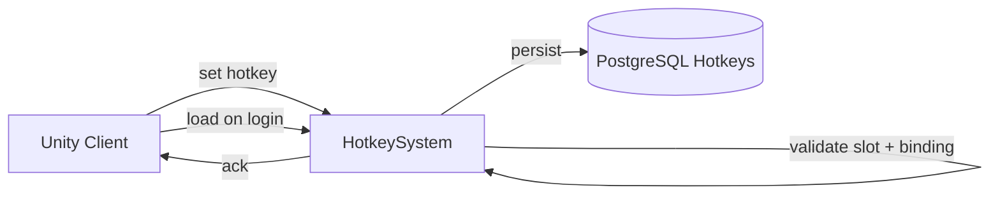

# Hotkey System

**Short description:** Server-side authority for player hotkey bindings on the SceneServer, handling single and batch set requests with slot validation, ingress debounce protection, in-memory runtime mutation, an authoritative echo of every request, and claim-gated persistence.

## Table of Contents

- [Overview](#overview)
- [Persistence](#persistence)
- [Supported Platforms](#supported-platforms)
- [Features](#features)
- [Prerequisites](#prerequisites)
- [Installation / Build](#installation--build)
- [Quick Start Guides](#quick-start-guides)
- [Configuration](#configuration)
- [Usage Examples](#usage-examples)
- [Operational Checks](#operational-checks)
- [Flow Diagram](#flow-diagram)
- [Project Structure](#project-structure)
- [License](#license)

## Overview

The Hotkey system is the SceneServer authority for player hotkey bindings. It receives single and batch hotkey set requests from clients, validates slot boundaries, initializes per-character hotkey storage when needed, and applies updates to the character runtime state.

This subsystem is intentionally lightweight:
- Main-thread request validation and in-memory mutation, answered with the server's authoritative slot values.
- A resident's changed bar is staged and written by a periodic pump; a departing character's bar is written by the character system's own save-and-release. See [Persistence](#persistence).

The source of truth for active hotkey bindings is the runtime list on `IPlayerCharacter.Hotkeys`; the `character_hotkeys` rows are loaded into it at login.

## Persistence

Every change stages the character's whole bar (`IHotkeySystemRuntimeData.StageHotkeyWrite`), newest-only per character. Two writers take it from there, and every write is **ownership-gated**: it quotes the session claim the character is held under and lands only while that claim is still held (`ICharacterHotkeyService.PersistOwnedAsync`, `CharacterWriteGate`).

- **The pump** (`persistFlushIntervalSeconds`, default 5 s) drains the stage and writes each bar under the claim held for its character *at the drain*, captured on the main thread from `SessionTokens` and carried with the write. A staged bar whose character holds no claim here is dropped: the character has left (its departure wrote the live bar) or was evicted (its bar is not ours to write). A bar that did not land complete is re-staged from the live bar at the next pass — unless the gate refused it (`HotkeySystem.RestagesAfter`), which no retry can change.
- **The departure.** `CharacterSystem` writes a departing character's whole live bar inside the save-and-release, before the release (`IHotkeySystemRuntimeData.TakeDepartingBar`, via `AppendDepartureSubEntities`): logout, transfer, the end of a combat-logout linger, a linger reclaimed, and the shutdown flush. It used to be flushed from `OnDisconnect` as a write of its own, which only the ordered lane kept ahead of the release, and from this system's teardown — which runs *before* the character system's shutdown flush releases every claim. Gated, a bar that lands after its release is refused and lost, not merely late, so neither happens any more.

Rows are versioned by `NextHotkeyVersion` (UTC ticks, monotonic). Every slot is written, empty ones included, because the upsert has no delete path. A stored bar newer than the one being written is skipped as superseded rather than failing the batch, which may carry many characters' bars.

## Supported Platforms

| Platform | Supported | Notes |
|---|---|---|
| Windows | Yes | |
| Linux | Yes | |
| WebGL | N/A | Server-only module |
| Unity 6.3 LTS | Yes | Required engine version |
| IL2CPP | Yes | Supported scripting backend |

## Features

- Single hotkey update via `HotkeySetBroadcast` with full connection, character, and slot validation
- Batch hotkey update via `HotkeySetMultipleBroadcast` with per-entry independent validation (invalid entries are skipped; valid entries still apply)
- Automatic per-character hotkey list initialization seeded with `Constants.Configuration.MaximumPlayerHotkeys` entries
- Multiple hotkey bars without a bar anywhere on the server: `MaximumPlayerHotkeys` is `HotkeyBarCount * HotkeySlotsPerBar` (both game settings in `Constants.Configuration`), and a slot index is `bar * HotkeySlotsPerBar + position`. The server, the wire and the `character_hotkeys` rows all work in that flat index; only the client draws bars. Raising `HotkeyBarCount` is safe on a live game (new bars are appended); changing `HotkeySlotsPerBar` re-deals stored bindings and is not.
- Slot range validation (`0 <= slot < hotkeyCount`) and hotkey type enum range validation (`0..MaxHotkeyType`)
- `ReferenceID` lower-bound validation (rejects values below `-1`) and ownership validation of the item, equipment slot or ability a binding names (`IsHotkeyReferenceValid`)
- Ingress debounce protection per connection per operation type via `IngressGuard`
- Configurable debounce window, bulk update cap, sweep interval, entry TTL, and sweep removal limit
- Bounded periodic cleanup of stale ingress guard entries via `OnUpdate` sweep
- Graceful failure semantics: an invalid single request changes nothing; invalid batch entries are skipped while valid ones apply
- Every request is answered, accepted or refused (validation, `CanAct`, debounce), with the server's authoritative value: `HotkeySetBroadcast` for the one slot, `HotkeySetMultipleBroadcast` for the whole bar. The client applies a binding locally the moment the icon is dropped, so a refusal answered in silence would leave it showing a binding the server never took until the next login
- Login-time prune (`ICharacterSystem.OnConnect`, before the bar is sent): bindings whose item or ability no longer exists are cleared and the bar is staged; any bar still staged from an earlier session is dropped first
- `ForgetAbilityBindings` clears every binding of a forgotten ability (matched on type and id), stages the bar and echoes it

## Prerequisites

- **Unity 6.3 LTS**
- **FishNetworking** — networking framework
- **FishMMO Server Core** — provides `ServerBehaviour`, `IHotkeySystem`, `IngressGuard`, broadcast types, and `IHotkeySystemRuntimeData`

## Installation / Build

This is an integrated module within FishMMO. It is included as part of the server-side scene-server implementation and does not require separate installation. Ensure the FishMMO Server Core and its dependencies are properly configured in your Unity project.

## Quick Start Guides

1. Ensure `HotkeySystem` is present on the scene server GameObject (it inherits from `ServerBehaviour` and implements `IHotkeySystem`).
2. Verify that `HotkeySystemRuntimeData` is registered as the `IHotkeySystemRuntimeData` data container (declared via `[RequiresDataContainer(typeof(HotkeySystemRuntimeData))]`).
3. On initialize, `HotkeySystem` registers broadcast handlers for `HotkeySetBroadcast` and `HotkeySetMultipleBroadcast`, subscribes `ICharacterSystem.OnConnect` for the login-time prune, and registers the persistence pump (`persistFlushIntervalSeconds`).
4. On deinitialize, it unregisters the broadcast handlers, the `OnConnect` subscription and the pump, and clears the ingress guard state. It writes nothing: the character system's shutdown flush writes every resident's live bar under its claim, before the release.
5. Clients send `HotkeySetBroadcast` for single updates or `HotkeySetMultipleBroadcast` for batch updates; the server validates and applies them to the character's runtime hotkey list.

## Configuration

### Inspector Parameters

| Parameter | Type | Default | Description |
|---|---|---|---|
| `ingressDebounceMilliseconds` | int | 75 | Minimum milliseconds between hotkey requests per connection |
| `maxBulkHotkeyUpdates` | int | 64 | Maximum hotkey updates accepted in one bulk request |
| `ingressSweepIntervalSeconds` | float | 5.0 | Seconds between bounded ingress guard cleanup sweeps |
| `ingressEntryTtlSeconds` | float | 30.0 | Seconds before stale ingress guard entries are removed |
| `ingressSweepMaxRemovals` | int | 128 | Maximum stale ingress guard entries removed per sweep |
| `persistFlushIntervalSeconds` | float | 5.0 | Seconds between runs of the persistence pump that writes staged bars (min 1.0) |

### Validation Constants

| Constant | Value | Description |
|---|---|---|
| `MaxHotkeyType` | 4 | Highest valid `ReferenceButtonType` enum byte value |

### Threading Model

| Thread | Work |
|---|---|
| Main thread | Request validation, ingress guard checks, hotkey list mutation, echo, staging, the pump's drain and claim capture, login prune, sweep cleanup |
| Async worker | Ownership-gated bar writes (`PersistHotkeysAsync` → `ICharacterHotkeyService.PersistOwnedAsync`), keyed by character |

## Usage Examples

### Broadcast Handlers

`HotkeySystem` registers the following server-side broadcast handlers on initialize:

| Broadcast | Handler | Purpose |
|---|---|---|
| `HotkeySetBroadcast` | `OnServerHotkeySetBroadcastReceived` | Single hotkey slot update |
| `HotkeySetMultipleBroadcast` | `OnServerHotkeySetMultipleBroadcastReceived` | Batch hotkey slot update |

### Single Update Path

`OnServerHotkeySetBroadcastReceived(conn, msg, channel)`:

1. Resolves the requesting character (`TryBeginPlayerRequest` with `PlayerRequestGate.SkipCanAct`).
2. Checks `CharacterStateValidation.CanAct` here, so a refusal can be answered: refused → echoes the slot.
3. Acquires ingress debounce guard (`SetSingle` operation); refused → echoes the slot.
4. Calls `TryApplyHotkey(...)` to validate and apply the hotkey data; on success stages the bar for the pump.
5. Echoes the slot's authoritative value (`AcknowledgeHotkey`) whether or not it applied.
6. Releases ingress guard in `finally` block.

### Batch Update Path

`OnServerHotkeySetMultipleBroadcastReceived(conn, msg, channel)`:

1. Resolves the requesting character (`TryBeginPlayerRequest` with `PlayerRequestGate.SkipCanAct`) and validates the batch payload (non-null, at least one entry).
2. Checks `CharacterStateValidation.CanAct`; refused → echoes the whole bar.
3. Acquires ingress debounce guard (`SetMultiple` operation); refused → echoes the whole bar.
4. Clamps iteration count to `maxBulkHotkeyUpdates`.
5. Calls `TryApplyHotkey(...)` independently per entry — one malformed entry does not fail the batch.
6. Stages the bar if any entry applied, then echoes the whole bar once (`AcknowledgeAllHotkeys`).
7. Releases ingress guard in `finally` block.

### Internal Helpers

#### `EnsureHotkeysInitialized(IPlayerCharacter)`

Creates and seeds the character hotkey list with `Constants.Configuration.MaximumPlayerHotkeys` default entries when the list is null.

#### `TryApplyHotkey(IPlayerCharacter, HotkeyData)`

1. Ensures hotkeys are initialized.
2. Validates hotkey type is within defined enum range (`0..MaxHotkeyType`).
3. Validates `ReferenceID >= -1`.
4. Validates slot index is within bounds (`0 <= slot < Hotkeys.Count`).
5. A clear (`Type` 0, or the unset `ReferenceID`) is always accepted and written as the empty binding.
6. Otherwise validates that the character owns what the binding names (`IsHotkeyReferenceValid`, shared with the login prune): an occupied inventory or equipment slot, or a known ability by its instance id; a bank binding is never valid.
7. Creates a normalized `HotkeyData` value and assigns it to the target slot.
8. Returns `true` on success, `false` on any validation failure.

### Failure Semantics

- Invalid single requests change nothing and are answered with the slot's authoritative value (nothing is echoed for a slot index out of range).
- Invalid entries in batch requests are skipped; valid entries still apply; the whole bar is echoed.
- Ingress debounce rejects rapid-fire requests from the same connection per operation type, and the rejection is answered the same way.
- A pump write that did not land complete is re-staged from the live bar at the next pass, unless the ownership gate refused it (`RestagesAfter`).

## Operational Checks

| Check | How to Verify |
|---|---|
| Initialization success | Confirm `HotkeySystem` logs "Initialized" without errors on server startup |
| Runtime data container available | Verify `IHotkeySystemRuntimeData` resolves from `DataContainerRegistry` |
| Single hotkey set | Send `HotkeySetBroadcast` with valid slot/type; confirm `IPlayerCharacter.Hotkeys[slot]` is updated |
| Batch hotkey set | Send `HotkeySetMultipleBroadcast` with mixed valid/invalid entries; confirm valid slots update and invalid entries are skipped |
| Slot boundary rejection | Send a hotkey set with slot index out of range; confirm no mutation occurs and no slot is echoed (there is none to echo) |
| Type range rejection | Send a hotkey set with `Type > MaxHotkeyType`; confirm no mutation occurs and the slot's stored value is echoed back |
| ReferenceID rejection | Send a hotkey set with `ReferenceID < -1`; confirm no mutation occurs |
| Ingress debounce | Send rapid consecutive requests from the same connection; confirm excess requests are refused and answered with the authoritative slot |
| Bulk cap enforcement | Send a batch with more entries than `maxBulkHotkeyUpdates`; confirm only the first N are processed |
| Ingress sweep cleanup | Wait for sweep interval; confirm stale guard entries are removed without errors |
| Deinitialize cleanup | Trigger deinitialize; confirm broadcast handlers are unregistered and ingress guard is cleared |
| Departure writes the bar | Rebind a slot and log out within the pump interval; confirm the new binding is in `character_hotkeys` after the release, written by the save-and-release |
| Claim gate | Stage a bar, release the character's claim before the pump runs; confirm the pump drops the bar (no claim) and a write quoting the released claim is refused as `FORBIDDEN` |

## Flow Diagram

### High-Level Overview



### Single Hotkey Set

```
OnServerHotkeySetBroadcastReceived(conn, msg, channel)
│
├─ 1. TryBeginPlayerRequest (SkipCanAct) → IPlayerCharacter
├─ 2. CanAct → refused: AcknowledgeHotkey(slot)
├─ 3. Acquire ingress guard (SetSingle)
│      └── Debounce window active → AcknowledgeHotkey(slot)
├─ 4. TryApplyHotkey(playerCharacter, msg.HotkeyData)
│      ├── EnsureHotkeysInitialized(playerCharacter)
│      ├── Validate Type <= MaxHotkeyType
│      ├── Validate ReferenceID >= -1
│      ├── Validate 0 <= slot < Hotkeys.Count
│      ├── Clear → empty binding; else IsHotkeyReferenceValid (ownership)
│      └── Assign normalized HotkeyData to slot → StageHotkeyPersist
├─ 5. AcknowledgeHotkey(slot) (applied or not)
└─ 6. Release ingress guard (finally)
```

### Batch Hotkey Set

```
OnServerHotkeySetMultipleBroadcastReceived(conn, msg, channel)
│
├─ 1. TryBeginPlayerRequest (SkipCanAct); batch non-null, count >= 1
├─ 2. CanAct → refused: AcknowledgeAllHotkeys
├─ 3. Acquire ingress guard (SetMultiple)
│      └── Debounce window active → AcknowledgeAllHotkeys
├─ 4. Clamp iteration to min(msg.Hotkeys.Length, maxBulkHotkeyUpdates)
├─ 5. For each entry: TryApplyHotkey(playerCharacter, subMsg.HotkeyData)
│      ├── Validate type, referenceID, slot range and ownership
│      └── Assign normalized HotkeyData to slot (or skip on failure)
├─ 6. Any applied → StageHotkeyPersist; AcknowledgeAllHotkeys (one echo)
└─ 7. Release ingress guard (finally)
```

### Ingress Sweep (OnUpdate)

```
OnUpdate(deltaTime)
│
├─ 1. Resolve IHotkeySystemRuntimeData
└─ 2. IngressGuard.Sweep(sweepInterval, entryTtl, maxRemovals)
       └── Drain stale entries with bounded cleanup
```

## Project Structure

### Directory Structure

```
Hotkey/
├── HotkeySystem.cs              # Network handlers, ingress protection, and hotkey validation/application logic
├── HotkeySystemRuntimeData.cs   # Ingress guard, the per-character write stage, row building (BuildRows, NextHotkeyVersion), TakeDepartingBar
└── README.md
```

### Related Core Contract

- `Server/Core/World/SceneServer/Hotkey/IHotkeySystem.cs`
- `Server/Core/World/SceneServer/Hotkey/IHotkeySystemRuntimeData.cs`

### Inheritance Hierarchy

```
ServerBehaviour
└── HotkeySystem : IHotkeySystem

RuntimeDataContainer
└── HotkeySystemRuntimeData : IHotkeySystemRuntimeData
```

## License

This project is subject to the FishMMO project license.
