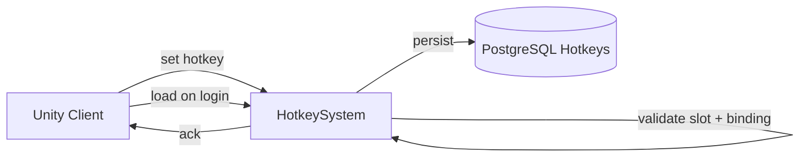

# Hotkey System

**Short description:** Server-side authority for player hotkey bindings on the SceneServer, handling single and batch set requests with slot validation, ingress debounce protection, and in-memory runtime mutation.

## Table of Contents

- [Overview](#overview)
- [Supported Platforms](#supported-platforms)
- [Features](#features)
- [Prerequisites](#prerequisites)
- [Installation / Build](#installation--build)
- [Quick Start Guides](#quick-start-guides)
- [Configuration](#configuration)
- [Usage Examples](#usage-examples)
- [Operational Checks](#operational-checks)
- [Flow Diagram](#flow-diagram)
- [Project Structure](#project-structure)
- [License](#license)

## Overview

The Hotkey system is the SceneServer authority for player hotkey bindings. It receives single and batch hotkey set requests from clients, validates slot boundaries, initializes per-character hotkey storage when needed, and applies updates to the character runtime state.

This subsystem is intentionally lightweight:
- No database persistence.
- No background workers.
- Main-thread request validation and in-memory mutation only.

The source of truth for active hotkey bindings is the runtime list on `IPlayerCharacter.Hotkeys`. Because this system only updates runtime memory, any long-term persistence/reload behavior is handled by separate character save/load systems.

## Supported Platforms

| Platform | Supported | Notes |
|---|---|---|
| Windows | Yes | |
| Linux | Yes | |
| WebGL | N/A | Server-only module |
| Unity 6.3 LTS | Yes | Required engine version |
| IL2CPP | Yes | Supported scripting backend |

## Features

- Single hotkey update via `HotkeySetBroadcast` with full connection, character, and slot validation
- Batch hotkey update via `HotkeySetMultipleBroadcast` with per-entry independent validation (invalid entries are skipped; valid entries still apply)
- Automatic per-character hotkey list initialization seeded with `Constants.Configuration.MaximumPlayerHotkeys` entries
- Slot range validation (`0 <= slot < hotkeyCount`) and hotkey type enum range validation (`0..MaxHotkeyType`)
- `ReferenceID` lower-bound validation (rejects values below `-1`)
- Ingress debounce protection per connection per operation type via `IngressGuard`
- Configurable debounce window, bulk update cap, sweep interval, entry TTL, and sweep removal limit
- Bounded periodic cleanup of stale ingress guard entries via `OnUpdate` sweep
- Graceful failure semantics: invalid single requests are no-ops; invalid batch entries are skipped silently
- No network echo/broadcast emitted during set operations, keeping updates deterministic and cheap

## Prerequisites

- **Unity 6.3 LTS**
- **FishNetworking** — networking framework
- **FishMMO Server Core** — provides `ServerBehaviour`, `IHotkeySystem`, `IngressGuard`, broadcast types, and `IHotkeySystemRuntimeData`

## Installation / Build

This is an integrated module within FishMMO. It is included as part of the server-side scene-server implementation and does not require separate installation. Ensure the FishMMO Server Core and its dependencies are properly configured in your Unity project.

## Quick Start Guides

1. Ensure `HotkeySystem` is present on the scene server GameObject (it inherits from `ServerBehaviour` and implements `IHotkeySystem`).
2. Verify that `HotkeySystemRuntimeData` is registered as the `IHotkeySystemRuntimeData` data container (declared via `[RequiresDataContainer(typeof(HotkeySystemRuntimeData))]`).
3. On initialize, `HotkeySystem` automatically registers broadcast handlers for `HotkeySetBroadcast` and `HotkeySetMultipleBroadcast`.
4. On deinitialize, it unregisters the broadcast handlers and clears the ingress guard state.
5. Clients send `HotkeySetBroadcast` for single updates or `HotkeySetMultipleBroadcast` for batch updates; the server validates and applies them to the character's runtime hotkey list.

## Configuration

### Inspector Parameters

| Parameter | Type | Default | Description |
|---|---|---|---|
| `ingressDebounceMilliseconds` | int | 75 | Minimum milliseconds between hotkey requests per connection |
| `maxBulkHotkeyUpdates` | int | 64 | Maximum hotkey updates accepted in one bulk request |
| `ingressSweepIntervalSeconds` | float | 5.0 | Seconds between bounded ingress guard cleanup sweeps |
| `ingressEntryTtlSeconds` | float | 30.0 | Seconds before stale ingress guard entries are removed |
| `ingressSweepMaxRemovals` | int | 128 | Maximum stale ingress guard entries removed per sweep |

### Validation Constants

| Constant | Value | Description |
|---|---|---|
| `MaxHotkeyType` | 4 | Highest valid `ReferenceButtonType` enum byte value |

### Threading Model

| Thread | Work |
|---|---|
| Main thread | Request validation, ingress guard checks, hotkey list mutation, sweep cleanup |

## Usage Examples

### Broadcast Handlers

`HotkeySystem` registers the following server-side broadcast handlers on initialize:

| Broadcast | Handler | Purpose |
|---|---|---|
| `HotkeySetBroadcast` | `OnServerHotkeySetBroadcastReceived` | Single hotkey slot update |
| `HotkeySetMultipleBroadcast` | `OnServerHotkeySetMultipleBroadcastReceived` | Batch hotkey slot update |

### Single Update Path

`OnServerHotkeySetBroadcastReceived(conn, msg, channel)`:

1. Validates connection and spawned player object.
2. Acquires ingress debounce guard (`SetSingle` operation).
3. Resolves `IPlayerCharacter` component and validates incoming payload.
4. Calls `TryApplyHotkey(...)` to validate and apply the hotkey data.
5. Releases ingress guard in `finally` block.

### Batch Update Path

`OnServerHotkeySetMultipleBroadcastReceived(conn, msg, channel)`:

1. Validates connection and spawned player object.
2. Acquires ingress debounce guard (`SetMultiple` operation).
3. Resolves `IPlayerCharacter` component and validates batch payload (non-null, at least one entry).
4. Clamps iteration count to `maxBulkHotkeyUpdates`.
5. Iterates each entry, skipping null sub-messages.
6. Calls `TryApplyHotkey(...)` independently per entry — one malformed entry does not fail the batch.
7. Releases ingress guard in `finally` block.

### Internal Helpers

#### `EnsureHotkeysInitialized(IPlayerCharacter)`

Creates and seeds the character hotkey list with `Constants.Configuration.MaximumPlayerHotkeys` default entries when the list is null.

#### `TryApplyHotkey(IPlayerCharacter, HotkeyData)`

1. Ensures hotkeys are initialized.
2. Validates hotkey type is within defined enum range (`0..MaxHotkeyType`).
3. Validates `ReferenceID >= -1`.
4. Validates slot index is within bounds (`0 <= slot < Hotkeys.Count`).
5. Creates a normalized `HotkeyData` value and assigns it to the target slot.
6. Returns `true` on success, `false` on any validation failure.

### Failure Semantics

- Invalid single requests are no-ops (silent return).
- Invalid entries in batch requests are skipped; valid entries still apply.
- No network echo/broadcast is emitted by this subsystem during set operations.
- Ingress debounce rejects rapid-fire requests from the same connection per operation type.

## Operational Checks

| Check | How to Verify |
|---|---|
| Initialization success | Confirm `HotkeySystem` logs "Initialized" without errors on server startup |
| Runtime data container available | Verify `IHotkeySystemRuntimeData` resolves from `DataContainerRegistry` |
| Single hotkey set | Send `HotkeySetBroadcast` with valid slot/type; confirm `IPlayerCharacter.Hotkeys[slot]` is updated |
| Batch hotkey set | Send `HotkeySetMultipleBroadcast` with mixed valid/invalid entries; confirm valid slots update and invalid entries are skipped |
| Slot boundary rejection | Send a hotkey set with slot index out of range; confirm no mutation occurs |
| Type range rejection | Send a hotkey set with `Type > MaxHotkeyType`; confirm no mutation occurs |
| ReferenceID rejection | Send a hotkey set with `ReferenceID < -1`; confirm no mutation occurs |
| Ingress debounce | Send rapid consecutive requests from the same connection; confirm excess requests are dropped |
| Bulk cap enforcement | Send a batch with more entries than `maxBulkHotkeyUpdates`; confirm only the first N are processed |
| Ingress sweep cleanup | Wait for sweep interval; confirm stale guard entries are removed without errors |
| Deinitialize cleanup | Trigger deinitialize; confirm broadcast handlers are unregistered and ingress guard is cleared |

## Flow Diagram

### High-Level Overview



### Single Hotkey Set

```
OnServerHotkeySetBroadcastReceived(conn, msg, channel)
│
├─ 1. Validate connection + spawned object
├─ 2. Acquire ingress guard (SetSingle)
│      └── Reject if debounce window active
├─ 3. Resolve IPlayerCharacter component
├─ 4. Validate incoming HotkeyData payload
├─ 5. TryApplyHotkey(playerCharacter, msg.HotkeyData)
│      ├── EnsureHotkeysInitialized(playerCharacter)
│      ├── Validate Type <= MaxHotkeyType
│      ├── Validate ReferenceID >= -1
│      ├── Validate 0 <= slot < Hotkeys.Count
│      └── Assign normalized HotkeyData to slot
└─ 6. Release ingress guard (finally)
```

### Batch Hotkey Set

```
OnServerHotkeySetMultipleBroadcastReceived(conn, msg, channel)
│
├─ 1. Validate connection + spawned object
├─ 2. Acquire ingress guard (SetMultiple)
│      └── Reject if debounce window active
├─ 3. Resolve IPlayerCharacter component
├─ 4. Validate batch payload (non-null, count >= 1)
├─ 5. Clamp iteration to min(msg.Hotkeys.Count, maxBulkHotkeyUpdates)
├─ 6. For each entry:
│      ├── Skip if sub-message HotkeyData is null
│      └── TryApplyHotkey(playerCharacter, subMsg.HotkeyData)
│           ├── Validate type, referenceID, and slot range
│           └── Assign normalized HotkeyData to slot (or skip on failure)
└─ 7. Release ingress guard (finally)
```

### Ingress Sweep (OnUpdate)

```
OnUpdate(deltaTime)
│
├─ 1. Resolve IHotkeySystemRuntimeData
└─ 2. IngressGuard.Sweep(sweepInterval, entryTtl, maxRemovals)
       └── Drain stale entries with bounded cleanup
```

## Project Structure

### Directory Structure

```
Hotkey/
├── HotkeySystem.cs              # Network handlers, ingress protection, and hotkey validation/application logic
├── HotkeySystemRuntimeData.cs   # Runtime data container for ingress guard state
└── README.md
```

### Related Core Contract

- `Server/Core/World/SceneServer/Hotkey/IHotkeySystem.cs`
- `Server/Core/World/SceneServer/Hotkey/IHotkeySystemRuntimeData.cs`

### Inheritance Hierarchy

```
ServerBehaviour
└── HotkeySystem : IHotkeySystem

RuntimeDataContainer
└── HotkeySystemRuntimeData : IHotkeySystemRuntimeData
```

## License

This project is subject to the FishMMO project license.
