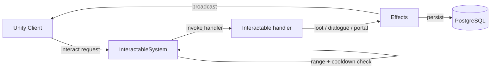

# Interactable System

**Short description:** SceneServer subsystem for validating and dispatching player interactions with world objects, including merchants, ability crafting, dialogue, dungeon finders, mailboxes, containers, and fifteen pluggable handler types discovered and registered via reflection.

## Table of Contents

- [Overview](#overview)
- [Supported Platforms](#supported-platforms)
- [Features](#features)
- [Prerequisites](#prerequisites)
- [Installation / Build](#installation--build)
- [Quick Start Guides](#quick-start-guides)
- [Configuration](#configuration)
- [Usage Examples](#usage-examples)
- [Operational Checks](#operational-checks)
- [Flow Diagram](#flow-diagram)
- [Project Structure](#project-structure)
- [License](#license)

## Overview

The Interactable system is the SceneServer subsystem responsible for validating and processing all player interactions with world interactable objects. It handles generic interaction dispatch, merchant item/ability/event purchases, ability crafting, server-authoritative dialogue sessions, dungeon finder instance assignment, mailbox operations, container item retrieval, and NPC look-at behavior.

The system is built around a plugin architecture: concrete interaction handlers implement `IInteractableHandler` and are decorated with `[HandlesInteractable(typeof(...))]`. At initialization, `InteractableHandlerInitializer` uses reflection-based auto-discovery to find and register all handlers automatically — adding a new interactable type requires only creating a new handler class with the attribute.

The implementation uses a split execution model:
- **Main thread:** request validation, ingress guard checks, handler dispatch, dialogue session management, debounce sweep, and network broadcasts.
- **Async worker:** database reads/writes for inventory persistence, ability persistence, mail operations, dungeon finder scene assignment, and known-ability persistence via `TryEnqueueAsyncWork`.
- **Main-thread queue:** marshaling async completion actions back to Unity/FishNet-safe context via `IInteractableSystemMainThreadQueueData`.

All interaction entry points share a single per-connection `IngressGuard` with a configurable global cooldown, ensuring only one interaction can be in-flight per connection at a time. Stale debounce entries are periodically swept with bounded cleanup.

## Supported Platforms

| Platform | Supported | Notes |
|---|---|---|
| Windows | Yes | |
| Linux | Yes | |
| WebGL | N/A | Server-only module |
| Unity 6.3 LTS | Yes | Required engine version |
| IL2CPP | Yes | Supported scripting backend |

## Features

- Plugin-based handler architecture with reflection auto-discovery via `[HandlesInteractable]` attribute — no initializer modifications needed for new handlers
- Generic interaction dispatch resolving interactable runtime type to registered `IInteractableHandler`
- Strict server-side validation for every interaction: connection, character, scene, scene object, range, and interactable type
- Global per-connection interaction cooldown via shared `IngressGuard` (one interaction at a time per connection)
- Bounded periodic debounce tracker sweep with configurable TTL, interval, and max removals
- Merchant purchases with tab-type dispatch (Item, Ability, AbilityEvent), currency validation, and inventory/ability synchronization
- Ability crafting from base ability plus selected events with duplicate-event rejection, known-event verification, max-learned-ability cap, and currency cost calculation
- Server-authoritative dialogue sessions with ECA condition/action evaluation, choice bitmask tracking, cached per-character choices, and bounded session/cache capacity
- ECA-triggered dialogue sessions (no physical interactable required) via `DisplayDialogueAction` static event
- Dungeon finder with entrance validation, existing-instance lookup, party-member instance conflict checking, async scene enqueue, and main-thread character state marshaling
- Mailbox operations: fetch (async DB read → broadcast mail list), send (input validation, async DB write), and delete (async soft-delete)
- Container item retrieval with slot validation, inventory transfer, and auto-despawn on empty
- NPC look-at behavior via `OnInteractNPC` triggering AI controller idle-state transition
- World item pickup with per-object `ConcurrentDictionary` concurrency guard preventing item duplication exploits
- Gathering node interaction with weighted drop-table rolls, remaining-use tracking, and auto-despawn on depletion
- Capture point interaction with progressive capture state, owner tracking, and state broadcast
- Lore object interaction with idempotent ability/event/item grants
- Shrine interaction with configurable health/mana healing percentages and optional buff application
- Switch interaction with toggle/activate support for doors, chests, traps, and other `ISwitchTarget` objects
- Bindstone interaction setting character respawn position and scene
- Teleporter interaction supporting direct transform teleport or named destination teleport
- Banker interaction opening bank UI with last-interactable tracking
- Achievement integration on all handler types via optional `AchievementTemplate` fields
- Async inventory persistence with fallback direct-persistence path when async worker rejects work
- Known-ability and crafted-ability persistence via async worker with fail-closed semantics on enqueue rejection
- Per-system main-thread queue isolation with configurable drain cap per frame
- Graceful failure semantics: invalid requests fail closed with no mutation; validation enforced before persistence; async failures logged without blocking main thread

## Prerequisites

- **Unity 6.3 LTS**
- **FishNetworking** — networking framework
- **FishMMO Server Core** — provides `ServerBehaviour`, `IInteractableSystem`, `IInteractableHandler`, `IInteractableSystemRuntimeData`, `IInteractableSystemMainThreadQueueData`, `IngressGuard`, `AsyncWorkerData`, `WorldSceneDetailsCache`, broadcast types (`InteractableBroadcast`, `MerchantPurchaseBroadcast`, `AbilityCraftBroadcast`, `DungeonFinderBroadcast`, `DialogueChoiceBroadcast`, `MailFetchBroadcast`, `MailSendBroadcast`, `MailDeleteBroadcast`, `ContainerTakeItemBroadcast`), and data containers
- **FishMMO Shared Core** — provides `IInteractable`, `IPlayerCharacter`, interactable type interfaces (`IMerchant`, `IAbilityCrafter`, `IDungeonEntrance`, `IDialogueInteractable`, `IMailbox`, `IContainer`, `IWorldItem`, `IGatheringNode`, `ICapturePoint`, `ILoreObject`, `IShrine`, `ISwitch`, `ITeleporter`, `IBindstone`, `IBanker`), `AbilityTemplate`, `AbilityEvent`, `MerchantTemplate`, `DialogueTemplate`, `CharacterAttributeTemplate`, `SceneObject`, and ECA system types
- **FishMMO Database** — provides `ICharacterInventoryService`, `ICharacterKnownAbilityService`, `ICharacterAbilityService`, `ISceneService`, `ICharacterPartyService`, `ICharacterMailService`, `CharacterInventoryData`, `CharacterAbilityData`, and `DatabaseResult<T>`

## Installation / Build

This is an integrated module within FishMMO. It is included as part of the server-side scene-server implementation and does not require separate installation. Ensure the FishMMO Server Core and its dependencies are properly configured in your Unity project.

## Quick Start Guides

1. Ensure `InteractableSystem` is present on the scene server GameObject (it inherits from `ServerBehaviour` and implements `IInteractableSystem`). The asset is created via `Create > FishMMO > Server > SceneServer > Interactable System`.
2. Assign the `InteractableHandlerInitializer` asset in the inspector (created via `Create > FishMMO > Interactables > FishMMO Interactable Handler Initializer`). This ScriptableObject uses reflection to auto-discover and register all `IInteractableHandler` implementations decorated with `[HandlesInteractable]`.
3. Assign the `WorldSceneDetailsCache` asset for scene validation and respawn lookup.
4. Assign a `CharacterAttributeTemplate` for `currencyTemplate` to enable merchant purchases and ability crafting cost validation.
5. Verify that the following data containers are registered in `DataContainerRegistry`:
   - `InteractableSystemRuntimeData` → `IInteractableSystemRuntimeData`
   - `InteractableSystemMainThreadQueueData` → `IInteractableSystemMainThreadQueueData`
   - `AsyncWorkerData` (shared async work queue)
6. On initialize, `InteractableSystem` registers all interactable handlers via the initializer, registers nine broadcast handlers (`InteractableBroadcast`, `MerchantPurchaseBroadcast`, `AbilityCraftBroadcast`, `DungeonFinderBroadcast`, `DialogueChoiceBroadcast`, `MailFetchBroadcast`, `MailSendBroadcast`, `MailDeleteBroadcast`, `ContainerTakeItemBroadcast`), subscribes to `IDialogueInteractable.OnServerDialogueRequested`, and clamps inspector parameters.
7. On deinitialize, it drains the remaining main-thread queue, clears all handlers and ingress guard state, unregisters all broadcast handlers, unsubscribes dialogue events, and clears dialogue session/choice caches.
8. Clients send the appropriate broadcast to trigger interactions; the server validates, processes, optionally persists to database, and replies with result broadcasts.

## Configuration

### Inspector Parameters

| Parameter | Type | Default | Description |
|---|---|---|---|
| `maxMainThreadActionsPerFrame` | int | 100 | Max interactable-system actions drained from main-thread queue per frame |
| `interactionDebounceMilliseconds` | int | 1000 | Global interaction cooldown in milliseconds; players can only interact with one thing at a time |
| `debounceSweepIntervalSeconds` | float | 5.0 | Seconds between bounded debounce tracker cleanup sweeps |
| `debounceEntryTtlSeconds` | float | 30.0 | Seconds before stale debounce entries are removed |
| `debounceSweepMaxRemovals` | int | 128 | Maximum stale debounce entries removed per sweep and tracker |
| `worldSceneDetailsCache` | WorldSceneDetailsCache | — | Scene detail cache for scene validation and respawn lookup |
| `interactableHandlerInitializer` | InteractableHandlerInitializer | — | ScriptableObject that discovers and registers interactable handlers via reflection |
| `maxAbilityCount` | int | 25 | Maximum number of crafted abilities a character may learn |
| `maxAbilityCraftEvents` | int | 32 | Maximum number of ability events allowed per craft request (defense-in-depth payload cap) |
| `currencyTemplate` | CharacterAttributeTemplate | — | Currency attribute required to buy merchant items and abilities |

### Dialogue Constants

| Constant | Value | Description |
|---|---|---|
| `MaxActiveDialogueSessions` | 2048 | Maximum concurrent dialogue sessions before new sessions are rejected |
| `MaxCachedChoiceCharacters` | 4096 | Maximum characters with cached dialogue choices before eviction |

### Mailbox Constants

| Constant | Value | Description |
|---|---|---|
| `MaxMailSubjectLength` | 200 | Maximum subject length for outgoing mail |
| `MaxMailBodyLength` | 4000 | Maximum body length for outgoing mail |

### Threading Model

| Thread | Work |
|---|---|
| Main thread | Request validation, ingress guards, handler dispatch, dialogue session management, debounce sweep, main-thread queue drain, broadcast dispatch |
| Async worker | Database reads/writes (`PersistInventoryItemsAsync`, `PersistAbilityAsync`, `PersistKnownAbilityAsync`, `ProcessDungeonFinderAsync`, `CheckCharacterPartyInstanceAsync`, `FetchMailAsync`, `SendMailAsync`, `DeleteMailAsync`) |

## Usage Examples

### Broadcast Handlers

`InteractableSystem` registers the following server-side broadcast handlers on initialize:

| Broadcast | Handler | Partial Class | Purpose |
|---|---|---|---|
| `InteractableBroadcast` | `OnServerInteractableBroadcastReceived` | `InteractableSystem.cs` | Generic interaction dispatch to registered handler |
| `MerchantPurchaseBroadcast` | `OnServerMerchantPurchaseBroadcastReceived` | `InteractableSystem.Merchant.cs` | Merchant item/ability/event purchase |
| `AbilityCraftBroadcast` | `OnServerAbilityCraftBroadcastReceived` | `InteractableSystem.AbilityCraft.cs` | Ability crafting from base + events |
| `DungeonFinderBroadcast` | `OnServerDungeonFinderBroadcastReceived` | `InteractableSystem.DungeonFinder.cs` | Dungeon instance assignment |
| `DialogueChoiceBroadcast` | `OnServerDialogueChoiceBroadcastReceived` | `InteractableSystem.Dialogue.cs` | Dialogue choice progression |
| `MailFetchBroadcast` | `OnServerMailFetchBroadcastReceived` | `InteractableSystem.Mailbox.cs` | Fetch mail list from database |
| `MailSendBroadcast` | `OnServerMailSendBroadcastReceived` | `InteractableSystem.Mailbox.cs` | Send mail to another character |
| `MailDeleteBroadcast` | `OnServerMailDeleteBroadcastReceived` | `InteractableSystem.Mailbox.cs` | Soft-delete a mail entry |
| `ContainerTakeItemBroadcast` | `OnServerContainerTakeItemBroadcastReceived` | `InteractableSystem.Container.cs` | Take item from container |

### Generic Interaction Dispatch

`OnServerInteractableBroadcastReceived(conn, msg, channel)`:

1. Validates connection, spawned object, and character.
2. Acquires ingress guard.
3. Validates scene via `WorldSceneDetailsCache`.
4. Validates scene object via `ValidateSceneObject` (existence + same-scene check).
5. Gets `IInteractable` component and calls `CanInteract(character)`.
6. Resolves runtime type and looks up registered `IInteractableHandler`.
7. Calls `handler.HandleInteraction(interactable, character, sceneObject, this)`.

### Merchant Purchase

`OnServerMerchantPurchaseBroadcastReceived(conn, msg, channel)`:

1. Validates connection, character, inventory controller, and ingress guard.
2. Validates `MerchantTemplate` exists and scene/object/range checks pass.
3. Confirms interactable is `IMerchant` with matching template ID.
4. Dispatches by `MerchantTabType`:
   - **Item:** validates index bounds, checks currency, creates `Item`, calls `SendNewItemBroadcast`, deducts cost.
   - **Ability:** validates index bounds, calls `LearnAbilityTemplate` (validates not already known, checks currency, enqueues async persist, learns ability, broadcasts `KnownAbilityAddBroadcast`).
   - **AbilityEvent:** validates index bounds, calls `LearnAbilityEvent` (same flow as ability but for events, broadcasts `KnownAbilityEventAddBroadcast`).
5. Increments merchant achievement if configured.

### Ability Crafting

`OnServerAbilityCraftBroadcastReceived(conn, msg, channel)`:

1. Validates connection, character, ability controller, and ingress guard.
2. Validates base `AbilityTemplate` exists.
3. Validates scene and interactable (ability crafter) in range.
4. Confirms character knows the base ability, doesn't already have a crafted version, and hasn't reached `maxAbilityCount`.
5. Validates event list: rejects duplicates, unknown events, unowned events, and oversized payloads (`maxAbilityCraftEvents`).
6. Sums total price (base + events), checks currency.
7. Calls `LearnAbility` → creates `Ability`, enqueues `PersistAbilityAsync`, learns on controller.
8. Deducts cost, broadcasts `AbilityAddBroadcast`, increments achievement.

### Dialogue Session

**Start** (`StartDialogueSession` / `StartECADialogueSession`):
1. Ends any existing session for the character.
2. Checks bounded session capacity (`MaxActiveDialogueSessions`).
3. Evaluates start node conditions via ECA.
4. Executes start node on-enter actions.
5. Loads cached choices for the character + template.
6. Creates `DialogueSession` and broadcasts `DialogueStartBroadcast`.

**Choice** (`OnServerDialogueChoiceBroadcastReceived`):
1. Validates session exists and node matches.
2. Validates template, scene, and range (skipped for ECA sessions).
3. Validates choice index bounds.
4. Evaluates choice conditions via ECA.
5. Executes current node on-exit actions and choice on-select actions.
6. Updates choice bitmask.
7. If `NextNodeId < 0`: persists cached choices if enabled, broadcasts `DialogueEndBroadcast`.
8. Otherwise: evaluates next node conditions, executes on-enter actions, advances session, broadcasts `DialogueChoiceResultBroadcast`.

### Dungeon Finder

`OnServerDungeonFinderBroadcastReceived(conn, msg, channel)`:

1. Validates connection, character, and ingress guard.
2. Validates scene object is `IDungeonEntrance` in range.
3. Validates dungeon scene exists in `WorldSceneDetailsCache` with respawn positions.
4. Captures main-thread state (character ID, world server ID, party ID, dungeon name, respawn details).
5. Increments dungeon entrance achievement.
6. Enqueues `ProcessDungeonFinderAsync` (async owns guard):
   - Checks existing character instance via `ISceneService.FetchCharacterInstanceAsync`.
   - If no instance: checks party member instances via `CheckCharacterPartyInstanceAsync`, enqueues new scene via `ISceneService.EnqueueAsync`.
   - Marshals to main thread: sets `InstanceID`, `InstancePosition`, `InstanceRotation`, enables `CharacterFlags.IsInInstance`, disconnects connection.

### Mailbox Operations

**Fetch** (`OnServerMailFetchBroadcastReceived`):
1. Validates connection, character, ingress guard, scene, and mailbox in range.
2. Enqueues `FetchMailAsync`: fetches via `ICharacterMailService.FetchAsync`, marshals `MailListBroadcast` to main thread.

**Send** (`OnServerMailSendBroadcastReceived`):
1. Validates connection, character, ingress guard, input (non-empty, length limits), scene, and mailbox in range.
2. Enqueues `SendMailAsync`: calls `ICharacterMailService.SendAsync`.

**Delete** (`OnServerMailDeleteBroadcastReceived`):
1. Validates connection, character, ingress guard, scene, and mailbox in range.
2. Enqueues `DeleteMailAsync`: calls `ICharacterMailService.DeleteAsync`.

### Container Take Item

`OnServerContainerTakeItemBroadcastReceived(conn, msg, channel)`:

1. Validates connection, character, inventory controller, and ingress guard.
2. Validates scene object and interactable in range.
3. Confirms interactable is `IContainer` + `IItemContainer` with a template.
4. Removes item from container slot.
5. Calls `SendNewItemBroadcast` to add to inventory; on failure, puts item back.
6. If container is empty and `DespawnWhenEmpty` is enabled, despawns.

### Inventory Persistence

`SendNewItemBroadcast(conn, character, inventoryController, newItem)`:

1. Calls `TryAddItem` on inventory controller.
2. Collects modified item data for DB persistence and broadcast.
3. Broadcasts `InventorySetMultipleItemsBroadcast` to client.
4. Enqueues `PersistInventoryItemsAsync` via async worker; falls back to direct async persistence with warning if worker rejects.

### Registered Handlers

The following handlers are auto-discovered and registered via reflection:

| Handler | Interactable Type | Behavior |
|---|---|---|
| `AbilityCrafterHandler` | `AbilityCrafter` | Broadcasts `AbilityCrafterBroadcast`, triggers NPC look-at |
| `BankerHandler` | `Banker` | Sets `LastInteractableID`, broadcasts `BankerBroadcast`, triggers NPC look-at, increments achievement |
| `BindstoneHandler` | `Bindstone` | Sets character `BindPosition` and `BindScene`, increments achievement |
| `CapturePointHandler` | `CapturePoint` | Applies capture progress, broadcasts `CapturePointUpdateBroadcast`, increments achievement on capture |
| `ContainerHandler` | `Container` | Builds slot data, broadcasts `ContainerOpenBroadcast`, increments achievement |
| `DialogueInteractableHandler` | `DialogueInteractable` | Starts dialogue session via `StartDialogueSession`, triggers NPC look-at |
| `DungeonEntranceHandler` | `DungeonEntrance` | Broadcasts `DungeonFinderBroadcast` to open finder UI |
| `GatheringNodeHandler` | `GatheringNode` | Broadcasts `GatheringNodeBroadcast`, rolls weighted drop table, grants items, decrements uses, auto-despawns |
| `LoreObjectHandler` | `LoreObject` | Broadcasts `LoreObjectBroadcast`, idempotently grants abilities/events/items |
| `MailboxHandler` | `Mailbox` | Broadcasts `MailboxBroadcast` to open mail UI, increments achievement |
| `MerchantHandler` | `Merchant` | Broadcasts `MerchantBroadcast` with template ID, triggers NPC look-at |
| `ShrineHandler` | `Shrine` | Heals health/mana by percentage, applies buff stacks, broadcasts `ShrineBroadcast`, increments achievement |
| `SwitchHandler` | `Switch` | Toggles `ISwitchTarget` activate/deactivate, broadcasts `SwitchStateBroadcast`, increments achievement |
| `TeleporterHandler` | `Teleporter` | Teleports via direct transform or named destination, increments achievement |
| `WorldItemHandler` | `WorldItem` | Picks up world item with concurrency guard, adjusts stack or despawns, increments achievement |

### Failure Semantics

- Invalid requests fail closed with no mutation.
- Scene/object/range checks prevent cross-scene and spoofed interaction attempts.
- Merchant tab accesses use explicit index bounds checks.
- Ability craft event selection rejects duplicates and unknown/unowned events.
- Dialogue sessions are bounded; excess sessions are rejected with a warning.
- Mailbox input length is capped to prevent oversized payloads.
- World item pickup uses `ConcurrentDictionary` to prevent item duplication.
- Async enqueue failures are handled explicitly: inventory persistence falls back to direct async path; ability/known-ability persistence fails closed (no learn mutation on rejection).
- Main-thread completion paths revalidate runtime state before mutating or broadcasting.
- Ingress guards are always released in `finally` blocks (synchronous or async-owned).

## Operational Checks

| Check | How to Verify |
|---|---|
| Initialization success | Confirm `InteractableSystem` logs "Initialized" without errors on server startup |
| Handler registration | Confirm log entries "Registered handler for [type]" for all 15 handler types |
| Data containers available | Verify `IInteractableSystemRuntimeData` and `IInteractableSystemMainThreadQueueData` resolve from `DataContainerRegistry` |
| Generic interaction | Send `InteractableBroadcast` for a merchant; confirm `MerchantBroadcast` reply with template ID |
| Merchant item purchase | Send `MerchantPurchaseBroadcast` with `MerchantTabType.Item`; confirm `InventorySetMultipleItemsBroadcast` reply and currency deduction |
| Merchant ability purchase | Send `MerchantPurchaseBroadcast` with `MerchantTabType.Ability`; confirm `KnownAbilityAddBroadcast` reply |
| Merchant event purchase | Send `MerchantPurchaseBroadcast` with `MerchantTabType.AbilityEvent`; confirm `KnownAbilityEventAddBroadcast` reply |
| Merchant invalid tab index | Send purchase with out-of-bounds index; confirm request is silently rejected |
| Insufficient currency | Send purchase with insufficient currency; confirm request is silently rejected |
| Ability craft | Send `AbilityCraftBroadcast` with valid base + events; confirm `AbilityAddBroadcast` reply |
| Duplicate craft events | Send `AbilityCraftBroadcast` with duplicate event IDs; confirm request is rejected |
| Unknown craft event | Send `AbilityCraftBroadcast` with an event the character doesn't know; confirm rejection |
| Max ability cap | Craft abilities up to `maxAbilityCount`; confirm next craft is rejected |
| Oversized event payload | Send `AbilityCraftBroadcast` with more than `maxAbilityCraftEvents` events; confirm rejection |
| Dialogue start | Interact with `DialogueInteractable`; confirm `DialogueStartBroadcast` with template ID and start node |
| Dialogue choice | Send `DialogueChoiceBroadcast` with valid node/choice; confirm `DialogueChoiceResultBroadcast` or `DialogueEndBroadcast` |
| Dialogue range check | Move out of range during dialogue; confirm session ends with `DialogueEndBroadcast` |
| ECA dialogue | Trigger `DisplayDialogueAction`; confirm dialogue session starts without physical interactable |
| Dialogue session cap | Fill `MaxActiveDialogueSessions`; confirm new sessions are rejected with warning |
| Dungeon finder | Send `DungeonFinderBroadcast` at dungeon entrance; confirm character is assigned instance and disconnected |
| Dungeon party conflict | Have a party member in an instance; confirm dungeon finder detects the conflict |
| Mail fetch | Send `MailFetchBroadcast` near mailbox; confirm `MailListBroadcast` reply |
| Mail send | Send `MailSendBroadcast` with valid data; confirm async persistence completes |
| Mail send invalid input | Send `MailSendBroadcast` with empty subject; confirm rejection |
| Mail send oversized | Send mail exceeding `MaxMailSubjectLength` or `MaxMailBodyLength`; confirm rejection |
| Mail delete | Send `MailDeleteBroadcast` near mailbox; confirm async soft-delete completes |
| Container take item | Send `ContainerTakeItemBroadcast`; confirm item appears in inventory via `InventorySetMultipleItemsBroadcast` |
| Container auto-despawn | Take last item from `DespawnWhenEmpty` container; confirm container despawns |
| Container failed pickup | Take item with full inventory; confirm item is returned to container slot |
| World item pickup | Interact with `WorldItem`; confirm item added to inventory and world item despawned |
| World item duplication guard | Interact with same `WorldItem` from two connections simultaneously; confirm only one succeeds |
| Gathering node | Interact with `GatheringNode`; confirm `GatheringNodeBroadcast` and item grant |
| Gathering node depletion | Deplete all uses; confirm node despawns |
| Capture point | Interact with `CapturePoint`; confirm `CapturePointUpdateBroadcast` with progress |
| Shrine healing | Interact with `Shrine`; confirm health/mana restored and `ShrineBroadcast` sent |
| Switch toggle | Interact with `Switch`; confirm `SwitchStateBroadcast` with toggled state |
| Bindstone | Interact with `Bindstone`; confirm `BindPosition` and `BindScene` updated |
| Teleporter | Interact with `Teleporter`; confirm character repositioned or teleported |
| Lore object | Interact with `LoreObject`; confirm `LoreObjectBroadcast` and idempotent ability grants |
| Ingress debounce | Send rapid consecutive interactions; confirm excess requests are dropped |
| Debounce sweep | Wait for `debounceSweepIntervalSeconds`; confirm stale entries are cleaned up |
| NPC look-at | Interact with NPC merchant; confirm NPC faces character and transitions to idle |
| Out-of-range interaction | Send interaction from beyond range; confirm request is rejected |
| Cross-scene interaction | Send interaction for object in different scene; confirm request is rejected |
| Main-thread queue drain | Confirm queued async results are dispatched on the main thread within `maxMainThreadActionsPerFrame` per frame |
| Async backpressure | Saturate async worker queue; confirm new work is rejected with a logged warning and fallback paths execute |
| Inventory persistence fallback | Reject async inventory persist; confirm fallback direct-persistence executes with warning |
| Deinitialize cleanup | Trigger deinitialize; confirm broadcast handlers unregistered, handlers cleared, dialogue sessions cleared, and main-thread queue drained |

## Flow Diagram

### High-Level Overview



### Generic Interaction Dispatch

```
OnServerInteractableBroadcastReceived(conn, msg, channel)
│
├─ 1. Validate connection + spawned character
├─ 2. Acquire ingress guard (global key 0)
├─ 3. Validate scene via WorldSceneDetailsCache
├─ 4. ValidateSceneObject(msg.InteractableID, characterSceneHandle)
│      ├── Existence check in SceneObject.Objects
│      └── Same-scene handle check
├─ 5. GetComponent<IInteractable>() + CanInteract(character)
├─ 6. Resolve interactable.GetType() → lookup in InteractableHandlers
└─ 7. handler.HandleInteraction(interactable, character, sceneObject, this)
       │
       └── (Handler-specific logic: broadcast, state change, achievement, etc.)
```

### Merchant Purchase

```
OnServerMerchantPurchaseBroadcastReceived(conn, msg, channel)
│
├─ 1. Validate connection + character + inventory controller
├─ 2. Acquire ingress guard
├─ 3. Validate MerchantTemplate + scene + object + range + IMerchant match
└─ 4. Switch on msg.Type:
       │
       ├─ Item:
       │    ├── Validate index bounds + currency
       │    ├── Create Item → SendNewItemBroadcast
       │    └── Deduct currency
       │
       ├─ Ability:
       │    └── LearnAbilityTemplate → validate not known + currency
       │         ├── TryEnqueueAsyncWork → PersistKnownAbilityAsync
       │         ├── LearnBaseAbilities on controller
       │         └── Broadcast KnownAbilityAddBroadcast
       │
       └─ AbilityEvent:
            └── LearnAbilityEvent → validate not known + currency
                 ├── TryEnqueueAsyncWork → PersistKnownAbilityAsync
                 ├── LearnAbilityEvents on controller
                 └── Broadcast KnownAbilityEventAddBroadcast
```

### Ability Crafting

```
OnServerAbilityCraftBroadcastReceived(conn, msg, channel)
│
├─ 1. Validate connection + character + ability controller
├─ 2. Acquire ingress guard
├─ 3. Validate AbilityTemplate + scene + object + range
├─ 4. Validate: knows base, doesn't have crafted, under maxAbilityCount
├─ 5. Validate events: cap check, no duplicates, all known
├─ 6. Sum price (base + events), check currency
└─ 7. LearnAbility(abilityController, template, events)
       │
       ├── Create Ability(template, events)
       ├── TryEnqueueAsyncWork → PersistAbilityAsync
       ├── abilityController.LearnAbility(newAbility)
       ├── Deduct currency
       ├── Broadcast AbilityAddBroadcast
       └── Increment achievement
```

### Dialogue Flow

```
StartDialogueSession(character, sceneObject, dialogue)
│
├─ EndDialogueSession (close any existing)
├─ Bounded capacity check
├─ Evaluate start node conditions (ECA)
├─ Execute start node on-enter actions
├─ Load cached choices
├─ Create DialogueSession
└─ Broadcast DialogueStartBroadcast

OnServerDialogueChoiceBroadcastReceived(conn, msg, channel)
│
├─ 1. Validate connection + character + ingress guard
├─ 2. Validate session exists + node matches
├─ 3. Validate template + scene + range
├─ 4. Validate choice index bounds
├─ 5. Evaluate choice conditions (ECA)
├─ 6. Execute current node on-exit actions
├─ 7. Execute choice on-select actions
├─ 8. Update choice bitmask
└─ 9. If NextNodeId < 0:
       │    ├── Cache choices if enabled
       │    └── EndDialogueSessionWithBroadcast
       └── Else:
            ├── Evaluate next node conditions
            ├── Execute next node on-enter actions
            ├── Advance session (CurrentNodeId = NextNodeId)
            └── Broadcast DialogueChoiceResultBroadcast
```

### Dungeon Finder

```
OnServerDungeonFinderBroadcastReceived(conn, msg, channel)
│
├─ 1. Validate connection + character + ingress guard
├─ 2. Validate scene object + IDungeonEntrance + range
├─ 3. Validate dungeon scene + respawn positions
├─ 4. Capture main-thread state (charID, worldServerID, partyID, dungeonName, respawn)
├─ 5. Increment achievement
└─ 6. TryEnqueueAsyncWork → ProcessDungeonFinderAsync (async owns guard)
       │
       ├── ISceneService.FetchCharacterInstanceAsync(characterID)
       ├── If no existing instance:
       │    ├── CheckCharacterPartyInstanceAsync(partyID)
       │    │    └── ICharacterPartyService.FetchManyAsync → check each member instance
       │    └── ISceneService.EnqueueAsync → new sceneID
       │         └── TryEnqueueMainThread:
       │              ├── Set InstanceID, InstancePosition, InstanceRotation
       │              ├── EnableFlags(CharacterFlags.IsInInstance)
       │              └── conn.Disconnect(false)
       └── If existing instance:
            └── TryEnqueueMainThread:
                 ├── Set InstanceID, InstancePosition, InstanceRotation
                 ├── EnableFlags(CharacterFlags.IsInInstance)
                 └── conn.Disconnect(false)
```

### Mailbox Operations

```
OnServerMailFetchBroadcastReceived(conn, msg, channel)
│
├─ Validate connection + character + ingress guard + scene + mailbox in range
└─ TryEnqueueAsyncWork → FetchMailAsync (async owns guard)
       ├── ICharacterMailService.FetchAsync(characterID)
       └── TryEnqueueMainThread → Broadcast MailListBroadcast

OnServerMailSendBroadcastReceived(conn, msg, channel)
│
├─ Validate connection + character + ingress guard + input + scene + mailbox in range
└─ TryEnqueueAsyncWork → SendMailAsync (async owns guard)
       └── ICharacterMailService.SendAsync(senderID, ...)

OnServerMailDeleteBroadcastReceived(conn, msg, channel)
│
├─ Validate connection + character + ingress guard + scene + mailbox in range
└─ TryEnqueueAsyncWork → DeleteMailAsync (async owns guard)
       └── ICharacterMailService.DeleteAsync(mailID, characterID)
```

### OnUpdate Loop

```
OnUpdate(deltaTime)
│
├─ 1. DrainMainThreadQueue (up to maxMainThreadActionsPerFrame)
└─ 2. SweepDebounceTrackers()
       └── IngressGuard.Sweep(interval, ttl, maxRemovals)
```

## Project Structure

### Directory Structure

```
Interactable/
├── README.md                                  # This document
├── HandlesInteractableAttribute.cs            # Attribute for handler-to-interactable type mapping
├── IInteractableHandlerInitializer.cs         # Handler registration contract
├── InteractableHandlerInitializer.cs          # Default handler registration ScriptableObject (reflection auto-discovery)
├── InteractableSystem.cs                      # Main SceneServer interactable subsystem (dispatch, handler registry, NPC look-at)
├── InteractableSystem.AbilityCraft.cs         # Partial: ability craft broadcast handling and async persistence
├── InteractableSystem.Container.cs            # Partial: container take-item broadcast handling
├── InteractableSystem.Dialogue.cs             # Partial: server-authoritative dialogue sessions, ECA evaluation, choice tracking
├── InteractableSystem.DungeonFinder.cs        # Partial: dungeon finder broadcast handling and async instance assignment
├── InteractableSystem.Mailbox.cs              # Partial: mail fetch/send/delete broadcast handling and async persistence
├── InteractableSystem.Merchant.cs             # Partial: merchant purchase broadcast handling (items, abilities, events)
├── InteractableSystemMainThreadQueueData.cs   # Main-thread action queue container
├── InteractableSystemRuntimeData.cs           # Runtime state (IngressGuard, handler registry dictionary)
└── Handlers/                                  # Concrete IInteractableHandler implementations
    ├── AbilityCrafterHandler.cs               # Opens ability crafting UI, triggers NPC look-at
    ├── BankerHandler.cs                       # Opens bank UI, sets LastInteractableID, triggers NPC look-at
    ├── BindstoneHandler.cs                    # Sets character BindPosition and BindScene
    ├── DialogueInteractableHandler.cs         # Starts server-authoritative dialogue session
    ├── DungeonEntranceHandler.cs              # Opens dungeon finder UI
    ├── MerchantHandler.cs                     # Opens merchant UI with template ID, triggers NPC look-at
    ├── TeleporterHandler.cs                   # Teleports via direct transform or named destination
    ├── WorldItemHandler.cs                    # Picks up world item with concurrency guard
    ├── CapturePoint/
    │   └── CapturePointHandler.cs             # Applies capture progress, broadcasts state
    ├── Container/
    │   └── ContainerHandler.cs                # Opens container UI with slot data
    ├── GatheringNode/
    │   └── GatheringNodeHandler.cs            # Rolls drop table, grants items, depletes node
    ├── LoreObject/
    │   └── LoreObjectHandler.cs               # Displays lore text, idempotent ability/event/item grants
    ├── Mailbox/
    │   └── MailboxHandler.cs                  # Opens mail UI
    ├── Shrine/
    │   └── ShrineHandler.cs                   # Heals health/mana, applies buffs
    └── Switch/
        └── SwitchHandler.cs                   # Toggles ISwitchTarget, broadcasts state
```

### Related Core Contracts

- `Server/Core/World/SceneServer/Interactable/IInteractableSystem.cs`
- `Server/Core/World/SceneServer/Interactable/IInteractableHandler.cs`
- `Server/Core/World/SceneServer/Interactable/IInteractableSystemRuntimeData.cs`
- `Server/Core/World/SceneServer/Interactable/IInteractableSystemMainThreadQueueData.cs`

### Inheritance Hierarchy

```
ServerBehaviour
└── InteractableSystem : IInteractableSystem (partial class)
        ├── InteractableSystem.cs              # Core: init, deinit, dispatch, handler registry, update loop
        ├── InteractableSystem.AbilityCraft.cs  # Ability crafting broadcast + persistence
        ├── InteractableSystem.Container.cs     # Container take-item broadcast
        ├── InteractableSystem.Dialogue.cs      # Dialogue session management + ECA
        ├── InteractableSystem.DungeonFinder.cs # Dungeon finder async flow
        ├── InteractableSystem.Mailbox.cs       # Mail fetch/send/delete async flows
        └── InteractableSystem.Merchant.cs      # Merchant purchase + ability learning

RuntimeDataContainer
└── InteractableSystemRuntimeData : IInteractableSystemRuntimeData

SystemMainThreadQueueData
└── InteractableSystemMainThreadQueueData : IInteractableSystemMainThreadQueueData

ScriptableObject
└── InteractableHandlerInitializer : IInteractableHandlerInitializer

Attribute
└── HandlesInteractableAttribute

IInteractableHandler (implemented by all 15 handlers)
├── AbilityCrafterHandler       [HandlesInteractable(typeof(AbilityCrafter))]
├── BankerHandler               [HandlesInteractable(typeof(Banker))]
├── BindstoneHandler            [HandlesInteractable(typeof(Bindstone))]
├── CapturePointHandler         [HandlesInteractable(typeof(CapturePoint))]
├── ContainerHandler            [HandlesInteractable(typeof(Container))]
├── DialogueInteractableHandler [HandlesInteractable(typeof(DialogueInteractable))]
├── DungeonEntranceHandler      [HandlesInteractable(typeof(DungeonEntrance))]
├── GatheringNodeHandler        [HandlesInteractable(typeof(GatheringNode))]
├── LoreObjectHandler           [HandlesInteractable(typeof(LoreObject))]
├── MailboxHandler              [HandlesInteractable(typeof(Mailbox))]
├── MerchantHandler             [HandlesInteractable(typeof(Merchant))]
├── ShrineHandler               [HandlesInteractable(typeof(Shrine))]
├── SwitchHandler               [HandlesInteractable(typeof(Switch))]
├── TeleporterHandler           [HandlesInteractable(typeof(Teleporter))]
└── WorldItemHandler            [HandlesInteractable(typeof(WorldItem))]
```

## License

This project is subject to the FishMMO project license.
