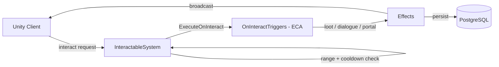

# Interactable System

**Short description:** SceneServer subsystem that validates player interactions with world objects and dispatches them into the interactable's own ECA triggers, plus the follow-up broadcasts those interactions produce — merchant purchases and sales, ability crafting, dialogue sessions, the dungeon finder, the group finder queue, arena queueing and match coordination, mailboxes, containers, corpse looting, and waypoint fast travel.

## Table of Contents

- [Overview](#overview)
- [Supported Platforms](#supported-platforms)
- [Features](#features)
- [Prerequisites](#prerequisites)
- [Installation / Build](#installation--build)
- [Quick Start Guides](#quick-start-guides)
- [Configuration](#configuration)
- [Usage Examples](#usage-examples)
- [Operational Checks](#operational-checks)
- [Flow Diagram](#flow-diagram)
- [Project Structure](#project-structure)
- [License](#license)

## Overview

The Interactable system is the SceneServer subsystem responsible for validating and processing all player interactions with world interactable objects. It handles generic interaction dispatch, merchant item/ability/event/premade purchases and sales, ability crafting, server-authoritative dialogue sessions, dungeon finder instance assignment, the shared group finder queue, arena queueing and the arena match state machine, mailbox operations, container item retrieval, corpse looting, waypoint fast travel, and NPC look-at behavior.

**Interaction behaviour is data, not code.** There is no server-side handler registry: `InteractableSystem` validates the request and then calls `IInteractable.ExecuteOnInteract(eventData)`, which fires the `OnInteractTriggers` list authored on the interactable prefab through the [ECA trigger system](../../../../../Shared/Implementation/Entity/ECA/Target/README.md). What a banker, shrine, or teleporter *does* lives in the Trigger assets designers wire onto it, so adding a new kind of interaction requires no C# in this system at all.

The system's own C# is split across partial classes of `InteractableSystem`, one per **follow-up** broadcast — the second round-trip that a UI opened by an interaction sends back:

| Partial class | Handles |
|---|---|
| `InteractableSystem.cs` | Broadcast registration, validation, ingress guard, dispatch, NPC look-at, main-thread queue drain |
| `InteractableSystem.Merchant.cs` | `MerchantPurchaseBroadcast` / `MerchantSellBroadcast` — item / ability-template / ability-event / premade-ability purchases, and selling back |
| `InteractableSystem.AbilityCraft.cs` | `AbilityCraftBroadcast` — crafting an ability from a base plus selected events |
| `InteractableSystem.Dialogue.cs` | `DialogueChoiceBroadcast` — server-authoritative dialogue sessions |
| `InteractableSystem.DungeonFinder.cs` | `DungeonFinderListBroadcast` / `DungeonFinderCreateBroadcast` / `DungeonFinderJoinBroadcast` — browsing, opening and joining a run. `DungeonFinderBroadcast` is now purely the server's message opening the panel and is **not** accepted from a client. |
| `InteractableSystem.GroupFinder.cs` | `GroupFinderQueueBroadcast` / `GroupFinderLeaveBroadcast` — the shared cross-server queue table, its per-server pump, group formation and late-join backfill |
| `InteractableSystem.Arena.cs` | `ArenaQueueBroadcast`, `ArenaProfileRequestBroadcast`, `ArenaHistoryRequestBroadcast`, `ArenaLeaderboardRequestBroadcast` — arena boards queue solo or as a pre-made party onto the same group finder queue as arena rows |
| `InteractableSystem.ArenaMatch.cs` | `ArenaReadyResponseBroadcast` — the match coordinator: Gathering → ReadyCheck → Countdown → Live → Ended, for every arena match hosted on this scene server |
| `InteractableSystem.Mailbox.cs` | `MailFetchBroadcast` / `MailSendBroadcast` / `MailDeleteBroadcast` / `MailClaimAttachmentBroadcast` |
| `InteractableSystem.Container.cs` | `ContainerTakeItemBroadcast` — retrieving items from an open container |
| `InteractableSystem.Corpse.cs` | `CorpseLootTakeItemBroadcast` / `CorpseLootTakeCurrencyBroadcast` / `CorpseLootTakeAllBroadcast` / `CorpseLootCloseBroadcast` — a shared loot pile on a dead NPC, kept in step across every looter |
| `InteractableSystem.Waypoint.cs` | `WaypointTravelRequestBroadcast` — fast travel, plus persisting a discovered waypoint page |

The implementation uses a split execution model:
- **Main thread:** request validation, ingress guard checks, trigger execution, dialogue session management, debounce sweep, and network broadcasts.
- **Async worker:** database reads/writes for inventory persistence, ability persistence, mail operations, dungeon finder scene assignment, and known-ability persistence via `TryEnqueueAsyncWork`.
- **Main-thread queue:** marshaling async completion actions back to Unity/FishNet-safe context via `IInteractableSystemMainThreadQueueData`.

All interaction entry points share a single per-connection `IngressGuard` with a configurable global cooldown, ensuring only one interaction can be in-flight per connection at a time. Stale debounce entries are periodically swept with bounded cleanup.

## Supported Platforms

| Platform | Supported | Notes |
|---|---|---|
| Windows | Yes | |
| Linux | Yes | |
| WebGL | N/A | Server-only module |
| Unity 6.3 LTS | Yes | Required engine version |
| IL2CPP | Yes | Supported scripting backend |

## Features

- Data-driven interaction: dispatch ends at `IInteractable.ExecuteOnInteract`, running the designer-authored `OnInteractTriggers` on the prefab — new interaction types need no server code
- Strict server-side validation for every interaction: connection, character, act-state, scene, scene object, scene-handle match, and `CanInteract`
- Global per-connection interaction cooldown via shared `IngressGuard` (one interaction at a time per connection)
- Bounded periodic debounce tracker sweep with configurable TTL, interval, and max removals
- Merchant purchases with tab-type dispatch (Item, Ability, AbilityEvent, PremadeAbility), currency validation, and inventory/ability synchronization. A premade purchase is the crafting path with the recipe supplied by the merchant's own `PremadeAbilityTemplate`: validated against the crafting rules, refused if a usable ability of that template is already held or the ability cap is reached (`AbilityLimit`), charged through `TrySpend`, persisted and granted via `LearnAbility`, and announced to observers with `AbilityLearnedObserverBroadcast`. Ledger reason `AbilityPurchase`.
- Ability crafting from base ability plus selected events with duplicate-event rejection, known-event verification, max-learned-ability cap, and currency cost calculation
- Server-authoritative dialogue sessions with ECA condition/action evaluation, choice bitmask tracking, cached per-character choices bound to the character lifecycle (`OnAfterLoadCharacter` loads, `OnDisconnect` releases), and bounded session/cache capacity
- ECA-triggered dialogue sessions (no physical interactable required) via `DisplayDialogueAction` static event
- Dungeon finder split into three separately-authorised requests: list (browse), create (open a run), join (enter somebody else's). Entrance validation, existing-instance lookup, party-member instance conflict checking, async scene enqueue, main-thread character state marshaling, and the `/closedungeon` / `/closeinstance` chat commands
- Group finder: a database queue table shared by every scene server on the world server, a per-server pump that heartbeats and acts on its own queued characters, formation in one locking transaction (so no matchmaker process is needed and two servers racing produce one group), late-join backfill into runs already open, a leash to the board, and stale-row sweeping
- Arena queueing on the same queue rows: solo or as a pre-made party (every member connected here, inside the same board's leash, free of instances and live matches, and fitting one team of the format — all or none). Team assignment is written by `IGroupFinderQueueService.TryFormArenaMatchAsync`. Profile, history and leaderboard lookups answer from the database
- Arena match coordination, owned by whichever scene server hosts the instance: Gathering (wait for seats, drop absentees), ReadyCheck (a decline or a silence cancels and locks the culprit out of the queue), Countdown (move to team spawns; `ArenaTeamRegistry` reports every seat as an ally so nobody can be hurt yet), Live (kills, objectives, respawns at team spawn, backfill window, disconnect grace, ends on score limit / clock / walkover), Ended (tallies, result, ratings, PvP attributes, reward hook, results screen)
- Corpse looting of a shared pile: the corpse is the authority, the client sends only a scene object ID and a slot index, and every looter's window is kept in step. Its own ingress operation code with a 50 ms debounce rather than the one-second general interaction debounce
- Waypoint fast travel validated end to end on the server (the map's scene must be the character's scene, the waypoint must be live in that scene instance, and `WaypointTravel.TryTravel` applies can-act / not-in-combat / discovered / conditions), with every refusal reported so the map can re-enable its button and say why. Discovery itself is an ECA action on the waypoint's trigger; this system hears `IWaypointController.OnWaypointUnlocked` and merges the page into the database
- Merchant sell-back via `MerchantSellBroadcast`
- Mail attachments claimed via `MailClaimAttachmentBroadcast`
- Mailbox operations: fetch (async DB read → broadcast mail list), send (input validation, async DB write), and delete (async soft-delete)
- Container item retrieval with slot validation, inventory transfer, and auto-despawn on empty
- NPC look-at behavior via `OnInteractNPC` triggering AI controller idle-state transition
- World item pickup with per-object `ConcurrentDictionary` concurrency guard preventing item duplication exploits
- Gathering node interaction with weighted drop-table rolls, remaining-use tracking, and auto-despawn on depletion
- Capture point interaction with progressive capture state, owner tracking, and state broadcast
- Lore object interaction with idempotent ability/event/item grants
- Shrine interaction with configurable health/mana healing percentages and optional buff application
- Switch interaction with toggle/activate support for doors, chests, traps, and other `ISwitchTarget` objects
- Bindstone interaction setting character respawn position and scene
- Teleporter interaction supporting direct transform teleport or named destination teleport
- Banker interaction opening bank UI with last-interactable tracking
- Achievement integration on interactable components via optional `AchievementTemplate` fields, incremented by trigger actions
- Async inventory persistence with fallback direct-persistence path when async worker rejects work
- Known-ability and crafted-ability persistence via async worker with fail-closed semantics on enqueue rejection
- Per-system main-thread queue isolation with configurable drain cap per frame
- Graceful failure semantics: invalid requests fail closed with no mutation; validation enforced before persistence; async failures logged without blocking main thread

## Prerequisites

- **Unity 6.3 LTS**
- **FishNetworking** — networking framework
- **FishMMO Server Core** — provides `ServerBehaviour`, `IInteractableSystem`, `IInteractableSystemRuntimeData`, `IInteractableSystemMainThreadQueueData`, `IngressGuard`, `AsyncWorkerData`, `WorldSceneDetailsCache`, broadcast types (`InteractableBroadcast`, `MerchantPurchaseBroadcast`, `AbilityCraftBroadcast`, `DungeonFinderBroadcast`, `DialogueChoiceBroadcast`, `MailFetchBroadcast`, `MailSendBroadcast`, `MailDeleteBroadcast`, `ContainerTakeItemBroadcast`), and data containers
- **FishMMO Shared Core** — provides `IInteractable`, `IPlayerCharacter`, interactable type interfaces (`IMerchant`, `IAbilityCrafter`, `IDungeonEntrance`, `IDialogueInteractable`, `IMailbox`, `IContainer`, `IWorldItem`, `IGatheringNode`, `ICapturePoint`, `ILoreObject`, `IShrine`, `ISwitch`, `ITeleporter`, `IBindstone`, `IBanker`), `AbilityTemplate`, `AbilityEvent`, `MerchantTemplate`, `DialogueTemplate`, `CharacterAttributeTemplate`, `SceneObject`, and ECA system types
- **FishMMO Database** — provides `ICharacterItemService`, `ICharacterKnownAbilityService`, `ICharacterAbilityService`, `ISceneService`, `ICharacterPartyService`, `ICharacterMailService`, `CharacterItemData`, `CharacterAbilityData`, and `DatabaseResult<T>`

## Installation / Build

This is an integrated module within FishMMO. It is included as part of the server-side scene-server implementation and does not require separate installation. Ensure the FishMMO Server Core and its dependencies are properly configured in your Unity project.

## Quick Start Guides

1. Ensure `InteractableSystem` is present on the scene server GameObject (it inherits from `ServerBehaviour` and implements `IInteractableSystem`). The asset is created via `Create > FishMMO > Server > SceneServer > Interactable System`.
2. Assign the `WorldSceneDetailsCache` asset for scene validation and respawn lookup.
3. Assign a `CharacterAttributeTemplate` for `currencyTemplate` to enable merchant purchases and ability crafting cost validation.
4. Verify that the following data containers are registered in `DataContainerRegistry`:
   - `InteractableSystemRuntimeData` → `IInteractableSystemRuntimeData`
   - `InteractableSystemMainThreadQueueData` → `IInteractableSystemMainThreadQueueData`
   - `AsyncWorkerData` (shared async work queue)
5. On initialize, `InteractableSystem` registers twenty-five broadcast handlers (see [Broadcast Handlers](#broadcast-handlers)), subscribes to `IDialogueInteractable.OnServerDialogueRequested`, adds the `/closedungeon` and `/closeinstance` chat commands, hooks `ICharacterSystem.OnAfterLoadCharacter` / `OnDisconnect` for the dialogue choice cache and the group finder rows, then calls `InitializeGroupFinder()` (which chains `InitializeArena()` → `InitializeArenaMatches()`) and `InitializeWaypoints()`, and clamps inspector parameters.
6. On deinitialize, it drains the remaining main-thread queue, clears ingress guard state, unregisters all broadcast handlers, unsubscribes dialogue events, and clears dialogue session/choice caches.
7. Clients send the appropriate broadcast to trigger interactions; the server validates, processes, optionally persists to database, and replies with result broadcasts.

## Configuration

### Inspector Parameters

| Parameter | Type | Default | Description |
|---|---|---|---|
| `maxMainThreadActionsPerFrame` | int | 100 | Max interactable-system actions drained from main-thread queue per frame |
| `interactionDebounceMilliseconds` | int | 1000 | Global interaction cooldown in milliseconds; players can only interact with one thing at a time |
| `debounceSweepIntervalSeconds` | float | 5.0 | Seconds between bounded debounce tracker cleanup sweeps |
| `debounceEntryTtlSeconds` | float | 30.0 | Seconds before stale debounce entries are removed |
| `debounceSweepMaxRemovals` | int | 128 | Maximum stale debounce entries removed per sweep and tracker |
| `worldSceneDetailsCache` | WorldSceneDetailsCache | — | Scene detail cache for scene validation and respawn lookup |
| `maxAbilityCount` | int | 25 | Maximum number of crafted abilities a character may learn |
| `maxAbilityCraftEvents` | int | 32 | Maximum number of ability events allowed per craft request (defense-in-depth payload cap) |
| `currencyTemplate` | CharacterAttributeTemplate | — | Currency attribute required to buy merchant items and abilities |
| `waypointTravelDebounceMilliseconds` | int | 2000 | Minimum milliseconds between fast-travel requests from one connection |
| `groupFinderPumpIntervalSeconds` | float | 2.0 | How often this server pumps the shared queue on behalf of its own waiters |
| `groupFinderStalePulseSeconds` | float | 30.0 | How long a queue row may go without a heartbeat before it is stale |
| `groupFinderTransferGraceSeconds` | float | 60.0 | Grace for a matched character being handed between scene servers |
| `groupFinderBackfillRetrySeconds` | float | 10.0 | Delay before retrying a failed late-join backfill |
| `groupFinderStaleSweepIntervalSeconds` | float | 30.0 | How often stale queue rows are swept |
| `groupFinderLeashMeters` | float | 8.0 | How far a queued player may stray from the board before being dequeued |

### Dialogue Constants

| Constant | Value | Description |
|---|---|---|
| `MaxActiveDialogueSessions` | 2048 | Maximum concurrent dialogue sessions before new sessions are rejected |
| `MaxCachedChoiceCharacters` | 4096 | Maximum characters with cached dialogue choices before eviction |

### Mailbox Constants

| Constant | Value | Description |
|---|---|---|
| `MaxMailSubjectLength` | 200 | Maximum subject length for outgoing mail |
| `MaxMailBodyLength` | 4000 | Maximum body length for outgoing mail |

### Ingress Guard Operation Codes

Each family of requests takes its own operation code on the shared per-connection
`IngressGuard`, so one family's debounce cannot silence another's. Operation 0 is the
general interaction guard governed by `interactionDebounceMilliseconds`.

| Code | Constant | Debounce |
|---|---|---|
| 0 | (general interaction) | `interactionDebounceMilliseconds` (1000 ms default) |
| 1 | `CorpseLootOperation` | `CorpseLootDebounceMilliseconds` = 50 |
| 10 | `DungeonListOperation` | `DungeonListDebounceMilliseconds` = 2000 |
| 11 | `DungeonEnterOperation` | — |
| 12 | `GroupFinderQueueOperation` | `GroupFinderQueueDebounceMilliseconds` = 2000 |
| 13 | `GroupFinderLeaveOperation` | `GroupFinderLeaveDebounceMilliseconds` = 1000 |
| 14 | `ArenaQueueOperation` | `ArenaQueueDebounceMilliseconds` = 2000 |
| 15 | `ArenaLookupOperation` | `ArenaLookupDebounceMilliseconds` = 1000 |
| 16 | `ArenaReadyOperation` | `ArenaReadyDebounceMilliseconds` = 250 |
| 20 | `WaypointTravelOperation` | `waypointTravelDebounceMilliseconds` (2000 ms default) |

### Dungeon and Arena Constants

| Constant | Value | Description |
|---|---|---|
| `MaxListedInstances` | 24 | Cap on runs returned by a dungeon finder list request |
| `ArenaLeaderboardRows` | 50 | Rows returned by a leaderboard request |
| `ArenaHistoryRows` | 20 | Rows returned by a history request |
| `ArenaBackfillPerPump` | 4 | Backfill seats attempted per pump |
| `ArenaTickSeconds` | 1.0 | The arena match coordinator's tick |
| `ArenaCancelledSeconds` | 5 | How long a cancelled match's notice is shown before teardown |

### Threading Model

| Thread | Work |
|---|---|
| Main thread | Request validation, ingress guards, handler dispatch, dialogue session management, debounce sweep, main-thread queue drain, broadcast dispatch |
| Async worker | Database reads/writes: inventory, ability and known-ability persistence, dungeon finder scene assignment and party-instance checks, mail fetch/send/delete/claim, the group finder queue pump (heartbeat, read back, form, backfill, stale sweep), arena queue rows, match formation and result writes, arena profile/history/leaderboard lookups, and waypoint page merges |

## Usage Examples

### Broadcast Handlers

`InteractableSystem` registers the following server-side broadcast handlers on initialize:

| Broadcast | Handler | Partial Class | Purpose |
|---|---|---|---|
| `InteractableBroadcast` | `OnServerInteractableBroadcastReceived` | `InteractableSystem.cs` | Generic interaction dispatch to registered handler |
| `MerchantPurchaseBroadcast` | `OnServerMerchantPurchaseBroadcastReceived` | `InteractableSystem.Merchant.cs` | Merchant item/template/event/premade-ability purchase |
| `AbilityCraftBroadcast` | `OnServerAbilityCraftBroadcastReceived` | `InteractableSystem.AbilityCraft.cs` | Ability crafting from base + events |
| `DungeonFinderListBroadcast` | `OnServerDungeonFinderListBroadcastReceived` | `InteractableSystem.DungeonFinder.cs` | Browse the runs a character may join |
| `DungeonFinderCreateBroadcast` | `OnServerDungeonFinderCreateBroadcastReceived` | `InteractableSystem.DungeonFinder.cs` | Open a new run and get the instance assignment |
| `DungeonFinderJoinBroadcast` | `OnServerDungeonFinderJoinBroadcastReceived` | `InteractableSystem.DungeonFinder.cs` | Join a run already open |
| `DialogueChoiceBroadcast` | `OnServerDialogueChoiceBroadcastReceived` | `InteractableSystem.Dialogue.cs` | Dialogue choice progression |
| `MailFetchBroadcast` | `OnServerMailFetchBroadcastReceived` | `InteractableSystem.Mailbox.cs` | Fetch mail list from database |
| `MailSendBroadcast` | `OnServerMailSendBroadcastReceived` | `InteractableSystem.Mailbox.cs` | Send mail to another character |
| `MailDeleteBroadcast` | `OnServerMailDeleteBroadcastReceived` | `InteractableSystem.Mailbox.cs` | Soft-delete a mail entry |
| `MerchantSellBroadcast` | `OnServerMerchantSellBroadcastReceived` | `InteractableSystem.Merchant.cs` | Sell an inventory item back to a merchant |
| `MailClaimAttachmentBroadcast` | `OnServerMailClaimAttachmentBroadcastReceived` | `InteractableSystem.Mailbox.cs` | Claim a mail attachment |
| `ContainerTakeItemBroadcast` | `OnServerContainerTakeItemBroadcastReceived` | `InteractableSystem.Container.cs` | Take item from container |
| `CorpseLootTakeItemBroadcast` | `OnServerCorpseLootTakeItemBroadcastReceived` | `InteractableSystem.Corpse.cs` | Take one slot from a corpse's loot pile |
| `CorpseLootTakeCurrencyBroadcast` | `OnServerCorpseLootTakeCurrencyBroadcastReceived` | `InteractableSystem.Corpse.cs` | Take the corpse's currency |
| `CorpseLootTakeAllBroadcast` | `OnServerCorpseLootTakeAllBroadcastReceived` | `InteractableSystem.Corpse.cs` | Take everything the corpse holds |
| `CorpseLootCloseBroadcast` | `OnServerCorpseLootCloseBroadcastReceived` | `InteractableSystem.Corpse.cs` | Close the loot window and drop the subscription |
| `GroupFinderQueueBroadcast` | `OnServerGroupFinderQueueBroadcastReceived` | `InteractableSystem.GroupFinder.cs` | Join the shared group finder queue |
| `GroupFinderLeaveBroadcast` | `OnServerGroupFinderLeaveBroadcastReceived` | `InteractableSystem.GroupFinder.cs` | Leave the queue |
| `ArenaQueueBroadcast` | `OnServerArenaQueueBroadcastReceived` | `InteractableSystem.Arena.cs` | Queue for an arena format, solo or as a pre-made party |
| `ArenaProfileRequestBroadcast` | `OnServerArenaProfileRequestReceived` | `InteractableSystem.Arena.cs` | Read a character's arena rating and record |
| `ArenaHistoryRequestBroadcast` | `OnServerArenaHistoryRequestReceived` | `InteractableSystem.Arena.cs` | Read recent matches |
| `ArenaLeaderboardRequestBroadcast` | `OnServerArenaLeaderboardRequestReceived` | `InteractableSystem.Arena.cs` | Read the season leaderboard |
| `ArenaReadyResponseBroadcast` | `OnServerArenaReadyResponseReceived` | `InteractableSystem.ArenaMatch.cs` | Accept or decline the ready check |
| `WaypointTravelRequestBroadcast` | `OnServerWaypointTravelRequestBroadcastReceived` | `InteractableSystem.Waypoint.cs` | Fast travel to a discovered waypoint |

### Generic Interaction Dispatch

`OnServerInteractableBroadcastReceived(conn, msg, channel)`:

1. Validates connection, spawned object, and character.
2. Acquires ingress guard (`EndIngressGuard` in a `finally`).
3. Validates scene via `WorldSceneDetailsCache`.
4. Validates scene object via `ValidateSceneObject` (existence + same-scene check).
5. Resolves the interactable with `InteractableResolver.Resolve(sceneObject)`.
6. Calls `interactable.CanInteract(character)`, then `interactable.TryConsumeInteractRateLimit(character)`.
   Every refusal above logs at Debug with the reason (corpse / in-range / rate-limited) — the branches
   used to decline in silence, which made "I pressed E and nothing happened" undiagnosable.
7. If the interactable is an `ILootableCorpse`, calls `OpenCorpseLoot` **directly**, not through a
   trigger: corpse looting is intrinsic to any NPC that can die, so a missing `OnInteractTriggers`
   entry must not make a creature silently unlootable.
8. Calls `interactable.ExecuteOnInteract(new PlayerInteractionEventData(...))` to run the prefab's
   `OnInteractTriggers`. The event data carries a `SendNewItemBroadcast` callback so triggers that
   grant items can tell the client.

### Merchant Purchase

`OnServerMerchantPurchaseBroadcastReceived(conn, msg, channel)`:

1. Validates connection, character, inventory controller, and ingress guard.
2. Validates `MerchantTemplate` exists and scene/object/range checks pass.
3. Confirms interactable is `IMerchant` with matching template ID.
4. Dispatches by `MerchantTabType`:
   - **Item:** validates index bounds, checks currency, creates `Item`, calls `SendNewItemBroadcast`, deducts cost.
   - **Ability:** validates index bounds, calls `LearnAbilityTemplate` (validates not already known, checks currency, enqueues async persist, learns ability, broadcasts `KnownAbilityAddBroadcast`) and answers with whatever it returns.
   - **AbilityEvent:** validates index bounds, calls `LearnAbilityEvent` (same flow as ability but for events, broadcasts `KnownAbilityEventAddBroadcast`).
5. Increments merchant achievement if configured.

Every exit answers with a `MerchantPurchaseResultBroadcast`, including the learn helpers' own
refusals — the client arms a watchdog on submit and a silent return reads to the player as "the
server never replied".

**A price of `0` is free, not "unpriced".** `BaseItemTemplate.Price` and the ability templates'
`Price` are ints that default to 0, so treating 0 as unsellable refused every unedited template —
which is every item the shipped merchants offer. Only a negative price is refused
(`MerchantPurchaseFailure.NotForSale`). At price 0 the currency lookup, the affordability divide
(a `DivideByZeroException` otherwise) and `CharacterCurrency.TrySpend` (which rejects a
non-positive amount by design) are all skipped.

### Ability Crafting

`OnServerAbilityCraftBroadcastReceived(conn, msg, channel)`:

1. Validates connection, character, ability controller, and ingress guard.
2. Validates base `AbilityTemplate` exists.
3. Validates scene and interactable (ability crafter) in range.
4. Confirms character knows the base ability, doesn't already have a crafted version, and hasn't reached `maxAbilityCount`.
5. Validates event list: rejects duplicates, unknown events, unowned events, and oversized payloads (`maxAbilityCraftEvents`).
6. Sums total price (base + events), checks currency.
7. Calls `LearnAbility` → creates `Ability`, enqueues `PersistAbilityAsync`, learns on controller.
8. Deducts cost, broadcasts `AbilityAddBroadcast`, increments achievement.

### Dialogue Session

**Start** (`StartDialogueSession` / `StartECADialogueSession`):
1. Ends any existing session for the character.
2. Checks bounded session capacity (`MaxActiveDialogueSessions`).
3. Evaluates start node conditions via ECA.
4. Executes start node on-enter actions.
5. Loads cached choices for the character + template.
6. Creates `DialogueSession` and broadcasts `DialogueStartBroadcast`.

**Choice** (`OnServerDialogueChoiceBroadcastReceived`):
1. Validates session exists and node matches.
2. Validates template, scene, and range (skipped for ECA sessions).
3. Validates choice index bounds.
4. Evaluates choice conditions via ECA.
5. Executes current node on-exit actions and choice on-select actions.
6. Updates choice bitmask.
7. If `NextNodeId < 0`: persists cached choices if enabled, broadcasts `DialogueEndBroadcast`.
8. Otherwise: evaluates next node conditions, executes on-enter actions, advances session, broadcasts `DialogueChoiceResultBroadcast`.

### Dungeon Finder

Three separately-authorised client requests, not one. `DungeonFinderBroadcast` is now purely the
server's message opening the panel and is **not accepted from a client at all**.

All three share `TryResolveDungeonEntrance`, which validates that the caller is standing at a
usable entrance and captures what the async half needs as plain values: character and world server
IDs, party ID and rank, dungeon name, dungeon template ID, scene details, achievement template.
The scene object handle is validated against the character's *own* scene, since a handle is only
meaningful inside the process that allocated it.

`TryResolveDifficulty` resolves the index a request names against the dungeon's own list. A
dungeon with no template, or an empty list, offers exactly one difficulty at index 0 with default
rules — which is how every dungeon authored before difficulties existed behaves, so none needed
changing. An index the dungeon does not offer is **refused, never clamped**: clamping would quietly
enter a player into a ruleset they did not choose, and on a dungeon whose top difficulty ends a run
on the first death that is not a rounding error.

#### `OnServerDungeonFinderListBroadcastReceived` — browsing

1. Its **own** ingress-guard operation (`DungeonListOperation`) with a 2000 ms debounce, so
   browsing cannot debounce the attempt to enter that follows it. The two are debounced at rates
   two orders of magnitude apart; sharing a key would let the cheap one lock out the expensive one.
2. Deliberately **not** gated on character state. Reading a list is not a move, and a player in
   combat who cannot see it can see it by walking ten metres away — refusing would hide
   information rather than prevent an action.
3. `FetchInstanceListAsync` reads `ISceneService.FetchJoinableInstancesAsync` (public, non-full,
   enterable rows of this dungeon at this difficulty) and resolves the opener names in one batched
   `ICharacterService.FetchNamesAsync` rather than one query per row. A name lookup that fails does
   not fail the list — the rows are still joinable and still describe themselves by size and state.
4. `RemainingSeconds` is deliberately **not** sent from here: the expiry clock belongs to the scene
   server hosting each instance, and this is not necessarily that server.
5. **Every exit replies**, including refusals and empty lists. The panel disables its list while a
   request is outstanding, so a silent return would leave it inert for the rest of its life.

#### `OnServerDungeonFinderCreateBroadcastReceived` — opening a new run

1. `TryBeginDungeonEntry` gates on `CharacterStateValidation.CanActOrMove` — **not** `CanAct`.
   Entering a dungeon is a voluntary move to another scene instance implemented as a disconnect, so
   in combat it would be both a cleaner escape than any teleporter and actively corrupting: the
   drop would be read as a combat logout, stranding the body and its session claim on this server
   while the character row says it is in an instance. It also refuses a character already inside an
   instance — the entrance is not a way to hop between them.
2. Capacity is the difficulty's own `MaximumPlayers` where it declares one, and the scene's
   `MaxClients` otherwise.
3. `ProcessDungeonCreateAsync`:
   - Reads the party roster, and refuses with `RequirementsNotMet` if the difficulty's
     `MinimumPartySize` is not met. Checked against the **roster**, not against who is inside, so a
     dungeon demanding a group cannot be started by whichever member arrives first and then
     finished alone.
   - `ISceneService.FetchCharacterInstancesAsync` in one batched query decides between the three
     outcomes: join what the party already holds, refuse because a different dungeon is held
     (`PartyInstanceExists`), or create. It matches on the **owning party** as well as on member
     IDs, which is what keeps a run resolvable after its opener has left or logged out — and what
     lets a member walk back out to the entrance and straight back in.
   - Matching the held instance ignores difficulty. A party holds one instance; asking for the same
     dungeon on Hard when the party already has it open on Normal is a request to go where the
     group is, and creating a second copy would split them.
   - A **full** instance is refused (`DestinationFull`), never worked around. Asking for a new one
     instead would silently hand a party member a second, empty copy of the dungeon and separate
     them from the group they were trying to join.
   - Opening a run **publicly while ungrouped** forms a party of one first
     (`IPartySystem.TryCreatePartyForInstanceAsync`), because a run others may join needs a group
     for them to join. If that fails the run is opened *private* rather than refused: the player
     asked for a dungeon and a listing, and giving them the dungeon is much closer to what they
     wanted than giving them neither. A private run forms nothing.
   - `ISceneService.EnqueueForPartyAsync` folds the existence check into the insert, so the losers
     of a simultaneous party-wide click insert nothing and join the winner. Solo characters use the
     same guarded insert with a list of just themselves, so the rule is enforced by the database for
     everyone.
   - An instance created for an entry that then falls through is released (`Failed`), because a row
     nobody entered would otherwise lock the whole party out of every dungeon until the stale-row
     sweep removed it.

#### `OnServerDungeonFinderJoinBroadcastReceived` — joining somebody else's run

1. Shares the create path's guard key, so a client cannot submit one of each and race two transfers
   of the same character against one another.
2. `ProcessDungeonJoinAsync` validates the named instance against what the finder would actually
   have offered — right dungeon, this world server, `SceneType.Group`, public, enterable, not full
   — rather than trusting it. A row ID is a small integer and the panel is not the only thing that
   can send this. Every one of those checks refuses with the same `InstanceUnavailable`, so an ID
   cannot be probed to learn whether a particular instance exists.
3. Privacy is a lock on the front door, not on the instance: a member of the owning party still
   gets in, which is what keeps re-entry working for a run closed to strangers.
4. The rules are the difficulty the instance was **opened** at, not anything the joiner asked for.
   An index that no longer resolves is treated as a closed instance rather than as default rules.
5. Joining another group's run **joins their party**, before the transfer. The transfer is a
   disconnect and a reroute, so there is no "after" on this server — and a character arriving
   inside without having joined would be a stranger in somebody's run, with no leader able to
   remove them and no way for the finder to resolve the instance as theirs later. Refused with
   `AlreadyInParty` for anyone in a party with somebody else; a character alone in a party of their
   own is simply released from it.

#### Entry

`EnterInstance` re-checks `CanActOrMove` — the database work above gives combat or death time to
intervene — then sets `InstanceID`, `InstancePosition`, `InstanceRotation`, enables
`CharacterFlags.IsInInstance`, announces the hand-off via
`ICharacterSystem.SuppressCombatLingerOnDisconnect`, and disconnects. Every refusal answers with a
`SceneTransferRefusedBroadcast` naming the reason: the client closes its panel the moment it sends,
so a silent return read as the button having stopped working — and the natural response, clicking
again, was then swallowed by the ingress guard.

### Mailbox Operations

**Fetch** (`OnServerMailFetchBroadcastReceived`):
1. Validates connection, character, ingress guard, scene, and mailbox in range.
2. Enqueues `FetchMailAsync`: fetches via `ICharacterMailService.FetchAsync`, marshals `MailListBroadcast` to main thread.

**Send** (`OnServerMailSendBroadcastReceived`):
1. Validates connection, character, ingress guard, input (non-empty, length limits), scene, and mailbox in range.
2. Enqueues `SendMailAsync`: calls `ICharacterMailService.SendAsync`.

**Delete** (`OnServerMailDeleteBroadcastReceived`):
1. Validates connection, character, ingress guard, scene, and mailbox in range.
2. Enqueues `DeleteMailAsync`: calls `ICharacterMailService.DeleteAsync`.

### Container Take Item

`OnServerContainerTakeItemBroadcastReceived(conn, msg, channel)`:

1. Validates connection, character, inventory controller, and ingress guard.
2. Validates scene object and interactable in range.
3. Confirms interactable is `IContainer` + `IItemContainer` with a template.
4. Removes item from container slot.
5. Calls `SendNewItemBroadcast` to add to inventory; on failure, puts item back.
6. If container is empty and `DespawnWhenEmpty` is enabled, despawns.

### Inventory Persistence

This system does not place, broadcast or persist items itself. Both entry points delegate to
`CharacterInventorySystem`, which is the one grant funnel that hands an item its database identity:

`SendNewItemBroadcast(conn, character, inventoryController, newItem)`:

1. Requires an `IPlayerCharacter`; refuses otherwise.
2. Resolves `ICharacterInventorySystem` from `Server.BehaviourRegistry`. **If it is absent the grant
   is refused** rather than persisted without a write-back — an item that never learns its id cannot
   be equipped, used or moved, so the caller's own fallback (put it back on the corpse, refund the
   purchase) is the better outcome.
3. Returns `inventorySystem.TryGrantItem(playerCharacter, newItem, InventoryType.Inventory)`.

`PersistInventoryChanges(character, changed, removed)` hands rows a sale or a mail attachment
changed to `inventorySystem.PersistInventoryChanges` — the journalled batch. The caller has already
told the client. Same registry-absent refusal, logged as an error.

The place/broadcast/persist body used to live here and was one of three copies (quest and
achievement systems had their own); only this one wrote the identity back, which is why they were
collapsed into `CharacterInventorySystem.TryGrantItem`.

### Interactable Types

Each type is a component deriving from `Interactable` in
[`Shared/Implementation/Entity/Interactable/`](../../../../../Shared/Implementation/Entity/Interactable). None of them
carries interaction logic in this server system — the component supplies
identity, display metadata, `CanInteract` rules, and template references, while
the behaviour listed below is what the prefab's `OnInteractTriggers` are
conventionally wired to do.

| Interactable Type | Typical authored behaviour |
|---|---|
| `AbilityCrafter` | Opens the ability crafting UI; NPC look-at |
| `Banker` | Sets `LastInteractableID`, opens bank UI; NPC look-at; achievement |
| `Bindstone` | Sets character `BindPosition` and `BindScene`; achievement |
| `CapturePoint` | Applies capture progress, broadcasts state, achievement on capture |
| `Container` | Builds slot data and opens the container UI; achievement |
| `DialogueInteractable` | Starts a server-authoritative dialogue session; NPC look-at |
| `DungeonEntrance` | Opens the dungeon finder UI |
| `GatheringNode` | Rolls the weighted drop table, grants items, decrements uses, auto-despawns |
| `LoreObject` | Idempotently grants abilities / events / items |
| `Mailbox` | Opens the mail UI; achievement |
| `Merchant` | Opens the merchant UI with the template ID; NPC look-at |
| `PlotFoundation` | Housing: the placed foundation a plot's row points at; `ClaimPlotAction` buys it |
| `QuestInteractable` | Offers and turns in quests |
| `Shrine` | Heals health/mana by percentage, applies buff stacks; achievement |
| `Switch` | Toggles `ISwitchTarget` activate/deactivate; achievement |
| `Teleporter` | Teleports via direct transform or named destination; achievement |
| `Waypoint` | The shipped `Waypoint Interact` trigger runs `UnlockWaypointAction` and the discovery achievement. Travel is **not** an interaction: it is requested from the map, validated by the server, and the arrival runs `OnTravelTriggers` |
| `WorldItem` | Picks up the item with a concurrency guard, adjusts stack or despawns; achievement |
| `ArenaBoard` | Opens the arena panel: queueing, profile, history, leaderboard |
| `ArenaObjective` | A flag stand or control point; its trigger runs `InteractWithArenaObjectiveAction`, which the match coordinator scores |

Because the mapping is authored per prefab rather than compiled in, two
`Shrine` prefabs can behave differently, and a prefab whose `OnInteractTriggers`
list is empty is interactable but inert — see [Operational Checks](#operational-checks).

### Failure Semantics

- Invalid requests fail closed with no mutation.
- Scene/object/range checks prevent cross-scene and spoofed interaction attempts.
- Merchant tab accesses use explicit index bounds checks.
- Ability craft event selection rejects duplicates and unknown/unowned events.
- Dialogue sessions are bounded; excess sessions are rejected with a warning.
- Mailbox input length is capped to prevent oversized payloads.
- World item pickup uses `ConcurrentDictionary` to prevent item duplication.
- Async enqueue failures are handled explicitly: inventory persistence falls back to direct async path; ability/known-ability persistence fails closed (no learn mutation on rejection).
- Main-thread completion paths revalidate runtime state before mutating or broadcasting.
- Ingress guards are always released in `finally` blocks (synchronous or async-owned).

## Operational Checks

| Check | How to Verify |
|---|---|
| Initialization success | Confirm `InteractableSystem` logs "Initialized" without errors on server startup |
| Trigger wiring | Confirm each interactable prefab has its `OnInteractTriggers` list populated; an empty list means interacting does nothing |
| Data containers available | Verify `IInteractableSystemRuntimeData` and `IInteractableSystemMainThreadQueueData` resolve from `DataContainerRegistry` |
| Generic interaction | Send `InteractableBroadcast` for a merchant; confirm `MerchantBroadcast` reply with template ID |
| Merchant item purchase | Send `MerchantPurchaseBroadcast` with `MerchantTabType.Item`; confirm `InventorySetMultipleItemsBroadcast` reply and currency deduction |
| Merchant ability purchase | Send `MerchantPurchaseBroadcast` with `MerchantTabType.Ability`; confirm `KnownAbilityAddBroadcast` reply |
| Merchant event purchase | Send `MerchantPurchaseBroadcast` with `MerchantTabType.AbilityEvent`; confirm `KnownAbilityEventAddBroadcast` reply |
| Merchant invalid tab index | Send purchase with out-of-bounds index; confirm request is silently rejected |
| Insufficient currency | Send purchase with insufficient currency; confirm request is silently rejected |
| Ability craft | Send `AbilityCraftBroadcast` with valid base + events; confirm `AbilityAddBroadcast` reply |
| Duplicate craft events | Send `AbilityCraftBroadcast` with duplicate event IDs; confirm request is rejected |
| Unknown craft event | Send `AbilityCraftBroadcast` with an event the character doesn't know; confirm rejection |
| Max ability cap | Craft abilities up to `maxAbilityCount`; confirm next craft is rejected |
| Oversized event payload | Send `AbilityCraftBroadcast` with more than `maxAbilityCraftEvents` events; confirm rejection |
| Dialogue start | Interact with `DialogueInteractable`; confirm `DialogueStartBroadcast` with template ID and start node |
| Dialogue choice | Send `DialogueChoiceBroadcast` with valid node/choice; confirm `DialogueChoiceResultBroadcast` or `DialogueEndBroadcast` |
| Dialogue range check | Move out of range during dialogue; confirm session ends with `DialogueEndBroadcast` |
| ECA dialogue | Trigger `DisplayDialogueAction`; confirm dialogue session starts without physical interactable |
| Dialogue session cap | Fill `MaxActiveDialogueSessions`; confirm new sessions are rejected with warning |
| Dungeon finder | Send `DungeonFinderCreateBroadcast` at a dungeon entrance; confirm character is assigned an instance and handed off |
| Dungeon party conflict | Have a party member in an instance of dungeon A; confirm the finder refuses dungeon B with `PartyInstanceExists` |
| Dungeon re-entry | Leave an instance, return to the entrance, confirm the finder resolves the held run and re-enters it — then repeat after the run's *opener* has logged out, which is what the party-ID match exists for |
| Dungeon list debounce | Hold Refresh; confirm the client greys the button and the server answers `OnCooldown` rather than falling silent |
| Dungeon join auto-party | Join another group's listed run; confirm the joiner is added to that party, that existing members on this scene server see the roster change immediately, and that a joiner already in a multi-member party is refused with `AlreadyInParty` |
| Dungeon difficulty rules | Open a run at a difficulty with a resource multiplier and a lives limit; confirm NPCs spawn scaled and that the configured death removes only the character who died |
| Mail fetch | Send `MailFetchBroadcast` near mailbox; confirm `MailListBroadcast` reply |
| Mail send | Send `MailSendBroadcast` with valid data; confirm async persistence completes |
| Mail send invalid input | Send `MailSendBroadcast` with empty subject; confirm rejection |
| Mail send oversized | Send mail exceeding `MaxMailSubjectLength` or `MaxMailBodyLength`; confirm rejection |
| Mail delete | Send `MailDeleteBroadcast` near mailbox; confirm async soft-delete completes |
| Container take item | Send `ContainerTakeItemBroadcast`; confirm item appears in inventory via `InventorySetMultipleItemsBroadcast` |
| Container auto-despawn | Take last item from `DespawnWhenEmpty` container; confirm container despawns |
| Container failed pickup | Take item with full inventory; confirm item is returned to container slot |
| World item pickup | Interact with `WorldItem`; confirm item added to inventory and world item despawned |
| World item duplication guard | Interact with same `WorldItem` from two connections simultaneously; confirm only one succeeds |
| Gathering node | Interact with `GatheringNode`; confirm `GatheringNodeBroadcast` and item grant |
| Gathering node depletion | Deplete all uses; confirm node despawns |
| Capture point | Interact with `CapturePoint`; confirm `CapturePointUpdateBroadcast` with progress |
| Shrine healing | Interact with `Shrine`; confirm health/mana restored and `ShrineBroadcast` sent |
| Switch toggle | Interact with `Switch`; confirm `SwitchStateBroadcast` with toggled state |
| Bindstone | Interact with `Bindstone`; confirm `BindPosition` and `BindScene` updated |
| Teleporter | Interact with `Teleporter`; confirm character repositioned or teleported |
| Lore object | Interact with `LoreObject`; confirm `LoreObjectBroadcast` and idempotent ability grants |
| Ingress debounce | Send rapid consecutive interactions; confirm excess requests are dropped |
| Debounce sweep | Wait for `debounceSweepIntervalSeconds`; confirm stale entries are cleaned up |
| NPC look-at | Interact with NPC merchant; confirm NPC faces character and transitions to idle |
| Out-of-range interaction | Send interaction from beyond range; confirm request is rejected |
| Cross-scene interaction | Send interaction for object in different scene; confirm request is rejected |
| Main-thread queue drain | Confirm queued async results are dispatched on the main thread within `maxMainThreadActionsPerFrame` per frame |
| Async backpressure | Saturate async worker queue; confirm new work is rejected with a logged warning and fallback paths execute |
| Inventory persistence fallback | Reject async inventory persist; confirm fallback direct-persistence executes with warning |
| Deinitialize cleanup | Trigger deinitialize; confirm broadcast handlers unregistered, handlers cleared, dialogue sessions cleared, and main-thread queue drained |

## Flow Diagram

### High-Level Overview



### Generic Interaction Dispatch

```
OnServerInteractableBroadcastReceived(conn, msg, channel)
│
├─ 1. Validate connection + spawned character
├─ 2. Acquire ingress guard (global key 0)
├─ 3. Validate scene via WorldSceneDetailsCache
├─ 4. ValidateSceneObject(msg.InteractableID, characterSceneHandle)
│      ├── Existence check in SceneObject.Objects
│      └── Same-scene handle check
├─ 5. GetComponent<IInteractable>() + CanInteract(character)
├─ 6. Resolve interactable.GetType() → lookup in InteractableHandlers
└─ 7. ILootableCorpse -> OpenCorpseLoot, then interactable.ExecuteOnInteract(...)
       │
       └── (Trigger actions: broadcast, state change, achievement, etc.)
```

### Merchant Purchase

```
OnServerMerchantPurchaseBroadcastReceived(conn, msg, channel)
│
├─ 1. Validate connection + character + inventory controller
├─ 2. Acquire ingress guard
├─ 3. Validate MerchantTemplate + scene + object + range + IMerchant match
└─ 4. Switch on msg.Type:
       │
       ├─ Item:
       │    ├── Validate index bounds + currency
       │    ├── Create Item → SendNewItemBroadcast
       │    └── Deduct currency
       │
       ├─ Ability:
       │    └── LearnAbilityTemplate → validate not known + currency
       │         ├── TryEnqueueAsyncWork → PersistKnownAbilityAsync
       │         ├── LearnBaseAbilities on controller
       │         └── Broadcast KnownAbilityAddBroadcast
       │
       └─ AbilityEvent:
            └── LearnAbilityEvent → validate not known + currency
                 ├── TryEnqueueAsyncWork → PersistKnownAbilityAsync
                 ├── LearnAbilityEvents on controller
                 └── Broadcast KnownAbilityEventAddBroadcast
```

### Ability Crafting

```
OnServerAbilityCraftBroadcastReceived(conn, msg, channel)
│
├─ 1. Validate connection + character + ability controller
├─ 2. Acquire ingress guard
├─ 3. Validate AbilityTemplate + scene + object + range
├─ 4. Validate: knows base, doesn't have crafted, under maxAbilityCount
├─ 5. Validate events: cap check, no duplicates, all known
├─ 6. Sum price (base + events), check currency
└─ 7. LearnAbility(abilityController, template, events)
       │
       ├── Create Ability(template, events)
       ├── TryEnqueueAsyncWork → PersistAbilityAsync
       ├── abilityController.LearnAbility(newAbility)
       ├── Deduct currency
       ├── Broadcast AbilityAddBroadcast
       └── Increment achievement
```

### Dialogue Flow

```
StartDialogueSession(character, sceneObject, dialogue)
│
├─ EndDialogueSession (close any existing)
├─ Bounded capacity check
├─ Evaluate start node conditions (ECA)
├─ Execute start node on-enter actions
├─ Load cached choices
├─ Create DialogueSession
└─ Broadcast DialogueStartBroadcast

OnServerDialogueChoiceBroadcastReceived(conn, msg, channel)
│
├─ 1. Validate connection + character + ingress guard
├─ 2. Validate session exists + node matches
├─ 3. Validate template + scene + range
├─ 4. Validate choice index bounds
├─ 5. Evaluate choice conditions (ECA)
├─ 6. Execute current node on-exit actions
├─ 7. Execute choice on-select actions
├─ 8. Update choice bitmask
└─ 9. If NextNodeId < 0:
       │    ├── Cache choices if enabled
       │    └── EndDialogueSessionWithBroadcast
       └── Else:
            ├── Evaluate next node conditions
            ├── Execute next node on-enter actions
            ├── Advance session (CurrentNodeId = NextNodeId)
            └── Broadcast DialogueChoiceResultBroadcast
```

### Dungeon Finder

```
OnServerDungeonFinderListBroadcastReceived(conn, msg, channel)
│
├─ 1. IngressGuard(DungeonListOperation, 2000ms)   ← own key, own rate
├─ 2. TryResolveDungeonEntrance → context
├─ 3. TryResolveDifficulty(templateID, msg.Difficulty)
└─ 4. TryEnqueueAsyncWork → FetchInstanceListAsync (async owns guard)
       ├── ISceneService.FetchJoinableInstancesAsync(world, scene, difficulty, capacity)
       ├── ICharacterService.FetchNamesAsync(openerIDs)      ← one batched lookup
       └── TryEnqueueMainThread → DungeonFinderListResultBroadcast

OnServerDungeonFinderCreateBroadcastReceived(conn, msg, channel)
│
├─ 1. IngressGuard(DungeonEnterOperation)          ← shared with Join
├─ 2. TryBeginDungeonEntry (CanActOrMove, !IsInInstance, entrance, respawns)
├─ 3. TryResolveDifficulty → capacity, lifetime, rules
├─ 4. Increment achievement
└─ 5. TryEnqueueAsyncWork → ProcessDungeonCreateAsync (async owns guard)
       ├── FetchPartyMemberIDsAsync(partyID)       ← null ⇒ refuse, never guess
       ├── MinimumPartySize check                  → RequirementsNotMet
       ├── ISceneService.FetchCharacterInstancesAsync(members, Group, world, partyID)
       │    ├── holds this dungeon      → join it
       │    ├── holds another dungeon   → PartyInstanceExists
       │    └── holds none              → create
       ├── (public + ungrouped) IPartySystem.TryCreatePartyForInstanceAsync
       ├── ISceneService.EnqueueForPartyAsync(..., partyID, difficulty, isPrivate)
       │    └── 0 ⇒ lost the race, re-search and join the winner
       └── DispatchInstanceEntryAsync → EnterInstance

OnServerDungeonFinderJoinBroadcastReceived(conn, msg, channel)
│
├─ 1. IngressGuard(DungeonEnterOperation)          ← shared with Create
├─ 2. TryBeginDungeonEntry
└─ 3. TryEnqueueAsyncWork → ProcessDungeonJoinAsync (async owns guard)
       ├── ISceneService.FetchAsync(instanceID)
       ├── validate: world, Group, scene name, enterable, public, capacity
       ├── TryResolveDifficulty(instance.Difficulty)  ← the run's rules, not the joiner's
       ├── TryLeaveOwnPartyForJoinAsync            → AlreadyInParty if grouped
       ├── IPartySystem.TryAddCharacterToPartyAsync   ← BEFORE the transfer
       └── DispatchInstanceEntryAsync → EnterInstance

EnterInstance (main thread)
├── re-check CanActOrMove
├── Set InstanceID, InstancePosition, InstanceRotation
├── EnableFlags(CharacterFlags.IsInInstance)
├── ICharacterSystem.SuppressCombatLingerOnDisconnect
└── conn.Disconnect(false)
```

### Mailbox Operations

```
OnServerMailFetchBroadcastReceived(conn, msg, channel)
│
├─ Validate connection + character + ingress guard + scene + mailbox in range
└─ TryEnqueueAsyncWork → FetchMailAsync (async owns guard)
       ├── ICharacterMailService.FetchAsync(characterID)
       └── TryEnqueueMainThread → Broadcast MailListBroadcast

OnServerMailSendBroadcastReceived(conn, msg, channel)
│
├─ Validate connection + character + ingress guard + input + scene + mailbox in range
└─ TryEnqueueAsyncWork → SendMailAsync (async owns guard)
       └── ICharacterMailService.SendAsync(senderID, ...)

OnServerMailDeleteBroadcastReceived(conn, msg, channel)
│
├─ Validate connection + character + ingress guard + scene + mailbox in range
└─ TryEnqueueAsyncWork → DeleteMailAsync (async owns guard)
       └── ICharacterMailService.DeleteAsync(mailID, characterID)
```

### OnUpdate Loop

```
OnUpdate(deltaTime)
│
├─ 1. DrainMainThreadQueue (up to maxMainThreadActionsPerFrame)
├─ 2. SweepDebounceTrackers()
│      └── IngressGuard.Sweep(interval, ttl, maxRemovals)
├─ 3. Group finder pump (every groupFinderPumpIntervalSeconds) + stale sweep + leash check
└─ 4. Arena match tick (every ArenaTickSeconds, per match hosted on this server)
```

## Project Structure

### Directory Structure

```
Interactable/
├── README.md                                  # This document
├── InteractableSystem.cs                      # Main SceneServer interactable subsystem (validation, dispatch, NPC look-at, update loop)
├── InteractableSystem.AbilityCraft.cs         # Partial: ability craft broadcast handling and async persistence
├── InteractableSystem.Arena.cs                # Partial: arena board queueing (solo and pre-made party), profile/history/leaderboard
├── InteractableSystem.ArenaMatch.cs           # Partial: the arena match state machine for matches hosted here
├── InteractableSystem.Container.cs            # Partial: container take-item broadcast handling
├── InteractableSystem.Corpse.cs               # Partial: corpse loot pile, item/currency/take-all/close
├── InteractableSystem.Dialogue.cs             # Partial: server-authoritative dialogue sessions, ECA evaluation, choice tracking
├── InteractableSystem.DungeonFinder.cs        # Partial: list/create/join, async instance assignment, /closedungeon
├── InteractableSystem.GroupFinder.cs          # Partial: the shared cross-server queue table, its pump, formation and backfill
├── InteractableSystem.Mailbox.cs              # Partial: mail fetch/send/delete/claim-attachment and async persistence
├── InteractableSystem.Merchant.cs             # Partial: merchant purchase and sell handling (items, abilities, events, premades)
├── InteractableSystem.Waypoint.cs             # Partial: fast-travel request and waypoint page persistence
├── InteractableSystemMainThreadQueueData.cs   # Main-thread action queue container
└── InteractableSystemRuntimeData.cs           # Runtime state (IngressGuard)
```

The interactable *components* themselves are shared code, not server code — they
live in `Shared/Implementation/Entity/Interactable/` (`Banker.cs`, `Shrine/`,
`Merchant/`, …) alongside the `Interactable` base class that owns
`OnInteractTriggers` and `ExecuteOnInteract`.

### Related Core Contracts

- `Server/Core/World/SceneServer/Interactable/IInteractableSystem.cs`
- `Server/Core/World/SceneServer/Interactable/IInteractableSystemRuntimeData.cs`
- `Server/Core/World/SceneServer/Interactable/IInteractableSystemMainThreadQueueData.cs`

### Inheritance Hierarchy

```
ServerBehaviour
└── InteractableSystem : IInteractableSystem (partial class)
        ├── InteractableSystem.cs              # Core: init, deinit, validation, dispatch, update loop
        ├── InteractableSystem.AbilityCraft.cs  # Ability crafting broadcast + persistence
        ├── InteractableSystem.Arena.cs         # Arena queueing + lookups
        ├── InteractableSystem.ArenaMatch.cs    # Arena match state machine
        ├── InteractableSystem.Container.cs     # Container take-item broadcast
        ├── InteractableSystem.Corpse.cs        # Corpse loot pile
        ├── InteractableSystem.Dialogue.cs      # Dialogue session management + ECA
        ├── InteractableSystem.DungeonFinder.cs # Dungeon finder async flow
        ├── InteractableSystem.GroupFinder.cs   # Shared queue table, pump, formation, backfill
        ├── InteractableSystem.Mailbox.cs       # Mail fetch/send/delete/claim async flows
        ├── InteractableSystem.Merchant.cs      # Merchant purchase/sell + ability learning
        └── InteractableSystem.Waypoint.cs      # Fast travel + waypoint page persistence

RuntimeDataContainer
└── InteractableSystemRuntimeData : IInteractableSystemRuntimeData

SystemMainThreadQueueData
└── InteractableSystemMainThreadQueueData : IInteractableSystemMainThreadQueueData
```

The interactable side of the hierarchy is shared code, and every type below is a
`NetworkBehaviour` carrying an `OnInteractTriggers` list rather than a server
handler:

```
NetworkBehaviour
└── Interactable : IInteractable, ISpawnable      # OnInteractTriggers + ExecuteOnInteract
    ├── AbilityCrafter        ├── GatheringNode
    ├── ArenaBoard            ├── LoreObject
    ├── ArenaObjective        ├── Mailbox
    ├── Banker                ├── Merchant
    ├── Bindstone             ├── PlotFoundation
    ├── CapturePoint          ├── QuestInteractable
    ├── Container             ├── Shrine
    ├── DialogueInteractable  ├── Switch
    ├── DungeonEntrance       ├── Teleporter
    ├── Waypoint              └── WorldItem
```

## License

This project is subject to the FishMMO project license.
