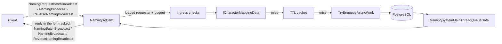

# Naming System

**Short description:** SceneServer lookup service for resolving entity IDs to names and names back to IDs, handling batched and single character and guild naming requests with local cache checks, a per-connection token-bucket budget, coalesced in-flight lookups, and asynchronous database fallback in one query per batch.

## Table of Contents

- [Overview](#overview)
- [Supported Platforms](#supported-platforms)
- [Features](#features)
- [Prerequisites](#prerequisites)
- [Installation / Build](#installation--build)
- [Quick Start Guides](#quick-start-guides)
- [Configuration](#configuration)
- [Usage Examples](#usage-examples)
- [Operational Checks](#operational-checks)
- [Flow Diagram](#flow-diagram)
- [Project Structure](#project-structure)
- [License](#license)

## Overview

The Naming system is the SceneServer lookup service for resolving IDs to names and names back to IDs. It handles client requests for character/guild naming, checks local runtime mappings and TTL caches first, and falls back to asynchronous database lookups when data is not locally available.

The subsystem uses a split execution model:
- **Main thread:** request validation, budget checks, cache lookups, the in-flight tables, and network broadcasts.
- **Async worker:** database lookup operations via `TryEnqueueAsyncWork`.
- **Main-thread queue:** marshaling async lookup results back to safe broadcast context via `INamingSystemMainThreadQueueData`.

Names by ID are asked for in batches: the client queues every ID asked for in a frame and sends one `NamingRequestBatchBroadcast` per type (up to 128 IDs), and the server answers with `NamingBatchBroadcast`. What the server does not hold locally is fetched in ONE query per batch (`ICharacterService.FetchNamesAsync` / `IGuildService.FetchNamesAsync`, `WHERE id = ANY(...)`). Opening a 100-member roster used to cost 100 messages and 100 queries (hot-path audit M18). The single-ID `NamingBroadcast` is still accepted for older clients, and every waiter is answered in the form it asked in (`NamingWaiter`).

All database lookups are coalesced by `InFlightLookupTable` (`CharacterNameByIdInFlight`, `GuildNameByIdInFlight`, `CharacterByNameInFlight`; main thread only, capped at `NamingSystemRuntimeData.MaxInFlightLookups` = 5 000 keys and 256 waiters per key): a request for a key already being fetched joins that fetch and receives its answer — it used to be dropped (hot-path audit M18). A fetch whose answer never comes back (the main-thread queue refused it) is presumed lost after `inFlightStaleSeconds` and restarted by the next request. TTL-based caches for resolved names, IDs, and negative (missing) results are swept periodically to bound memory. Each connection spends from a token bucket (`requestBurst`, `requestsPerSecond`); it replaced a 75 ms window that answered the first request of a burst and dropped the rest, so a 100-member roster opened in one frame lost 99 of its names.

## Supported Platforms

| Platform | Supported | Notes |
|---|---|---|
| Windows | Yes | |
| Linux | Yes | |
| WebGL | N/A | Server-only module |
| Unity 6.3 LTS | Yes | Required engine version |
| IL2CPP | Yes | Supported scripting backend |

## Features

- Batched forward naming resolution (ID → Name) for characters and guilds via `NamingRequestBatchBroadcast` (client → server, at most `MaxIDs` = 128) answered by `NamingBatchBroadcast` (server → client, at most `MaxEntries` = 128 per reply); parallel `long[]`/`string[]` arrays, no custom array serializer needed
- The IDs one request starts lookups for are fetched in one query; replies go out as one batch per waiting connection (`NamingReplyBatches`)
- An empty name in a batched reply means "no such entity": the client releases what was waiting instead of holding it for the session. A lookup whose read failed answers nobody, and the client asks again
- Single-ID forward resolution via `NamingBroadcast`, kept for older clients; its waiters are answered with `NamingBroadcast` and, as before, get no not-found answer (`NamingAnswerRule`)
- Reverse naming resolution (Name → ID) for characters via `ReverseNamingBroadcast`
- Local scene-server `ICharacterMappingData<NetworkConnection>` checked before any database call
- TTL-based caches (`CharacterNameByIdCache`, `GuildNameByIdCache`, `CharacterIdByNameCache`, `CharacterNameByNameCache`) with configurable expiry and bounded sweep
- Negative-result cache (`CharacterMissingByNameCache`) prevents repeated DB lookups for nonexistent names
- Per-connection token bucket via `requestBurst` (200) and `requestsPerSecond` (20), charged one token per ID (`NamingRequestBucket.TryTakeUpTo`); a batch past the budget is answered for its leading IDs and the rest are dropped; the client re-asks
- Both directions require a loaded requester before any lookup work: the forward character-name branch rejects a requester whose `SceneName` is empty, and the reverse path rejects one that is not `IsFlagged(CharacterFlags.IsLoaded)` — without it the reverse lookup was a name-enumeration oracle any authenticated connection could drive at the request budget before it had finished spawning
- In-flight coalescing per lookup key: later requesters wait on the first fetch and every one of them is answered; capped at 5 000 keys and 256 waiters per key, with a staleness bound
- Async database lookups queued via `TryEnqueueAsyncWork` with backpressure (rejects when queue is unavailable/full, logs warning)
- Per-system main-thread queue isolation via `NamingSystemMainThreadQueueData` with configurable drain cap per frame
- Explicit not-found response (`id = 0`, empty name) for failed reverse character lookups
- Oversized name rejection (names exceeding `Authentication.CharacterNameMaxLength` are dropped before any cache or DB work)
- Graceful failure semantics: null/invalid requests return early; missing services abort safely; broadcasts skipped when connection no longer active

## Prerequisites

- **Unity 6.3 LTS**
- **FishNetworking** — networking framework
- **FishMMO Server Core** — provides `ServerBehaviour`, `INamingSystem`, `INamingSystemMainThreadQueueData`, `INamingSystemRuntimeData`, `INamingSystemMappingData`, broadcast types, and `AsyncWorkerData`
- **FishMMO Database** — provides `ICharacterService`, `IGuildService`, and `DatabaseResult<T>`

## Installation / Build

This is an integrated module within FishMMO. It is included as part of the server-side scene-server implementation and does not require separate installation. Ensure the FishMMO Server Core and its dependencies are properly configured in your Unity project.

## Quick Start Guides

1. Ensure `NamingSystem` is present on the scene server GameObject (it inherits from `ServerBehaviour` and implements `INamingSystem<NetworkConnection>`).
2. Verify that the following data containers are registered in `DataContainerRegistry`:
   - `NamingSystemRuntimeData` → `INamingSystemRuntimeData`
   - `NamingSystemMappingData` → `INamingSystemMappingData`
   - `NamingSystemMainThreadQueueData` → `INamingSystemMainThreadQueueData`
   - `AsyncWorkerData` (shared async work queue)
3. On initialize, `NamingSystem` validates all data containers and registers broadcast handlers for `NamingRequestBatchBroadcast`, `NamingBroadcast` and `ReverseNamingBroadcast`.
4. On deinitialize, it drains the remaining main-thread queue and unregisters the broadcast handlers.
5. Clients send `NamingRequestBatchBroadcast` for forward lookups (ID → Name; older clients send `NamingBroadcast`) or `ReverseNamingBroadcast` for reverse lookups (Name → ID); the server resolves from cache or database and replies in the form the request came in (`NamingBatchBroadcast`, `NamingBroadcast` or `ReverseNamingBroadcast`).

## Configuration

### Inspector Parameters

| Parameter | Type | Default | Description |
|---|---|---|---|
| `maxMainThreadActionsPerFrame` | int | 100 | Max naming-system actions drained from main-thread queue per frame |
| `requestBurst` | int | 200 | Naming requests one connection may send in a burst (token bucket capacity); 0 disables the budget |
| `requestsPerSecond` | float | 20 | Requests per second a connection earns back |
| `inFlightStaleSeconds` | float | 15 | Seconds a lookup may be out before the next request for it starts a new one |
| `cacheTtlSeconds` | float | 30.0 | Cache TTL in seconds for naming lookup caches |
| `cacheSweepIntervalSeconds` | float | 1.0 | Seconds between bounded naming cache sweeps |
| `cacheSweepMaxScan` | int | 128 | Maximum cache entries scanned per sweep pass |
| `cacheSweepMaxRemove` | int | 128 | Maximum cache entries removed per sweep pass |

### Internal Constants

| Constant | Value | Description |
|---|---|---|
| `NamingSystemRuntimeData.MaxInFlightLookups` | 5000 | Maximum keys in flight per table; a request for a new key beyond it is not answered |
| `NamingSystemRuntimeData.MaxWaitersPerLookup` | 256 | Maximum connections waiting on one key |

### Threading Model

| Thread | Work |
|---|---|
| Main thread | Request validation, budget checks, cache lookups, in-flight tables and their completion, broadcast dispatch, queue drain, cache sweep |
| Async worker | Database lookups (`FetchNamesAsync` — one query per batch of IDs, `FetchCharacterByNameAsync`) |

## Usage Examples

### Broadcast Handlers

`NamingSystem` registers the following server-side broadcast handlers on initialize:

| Broadcast | Handler | Purpose |
|---|---|---|
| `NamingRequestBatchBroadcast` | `OnServerNamingRequestBatchBroadcastReceived` | Forward lookup: resolve up to 128 IDs → Names, answered with `NamingBatchBroadcast` |
| `NamingBroadcast` | `OnServerNamingBroadcastReceived` | Forward lookup (older clients): resolve one ID → Name |
| `ReverseNamingBroadcast` | `OnServerReverseNamingBroadcastReceived` | Reverse lookup: resolve Name → ID |

### Forward Naming Path (ID → Name)

`OnServerNamingRequestBatchBroadcastReceived(conn, msg, channel)` and, for older clients, `OnServerNamingBroadcastReceived(conn, msg, channel)`:

1. `MayRequestNames`: validates the connection and spawned player object. **Character names** require the requester to be a spawned `IPlayerCharacter` with a non-empty `SceneName` (blocks cross-server name harvesting); **guild names** need only the spawned object. Any other type is ignored.
2. Charges the connection's request budget: one token for a single request (`TryTakeRequestToken`); one per ID for a batch, after cutting it to `MaxIDs` (`TryTakeRequestTokens` → `NamingRequestBucket.TryTakeUpTo`). Only the admitted leading IDs are read, de-duplicated and non-positive IDs dropped (`NamingBatchRequest.SelectIds`).
3. `ResolveNames(conn, type, ids, batched)`, for each ID:
   - **Character name:** local `ICharacterMappingData<NetworkConnection>.CharactersByID` (upserts the cache), else `CharacterNameByIdCache`.
   - **Guild name:** `GuildNameByIdCache`.
   - Known → answered now. Otherwise the connection joins the ID's `InFlightLookupTable` entry as a `NamingWaiter` (connection + form); an ID this request **starts** is added to the request's fetch list.
4. The fetch list goes to the async worker as ONE `FetchNamesAsync(type, ids)` (`ICharacterService.FetchNamesAsync` / `IGuildService.FetchNamesAsync`, `WHERE id = ANY(...)`, capped at 128 in the service too). If the worker refuses it, the keys are released.
5. `CompleteNameLookups` (main thread) completes every ID of the fetch and answers each waiter by `NamingAnswerRule`: found → the name in either form; not found → an empty name for batched waiters, nothing for single ones; read failed → nobody. Batched answers are grouped per connection and sent as one `NamingBatchBroadcast` per 128 names (`NamingReplyBatches`).

### Reverse Naming Path (Name → ID)

`OnServerReverseNamingBroadcastReceived(conn, msg, channel)`:

1. Validates connection and spawned player object.
2. Requires the requester to be an `IPlayerCharacter` flagged `CharacterFlags.IsLoaded`; otherwise returns before the budget is even consulted.
3. Takes one token from the connection's request budget (`TryTakeRequestToken`); drops the request if none is left.
4. Rejects null/whitespace names with immediate not-found response.
5. Rejects oversized names (exceeding `Authentication.CharacterNameMaxLength`) silently, with no reply.
6. Normalizes input to lowercase invariant.
7. **Character name:**
   - Check local `CharactersByLowerCaseName` mapping; if found, upsert caches, clear missing cache, reply immediately.
   - Else check `CharacterMissingByNameCache`; if hit, reply with not-found.
   - Else check `CharacterIdByNameCache` + `CharacterNameByNameCache`; if both hit, reply immediately.
   - Else enqueue async DB lookup (`FetchCharacterByNameAsync`) through `BeginLookup`: joins the lookup already in flight for the key, or starts one.
   - If database unavailable, send not-found response immediately.
8. **Guild name:** Not currently implemented in reverse path.

### Failure Semantics

- Null/invalid requests return early (silent no-op).
- Batched forward lookups answer "no such entity" explicitly (empty name); single-ID forward lookups do not, as before.
- Missing services abort lookup safely without crashing.
- Failed reverse character lookups produce explicit not-found response (`id = 0`, empty name).
- Successful DB lookups for nonexistent names populate `CharacterMissingByNameCache` to avoid repeated queries.
- Broadcasts are skipped when the connection is no longer active.
- `TryEnqueueAsyncWork` returns `false` when the queue is unavailable or full; a warning is logged, the requester is sent `ServerBusyBroadcast`, and the key is released.
- Every fetch hands its result back to the main thread (answered or not) through `CompleteLookup`, which answers every waiter; a refused hand-back leaves the key to go stale and be restarted.

## Operational Checks

| Check | How to Verify |
|---|---|
| Initialization success | Confirm `NamingSystem` logs "Initialized" without errors on server startup |
| Data containers available | Verify `INamingSystemRuntimeData`, `INamingSystemMappingData`, and `INamingSystemMainThreadQueueData` all resolve from `DataContainerRegistry` |
| Batched forward lookup | Send `NamingRequestBatchBroadcast` with 100 uncached character IDs; confirm ONE `SELECT ... WHERE id = ANY(...)` and one `NamingBatchBroadcast` reply with 100 entries (empty names for IDs that do not exist) |
| Mixed-form coalescing | Ask for the same uncached ID with `NamingBroadcast` from one connection and `NamingRequestBatchBroadcast` from another; confirm one query, a `NamingBroadcast` to the first and a `NamingBatchBroadcast` to the second |
| Forward character lookup (cached) | Send `NamingBroadcast` with `CharacterName` type for a locally present character; confirm immediate reply with correct name |
| Forward character lookup (DB) | Send `NamingBroadcast` for a character not on the local scene; confirm async DB fetch and delayed reply |
| Forward guild lookup | Send `NamingBroadcast` with `GuildName` type; confirm cache check then async DB fetch and reply |
| Reverse character lookup (cached) | Send `ReverseNamingBroadcast` for a locally present character name; confirm immediate reply with correct ID |
| Reverse character lookup (DB) | Send `ReverseNamingBroadcast` for a name not locally present; confirm async DB fetch and reply |
| Reverse not-found response | Send `ReverseNamingBroadcast` for a nonexistent character name; confirm reply with `id = 0` and empty name |
| Negative cache hit | Repeat the not-found lookup; confirm no second DB query and immediate not-found reply |
| Oversized name rejection | Send `ReverseNamingBroadcast` with a name exceeding `CharacterNameMaxLength`; confirm no processing occurs |
| Request budget | Send more than `requestBurst` naming requests (or IDs, in batches) from one connection at once; confirm the first `requestBurst` IDs are answered and the rest are dropped until the bucket refills |
| Loaded-requester gate | Send `ReverseNamingBroadcast` from a connection whose character is not yet flagged `IsLoaded`; confirm no lookup and no reply |
| In-flight coalescing | Send forward lookups for the same uncached ID from two connections at once; confirm one DB query is issued and BOTH connections are answered |
| In-flight cap enforcement | Saturate `MaxInFlightLookups` (5 000); confirm lookups for further keys go unanswered |
| Cache sweep | Wait for sweep interval; confirm stale cache entries are removed without errors |
| Main-thread queue drain | Confirm queued async results are dispatched on the main thread within `maxMainThreadActionsPerFrame` per frame |
| Deinitialize cleanup | Trigger deinitialize; confirm broadcast handlers are unregistered and main-thread queue is drained |

## Flow Diagram

### High-Level Overview



### Forward Naming (ID → Name)

```
OnServerNamingRequestBatchBroadcastReceived / OnServerNamingBroadcastReceived
│
├─ 1. MayRequestNames (spawned object; CharacterName: requester loaded in a scene)
├─ 2. Budget: one token per ID (batch cut to MaxIDs first); read the admitted IDs only
│
└─ ResolveNames(conn, type, ids, batched)
   ├─ per ID: CharactersByID / name caches → known → Answer (queued if batched)
   │          else table.Join(id, NamingWaiter(conn, batched))
   │               └── Started → fetch list
   ├─ fetch list → TryEnqueueAsyncWork(FetchNamesAsync(type, ids))   ← ONE query
   │    └── Async: FetchNamesAsync → upsert caches → TryEnqueueMainThread
   │               └── Main thread: CompleteNameLookups
   │                     ├── TryComplete each ID → its waiters
   │                     ├── NamingAnswerRule per waiter (form + found/not found)
   │                     └── SendReplyBatches → NamingBatchBroadcast per connection
   └─ SendReplyBatches (answers known at once)
```

### Reverse Naming (Name → ID)

```
OnServerReverseNamingBroadcastReceived(conn, msg, channel)
│
├─ 1. Validate connection + spawned object
├─ 1b. Require requester IPlayerCharacter flagged CharacterFlags.IsLoaded
├─ 2. Take a token from the connection's request budget
├─ 3. Reject null/whitespace name → SendReverseNamingBroadcast(id=0, empty)
├─ 4. Reject oversized name (> CharacterNameMaxLength)
├─ 5. Normalize name to lowercase invariant
│
├─ CharacterName:
│  ├─ 6a. Check local CharactersByLowerCaseName mapping
│  │      └── Hit → upsert caches, clear missing cache, SendReverseNamingBroadcast
│  ├─ 6b. Check CharacterMissingByNameCache
│  │      └── Hit → SendReverseNamingBroadcast(id=0, empty)
│  ├─ 6c. Check CharacterIdByNameCache + CharacterNameByNameCache
│  │      └── Both hit → SendReverseNamingBroadcast
│  └─ 6d. BeginLookup → join the fetch in flight, or TryEnqueueAsyncWork(FetchCharacterByNameAsync)
│         ├── Async: DB fetch found → upsert caches, clear missing cache
│         │          → TryEnqueueMainThread → SendReverseNamingBroadcast
│         └── Async: DB fetch not found → upsert missing cache
│                    → TryEnqueueMainThread → SendReverseNamingBroadcast(id=0, empty)
│
└─ GuildName:
   └── Not currently implemented in reverse path
```

### Cache Sweep (OnUpdate)

```
OnUpdate(deltaTime)
│
├─ 1. DrainMainThreadQueue (up to maxMainThreadActionsPerFrame)
└─ 2. SweepCaches()
       ├── Check if sweep interval has elapsed
       ├── Sweep ConnectionRequestBuckets (idle budgets) and stale in-flight lookups
       └── Sweep all naming mapping caches (TTL-based, bounded scan/remove)
```

## Project Structure

### Directory Structure

```
Naming/
├── NamingSystem.cs                    # Batched/single/reverse naming handlers, request budget, cache checks, coalesced async DB lookups (one query per batch)
├── NamingSystemMappingData.cs         # Character/guild name ↔ ID TTL cache data container
├── NamingSystemRuntimeData.cs         # Runtime state: in-flight lookup tables, request budgets, sweep timer
├── NamingSystemMainThreadQueueData.cs # Per-system main-thread action queue container
└── README.md
```

### Related Core Contracts

- `Server/Core/World/SceneServer/Naming/INamingSystem.cs`
- `Server/Core/World/SceneServer/Naming/INamingSystemRuntimeData.cs`
- `Server/Core/World/SceneServer/Naming/INamingSystemMappingData.cs`
- `Server/Core/World/SceneServer/Naming/INamingSystemMainThreadQueueData.cs`
- `Server/Core/World/SceneServer/Naming/InFlightLookupTable.cs` (in-flight table, `NamingRequestBucket`)
- `Server/Core/World/SceneServer/Naming/NamingBatch.cs` (`NamingWaiter`, `NamingAnswerRule`, `NamingBatchRequest`, `NamingReplyBatches`)
- Client side: `Client/ClientNamingSystem.cs` and `Client/PendingNameRequests.cs` (per-frame coalescing, retry-on-ask, not-found release)

### Inheritance Hierarchy

```
ServerBehaviour
└── NamingSystem : INamingSystem<NetworkConnection>

RuntimeDataContainer
├── NamingSystemRuntimeData : INamingSystemRuntimeData
└── NamingSystemMappingData : INamingSystemMappingData

SystemMainThreadQueueData
└── NamingSystemMainThreadQueueData : INamingSystemMainThreadQueueData
```

## License

This project is subject to the FishMMO project license.
