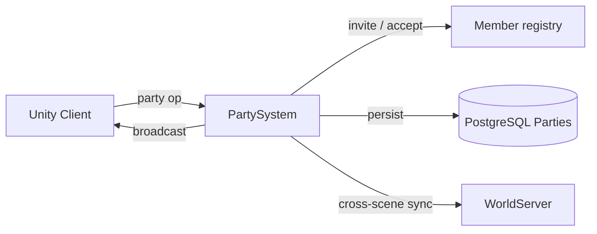

# Party System

**Short description:** SceneServer social subsystem for party lifecycle and member synchronization, handling party creation, invitations, accept/decline, leaving, member removal, rank transfer, periodic membership reconciliation, a per-tick live vitals pump with per-encounter combat meters, achievement triggers, and chat-based invite commands.

## Table of Contents

- [Overview](#overview)
- [Supported Platforms](#supported-platforms)
- [Features](#features)
- [Prerequisites](#prerequisites)
- [Installation / Build](#installation--build)
- [Quick Start Guides](#quick-start-guides)
- [Configuration](#configuration)
- [Usage Examples](#usage-examples)
- [Operational Checks](#operational-checks)
- [Flow Diagram](#flow-diagram)
- [Project Structure](#project-structure)
- [License](#license)

## Overview

The Party system is the SceneServer social subsystem for party lifecycle and member synchronization. It handles party creation, invitations, invitation accept/decline, leaving, member removal, rank transfer, periodic membership reconciliation, the live member-vitals pump, and party chat invite commands.

The implementation uses a split execution model:
- **Main thread:** request validation, in-memory controller/tracker updates, ingress guard checks, invitation sweep, and network broadcasts.
- **Async worker:** database reads/writes and party update marker persistence via `TryEnqueueAsyncWork`.
- **Main-thread queue:** marshaling async completion actions back to Unity/FishNet-safe context via `IPartySystemMainThreadQueueData`.

All party mutations emit a party update marker (`IPartyUpdateService.PersistAsync`, stamped by the database clock) so that other scene servers can reconcile their local party lists during `FetchAndProcessPartyUpdatesAsync`; a marker the database refuses transiently is owed and retried from the periodic update. Pending invitations are tracked in a `LastSeenCacheTracker` with configurable TTL and bounded sweep. Per-connection ingress guards enforce debounce and in-flight exclusion across all seven party operations.

## Supported Platforms

| Platform | Supported | Notes |
|---|---|---|
| Windows | Yes | |
| Linux | Yes | |
| WebGL | N/A | Server-only module |
| Unity 6.3 LTS | Yes | Required engine version |
| IL2CPP | Yes | Supported scripting backend |

## Features

- Party creation with automatic leader assignment and database persistence
- Chat-based party invite commands (`/pi`, `/invite`) resolving targets by lowercase character name
- Invitation flow with pending-invite tracking, TTL expiration, and bounded cleanup sweep
- Accept/decline invitation with capacity checks and membership persistence
- Party leave hands leadership on before the leaver's row is deleted, to the lowest-ID remaining member (an online one preferred while `transferLeadershipOnDisconnect` is on). `EnsurePartyLeadershipAsync` is the single place leadership is settled, and never at random: two scene servers repairing the same party must reach the same answer
- Party deletion when the last member leaves
- Leader-initiated member removal with rank validation
- Leader-initiated rank transfer (promote member to leader, demote self to member) with rollback on partial failure
- Periodic party update pump fetching database changes and broadcasting `PartyAddMultipleBroadcast` snapshots (one `PartyID` plus a `PartyAddEntry[]` of `CharacterID`, `Rank`, and a quantised `HealthPCT` byte) to local online members, one multicast per party (`INetworkManagerWrapper.Broadcast(HashSet<NetworkConnection>, …)`, serialised once)
- The pump's watermark follows `UpdatePumpWatermark`, the rule it shares with the guild pump: taken before the fetch is sent, less `partyUpdateClockSkewAllowanceSeconds`; an update whose roster could not be read holds the mark at its timestamp for up to the retry horizon (ten times the skew allowance, at least 60 s) and is then given up with an error; a processed-update record, kept for twice the horizon, lets updates still inside the window be skipped rather than re-read
- Bulk reads: one `ICharacterPartyService.FetchManyAsync(long[])` roster query and one `FetchOnlineMemberIdsAsync(long[])` query per pump pass (and per leadership audit sweep), not one of each per changed party
- Leadership repair: every party the pump reads is settled (no leader or two leaders → the lowest ID; a leader offline for `leadershipAbsenceGraceSeconds`, seen twice, is replaced when `transferLeadershipOnDisconnect` is on), a member's disconnect schedules a re-check after `leadershipRecheckDelaySeconds`, and a slow round-robin audit (`leadershipAuditIntervalSeconds`, `leadershipAuditPartiesPerSweep`) covers parties nothing announces, such as those on a scene server that died
- Per-target invite cooldown (`perTargetInviteCooldownSeconds`), so one player cannot keep an invitation modal on another's screen
- Removed-member detection via diff between cached and fetched member sets, with immediate `PartyLeaveBroadcast` dispatch
- Per-connection ingress debounce and in-flight guard across all seven operations (`Create`, `Invite`, `AcceptInvite`, `DeclineInvite`, `Leave`, `Remove`, `ChangeRank`)
- Bounded ingress guard sweep with configurable TTL, interval, and max removals
- Achievement integration via configurable `PartyCreateAchievementTemplate` and `PartyJoinAchievementTemplate`
- Character connect/disconnect hooks for tracker maintenance and health-percentage persistence
- Async worker backpressure via `TryEnqueueAsyncWork` (rejects when queue unavailable/full, logs warning)
- Per-system main-thread queue isolation with configurable drain cap per frame
- Live member vitals pushed every periodic tick from in-memory controllers (`BroadcastPartyVitals`), never from the database: the roster row's health is written only on connect and disconnect, so a bar fed from it sat frozen for the whole session
- Vitals are grouped by **Unity scene handle**, not by scene server: one payload per scene group, so a player in a dungeon is never told the live health of a member standing in a city
- Absence is the signal — a member on another scene server, in another scene, or offline is simply omitted, and the client greys them out by counting the pumps they were missing from. The recipient's own row is therefore always included even though the client ignores its values and derives its own bars from the local reconciled controller every tick
- Quantised payload (`PartyVitalsQuantiser`): the three fractions travel as one byte each (0..255) and the meters as `ushort` points per second, replacing four bytes per value with one or two
- The buff array — by far the largest part of the payload — is sent only when some recipient does not already hold the current set. The set's signature (`ComputeObservedBuffSignature`) covers template, stacks and each buff's absolute expiry in whole seconds (`BuffExpirySecond`), not the time remaining, so a buff counting down does not re-send; the client counts down from the last array it was sent. Whether to send is decided per **recipient** (`ObservedBuffDeliveryLedger`): the array goes out when any recipient in the scene group was not last sent this member's signature, so a member joining the party or walking into the scene receives even a permanent buff. `PartyMemberVitalsEntry.BuffsChanged` says whether `Buffs` is authoritative. A recipient's record is forgotten when it disconnects and whenever the pump delivers it a roster or evicts it, because the client rebuilds member rows from a roster change
- Buffs are read straight from `IBuffController.Buffs` at the server's current tick (`Buff.RemainingSeconds`), so nothing has to be re-based against the age of a push, and expired entries are dropped rather than sent as a zero-length bar; capped at `maxVitalsBuffsPerMember`
- Per-encounter damage and healing meters in `PartyCombatMeterData`, fed by `ICharacterDamageController.OnDamaged` / `OnHealed`. Credit resolves to the controlling **player** (a `Pet`'s contribution counts for its `PetOwner`), unmetered characters are rejected early, and an encounter is defined purely by activity: `encounterTimeoutSeconds` of quiet starts a new one, with `meterMinimumWindowSeconds` as the divisor floor so an opening hit cannot divide by ~0
- Optimistic concurrency via versioned `CharacterPartyData` for all membership mutations
- Graceful failure semantics: invalid requests fail closed with no mutation; permission/capacity checks enforced before persistence; async failures logged without blocking main thread

## Prerequisites

- **Unity 6.3 LTS**
- **FishNetworking** — networking framework
- **FishMMO Server Core** — provides `ServerBehaviour`, `IPartySystem`, `IPartySystemRuntimeData`, `IPartySystemMainThreadQueueData`, `IPartyCharacterMappingData`, broadcast types (`PartyCreateBroadcast`, `PartyInviteBroadcast`, `PartyAcceptInviteBroadcast`, `PartyDeclineInviteBroadcast`, `PartyLeaveBroadcast`, `PartyRemoveBroadcast`, `PartyChangeRankBroadcast`, `PartyAddBroadcast`, `PartyAddMultipleBroadcast`, `ChatBroadcast`), `IngressGuard`, `AsyncWorkerData`, and `ChatHelper`
- **FishMMO Database** — provides `IPartyService`, `ICharacterPartyService`, `IPartyUpdateService`, `CharacterPartyData`, `PartyUpdateData`, and `DatabaseResult<T>`

## Installation / Build

This is an integrated module within FishMMO. It is included as part of the server-side scene-server implementation and does not require separate installation. Ensure the FishMMO Server Core and its dependencies are properly configured in your Unity project.

## Quick Start Guides

1. Ensure `PartySystem` is present on the scene server GameObject (it inherits from `ServerBehaviour` and implements `IPartySystem<NetworkConnection>`). The asset is created via `Create > FishMMO > Server > SceneServer > Party System`.
2. Verify that the following data containers are registered in `DataContainerRegistry`:
   - `PartySystemRuntimeData` → `IPartySystemRuntimeData`
   - `PartyCharacterMappingData` → `IPartyCharacterMappingData`
   - `PartySystemMainThreadQueueData` → `IPartySystemMainThreadQueueData`
   - `PartyCombatMeterData` → `IPartyCombatMeterData`
   - `AsyncWorkerData` (shared async work queue)
3. Verify that `ICharacterSystem<NetworkConnection, Scene>` is registered in `BehaviourRegistry` for connect/disconnect event subscriptions.
4. Optionally assign `PartyCreateAchievementTemplate` and `PartyJoinAchievementTemplate` in the inspector to trigger achievements on party creation and joining.
5. On initialize, `PartySystem` registers chat commands (`/pi`, `/invite`), broadcast handlers for all seven party operations, character connect/disconnect callbacks, and a periodic update callback at `UpdatePumpRate` interval.
6. On deinitialize, it drains the remaining main-thread queue, unregisters broadcast handlers, unsubscribes character callbacks, and unregisters the periodic callback.
7. Clients send the appropriate broadcast to trigger party operations; the server validates, persists to database, and replies with result broadcasts.

## Configuration

### Inspector Parameters

| Parameter | Type | Default | Description |
|---|---|---|---|
| `maxMainThreadActionsPerFrame` | int | 100 | Max party-system actions drained from main-thread queue per frame |
| `maxPartySize` | int | 6 | Maximum number of members allowed in a party |
| `updatePumpRate` | float | 1.0 | Periodic party update pump rate limit in seconds |
| `partyUpdateClockSkewAllowanceSeconds` | float | 5.0 | Seconds the pump's watermark is held back for skew between this server's clock and the database's; also sets the retry horizon (10×, at least 60 s) |
| `invitationTtlSeconds` | float | 45.0 | Invitation lifetime in seconds before automatic expiration |
| `invitationSweepIntervalSeconds` | float | 1.0 | Seconds between bounded invitation cleanup sweeps |
| `invitationSweepMaxScan` | int | 128 | Maximum invitation entries scanned per cleanup sweep |
| `invitationSweepMaxRemove` | int | 128 | Maximum invitation entries removed per cleanup sweep |
| `perTargetInviteCooldownSeconds` | float | 60.0 | Minimum seconds between invitations from the same inviter to the same target (0 disables) |
| `ingressDebounceMilliseconds` | int | 100 | Minimum milliseconds between party requests per connection and operation |
| `ingressSweepIntervalSeconds` | float | 5.0 | Seconds between bounded ingress guard cleanup sweeps |
| `ingressEntryTtlSeconds` | float | 30.0 | Seconds before stale ingress guard entries are removed |
| `ingressSweepMaxRemovals` | int | 128 | Maximum stale ingress guard entries removed per sweep |
| `encounterTimeoutSeconds` | float | 6.0 | Idle seconds after which the DPS/HPS meters reset for a new encounter |
| `meterMinimumWindowSeconds` | float | 1.0 | Minimum seconds used as the DPS/HPS divisor |
| `meterSweepIntervalSeconds` | float | 10.0 | Seconds between bounded combat meter cleanup sweeps |
| `meterSweepMaxScan` | int | 64 | Max combat meter entries scanned per sweep |
| `meterSweepMaxRemove` | int | 64 | Max combat meter entries removed per sweep |
| `maxVitalsBuffsPerMember` | int | 16 | Max buffs/debuffs sent per member on the vitals pump |
| `transferLeadershipOnDisconnect` | bool | true | Move leadership to a logged-in member when the holder is not online anywhere |
| `leadershipAuditIntervalSeconds` | float | 30.0 | Seconds between leadership audit sweeps (min 5) |
| `leadershipAuditPartiesPerSweep` | int | 4 | Parties examined per audit sweep, round-robin |
| `leadershipRecheckMaxPerTick` | int | 16 | Max scheduled leadership re-checks started per tick |
| `leadershipRecheckDelaySeconds` | float | 5.0 | Seconds after a member disconnects before the party's leadership is re-examined |
| `leadershipAbsenceGraceSeconds` | float | 45.0 | Seconds a leader must be continuously offline before leadership moves (min 10; must exceed the slowest scene load) |
| `PartyCreateAchievementTemplate` | AchievementTemplate | — | Achievement template incremented when a party is created |
| `PartyJoinAchievementTemplate` | AchievementTemplate | — | Achievement template incremented when a player joins a party |

### Chat Commands

| Command | Description |
|---|---|
| `/pi <name>` | Invite a character by name to the sender's party |
| `/invite <name>` | Alias for `/pi` |

### Threading Model

| Thread | Work |
|---|---|
| Main thread | Request validation, ingress guards, invitation sweep, ingress sweep, combat meter sweep, controller/tracker updates, vitals pump, broadcast dispatch, queue drain |
| Async worker | Database reads/writes (`CreatePartyAsync`, `ValidateAndSendPartyInviteAsync`, `AcceptPartyInviteAsync`, `LeavePartyAsync`, `RemovePartyMemberAsync`, `ChangePartyRankAsync`, `FetchAndProcessPartyUpdatesAsync`, `AuditPartyLeadershipAsync`, `RetryPartyUpdateAnnouncementsAsync`, `PersistPartyMemberAndNotifyAsync`, `PersistPartyUpdateAsync`) |

## Usage Examples

### Broadcast Handlers

`PartySystem` registers the following server-side broadcast handlers on initialize:

| Broadcast | Handler | Purpose |
|---|---|---|
| `PartyCreateBroadcast` | `OnServerPartyCreateBroadcastReceived` | Create a new party with the requester as leader |
| `PartyInviteBroadcast` | `OnServerPartyInviteBroadcastReceived` | Invite a target character to the inviter's party |
| `PartyAcceptInviteBroadcast` | `OnServerPartyAcceptInviteBroadcastReceived` | Accept a pending party invitation |
| `PartyDeclineInviteBroadcast` | `OnServerPartyDeclineInviteBroadcastReceived` | Decline a pending party invitation |
| `PartyLeaveBroadcast` | `OnServerPartyLeaveBroadcastReceived` | Leave the current party |
| `PartyRemoveBroadcast` | `OnServerPartyRemoveBroadcastReceived` | Remove a member from the party (leader only) |
| `PartyChangeRankBroadcast` | `OnServerPartyChangeRankBroadcastReceived` | Transfer leadership to another member (leader only) |

### Create Party

`OnServerPartyCreateBroadcastReceived(conn, msg, channel)`:

1. Validates connection, spawned object, and ingress guard.
2. Confirms the requester is not already in a party (`partyController.ID == 0`).
3. Captures character ID and health percentage.
4. Enqueues `CreatePartyAsync`:
   - Creates party via `IPartyService.CreateAsync`.
   - Persists leader membership via `ICharacterPartyService.PersistAsync`.
   - Marshals to main thread: sets controller ID/rank, adds tracker entry, broadcasts `PartyCreateBroadcast` (party ID only — the scene name it used to carry told the client nothing it did not already know), increments `PartyCreateAchievementTemplate`.

### Invite / Accept / Decline

**Invite** (`OnServerPartyInviteBroadcastReceived`):
1. Validates inviter is a party leader.
2. Enqueues `ValidateAndSendPartyInviteAsync`:
   - Checks party capacity via `ICharacterPartyService.CountAsync`.
   - Marshals to main thread: adds pending invitation, validates target not already in a party (sends error chat if so), sends `PartyInviteBroadcast` to target.

**Accept** (`OnServerPartyAcceptInviteBroadcastReceived`):
1. Validates requester is not in a party and has a pending invitation.
2. Enqueues `AcceptPartyInviteAsync`:
   - Re-checks party capacity via `ICharacterPartyService.FetchManyAsync`.
   - Persists membership and party update marker.
   - Marshals to main thread: sets controller ID/rank, removes pending invitation, adds tracker entry, broadcasts `PartyAddBroadcast` (a `PartyID` plus one `PartyAddEntry` member row) to the new member, increments `PartyJoinAchievementTemplate`.

**Decline** (`OnServerPartyDeclineInviteBroadcastReceived`):
1. Validates connection and removes the pending invitation entry (synchronous, no async work).

### Leave / Remove / Rank Change

**Leave** (`OnServerPartyLeaveBroadcastReceived`):
1. Validates requester is in a party.
2. Enqueues `LeavePartyAsync`:
   - Fetches current members.
   - If the leaver leads and others remain, settles leadership first (`EnsurePartyLeadershipAsync`: the lowest-ID online member, else the lowest-ID member).
   - Deletes the leaving member via versioned `DeleteAsync`.
   - If no members remain, deletes the party and its update marker; otherwise persists update marker.
   - Marshals to main thread: resets controller, removes tracker, broadcasts `PartyLeaveBroadcast`.

**Remove** (`OnServerPartyRemoveBroadcastReceived`):
1. Validates requester is leader and target is not self.
2. Enqueues `RemovePartyMemberAsync`:
   - Fetches target member and verifies party membership.
   - Deletes via versioned `DeleteAsync`.
   - Marshals tracker removal to main thread.
   - Persists update marker for cross-server reconciliation.

**Rank Change** (`OnServerPartyChangeRankBroadcastReceived`):
1. Validates requester is leader and target is not self.
2. Enqueues `ChangePartyRankAsync`:
   - Fetches both leader and target member data with versions.
   - Promotes target to leader first (avoids zero-leader state).
   - Demotes old leader to member.
   - On demotion failure, rolls back the target promotion and logs a warning.
   - On rollback failure, logs a critical error for manual correction.
   - Persists update marker on success.

### Periodic Update Pump

`OnPeriodicUpdate(deltaTime)` fires at `UpdatePumpRate` intervals. It first pushes vitals (below), prunes the runtime caches, drains due leadership re-checks and owed update announcements, and runs the leadership audit when due; then:
1. Acquires pump lock via `TryBeginUpdatePump` (atomic compare-exchange).
2. Snapshots tracked party IDs and the watermark (`LastFetchTime`) on main thread.
3. Enqueues `FetchAndProcessPartyUpdatesAsync`:
   - Takes the new mark **before** the fetch: now, less `partyUpdateClockSkewAllowanceSeconds` (`UpdatePumpWatermark.FetchStarted`). An update written while the round trip is in flight is therefore fetched again next pass, never skipped.
   - Fetches party updates via `IPartyUpdateService.FetchAsync(partyIds, lastFetch)`; a failed fetch leaves the mark where it was.
   - Keeps the newest update per party that the processed-update record does not already cover.
   - Reads every such party's roster in one `ICharacterPartyService.FetchManyAsync(long[])`. A party whose roster did not come back holds the mark at its update (`UpdatePumpWatermark.Classify`/`Hold`) so the next pass retries it, until the update is older than the retry horizon, when it is given up with an error.
   - Reads who is online in the same parties in one `FetchOnlineMemberIdsAsync(long[])`, settles each party's leadership (`RepairPartyLeadershipAsync`), and re-reads the rosters it changed.
   - Marshals to main thread:
     - Moves `LastFetchTime` to the (possibly held) mark — also when nothing new was read, so the mark cannot freeze.
     - `ApplyPartySnapshot` per party: computes removed members (diff previous cached vs current), untracks them, and for a removed member whose controller still names this party clears it and sends `PartyLeaveBroadcast`.
     - Refreshes `PartyMemberTracker` cache.
     - Sends one `PartyAddMultipleBroadcast` (`PartyID` once, then a `PartyAddEntry` per member: `CharacterID`, `Rank`, quantised `HealthPCT`) to the local online members whose controller names this party, as one multicast, and forgets each of them in the buff ledger.
   - Records each party whose snapshot was handed to the main thread as processed (only once the hand-off succeeded).
4. Releases pump lock in `finally`.

### Live Member Vitals

`BroadcastPartyVitals()` runs at the top of every `OnPeriodicUpdate`, independently of the
database pump and of whether that pump is in flight:

1. For each tracked party, `GroupPartyMembersByScene` buckets the members this scene server
   hosts by `GameObject.scene.handle` (lists come from a pool and are returned by
   `ReleaseSceneGroups`).
2. `BroadcastSceneGroupVitals` builds one `PartyMemberVitalsEntry` per member:
   - `BuildObservedBuffs` copies `IBuffController.Buffs` at the current domain tick, dropping
     anything already expired and stopping at `maxVitalsBuffsPerMember`; a member with no buffs
     yields null rather than an empty array.
   - `ObservedBuffDeliveryLedger.NeedsSend` asks whether any recipient in the group was not last
     sent that set's signature; if so the array is included, `BuffsChanged` is set and every
     recipient is recorded as holding it (`MarkSent`). Otherwise `Buffs` travels as null.
   - The three resource fractions go through `PartyVitalsQuantiser.FractionToByte`, and the
     meter sample (`IPartyCombatMeterData.GetSample`) through `RateToUInt16`.
3. One `PartyMemberVitalsUpdateBroadcast` goes to every member of the group, including the
   one each row describes, as one multicast serialised once.

Meters are fed outside this path, from `ICharacterDamageController.OnDamaged` / `OnHealed` via
`RecordCombatMeterContribution`, and swept on a bounded cycle by `SweepCombatMeters`.
`CharacterSystem_OnDisconnect` forgets both the character's meter and its buff-ledger record as a recipient, whether or not they were in a party.

### Failure Semantics

- Invalid requests fail closed with no mutation.
- Permission/capacity checks are enforced before persistence.
- Async failures are logged and do not block the main thread.
- Main-thread completion paths revalidate runtime state before mutating or broadcasting.
- Rank-change rollback protects against partial-failure two-leader states.
- `TryEnqueueAsyncWork` returns `false` when the queue is unavailable or full; a warning is logged.
- Ingress guards are always released in `finally` blocks or via `TryEnqueueIngressWork` deferred release.

## Operational Checks

| Check | How to Verify |
|---|---|
| Initialization success | Confirm `PartySystem` logs "Initialized (MaxPartySize=6, UpdatePumpRate=1s)" without errors on server startup |
| Data containers available | Verify `IPartySystemRuntimeData`, `IPartyCharacterMappingData`, and `IPartySystemMainThreadQueueData` all resolve from `DataContainerRegistry` |
| Chat commands registered | Confirm `/pi` and `/invite` are available in party chat and route to `OnPartyInvite` |
| Party creation | Send `PartyCreateBroadcast` from a character not in a party; confirm the `PartyCreateBroadcast` reply carries the new party ID |
| Party invite | As party leader, send `PartyInviteBroadcast` with a valid target; confirm target receives `PartyInviteBroadcast` |
| Invite target already in party | Invite a character already in a party; confirm inviter receives `ChatBroadcast` with `PARTY_ERROR_TARGET_IN_PARTY` |
| Accept invitation | Target sends `PartyAcceptInviteBroadcast`; confirm `PartyAddBroadcast` reply with correct party ID, rank, and health |
| Decline invitation | Target sends `PartyDeclineInviteBroadcast`; confirm pending invitation is removed |
| Invitation TTL expiry | Wait beyond `invitationTtlSeconds`; confirm expired invitations are swept and no longer accepted |
| Party leave (member) | Member sends `PartyLeaveBroadcast`; confirm `PartyLeaveBroadcast` reply and tracker removal |
| Party leave (leader) | Leader sends `PartyLeaveBroadcast` with other members present; confirm leadership passes to the lowest-ID online member before the leaver's row is deleted |
| Party leave (last member) | Last member sends `PartyLeaveBroadcast`; confirm party and update marker are deleted |
| Member removal | Leader sends `PartyRemoveBroadcast` for a member; confirm member is removed and update marker persisted |
| Self-removal prevention | Leader sends `PartyRemoveBroadcast` targeting self; confirm request is rejected |
| Rank change | Leader sends `PartyChangeRankBroadcast`; confirm leadership is transferred and update marker persisted |
| Rank change rollback | Simulate demotion failure after promotion; confirm target promotion is rolled back |
| Periodic update pump | Wait for `UpdatePumpRate`; confirm `FetchAndProcessPartyUpdatesAsync` fires and members receive `PartyAddMultipleBroadcast` |
| Removed member detection | Remove a member on another server; confirm local server detects the diff and sends `PartyLeaveBroadcast` |
| Vitals pump | Take damage in a party; confirm party members in the same scene receive `PartyMemberVitalsUpdateBroadcast` with a changed `HealthPCT` byte within one tick |
| Cross-scene isolation | Put two party members in different scenes on one scene server; confirm neither appears in the other's vitals payload |
| Buff gating | Hold a steady buff set, including a timed buff counting down; confirm entries arrive with `BuffsChanged = false` and a null `Buffs`, and that gaining, losing or refreshing a buff sends the set again |
| Joiner receives buffs | With a member wearing a permanent buff, have another character join the party (or walk into their scene); confirm the joiner's first payload carries that member's buff array |
| Buff signature reset | Move a member to another scene server and back; confirm their first payload carries the buff array again |
| Combat meter | Deal damage through a pet; confirm the owner's `DamagePerSecond` moves, and that it returns to 0 after `encounterTimeoutSeconds` of quiet |
| Ingress debounce | Send rapid consecutive party requests from the same connection; confirm excess requests are dropped |
| Ingress in-flight guard | Send overlapping async party requests; confirm only one is processed at a time per operation type |
| Ingress sweep | Wait for `ingressSweepIntervalSeconds`; confirm stale guard entries are cleaned up |
| Character connect | Connect a character in a party; confirm tracker is updated and `PersistPartyMemberAndNotifyAsync` fires |
| Character disconnect | Disconnect a character in a party; confirm tracker is updated, pending invitations cleared, `PersistPartyUpdateAsync` fires, and a leadership re-check is scheduled |
| Leader absence | Disconnect the leader and keep them offline; confirm leadership moves to an online member no sooner than `leadershipAbsenceGraceSeconds` later, and that zoning (a scene transfer) does not move it |
| Pump watermark | Make a party's roster read fail on one server; confirm the update is re-read on later passes and given up with an error after the retry horizon, and that other parties' updates still arrive |
| Tracker cleanup | Disconnect the last local member of a party; confirm both `PartyCharacterTracker` and `PartyMemberTracker` entries are removed |
| Achievement trigger | Create or join a party with achievement templates assigned; confirm achievement controllers are incremented |
| Main-thread queue drain | Confirm queued async results are dispatched on the main thread within `maxMainThreadActionsPerFrame` per frame |
| Async backpressure | Saturate async worker queue; confirm new work is rejected with a logged warning |
| Deinitialize cleanup | Trigger deinitialize; confirm broadcast handlers unregistered, character callbacks unsubscribed, periodic callback unregistered, and main-thread queue drained |

## Flow Diagram

### High-Level Overview



### Create Party

```
OnServerPartyCreateBroadcastReceived(conn, msg, channel)
│
├─ 1. Validate connection + spawned object
├─ 2. Acquire ingress guard (Create)
├─ 3. Confirm requester not already in a party
├─ 4. Capture characterID, healthPCT, worldServerID
└─ 5. TryEnqueueIngressWork → CreatePartyAsync
       │
       ├─ IPartyService.CreateAsync → newPartyID
       ├─ ICharacterPartyService.PersistAsync (leader membership)
       └─ TryEnqueueMainThread
              ├─ Set partyController.ID = newPartyID, Rank = Leader
              ├─ AddPartyCharacterTracker(newPartyID, characterID)
              ├─ Broadcast PartyCreateBroadcast to conn
              └─ Increment PartyCreateAchievementTemplate
```

### Invite → Accept

```
OnServerPartyInviteBroadcastReceived(conn, msg, channel)
│
├─ 1. Validate inviter is party leader
├─ 2. Acquire ingress guard (Invite)
└─ 3. TryEnqueueIngressWork → ValidateAndSendPartyInviteAsync
       │
       ├─ ICharacterPartyService.CountAsync (capacity check)
       └─ TryEnqueueMainThread
              ├─ TryAddPendingInvitation(target, partyID)
              ├─ Validate target not already in party
              │    └── Already in party → ChatBroadcast error to inviter, remove pending
              └─ Broadcast PartyInviteBroadcast to target

OnServerPartyAcceptInviteBroadcastReceived(conn, msg, channel)
│
├─ 1. Validate requester not already in a party
├─ 2. Acquire ingress guard (AcceptInvite)
├─ 3. Validate pending invitation exists
└─ 4. TryEnqueueIngressWork → AcceptPartyInviteAsync
       │
       ├─ ICharacterPartyService.FetchManyAsync (re-check capacity)
       ├─ ICharacterPartyService.PersistAsync (member)
       ├─ IPartyUpdateService.PersistAsync (marker)
       └─ TryEnqueueMainThread
              ├─ Set partyController.ID, Rank = Member
              ├─ RemovePendingInvitation
              ├─ AddPartyCharacterTracker
              ├─ Broadcast PartyAddBroadcast to new member
              └─ Increment PartyJoinAchievementTemplate
```

### Leave Party

```
OnServerPartyLeaveBroadcastReceived(conn, msg, channel)
│
├─ 1. Validate requester is in a party
├─ 2. Acquire ingress guard (Leave)
└─ 3. TryEnqueueIngressWork → LeavePartyAsync
       │
       ├─ ICharacterPartyService.FetchManyAsync (current members)
       ├─ If leader + others remain:
       │    └─ EnsurePartyLeadershipAsync (lowest-ID online member) → UpdateRankAsync
       ├─ ICharacterPartyService.DeleteAsync (leaving member, versioned)
       ├─ If no remaining members:
       │    ├─ IPartyService.DeleteAsync
       │    └─ IPartyUpdateService.DeleteAsync
       ├─ Else: IPartyUpdateService.PersistAsync
       └─ TryEnqueueMainThread
              ├─ Reset partyController (ID=0, Rank=None)
              ├─ RemovePartyCharacterTracker
              └─ Broadcast PartyLeaveBroadcast to conn
```

### Rank Change

```
OnServerPartyChangeRankBroadcastReceived(conn, msg, channel)
│
├─ 1. Validate requester is leader, target is not self
├─ 2. Acquire ingress guard (ChangeRank)
└─ 3. TryEnqueueIngressWork → ChangePartyRankAsync
       │
       ├─ Fetch leader + target CharacterPartyData (with versions)
       ├─ Verify both in same party
       ├─ UpdateRankAsync(target → Leader)   ← promote first
       ├─ UpdateRankAsync(leader → Member)   ← demote second
       │    └── Failure → rollback target back to original rank
       └─ IPartyUpdateService.PersistAsync
```

### Periodic Update Pump

```
OnPeriodicUpdate(deltaTime)
│
├─ 1. Check Initialized + Server started
├─ 2. BroadcastPartyVitals, SweepPartyRuntimeCaches, DrainLeadershipRechecks,
│     DrainPartyUpdateRetries, AuditPartyLeadership
├─ 3. TryBeginUpdatePump (atomic lock)
├─ 4. Snapshot partyIds + LastFetchTime on main thread
└─ 5. TryEnqueueAsyncWork → FetchAndProcessPartyUpdatesAsync
       │
       ├─ mark = UpdatePumpWatermark.FetchStarted(now, skew)   [before the fetch]
       ├─ IPartyUpdateService.FetchAsync(partyIds, lastFetch)
       ├─ Skip updates already in the processed-update record
       ├─ ICharacterPartyService.FetchManyAsync(long[])        [one query, every changed party]
       │    └─ roster missing → Classify/Hold: hold the mark (Retry) or give up (GiveUp)
       ├─ FetchOnlineMemberIdsAsync(long[]) → RepairPartyLeadershipAsync per party
       │    └─ repaired → FetchManyAsync(repaired) again
       └─ TryEnqueueMainThread
              ├─ LastFetchTime = mark
              └─ ApplyPartySnapshot per party:
                   ├─ Diff previous cached members vs current
                   ├─ Removed members → untrack; controller still names this party →
                   │    reset controller, forget in buff ledger, Broadcast PartyLeaveBroadcast
                   ├─ Update PartyMemberTracker cache
                   └─ One PartyAddMultipleBroadcast multicast to local members naming this party
       ├─ Hand-off succeeded → MarkPartyUpdateProcessed per party read
       │
       └─ finally: EndUpdatePump
```

### OnUpdate Sweep

```
OnUpdate(deltaTime)
│
├─ 1. DrainMainThreadQueue (up to maxMainThreadActionsPerFrame)
├─ 2. SweepPendingInvitations()
│      ├── Check if sweep interval has elapsed
│      └── SweepExpiredInvitations(ttl, maxScan, maxRemove)
└─ 3. SweepIngressGuards()
       └── IngressGuard.Sweep(interval, ttl, maxRemovals)
```

## Project Structure

### Directory Structure

```
Party/
├── PartySystem.cs                     # Core party orchestration, handlers, async persistence, and update pump
├── PartySystemRuntimeData.cs          # Pending invitations and invite cooldowns, update watermark and processed-update
│                                      #   record, pump lock, mutation claims, removal markers, leader absences, ingress guard
├── PartySystemMainThreadQueueData.cs  # Per-system main-thread action queue container
├── PartyCharacterMappingData.cs       # Party online/cached membership trackers
├── PartyCombatMeterData.cs            # Per-encounter damage/healing meters keyed by character ID
├── UpdatePumpWatermark.cs             # Pure watermark rule shared with the guild pump (fetch start, retry horizon,
│                                      #   processed-record lifetime, Classify/Hold)
├── ObservedBuffDeliveryLedger.cs      # Per-recipient record of the buff-set signature each was last sent
└── README.md                          # System documentation
```

### Related Core Contracts

- `Server/Core/World/SceneServer/Party/IPartySystem.cs`
- `Server/Core/World/SceneServer/Party/IPartySystemRuntimeData.cs`
- `Server/Core/World/SceneServer/Party/IPartyCharacterMappingData.cs`
- `Server/Core/World/SceneServer/Party/IPartySystemMainThreadQueueData.cs`
- `Server/Core/World/SceneServer/Party/IPartyCombatMeterData.cs`

### Inheritance Hierarchy

```
ServerBehaviour
└── PartySystem : IPartySystem<NetworkConnection>

RuntimeDataContainer
├── PartySystemRuntimeData : IPartySystemRuntimeData
├── PartyCharacterMappingData : IPartyCharacterMappingData
└── PartyCombatMeterData : IPartyCombatMeterData

SystemMainThreadQueueData
└── PartySystemMainThreadQueueData : IPartySystemMainThreadQueueData
```

## License

This project is subject to the FishMMO project license.
