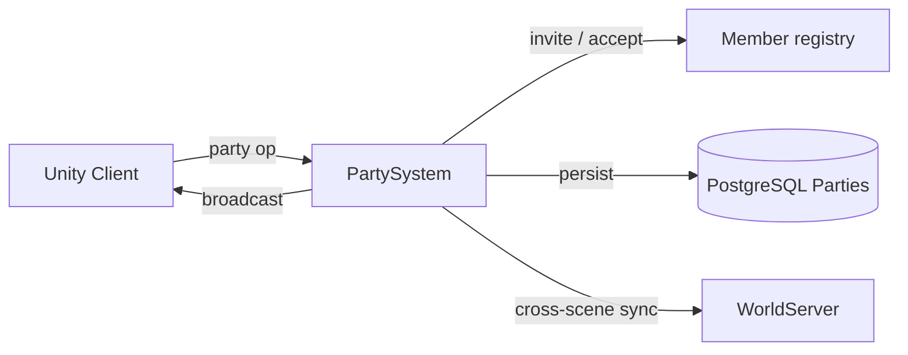

# Party System

**Short description:** SceneServer social subsystem for party lifecycle and member synchronization, handling party creation, invitations, accept/decline, leaving, member removal, rank transfer, periodic membership reconciliation, achievement triggers, and chat-based invite commands.

## Table of Contents

- [Overview](#overview)
- [Supported Platforms](#supported-platforms)
- [Features](#features)
- [Prerequisites](#prerequisites)
- [Installation / Build](#installation--build)
- [Quick Start Guides](#quick-start-guides)
- [Configuration](#configuration)
- [Usage Examples](#usage-examples)
- [Operational Checks](#operational-checks)
- [Flow Diagram](#flow-diagram)
- [Project Structure](#project-structure)
- [License](#license)

## Overview

The Party system is the SceneServer social subsystem for party lifecycle and member synchronization. It handles party creation, invitations, invitation accept/decline, leaving, member removal, rank transfer, periodic membership reconciliation, and party chat invite commands.

The implementation uses a split execution model:
- **Main thread:** request validation, in-memory controller/tracker updates, ingress guard checks, invitation sweep, and network broadcasts.
- **Async worker:** database reads/writes and party update marker persistence via `TryEnqueueAsyncWork`.
- **Main-thread queue:** marshaling async completion actions back to Unity/FishNet-safe context via `IPartySystemMainThreadQueueData`.

All party mutations emit a party update marker (`IPartyUpdateService.PersistAsync`) so that other scene servers can reconcile their local party lists during `FetchAndProcessPartyUpdatesAsync`. Pending invitations are tracked in a `LastSeenCacheTracker` with configurable TTL and bounded sweep. Per-connection ingress guards enforce debounce and in-flight exclusion across all seven party operations.

## Supported Platforms

| Platform | Supported | Notes |
|---|---|---|
| Windows | Yes | |
| Linux | Yes | |
| WebGL | N/A | Server-only module |
| Unity 6.3 LTS | Yes | Required engine version |
| IL2CPP | Yes | Supported scripting backend |

## Features

- Party creation with automatic leader assignment and database persistence
- Chat-based party invite commands (`/pi`, `/invite`) resolving targets by lowercase character name
- Invitation flow with pending-invite tracking, TTL expiration, and bounded cleanup sweep
- Accept/decline invitation with capacity checks and membership persistence
- Party leave with automatic random leadership transfer when the leader departs
- Party deletion when the last member leaves
- Leader-initiated member removal with rank validation
- Leader-initiated rank transfer (promote member to leader, demote self to member) with rollback on partial failure
- Periodic party update pump fetching database changes and broadcasting `PartyAddMultipleBroadcast` snapshots to local online members
- Removed-member detection via diff between cached and fetched member sets, with immediate `PartyLeaveBroadcast` dispatch
- Per-connection ingress debounce and in-flight guard across all seven operations (`Create`, `Invite`, `AcceptInvite`, `DeclineInvite`, `Leave`, `Remove`, `ChangeRank`)
- Bounded ingress guard sweep with configurable TTL, interval, and max removals
- Achievement integration via configurable `PartyCreateAchievementTemplate` and `PartyJoinAchievementTemplate`
- Character connect/disconnect hooks for tracker maintenance and health-percentage persistence
- Async worker backpressure via `TryEnqueueAsyncWork` (rejects when queue unavailable/full, logs warning)
- Per-system main-thread queue isolation with configurable drain cap per frame
- Optimistic concurrency via versioned `CharacterPartyData` for all membership mutations
- Graceful failure semantics: invalid requests fail closed with no mutation; permission/capacity checks enforced before persistence; async failures logged without blocking main thread

## Prerequisites

- **Unity 6.3 LTS**
- **FishNetworking** — networking framework
- **FishMMO Server Core** — provides `ServerBehaviour`, `IPartySystem`, `IPartySystemRuntimeData`, `IPartySystemMainThreadQueueData`, `IPartyCharacterMappingData`, broadcast types (`PartyCreateBroadcast`, `PartyInviteBroadcast`, `PartyAcceptInviteBroadcast`, `PartyDeclineInviteBroadcast`, `PartyLeaveBroadcast`, `PartyRemoveBroadcast`, `PartyChangeRankBroadcast`, `PartyAddBroadcast`, `PartyAddMultipleBroadcast`, `ChatBroadcast`), `IngressGuard`, `AsyncWorkerData`, and `ChatHelper`
- **FishMMO Database** — provides `IPartyService`, `ICharacterPartyService`, `IPartyUpdateService`, `CharacterPartyData`, `PartyUpdateData`, and `DatabaseResult<T>`

## Installation / Build

This is an integrated module within FishMMO. It is included as part of the server-side scene-server implementation and does not require separate installation. Ensure the FishMMO Server Core and its dependencies are properly configured in your Unity project.

## Quick Start Guides

1. Ensure `PartySystem` is present on the scene server GameObject (it inherits from `ServerBehaviour` and implements `IPartySystem<NetworkConnection>`). The asset is created via `Create > FishMMO > Server > SceneServer > Party System`.
2. Verify that the following data containers are registered in `DataContainerRegistry`:
   - `PartySystemRuntimeData` → `IPartySystemRuntimeData`
   - `PartyCharacterMappingData` → `IPartyCharacterMappingData`
   - `PartySystemMainThreadQueueData` → `IPartySystemMainThreadQueueData`
   - `AsyncWorkerData` (shared async work queue)
3. Verify that `ICharacterSystem<NetworkConnection, Scene>` is registered in `BehaviourRegistry` for connect/disconnect event subscriptions.
4. Optionally assign `PartyCreateAchievementTemplate` and `PartyJoinAchievementTemplate` in the inspector to trigger achievements on party creation and joining.
5. On initialize, `PartySystem` registers chat commands (`/pi`, `/invite`), broadcast handlers for all seven party operations, character connect/disconnect callbacks, and a periodic update callback at `UpdatePumpRate` interval.
6. On deinitialize, it drains the remaining main-thread queue, unregisters broadcast handlers, unsubscribes character callbacks, and unregisters the periodic callback.
7. Clients send the appropriate broadcast to trigger party operations; the server validates, persists to database, and replies with result broadcasts.

## Configuration

### Inspector Parameters

| Parameter | Type | Default | Description |
|---|---|---|---|
| `maxMainThreadActionsPerFrame` | int | 100 | Max party-system actions drained from main-thread queue per frame |
| `maxPartySize` | int | 6 | Maximum number of members allowed in a party |
| `updatePumpRate` | float | 1.0 | Periodic party update pump rate limit in seconds |
| `invitationTtlSeconds` | float | 45.0 | Invitation lifetime in seconds before automatic expiration |
| `invitationSweepIntervalSeconds` | float | 1.0 | Seconds between bounded invitation cleanup sweeps |
| `invitationSweepMaxScan` | int | 128 | Maximum invitation entries scanned per cleanup sweep |
| `invitationSweepMaxRemove` | int | 128 | Maximum invitation entries removed per cleanup sweep |
| `ingressDebounceMilliseconds` | int | 100 | Minimum milliseconds between party requests per connection and operation |
| `ingressSweepIntervalSeconds` | float | 5.0 | Seconds between bounded ingress guard cleanup sweeps |
| `ingressEntryTtlSeconds` | float | 30.0 | Seconds before stale ingress guard entries are removed |
| `ingressSweepMaxRemovals` | int | 128 | Maximum stale ingress guard entries removed per sweep |
| `PartyCreateAchievementTemplate` | AchievementTemplate | — | Achievement template incremented when a party is created |
| `PartyJoinAchievementTemplate` | AchievementTemplate | — | Achievement template incremented when a player joins a party |

### Chat Commands

| Command | Description |
|---|---|
| `/pi <name>` | Invite a character by name to the sender's party |
| `/invite <name>` | Alias for `/pi` |

### Threading Model

| Thread | Work |
|---|---|
| Main thread | Request validation, ingress guards, invitation sweep, ingress sweep, controller/tracker updates, broadcast dispatch, queue drain |
| Async worker | Database reads/writes (`CreatePartyAsync`, `ValidateAndSendPartyInviteAsync`, `AcceptPartyInviteAsync`, `LeavePartyAsync`, `RemovePartyMemberAsync`, `ChangePartyRankAsync`, `FetchAndProcessPartyUpdatesAsync`, `PersistPartyMemberAndNotifyAsync`, `PersistPartyUpdateAsync`) |

## Usage Examples

### Broadcast Handlers

`PartySystem` registers the following server-side broadcast handlers on initialize:

| Broadcast | Handler | Purpose |
|---|---|---|
| `PartyCreateBroadcast` | `OnServerPartyCreateBroadcastReceived` | Create a new party with the requester as leader |
| `PartyInviteBroadcast` | `OnServerPartyInviteBroadcastReceived` | Invite a target character to the inviter's party |
| `PartyAcceptInviteBroadcast` | `OnServerPartyAcceptInviteBroadcastReceived` | Accept a pending party invitation |
| `PartyDeclineInviteBroadcast` | `OnServerPartyDeclineInviteBroadcastReceived` | Decline a pending party invitation |
| `PartyLeaveBroadcast` | `OnServerPartyLeaveBroadcastReceived` | Leave the current party |
| `PartyRemoveBroadcast` | `OnServerPartyRemoveBroadcastReceived` | Remove a member from the party (leader only) |
| `PartyChangeRankBroadcast` | `OnServerPartyChangeRankBroadcastReceived` | Transfer leadership to another member (leader only) |

### Create Party

`OnServerPartyCreateBroadcastReceived(conn, msg, channel)`:

1. Validates connection, spawned object, and ingress guard.
2. Confirms the requester is not already in a party (`partyController.ID == 0`).
3. Captures character ID, scene name, and health percentage.
4. Enqueues `CreatePartyAsync`:
   - Creates party via `IPartyService.CreateAsync`.
   - Persists leader membership via `ICharacterPartyService.PersistAsync`.
   - Marshals to main thread: sets controller ID/rank, adds tracker entry, broadcasts `PartyCreateBroadcast` with party ID and location, increments `PartyCreateAchievementTemplate`.

### Invite / Accept / Decline

**Invite** (`OnServerPartyInviteBroadcastReceived`):
1. Validates inviter is a party leader.
2. Enqueues `ValidateAndSendPartyInviteAsync`:
   - Checks party capacity via `ICharacterPartyService.CountAsync`.
   - Marshals to main thread: adds pending invitation, validates target not already in a party (sends error chat if so), sends `PartyInviteBroadcast` to target.

**Accept** (`OnServerPartyAcceptInviteBroadcastReceived`):
1. Validates requester is not in a party and has a pending invitation.
2. Enqueues `AcceptPartyInviteAsync`:
   - Re-checks party capacity via `ICharacterPartyService.FetchManyAsync`.
   - Persists membership and party update marker.
   - Marshals to main thread: sets controller ID/rank, removes pending invitation, adds tracker entry, broadcasts `PartyAddBroadcast` to the new member, increments `PartyJoinAchievementTemplate`.

**Decline** (`OnServerPartyDeclineInviteBroadcastReceived`):
1. Validates connection and removes the pending invitation entry (synchronous, no async work).

### Leave / Remove / Rank Change

**Leave** (`OnServerPartyLeaveBroadcastReceived`):
1. Validates requester is in a party.
2. Enqueues `LeavePartyAsync`:
   - Fetches current members.
   - If leader and others remain, randomly selects a new leader and persists rank update.
   - Deletes the leaving member via versioned `DeleteAsync`.
   - If no members remain, deletes the party and its update marker; otherwise persists update marker.
   - Marshals to main thread: resets controller, removes tracker, broadcasts `PartyLeaveBroadcast`.

**Remove** (`OnServerPartyRemoveBroadcastReceived`):
1. Validates requester is leader and target is not self.
2. Enqueues `RemovePartyMemberAsync`:
   - Fetches target member and verifies party membership.
   - Deletes via versioned `DeleteAsync`.
   - Marshals tracker removal to main thread.
   - Persists update marker for cross-server reconciliation.

**Rank Change** (`OnServerPartyChangeRankBroadcastReceived`):
1. Validates requester is leader and target is not self.
2. Enqueues `ChangePartyRankAsync`:
   - Fetches both leader and target member data with versions.
   - Promotes target to leader first (avoids zero-leader state).
   - Demotes old leader to member.
   - On demotion failure, rolls back the target promotion and logs a warning.
   - On rollback failure, logs a critical error for manual correction.
   - Persists update marker on success.

### Periodic Update Pump

`OnPeriodicUpdate(deltaTime)` fires at `UpdatePumpRate` intervals:
1. Acquires pump lock via `TryBeginUpdatePump` (atomic compare-exchange).
2. Snapshots tracked party IDs and last fetch time on main thread.
3. Enqueues `FetchAndProcessPartyUpdatesAsync`:
   - Fetches party updates via `IPartyUpdateService.FetchAsync(partyIds, lastFetch)`.
   - Fetches current members for each updated party.
   - Marshals to main thread:
     - Updates `LastFetchTime`.
     - Computes removed members (diff previous cached vs current) and sends `PartyLeaveBroadcast` to each.
     - Refreshes `PartyMemberTracker` cache.
     - Broadcasts `PartyAddMultipleBroadcast` snapshots (including `PartyID`, `CharacterID`, `Rank`, `HealthPCT`) to all local online members.
4. Releases pump lock in `finally`.

### Failure Semantics

- Invalid requests fail closed with no mutation.
- Permission/capacity checks are enforced before persistence.
- Async failures are logged and do not block the main thread.
- Main-thread completion paths revalidate runtime state before mutating or broadcasting.
- Rank-change rollback protects against partial-failure two-leader states.
- `TryEnqueueAsyncWork` returns `false` when the queue is unavailable or full; a warning is logged.
- Ingress guards are always released in `finally` blocks or via `TryEnqueueIngressWork` deferred release.

## Operational Checks

| Check | How to Verify |
|---|---|
| Initialization success | Confirm `PartySystem` logs "Initialized (MaxPartySize=6, UpdatePumpRate=1s)" without errors on server startup |
| Data containers available | Verify `IPartySystemRuntimeData`, `IPartyCharacterMappingData`, and `IPartySystemMainThreadQueueData` all resolve from `DataContainerRegistry` |
| Chat commands registered | Confirm `/pi` and `/invite` are available in party chat and route to `OnPartyInvite` |
| Party creation | Send `PartyCreateBroadcast` from a character not in a party; confirm `PartyCreateBroadcast` reply with new party ID and location |
| Party invite | As party leader, send `PartyInviteBroadcast` with a valid target; confirm target receives `PartyInviteBroadcast` |
| Invite target already in party | Invite a character already in a party; confirm inviter receives `ChatBroadcast` with `PARTY_ERROR_TARGET_IN_PARTY` |
| Accept invitation | Target sends `PartyAcceptInviteBroadcast`; confirm `PartyAddBroadcast` reply with correct party ID, rank, and health |
| Decline invitation | Target sends `PartyDeclineInviteBroadcast`; confirm pending invitation is removed |
| Invitation TTL expiry | Wait beyond `invitationTtlSeconds`; confirm expired invitations are swept and no longer accepted |
| Party leave (member) | Member sends `PartyLeaveBroadcast`; confirm `PartyLeaveBroadcast` reply and tracker removal |
| Party leave (leader) | Leader sends `PartyLeaveBroadcast` with other members present; confirm new leader is randomly assigned |
| Party leave (last member) | Last member sends `PartyLeaveBroadcast`; confirm party and update marker are deleted |
| Member removal | Leader sends `PartyRemoveBroadcast` for a member; confirm member is removed and update marker persisted |
| Self-removal prevention | Leader sends `PartyRemoveBroadcast` targeting self; confirm request is rejected |
| Rank change | Leader sends `PartyChangeRankBroadcast`; confirm leadership is transferred and update marker persisted |
| Rank change rollback | Simulate demotion failure after promotion; confirm target promotion is rolled back |
| Periodic update pump | Wait for `UpdatePumpRate`; confirm `FetchAndProcessPartyUpdatesAsync` fires and members receive `PartyAddMultipleBroadcast` |
| Removed member detection | Remove a member on another server; confirm local server detects the diff and sends `PartyLeaveBroadcast` |
| Ingress debounce | Send rapid consecutive party requests from the same connection; confirm excess requests are dropped |
| Ingress in-flight guard | Send overlapping async party requests; confirm only one is processed at a time per operation type |
| Ingress sweep | Wait for `ingressSweepIntervalSeconds`; confirm stale guard entries are cleaned up |
| Character connect | Connect a character in a party; confirm tracker is updated and `PersistPartyMemberAndNotifyAsync` fires |
| Character disconnect | Disconnect a character in a party; confirm tracker is updated, pending invitations cleared, and `PersistPartyUpdateAsync` fires |
| Tracker cleanup | Disconnect the last local member of a party; confirm both `PartyCharacterTracker` and `PartyMemberTracker` entries are removed |
| Achievement trigger | Create or join a party with achievement templates assigned; confirm achievement controllers are incremented |
| Main-thread queue drain | Confirm queued async results are dispatched on the main thread within `maxMainThreadActionsPerFrame` per frame |
| Async backpressure | Saturate async worker queue; confirm new work is rejected with a logged warning |
| Deinitialize cleanup | Trigger deinitialize; confirm broadcast handlers unregistered, character callbacks unsubscribed, periodic callback unregistered, and main-thread queue drained |

## Flow Diagram

### High-Level Overview



### Create Party

```
OnServerPartyCreateBroadcastReceived(conn, msg, channel)
│
├─ 1. Validate connection + spawned object
├─ 2. Acquire ingress guard (Create)
├─ 3. Confirm requester not already in a party
├─ 4. Capture characterID, sceneName, healthPCT
└─ 5. TryEnqueueIngressWork → CreatePartyAsync
       │
       ├─ IPartyService.CreateAsync → newPartyID
       ├─ ICharacterPartyService.PersistAsync (leader membership)
       └─ TryEnqueueMainThread
              ├─ Set partyController.ID = newPartyID, Rank = Leader
              ├─ AddPartyCharacterTracker(newPartyID, characterID)
              ├─ Broadcast PartyCreateBroadcast to conn
              └─ Increment PartyCreateAchievementTemplate
```

### Invite → Accept

```
OnServerPartyInviteBroadcastReceived(conn, msg, channel)
│
├─ 1. Validate inviter is party leader
├─ 2. Acquire ingress guard (Invite)
└─ 3. TryEnqueueIngressWork → ValidateAndSendPartyInviteAsync
       │
       ├─ ICharacterPartyService.CountAsync (capacity check)
       └─ TryEnqueueMainThread
              ├─ TryAddPendingInvitation(target, partyID)
              ├─ Validate target not already in party
              │    └── Already in party → ChatBroadcast error to inviter, remove pending
              └─ Broadcast PartyInviteBroadcast to target

OnServerPartyAcceptInviteBroadcastReceived(conn, msg, channel)
│
├─ 1. Validate requester not already in a party
├─ 2. Acquire ingress guard (AcceptInvite)
├─ 3. Validate pending invitation exists
└─ 4. TryEnqueueIngressWork → AcceptPartyInviteAsync
       │
       ├─ ICharacterPartyService.FetchManyAsync (re-check capacity)
       ├─ ICharacterPartyService.PersistAsync (member)
       ├─ IPartyUpdateService.PersistAsync (marker)
       └─ TryEnqueueMainThread
              ├─ Set partyController.ID, Rank = Member
              ├─ RemovePendingInvitation
              ├─ AddPartyCharacterTracker
              ├─ Broadcast PartyAddBroadcast to new member
              └─ Increment PartyJoinAchievementTemplate
```

### Leave Party

```
OnServerPartyLeaveBroadcastReceived(conn, msg, channel)
│
├─ 1. Validate requester is in a party
├─ 2. Acquire ingress guard (Leave)
└─ 3. TryEnqueueIngressWork → LeavePartyAsync
       │
       ├─ ICharacterPartyService.FetchManyAsync (current members)
       ├─ If leader + others remain:
       │    └─ Randomly select new leader → UpdateRankAsync
       ├─ ICharacterPartyService.DeleteAsync (leaving member, versioned)
       ├─ If no remaining members:
       │    ├─ IPartyService.DeleteAsync
       │    └─ IPartyUpdateService.DeleteAsync
       ├─ Else: IPartyUpdateService.PersistAsync
       └─ TryEnqueueMainThread
              ├─ Reset partyController (ID=0, Rank=None)
              ├─ RemovePartyCharacterTracker
              └─ Broadcast PartyLeaveBroadcast to conn
```

### Rank Change

```
OnServerPartyChangeRankBroadcastReceived(conn, msg, channel)
│
├─ 1. Validate requester is leader, target is not self
├─ 2. Acquire ingress guard (ChangeRank)
└─ 3. TryEnqueueIngressWork → ChangePartyRankAsync
       │
       ├─ Fetch leader + target CharacterPartyData (with versions)
       ├─ Verify both in same party
       ├─ UpdateRankAsync(target → Leader)   ← promote first
       ├─ UpdateRankAsync(leader → Member)   ← demote second
       │    └── Failure → rollback target back to original rank
       └─ IPartyUpdateService.PersistAsync
```

### Periodic Update Pump

```
OnPeriodicUpdate(deltaTime)
│
├─ 1. Check Initialized + Server started
├─ 2. TryBeginUpdatePump (atomic lock)
├─ 3. Snapshot partyIds + lastFetch on main thread
└─ 4. TryEnqueueAsyncWork → FetchAndProcessPartyUpdatesAsync
       │
       ├─ IPartyUpdateService.FetchAsync(partyIds, lastFetch)
       ├─ For each updated party: ICharacterPartyService.FetchManyAsync
       └─ TryEnqueueMainThread
              ├─ Update LastFetchTime
              ├─ For each party:
              │    ├─ Diff previous cached members vs current
              │    ├─ Removed members → reset controller, Broadcast PartyLeaveBroadcast
              │    ├─ Update PartyMemberTracker cache
              │    └─ Build PartyAddMultipleBroadcast (PartyID, CharacterID, Rank, HealthPCT)
              └─ Broadcast PartyAddMultipleBroadcast to each local online member
       │
       └─ finally: EndUpdatePump
```

### OnUpdate Sweep

```
OnUpdate(deltaTime)
│
├─ 1. DrainMainThreadQueue (up to maxMainThreadActionsPerFrame)
├─ 2. SweepPendingInvitations()
│      ├── Check if sweep interval has elapsed
│      └── SweepExpiredInvitations(ttl, maxScan, maxRemove)
└─ 3. SweepIngressGuards()
       └── IngressGuard.Sweep(interval, ttl, maxRemovals)
```

## Project Structure

### Directory Structure

```
Party/
├── PartySystem.cs                     # Core party orchestration, handlers, async persistence, and update pump
├── PartySystemRuntimeData.cs          # Pending invitation map, last update fetch cursor, ingress guard, pump lock
├── PartySystemMainThreadQueueData.cs  # Per-system main-thread action queue container
├── PartyCharacterMappingData.cs       # Party online/cached membership trackers
└── README.md                          # System documentation
```

### Related Core Contracts

- `Server/Core/World/SceneServer/Party/IPartySystem.cs`
- `Server/Core/World/SceneServer/Party/IPartySystemRuntimeData.cs`
- `Server/Core/World/SceneServer/Party/IPartyCharacterMappingData.cs`
- `Server/Core/World/SceneServer/Party/IPartySystemMainThreadQueueData.cs`

### Inheritance Hierarchy

```
ServerBehaviour
└── PartySystem : IPartySystem<NetworkConnection>

RuntimeDataContainer
├── PartySystemRuntimeData : IPartySystemRuntimeData
└── PartyCharacterMappingData : IPartyCharacterMappingData

SystemMainThreadQueueData
└── PartySystemMainThreadQueueData : IPartySystemMainThreadQueueData
```

## License

This project is subject to the FishMMO project license.
