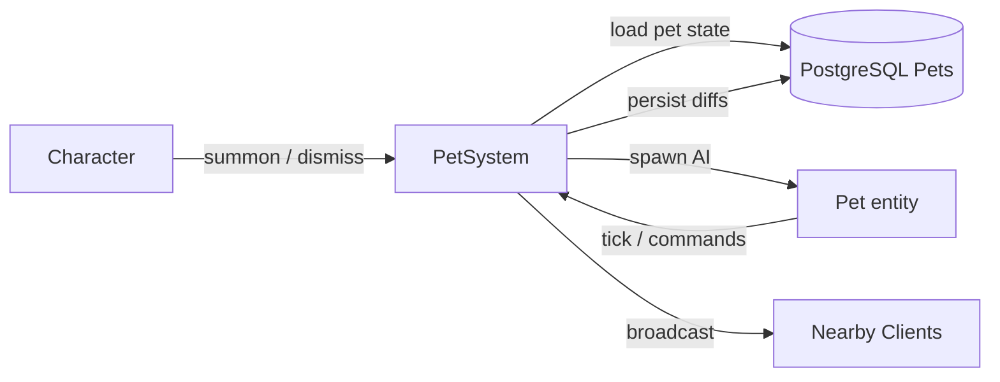

# Pet System

**Short description:** Server-side pet lifecycle and runtime control system for scene-server player characters, handling follow/stay/attack/stance/summon/release commands, ability-driven spawning and ability learning, character-driven spawn/despawn transitions, ingress guarding, and asynchronous database persistence with main-thread-marshaled broadcasts.

## Table of Contents

- [Overview](#overview)
- [Supported Platforms](#supported-platforms)
- [Features](#features)
- [Prerequisites](#prerequisites)
- [Installation / Build](#installation--build)
- [Quick Start Guides](#quick-start-guides)
- [Configuration](#configuration)
- [Usage Examples](#usage-examples)
- [Operational Checks](#operational-checks)
- [Flow Diagram](#flow-diagram)
- [Project Structure](#project-structure)
- [License](#license)

## Overview

The Pet system is the SceneServer authority for pet lifecycle and runtime control. It handles pet follow/stay/summon/release requests from connected players, character-driven pet spawn/despawn transitions, pet summon ability integration, and pet persistence across sessions.

The design separates responsibilities across execution contexts:
- **Main thread:** request validation, ingress guarding, controller/AI updates, spawning/despawning, faction copying, and network broadcasts.
- **Async worker:** database fetch/persist operations dispatched through `IAsyncWorkerData`.
- **Main-thread queue:** marshaling async completion actions back to Unity/FishNet-safe context via `PetSystemMainThreadQueueData`.

All DB writes are queued through `TryEnqueueAsyncWork(...)` to `IAsyncWorkerData` with `entityKey = characterID` for per-character operation ordering. If queueing fails (backpressure/missing dependency), the system logs warnings while keeping gameplay state intact. Broadcasts are only emitted after successful state transitions, ensuring clients never see stale or uncommitted data.

### Ownership

Pets are spawned **without an owning connection** — server-owned, exactly like any other NPC. FishNet's `Replicate_Authoritative` only accepts server-produced input for an object with no owner, so handing a pet to the summoner's connection would make that client responsible for supplying input to a brain that does not run there, and the server's own decisions would be discarded. Nothing in the pet system reads the pet's `Owner`, and the pet's `NetworkTransform` is server-authoritative, so server ownership costs nothing.

### Commands and orders

A pet carries two independent pieces of state, both server-authoritative and both written into the spawn payload:

| State | Values | Meaning |
|---|---|---|
| `PetStance` | `Passive`, `Defensive`, `Aggressive` | Whether the pet *initiates*. An explicit attack order works in every stance. |
| `PetMovementOrder` | `Follow`, `Stay` | Whether the pet heels or holds position. |

Both are byte-backed enums whose zero values (`Passive`, `Follow`) are the safe defaults, so an unset value never makes a pet pick a fight or strand itself. Clients only ever *request* a change; the server confirms with a broadcast.

Movement orders are expressed as orders, not by writing the AI's combat target. `Target` means "the thing I am fighting" throughout the AI, and conflating the two is what previously made a pet told to Stay never move again.

## Supported Platforms

| Platform | Supported | Notes |
|---|---|---|
| Windows | Yes | |
| Linux | Yes | |
| WebGL | N/A | Server-only module |
| Unity 6.3 LTS | Yes | Required engine version |
| IL2CPP | Yes | Supported scripting backend |

## Features

- Pet follow, stay, attack, stance, summon (warp), and release commands via network broadcasts with full validation
- Attack orders try three choices in the order the owner set (`PetAttackPriority`, default pinned → current → highest threat): the click carries the pinned and hovered frame ids separately, each verified — spawned character, owner's scene, within `TargetController.MAX_TARGET_DISTANCE` of the owner — with the server's own copy of the reported frame backing the current step, and the highest-threat step resolved from the threat tables (`AggressionDispatcher.TryFindHighestThreatAgainst`, which with pet-credited threat is what the owner and pet have attacked the most); whatever a step yields is re-validated as alive, not the owner, not the pet, and hostile by faction, and the first valid one wins
- The attack priority is session state on the owner's `IPetController` like the stance (`PetAttackPriorityBroadcast` request/confirm, refused unless a permutation of the three steps, applied at summon and sent with `PetAddBroadcast`); the client remembers it in its settings under `PetAttackPriority` and replays it on every summon, so it survives sessions with no database change
- Death is a full reset: a player's pet is dismissed from the kill event through the same `DismissPet` path as a voluntary release
- A pet and its owner share threat both ways (see the AI README): hit either and both are threatened; a pet's hits are credited to its owner as well
- Stance changes reject values outside the enum rather than casting a hostile byte straight in; dropping to `Passive` recalls the pet and interrupts its cast
- Defensive and Aggressive pets answer an attack on their owner via `IPetController.OnOwnerAttacked`, a server-side hook raised from the global damage event
- Pet ability learning: template IDs restored from the database and abilities granted by the `PetAbilityTemplate` are both taught to the pet's `IAbilityController` on spawn, and captured back before persistence
- Per-connection ingress guarding with debounce and in-flight protection to prevent duplicate operations across all pet control actions
- Ability-driven pet summoning via `AbilityObject.OnPetSummon` with bounding-box randomization and ground sphere cast for spawn positioning
- Automatic pet spawn on character login via async database load and main-thread marshaling
- Automatic pet state capture and async persistence on character despawn or pet death
- Pet AI initialization after the scene move and activation, so the NavMeshAgent is warped onto the mesh at its real spawn position rather than being driven while inactive
- A pet's AI `Home` resolves to its owner's live position, so leashing, wandering and return-home all track the player without the pet system having to write anything
- Faction data copying from owner to pet via `IFactionController.CopyFrom`
- Shared `SpawnAndInitializePet` helper that handles existing-pet despawn, pooled object retrieval, AI/faction init, scene transfer, network spawn, and broadcast emission
- Optimistic concurrency on pet persistence with version-incremented writes via `ICharacterPetService`
- Time-sliced main-thread queue draining with configurable per-frame action limits to avoid frame spikes
- Periodic ingress guard cleanup sweeps with configurable TTL and max removals per sweep
- Achievement integration for pet summon events via configurable `AchievementTemplate`
- Graceful degradation: logs warnings on persistence queue failures while keeping in-memory gameplay state intact
- Object pool integration: pets are retrieved from and returned to the FishNet object pool to reduce allocation pressure
- Stale-reference safety: the owner's controller reference is cleared on death and despawn, so a Summon or Follow command cannot re-task a pooled pet that no longer exists
- Guard release deferred until async operation completes for character spawn pet loads, preventing overlap windows for duplicate operations

## Prerequisites

- **Unity 6.3 LTS**
- **FishNetworking** — networking framework
- **FishMMO Server Core** — provides `ServerBehaviour`, `IPetSystem`, controller interfaces, broadcast types, `IAsyncWorkerData`, and `IngressGuard`

## Installation / Build

This is an integrated module within FishMMO. It is included as part of the server-side scene-server implementation and does not require separate installation. Ensure the FishMMO Server Core and its dependencies are properly configured in your Unity project.

## Quick Start Guides

1. Ensure `PetSystem` is present on the scene server GameObject (it inherits from `ServerBehaviour` and implements `IPetSystem`).
2. Verify that `PetSystemMainThreadQueueData` and `PetSystemRuntimeData` data containers are registered (declared via `[RequiresDataContainer]` attributes).
3. Confirm that `AsyncWorkerData` (`IAsyncWorkerData`) is available for non-blocking DB write queuing.
4. Confirm that `ICharacterSystem<NetworkConnection, Scene>` is registered in the behaviour registry.
5. Verify that the database service `ICharacterPetService` is available in the DB service registry.
6. On initialize, `PetSystem` automatically registers broadcast handlers for `PetFollowBroadcast`, `PetStayBroadcast`, `PetAttackBroadcast`, `PetStanceBroadcast`, `PetSummonBroadcast`, and `PetReleaseBroadcast`, and subscribes to `AbilityObject.OnPetSummon`, `OnSpawnCharacter`, `OnDespawnCharacter`, and `OnPetKilled`; on deinitialize, it unregisters them all.
7. Give the pet prefab an AI archetype — one of the six `Pet - *` assets under `Assets/Templates/Entity/NPCs/AI/Archetypes/` — and give the `PetAbilityTemplate` a `PetAbilities` list. A pet with no abilities will follow its owner and never attack.

## Configuration

### Inspector Settings

| Field | Type | Default | Purpose |
|---|---|---|---|
| `maxMainThreadActionsPerFrame` | `int` | `100` | Max pet-system actions drained from main-thread queue per frame |
| `ingressDebounceMilliseconds` | `int` | `80` | Minimum milliseconds between pet control requests per connection |
| `ingressSweepIntervalSeconds` | `float` | `5.0` | Seconds between bounded ingress guard cleanup sweeps |
| `ingressEntryTtlSeconds` | `float` | `30.0` | Seconds before stale ingress guard entries are removed |
| `ingressSweepMaxRemovals` | `int` | `128` | Maximum stale ingress guard entries removed per sweep |
| `PetSummonAchievementTemplate` | `AchievementTemplate` | `null` | Optional achievement template incremented when a pet is summoned |

### Required Data Containers

| Container | Interface | Purpose |
|---|---|---|
| `PetSystemMainThreadQueueData` | `IPetSystemMainThreadQueueData` | Per-system main-thread action queue for marshaling async completions |
| `PetSystemRuntimeData` | `IPetSystemRuntimeData` | Runtime state container for ingress guard |
| `AsyncWorkerData` | `IAsyncWorkerData` | Queued non-blocking async DB work dispatch |

### Database Service Dependencies

| Service | Purpose |
|---|---|
| `ICharacterPetService` | Fetches and persists pet records (spawned state, template, abilities, version) |

### Threading Model

| Thread | Work |
|---|---|
| Main thread | Request validation, ingress guarding, pet AI/faction updates, spawning/despawning, network broadcasts, DTO capture |
| Async worker | Database fetch/persist operations via `IAsyncWorkerData` |

## Usage Examples

### Broadcast Handlers

`PetSystem` registers the following server broadcast handlers on initialize:

- `PetFollowBroadcast` → `OnPetFollowBroadcastReceived`
- `PetStayBroadcast` → `OnPetStayBroadcastReceived`
- `PetAttackBroadcast` → `OnPetAttackBroadcastReceived`
- `PetStanceBroadcast` → `OnPetStanceBroadcastReceived`
- `PetSummonBroadcast` → `OnPetSummonBroadcastReceived`
- `PetReleaseBroadcast` → `OnPetReleaseBroadcastReceived`

And unregisters them on deinitialize.

### Broadcasts Emitted

| Broadcast | Purpose |
|---|---|
| `PetAddBroadcast` | Notify owner of successful pet spawn (pet ID, stance, movement order) |
| `PetRemoveBroadcast` | Notify owner of pet removal (release or death) |
| `PetStanceBroadcast` | Confirm the authoritative stance after a change request |
| `PetMovementOrderBroadcast` | Confirm the authoritative movement order after Follow or Stay |

The UI does not paint a requested stance optimistically — it waits for the server's confirming broadcast, so the highlighted button always reflects what the pet is really doing rather than what was last clicked.

### External Integration Points

| Integration | Role |
|---|---|
| `IPetController` | Pet ownership state, stance/order mirror, and the `OnOwnerAttacked` server hook |
| `ITargetController` | Source of truth for an attack order's target — read from the owner, never from the message |
| `IAbilityController` | Pet ability learning on spawn and capture before persistence |
| `IAIController` | Pet AI home position, follow target, agent warping, and initialization |
| `IFactionController` | Faction data copying from owner to pet |
| `ICharacterAttributeController` | Health attribute read during despawn to determine alive/spawned state |
| `ICharacterSystem<NetworkConnection, Scene>` | Character spawn/despawn/pet-killed event subscriptions |
| `AbilityObject.OnPetSummon` | Ability-driven pet summon event integration |
| `IngressGuard` (via `IPetSystemRuntimeData`) | Per-connection debounce and in-flight protection |
| `AsyncWorkerData` (`IAsyncWorkerData`) | Queued non-blocking async persistence |
| `IAchievementController` | Optional achievement increment on pet summon |
| `PetAbilityTemplate` | Template defining pet prefab, spawn bounding box, spawn distance, and ability data |
| Database service (`ICharacterPetService`) | Pet relationship persistence and spawned-state loading |

### Ingress Guarding

Pet ingress uses per-connection operation keys with debounce + in-flight protection. Operation codes are scoped per action type (`Follow`, `Stay`, `Summon`, `Release`, `LoadPet`, `Attack`, `Stance`). For the character-spawn pet load path, guard release is deferred until the async operation completes (not at enqueue-time), preventing overlap windows for duplicate pet loads on rapid reconnect. For synchronous broadcast handlers (follow, stay, summon), guards are released in a `finally` block after the handler completes.

### Async Worker and Backpressure

`TryEnqueueAsyncWork(...)` dispatches all async DB work through `IAsyncWorkerData`.

Behavior:
- Returns `true` when accepted.
- Returns `false` when queue is unavailable or full.
- Logs warnings on rejection/unavailability.
- Uses `entityKey = characterID` for per-character ordering.

This prevents unbounded fire-and-forget tasks and preserves operation order per player.

### Persistence Model

`SavePetAsync(...)`:
- Is always preceded by `Pet.CaptureKnownAbilities()`, so abilities granted at summon time from the `PetAbilityTemplate` are persisted rather than lost on the next log in.
- Fetches the existing pet row for optimistic version increment.
- Persists `(characterID, templateID, abilities, spawned)` state with `version + 1`.
- Uses per-character keyed queueing to preserve operation order.
- Skips persistence and logs a warning if `templateID` is invalid (≤ 0).

`LoadAndSpawnPetAsync(...)`:
- Fetches the currently spawned pet record via `ICharacterPetService.FetchSpawnedAsync`.
- Marshals pet reconstruction/spawn back to the main thread via `TryEnqueueMainThread`.
- Re-validates connection, character, and pet template before spawning.

## Operational Checks

| Check | How to Verify |
|---|---|
| System initialization | Confirm `PetSystem` initializes without errors; broadcast handlers are registered |
| Pet follow | Send a `PetFollowBroadcast` with an active pet; verify AI target is set to owner transform |
| Pet stay | Send a `PetStayBroadcast` with an active pet; verify the pet holds position and `PetMovementOrderBroadcast` reaches the client |
| Pet attack | Target a hostile, send a `PetAttackBroadcast`; verify the pet engages it. Target a friendly or the pet itself; verify the order is refused |
| Pet stance | Send each `PetStanceBroadcast` value; verify the confirming broadcast, and that Passive recalls a fighting pet |
| Defensive response | With a Defensive pet, have a hostile attack the owner; verify the pet engages the attacker |
| Pet abilities | Summon a pet whose `PetAbilityTemplate.PetAbilities` is populated; verify the pet's `IAbilityController` knows them and the pet attacks |
| Ability persistence | Summon, release, and re-log; verify the pet returns with the same abilities |
| Pet summon (warp) | Send a `PetSummonBroadcast` with an active pet; verify AI agent warps to owner position |
| Pet release | Send a `PetReleaseBroadcast` with an active pet; verify pet is despawned, `PetRemoveBroadcast` reaches client, and async save is queued with `spawned=false` |
| Character spawn pet load | Spawn a character with a previously saved pet; verify async load triggers and pet is instantiated with correct template and abilities |
| Character despawn persistence | Despawn a character with an active pet; verify pet state is captured and async save is queued with correct alive/spawned flag |
| Pet killed | Trigger pet death; verify despawn persistence flow runs and `PetRemoveBroadcast` reaches client |
| Ability-driven summon | Execute a pet summon ability; verify pet spawns at ground-cast position with AI initialized and `PetAddBroadcast` emitted |
| Ingress debounce | Send rapid duplicate pet control requests; confirm only the first is processed within the debounce window |
| Async persistence | Check logs for successful `TryEnqueueAsyncWork` calls after release/despawn/death operations |
| Main-thread queue draining | Verify queued actions are executed each frame within `maxMainThreadActionsPerFrame` limit |
| Persistence failure graceful degradation | Simulate persistence queue failure; confirm warning is logged and in-memory state remains unchanged |
| Achievement increment | Configure `PetSummonAchievementTemplate`; summon a pet and verify achievement counter increments |
| Ingress guard cleanup | Verify stale ingress guard entries are removed during periodic sweeps |
| Optimistic concurrency | Verify pet save logs a warning on version conflict or DB error |

## Flow Diagram

### High-Level Overview



### Pet Follow / Stay

```
OnPetFollowBroadcastReceived / OnPetStayBroadcastReceived
│
├─ 1. Validate connection and spawned object
├─ 2. Acquire ingress guard (debounce + in-flight)
├─ 3. Validate IPetController exists with active pet
├─ 4. SetMovementOrder(conn, petController, Follow | Stay)
│      ├── Pet.MovementOrder = order
│      ├── Stay  → AI Home pinned to the pet's current position
│      ├── Follow → AI Home resolves to the owner again
│      └── Broadcast PetMovementOrderBroadcast to the owner
└─ 5. Release ingress guard (finally)
```

### Pet Attack

```
OnPetAttackBroadcastReceived(conn, msg, channel)
│
├─ 1. Validate connection and spawned object
├─ 2. Acquire ingress guard (debounce + in-flight)
├─ 3. Validate IPetController exists with active pet
├─ 4. Read the owner's ITargetController.Current.Target
│      (never taken from the message — a client cannot name an arbitrary victim)
├─ 5. IsValidPetTarget: alive, not the owner, not the pet, hostile by faction
├─ 6. CommandPetAttack → set AI target, clear any Stay, enter the attacking state
└─ 7. Release ingress guard (finally)
```

### Pet Stance

```
OnPetStanceBroadcastReceived(conn, msg, channel)
│
├─ 1. Validate connection and spawned object
├─ 2. Reject a stance outside the enum
├─ 3. Acquire ingress guard (debounce + in-flight)
├─ 4. Validate IPetController exists with active pet
├─ 5. Apply stance to both the Pet and the controller mirror
├─ 6. Passive → RecallPet (clear target, interrupt cast, return to idle)
├─ 7. Broadcast PetStanceBroadcast to confirm
└─ 8. Release ingress guard (finally)
```

### Owner Attacked → Defensive Response

```
IPetController.OnOwnerAttacked(petController, attacker)
│
├─ 1. Ignore if the pet is Passive
├─ 2. Ignore if the pet is already in its attacking state (do not thrash its target)
├─ 3. IsValidPetTarget(attacker)
└─ 4. CommandPetAttack(pet, attacker)
```

### Pet Summon (Warp)

```
OnPetSummonBroadcastReceived(conn, msg, channel)
│
├─ 1. Validate connection and spawned object
├─ 2. Acquire ingress guard (debounce + in-flight)
├─ 3. Validate IPetController exists with active pet
├─ 4. Warp IAIController.Agent to owner position
└─ 5. Release ingress guard (finally)
```

### Pet Release

```
OnPetReleaseBroadcastReceived(conn, msg, channel)
│
├─ 1. Validate connection and spawned object
├─ 2. Acquire ingress guard (debounce + in-flight)
├─ 3. Validate database services available
├─ 4. Validate IPetController exists with active pet
├─ 5. CaptureKnownAbilities, then capture an immutable DTO
│      (characterID, templateID, abilities)
├─ 6. Despawn pet network object to pool
├─ 7. Clear pet owner and controller references, unsubscribe OnOwnerAttacked
├─ 8. Broadcast PetRemoveBroadcast to owner
├─ 9. Enqueue async SavePetAsync(spawned=false) keyed by characterID
└─ 10. Release ingress guard (finally)
```

### Character Spawn → Pet Load

```
CharacterSystem_OnSpawnCharacter(conn, character, scene)
│
├─ 1. Validate character and IPetController
├─ 2. Validate database services available
├─ 3. Acquire ingress guard (LoadPet, in-flight only)
├─ 4. Enqueue async LoadAndSpawnPetAsync(...)
│      │
│      ├─ Resolve ICharacterPetService
│      ├─ FetchSpawnedAsync pet record from DB
│      └─ Enqueue main-thread completion action:
│           ├── Re-validate connection/character/network state
│           ├── Resolve PetAbilityTemplate from templateID
│           ├── Retrieve pooled pet NetworkObject at owner position
│           ├── SpawnAndInitializePet(..., spawnPosition, ...)
│           │    ├── Despawn any existing pet
│           │    ├── Initialize Pet component (owner, template, stance, orders)
│           │    ├── Build the ability list (persisted IDs + template grants)
│           │    ├── Move to owner scene
│           │    ├── Activate
│           │    ├── Initialize AI — warps the agent onto the NavMesh at spawnPosition
│           │    ├── Network-spawn with NO owning connection (server-owned)
│           │    │     └── Pet.OnStartServer learns the ability list
│           │    ├── Copy faction from owner
│           │    ├── Subscribe the defensive OnOwnerAttacked hook
│           │    ├── Broadcast PetAddBroadcast (id, stance, order)
│           │    └── Increment achievement (if configured)
│           └── Guard release (finally, deferred)
│
└─ On enqueue failure: release guard immediately
```

### Character Despawn → Pet Save

```
CharacterSystem_OnDespawnCharacter(conn, character)
│
├─ 1. Validate character and IPetController
├─ 2. Validate database services available
├─ 3. Read pet health to determine alive/spawned state
├─ 4. CaptureKnownAbilities, then capture an immutable DTO
│      (characterID, templateID, abilities, spawned)
├─ 5. Despawn pet network object to pool (if spawned)
├─ 6. Clear the controller's pet reference and unsubscribe OnOwnerAttacked
└─ 7. Enqueue async SavePetAsync(characterID, templateID, abilities, spawned)
```

### Pet Killed

```
CharacterSystem_OnPetKilled(conn, character)
│
├─ 1. Reuse CharacterSystem_OnDespawnCharacter flow (captures state + async save)
└─ 2. Broadcast PetRemoveBroadcast to owner
```

### Ability-Driven Pet Summon

```
AbilityObject_OnPetSummon(petAbilityTemplate, caster)
│
├─ 1. Validate template, caster, IPetController, and pet prefab
├─ 2. Get physics scene from caster scene
├─ 3. Generate random spawn origin within bounding box
├─ 4. Sphere cast downward to find ground position
├─ 5. Retrieve pooled pet NetworkObject at ground position
└─ 6. SpawnAndInitializePet(...)
       ├── Despawn any existing pet
       ├── Initialize Pet component (owner, template, stance, orders)
       ├── Build the ability list from PetAbilityTemplate.PetAbilities
       ├── Move to caster scene
       ├── Activate
       ├── Initialize AI — warps the agent onto the NavMesh at the ground-cast position
       ├── Network-spawn with NO owning connection (server-owned)
       │     └── Pet.OnStartServer learns the ability list
       ├── Copy faction from caster
       ├── Subscribe the defensive OnOwnerAttacked hook
       ├── Broadcast PetAddBroadcast (id, stance, order)
       └── Increment achievement (if configured)
```

### Failure Semantics

```
Error Handling
│
├─ Invalid requests → ignored without state mutation
├─ DB/service lookup failures → abort async operation safely
├─ Queue rejection/unavailability → logged, work skipped
├─ Async exceptions → caught and logged with character context
├─ Invalid templateID (≤ 0) → save skipped with warning
├─ Optimistic concurrency conflict → logged with version details
├─ Pooled object missing Pet component → returned to pool, spawn aborted
└─ Broadcasts → only emitted after successful state transitions
```

## Known Limitations

| Limitation | Detail |
|---|---|
| Stance is not persisted | `PetStance` lives on the pet and the controller for the session. A player who sets Aggressive and logs out returns to the `Defensive` default. Persisting it needs a `character_pet` schema change. |
| Pet health is not persisted | A pet re-summoned after a log in returns at full health. `spawned` is persisted; the health value that decided it is not. |

## Project Structure

### Directory Structure

```
Pet/
├── PetSystem.cs                       # Pet lifecycle orchestration, broadcast handlers, and async persistence
├── PetSystemRuntimeData.cs            # Runtime state container for ingress guard
├── PetSystemMainThreadQueueData.cs    # Per-system main-thread action queue container
└── README.md                          # System documentation
```

### Related Core Contracts

- `Server/Core/World/SceneServer/Pet/IPetSystem.cs`
- `Server/Core/World/SceneServer/Pet/IPetSystemMainThreadQueueData.cs`
- `Server/Core/World/SceneServer/Pet/IPetSystemRuntimeData.cs`

### Inheritance Hierarchy

```
ServerBehaviour
└── PetSystem : IPetSystem

RuntimeDataContainer
└── PetSystemRuntimeData : IPetSystemRuntimeData

SystemMainThreadQueueData
└── PetSystemMainThreadQueueData : IPetSystemMainThreadQueueData
```

## License

This project is subject to the FishMMO project license.
