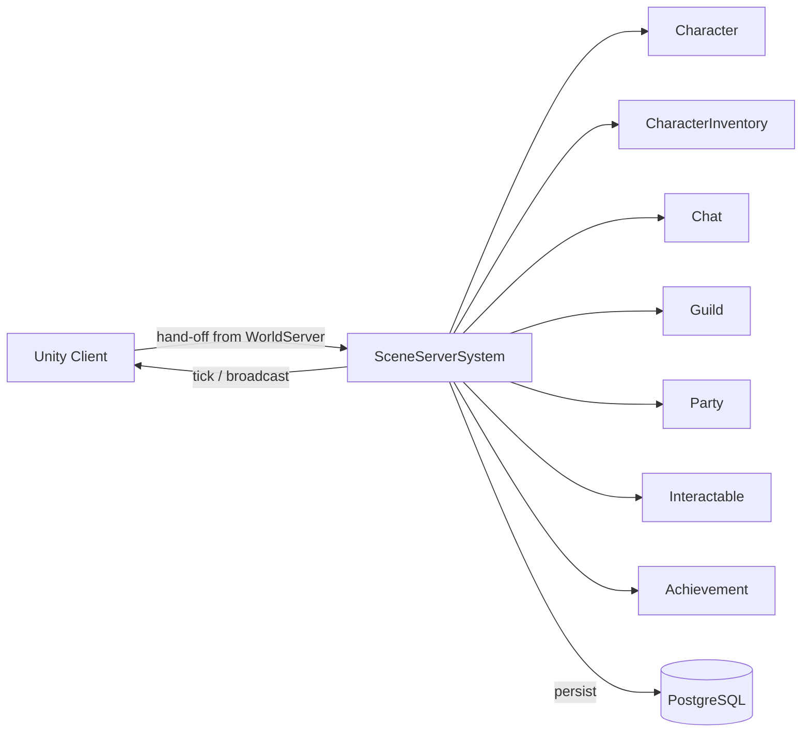

# Scene Server System

**Short description:** Manages scene server node lifecycle, scene instance loading/unloading, heartbeat pulses to the database, character count tracking, and connection–scene routing for the FishMMO scene server.

## Table of Contents

- [Overview](#overview)
- [Supported Platforms](#supported-platforms)
- [Features](#features)
- [Prerequisites](#prerequisites)
- [Installation / Build](#installation--build)
- [Quick Start Guides](#quick-start-guides)
- [Configuration](#configuration)
- [Usage Examples](#usage-examples)
- [Operational Checks](#operational-checks)
- [Flow Diagram](#flow-diagram)
- [Project Structure](#project-structure)
- [License](#license)

## Overview

The SceneServer system is the SceneServer node orchestration layer responsible for scene instance lifecycle, scene-server heartbeat updates, scene readiness tracking, and connection-scene routing. It coordinates Unity/FishNet scene loading with database scene metadata so world services can discover and route players to active scene instances.

The subsystem uses a split execution model:

- **Main thread:** scene manager event handling, mapping updates, routing, broadcast-safe state changes, and per-frame main-thread queue draining.
- **Async worker:** database pulse/update/delete operations dispatched via `TryEnqueueAsyncWork` with entity-keyed ordering.
- **Main-thread queue:** marshalling async completion actions that must mutate Unity/FishNet state back onto the main thread through `ISceneServerSystemMainThreadQueueData`.

`SceneServerSystem` is a `ServerBehaviour` ScriptableObject created via the Unity asset menu (`FishMMO/Server/SceneServer/Scene Server System`). It implements `ISceneServerSystem<NetworkConnection>` and declares data-container dependencies through `[RequiresDataContainer]` attributes for `SceneInstanceMappingData`, `SceneServerRuntimeData`, `SceneServerSystemMainThreadQueueData`, and `AsyncWorkerData`.

## Supported Platforms

| Platform | Supported | Notes |
|----------|-----------|-------|
| Windows  | Yes       | Dedicated server builds |
| Linux    | Yes       | Dedicated server builds |
| WebGL    | N/A       | Server-only system; not applicable to client builds |

**Engine:** Unity 6.3 LTS
**Scripting backend:** IL2CPP

## Features

- **Scene instance lifecycle management** — loads and unloads scene instances on demand from database-queued requests using FishNet's `SceneManager`
- **Periodic heartbeat pulses** — sends server and per-scene heartbeat data to the database at a configurable interval, using an atomic `Interlocked.CompareExchange` gate to prevent overlapping pulses. Only the database dispatch is gated: the local sweep (`SweepSceneInstances` — lifetime cap, closing warnings, idle unload) runs on every pulse, so a stalled database no longer keeps expired instances open, idle scenes loaded, or players unwarned
- **Zero-allocation pulse collection** — reusable runtime buffers with manual `foreach` loops (no `AddRange` enumerator boxing) eliminate per-pulse GC pressure; pulse data is snapshotted before async dispatch
- **Simplified pulse payload** — only `(SceneID, CharacterCount)` tuples are sent to the async worker; stale-pulse detection (`StalePulse`, `LastExitAt`) stays local on the main thread
- **Monotonic instance clocks** — every instance duration (lifetime cap, closing warnings, idle timeout, pending-load TTL) is measured on `MonotonicClock`, never on the host's wall clock, so a stepped clock cannot close instances early. The one outside input, the row's age, is measured by the database against the clock that stamped `time_created` and arrives with `ISceneService.DequeueAsync`; `SceneInstanceLifetime` holds the arithmetic as pure functions
- **Batched scene bookkeeping** — the rows of every scene a pulse closes are deleted in one `DeleteManyAsync`, and a pending sweep fails all its expired loads in one `UpdateStatusManyAsync`
- **Scene load rate limiting** — `maxScenesLoadedPerPulse` bounds the dequeue loop per pulse cycle to prevent DB flood from overwhelming the scene server
- **Retry-safe dequeue** — `ISceneService.DequeueAsync(serverID)` writes the claim onto the row (`scene_server_id` = this server, `scene_handle` = a negative per-call claim token until `SetReadyAsync` writes the real handle). A retry after a reply lost past the commit finds its own claim and returns that row instead of taking a second one and stranding the first in Loading for the five-minute age sweep. A named claimant also means this server's startup/shutdown `DeleteBySceneServerAsync`, and the world server's dead-host sweep, remove loads it took but never finished
- **Duplicate load guard** — `TryAdd` atomically rejects duplicate scene IDs in `PendingScenes`, preventing races when two queued callbacks target the same scene
- **Pending scene TTL** — bounded sweep with configurable timeout, interval, and max removals per pass; expired requests are failed in the database and cleaned up locally
- **Flat O(1) handle lookup** — `SceneInstanceByHandle` provides constant-time lookup for unload, routing, and character count adjustment, replacing O(worlds × scenes) nested iteration
- **Empty container cleanup** — unload handler prunes empty scene-name and world-server dictionaries to prevent memory leak from scene churn
- **Bounded persistence enqueue** — scene-lifecycle database writes (`SetSceneReadyAsync`, `UpdateSceneStatusAsync`, `UpdateSceneStatusesAsync`, `DeleteSceneAsync`, `DeleteScenesAsync`) go through `EnqueuePersistence`, which admits them even past the async worker's backpressure threshold (`IAsyncWorkerData.EnqueueRequired`: behind the backlog, under the same concurrency cap) with a rate-limited error log; only a worker that is not running at all (teardown) sends them to a small bounded thread-pool fallback. Relief for a saturated pool is never unbounded work fired from the frame thread, and the database is never left with stale state
- **Load-aware scene placement** — `SceneServerPlacementPolicy.ResolveDequeueBudget` tapers this server's per-pulse dequeue budget by its own scene count and character count. `ISceneService.DequeueAsync` is a `FOR UPDATE SKIP LOCKED` take-the-oldest, so without this whichever server pulses first claims everything in its window regardless of load; a full server returns a budget of `0` and leaves the row queued for a peer with room. No cluster query, no peer visibility, so no stale view of the cluster can make the decision wrong
- **Deliberate-exit reclaim** — `NoteDeliberateInstanceExit` marks `ISceneInstanceDetails.VacatedDeliberately` when an occupant leaves by choice rather than by losing its connection. A non-open-world instance carrying that mark is reaped on the next pulse (`staleSceneTimeoutMinutes` forced to `0`) instead of holding a placement slot for the idle timeout. Any arrival clears the mark in `AddCharacterCount`, so a rejoined instance is not destroyed out from under a live run
- **Policy configuration push** — `ApplyObserverStreamingConfiguration` and `ApplyPlacementConfiguration` run during initialization, forwarding recognised `Observer*` and `Placement*` configuration keys into `ObserverStreamingPolicy` and `SceneServerPlacementPolicy`. Both log their resolved values at startup, because a misconfigured cap does not error — it quietly stops this server taking work, and the symptom surfaces on a different machine as uneven load
- **Scene-set instance broadcast** — `BroadcastToInstance(ISceneInstanceDetails, string)` addresses the instance through FishNet's `SceneConnections` set for `details.Handle`, one dictionary probe and one serialization, rather than walking every connection the scene server knows and rebuilding the same bytes per recipient
- **Waypoint scene audit hook** — after a scene reports ready, `WaypointSceneAudit.Audit(sceneName, sceneHandle, cache)` is deferred one main-thread turn so it runs after every scene `NetworkObject`'s `OnStartServer`. It is a diagnostic, not a gate: a refused enqueue simply skips the audit
- **Character count integration** — connect/load increments and disconnect decrements tracked per scene instance via `SceneInstanceDetails.AddCharacterCount`; `LastExitAt` updated when a scene becomes empty for stale detection
- **Connection routing helpers** — `TryLoadSceneForConnection` and `UnloadSceneForConnection` manage per-connection scene visibility through FishNet
- **PhysicsTicker setup** — each loaded scene gets a `PhysicsTicker` GameObject with `HideFlags.DontSave` for explicit cleanup safety and local physics support
- **Scene handle reuse safety** — all handle→details mappings are removed on unload; documented at both Add and Remove sites to prevent stale resolution after handle reuse
- **PendingSceneInfo struct** — merges `SceneData`, `EnqueuedAt` and `RowCreatedAt` into a single map entry, eliminating dual-map sync risk
- **Enumerate-then-remove safety** — `SweepExpiredPendingScenes` collects IDs into a buffer before removal; pattern documented inline
- **Per-type stale timeouts** — open-world scenes and instanced (Group/PvP) scenes are aged out on separate, independently configurable clocks; see `StaleInstanceSceneTimeout`
- **Operator control state** — the `scene_servers` row is the authority for this server's `locked` and `shutdown_at_utc`; the pulse *reads them back* (`UPDATE ... RETURNING`) rather than writing them, so anything that can write the row controls the server
- **Drain on lock** — a locked scene server stops dequeuing scene-load requests and is skipped by the world server's open-world routing, while the players already on it keep playing
- **Scheduled shutdown** — players are warned as the countdown crosses 15m/10m/5m/2m/1m/30s/10s, then disconnected with a maintenance notice one tick before the process stops, so the notice reaches them
- **Countdowns on the database's measure** — every read of a control row returns, beside `shutdown_at_utc`, the seconds left before it measured by the database clock in the reading statement (`ServerControlState.ShutdownInSeconds`). The reading is stamped with `MonotonicClock` as its reply arrives (`ServerControlReading`), and `ShutdownCountdown` runs the deadline on the monotonic clock from there, keeping the earliest anchor while the schedule is unchanged (each reading is late by its own round trip, never early). The row's instant is only the schedule's identity. `/admin shutdown` hands the delay itself to the database (`SetShutdownInAsync`), which adds it to its own clock as it writes the deadline. Comparing the instant with `DateTime.UtcNow`, as this used to, made a host running fast stop early, a clock stepped forward stop at once, and the world server and the scene servers clearing its players count down to different moments
- **World-shutdown awareness** — the pulse also reads the control state of every world this server hosts scenes for, so a world-wide shutdown clears that world's characters from this server without taking down scenes belonging to other worlds
- **In-game `/admin` commands** — `SceneServerSystem.AdminCommands` registers a single `/admin` command at `AccessLevel.Admin`; see the root README for the full command table
- **Database registration and cleanup** — registers this scene server node in the database during initialization, under the configured `ServerName` (initialization fails without one: `scene_servers` upserts on the name, so a shared name would give every scene server one row and one ID, and each startup's `DeleteBySceneServerAsync` would wipe the others' scenes), and deletes stale scene rows from previous runs; performs blocking cleanup on deinitialization
- **Bandwidth recording** — starts a `ServerBandwidthRecorder` (`ServerType.Scene`) at the end of initialization, which writes one row a minute of this process's traffic to `server_bandwidth_minute` for the Control Panel; stopped last on deinitialization with a bounded final sample

## Prerequisites

- FishMMO server framework with `ServerBehaviour`, `RuntimeDataContainer`, `IPeriodicUpdateSystem`, and `AsyncWorkerData` infrastructure
- FishNet networking library with `SceneManager` (stacked scene loading, `LocalPhysics`, server params)
- Database layer implementing `ISceneServerService` and `ISceneService` (Npgsql-backed)
- `WorldSceneDetailsCache` ScriptableObject populated with valid scene names
- `ICharacterSystem<NetworkConnection, Scene>` and `ICharacterMappingData<NetworkConnection>` registered in the server behaviour/data registries
- `IServerAddressProvider` returning a valid `ServerAddress` for this node
- A `ServerName` configuration value, unique per scene server

## Installation / Build

This is an integrated module within the FishMMO Unity project. No separate installation is required.

1. Ensure all FishMMO server assemblies are present and compiling.
2. Create a `SceneServerSystem` asset via the Unity menu: **Assets → Create → FishMMO → Server → SceneServer → Scene Server System**.
3. Assign the `WorldSceneDetailsCache` reference on the asset.
4. Register the required data containers (`SceneInstanceMappingData`, `SceneServerRuntimeData`, `SceneServerSystemMainThreadQueueData`, `AsyncWorkerData`) in the server's `DataContainerRegistry`.
5. Build the server with IL2CPP for the target platform.

## Quick Start Guides

### Running a Scene Server Node

1. Build or launch the FishMMO server with the Scene Server configuration.
2. Ensure the database is running and accessible (Npgsql connection).
3. The `SceneServerSystem.InitializeOnce()` method automatically:
   - Validates all dependencies (server services, data containers, scene manager, character system, database services).
   - Registers the scene server node in the database via `ISceneServerService.PersistAsync`, under its configured `ServerName`.
   - Deletes stale scene rows from previous runs via `ISceneService.DeleteBySceneServerAsync`.
   - Subscribes to FishNet `OnLoadEnd` / `OnUnloadEnd` and character connect/disconnect/load events.
   - Registers the periodic pulse callback at the configured `PulseRate`.
   - Clamps all configuration values to safe minimums.
   - Starts the `ServerBandwidthRecorder`.
4. The world server queues scene load requests in the database; the scene server dequeues and loads them each pulse.

### Adding a New Scene Type

1. Add the scene to the `WorldSceneDetailsCache` ScriptableObject.
2. Queue a load request in the database with the appropriate `SceneType`, `WorldServerID`, and `SceneName`.
3. The scene server will pick it up during the next periodic pulse and load it via FishNet with stacked loading and local 3D physics.

## Configuration

### Inspector Fields

| Field | Type | Default | Description |
|-------|------|---------|-------------|
| `maxMainThreadActionsPerFrame` | `int` | `100` | Max queued scene-server actions drained from the main-thread queue per frame (clamped ≥ 1) |
| `pendingSceneTimeoutSeconds` | `float` | `60.0` | Max age in seconds before a pending scene load request is failed and removed (clamped ≥ 5.0) |
| `pendingSceneSweepIntervalSeconds` | `float` | `2.0` | Interval in seconds between bounded pending-scene cleanup sweeps (clamped ≥ 0.25) |
| `pendingSceneSweepMaxRemovals` | `int` | `64` | Max expired pending scenes removed per sweep pass (clamped ≥ 1) |
| `maxScenesLoadedPerPulse` | `int` | `3` | Max scene load requests dequeued from the database per pulse cycle (clamped ≥ 1) |
| `pulseRate` | `float` | `5.0` | Interval in seconds between heartbeat pulses to the database |
| `worldSceneDetailsCache` | `WorldSceneDetailsCache` | — | Cache of world scene details including valid scene names and max clients per scene |

### Server Configuration Keys

| Key | Type | Description |
|-----|------|-------------|
| `StaleSceneTimeout` | `int` | Minutes before a stale (empty) **open-world** scene is unloaded; checked via `Server.Configuration.TryGetInt`. Code fallback `5`; the templates ship `5`. An idle open-world scene is no longer free — it occupies a slot in the placement budget that a populated scene could use — so the old one-hour hold was retired. Five minutes still absorbs a player crossing a zone boundary and stepping back |
| `StaleInstanceSceneTimeout` | `int` | Minutes before a stale (empty) **Group/PvP (instanced)** scene is unloaded. Deliberately shorter — a dungeon instance belongs to one character or party, so once it empties it is unlikely to be wanted again, while each one holds a full physics scene. Code fallback `5`; the templates ship `2` |
| `PlacementSoftCapScenes` | `int` | Scenes hosted at or below which this server keeps its full per-pulse dequeue budget. Default `4` |
| `PlacementHardCapScenes` | `int` | Scenes hosted at or above which this server claims nothing. Default `12` |
| `PlacementSoftCapCharacters` | `int` | Characters hosted at or below which this server keeps its full budget. Default `200` |
| `PlacementHardCapCharacters` | `int` | Characters hosted at or above which this server claims no new scenes. Default `600` |
| `Observer*` | `string` | Twenty optional per-observer streaming keys (`ObserverFullRateCap`, `ObserverDistanceWeight`, `ObserverVisibilityBudgets`, `ObserverMaxSendInterval`, …) forwarded verbatim to `ObserverStreamingPolicy.ApplySetting`. Absent keys leave the policy at its defaults; a malformed value is logged and ignored |

None of the `Placement*` or `Observer*` keys ship in the setup templates; each is optional and
absent means "use the policy default". `SceneServerPlacementPolicy` is pure and static, so the
whole placement decision is unit tested without a database, a pulse, or a cluster
(`Assets/UnitTests/Server/SceneServerPlacementPolicyTests.cs`).

## Usage Examples

### Querying Scene Instance Details

```csharp
// O(1) lookup by handle with world/scene validation
if (sceneServerSystem.TryGetSceneInstanceDetails(worldServerID, sceneName, sceneHandle, out ISceneInstanceDetails details))
{
    Log.Debug("Example", $"Scene {details.Name} has {details.CharacterCount} characters");
}
```

### Loading a Scene for a Connection

```csharp
if (sceneServerSystem.TryGetSceneInstanceDetails(worldServerID, sceneName, sceneHandle, out var instance))
{
    if (sceneServerSystem.TryLoadSceneForConnection(connection, instance))
    {
        Log.Debug("Example", "Scene loaded for connection successfully");
    }
}
```

### Unloading a Scene for a Connection

```csharp
sceneServerSystem.UnloadSceneForConnection(connection, "MySceneName");
```

### Unloading a Scene by Handle

```csharp
// Queues DB delete and FishNet unload
sceneServerSystem.UnloadScene(sceneHandle);
```

## Operational Checks

| Check | How to Verify | Expected Result |
|-------|---------------|-----------------|
| Scene server registered | Query `SceneServer` table in database after startup | Row with matching address, port, and server ID |
| Heartbeat pulses active | Monitor database `SceneServer` pulse timestamp | Updates every `pulseRate` seconds |
| Scene loaded successfully | Check logs for `"Saved {sceneType} scene"` message | Scene appears in `WorldScenes` and `SceneInstanceByHandle` mappings |
| Stale scene unloaded | Empty scene exceeds the timeout for its `SceneType` (`StaleSceneTimeout` for open world, `StaleInstanceSceneTimeout` for Group/PvP) | Scene unloaded and removed from database and local mappings |
| Pending scene timeout | Load request exceeds `pendingSceneTimeoutSeconds` | Scene status set to Failed in database; entry removed from `PendingScenes` |
| Duplicate load rejected | Same scene ID queued twice before first load completes | Second request logged as warning and ignored; `TryAdd` returns false |
| Character count tracking | Connect/disconnect characters to a scene | `SceneInstanceDetails.CharacterCount` matches expected count |
| Main-thread queue draining | Enqueue actions via async workers | Actions execute on main thread within `maxMainThreadActionsPerFrame` per frame |
| Pulse overlap prevention | Trigger rapid pulses | `TryBeginPulse` rejects concurrent pulse; `Interlocked.CompareExchange` gate active |
| Placement configuration applied | Check startup logs for the `Scene placement: scenes soft=… hard=…, characters soft=… hard=…` line | Values match the `Placement*` configuration keys, or the policy defaults when absent |
| Observer streaming configuration applied | Check startup logs for the `Observer streaming: cap=… density=…` line | Values match the `Observer*` configuration keys; malformed values logged as `Ignoring malformed observer streaming setting` |
| Placement backs off under load | Bring one node past `PlacementSoftCapScenes` or `PlacementSoftCapCharacters` | That node claims fewer scenes per pulse; past the hard caps it claims none and the row is taken by a peer |
| Deliberate exit reclaims the instance | Leave a Group/PvP instance by choice (not by disconnect) as its last occupant | Instance is unloaded on the next pulse rather than after `StaleInstanceSceneTimeout` |
| Rejoin clears the reap mark | Re-enter a deliberately vacated instance before the next pulse | `VacatedDeliberately` is cleared; a later disconnect falls back to the normal idle timeout |
| Waypoint audit runs | Load a scene containing waypoints | `WaypointSceneAudit.Audit` reports any live-vs-baked mismatch after the scene reports ready |
| Graceful shutdown | Stop scene server | Stale scene rows deleted; events unsubscribed; main-thread queue fully drained |

## Flow Diagram

### High-Level Overview



```
┌──────────────────────────────────────────────────────────────┐
│                    InitializeOnce()                          │
│  1. Validate dependencies (Server, DataContainers,           │
│     SceneManager, CharacterSystem, Database services)        │
│  2. Subscribe to OnLoadEnd, OnUnloadEnd, OnDisconnect,       │
│     OnAfterLoadCharacter                                     │
│  3. PersistAsync → register server in DB                     │
│  4. DeleteBySceneServerAsync → clean stale rows              │
│  5. Register periodic pulse callback                         │
│  6. Clamp config values                                      │
└──────────────────────┬───────────────────────────────────────┘
                       │
                       ▼
┌──────────────────────────────────────────────────────────────┐
│              OnPeriodicPulse (every pulseRate s)              │
│                                                              │
│  ┌─ Main Thread ──────────────────────────────────────────┐  │
│  │ 1. SweepExpiredPendingScenes (bounded TTL cleanup)     │  │
│  │ 2. SweepSceneInstances (every pulse, ungated)          │  │
│  │    - close expired instances, warn at 10/5/1 min       │  │
│  │    - ScenePulseDataBuffer: (SceneID, CharacterCount)   │  │
│  │    - ScenesToUnloadBuffer: stale scene IDs             │  │
│  │    - one DeleteManyAsync for every row closed          │  │
│  │ 3. TryBeginPulse (atomic gate, async dispatch only)    │  │
│  │ 4. Snapshot pulse data for async                       │  │
│  └────────────────────────┬───────────────────────────────┘  │
│                           │ TryEnqueueAsyncWork              │
│                           ▼                                  │
│  ┌─ Async Worker ─────────────────────────────────────────┐  │
│  │ 1. PulseAsync → server heartbeat                       │  │
│  │ 2. PulseBatchAsync → per-scene heartbeats              │  │
│  │ 3. ResolveDequeueBudget(scenes, characters,            │  │
│  │      maxScenesLoadedPerPulse)                          │  │
│  │    └─ DequeueAsync (×dequeueBudget; 0 when full)       │  │
│  │    └─ TryEnqueueMainThread → ProcessSceneLoadRequest   │  │
│  │ 4. EndPulse (finally)                                  │  │
│  └────────────────────────────────────────────────────────┘  │
└──────────────────────────────────────────────────────────────┘

┌──────────────────────────────────────────────────────────────┐
│              Scene Load Flow                                 │
│                                                              │
│  ProcessSceneLoadRequest(SceneData)                          │
│    │ 1. Validate scene in WorldSceneDetailsCache             │
│    │ 2. TryAdd to PendingScenes (atomic duplicate guard)     │
│    │ 3. FishNet LoadConnectionScenes (stacked, local 3D      │
│    │    physics, ServerParams = [sceneData.ID])              │
│    ▼                                                         │
│  SceneManager_OnLoadEnd(args)                                │
│    │ 1. Extract sceneDataKey from ServerParams[0]            │
│    │ 2. Resolve PendingSceneInfo, remove from PendingScenes  │
│    │ 3a. Failure → UpdateSceneStatusAsync(Failed)            │
│    │ 3b. Success → ProcessScene + WaypointSceneAudit.Audit    │
│    │              + SetSceneReadyAsync                        │
│    ▼                                                         │
│  ProcessScene(scene, sceneType, worldServerID)               │
│    1. Add to nested WorldScenes hierarchy                    │
│    2. Add to flat SceneInstanceByHandle + SceneNameByHandle  │
│    3. Create PhysicsTicker (HideFlags.DontSave)              │
└──────────────────────────────────────────────────────────────┘

┌──────────────────────────────────────────────────────────────┐
│              Scene Unload Flow                               │
│                                                              │
│  UnloadScene(handle) [explicit]                              │
│    │ 1. EnqueuePersistence → DeleteSceneAsync            │
│    │ 2. FishNet UnloadConnectionScenes                       │
│    ▼                                                         │
│  SceneManager_OnUnloadEnd(args)                              │
│    For each unloaded handle:                                 │
│    1. O(1) lookup in SceneInstanceByHandle                   │
│    2. Remove from nested WorldScenes hierarchy               │
│    3. Clean up empty containers (scene-name, world-server)   │
│    4. Remove from SceneInstanceByHandle + SceneNameByHandle  │
└──────────────────────────────────────────────────────────────┘

┌──────────────────────────────────────────────────────────────┐
│              Character Count Flow                            │
│                                                              │
│  OnAfterLoadCharacter / OnDisconnect                         │
│    └─ AdjustSceneCharacterCount(worldServerID, sceneName,    │
│       sceneHandle, ±1)                                       │
│       └─ TryGetSceneInstanceDetails (O(1) flat lookup)       │
│          └─ instance.AddCharacterCount(amount)               │
│             ├─ If CharacterCount < 1 → LastExitAt = now      │
│             └─ Else → VacatedDeliberately = false            │
│                                                              │
│  Deliberate exit (CharacterSystem.Connection)                │
│    └─ NoteDeliberateInstanceExit(worldServerID, name, id)    │
│       └─ instance.VacatedDeliberately = true                 │
│          └─ Next pulse: non-open-world → timeout 0 → reap    │
└──────────────────────────────────────────────────────────────┘
```

## Project Structure

```
SceneServer/
├── SceneServerSystem.cs                    # Core scene server orchestration: initialization, pulses,
│                                           #   load/unload processing, character count, connection routing,
│                                           #   policy configuration push, instance lifetime
├── SceneServerSystem.ServerControl.cs      # Partial: lock / scheduled-shutdown control state, warnings
├── SceneServerSystem.AdminCommands.cs      # Partial: the in-game /admin command surface
├── SceneServerSystem.AdminCommands.Character.cs # Partial: /admin character state (health, life and death,
│                                           #   immortality, attributes)
├── SceneServerSystem.AdminCommands.Economy.cs   # Partial: /admin currency read/set/give/take and item grants
├── SceneServerSystem.AdminCommands.Weather.cs   # Partial: /admin weather and /admin climate
├── SceneServerSystem.GameMasterCommands.cs # Partial: the in-game /gm command surface
├── SceneServerSystem.GameMasterCommands.Moderation.cs # Partial: /gm messages, warnings, kicks, mutes, temporary bans
├── SceneServerSystem.GameMasterCommands.Support.cs    # Partial: /gm support-ticket queue
├── SceneServerSystem.GameMasterCommands.World.cs      # Partial: read-only /gm weather and /gm clock
├── SceneServerSystem.OperatorCommands.cs   # Partial: command table, dispatcher, help, reply and target
│                                           #   helpers shared by /gm and /admin
├── OperatorCommandParsing.cs               # Pure text handling behind /gm and /admin
├── SceneServerSystem.StaffConsole.cs       # Partial: the staff console's catalogue and read requests
├── SceneServerSystem.Weather.cs            # Partial: world clock and weather hosts
├── SceneServerPlacementPolicy.cs           # Pure static placement policy: soft/hard caps and the
│                                           #   per-pulse dequeue budget taper
├── SceneInstanceLifetime.cs                # Pure static lifetime, warning and idle-timeout arithmetic
│                                           #   on the monotonic clock
├── SceneServerRuntimeData.cs              # Scene server identity (ID, IsLocked), atomic pulse gate,
│                                           #   reusable zero-allocation buffers, pending scene sweep timer
├── SceneServerSystemMainThreadQueueData.cs # Concrete main-thread queue container for marshalling
│                                           #   async DB results back to the Unity main thread
├── SceneInstanceMappingData.cs            # WorldScenes nested hierarchy, flat SceneInstanceByHandle
│                                           #   and SceneNameByHandle maps, PendingScenes tracking
├── SceneInstanceDetails.cs                # Per-instance metadata: WorldServerID, SceneServerID, Name,
│                                           #   Handle, SceneType, CharacterCount, StalePulse, LastExitAt,
│                                           #   VacatedDeliberately
└── README.md                              # This documentation
```

### Inheritance and Interface Hierarchy

```
ServerBehaviour
└── SceneServerSystem : ISceneServerSystem<NetworkConnection>

RuntimeDataContainer
├── SceneInstanceMappingData : ISceneInstanceMappingData
├── SceneServerRuntimeData : ISceneServerRuntimeData
└── SystemMainThreadQueueData
    └── SceneServerSystemMainThreadQueueData : ISceneServerSystemMainThreadQueueData

ISceneInstanceDetails
└── SceneInstanceDetails
```

### Core Contracts

| Interface / Type | Description |
|------------------|-------------|
| `ISceneServerSystem<NetworkConnection>` | Primary system contract for scene server orchestration |
| `ISceneServerRuntimeData` | Scene server identity, lock state, pulse gate, and reusable buffers |
| `ISceneServerSystemMainThreadQueueData` | Main-thread queue for marshalling async results |
| `ISceneInstanceMappingData` | World/scene/handle mapping hierarchy, flat lookups, and pending tracking |
| `ISceneInstanceDetails` | Per-instance runtime metadata and character count with stale detection |
| `PendingSceneInfo` | Readonly struct combining `SceneData`, `EnqueuedAt` and `RowCreatedAt` (both `MonotonicClock` seconds) in a single map entry |
| `SceneServerPlacementPolicy` | Static, database-free policy deciding how many pending scenes this server claims per pulse |

## License

This module is part of the FishMMO project and is subject to the FishMMO project license.

## In-game command sets

`SceneServerSystem.AdminCommands.cs` registers `/admin` at `AccessLevel.Admin`, and
`SceneServerSystem.GameMasterCommands.cs` registers `/gm` at `AccessLevel.GameMaster`.

Both use the same shape: **one registration per set**, with the sub-command parsed from the
remainder of the message. That is not a style choice. One registration means one access
check covers every operation in the set, so there is no way to add a sub-command that
forgets to be gated — and it is what lets the audit hook at `ChatHelper.TryParseCommand`
see every one of them without enumerating anything.

`/admin` acts on the server: lock, shutdown, status, announce, and account access levels.
`/gm` acts on players: who, where, info, goto, summon, kick.

Two things to keep in mind when adding a sub-command here:

- **Do not write an audit row from a handler.** The chat system already records the command
  at the gate. A handler that logs its own would double-count, and a handler that forgets
  would be the only unaudited command in the set.
- **Move characters through `Motor`, never the transform.** The motor is what the
  prediction system reconciles against. A transform write is corrected away on the next
  tick, so the character snaps back and the command looks like it did nothing.
- **A write to a character is claim-gated.** The currency commands (`setgold`, `givegold`,
  `takegold`) and `setattr` refuse a target this server holds no session claim for (`TryCaptureSessionClaim`) before the value
  moves, and write through `PersistOwnedAsync` quoting that claim, so the row lands only while
  the claim is still held. See the character system's README.
